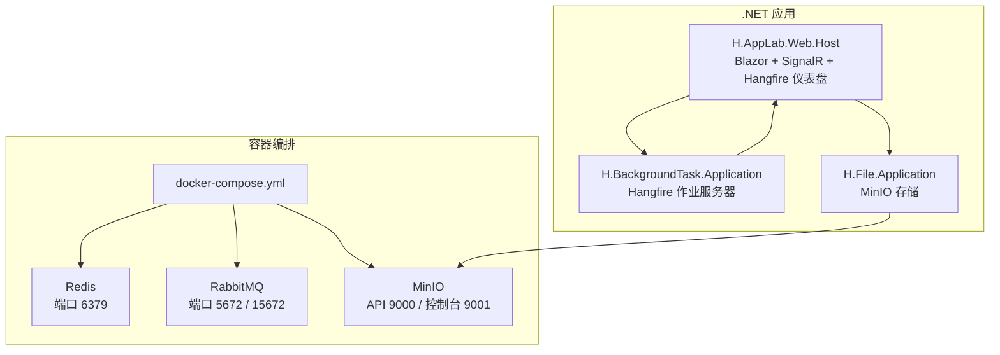
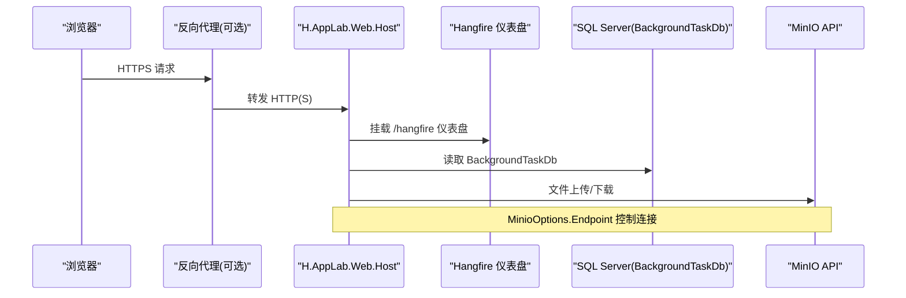
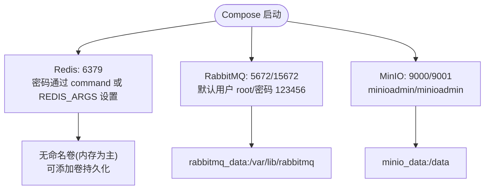
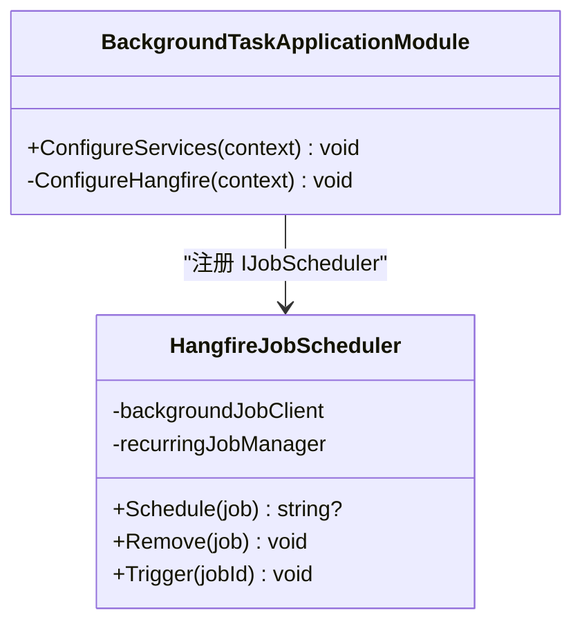
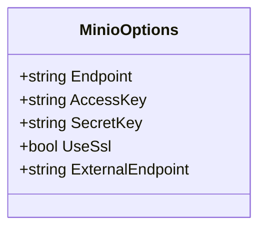
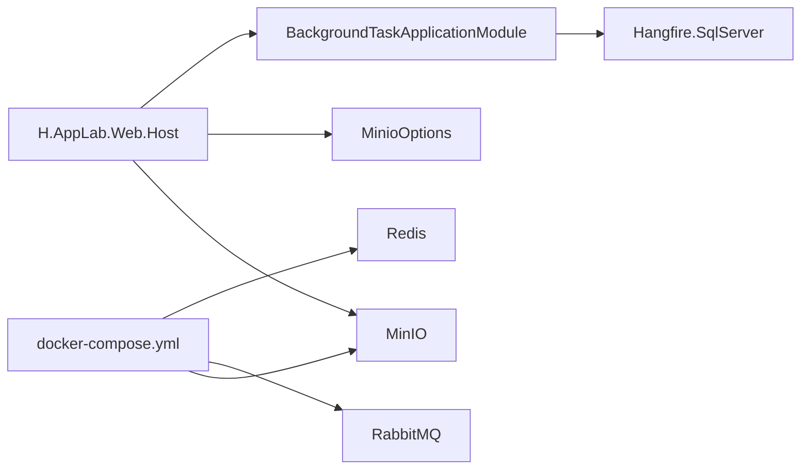

# Docker 容器化部署

<cite>
**本文引用的文件**   
- [cd/docker-compose.yml](file://cd/docker-compose.yml)
- [H.AppLab.Web.Host/appsettings.json](file://src/Host/H.AppLab.Web.Host/H.AppLab.Web.Host/appsettings.json)
- [Program.cs](file://src/Host/H.AppLab.Web.Host/H.AppLab.Web.Host/Program.cs)
- [MinioOptions.cs](file://src/Services/File/H.File.Application/MinioOptions.cs)
- [BackgroundTaskApplicationModule.cs](file://src/Services/BackgroundTask/H.BackgroundTask.Application/BackgroundTaskApplicationModule.cs)
- [HangfireJobScheduler.cs](file://src/Services/BackgroundTask/H.BackgroundTask.Application/Services/HangfireJobScheduler.cs)
</cite>

## 目录
1. [引言](#引言)
2. [项目结构](#项目结构)
3. [核心组件](#核心组件)
4. [架构总览](#架构总览)
5. [详细组件分析](#详细组件分析)
6. [.NET 应用 Dockerfile 编写指南](#net-应用-dockerfile-编写指南)
7. [依赖服务与配置说明](#依赖服务与配置说明)
8. [生产环境部署建议](#生产环境部署建议)
9. [依赖关系分析](#依赖关系分析)
10. [性能考虑](#性能考虑)
11. [故障排查指南](#故障排查指南)
12. [结论](#结论)

## 引言
本文件面向 AppLab 的容器化部署，围绕 cd/docker-compose.yml 中已定义的 Redis、RabbitMQ、MinIO 三个依赖服务，结合 .NET Web 宿主项目的运行时配置，给出完整的部署、配置、安全、运维与排障文档。仓库中未包含 .NET 应用的 Dockerfile，因此本文在“Dockerfile 编写指南”部分提供基于现有代码结构的最佳实践方案。

## 项目结构
AppLab 是 .NET ABP 风格的多服务解决方案，Web 宿主位于 src/Host/H.AppLab.Web.Host，后台任务通过 Hangfire 持久化到数据库，文件存储通过 MinIO 实现。依赖服务统一由 cd/docker-compose.yml 编排。

图表来源
- [cd/docker-compose.yml:1-48](file://cd/docker-compose.yml#L1-L48)
- [Program.cs:1-113](file://src/Host/H.AppLab.Web.Host/H.AppLab.Web.Host/Program.cs#L1-L113)
- [BackgroundTaskApplicationModule.cs:1-55](file://src/Services/BackgroundTask/H.BackgroundTask.Application/BackgroundTaskApplicationModule.cs#L1-L55)
- [MinioOptions.cs:1-14](file://src/Services/File/H.File.Application/MinioOptions.cs#L1-L14)

章节来源
- [cd/docker-compose.yml:1-48](file://cd/docker-compose.yml#L1-L48)

## 核心组件
- 容器编排：Redis、RabbitMQ、MinIO 三个外部依赖服务由 docker-compose 管理，暴露必要端口，并通过环境变量和卷进行配置与持久化。
- Web 宿主：Blazor 交互式 WASM 站点，启用 SignalR、响应压缩、Hangfire 仪表盘；使用 Autofac、ABP 模块化加载各服务。
- 后台任务：Hangfire 作为作业调度器，使用 SQL Server 连接字符串 BackgroundTaskDb 作为作业存储。
- 文件存储：MinIO 作为对象存储后端，应用侧通过 MinioOptions 配置端点、密钥和是否使用 SSL。

章节来源
- [Program.cs:1-113](file://src/Host/H.AppLab.Web.Host/H.AppLab.Web.Host/Program.cs#L1-L113)
- [BackgroundTaskApplicationModule.cs:1-55](file://src/Services/BackgroundTask/H.BackgroundTask.Application/BackgroundTaskApplicationModule.cs#L1-L55)
- [MinioOptions.cs:1-14](file://src/Services/File/H.File.Application/MinioOptions.cs#L1-L14)

## 架构总览
下图展示容器内外的主要交互：Web 宿主对外暴露 HTTPS，内部调用 Hangfire 仪表盘、SignalR 实时通信；后台任务执行引擎依赖数据库；文件上传下载走 MinIO API；RabbitMQ 当前在编排中存在但应用侧未见显式 RabbitMQ 客户端集成（以仓库实际代码为准）。

图表来源
- [Program.cs:60-113](file://src/Host/H.AppLab.Web.Host/H.AppLab.Web.Host/Program.cs#L60-L113)
- [BackgroundTaskApplicationModule.cs:27-55](file://src/Services/BackgroundTask/H.BackgroundTask.Application/BackgroundTaskApplicationModule.cs#L27-L55)
- [MinioOptions.cs:1-14](file://src/Services/File/H.File.Application/MinioOptions.cs#L1-L14)

## 详细组件分析

### 依赖服务定义与启动参数
- Redis
  - 镜像：redis:8.8-alpine
  - 容器名：redis，主机名：redishost
  - 端口：宿主机 6379 映射至容器 6379
  - 环境变量：时区 Asia/Shanghai、语言 en_US.UTF-8
  - 认证：同时定义了 REDIS_ARGS 与 command 两种方式设置密码，需注意二者可能冲突，应以最终生效的 command 为准
- RabbitMQ
  - 镜像：rabbitmq:4.0-management-alpine
  - 容器名：rabbitmq
  - 端口：5672（AMQP）、15672（管理界面）
  - 数据卷：rabbitmq_data 持久化至 /var/lib/rabbitmq
  - 环境变量：默认用户 root、密码 123456，时区 Asia/Shanghai
- MinIO
  - 镜像：minio/minio:latest
  - 容器名：minio
  - 端口：API 9000、控制台 9001（映射为宿主机 9010、9011）
  - 数据卷：minio_data 持久化至 /data
  - 环境变量：根用户名/密码均为 minioadmin，时区 Asia/Shanghai
  - 命令：server /data --console-address ":9001"

图表来源
- [cd/docker-compose.yml:1-48](file://cd/docker-compose.yml#L1-L48)

章节来源
- [cd/docker-compose.yml:1-48](file://cd/docker-compose.yml#L1-L48)

### .NET Web 宿主关键配置
- Blazor 交互式 WASM 与 SignalR
- JSON 序列化策略采用驼峰命名
- 启用 Brotli/Gzip 响应压缩
- 异常处理、HSTS、HTTPS 重定向
- 静态资源托管并开启缓存策略
- 挂载 Hangfire 仪表盘于 /hangfire

章节来源
- [Program.cs:1-113](file://src/Host/H.AppLab.Web.Host/H.AppLab.Web.Host/Program.cs#L1-L113)

### 后台任务与 Hangfire
- 模块 BackgroundTaskApplicationModule 注册 Hangfire，读取配置 ConnectionStrings["BackgroundTaskDb"] 作为作业存储
- 使用 SqlServerStorageOptions 配置超时、隔离级别等
- 自动启动 Hangfire 作业服务器随宿主运行
- HangfireJobScheduler 支持一次性任务、延迟任务与周期任务（Cron），并按约定生成周期性任务 ID

图表来源
- [BackgroundTaskApplicationModule.cs:1-55](file://src/Services/BackgroundTask/H.BackgroundTask.Application/BackgroundTaskApplicationModule.cs#L1-L55)
- [HangfireJobScheduler.cs:1-89](file://src/Services/BackgroundTask/H.BackgroundTask.Application/Services/HangfireJobScheduler.cs#L1-L89)

章节来源
- [BackgroundTaskApplicationModule.cs:1-55](file://src/Services/BackgroundTask/H.BackgroundTask.Application/BackgroundTaskApplicationModule.cs#L1-L55)
- [HangfireJobScheduler.cs:1-89](file://src/Services/BackgroundTask/H.BackgroundTask.Application/Services/HangfireJobScheduler.cs#L1-L89)

### MinIO 配置模型
- MinioOptions 包含 Endpoint、AccessKey、SecretKey、UseSsl、ExternalEndpoint
- appsettings.json 中 Minio 节点字段与 MinioOptions 属性一致，用于注入到存储服务

图表来源
- [MinioOptions.cs:1-14](file://src/Services/File/H.File.Application/MinioOptions.cs#L1-L14)

章节来源
- [MinioOptions.cs:1-14](file://src/Services/File/H.File.Application/MinioOptions.cs#L1-L14)

## .NET 应用 Dockerfile 编写指南
仓库未提供 .NET 应用的 Dockerfile，以下为基于现有程序结构与运行时行为的推荐写法要点：

- 多阶段构建
  - 构建阶段：安装 .NET SDK，还原 NuGet 包，发布 H.AppLab.Web.Host 与相关服务项目
  - 运行阶段：使用精简基础镜像（如 mcr.microsoft.com/dotnet/aspnet:8.0-alpine）复制发布产物
- 运行用户与安全
  - 非 root 用户运行进程
  - 仅复制必要文件，避免源码进入运行镜像
- 环境变量与配置
  - 通过环境变量覆盖 appsettings.json 中的敏感项（数据库连接串、MinIO 密钥等）
  - 使用 ASPNETCORE_URLS 指定监听地址，例如 http://+:8080
- 健康检查
  - 在容器层面增加 healthcheck，探测 /healthz 或 /hangfire（需鉴权保护）
- 资源限制
  - 为容器设置 CPU/内存上限，防止 OOM
- 日志输出
  - 将 Serilog 输出到 stdout/stderr，便于 Kubernetes/Docker 收集

注意：具体镜像版本、路径与项目名需根据实际解决方案结构确定。

[本节为通用指南，不直接分析特定源文件]

## 依赖服务与配置说明

### 数据库连接字符串
- 宿主的 appsettings.json 中 ConnectionStrings 包含多个业务库连接串（OrganizationDb、AccountDb、DesignEngineDb、RenderEngineDb、ApprovalDb、NotificationDb、WorkbenchDb、EnterpriseDb、OrderDb、SettingDb、SupplyChainDb、TestingDb、BackgroundTaskDb、FileDb）
- 这些连接串当前指向本地 LocalDB，生产环境应替换为远程 SQL Server 或云数据库连接串
- 后台任务 Hangfire 使用 BackgroundTaskDb 作为作业存储

章节来源
- [H.AppLab.Web.Host/appsettings.json:1-147](file://src/Host/H.AppLab.Web.Host/H.AppLab.Web.Host/appsettings.json#L1-L147)
- [BackgroundTaskApplicationModule.cs:27-55](file://src/Services/BackgroundTask/H.BackgroundTask.Application/BackgroundTaskApplicationModule.cs#L27-L55)

### Redis 配置
- 编排文件中启用了 Redis 密码认证
- 当前应用侧未发现 StackExchange.Redis 或 IDistributedCache 的显式集成（以仓库实际代码为准）
- 若后续引入分布式缓存或会话持久化，需在宿主中注册 Redis 并提供连接信息

章节来源
- [cd/docker-compose.yml:1-48](file://cd/docker-compose.yml#L1-L48)

### RabbitMQ 配置
- 编排文件暴露了 RabbitMQ AMQP 与管理界面
- 当前应用侧未发现 RabbitMQ.Client 或消息队列集成的显式引用（以仓库实际代码为准）
- 若后续引入消息队列，应在对应服务的 Program 或模块中注册客户端并配置连接串

章节来源
- [cd/docker-compose.yml:1-48](file://cd/docker-compose.yml#L1-L48)

### MinIO 配置
- 宿主的 appsettings.json 中包含 Minio 节点，字段与 MinioOptions 一致
- 默认 Endpoint 为 localhost:9010，AccessKey/SecretKey 为 minioadmin/minioadmin
- 控制台 ExternalEndpoint 为 http://localhost:9011
- 生产环境应将 Endpoint 改为容器网络名或域名，并根据需要启用 UseSsl

章节来源
- [H.AppLab.Web.Host/appsettings.json:120-147](file://src/Host/H.AppLab.Web.Host/H.AppLab.Web.Host/appsettings.json#L120-L147)
- [MinioOptions.cs:1-14](file://src/Services/File/H.File.Application/MinioOptions.cs#L1-L14)

## 生产环境部署建议

### 反向代理（Nginx/Apache）
- 将外部 HTTPS 流量反代到容器的 8080 端口
- 配置 WebSocket 支持以兼容 SignalR
- 启用 GZIP/Brotli 压缩，减少 WASM 体积传输
- 对 /hangfire 增加访问控制（IP 白名单或额外鉴权）

### SSL 证书
- 推荐使用 Let’s Encrypt 或企业 CA 签发证书
- 在反向代理层终止 TLS，容器内仅处理 HTTP
- 确保证书轮换自动化

### 负载均衡
- 多实例 Web 宿主置于负载均衡之后
- 若引入 Redis 分布式缓存，需确保所有实例共享同一 Redis 实例
- 会话状态建议使用分布式存储而非 In-Memory

### 健康检查端点
- 建议新增 /healthz 或 /ready 端点
- 在容器编排或编排平台（Kubernetes）中使用该端点进行存活与就绪探针

### 监控集成（Prometheus/Grafana）
- 在宿主中集成 Prometheus Metrics 中间件，暴露 /metrics
- 使用 Grafana 拉取指标，展示 QPS、错误率、延迟分布
- 对 Hangfire 仪表盘接入访问审计与告警

### 日志收集（ELK/EFK）
- 使用 Serilog 将结构化日志输出到 stdout/stderr
- 由 Fluent Bit/Fluentd 采集后推送至 Elasticsearch/OpenSearch
- Kibana/Opensearch Dashboards 进行可视化检索

### 安全最佳实践
- 不在容器镜像中硬编码敏感信息，一律使用环境变量或密钥管理系统注入
- 最小权限原则：容器内运行用户非 root
- 仅暴露必要端口，隐藏管理面（Hangfire/RabbitMQ 管理界面）
- 定期更新基础镜像与依赖包

[本节为通用指导，不直接分析特定源文件]

## 依赖关系分析

图表来源
- [Program.cs:1-113](file://src/Host/H.AppLab.Web.Host/H.AppLab.Web.Host/Program.cs#L1-L113)
- [BackgroundTaskApplicationModule.cs:1-55](file://src/Services/BackgroundTask/H.BackgroundTask.Application/BackgroundTaskApplicationModule.cs#L1-L55)
- [MinioOptions.cs:1-14](file://src/Services/File/H.File.Application/MinioOptions.cs#L1-L14)
- [cd/docker-compose.yml:1-48](file://cd/docker-compose.yml#L1-L48)

章节来源
- [Program.cs:1-113](file://src/Host/H.AppLab.Web.Host/H.AppLab.Web.Host/Program.cs#L1-L113)
- [BackgroundTaskApplicationModule.cs:1-55](file://src/Services/BackgroundTask/H.BackgroundTask.Application/BackgroundTaskApplicationModule.cs#L1-L55)
- [MinioOptions.cs:1-14](file://src/Services/File/H.File.Application/MinioOptions.cs#L1-L14)
- [cd/docker-compose.yml:1-48](file://cd/docker-compose.yml#L1-L48)

## 性能考虑
- 启用 Brotli/Gzip 压缩，降低 WASM 与静态资源传输大小
- 合理设置 Hangfire 的 SQL Server 选项（超时、隔离级别、轮询间隔）
- 对 MinIO 使用连接池与合适的分片大小，提升大文件上传/下载吞吐
- 为容器设置 CPU/内存限制，配合反向代理的连接数限制
- 使用 CDN 缓存静态资源，减轻宿主压力

[本节为通用指导，不直接分析特定源文件]

## 故障排查指南

### Redis 连接失败
- 确认容器是否成功启动且端口 6379 可达
- 检查密码认证方式：compose 中同时存在 REDIS_ARGS 与 command 设置密码，可能存在冲突；确认实际生效的命令
- 应用侧尚未发现 Redis 集成，若后续引入，请检查连接串与防火墙策略

章节来源
- [cd/docker-compose.yml:1-48](file://cd/docker-compose.yml#L1-L48)

### RabbitMQ 管理界面不可用
- 确认 15672 端口已开放
- 使用默认账号 root/密码 123456 登录
- 若应用侧未使用 RabbitMQ，可暂时移除相关容器或禁用端口

章节来源
- [cd/docker-compose.yml:1-48](file://cd/docker-compose.yml#L1-L48)

### MinIO 无法连接
- 检查 Endpoint 是否与 appsettings.json 中 Minio.Endpoint 一致
- 确认 AccessKey/SecretKey 正确
- 若 UseSsl 为 true，需确保反向代理或 MinIO 配置了有效证书
- 控制台访问地址应为 ExternalEndpoint（默认 http://localhost:9011）

章节来源
- [H.AppLab.Web.Host/appsettings.json:120-147](file://src/Host/H.AppLab.Web.Host/H.AppLab.Web.Host/appsettings.json#L120-L147)
- [MinioOptions.cs:1-14](file://src/Services/File/H.File.Application/MinioOptions.cs#L1-L14)

### Hangfire 仪表盘无法访问或作业不执行
- 确认 /hangfire 可通过反向代理访问并已做访问控制
- 检查 BackgroundTaskDb 连接串是否正确且可写
- 查看 Hangfire 仪表盘的 Jobs 面板与异常日志

章节来源
- [Program.cs:60-113](file://src/Host/H.AppLab.Web.Host/H.AppLab.Web.Host/Program.cs#L60-L113)
- [BackgroundTaskApplicationModule.cs:27-55](file://src/Services/BackgroundTask/H.BackgroundTask.Application/BackgroundTaskApplicationModule.cs#L27-L55)

## 结论
AppLab 的容器化部署以 docker-compose 为核心，统一管理 Redis、RabbitMQ、MinIO 三个依赖服务；Web 宿主通过 ABP 模块化组织功能，并使用 Hangfire 与 MinIO 分别承担后台任务与对象存储。当前仓库未包含 .NET 应用的 Dockerfile，建议按照本文的编写指南补齐，并结合反向代理、SSL、负载均衡、监控与日志体系完善生产环境能力。对于尚未在应用侧显式使用的 Redis 与 RabbitMQ，可在引入相应能力后再逐步完成集成与配置。