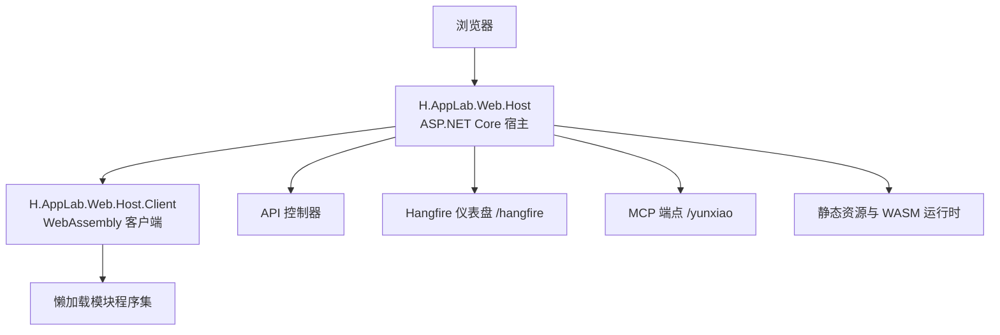
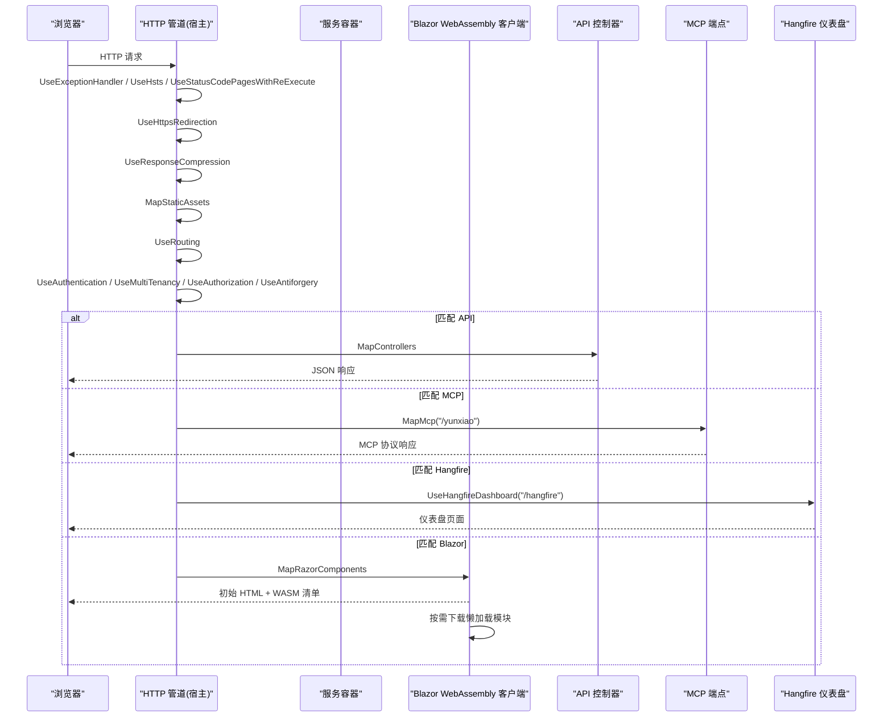
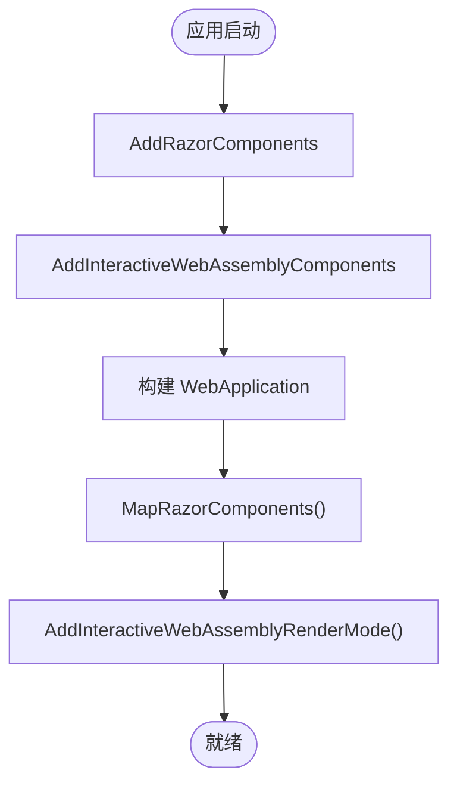
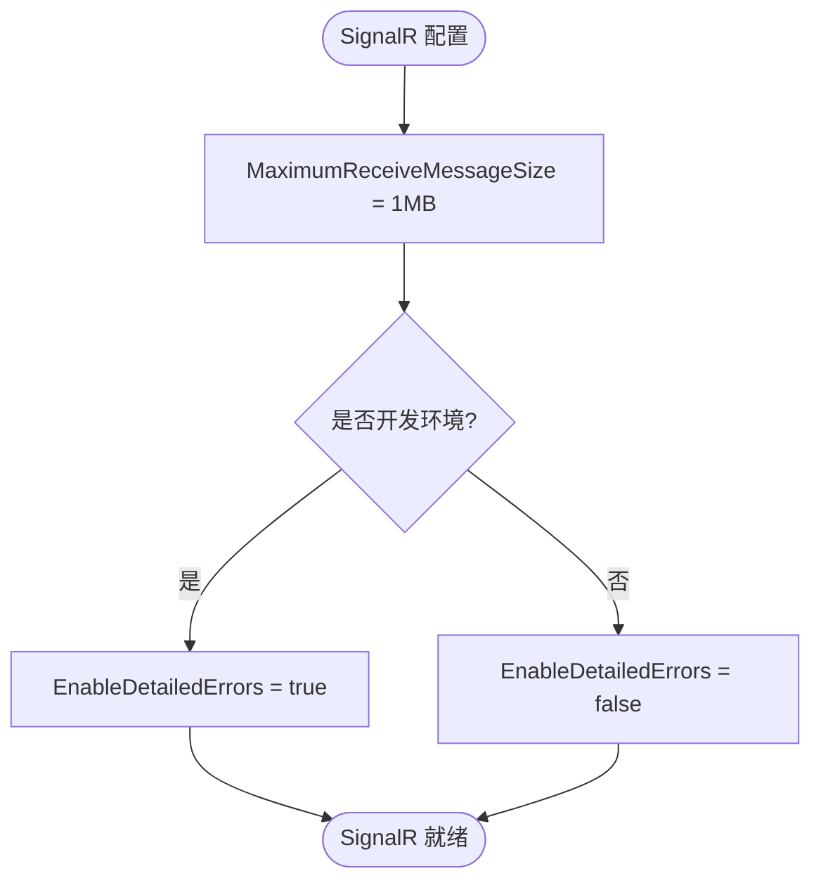
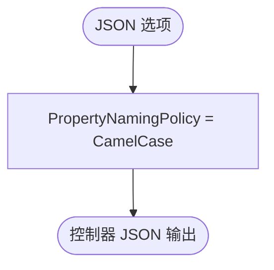
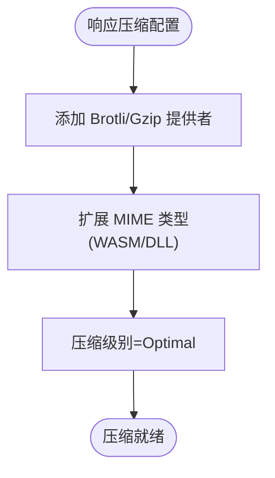
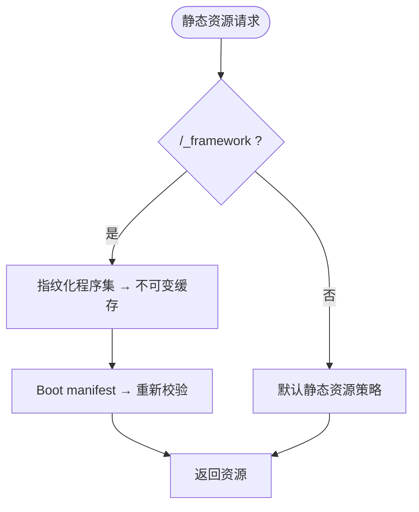
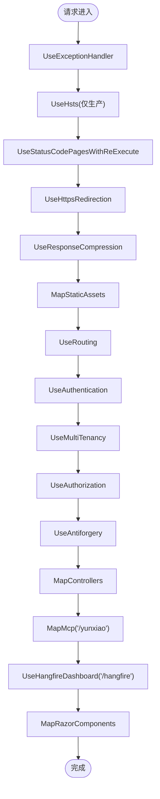

# Web 宿主（Blazor Web App）

<cite>
**本文引用的文件**
- [Program.cs](file://src/Host/H.AppLab.Web.Host/H.AppLab.Web.Host/Program.cs)
- [H.AppLab.Web.Host.csproj](file://src/Host/H.AppLab.Web.Host/H.AppLab.Web.Host/H.AppLab.Web.Host.csproj)
- [H.AppLab.Web.Host.Client.csproj](file://src/Host/H.AppLab.Web.Host/H.AppLab.Web.Host.Client/H.AppLab.Web.Host.Client.csproj)
</cite>

## 目录
1. [引言](#引言)
2. [项目结构](#项目结构)
3. [核心组件](#核心组件)
4. [架构总览](#架构总览)
5. [详细组件分析](#详细组件分析)
6. [依赖关系分析](#依赖关系分析)
7. [性能与生产部署](#性能与生产部署)
8. [故障排查指南](#故障排查指南)
9. [结论](#结论)

## 引言
本文聚焦 H.AppLab.Web.Host，即基于 Blazor Web App 的 ASP.NET Core Web 宿主。重点解释 Program.cs 中的服务注册、中间件管道顺序、SignalR 配置、JSON 序列化设置、响应压缩优化 WASM 传输、静态资源托管策略，以及 AddAdditionalAssemblies 注册的多个模块程序集如何参与 WebAssembly 懒加载。同时给出生产部署注意事项、性能调优建议与常见问题排查方法。

## 项目结构
H.AppLab.Web.Host 由两个主要项目组成：
- H.AppLab.Web.Host：ASP.NET Core Web 应用，负责 Blazor Web App 渲染、API 控制器、Hangfire 仪表盘、MCP 端点、中间件管道和模块化程序集发现。
- H.AppLab.Web.Host.Client：Blazor WebAssembly 客户端，负责浏览器端 UI 运行与按需懒加载模块。

**图表来源**
- [Program.cs:1-113](file://src/Host/H.AppLab.Web.Host/H.AppLab.Web.Host/Program.cs#L1-L113)
- [H.AppLab.Web.Host.Client.csproj:1-147](file://src/Host/H.AppLab.Web.Host/H.AppLab.Web.Host.Client/H.AppLab.Web.Host.Client.csproj#L1-L147)

**章节来源**
- [Program.cs:1-113](file://src/Host/H.AppLab.Web.Host/H.AppLab.Web.Host/Program.cs#L1-L113)
- [H.AppLab.Web.Host.csproj:1-66](file://src/Host/H.AppLab.Web.Host/H.AppLab.Web.Host/H.AppLab.Web.Host.csproj#L1-L66)
- [H.AppLab.Web.Host.Client.csproj:1-147](file://src/Host/H.AppLab.Web.Host/H.AppLab.Web.Host.Client/H.AppLab.Web.Host.Client.csproj#L1-L147)

## 核心组件
- Blazor 混合渲染：AddRazorComponents + AddInteractiveWebAssemblyComponents，启用服务器端 Razor 与 WebAssembly 交互渲染的组合模式；MapRazorComponents 上再添加 AddInteractiveWebAssemblyRenderMode，表示页面在需要时以交互式 WebAssembly 方式渲染。
- SignalR：用于实时通信，限制最大接收消息大小为 1MB，开发环境开启详细错误信息。
- JSON 序列化：使用 System.Text.Json，统一属性命名策略为驼峰命名。
- 响应压缩：启用 Brotli 与 Gzip，针对 HTTPS 启用，并将 application/wasm、application/dll 等 MIME 类型加入压缩列表，降低 WASM 传输体积。
- 静态资源托管：通过 MapStaticAssets 提供 WASM 运行时与模块程序集的静态文件服务，并处理内容指纹化缓存。
- 多租户、认证、授权、防伪令牌：UseMultiTenancy、UseAuthentication、UseAuthorization、UseAntiforgery 按标准顺序挂载。
- API 路由：MapControllers 注册 MVC/Web API 控制器。
- MCP 服务端点：MapMcp("/yunxiao") 暴露 MCP 接口，并允许匿名访问。
- Hangfire 后台任务仪表盘：UseHangfireDashboard("/hangfire")。
- 模块程序集发现：AddAdditionalAssemblies 注册多个 Web 模块的程序集，使 Blazor 能发现并懒加载这些模块的组件与服务。

**章节来源**
- [Program.cs:10-113](file://src/Host/H.AppLab.Web.Host/H.AppLab.Web.Host/Program.cs#L10-L113)

## 架构总览
下图展示从浏览器到宿主的请求路径，包括错误处理、HTTPS 重定向、压缩、静态资源、路由、认证、授权、反伪造、API、MCP、Hangfire 与 Blazor 组件映射。

**图表来源**
- [Program.cs:42-113](file://src/Host/H.AppLab.Web.Host/H.AppLab.Web.Host/Program.cs#L42-L113)

## 详细组件分析

### 服务注册与 Blazor 混合渲染
- 注册 Blazor 服务：AddRazorComponents 构建 Blazor Web App 基础能力；AddInteractiveWebAssemblyComponents 启用 WebAssembly 交互渲染能力。
- 页面级渲染模式：MapRazorComponents<App>().AddInteractiveWebAssemblyRenderMode() 将根组件 App 设置为可交互式 WebAssembly 渲染，使页面根据条件或路由切换到客户端执行。

**图表来源**
- [Program.cs:10-12](file://src/Host/H.AppLab.Web.Host/H.AppLab.Web.Host/Program.cs#L10-L12)
- [Program.cs:100-113](file://src/Host/H.AppLab.Web.Host/H.AppLab.Web.Host/Program.cs#L100-L113)

**章节来源**
- [Program.cs:10-12](file://src/Host/H.AppLab.Web.Host/H.AppLab.Web.Host/Program.cs#L10-L12)
- [Program.cs:100-113](file://src/Host/H.AppLab.Web.Host/H.AppLab.Web.Host/Program.cs#L100-L113)

### SignalR 配置
- MaximumReceiveMessageSize 设置为 1MB，避免大消息被拒绝。
- EnableDetailedErrors 仅在开发环境启用，便于调试但生产关闭以减少敏感信息泄露风险。

**图表来源**
- [Program.cs:14-19](file://src/Host/H.AppLab.Web.Host/H.AppLab.Web.Host/Program.cs#L14-L19)

**章节来源**
- [Program.cs:14-19](file://src/Host/H.AppLab.Web.Host/H.AppLab.Web.Host/Program.cs#L14-L19)

### JSON 序列化设置
- 使用 System.Text.Json，PropertyNamingPolicy 设为驼峰命名，保证前后端 JSON 字段一致性。

**图表来源**
- [Program.cs:21-26](file://src/Host/H.AppLab.Web.Host/H.AppLab.Web.Host/Program.cs#L21-L26)

**章节来源**
- [Program.cs:21-26](file://src/Host/H.AppLab.Web.Host/H.AppLab.Web.Host/Program.cs#L21-L26)

### 响应压缩与 WASM 优化
- 启用 ResponseCompression，支持 Brotli 与 Gzip，且对 HTTPS 启用。
- 扩展 MIME 类型包含 application/octet-stream、application/wasm、application/dll，确保 WASM 与 DLL 等资源被压缩，显著减少传输体积。
- 压缩级别设为 Optimal，平衡 CPU 与带宽。

**图表来源**
- [Program.cs:28-41](file://src/Host/H.AppLab.Web.Host/H.AppLab.Web.Host/Program.cs#L28-L41)

**章节来源**
- [Program.cs:28-41](file://src/Host/H.AppLab.Web.Host/H.AppLab.Web.Host/Program.cs#L28-L41)

### 静态资源托管与 WASM 指纹化缓存
- MapStaticAssets 统一处理静态资源，包括 Blazor 运行时、boot manifest 及模块程序集。
- 内容指纹化的 WASM 程序集会获得不可变长缓存；boot manifest 本身不带指纹，保留重新校验语义。
- 切勿将整个 /_framework 标记为 immutable，否则当应用重新构建后，指纹文件名变化但浏览器仍复用旧的 boot manifest，导致旧程序集 404，页面卡在“加载中...”。

**图表来源**
- [Program.cs:46-58](file://src/Host/H.AppLab.Web.Host/H.AppLab.Web.Host/Program.cs#L46-L58)

**章节来源**
- [Program.cs:46-58](file://src/Host/H.AppLab.Web.Host/H.AppLab.Web.Host/Program.cs#L46-L58)

### 中间件管道顺序与职责
- UseExceptionHandler：集中捕获异常并转发到 /Error。
- UseHsts：生产环境启用 HTTP Strict Transport Security。
- UseStatusCodePagesWithReExecute：非成功状态码重定向至 /not-found。
- UseHttpsRedirection：强制 HTTPS 重定向。
- UseResponseCompression：启用响应压缩。
- MapStaticAssets：静态资源与 WASM 运行时托管。
- UseRouting：路由解析。
- UseAuthentication：身份认证。
- UseMultiTenancy：多租户处理。
- UseAuthorization：授权检查。
- UseAntiforgery：防跨站请求伪造。
- MapControllers：API 控制器路由。
- MapMcp("/yunxiao")：MCP 服务端点，允许匿名访问。
- UseHangfireDashboard("/hangfire")：Hangfire 后台任务管理界面。
- MapRazorComponents：Blazor 组件路由与渲染。

**图表来源**
- [Program.cs:38-113](file://src/Host/H.AppLab.Web.Host/H.AppLab.Web.Host/Program.cs#L38-L113)

**章节来源**
- [Program.cs:38-113](file://src/Host/H.AppLab.Web.Host/H.AppLab.Web.Host/Program.cs#L38-L113)

### 模块程序集与 WebAssembly 懒加载
- 服务端 AddAdditionalAssemblies 注册多个模块程序集，使 Blazor 能发现这些模块中的组件、路由与服务。
- 客户端 H.AppLab.Web.Host.Client.csproj 中通过 BlazorWebAssemblyLazyLoad 声明大量程序集，实现导航时按需加载，而非在应用启动时全部下载。
- 已注册的服务端程序集包括 Portal、Account、Organization、Approval、LowCode.*、Util.Blazor、Testing、Notification、Workbench、Order、SupplyChain、BackgroundTask 等模块。

**图表来源**
- [Program.cs:100-113](file://src/Host/H.AppLab.Web.Host/H.AppLab.Web.Host/Program.cs#L100-L113)
- [H.AppLab.Web.Host.Client.csproj:10-120](file://src/Host/H.AppLab.Web.Host/H.AppLab.Web.Host.Client/H.AppLab.Web.Host.Client.csproj#L10-L120)

**章节来源**
- [Program.cs:100-113](file://src/Host/H.AppLab.Web.Host/H.AppLab.Web.Host/Program.cs#L100-L113)
- [H.AppLab.Web.Host.Client.csproj:10-120](file://src/Host/H.AppLab.Web.Host/H.AppLab.Web.Host.Client/H.AppLab.Web.Host.Client.csproj#L10-L120)

## 依赖关系分析
- 宿主项目引用了多个业务模块的应用层程序集（Portal、Account、Organization、Approval、Testing、Notification、Workbench、Order、Setting、SupplyChain、BackgroundTask、File、SystemPortal、Enterprise），以及 MCP 服务端与 LowCode 相关应用层。
- 客户端项目引用了对应 Web 模块的项目，并通过 BlazorWebAssemblyLazyLoad 声明懒加载程序集，从而在浏览器端按需加载。

**图表来源**
- [H.AppLab.Web.Host.csproj:10-66](file://src/Host/H.AppLab.Web.Host/H.AppLab.Web.Host/H.AppLab.Web.Host.csproj#L10-L66)
- [H.AppLab.Web.Host.Client.csproj:20-147](file://src/Host/H.AppLab.Web.Host/H.AppLab.Web.Host.Client/H.AppLab.Web.Host.Client.csproj#L20-L147)

**章节来源**
- [H.AppLab.Web.Host.csproj:10-66](file://src/Host/H.AppLab.Web.Host/H.AppLab.Web.Host/H.AppLab.Web.Host.csproj#L10-L66)
- [H.AppLab.Web.Host.Client.csproj:20-147](file://src/Host/H.AppLab.Web.Host/H.AppLab.Web.Host.Client/H.AppLab.Web.Host.Client.csproj#L20-L147)

## 性能与生产部署
- 启用 Brotli 与 Gzip 压缩，优先 Brotli，提升 WASM 与 DLL 传输效率。
- Release 模式下启用 AOT 编译，显著减少 WASM 启动时间。
- 裁剪器根程序集 TrimmerRootAssembly 指定 H.LowCode.Components，防止 AOT/Trim 误删反射引用类型。
- 静态资源缓存策略依赖 MapStaticAssets，不要手动把整个 /_framework 标记为 immutable。
- 生产环境应启用 UseHsts、UseExceptionHandler、UseStatusCodePagesWithReExecute 和 UseHttpsRedirection。
- SignalR 详细错误仅在开发环境启用，避免生产泄露诊断信息。
- JSON 使用驼峰命名，前后端保持一致。
- 多租户、认证、授权、防伪令牌按标准顺序挂载，确保安全策略生效。

[本节为通用指导，不直接分析具体代码文件]

## 故障排查指南
- 页面永久卡在“加载中...”：
  - 检查是否错误地将 /_framework 整体标记为 immutable。正确做法是让 MapStaticAssets 处理内容指纹化程序集的不可变缓存，而 boot manifest 保持重新校验语义。
  - 确认应用重新构建后，浏览器没有复用旧的 boot manifest。
- WASM 模块未加载：
  - 确认对应模块程序集已在 H.AppLab.Web.Host.Client.csproj 中声明为 BlazorWebAssemblyLazyLoad。
  - 确认服务端 AddAdditionalAssemblies 已注册该模块程序集。
- SignalR 连接失败：
  - 检查 MaximumReceiveMessageSize 是否满足需求。
  - 生产环境关闭 EnableDetailedErrors，并在服务端日志中排查连接问题。
- API 返回 JSON 字段大小写不一致：
  - 确认 PropertyNamingPolicy 为驼峰命名。
- 静态资源 404：
  - 确认 MapStaticAssets 在 UseRouting 之前。
  - 检查反向代理是否正确转发 /_framework 请求。
- Hangfire 无法访问：
  - 确认 UseHangfireDashboard("/hangfire") 已注册，并且认证/授权策略允许访问。
- MCP 端点不可用：
  - 确认 MapMcp("/yunxiao") 已注册，AllowAnonymous 允许匿名访问。

**章节来源**
- [Program.cs:38-113](file://src/Host/H.AppLab.Web.Host/H.AppLab.Web.Host/Program.cs#L38-L113)
- [H.AppLab.Web.Host.Client.csproj:10-120](file://src/Host/H.AppLab.Web.Host/H.AppLab.Web.Host.Client/H.AppLab.Web.Host.Client.csproj#L10-L120)

## 结论
H.AppLab.Web.Host 通过 Blazor Web App 的混合渲染模式，结合 SignalR、JSON 序列化、响应压缩与静态资源指纹化缓存，构建了高性能、可扩展的企业级前端宿主。中间件管道顺序清晰，覆盖错误处理、安全、认证、授权、防伪令牌、API、MCP、Hangfire 与 Blazor 组件映射。模块程序集在服务端注册，并在客户端通过 BlazorWebAssemblyLazyLoad 实现按需加载，有效降低首屏开销。生产部署需重点关注静态资源缓存策略、AOT 编译、压缩配置与安全头设置，并结合故障排查指南快速定位问题。