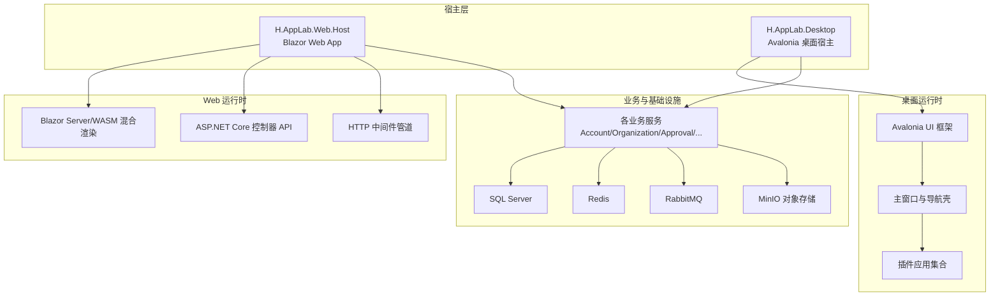
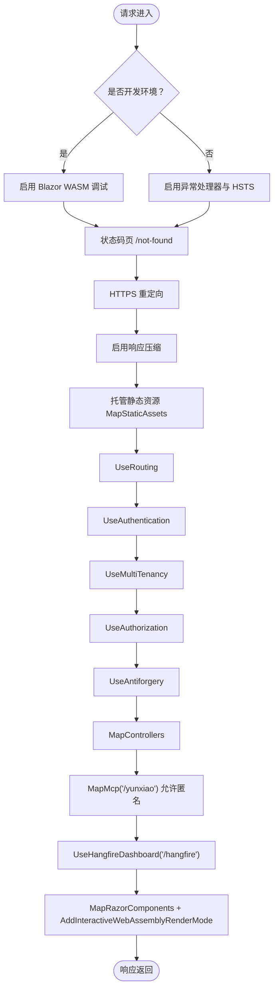
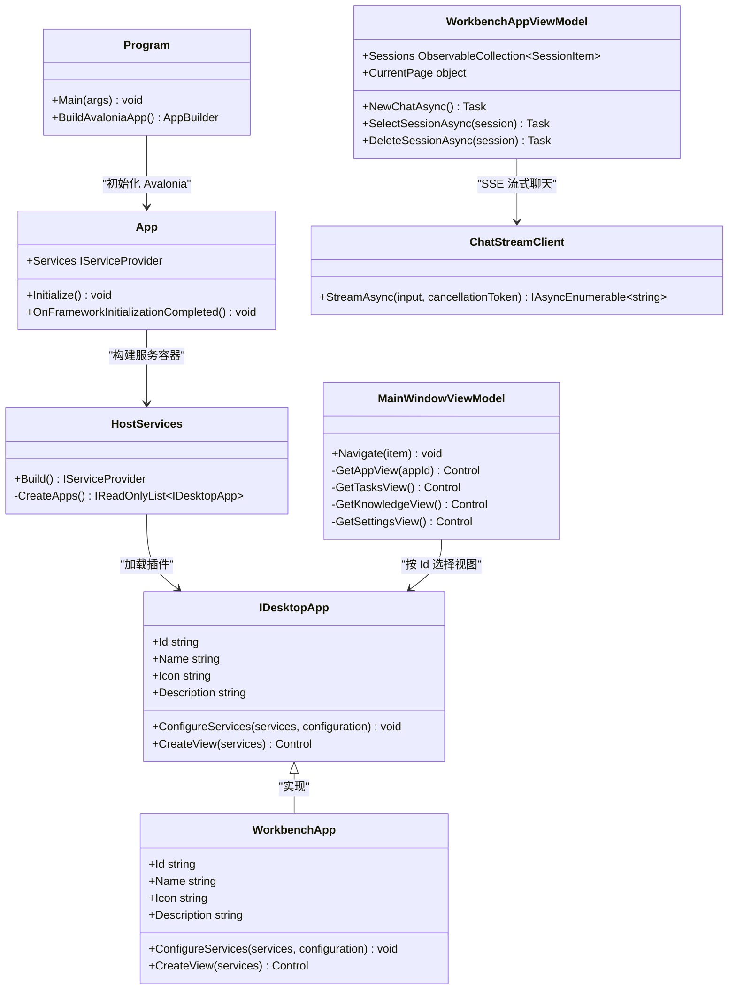
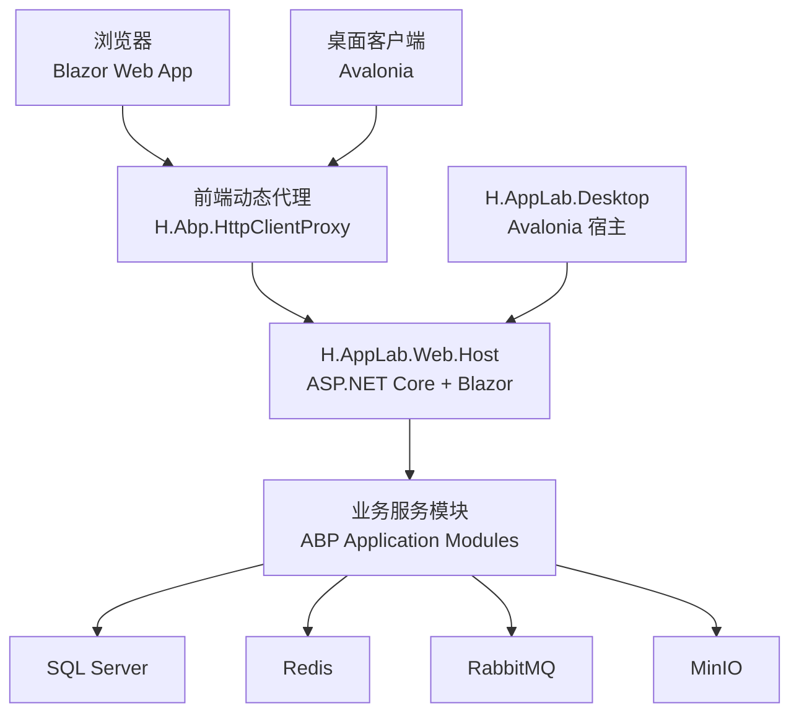
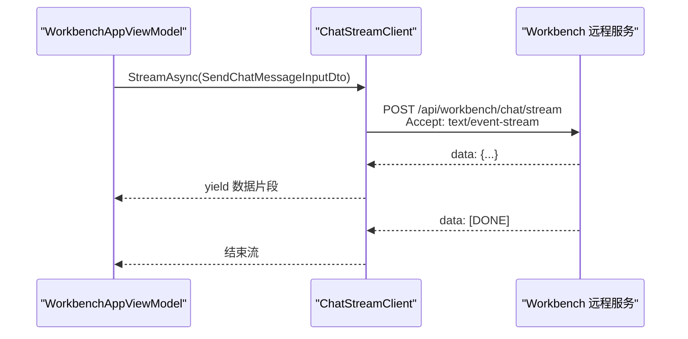
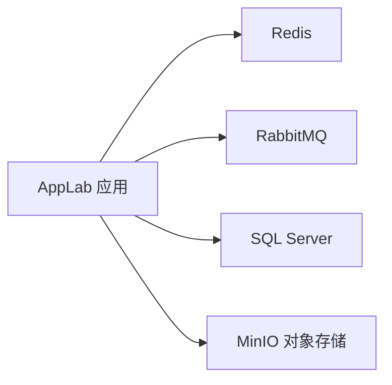

# 宿主与部署

<cite>
**本文引用的文件**   
- [README.md](file://README.md)
- [docker-compose.yml](file://cd/cd/docker-compose.yml)
- [Web 宿主 Program.cs](file://src/Host/H.AppLab.Web.Host/H.AppLab.Web.Host/Program.cs)
- [Web 宿主 HostAllModule.cs](file://src/Host/H.AppLab.Web.Host/H.AppLab.Web.Host/HostAllModule.cs)
- [Web 宿主应用配置 appsettings.json（服务端）](file://src/Host/H.AppLab.Web.Host/H.AppLab.Web.Host/appsettings.json)
- [Web 客户端应用配置 appsettings.json（浏览器端）](file://src/Host/H.AppLab.Web.Host/H.AppLab.Web.Host.Client/wwwroot/appsettings.json)
- [桌面宿主入口 Program.cs](file://src/Host/H.AppLab.Desktop/Program.cs)
- [桌面宿主 App.axaml.cs](file://src/Host/H.AppLab.Desktop/App.axaml.cs)
- [桌面宿主服务注册 HostServices.cs](file://src/Host/H.AppLab.Desktop/HostServices.cs)
- [桌面插件契约 IDesktopApp.cs](file://src/Host/H.AppLab.Desktop/IDesktopApp.cs)
- [桌面 Workbench 插件 WorkbenchApp.cs](file://src/Host/H.AppLab.Desktop/WorkbenchApp.cs)
- [桌面主窗口 ViewModel MainWindowViewModel.cs](file://src/Host/H.AppLab.Desktop/ViewModels/MainWindowViewModel.cs)
- [桌面 Workbench ViewModel WorkbenchAppViewModel.cs](file://src/Host/H.AppLab.Desktop/ViewModels/WorkbenchAppViewModel.cs)
- [桌面聊天流式客户端 ChatStreamClient.cs](file://src/Host/H.AppLab.Desktop/Services/ChatStreamClient.cs)
</cite>

## 目录
1. [引言](#引言)
2. [项目结构](#项目结构)
3. [核心宿主模式](#核心宿主模式)
4. [架构总览](#架构总览)
5. [详细组件分析](#详细组件分析)
6. [依赖与服务关系](#依赖与服务关系)
7. [容器化与部署](#容器化与部署)
8. [生产环境建议](#生产环境建议)
9. [性能考虑](#性能考虑)
10. [故障排查指南](#故障排查指南)
11. [结论](#结论)

## 引言
本文件面向 AppLab 的宿主程序与部署方案，重点说明两类宿主：
- H.AppLab.Web.Host：基于 Blazor Web App 的 Web 宿主，支持 Server + WebAssembly 混合渲染。
- H.AppLab.Desktop：基于 Avalonia 的桌面宿主，承载多个客户端应用，其中 Workbench 作为典型插件接入。

文档还覆盖 Web 宿主的静态资源托管、API 路由、中间件管道、认证与多租户；桌面宿主如何通过统一外壳加载插件；以及 Docker Compose 中 SQL Server、Redis、RabbitMQ、MinIO 等依赖服务的编排方式，并给出生产部署、负载均衡、健康检查、监控和性能调优建议。

## 项目结构
从宿主视角看，代码组织遵循“宿主仅做服务注册与管线装配，不含业务逻辑”的原则。Web 宿主通过 ABP 模块化机制聚合各业务模块；桌面宿主通过 Avalonia 提供统一外壳，并以插件接口承载多个客户端应用。

图表来源
- [Web 宿主 Program.cs:1-113](file://src/Host/H.AppLab.Web.Host/H.AppLab.Web.Host/Program.cs#L1-L113)
- [桌面宿主入口 Program.cs:1-19](file://src/Host/H.AppLab.Desktop/Program.cs#L1-L19)
- [桌面宿主 App.axaml.cs:1-35](file://src/Host/H.AppLab.Desktop/App.axaml.cs#L1-L35)

章节来源
- [README.md:1-73](file://README.md#L1-L73)

## 核心宿主模式

### H.AppLab.Web.Host（Blazor Web App 宿主）
Web 宿主承担以下职责：
- 启动 ASP.NET Core 应用并构建 HTTP 中间件管道。
- 启用 Blazor Server 与 WebAssembly 混合渲染。
- 注册所有业务模块的 ABP 应用服务与控制器。
- 配置 Cookie 认证、多租户、外部登录、Hangfire 仪表盘、响应压缩、静态资源托管。
- 暴露 MCP 工具路由 `/yunxiao`。

关键实现要点：
- 使用 `AddRazorComponents().AddInteractiveWebAssemblyComponents()` 启用混合渲染。
- 使用 `MapRazorComponents<App>().AddInteractiveWebAssemblyRenderMode()` 将 Blazor 页面以 WASM 模式渲染。
- 使用 `UseResponseCompression()` 配合 Brotli 与 Gzip 压缩，显式包含 `application/wasm` 与 `application/dll` MIME 类型，降低前端体积。
- 使用 `MapStaticAssets()` 托管静态资源，避免将整个 `_framework` 标记为不可变缓存，防止更新后指纹变化但旧清单仍引用已删除程序集导致静默 404。
- 中间件顺序：异常处理 → HTTPS 重定向 → 状态码页 → 响应压缩 → 静态资源 → 路由 → 认证 → 多租户 → 授权 → 反伪造 → 控制器 → MCP 路由 → Hangfire 仪表盘 → Blazor 组件映射。
- 开发环境启用 WASM 调试，生产环境启用 HSTS 与错误页。
- 通过 `HostAllModule` 注册所有业务模块的常规控制器与应用服务。

图表来源
- [Web 宿主 Program.cs:1-113](file://src/Host/H.AppLab.Web.Host/H.AppLab.Web.Host/Program.cs#L1-L113)

#### 认证、多租户与外部登录
- 认证采用 Cookie 模式，默认登录路径为 `/account/login`，系统管理员登录路径为 `/system/login`，会话过期时间为 24 小时，启用滑动过期。
- 多租户开启，并通过自定义 `ITenantStore` 从 Enterprise 数据库读取租户信息；解析器链首位注入基于 Claim 的租户解析贡献者，优先于内置解析器。
- 租户无效时，中间件清理 `__tenant` Cookie 并登出用户，然后重定向到首页，避免返回 404 阻断请求。
- 外部登录通过 `ExternalLoginOptions` 绑定微信与钉钉配置，并注册对应认证服务。

章节来源
- [Web 宿主 HostAllModule.cs:1-210](file://src/Host/H.AppLab.Web.Host/H.AppLab.Web.Host/HostAllModule.cs#L1-L210)

#### API 路由与控制器
- 所有业务模块通过 ABP 约定式控制器注册，包括 Account、Workbench、Organization、DesignEngine、RenderEngine、Approval、Testing、Portal、SystemPortal、Notification、Enterprise、Order、Setting、SupplyChain、BackgroundTask、File。
- 控制器由 `AbpAspNetCoreMvcOptions.ConventionalControllers.Create(...)` 批量注册，Web 宿主不手写业务控制器。
- JSON 序列化命名策略为驼峰命名，便于前端调用。

章节来源
- [Web 宿主 HostAllModule.cs:1-210](file://src/Host/H.AppLab.Web.Host/H.AppLab.Web.Host/HostAllModule.cs#L1-L210)

#### 静态资源与混合渲染
- 静态资源托管由 `MapStaticAssets()` 负责；指纹化的 WASM 程序集可走长缓存，而 Blazor 启动清单保持重新校验语义。
- 混合渲染通过 `AddInteractiveWebAssemblyRenderMode()` 启用，并将多个应用程序集加入额外程序集列表，使 Blazor 可按路由懒加载。
- 响应压缩启用 Brotli 与 Gzip，并对 `application/wasm`、`application/dll` 显式配置，减少 WASM 包传输大小。

章节来源
- [Web 宿主 Program.cs:1-113](file://src/Host/H.AppLab.Web.Host/H.AppLab.Web.Host/Program.cs#L1-L113)

#### 客户端远程服务地址
- 浏览器端在 `wwwroot/appsettings.json` 中维护各远程服务的 `BaseUrl`，供前端动态代理调用后端 IAppService。
- 该配置与服务器端 `appsettings.json` 中的 `RemoteServices` 节点保持一致，确保前后端访问同一组服务。

章节来源
- [Web 客户端应用配置 appsettings.json（浏览器端）:1-52](file://src/Host/H.AppLab.Web.Host/H.AppLab.Web.Host.Client/wwwroot/appsettings.json#L1-L52)
- [Web 宿主应用配置 appsettings.json（服务端）:1-147](file://src/Host/H.AppLab.Web.Host/H.AppLab.Web.Host/appsettings.json#L1-L147)

### H.AppLab.Desktop（Avalonia 桌面宿主）
桌面宿主的目标是提供一个统一的 Avalonia 外壳，承载多个客户端应用。当前已实现的典型插件是 Workbench。

主要职责：
- 启动 Avalonia 应用生命周期。
- 构建全局 `IServiceProvider`，注册宿主基础服务与插件应用。
- 主窗口 ViewModel 管理左侧菜单、内容区与插件视图缓存。
- 插件通过 `IDesktopApp` 契约接入，宿主在首次激活时创建并复用根视图。

图表来源
- [桌面宿主入口 Program.cs:1-19](file://src/Host/H.AppLab.Desktop/Program.cs#L1-L19)
- [桌面宿主 App.axaml.cs:1-35](file://src/Host/H.AppLab.Desktop/App.axaml.cs#L1-L35)
- [桌面宿主服务注册 HostServices.cs:1-47](file://src/Host/H.AppLab.Desktop/HostServices.cs#L1-L47)
- [桌面插件契约 IDesktopApp.cs:1-31](file://src/Host/H.AppLab.Desktop/IDesktopApp.cs#L1-L31)
- [桌面 Workbench 插件 WorkbenchApp.cs:1-69](file://src/Host/H.AppLab.Desktop/WorkbenchApp.cs#L1-L69)
- [桌面主窗口 ViewModel MainWindowViewModel.cs:1-195](file://src/Host/H.AppLab.Desktop/ViewModels/MainWindowViewModel.cs#L1-L195)
- [桌面 Workbench ViewModel WorkbenchAppViewModel.cs:1-191](file://src/Host/H.AppLab.Desktop/ViewModels/WorkbenchAppViewModel.cs#L1-L191)
- [桌面聊天流式客户端 ChatStreamClient.cs:1-62](file://src/Host/H.AppLab.Desktop/Services/ChatStreamClient.cs#L1-L62)

#### 插件接入流程
- `HostServices.Build()` 构建配置与 DI 容器，注册宿主基础服务，再遍历 `CreateApps()` 返回的插件集合，调用每个插件的 `ConfigureServices` 注册自身服务。
- `App.OnFrameworkInitializationCompleted()` 设置 `MainWindow` 的 `DataContext` 为 `MainWindowViewModel`。
- `MainWindowViewModel` 维护左侧菜单与内容区，按插件 Id 创建并缓存视图实例，切换时保留应用内状态。
- Workbench 插件通过 `WorkbenchApp` 注册 HttpClient 代理、ViewModel、Toast 服务与 SSE 流式客户端，并提供 `CreateView` 返回 `WorkbenchAppView`。

章节来源
- [桌面宿主服务注册 HostServices.cs:1-47](file://src/Host/H.AppLab.Desktop/HostServices.cs#L1-L47)
- [桌面宿主 App.axaml.cs:1-35](file://src/Host/H.AppLab.Desktop/App.axaml.cs#L1-L35)
- [桌面主窗口 ViewModel MainWindowViewModel.cs:1-195](file://src/Host/H.AppLab.Desktop/ViewModels/MainWindowViewModel.cs#L1-L195)
- [桌面 Workbench 插件 WorkbenchApp.cs:1-69](file://src/Host/H.AppLab.Desktop/WorkbenchApp.cs#L1-L69)

#### 与 Web 版本的差异
- Web 版本通过 Blazor Server/WASM 与 ASP.NET Core 中间件管道提供服务，适合浏览器场景与集群扩展。
- 桌面版本通过 Avalonia 提供原生桌面体验，插件通过 `IDesktopApp` 接入，无需浏览器环境与静态资源分发。
- 两者共享 Workbench 的远程服务契约，桌面端的 `ChatStreamClient` 与 Web 端 JS fetch 流实现一致，均对接 `/api/workbench/chat/stream`。

章节来源
- [桌面聊天流式客户端 ChatStreamClient.cs:1-62](file://src/Host/H.AppLab.Desktop/Services/ChatStreamClient.cs#L1-L62)

## 架构总览
下图展示 Web 与桌面两种宿主如何访问业务服务与基础设施。

图表来源
- [Web 宿主 HostAllModule.cs:1-210](file://src/Host/H.AppLab.Web.Host/H.AppLab.Web.Host/HostAllModule.cs#L1-L210)
- [桌面 Workbench 插件 WorkbenchApp.cs:1-69](file://src/Host/H.AppLab.Desktop/WorkbenchApp.cs#L1-L69)
- [桌面聊天流式客户端 ChatStreamClient.cs:1-62](file://src/Host/H.AppLab.Desktop/Services/ChatStreamClient.cs#L1-L62)

## 详细组件分析

### Web 宿主中间件与管道
- 异常处理与 HSTS：开发环境启用 WASM 调试，生产环境启用异常处理器与 HSTS。
- 状态码重定向：非 4xx/5xx 以外的状态码会重写到 `/not-found`。
- HTTPS 重定向：强制 HTTPS。
- 响应压缩：Brotli 与 Gzip，包含 `application/wasm`、`application/dll`。
- 静态资源：`MapStaticAssets()` 托管 `_framework` 等静态资源。
- 路由与认证：`UseRouting` → `UseAuthentication` → `UseMultiTenancy` → `UseAuthorization` → `UseAntiforgery`。
- 控制器与 MCP：`MapControllers`、`MapMcp("/yunxiao")`。
- Hangfire：`UseHangfireDashboard("/hangfire")`。
- Blazor：`MapRazorComponents<App>().AddInteractiveWebAssemblyRenderMode()`。

章节来源
- [Web 宿主 Program.cs:1-113](file://src/Host/H.AppLab.Web.Host/H.AppLab.Web.Host/Program.cs#L1-L113)

### Web 宿主认证与多租户
- Cookie 认证：两个 Scheme，普通用户登录 `/account/login`，系统管理员登录 `/system/login`，24 小时滑动过期。
- 多租户：启用多租户，自定义 `ITenantStore` 从 Enterprise 数据库读取租户；Claim 解析器优先。
- 租户无效处理：清理 `__tenant` Cookie、登出并重定向首页。
- 外部登录：微信与钉钉配置绑定，注册对应认证服务。

章节来源
- [Web 宿主 HostAllModule.cs:1-210](file://src/Host/H.AppLab.Web.Host/H.AppLab.Web.Host/HostAllModule.cs#L1-L210)

### 桌面宿主插件体系
- 插件契约：`IDesktopApp` 定义 Id、Name、Icon、Description、`ConfigureServices`、`CreateView`。
- 宿主服务注册：`HostServices` 统一加载配置，注册宿主基础服务，并遍历插件调用 `ConfigureServices`。
- 主窗口导航：`MainWindowViewModel` 维护菜单与内容区，按需创建并缓存插件视图。
- Workbench 插件：注册远程服务代理、HttpClient、ViewModel、Toast 服务，提供 SSE 流式聊天能力。

章节来源
- [桌面插件契约 IDesktopApp.cs:1-31](file://src/Host/H.AppLab.Desktop/IDesktopApp.cs#L1-L31)
- [桌面宿主服务注册 HostServices.cs:1-47](file://src/Host/H.AppLab.Desktop/HostServices.cs#L1-L47)
- [桌面主窗口 ViewModel MainWindowViewModel.cs:1-195](file://src/Host/H.AppLab.Desktop/ViewModels/MainWindowViewModel.cs#L1-L195)
- [桌面 Workbench 插件 WorkbenchApp.cs:1-69](file://src/Host/H.AppLab.Desktop/WorkbenchApp.cs#L1-L69)

### 聊天流式输出（SSE）
桌面端通过 `ChatStreamClient` 直接 POST 到 `/api/workbench/chat/stream`，接受 `text/event-stream`，逐行解析 `data:` 负载，遇到 `[DONE]` 结束。这与 Web 端 JS fetch 流实现保持一致。

图表来源
- [桌面聊天流式客户端 ChatStreamClient.cs:1-62](file://src/Host/H.AppLab.Desktop/Services/ChatStreamClient.cs#L1-L62)
- [桌面 Workbench ViewModel WorkbenchAppViewModel.cs:1-191](file://src/Host/H.AppLab.Desktop/ViewModels/WorkbenchAppViewModel.cs#L1-L191)

## 依赖与服务关系
Web 宿主与桌面宿主都依赖一系列基础设施服务。根据项目 README 与配置，依赖服务包括 Redis、RabbitMQ、SQL Server、MinIO。

图表来源
- [README.md:1-73](file://README.md#L1-L73)
- [Web 宿主应用配置 appsettings.json（服务端）:1-147](file://src/Host/H.AppLab.Web.Host/H.AppLab.Web.Host/appsettings.json#L1-L147)

## 容器化与部署

### Docker Compose 依赖服务
仓库提供的 docker-compose 文件位于 `cd/cd/docker-compose.yml`，用于本地或容器环境启动依赖服务。根据项目 README，应将其拷贝到 WSL 并执行 `sudo docker-compose up -d` 启动依赖服务。

依赖服务通常包括：
- SQL Server：用于持久化各业务库。
- Redis：缓存与会话等。
- RabbitMQ：消息队列，支撑后台任务与异步处理。
- MinIO：对象存储，用于文件上传与静态资源。

注意：
- 配置文件中的连接字符串与 MinIO 端点应与容器网络名称一致，例如数据库连接串指向容器主机名，MinIO 端点指向 `localhost:9010` 或容器映射端口。
- 若在生产环境运行，建议使用环境变量或外部密钥管理工具注入敏感配置。

章节来源
- [README.md:1-73](file://README.md#L1-L73)
- [docker-compose.yml](file://cd/cd/docker-compose.yml)

### 数据库迁移
- 使用 Tools 目录下各 DbMigrator 控制台程序创建或更新数据库结构，例如 `dotnet run --project src/Tools/H.Account.DbMigrator`。
- 在生产环境，建议在镜像构建阶段或启动前执行迁移，确保数据库结构与代码一致。

章节来源
- [README.md:1-73](file://README.md#L1-L73)

### 启动命令与默认地址
- 主程序为 `H.AppLab.Host.All`，默认地址 `http://localhost:5045`，HTTPS 为 `https://localhost:7065`。
- 命令行方式：`dotnet run --project src/Host/H.AppLab.Host.All/H.AppLab.Host.All --launch-profile HostAll`。

章节来源
- [README.md:1-73](file://README.md#L1-L73)

## 生产环境建议

### 部署拓扑
- 反向代理：使用 Nginx、Apache、IIS 或云厂商负载均衡器，将 `/` 转发到 Blazor Web App，`/hangfire` 仅对运维账号开放。
- 静态资源：启用 CDN 或边缘缓存，对指纹化 WASM 程序集使用长缓存；避免缓存未指纹化的启动清单。
- 会话与分布式：启用 Redis 会话与分布式缓存；如使用 SignalR，需配置 Redis Backplane。
- 多实例：水平扩展多个 Web 宿主实例，后端服务无状态或共享 Redis/数据库。

### 负载均衡配置
- 健康检查：
  - 应用健康：`/health` 或自定义健康检查端点。
  - Hangfire 仪表盘：`/hangfire` 需要鉴权，不建议对外暴露。
  - MCP 工具：`/yunxiao` 允许匿名，需结合网关层限制来源 IP 或增加鉴权。
- 会话亲和性：若使用进程内会话，需启用会话亲和；否则推荐使用 Redis 会话。
- 超时与重试：根据业务接口设置合理的超时与重试策略。

### 安全加固
- HTTPS：强制 HTTPS，启用 HSTS。
- 认证：Cookie 认证启用滑动过期，合理设置 SameSite 属性。
- CSRF：WASM 客户端使用 JSON API + Cookie 认证，关闭自动验证防跨站请求伪造，依靠 SameSite Cookie 提供保护。
- 外部登录：仅在需要时启用微信与钉钉登录，严格配置 ClientId 与 ClientSecret。

章节来源
- [Web 宿主 Program.cs:1-113](file://src/Host/H.AppLab.Web.Host/H.AppLab.Web.Host/Program.cs#L1-L113)
- [Web 宿主 HostAllModule.cs:1-210](file://src/Host/H.AppLab.Web.Host/H.AppLab.Web.Host/HostAllModule.cs#L1-L210)

### 监控与日志
- 日志级别：默认 Information，System 与 Microsoft、Volo 组件 Warning。
- Hangfire：后台任务仪表盘 `/hangfire`，用于查看与调度任务。
- 建议集成结构化日志（Serilog）、指标采集（Prometheus）与链路追踪（OpenTelemetry）。

章节来源
- [Web 宿主 Program.cs:1-113](file://src/Host/H.AppLab.Web.Host/H.AppLab.Web.Host/Program.cs#L1-L113)
- [Web 宿主应用配置 appsettings.json（服务端）:1-147](file://src/Host/H.AppLab.Web.Host/H.AppLab.Web.Host/appsettings.json#L1-L147)

## 性能考虑

### Blazor 混合渲染优化
- 启用 Brotli 与 Gzip 压缩，包含 `application/wasm`、`application/dll`。
- 使用指纹化 WASM 程序集，配合长缓存；避免对未指纹化的启动清单做不可变缓存。
- 按需加载：通过 `AddAdditionalAssemblies` 指定各应用程序集，配合路由懒加载减少首屏体积。

章节来源
- [Web 宿主 Program.cs:1-113](file://src/Host/H.AppLab.Web.Host/H.AppLab.Web.Host/Program.cs#L1-L113)

### 前端动态代理与网络优化
- 前端通过 `H.Abp.HttpClientProxy` 将 IAppService 接口转换为 HTTP 请求，减少手写 HttpClient 调用。
- RemoteServices 集中配置 BaseUrl，便于统一切换环境。

章节来源
- [README.md:1-73](file://README.md#L1-L73)
- [Web 客户端应用配置 appsettings.json（浏览器端）:1-52](file://src/Host/H.AppLab.Web.Host/H.AppLab.Web.Host.Client/wwwroot/appsettings.json#L1-L52)

### 桌面端流式输出
- 使用 SSE 流式输出，避免一次性等待大响应；客户端逐行解析 `data:` 负载，提高交互体验。
- 合理设置 HttpClient 超时与取消令牌，避免长时间占用连接。

章节来源
- [桌面聊天流式客户端 ChatStreamClient.cs:1-62](file://src/Host/H.AppLab.Desktop/Services/ChatStreamClient.cs#L1-L62)

## 故障排查指南

### Blazor WASM 启动失败或卡在“加载中...”
- 可能原因：误将整个 `_framework` 标记为不可变缓存，导致更新后指纹变化但旧清单仍引用已删除程序集，出现静默 404。
- 解决方式：只让指纹化程序集走长缓存，不要对未指纹化的启动清单启用不可变缓存；确保 `MapStaticAssets()` 正确托管静态资源。

章节来源
- [Web 宿主 Program.cs:1-113](file://src/Host/H.AppLab.Web.Host/H.AppLab.Web.Host/Program.cs#L1-L113)

### 多租户相关错误
- 现象：陈旧 `__tenant` Cookie 指向已删除租户，导致请求被拒绝。
- 解决方式：多租户中间件会清理 Cookie 并登出用户，然后重定向首页；检查租户数据与 Cookie 清理逻辑是否正常。

章节来源
- [Web 宿主 HostAllModule.cs:1-210](file://src/Host/H.AppLab.Web.Host/H.AppLab.Web.Host/HostAllModule.cs#L1-L210)

### 远程服务无法访问
- 现象：前端或桌面端调用远程服务失败。
- 排查步骤：
  - 确认 `RemoteServices` 中各服务 BaseUrl 配置正确。
  - 检查反向代理与防火墙是否放行对应端口。
  - 桌面端如需自签名证书，可在 HttpClientHandler 中允许无效证书（仅限开发环境）。

章节来源
- [Web 宿主应用配置 appsettings.json（服务端）:1-147](file://src/Host/H.AppLab.Web.Host/H.AppLab.Web.Host/appsettings.json#L1-L147)
- [Web 客户端应用配置 appsettings.json（浏览器端）:1-52](file://src/Host/H.AppLab.Web.Host/H.AppLab.Web.Host.Client/wwwroot/appsettings.json#L1-L52)
- [桌面 Workbench 插件 WorkbenchApp.cs:1-69](file://src/Host/H.AppLab.Desktop/WorkbenchApp.cs#L1-L69)

### 聊天流式输出异常
- 现象：桌面端聊天无响应或提前结束。
- 排查步骤：
  - 检查 `/api/workbench/chat/stream` 是否正确返回 `text/event-stream`。
  - 确认客户端解析 `data:` 前缀与 `[DONE]` 结束标记。
  - 检查网络超时与取消令牌是否被提前触发。

章节来源
- [桌面聊天流式客户端 ChatStreamClient.cs:1-62](file://src/Host/H.AppLab.Desktop/Services/ChatStreamClient.cs#L1-L62)

## 结论
AppLab 的宿主与部署方案围绕两类宿主展开：
- Web 宿主基于 Blazor Web App，提供混合渲染、静态资源托管、API 路由、认证与多租户，适合浏览器场景与集群扩展。
- 桌面宿主基于 Avalonia，提供统一外壳与插件体系，Workbench 作为典型插件接入，与 Web 端共享远程服务契约。

在生产环境中，建议结合反向代理、CDN、Redis、RabbitMQ、SQL Server 与 MinIO 进行稳定部署，并关注安全、监控与健康检查。通过响应压缩、指纹化 WASM、按需加载与 SSE 流式输出，可获得更好的性能与用户体验。