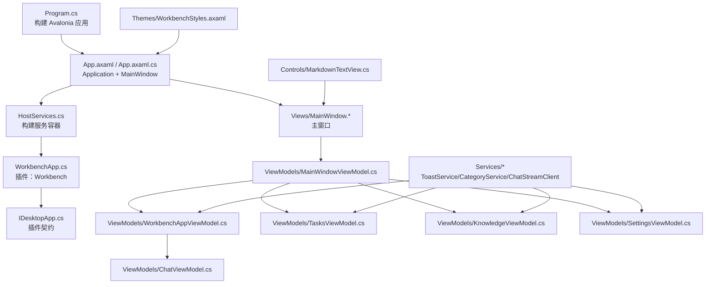
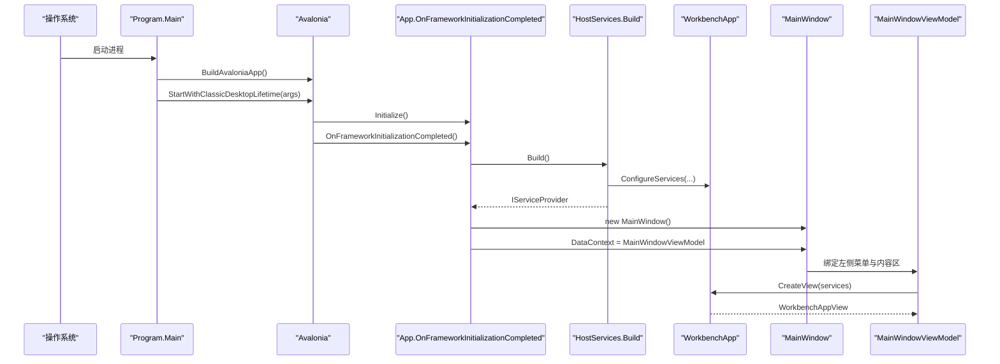
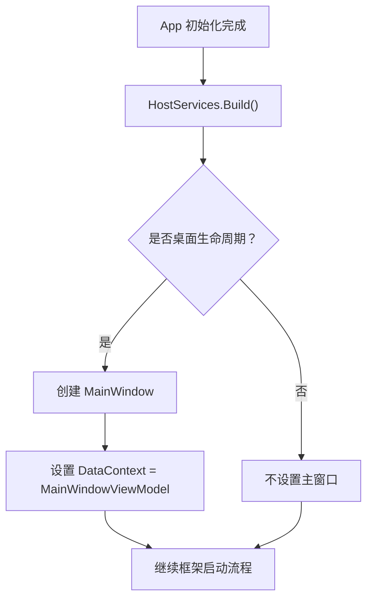
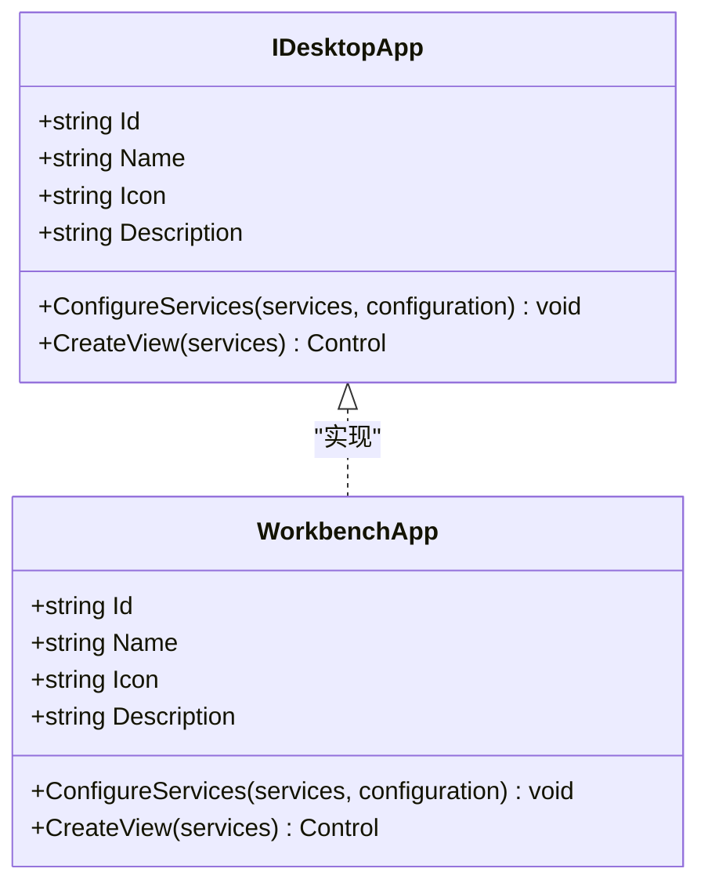
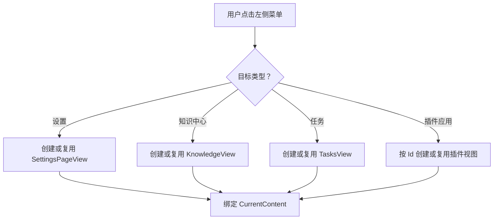
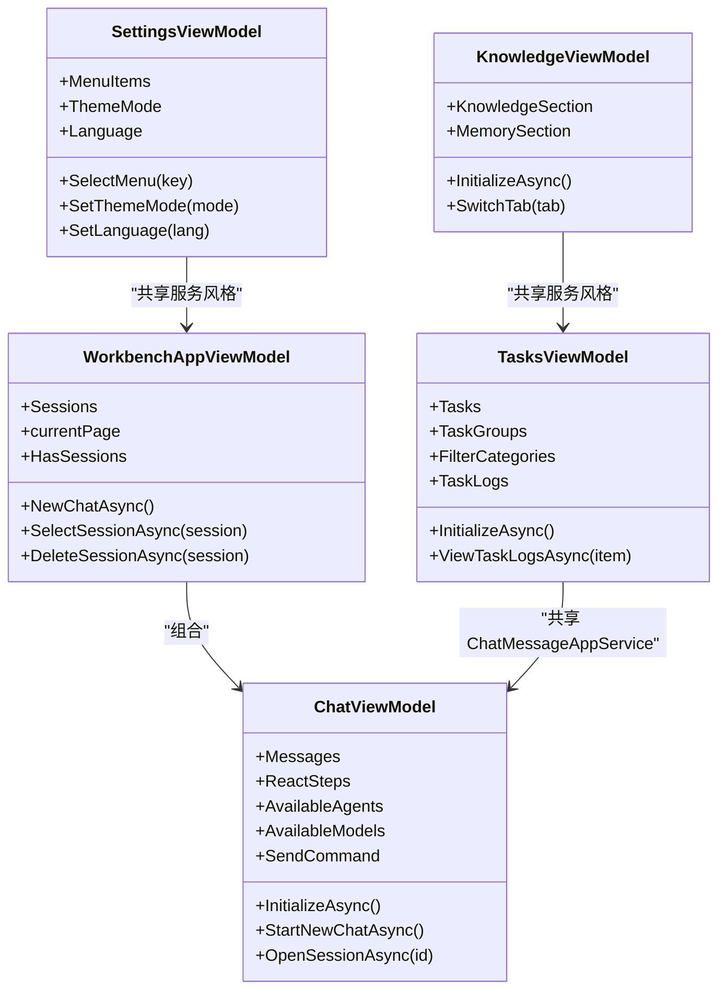
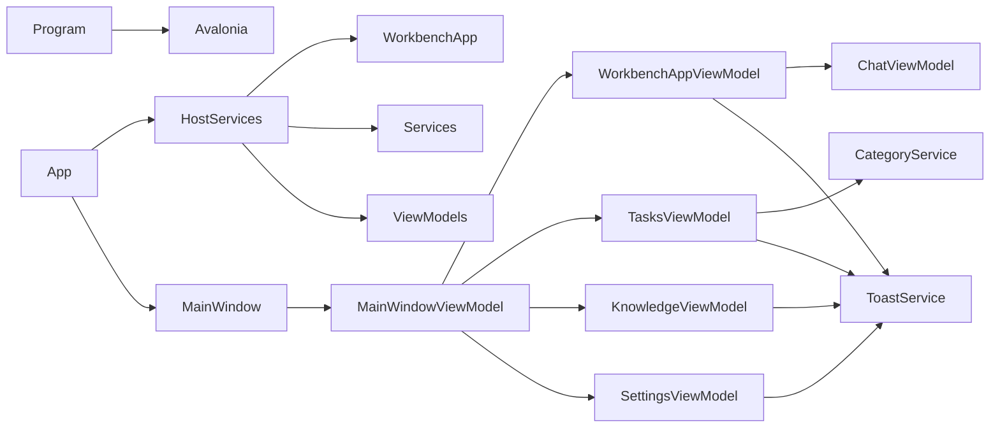

# 桌面宿主（Avalonia）

<cite>
**本文引用的文件**   
- [Program.cs](file://src/Host/H.AppLab.Desktop/Program.cs)
- [App.axaml](file://src/Host/H.AppLab.Desktop/App.axaml)
- [App.axaml.cs](file://src/Host/H.AppLab.Desktop/App.axaml.cs)
- [H.AppLab.Desktop.csproj](file://src/Host/H.AppLab.Desktop/H.AppLab.Desktop.csproj)
- [WorkbenchApp.cs](file://src/Host/H.AppLab.Desktop/WorkbenchApp.cs)
- [IDesktopApp.cs](file://src/Host/H.AppLab.Desktop/IDesktopApp.cs)
- [HostServices.cs](file://src/Host/H.AppLab.Desktop/HostServices.cs)
- [MainWindow.axaml](file://src/Host/H.AppLab.Desktop/Views/MainWindow.axaml)
- [MainWindow.axaml.cs](file://src/Host/H.AppLab.Desktop/Views/MainWindow.axaml.cs)
- [MainWindowViewModel.cs](file://src/Host/H.AppLab.Desktop/ViewModels/MainWindowViewModel.cs)
- [WorkbenchAppViewModel.cs](file://src/Host/H.AppLab.Desktop/ViewModels/WorkbenchAppViewModel.cs)
- [ChatViewModel.cs](file://src/Host/H.AppLab.Desktop/ViewModels/ChatViewModel.cs)
- [TasksViewModel.cs](file://src/Host/H.AppLab.Desktop/ViewModels/TasksViewModel.cs)
- [KnowledgeViewModel.cs](file://src/Host/H.AppLab.Desktop/ViewModels/KnowledgeViewModel.cs)
- [SettingsViewModel.cs](file://src/Host/H.AppLab.Desktop/ViewModels/SettingsViewModel.cs)
- [MarkdownTextView.cs](file://src/Host/H.AppLab.Desktop/Controls/MarkdownTextView.cs)
- [ToastService.cs](file://src/Host/H.AppLab.Desktop/Services/ToastService.cs)
- [CategoryService.cs](file://src/Host/H.AppLab.Desktop/Services/CategoryService.cs)
- [ChatStreamClient.cs](file://src/Host/H.AppLab.Desktop/Services/ChatStreamClient.cs)
- [WorkbenchStyles.axaml](file://src/Host/H.AppLab.Desktop/Themes/WorkbenchStyles.axaml)
- [appsettings.json](file://src/Host/H.AppLab.Desktop/appsettings.json)
</cite>

## 目录
1. [引言](#引言)
2. [项目结构](#项目结构)
3. [核心组件](#核心组件)
4. [架构总览](#架构总览)
5. [详细组件分析](#详细组件分析)
6. [依赖关系分析](#依赖关系分析)
7. [性能与跨平台编译部署](#性能与跨平台编译部署)
8. [调试技巧与常见问题排查](#调试技巧与常见问题排查)
9. [结论](#结论)

## 引言
H.AppLab.Desktop 是基于 Avalonia 12 的跨平台桌面宿主，用于承载多个客户端应用。它不是单一业务应用，而是“外壳”：负责启动 Avalonia、注入服务、创建主窗口，并通过插件契约把 Workbench 等客户端应用接入到统一的左侧导航和内容区域中。该宿主同时复用 Web 端已实现的远端服务接口，在桌面层提供会话、任务、知识中心与设置等界面能力。

## 项目结构
H.AppLab.Desktop 采用典型的 Avalonia MVVM 分层组织：

- Program.cs：进程入口，构建并启动 Avalonia 应用。
- App.axaml / App.axaml.cs：Avalonia Application 定义、全局样式与根窗口初始化。
- Views/：所有 Avalonia 视图（XAML 与代码后置），包括主窗口、工作区、设置页、聊天输入等。
- ViewModels/：基于 CommunityToolkit.Mvvm 的业务状态与命令。
- Controls/：自定义控件，例如 MarkdownTextView。
- Services/：客户端服务，如 ToastService、CategoryService、ChatStreamClient。
- Themes/：主题与样式资源，如 WorkbenchStyles.axaml。
- HostServices.cs：统一服务容器构建与插件应用注册表。
- IDesktopApp.cs：桌面插件契约。
- WorkbenchApp.cs：Workbench 客户端应用的插件实现。
- H.AppLab.Desktop.csproj：项目目标、Avalonia 包引用、输出类型与配置复制。
- appsettings.json：远程服务地址与 HTTP 证书策略等运行配置。

**图表来源**
- [Program.cs:1-19](file://src/Host/H.AppLab.Desktop/Program.cs#L1-L19)
- [App.axaml.cs:1-35](file://src/Host/H.AppLab.Desktop/App.axaml.cs#L1-L35)
- [HostServices.cs:1-47](file://src/Host/H.AppLab.Desktop/HostServices.cs#L1-L47)
- [IDesktopApp.cs:1-31](file://src/Host/H.AppLab.Desktop/IDesktopApp.cs#L1-L31)
- [WorkbenchApp.cs:1-69](file://src/Host/H.AppLab.Desktop/WorkbenchApp.cs#L1-L69)
- [MainWindow.axaml:1-74](file://src/Host/H.AppLab.Desktop/Views/MainWindow.axaml#L1-L74)
- [MainWindowViewModel.cs:1-195](file://src/Host/H.AppLab.Desktop/ViewModels/MainWindowViewModel.cs#L1-L195)
- [WorkbenchAppViewModel.cs:1-191](file://src/Host/H.AppLab.Desktop/ViewModels/WorkbenchAppViewModel.cs#L1-L191)
- [ChatViewModel.cs:1-200](file://src/Host/H.AppLab.Desktop/ViewModels/ChatViewModel.cs#L1-L200)
- [TasksViewModel.cs:1-200](file://src/Host/H.AppLab.Desktop/ViewModels/TasksViewModel.cs#L1-L200)
- [KnowledgeViewModel.cs:1-200](file://src/Host/H.AppLab.Desktop/ViewModels/KnowledgeViewModel.cs#L1-L200)
- [SettingsViewModel.cs:1-132](file://src/Host/H.AppLab.Desktop/ViewModels/SettingsViewModel.cs#L1-L132)

**章节来源**
- [Program.cs:1-19](file://src/Host/H.AppLab.Desktop/Program.cs#L1-L19)
- [H.AppLab.Desktop.csproj:1-28](file://src/Host/H.AppLab.Desktop/H.AppLab.Desktop.csproj#L1-L28)

## 核心组件
- Program：进程入口，使用 `BuildAvaloniaApp()` 构建 Avalonia 应用，并通过 `StartWithClassicDesktopLifetime(args)` 启动经典桌面生命周期。
- App：Avalonia Application 子类，加载 XAML 资源，构建全局服务容器，并在桌面模式下将 `MainWindow` 设为主窗口。
- HostServices：集中构建 `IServiceProvider`，读取 `appsettings.json`，注册宿主基础服务，并按需调用每个 `IDesktopApp` 的 `ConfigureServices`。
- IDesktopApp：插件契约，描述应用标识、名称、图标、描述，以及服务注册和根视图创建方法。
- WorkbenchApp：Workbench 客户端的插件实现，注册远端服务代理、HttpClient、客户端服务与 ViewModel，并返回 `WorkbenchAppView`。
- MainWindow：无标题栏宿主窗口，左侧为快捷菜单，右侧内容区根据选中项切换内置页面或插件应用视图。

**章节来源**
- [Program.cs:1-19](file://src/Host/H.AppLab.Desktop/Program.cs#L1-L19)
- [App.axaml.cs:1-35](file://src/Host/H.AppLab.Desktop/App.axaml.cs#L1-L35)
- [HostServices.cs:1-47](file://src/Host/H.AppLab.Desktop/HostServices.cs#L1-L47)
- [IDesktopApp.cs:1-31](file://src/Host/H.AppLab.Desktop/IDesktopApp.cs#L1-L31)
- [WorkbenchApp.cs:1-69](file://src/Host/H.AppLab.Desktop/WorkbenchApp.cs#L1-L69)
- [MainWindow.axaml:1-74](file://src/Host/H.AppLab.Desktop/Views/MainWindow.axaml#L1-L74)

## 架构总览
桌面宿主以“外壳 + 插件”的方式组织：Program 启动 Avalonia；App 创建主窗口；HostServices 组装服务；MainWindowViewModel 管理左侧导航与内容区；每个插件通过 `IDesktopApp` 注入自身服务和视图。Workbench 作为首个插件，复用 Web 端的 Workbench 远端服务，在桌面侧提供会话、任务、知识与设置等功能。

**图表来源**
- [Program.cs:1-19](file://src/Host/H.AppLab.Desktop/Program.cs#L1-L19)
- [App.axaml.cs:1-35](file://src/Host/H.AppLab.Desktop/App.axaml.cs#L1-L35)
- [HostServices.cs:1-47](file://src/Host/H.AppLab.Desktop/HostServices.cs#L1-L47)
- [WorkbenchApp.cs:1-69](file://src/Host/H.AppLab.Desktop/WorkbenchApp.cs#L1-L69)
- [MainWindow.axaml.cs:1-52](file://src/Host/H.AppLab.Desktop/Views/MainWindow.axaml.cs#L1-L52)
- [MainWindowViewModel.cs:1-195](file://src/Host/H.AppLab.Desktop/ViewModels/MainWindowViewModel.cs#L1-L195)

## 详细组件分析

### Program：Avalonia 应用构建与桌面生命周期
- `Main` 使用 `[STAThread]`，符合 Windows 桌面线程模型要求。
- `BuildAvaloniaApp()` 链式调用：
  - `UsePlatformDetect()`：自动检测运行平台，选择合适的 Avalonia 后端。
  - `WithInterFont()`：引入 Inter 字体，改善多语言排版体验。
  - `LogToTrace()`：启用 .NET Trace 日志，便于在调试器中捕获 Avalonia 内部日志。
- `StartWithClassicDesktopLifetime(args)`：以传统桌面模式启动，支持单实例窗口生命周期。

**章节来源**
- [Program.cs:1-19](file://src/Host/H.AppLab.Desktop/Program.cs#L1-L19)

### App：应用程序入口点与全局服务
- `Initialize()` 加载 XAML 资源。
- `OnFrameworkInitializationCompleted()`：
  - 调用 `HostServices.Build()` 生成全局 `IServiceProvider`。
  - 判断当前生命周期是否为桌面模式，如果是则创建 `MainWindow`，并将 `MainWindowViewModel` 注入为数据上下文。
- 暴露静态 `Services`，供其他模块访问全局服务。

**图表来源**
- [App.axaml.cs:1-35](file://src/Host/H.AppLab.Desktop/App.axaml.cs#L1-L35)
- [HostServices.cs:1-47](file://src/Host/H.AppLab.Desktop/HostServices.cs#L1-L47)

**章节来源**
- [App.axaml.cs:1-35](file://src/Host/H.AppLab.Desktop/App.axaml.cs#L1-L35)

### HostServices：服务容器与插件注册表
- 从 `AppContext.BaseDirectory` 加载 `appsettings.json`。
- 注册宿主基础服务：
  - `IConfiguration`
  - `CategoryService`
  - `ToastService`
- 遍历 `CreateApps()` 返回的 `IDesktopApp` 列表，依次注册应用实例并调用其 `ConfigureServices`。
- 注册宿主 ViewModel：`MainWindowViewModel`。
- 返回构建好的 `IServiceProvider`。

新增桌面插件时，只需实现 `IDesktopApp` 并在 `CreateApps()` 中添加实例。

**章节来源**
- [HostServices.cs:1-47](file://src/Host/H.AppLab.Desktop/HostServices.cs#L1-L47)
- [appsettings.json:1-10](file://src/Host/H.AppLab.Desktop/appsettings.json#L1-L10)

### IDesktopApp：桌面插件契约
- `Id`：唯一标识，如 `workbench`。
- `Name`：显示名称。
- `Icon`：图标字符。
- `Description`：应用描述。
- `ConfigureServices(IServiceCollection, IConfiguration)`：注册应用自身服务与远端代理。
- `CreateView(IServiceProvider)`：返回根视图控件。

**图表来源**
- [IDesktopApp.cs:1-31](file://src/Host/H.AppLab.Desktop/IDesktopApp.cs#L1-L31)
- [WorkbenchApp.cs:1-69](file://src/Host/H.AppLab.Desktop/WorkbenchApp.cs#L1-L69)

**章节来源**
- [IDesktopApp.cs:1-31](file://src/Host/H.AppLab.Desktop/IDesktopApp.cs#L1-L31)

### WorkbenchApp：Workbench 客户端插件
- 标识为 `workbench`，显示名为“会话”。
- 使用 `AddRemoteServices` 和 `AddHttpClientProxies` 注册与 Web 端一致的 Workbench 远端服务代理。
- 根据 `Http.AllowInvalidCertificates` 配置决定是否接受自签名证书，方便本地开发调试。
- 注册客户端服务：
  - `ToastService`
  - `ChatStreamClient`
- 注册 ViewModel：
  - `WorkbenchAppViewModel`
  - `ChatViewModel`
  - `TasksViewModel`
  - `KnowledgeViewModel`
  - `SettingsViewModel`
- `CreateView` 返回 `WorkbenchAppView`，并注入对应 ViewModel。

**章节来源**
- [WorkbenchApp.cs:1-69](file://src/Host/H.AppLab.Desktop/WorkbenchApp.cs#L1-L69)
- [appsettings.json:1-10](file://src/Host/H.AppLab.Desktop/appsettings.json#L1-L10)

### 主窗口与宿主导航
- `MainWindow.axaml`：
  - 无系统标题栏，使用 `ExtendClientAreaToDecorationsHint` 扩展客户区。
  - 左侧为 Logo 拖拽区和快捷菜单按钮，右侧为 `ContentControl` 动态显示当前内容。
  - 底部固定“设置”和“知识中心”快捷入口。
- `MainWindow.axaml.cs`：
  - 顶部 Logo 区域支持拖拽移动窗口。
  - 空白区域点击拖拽也可移动窗口，但跳过可交互控件。
- `MainWindowViewModel.cs`：
  - 维护左侧导航项集合，包含各插件应用、任务、知识中心、设置。
  - 按需创建并缓存内置页面视图与插件应用视图，保持应用内状态。
  - 首次进入设置页时重置为“通用”菜单。

**图表来源**
- [MainWindow.axaml:1-74](file://src/Host/H.AppLab.Desktop/Views/MainWindow.axaml#L1-L74)
- [MainWindow.axaml.cs:1-52](file://src/Host/H.AppLab.Desktop/Views/MainWindow.axaml.cs#L1-L52)
- [MainWindowViewModel.cs:1-195](file://src/Host/H.AppLab.Desktop/ViewModels/MainWindowViewModel.cs#L1-L195)

**章节来源**
- [MainWindow.axaml:1-74](file://src/Host/H.AppLab.Desktop/Views/MainWindow.axaml#L1-L74)
- [MainWindow.axaml.cs:1-52](file://src/Host/H.AppLab.Desktop/Views/MainWindow.axaml.cs#L1-L52)
- [MainWindowViewModel.cs:1-195](file://src/Host/H.AppLab.Desktop/ViewModels/MainWindowViewModel.cs#L1-L195)

### ViewModel 层：业务逻辑承载
- `WorkbenchAppViewModel`：
  - 管理会话列表、当前页面、用户菜单。
  - 订阅 `ChatViewModel` 的会话创建与变更事件，同步会话列表。
  - 提供新建、选择、删除会话的命令。
- `ChatViewModel`：
  - 管理消息、ReAct 步骤、流式响应、智能体与模型选择。
  - 负责加载可用智能体与模型，发送消息，处理流式响应。
  - 暴露滚动到底部、会话创建、会话变更等事件。
- `TasksViewModel`：
  - 管理任务分类、任务卡片、执行记录、AI 生成任务对话框。
  - 集成 CategoryService、TaskAppService、TaskLogAppService、ChatMessageAppService、AiCompletionAppService。
- `KnowledgeViewModel`：
  - 管理知识库与记忆两个 Tab。
  - 使用适配器封装文档树与文档操作，复用相同 UI 逻辑。
- `SettingsViewModel`：
  - 管理设置页左侧菜单与右侧内容。
  - 组合 LLM、Agent、Skill、MCP 子设置 ViewModel。
  - 提供主题与语言切换命令（当前为本地状态）。

**图表来源**
- [WorkbenchAppViewModel.cs:1-191](file://src/Host/H.AppLab.Desktop/ViewModels/WorkbenchAppViewModel.cs#L1-L191)
- [ChatViewModel.cs:1-200](file://src/Host/H.AppLab.Desktop/ViewModels/ChatViewModel.cs#L1-L200)
- [TasksViewModel.cs:1-200](file://src/Host/H.AppLab.Desktop/ViewModels/TasksViewModel.cs#L1-L200)
- [KnowledgeViewModel.cs:1-200](file://src/Host/H.AppLab.Desktop/ViewModels/KnowledgeViewModel.cs#L1-L200)
- [SettingsViewModel.cs:1-132](file://src/Host/H.AppLab.Desktop/ViewModels/SettingsViewModel.cs#L1-L132)

**章节来源**
- [WorkbenchAppViewModel.cs:1-191](file://src/Host/H.AppLab.Desktop/ViewModels/WorkbenchAppViewModel.cs#L1-L191)
- [ChatViewModel.cs:1-200](file://src/Host/H.AppLab.Desktop/ViewModels/ChatViewModel.cs#L1-L200)
- [TasksViewModel.cs:1-200](file://src/Host/H.AppLab.Desktop/ViewModels/TasksViewModel.cs#L1-L200)
- [KnowledgeViewModel.cs:1-200](file://src/Host/H.AppLab.Desktop/ViewModels/KnowledgeViewModel.cs#L1-L200)
- [SettingsViewModel.cs:1-132](file://src/Host/H.AppLab.Desktop/ViewModels/SettingsViewModel.cs#L1-L132)

### Controls、Services、Themes
- Controls：
  - `MarkdownTextView`：用于渲染 Markdown 内容的自定义控件，常见于聊天消息或知识文档展示。
- Services：
  - `ToastService`：统一提示服务，被多个 ViewModel 调用。
  - `CategoryService`：任务分类服务，被 TasksViewModel 使用。
  - `ChatStreamClient`：聊天流式响应客户端，被 ChatViewModel 使用。
- Themes：
  - `WorkbenchStyles.axaml`：Workbench 相关样式资源。
  - `App.axaml` 中定义了 FluentTheme 与左侧导航按钮样式。

**章节来源**
- [MarkdownTextView.cs](file://src/Host/H.AppLab.Desktop/Controls/MarkdownTextView.cs)
- [ToastService.cs](file://src/Host/H.AppLab.Desktop/Services/ToastService.cs)
- [CategoryService.cs](file://src/Host/H.AppLab.Desktop/Services/CategoryService.cs)
- [ChatStreamClient.cs](file://src/Host/H.AppLab.Desktop/Services/ChatStreamClient.cs)
- [WorkbenchStyles.axaml](file://src/Host/H.AppLab.Desktop/Themes/WorkbenchStyles.axaml)
- [App.axaml:1-33](file://src/Host/H.AppLab.Desktop/App.axaml#L1-L33)

## 依赖关系分析
- Program 依赖 Avalonia 运行时。
- App 依赖 Avalonia、XAML 加载器、DI 容器、ViewModel 与 Views。
- HostServices 依赖 Microsoft.Extensions.Configuration、DependencyInjection、以及具体服务与 ViewModel。
- WorkbenchApp 依赖 HttpClientProxy、Workbench.Application.Contracts、Services 与 ViewModels。
- MainWindowViewModel 依赖 DI、ViewModels 与 Views。
- 各业务 ViewModel 依赖远端 AppService 代理与客户端服务。

**图表来源**
- [Program.cs:1-19](file://src/Host/H.AppLab.Desktop/Program.cs#L1-L19)
- [App.axaml.cs:1-35](file://src/Host/H.AppLab.Desktop/App.axaml.cs#L1-L35)
- [HostServices.cs:1-47](file://src/Host/H.AppLab.Desktop/HostServices.cs#L1-L47)
- [WorkbenchApp.cs:1-69](file://src/Host/H.AppLab.Desktop/WorkbenchApp.cs#L1-L69)
- [MainWindowViewModel.cs:1-195](file://src/Host/H.AppLab.Desktop/ViewModels/MainWindowViewModel.cs#L1-L195)
- [WorkbenchAppViewModel.cs:1-191](file://src/Host/H.AppLab.Desktop/ViewModels/WorkbenchAppViewModel.cs#L1-L191)
- [TasksViewModel.cs:1-200](file://src/Host/H.AppLab.Desktop/ViewModels/TasksViewModel.cs#L1-L200)
- [KnowledgeViewModel.cs:1-200](file://src/Host/H.AppLab.Desktop/ViewModels/KnowledgeViewModel.cs#L1-L200)
- [SettingsViewModel.cs:1-132](file://src/Host/H.AppLab.Desktop/ViewModels/SettingsViewModel.cs#L1-L132)

## 性能与跨平台编译部署
- 项目输出类型为 `WinExe`，目标框架由 common.props 提供，包引用包含 Avalonia、Avalonia.Desktop、Fluent 主题、Inter 字体、Diagnostics（仅 Debug）、CommunityToolkit.Mvvm、Markdig、Microsoft.Extensions.*。
- `AvaloniaUseCompiledBindingsByDefault` 设置为 false，便于调试时查看绑定错误；生产部署时可考虑开启以提升绑定性能。
- `appsettings.json` 复制到输出目录，运行时读取 RemoteServices 与 Http 配置。

跨平台说明：
- Avalonia 本身支持 Windows、Linux、macOS。`UsePlatformDetect()` 会选择合适的后端。
- 当前 csproj 未显式指定 `<TargetFramework>`，通常由共同属性文件控制；若需要独立部署，可在项目文件中补充目标框架与自包含发布选项。
- 典型部署方式：
  - Windows：dotnet publish 后分发 exe；或使用打包工具生成安装包。
  - Linux：确保安装 Avalonia 所需依赖（如 GTK、X11/Wayland），然后发布为单文件或自包含应用。
  - macOS：签署与公证后可分发 dmg 或 zip。

[本节为通用指导，不直接分析具体源码行]

## 调试技巧与常见问题排查

### 调试技巧
- 使用 `LogToTrace()` 后，在 Visual Studio 输出窗口或 .NET Tracing 工具中查看 Avalonia 内部日志。
- Debug 配置会自动引入 Avalonia.Diagnostics，便于检查可视化树与绑定问题。
- 在 WorkbenchApp 中允许无效证书，适合本地 HTTPS 自签名环境调试远端服务。
- 主窗口无标题栏时，通过顶部 Logo 或空白区域拖拽移动窗口；若无法拖拽，检查是否误绑定了可交互控件。

### 常见问题
- 中文显示异常：
  - 已引入 Inter 字体；若仍有缺字，检查系统字体回退策略，或在 `App.axaml` 中调整 FontFamily。
- 远端服务连接失败：
  - 检查 `appsettings.json` 中 `RemoteServices.Workbench.BaseUrl` 是否正确。
  - 确认后端服务正在运行且端口可达。
- 自签名证书报错：
  - 本地开发可启用 `Http.AllowInvalidCertificates`。
- 会话加载失败：
  - 检查 `WorkbenchAppViewModel.LoadSessionsAsync` 的异常处理与 Toast 提示。
- 任务分类加载失败：
  - 检查 `CategoryService` 与 `TasksViewModel.InitializeAsync` 的错误分支。
- 设置页未正确初始化：
  - 确认 `MainWindowViewModel.GetSettingsView` 每次进入时调用 `SelectMenu("general")`。

**章节来源**
- [Program.cs:1-19](file://src/Host/H.AppLab.Desktop/Program.cs#L1-L19)
- [H.AppLab.Desktop.csproj:1-28](file://src/Host/H.AppLab.Desktop/H.AppLab.Desktop.csproj#L1-L28)
- [WorkbenchApp.cs:1-69](file://src/Host/H.AppLab.Desktop/WorkbenchApp.cs#L1-L69)
- [appsettings.json:1-10](file://src/Host/H.AppLab.Desktop/appsettings.json#L1-L10)
- [MainWindow.axaml.cs:1-52](file://src/Host/H.AppLab.Desktop/Views/MainWindow.axaml.cs#L1-L52)
- [WorkbenchAppViewModel.cs:1-191](file://src/Host/H.AppLab.Desktop/ViewModels/WorkbenchAppViewModel.cs#L1-L191)
- [TasksViewModel.cs:1-200](file://src/Host/H.AppLab.Desktop/ViewModels/TasksViewModel.cs#L1-L200)
- [MainWindowViewModel.cs:1-195](file://src/Host/H.AppLab.Desktop/ViewModels/MainWindowViewModel.cs#L1-L195)

## 结论
H.AppLab.Desktop 以 Avalonia 为跨平台底座，通过 Program 与 App 完成应用启动与服务容器构建；通过 IDesktopApp 契约将 Workbench 等客户端应用以插件形式接入统一宿主；通过 ViewModel 层承载会话、任务、知识与设置等业务逻辑；通过 Services 抽象远端服务与客户端辅助能力。相比 Web 版本，桌面宿主的差异主要体现在：使用 Avalonia 渲染 UI、托管桌面生命周期、在无标题栏窗口中实现自定义导航与拖拽行为，同时复用 Web 端的远端服务接口以保持功能一致。