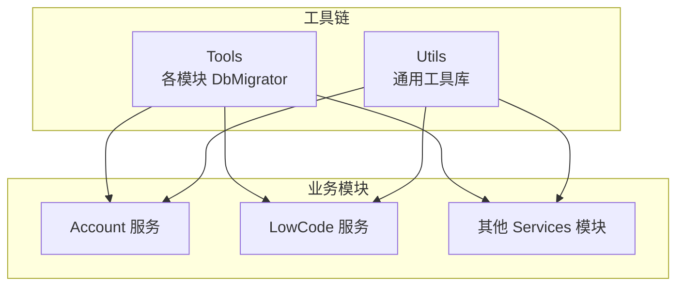
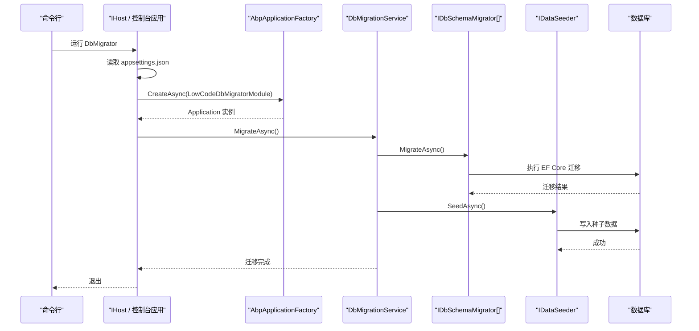
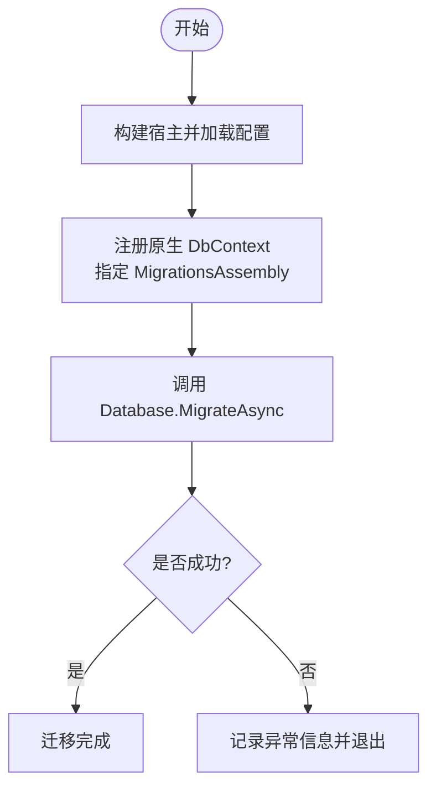
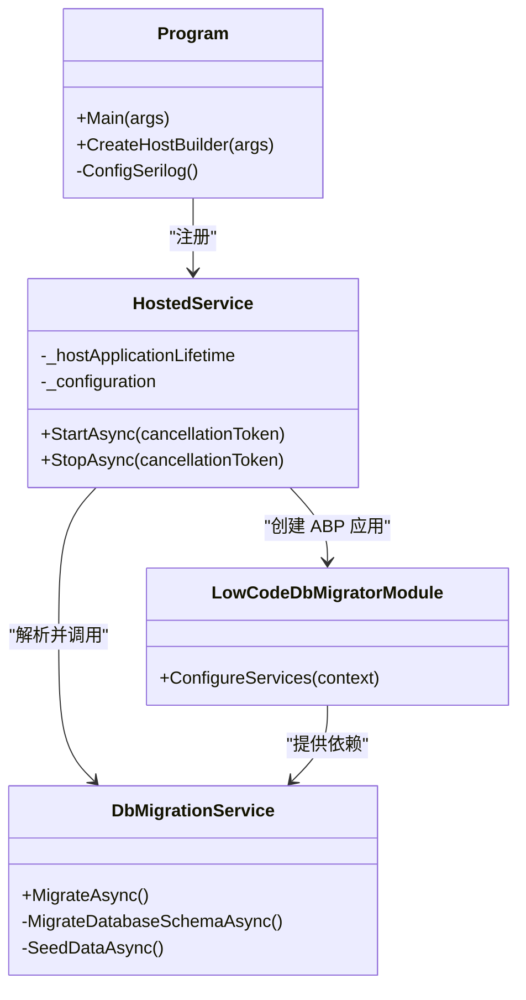
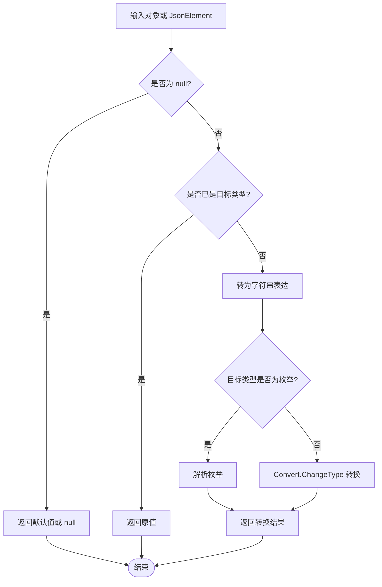
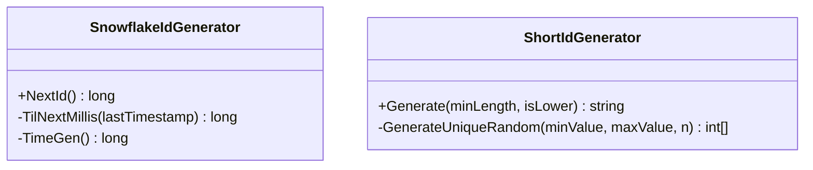
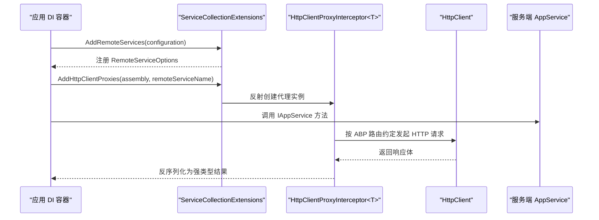
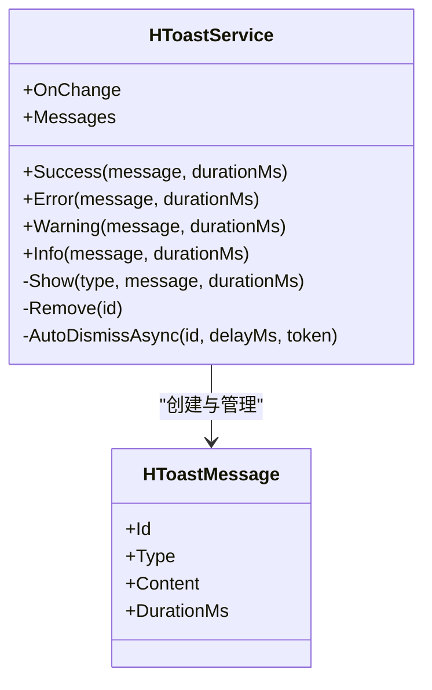
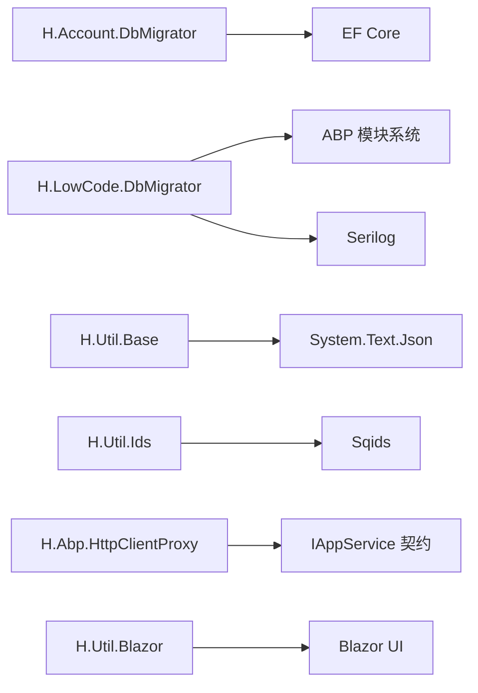

# 工具链

<cite>
**本文引用的文件**   
- [README.md](file://README.md)
- [Program.cs](file://src/Tools/H.Account.DbMigrator/Program.cs)
- [Program.cs](file://src/Tools/H.LowCode.DbMigrator/Program.cs)
- [LowCodeDbMigratorModule.cs](file://src/Tools/H.LowCode.DbMigrator/LowCodeDbMigratorModule.cs)
- [HostedService.cs](file://src/Tools/H.LowCode.DbMigrator/HostedService.cs)
- [DbMigrationService.cs](file://src/Tools/H.LowCode.DbMigrator/DbMigrationService.cs)
- [ObjectExtension.cs](file://src/Utils/H.Util.Base/ObjectExtension.cs)
- [SnowflakeIdGenerator.cs](file://src/Utils/H.Util.Ids/SnowflakeIdGenerator.cs)
- [ShortIdGenerator.cs](file://src/Utils/H.Util.Ids/ShortIdGenerator.cs)
- [ServiceCollectionExtensions.cs](file://src/Utils/H.Abp.HttpClientProxy/ServiceCollectionExtensions.cs)
- [HToastService.cs](file://src/Utils/H.Util.Blazor/HToastService.cs)
</cite>

## 目录
1. [简介](#简介)
2. [项目结构](#项目结构)
3. [核心组件](#核心组件)
4. [架构总览](#架构总览)
5. [详细组件分析](#详细组件分析)
6. [依赖关系分析](#依赖关系分析)
7. [性能与可靠性考虑](#性能与可靠性考虑)
8. [常见问题排查](#常见问题排查)
9. [结论](#结论)
10. [附录：扩展指南](#附录扩展指南)

## 简介
本工具链围绕 H.AppLab 的数据库迁移与通用工具库展开，重点包括：
- 数据库迁移工具：为各业务模块提供独立的 DbMigrator 程序集，支持 EF Core 迁移、ABP 数据种子和按应用维度的初始化流程。
- 实体框架迁移最佳实践：迁移脚本生成、版本管理、回滚策略及多上下文迁移注意事项。
- 通用工具库：基础类型扩展、ID 生成器、Blazor 辅助服务、HTTP 客户端代理封装等。
- 扩展机制：为新业务模块添加数据库迁移支持的步骤，以及扩展通用工具类的方法。

仓库 README 对整体架构、宿主方式、低代码引擎与服务分层做了概览说明；工具链位于 Tools 与 Utils 两个目录中，分别承担“数据库迁移”和“跨模块复用能力”的职责。

**章节来源**
- [README.md:1-73](file://README.md#L1-L73)

## 项目结构
从工具链视角，关键目录如下：
- src/Tools：每个业务模块一个 DbMigrator 控制台程序，负责连接数据库并执行迁移与数据种子。
- src/Utils：可被多个服务或宿主复用的工具库，涵盖 HTTP 代理、ID 生成、Blazor 工具与基础类型扩展。

**图示来源**
- [README.md:1-73](file://README.md#L1-L73)

**章节来源**
- [README.md:1-73](file://README.md#L1-L73)

## 核心组件
- 数据库迁移工具
  - 简单模式：以 H.Account.DbMigrator 为代表，直接配置原生 DbContext 并调用 EF Core 的 MigrateAsync。
  - ABP 模式：以 H.LowCode.DbMigrator 为代表，基于 ABP 模块系统加载设计引擎相关模块，注册迁移专用上下文，并通过 IHostedService 驱动迁移和数据种子。
- 通用工具库
  - H.Util.Base：对象深拷贝、JSON 元素转换、枚举与目标类型转换等扩展。
  - H.Util.Ids：雪花 ID 与短 ID 生成器。
  - H.Abp.HttpClientProxy：基于 IAppService 接口的 HTTP 动态代理注册与拦截。
  - H.Util.Blazor：Toast 消息服务与 Blazor 侧辅助能力。

**章节来源**
- [Program.cs](file://src/Tools/H.Account.DbMigrator/Program.cs)
- [Program.cs](file://src/Tools/H.LowCode.DbMigrator/Program.cs)
- [LowCodeDbMigratorModule.cs](file://src/Tools/H.LowCode.DbMigrator/LowCodeDbMigratorModule.cs)
- [HostedService.cs](file://src/Tools/H.LowCode.DbMigrator/HostedService.cs)
- [DbMigrationService.cs](file://src/Tools/H.LowCode.DbMigrator/DbMigrationService.cs)
- [ObjectExtension.cs](file://src/Utils/H.Util.Base/ObjectExtension.cs)
- [SnowflakeIdGenerator.cs](file://src/Utils/H.Util.Ids/SnowflakeIdGenerator.cs)
- [ShortIdGenerator.cs](file://src/Utils/H.Util.Ids/ShortIdGenerator.cs)
- [ServiceCollectionExtensions.cs](file://src/Utils/H.Abp.HttpClientProxy/ServiceCollectionExtensions.cs)
- [HToastService.cs](file://src/Utils/H.Util.Blazor/HToastService.cs)

## 架构总览
DbMigrator 工具链采用“进程级一次性任务 + 模块化依赖注入”的方式组织。两种典型实现：
- 轻量模式（Account）：使用 Host.CreateDefaultBuilder 构建最小宿主，读取 appsettings.json，注册原生 DbContext，直接调用 Database.MigrateAsync。
- ABP 集成模式（LowCode）：通过 AbpApplicationFactory 启动自定义 ABP 模块，使用 IDataSeeder 与 IDbSchemaMigrator 完成迁移与数据种子，并通过 IHostedService 控制生命周期。

**图示来源**
- [Program.cs](file://src/Tools/H.LowCode.DbMigrator/Program.cs)
- [HostedService.cs](file://src/Tools/H.LowCode.DbMigrator/HostedService.cs)
- [DbMigrationService.cs](file://src/Tools/H.LowCode.DbMigrator/DbMigrationService.cs)
- [LowCodeDbMigratorModule.cs](file://src/Tools/H.LowCode.DbMigrator/LowCodeDbMigratorModule.cs)

## 详细组件分析

### 数据库迁移工具：Account 模块（轻量模式）
H.Account.DbMigrator 是一个最小化的控制台应用，主要职责：
- 构建宿主并加载 appsettings.json。
- 注册原生 DbContext（非 AbpDbContext），避免在迁移阶段依赖 ABP 模块系统。
- 指定 MigrationsAssembly 指向当前程序集，使 EF Core 能找到迁移脚本。
- 调用 Database.MigrateAsync 执行迁移，并在异常时输出错误堆栈。

关键点：
- 使用独立 DbContext 的原因：避免在迁移时触发 ABP 模块初始化。
- 连接字符串键名与 UseSqlServer 的 MigrationsAssembly 设置决定迁移生效范围。

**图示来源**
- [Program.cs](file://src/Tools/H.Account.DbMigrator/Program.cs)

**章节来源**
- [Program.cs](file://src/Tools/H.Account.DbMigrator/Program.cs)

### 数据库迁移工具：LowCode 模块（ABP 集成模式）
H.LowCode.DbMigrator 通过 ABP 模块系统启动，负责：
- 使用 Serilog 进行结构化日志记录。
- 通过 IHostedService 启动应用、初始化 ABP 模块、执行迁移与数据种子，然后停止应用。
- 在模块中注册迁移专用的 DbContext，并显式指定 MigrationsAssembly 指向 DbMigrator 程序集。
- 将 IDataSeeder 与 IDbSchemaMigrator 注入到 DbMigrationService，统一编排迁移与种子流程。

**图示来源**
- [Program.cs](file://src/Tools/H.LowCode.DbMigrator/Program.cs)
- [HostedService.cs](file://src/Tools/H.LowCode.DbMigrator/HostedService.cs)
- [LowCodeDbMigratorModule.cs](file://src/Tools/H.LowCode.DbMigrator/LowCodeDbMigratorModule.cs)
- [DbMigrationService.cs](file://src/Tools/H.LowCode.DbMigrator/DbMigrationService.cs)

**章节来源**
- [Program.cs](file://src/Tools/H.LowCode.DbMigrator/Program.cs)
- [HostedService.cs](file://src/Tools/H.LowCode.DbMigrator/HostedService.cs)
- [LowCodeDbMigratorModule.cs](file://src/Tools/H.LowCode.DbMigrator/LowCodeDbMigratorModule.cs)
- [DbMigrationService.cs](file://src/Tools/H.LowCode.DbMigrator/DbMigrationService.cs)

### 实体框架迁移最佳实践
结合本工具链的实现，推荐以下实践：
- 迁移脚本生成
  - 使用 EF Core 迁移命令生成迁移脚本，并确保 MigrationsAssembly 指向包含迁移文件的程序集。
  - 对于 ABP 模块，建议通过 IDbSchemaMigrator 接口统一执行迁移，便于扩展不同存储后端。
- 版本管理
  - 所有迁移脚本纳入版本控制系统，避免手动修改已发布的迁移。
  - 使用命名约定区分功能域与变更方向（例如 AddXxx、UpdateYyy）。
- 回滚策略
  - 生产环境禁止直接删除迁移；如需回滚，应编写新的反向迁移，保证幂等性。
  - 对破坏性变更（删列、改类型）先加字段再迁移数据，最后清理旧字段。
- 多上下文迁移
  - 每个 DbContext 对应独立迁移程序集，避免相互影响。
  - 通过独立 DbMigrator 程序集隔离运行时依赖（如 ABP 模块、仓储实现），降低启动成本。

[本节为概念性指导，不直接分析具体源码]

### 通用工具库：基础类型扩展（H.Util.Base）
ObjectExtension 提供了常用的对象处理扩展：
- DeepClone：基于 JSON 序列化/反序列化的深拷贝方法。
- ConvertToRealType：将 object 或 JsonElement 转换为指定目标类型，支持枚举、可空类型与基础类型。
- JsonElement 转换：将 JSON 对象映射为 Dictionary<string, object?>，数组映射为 List<object?>。

适用场景：
- 动态表单数据、元数据驱动的模型绑定。
- 前端传来的 JSON 数据在服务端做类型安全转换。

**图示来源**
- [ObjectExtension.cs](file://src/Utils/H.Util.Base/ObjectExtension.cs)

**章节来源**
- [ObjectExtension.cs](file://src/Utils/H.Util.Base/ObjectExtension.cs)

### 通用工具库：ID 生成器（H.Util.Ids）
- SnowflakeIdGenerator：雪花算法生成器，固定时间戳起点、工作机器位、数据中心位与序列号位，线程安全地生成全局唯一长整型 ID。
- ShortIdGenerator：基于 Sqids 编码短 ID，内部随机参数用于提高不可预测性，支持小写输出。

要点：
- 雪花 ID 适用于分布式主键、排序友好、时间有序。
- 短 ID 适合对外暴露的业务编号，可读性更好但无序。

**图示来源**
- [SnowflakeIdGenerator.cs](file://src/Utils/H.Util.Ids/SnowflakeIdGenerator.cs)
- [ShortIdGenerator.cs](file://src/Utils/H.Util.Ids/ShortIdGenerator.cs)

**章节来源**
- [SnowflakeIdGenerator.cs](file://src/Utils/H.Util.Ids/SnowflakeIdGenerator.cs)
- [ShortIdGenerator.cs](file://src/Utils/H.Util.Ids/ShortIdGenerator.cs)

### 通用工具库：HTTP 客户端代理（H.Abp.HttpClientProxy）
ServiceCollectionExtensions 提供两类扩展：
- AddRemoteServices：从配置的 RemoteServices 节点读取远程服务 BaseUrl，集中管理远端地址。
- AddHttpClientProxies：扫描程序集中所有继承 IAppService 的接口，批量注册动态代理。

工作原理：
- 通过反射找到 HttpClientProxyInterceptor<T>.Create，传入 HttpClient 与 baseUrl，构造代理实例。
- 客户端只依赖 Application.Contracts 中的 IAppService 接口，无需手写 HttpClient 调用。

**图示来源**
- [ServiceCollectionExtensions.cs](file://src/Utils/H.Abp.HttpClientProxy/ServiceCollectionExtensions.cs)

**章节来源**
- [ServiceCollectionExtensions.cs](file://src/Utils/H.Abp.HttpClientProxy/ServiceCollectionExtensions.cs)

### 通用工具库：Blazor Toast 服务（H.Util.Blazor）
HToastService 提供全局通知消息能力：
- 支持 Success、Error、Warning、Info 四种类型。
- 每条消息自动计时隐藏，支持自定义持续时间。
- 通过事件 OnChange 通知 UI 层更新消息列表。

适用场景：
- 操作成功提示、错误警告、异步任务反馈等。

**图示来源**
- [HToastService.cs](file://src/Utils/H.Util.Blazor/HToastService.cs)

**章节来源**
- [HToastService.cs](file://src/Utils/H.Util.Blazor/HToastService.cs)

## 依赖关系分析
DbMigrator 与工具库之间的依赖关系如下：
- H.Account.DbMigrator 依赖 EF Core 与宿主扩展，直接配置 DbContext 与数据库提供程序。
- H.LowCode.DbMigrator 依赖 ABP 模块系统与 Serilog，通过 AbpApplicationFactory 启动模块并注入迁移与种子服务。
- Utils 库被各服务与宿主复用，不耦合具体业务逻辑。

**图示来源**
- [Program.cs](file://src/Tools/H.Account.DbMigrator/Program.cs)
- [Program.cs](file://src/Tools/H.LowCode.DbMigrator/Program.cs)
- [ServiceCollectionExtensions.cs](file://src/Utils/H.Abp.HttpClientProxy/ServiceCollectionExtensions.cs)
- [ShortIdGenerator.cs](file://src/Utils/H.Util.Ids/ShortIdGenerator.cs)
- [ObjectExtension.cs](file://src/Utils/H.Util.Base/ObjectExtension.cs)

**章节来源**
- [Program.cs](file://src/Tools/H.Account.DbMigrator/Program.cs)
- [Program.cs](file://src/Tools/H.LowCode.DbMigrator/Program.cs)
- [ServiceCollectionExtensions.cs](file://src/Utils/H.Abp.HttpClientProxy/ServiceCollectionExtensions.cs)
- [ShortIdGenerator.cs](file://src/Utils/H.Util.Ids/ShortIdGenerator.cs)
- [ObjectExtension.cs](file://src/Utils/H.Util.Base/ObjectExtension.cs)

## 性能与可靠性考虑
- 迁移性能
  - 仅加载必要的 DbContext 与迁移程序集，减少启动开销。
  - 使用独立进程执行迁移，避免与业务应用争用资源。
- 可靠性
  - 在 ABP 模式下通过 IHostedService 控制生命周期，确保初始化完成后优雅退出。
  - 使用结构化日志（Serilog）记录迁移过程，便于定位问题。
- 可扩展性
  - 通过 IDbSchemaMigrator 抽象迁移执行，便于未来扩展更多存储后端。
  - 通过 IAppService 动态代理，前后端共用契约，降低维护成本。

[本节为通用指导，不直接分析具体源码]

## 常见问题排查
- 连接字符串未配置或键名不一致
  - 检查 appsettings.json 中的连接字符串键名是否与 DbMigrator 中读取的一致。
- 找不到迁移程序集
  - 确认 UseSqlServer(...).MigrationsAssembly 指向包含迁移文件的程序集。
- ABP 模块未正确加载
  - 检查 AbpApplicationFactory 创建的模块是否正确 DependsOn 了 EF Core 与 Repository 模块。
- 数据种子失败
  - 确认 IDataSeeder.SeedAsync 已注册，且种子数据不依赖尚未初始化的上下文。
- HTTP 代理无法访问远程服务
  - 检查 RemoteServices 配置项中的 BaseUrl 与 httpClientFactory 的命名是否一致。
- Blazor Toast 不显示
  - 确认 HToastService 已注册为 Scoped 生命周期，且 UI 订阅了 OnChange 事件。

**章节来源**
- [Program.cs](file://src/Tools/H.Account.DbMigrator/Program.cs)
- [LowCodeDbMigratorModule.cs](file://src/Tools/H.LowCode.DbMigrator/LowCodeDbMigratorModule.cs)
- [HostedService.cs](file://src/Tools/H.LowCode.DbMigrator/HostedService.cs)
- [DbMigrationService.cs](file://src/Tools/H.LowCode.DbMigrator/DbMigrationService.cs)
- [ServiceCollectionExtensions.cs](file://src/Utils/H.Abp.HttpClientProxy/ServiceCollectionExtensions.cs)
- [HToastService.cs](file://src/Utils/H.Util.Blazor/HToastService.cs)

## 结论
H.AppLab 工具链以 DbMigrator 为核心，为各业务模块提供一致的数据库迁移与数据种子流程；同时通过 Utils 库沉淀可复用的基础设施能力。开发者可以基于现有模式快速为新模块添加迁移支持，并利用通用工具提升开发效率与代码质量。

[本节为总结性内容，不直接分析具体源码]

## 附录：扩展指南

### 为新业务模块添加数据库迁移支持
步骤建议：
- 新建 DbMigrator 控制台项目，命名为 H.{Module}.DbMigrator。
- 在 appsettings.json 中添加连接字符串（例如 ModuleDb）。
- 参考 H.Account.DbMigrator 的模式：
  - 注册原生 DbContext，指定 MigrationsAssembly 指向 DbMigrator 程序集。
  - 在 Main 中调用 Database.MigrateAsync 执行迁移。
- 若模块依赖 ABP 模块系统：
  - 参考 H.LowCode.DbMigrator 的模式，创建 ABP 模块，注册 MigrationCurrentApp 与迁移专用 DbContext。
  - 使用 IHostedService 启动 AbpApplicationFactory，执行 DbMigrationService.MigrateAsync。

关键要点：
- 迁移脚本放置于 DbMigrator 项目的 Migrations 目录。
- 避免在迁移阶段引入不必要的运行时依赖。

**章节来源**
- [Program.cs](file://src/Tools/H.Account.DbMigrator/Program.cs)
- [Program.cs](file://src/Tools/H.LowCode.DbMigrator/Program.cs)
- [LowCodeDbMigratorModule.cs](file://src/Tools/H.LowCode.DbMigrator/LowCodeDbMigratorModule.cs)
- [HostedService.cs](file://src/Tools/H.LowCode.DbMigrator/HostedService.cs)
- [DbMigrationService.cs](file://src/Tools/H.LowCode.DbMigrator/DbMigrationService.cs)

### 扩展通用工具类
- 在 H.Util.Base 中新增扩展类时，保持静态扩展方法风格，避免引入外部依赖。
- 在 H.Util.Ids 中新增 ID 生成策略时，遵循无状态或线程安全的实现原则。
- 在 H.Abp.HttpClientProxy 中扩展代理注册逻辑时，确保与 IAppService 约定保持一致。
- 在 H.Util.Blazor 中新增组件或服务时，注意生命周期与 DI 注册方式。

[本节为指导性内容，不直接分析具体源码]