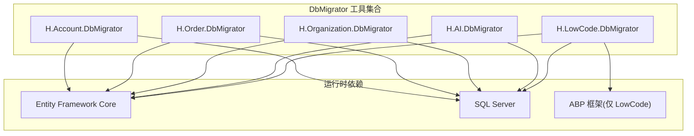
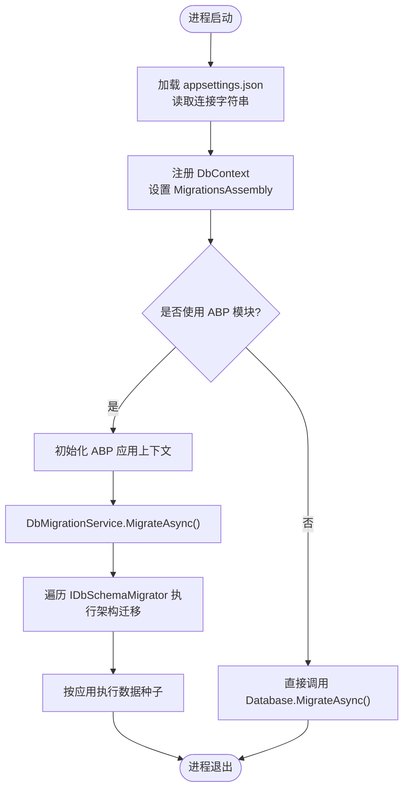
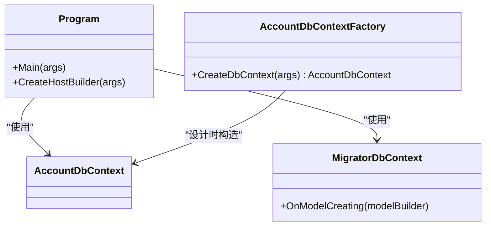
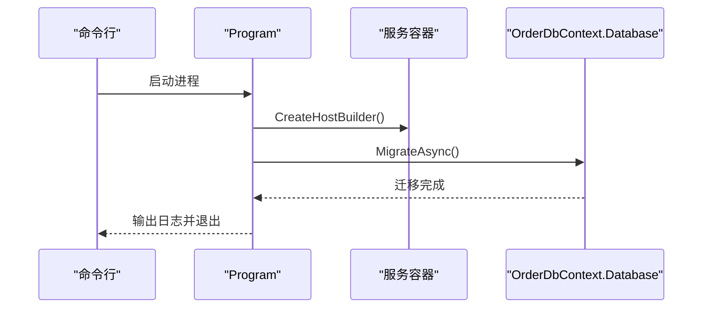
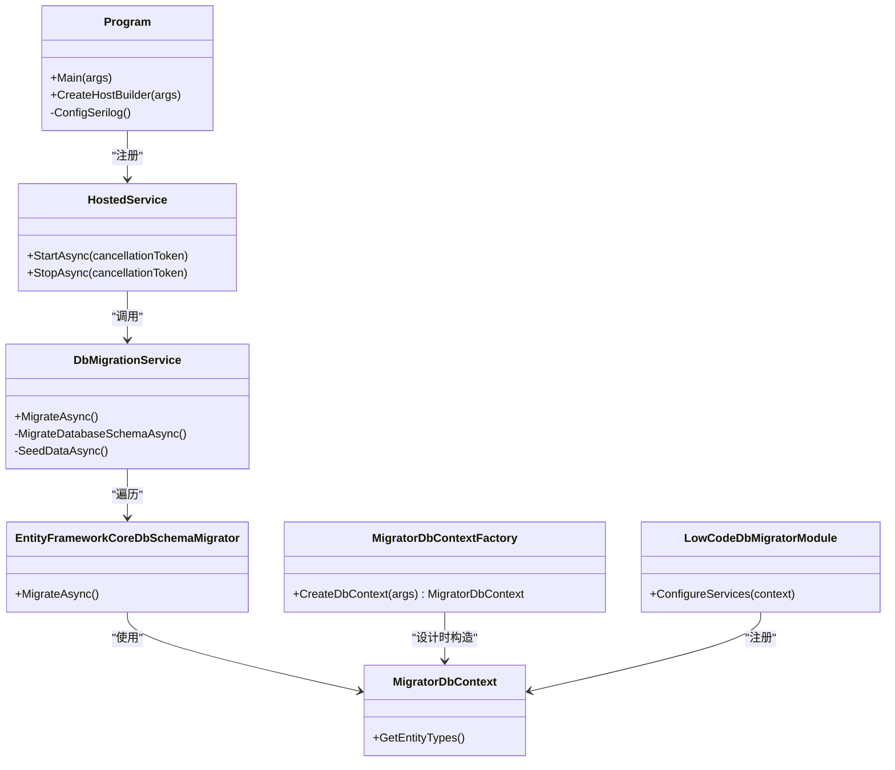

# 数据库迁移工具

<cite>
**本文引用的文件**   
- [src/Tools/H.Account.DbMigrator/Program.cs](file://src/Tools/H.Account.DbMigrator/Program.cs)
- [src/Tools/H.Account.DbMigrator/appsettings.json](file://src/Tools/H.Account.DbMigrator/appsettings.json)
- [src/Tools/H.Account.DbMigrator/AccountDbContextFactory.cs](file://src/Tools/H.Account.DbMigrator/AccountDbContextFactory.cs)
- [src/Tools/H.Account.DbMigrator/MigratorDbContext.cs](file://src/Tools/H.Account.DbMigrator/MigratorDbContext.cs)
- [src/Tools/H.Order.DbMigrator/Program.cs](file://src/Tools/H.Order.DbMigrator/Program.cs)
- [src/Tools/H.Order.DbMigrator/appsettings.json](file://src/Tools/H.Order.DbMigrator/appsettings.json)
- [src/Tools/H.Organization.DbMigrator/Program.cs](file://src/Tools/H.Organization.DbMigrator/Program.cs)
- [src/Tools/H.Organization.DbMigrator/appsettings.json](file://src/Tools/H.Organization.DbMigrator/appsettings.json)
- [src/Tools/H.AI.DbMigrator/Program.cs](file://src/Tools/H.AI.DbMigrator/Program.cs)
- [src/Tools/H.AI.DbMigrator/appsettings.json](file://src/Tools/H.AI.DbMigrator/appsettings.json)
- [src/Tools/H.LowCode.DbMigrator/Program.cs](file://src/Tools/H.LowCode.DbMigrator/Program.cs)
- [src/Tools/H.LowCode.DbMigrator/LowCodeDbMigratorModule.cs](file://src/Tools/H.LowCode.DbMigrator/LowCodeDbMigratorModule.cs)
- [src/Tools/H.LowCode.DbMigrator/HostedService.cs](file://src/Tools/H.LowCode.DbMigrator/HostedService.cs)
- [src/Tools/H.LowCode.DbMigrator/DbMigrationService.cs](file://src/Tools/H.LowCode.DbMigrator/DbMigrationService.cs)
- [src/Tools/H.LowCode.DbMigrator/MigrationServices/EntityFrameworkCoreDbSchemaMigrator.cs](file://src/Tools/H.LowCode.DbMigrator/MigrationServices/EntityFrameworkCoreDbSchemaMigrator.cs)
- [src/Tools/H.LowCode.DbMigrator/MigrationServices/MigratorDbContext.cs](file://src/Tools/H.LowCode.DbMigrator/MigrationServices/MigratorDbContext.cs)
- [src/Tools/H.LowCode.DbMigrator/MigrationGenerator/MigratorDbContextFactory.cs](file://src/Tools/H.LowCode.DbMigrator/MigrationGenerator/MigratorDbContextFactory.cs)
- [src/Tools/H.LowCode.DbMigrator/appsettings.json](file://src/Tools/H.LowCode.DbMigrator/appsettings.json)
</cite>

## 目录
1. [简介](#简介)
2. [项目结构](#项目结构)
3. [核心组件](#核心组件)
4. [架构总览](#架构总览)
5. [详细组件分析](#详细组件分析)
6. [依赖关系与版本管理策略](#依赖关系与版本管理策略)
7. [使用示例](#使用示例)
8. [性能与可靠性考虑](#性能与可靠性考虑)
9. [故障排除指南](#故障排除指南)
10. [结论](#结论)

## 简介
本文件面向 H.AppLab 的数据库迁移工具，重点说明 DbMigrator 工具的架构设计、各业务模块（Account、LowCode、Order、Organization、AI 等）的迁移程序集结构与配置方法，并详细说明实体框架迁移的执行流程、迁移脚本生成机制、迁移版本管理策略以及本地开发与生产环境的使用方式。文档同时提供常见迁移操作模式的最佳实践和故障排除建议，帮助开发者安全、可重复地演进数据库结构。

## 项目结构
仓库中的数据库迁移工具集中在 Tools 目录下，每个业务模块通常对应一个独立的 DbMigrator 控制台程序：
- 简单模块：Account、Order、Organization、AI 等采用统一的“最小化 Program + appsettings.json + DbContextFactory”模式。
- 复杂模块：LowCode 采用 ABP 模块化架构，通过 HostedService 启动应用上下文，并使用服务接口抽象多个数据库迁移器。

图表来源
- [src/Tools/H.Account.DbMigrator/Program.cs:1-59](file://src/Tools/H.Account.DbMigrator/Program.cs#L1-L59)
- [src/Tools/H.Order.DbMigrator/Program.cs:1-55](file://src/Tools/H.Order.DbMigrator/Program.cs#L1-L55)
- [src/Tools/H.Organization.DbMigrator/Program.cs:1-57](file://src/Tools/H.Organization.DbMigrator/Program.cs#L1-L57)
- [src/Tools/H.AI.DbMigrator/Program.cs:1-56](file://src/Tools/H.AI.DbMigrator/Program.cs#L1-L56)
- [src/Tools/H.LowCode.DbMigrator/Program.cs:1-38](file://src/Tools/H.LowCode.DbMigrator/Program.cs#L1-L38)

章节来源
- [src/Tools/H.Account.DbMigrator/Program.cs:1-59](file://src/Tools/H.Account.DbMigrator/Program.cs#L1-L59)
- [src/Tools/H.LowCode.DbMigrator/Program.cs:1-38](file://src/Tools/H.LowCode.DbMigrator/Program.cs#L1-L38)

## 核心组件
- 简单 DbMigrator 模板：包含 Program、appsettings.json、IDesignTimeDbContextFactory 实现、可选的 MigratorDbContext。
- LowCode 高级 DbMigrator：包含 Program、AbpModule、HostedService、DbMigrationService、IDbSchemaMigrator 抽象、EF 具体实现、设计时工厂。

关键职责划分：
- Program：创建宿主、加载配置、注册服务、启动迁移逻辑。
- appsettings.json：连接字符串与运行参数。
- IDesignTimeDbContextFactory：为 dotnet ef migrations add 命令提供设计时 DbContext。
- MigratorDbContext：用于迁移的 DbContext，显式指定 MigrationsAssembly，避免与业务 DbContext 耦合。
- LowCodeDbMigratorModule：ABP 模块，装配 EF、数据种子、迁移服务。
- HostedService：启动 ABP 应用上下文并执行迁移。
- DbMigrationService：编排架构迁移与按应用的数据种子。
- IDbSchemaMigrator / EntityFrameworkCoreDbSchemaMigrator：统一迁移接口与 EF 实现。

章节来源
- [src/Tools/H.Account.DbMigrator/AccountDbContextFactory.cs:1-28](file://src/Tools/H.Account.DbMigrator/AccountDbContextFactory.cs#L1-L28)
- [src/Tools/H.Account.DbMigrator/MigratorDbContext.cs:1-22](file://src/Tools/H.Account.DbMigrator/MigratorDbContext.cs#L1-L22)
- [src/Tools/H.LowCode.DbMigrator/LowCodeDbMigratorModule.cs:1-40](file://src/Tools/H.LowCode.DbMigrator/LowCodeDbMigratorModule.cs#L1-L40)
- [src/Tools/H.LowCode.DbMigrator/HostedService.cs:1-47](file://src/Tools/H.LowCode.DbMigrator/HostedService.cs#L1-L47)
- [src/Tools/H.LowCode.DbMigrator/DbMigrationService.cs:1-58](file://src/Tools/H.LowCode.DbMigrator/DbMigrationService.cs#L1-L58)
- [src/Tools/H.LowCode.DbMigrator/MigrationServices/EntityFrameworkCoreDbSchemaMigrator.cs:1-23](file://src/Tools/H.LowCode.DbMigrator/MigrationServices/EntityFrameworkCoreDbSchemaMigrator.cs#L1-L23)

## 架构总览
DbMigrator 工具分为两类实现：
- 单 DbContext 模式：Account、Order、Organization、AI 等模块各自维护一个 DbContext，并在 Program 中直接调用 Database.MigrateAsync()。
- ABP 模块化模式：LowCode 通过 ABP 模块初始化应用上下文，使用 DbMigrationService 协调多个 IDbSchemaMigrator 和数据种子。

图表来源
- [src/Tools/H.Account.DbMigrator/Program.cs:1-59](file://src/Tools/H.Account.DbMigrator/Program.cs#L1-L59)
- [src/Tools/H.LowCode.DbMigrator/HostedService.cs:1-47](file://src/Tools/H.LowCode.DbMigrator/HostedService.cs#L1-L47)
- [src/Tools/H.LowCode.DbMigrator/DbMigrationService.cs:1-58](file://src/Tools/H.LowCode.DbMigrator/DbMigrationService.cs#L1-L58)

## 详细组件分析

### Account 模块迁移程序集
- Program：构建宿主、加载 appsettings.json、注册 AccountDbContext 或 MigratorDbContext，并执行 Database.MigrateAsync()。
- appsettings.json：定义 AccountDb 连接字符串。
- AccountDbContextFactory：实现 IDesignTimeDbContextFactory<AccountDbContext>，供 dotnet ef 设计时命令使用；将迁移文件生成到当前 DbMigrator 程序集。
- MigratorDbContext：独立于 AccountDbContext 的轻量 DbContext，显式调用 ConfigureIdentity() 以配置 Identity 模型，便于在 DbMigrator 中运行。

图表来源
- [src/Tools/H.Account.DbMigrator/Program.cs:1-59](file://src/Tools/H.Account.DbMigrator/Program.cs#L1-L59)
- [src/Tools/H.Account.DbMigrator/AccountDbContextFactory.cs:1-28](file://src/Tools/H.Account.DbMigrator/AccountDbContextFactory.cs#L1-L28)
- [src/Tools/H.Account.DbMigrator/MigratorDbContext.cs:1-22](file://src/Tools/H.Account.DbMigrator/MigratorDbContext.cs#L1-L22)

章节来源
- [src/Tools/H.Account.DbMigrator/Program.cs:1-59](file://src/Tools/H.Account.DbMigrator/Program.cs#L1-L59)
- [src/Tools/H.Account.DbMigrator/appsettings.json:1-5](file://src/Tools/H.Account.DbMigrator/appsettings.json#L1-L5)
- [src/Tools/H.Account.DbMigrator/AccountDbContextFactory.cs:1-28](file://src/Tools/H.Account.DbMigrator/AccountDbContextFactory.cs#L1-L28)
- [src/Tools/H.Account.DbMigrator/MigratorDbContext.cs:1-22](file://src/Tools/H.Account.DbMigrator/MigratorDbContext.cs#L1-L22)

### Order 模块迁移程序集
- Program：加载 OrderDb 连接字符串，注册 OrderDbContext，执行 Database.MigrateAsync()。
- appsettings.json：定义 OrderDb 连接字符串。

图表来源
- [src/Tools/H.Order.DbMigrator/Program.cs:1-55](file://src/Tools/H.Order.DbMigrator/Program.cs#L1-L55)
- [src/Tools/H.Order.DbMigrator/appsettings.json:1-5](file://src/Tools/H.Order.DbMigrator/appsettings.json#L1-L5)

章节来源
- [src/Tools/H.Order.DbMigrator/Program.cs:1-55](file://src/Tools/H.Order.DbMigrator/Program.cs#L1-L55)
- [src/Tools/H.Order.DbMigrator/appsettings.json:1-5](file://src/Tools/H.Order.DbMigrator/appsettings.json#L1-L5)

### Organization 模块迁移程序集
- Program：加载 OrganizationDb 连接字符串，注册 OrganizationDbContext，执行 Database.MigrateAsync()。
- appsettings.json：定义 OrganizationDb 连接字符串。

章节来源
- [src/Tools/H.Organization.DbMigrator/Program.cs:1-57](file://src/Tools/H.Organization.DbMigrator/Program.cs#L1-L57)
- [src/Tools/H.Organization.DbMigrator/appsettings.json:1-5](file://src/Tools/H.Organization.DbMigrator/appsettings.json#L1-L5)

### AI 模块迁移程序集
- Program：加载 AIDb 连接字符串，注册 AIDbContext，执行 Database.MigrateAsync()。
- appsettings.json：定义 AIDb 连接字符串。

章节来源
- [src/Tools/H.AI.DbMigrator/Program.cs:1-56](file://src/Tools/H.AI.DbMigrator/Program.cs#L1-L56)
- [src/Tools/H.AI.DbMigrator/appsettings.json:1-5](file://src/Tools/H.AI.DbMigrator/appsettings.json#L1-L5)

### LowCode 模块迁移程序集
LowCode 迁移工具采用 ABP 模块化架构，具备多应用动态实体支持、按应用数据种子、可插拔迁移器等能力。

- Program：初始化 Serilog 日志，注册 HostedService，使用 RunConsoleAsync 启动。
- LowCodeDbMigratorModule：ABP 模块，注入 IDataSeeder、IDbSchemaMigrator、MigrationCurrentApp；注册 MigratorDbContext，指定 MigrationsAssembly 为当前 DbMigrator 程序集，忽略 PendingModelChangesWarning。
- HostedService：创建 ABP 应用上下文，初始化后调用 DbMigrationService.MigrateAsync()，然后关闭应用。
- DbMigrationService：先执行所有架构迁移，再遍历所有应用执行数据种子。
- EntityFrameworkCoreDbSchemaMigrator：实现 IDbSchemaMigrator，内部调用 MigratorDbContext.Database.MigrateAsync()。
- MigratorDbContext：继承 DesignEngineDbContext，重写 GetEntityTypes()，聚合所有应用的动态实体类型，确保 EF 模型完整。
- MigratorDbContextFactory：dotnet ef 设计时工厂，构造 MigratorDbContext 并设置 MigrationsAssembly，用于生成迁移脚本。
- appsettings.json：定义 LowCodeDb 连接字符串与 Meta.appsFilePath。

图表来源
- [src/Tools/H.LowCode.DbMigrator/Program.cs:1-38](file://src/Tools/H.LowCode.DbMigrator/Program.cs#L1-L38)
- [src/Tools/H.LowCode.DbMigrator/LowCodeDbMigratorModule.cs:1-40](file://src/Tools/H.LowCode.DbMigrator/LowCodeDbMigratorModule.cs#L1-L40)
- [src/Tools/H.LowCode.DbMigrator/HostedService.cs:1-47](file://src/Tools/H.LowCode.DbMigrator/HostedService.cs#L1-L47)
- [src/Tools/H.LowCode.DbMigrator/DbMigrationService.cs:1-58](file://src/Tools/H.LowCode.DbMigrator/DbMigrationService.cs#L1-L58)
- [src/Tools/H.LowCode.DbMigrator/MigrationServices/EntityFrameworkCoreDbSchemaMigrator.cs:1-23](file://src/Tools/H.LowCode.DbMigrator/MigrationServices/EntityFrameworkCoreDbSchemaMigrator.cs#L1-L23)
- [src/Tools/H.LowCode.DbMigrator/MigrationServices/MigratorDbContext.cs:1-36](file://src/Tools/H.LowCode.DbMigrator/MigrationServices/MigratorDbContext.cs#L1-L36)
- [src/Tools/H.LowCode.DbMigrator/MigrationGenerator/MigratorDbContextFactory.cs:1-37](file://src/Tools/H.LowCode.DbMigrator/MigrationGenerator/MigratorDbContextFactory.cs#L1-L37)

章节来源
- [src/Tools/H.LowCode.DbMigrator/Program.cs:1-38](file://src/Tools/H.LowCode.DbMigrator/Program.cs#L1-L38)
- [src/Tools/H.LowCode.DbMigrator/LowCodeDbMigratorModule.cs:1-40](file://src/Tools/H.LowCode.DbMigrator/LowCodeDbMigratorModule.cs#L1-L40)
- [src/Tools/H.LowCode.DbMigrator/HostedService.cs:1-47](file://src/Tools/H.LowCode.DbMigrator/HostedService.cs#L1-L47)
- [src/Tools/H.LowCode.DbMigrator/DbMigrationService.cs:1-58](file://src/Tools/H.LowCode.DbMigrator/DbMigrationService.cs#L1-L58)
- [src/Tools/H.LowCode.DbMigrator/MigrationServices/EntityFrameworkCoreDbSchemaMigrator.cs:1-23](file://src/Tools/H.LowCode.DbMigrator/MigrationServices/EntityFrameworkCoreDbSchemaMigrator.cs#L1-L23)
- [src/Tools/H.LowCode.DbMigrator/MigrationServices/MigratorDbContext.cs:1-36](file://src/Tools/H.LowCode.DbMigrator/MigrationServices/MigratorDbContext.cs#L1-L36)
- [src/Tools/H.LowCode.DbMigrator/MigrationGenerator/MigratorDbContextFactory.cs:1-37](file://src/Tools/H.LowCode.DbMigrator/MigrationGenerator/MigratorDbContextFactory.cs#L1-L37)
- [src/Tools/H.LowCode.DbMigrator/appsettings.json:1-8](file://src/Tools/H.LowCode.DbMigrator/appsettings.json#L1-L8)

## 依赖关系与版本管理策略
- 程序集隔离：每个 DbMigrator 项目都通过 MigrationsAssembly 指向自身程序集，使迁移脚本与业务 DbContext 解耦，降低跨项目依赖风险。
- 设计时与运行时分离：
  - 设计时：通过 IDesignTimeDbContextFactory 为 dotnet ef 工具提供 DbContext，保证迁移脚本生成在 DbMigrator 程序集中。
  - 运行时：Program 或 HostedService 注册 DbContext 并执行 Database.MigrateAsync()。
- 多模块版本管理：
  - 每个业务模块拥有独立的数据库与迁移历史表，互不干扰。
  - LowCode 通过 AbpModule 与 MigrationCurrentApp 聚合多个子应用，统一执行架构迁移与数据种子，但仍保持低耦合。
- 依赖与冲突处理：
  - 对于强依赖 ABP 模块的 DbContext（如 Account），DbMigrator 使用轻量 MigratorDbContext 并显式调用 ConfigureIdentity()，避免在迁移阶段初始化完整 ABP 模块系统。
  - LowCode 的 MigratorDbContext 重写 GetEntityTypes()，汇总所有子应用的动态实体类型，确保 EF 模型完整性。
- 版本演进最佳实践：
  - 每次结构变更生成一次迁移，命名体现变更内容。
  - 对数据修复类迁移，确保幂等性。
  - 对数据初始化类迁移，结合 IDataSeeder 与按应用种子策略。

章节来源
- [src/Tools/H.Account.DbMigrator/Program.cs:1-59](file://src/Tools/H.Account.DbMigrator/Program.cs#L1-L59)
- [src/Tools/H.Account.DbMigrator/AccountDbContextFactory.cs:1-28](file://src/Tools/H.Account.DbMigrator/AccountDbContextFactory.cs#L1-L28)
- [src/Tools/H.LowCode.DbMigrator/MigrationServices/MigratorDbContext.cs:1-36](file://src/Tools/H.LowCode.DbMigrator/MigrationServices/MigratorDbContext.cs#L1-L36)
- [src/Tools/H.LowCode.DbMigrator/LowCodeDbMigratorModule.cs:1-40](file://src/Tools/H.LowCode.DbMigrator/LowCodeDbMigratorModule.cs#L1-L40)

## 使用示例

### 本地开发环境
- 修改连接字符串：
  - Account：编辑 appsettings.json 中的 AccountDb。
  - Order：编辑 appsettings.json 中的 OrderDb。
  - Organization：编辑 appsettings.json 中的 OrganizationDb。
  - AI：编辑 appsettings.json 中的 AIDb。
  - LowCode：编辑 appsettings.json 中的 LowCodeDb 与 Meta.appsFilePath。
- 生成迁移脚本：
  - 简单模块（Account、Order、Organization、AI）：使用 dotnet ef 工具在项目根目录执行添加迁移命令，并确保使用对应的 IDesignTimeDbContextFactory。
  - LowCode：使用 dotnet ef migrations add <名称> --context MigratorDbContext。
- 执行迁移：
  - 简单模块：直接运行对应 DbMigrator 程序。
  - LowCode：运行 H.LowCode.DbMigrator，HostedService 会启动 ABP 应用上下文并执行迁移与数据种子。

章节来源
- [src/Tools/H.Account.DbMigrator/appsettings.json:1-5](file://src/Tools/H.Account.DbMigrator/appsettings.json#L1-L5)
- [src/Tools/H.Order.DbMigrator/appsettings.json:1-5](file://src/Tools/H.Order.DbMigrator/appsettings.json#L1-L5)
- [src/Tools/H.Organization.DbMigrator/appsettings.json:1-5](file://src/Tools/H.Organization.DbMigrator/appsettings.json#L1-L5)
- [src/Tools/H.AI.DbMigrator/appsettings.json:1-5](file://src/Tools/H.AI.DbMigrator/appsettings.json#L1-L5)
- [src/Tools/H.LowCode.DbMigrator/appsettings.json:1-8](file://src/Tools/H.LowCode.DbMigrator/appsettings.json#L1-L8)
- [src/Tools/H.LowCode.DbMigrator/MigrationGenerator/MigratorDbContextFactory.cs:1-37](file://src/Tools/H.LowCode.DbMigrator/MigrationGenerator/MigratorDbContextFactory.cs#L1-L37)

### 生产环境自动化部署
- 构建镜像或发布包：将 appsettings.json 与 DbMigrator 程序一起打包。
- 部署前校验连接字符串：确保目标环境的连接字符串正确且网络可达。
- 执行顺序：
  - 先执行依赖模块的迁移（例如基础权限、组织等）。
  - 再执行业务模块迁移（订单、通知、后台任务等）。
  - 最后执行 LowCode 迁移，以确保动态实体与应用元数据可用。
- 回滚策略：
  - 由于 DbMigrator 调用 Database.MigrateAsync()，默认只向前应用未执行的迁移。
  - 如需回滚，应通过数据库备份恢复或使用专门的迁移回滚脚本。

章节来源
- [src/Tools/H.Account.DbMigrator/Program.cs:1-59](file://src/Tools/H.Account.DbMigrator/Program.cs#L1-L59)
- [src/Tools/H.Order.DbMigrator/Program.cs:1-55](file://src/Tools/H.Order.DbMigrator/Program.cs#L1-L55)
- [src/Tools/H.Organization.DbMigrator/Program.cs:1-57](file://src/Tools/H.Organization.DbMigrator/Program.cs#L1-L57)
- [src/Tools/H.AI.DbMigrator/Program.cs:1-56](file://src/Tools/H.AI.DbMigrator/Program.cs#L1-L56)
- [src/Tools/H.LowCode.DbMigrator/HostedService.cs:1-47](file://src/Tools/H.LowCode.DbMigrator/HostedService.cs#L1-L47)

### 常见迁移操作模式
- 数据初始化：
  - 使用 IDataSeeder 进行一次性初始化，LowCode 中按应用维度执行。
- 数据修复：
  - 在迁移中写入幂等的修复脚本，避免重复执行造成副作用。
- 结构变更：
  - 每次结构变更生成迁移，命名清晰表达意图，确保可审计与可回滚。

章节来源
- [src/Tools/H.LowCode.DbMigrator/DbMigrationService.cs:1-58](file://src/Tools/H.LowCode.DbMigrator/DbMigrationService.cs#L1-L58)
- [src/Tools/H.LowCode.DbMigrator/LowCodeDbMigratorModule.cs:1-40](file://src/Tools/H.LowCode.DbMigrator/LowCodeDbMigratorModule.cs#L1-L40)

## 性能与可靠性考虑
- 连接字符串与数据库选择：
  - 开发环境使用 LocalDB 或本地 SQL Server；生产环境使用受管实例并启用加密与重试策略。
- 迁移幂等性：
  - 数据修复迁移应检查状态字段，避免重复执行。
- 日志记录：
  - LowCode 使用 Serilog，建议在 CI/CD 中收集迁移日志以便排障。
- 并发控制：
  - 在多实例部署时，建议通过分布式锁或队列确保同一时间只有一个实例执行迁移。
- 模型变更警告：
  - LowCode 忽略 PendingModelChangesWarning，以降低迁移脚本生成阶段的噪音，但需在业务 DbContext 中保持一致。

章节来源
- [src/Tools/H.LowCode.DbMigrator/LowCodeDbMigratorModule.cs:1-40](file://src/Tools/H.LowCode.DbMigrator/LowCodeDbMigratorModule.cs#L1-L40)
- [src/Tools/H.LowCode.DbMigrator/Program.cs:1-38](file://src/Tools/H.LowCode.DbMigrator/Program.cs#L1-L38)

## 故障排除指南
- 无法找到连接字符串：
  - 检查 appsettings.json 是否存在且路径正确；确认键名与代码中读取的键一致。
- 设计时无法生成迁移：
  - 确认 IDesignTimeDbContextFactory 存在且返回正确的 DbContext；LowCode 需指定 --context MigratorDbContext。
- 迁移找不到迁移程序集：
  - 确认 UseSqlServer(..., b => b.MigrationsAssembly(...)) 指向 DbMigrator 程序集。
- 迁移失败或异常：
  - 查看 Console 输出或 Serilog 日志；定位异常堆栈信息。
- ABP 模块初始化问题：
  - 使用 MigratorDbContext 而非业务 DbContext；Account 模块显式调用 ConfigureIdentity()。
- 动态实体缺失：
  - LowCode 的 MigratorDbContext 已聚合动态实体类型；若仍报错，检查 Meta.appsFilePath 是否正确指向应用元数据目录。

章节来源
- [src/Tools/H.Account.DbMigrator/AccountDbContextFactory.cs:1-28](file://src/Tools/H.Account.DbMigrator/AccountDbContextFactory.cs#L1-L28)
- [src/Tools/H.Account.DbMigrator/MigratorDbContext.cs:1-22](file://src/Tools/H.Account.DbMigrator/MigratorDbContext.cs#L1-L22)
- [src/Tools/H.LowCode.DbMigrator/MigrationGenerator/MigratorDbContextFactory.cs:1-37](file://src/Tools/H.LowCode.DbMigrator/MigrationGenerator/MigratorDbContextFactory.cs#L1-L37)
- [src/Tools/H.LowCode.DbMigrator/MigrationServices/MigratorDbContext.cs:1-36](file://src/Tools/H.LowCode.DbMigrator/MigrationServices/MigratorDbContext.cs#L1-L36)

## 结论
H.AppLab 的数据库迁移工具通过“简单 DbMigrator 模板 + LowCode ABP 模块化扩展”的双层架构，实现了跨业务模块的数据库迁移统一管理。每个模块独立维护迁移程序集与脚本，既保证了版本可控，又降低了耦合风险。通过 IDesignTimeDbContextFactory 与 MigrationsAssembly 的配合，迁移脚本生成与执行分离，便于本地开发与生产部署。LowCode 模块进一步提供了多应用动态实体聚合、按应用数据种子与可插拔迁移器，满足复杂场景需求。遵循本文的最佳实践与故障排除建议，开发者可以安全、稳定地演进数据库结构。