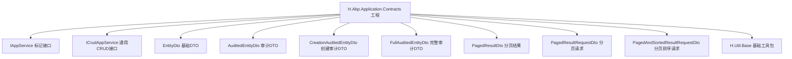
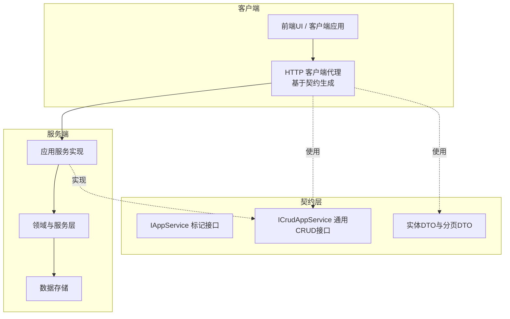
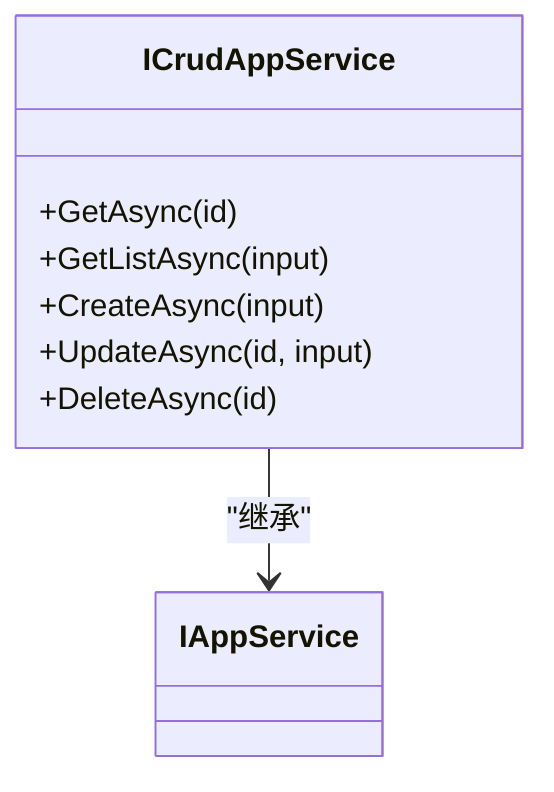
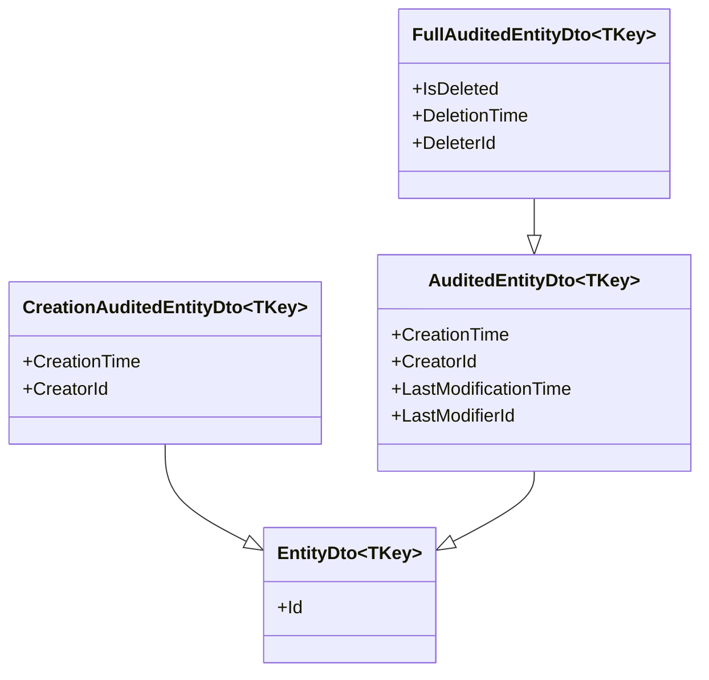
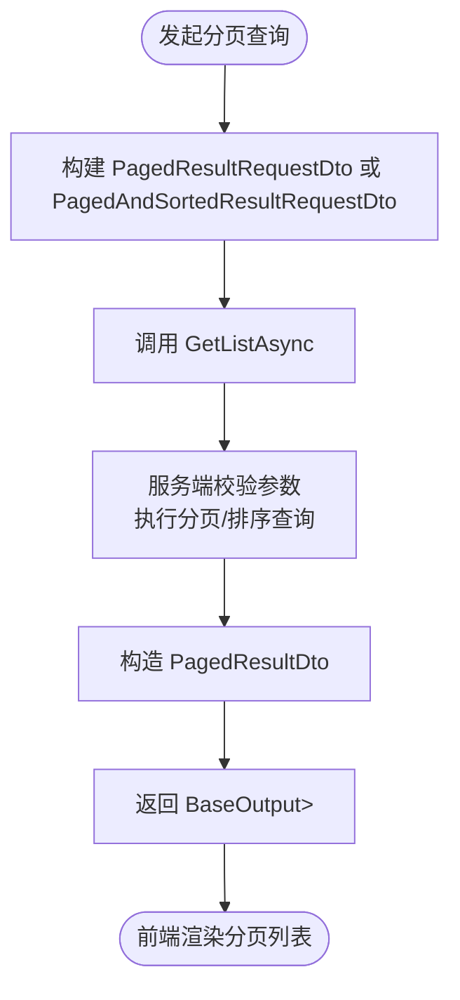

# H.Abp.Application.Contracts ABP应用契约

<cite>
**本文引用的文件**   
- [IAppService.cs](file://src/Utils/H.Abp.Application.Contracts/IAppService.cs)
- [ICrudAppService.cs](file://src/Utils/H.Abp.Application.Contracts/ICrudAppService.cs)
- [EntityDto.cs](file://src/Utils/H.Abp.Application.Contracts/EntityDto.cs)
- [AuditedEntityDto.cs](file://src/Utils/H.Abp.Application.Contracts/AuditedEntityDto.cs)
- [CreationAuditedEntityDto.cs](file://src/Utils/H.Abp.Application.Contracts/CreationAuditedEntityDto.cs)
- [FullAuditedEntityDto.cs](file://src/Utils/H.Abp.Application.Contracts/FullAuditedEntityDto.cs)
- [PagedResultDto.cs](file://src/Utils/H.Abp.Application.Contracts/PagedResultDto.cs)
- [PagedResultRequestDto.cs](file://src/Utils/H.Abp.Application.Contracts/PagedResultRequestDto.cs)
- [PagedAndSortedResultRequestDto.cs](file://src/Utils/H.Abp.Application.Contracts/PagedAndSortedResultRequestDto.cs)
- [H.Abp.Application.Contracts.csproj](file://src/Utils/H.Abp.Application.Contracts/H.Abp.Application.Contracts.csproj)
</cite>

## 目录
1. [简介](#简介)
2. [项目结构](#项目结构)
3. [核心组件](#核心组件)
4. [架构总览](#架构总览)
5. [详细组件分析](#详细组件分析)
6. [依赖关系分析](#依赖关系分析)
7. [性能考虑](#性能考虑)
8. [故障排查指南](#故障排查指南)
9. [结论](#结论)
10. [附录：接口与DTO速查表](#附录接口与dto速查表)

## 简介
H.Abp.Application.Contracts 是一个面向ABP生态的轻量级“应用契约”封装库。它定义了通用的应用服务标记接口、标准化CRUD应用服务接口，以及实体DTO与分页DTO的基础类型。其目标是：
- 为前后端提供一致的API契约，便于代码生成和类型安全的调用；
- 通过可组合的DTO基类，统一实体数据传输对象的结构；
- 与标准ABP Framework保持方法签名与JSON序列化结构的兼容，降低迁移成本；
- 在微服务或多端场景中，作为稳定的契约层边界。

该库本身不包含业务实现，只定义接口和数据模型，从而支持服务端多实现（Web API、gRPC、消息等）与客户端多种语言/框架的代码生成。

## 项目结构
本仓库中与 H.Abp.Application.Contracts 相关的源文件均位于 Utils 下的 H.Abp.Application.Contracts 工程中，主要包含以下文件：
- IAppService.cs：应用服务标记接口
- ICrudAppService.cs：通用CRUD应用服务接口
- EntityDto.cs：基础实体DTO
- AuditedEntityDto.cs：审计实体DTO
- CreationAuditedEntityDto.cs：创建审计DTO
- FullAuditedEntityDto.cs：完整审计DTO
- PagedResultDto.cs：分页结果DTO
- PagedResultRequestDto.cs：分页请求DTO
- PagedAndSortedResultRequestDto.cs：分页排序请求DTO
- H.Abp.Application.Contracts.csproj：工程引用与打包配置

**图表来源**
- [IAppService.cs:1-8](file://src/Utils/H.Abp.Application.Contracts/IAppService.cs#L1-L8)
- [ICrudAppService.cs:1-15](file://src/Utils/H.Abp.Application.Contracts/ICrudAppService.cs#L1-L15)
- [EntityDto.cs:1-6](file://src/Utils/H.Abp.Application.Contracts/EntityDto.cs#L1-L6)
- [AuditedEntityDto.cs:1-9](file://src/Utils/H.Abp.Application.Contracts/AuditedEntityDto.cs#L1-L9)
- [CreationAuditedEntityDto.cs:1-7](file://src/Utils/H.Abp.Application.Contracts/CreationAuditedEntityDto.cs#L1-L7)
- [FullAuditedEntityDto.cs:1-11](file://src/Utils/H.Abp.Application.Contracts/FullAuditedEntityDto.cs#L1-L11)
- [PagedResultDto.cs:1-19](file://src/Utils/H.Abp.Application.Contracts/PagedResultDto.cs#L1-L19)
- [PagedResultRequestDto.cs:1-11](file://src/Utils/H.Abp.Application.Contracts/PagedResultRequestDto.cs#L1-L11)
- [PagedAndSortedResultRequestDto.cs:1-9](file://src/Utils/H.Abp.Application.Contracts/PagedAndSortedResultRequestDto.cs#L1-L9)
- [H.Abp.Application.Contracts.csproj:1-8](file://src/Utils/H.Abp.Application.Contracts/H.Abp.Application.Contracts.csproj#L1-L8)

**章节来源**
- [H.Abp.Application.Contracts.csproj:1-8](file://src/Utils/H.Abp.Application.Contracts/H.Abp.Application.Contracts.csproj#L1-L8)

## 核心组件
本节概述库中的关键抽象与约定。

- IAppService：空标记接口，用于标识可通过 HTTP 代理远程调用的应用服务接口。它是所有应用服务的根契约，方便在服务发现、路由或拦截器中按约定识别并处理。
- ICrudAppService<TEntityDto, TKey, TGetListInput, TCreateInput, TUpdateInput>：标准化CRUD接口，定义 GetAsync、GetListAsync、CreateAsync、UpdateAsync、DeleteAsync 五个方法，返回统一包装 BaseOutput<T>。该方法签名与ABP的ICrudAppService保持一致，利于替换或共存。
- 实体DTO基类族：EntityDto<TKey> 提供 Id 字段；AuditedEntityDto<TKey> 增加创建/修改时间与人；CreationAuditedEntityDto<TKey> 仅保留创建审计信息；FullAuditedEntityDto<TKey> 在审计基础上增加软删除相关字段。
- 分页DTO：PagedResultDto<T> 表示分页结果（总数与数据项）；PagedResultRequestDto 表示分页参数（跳过数量与最大条数）；PagedAndSortedResultRequestDto 在其基础上增加排序字符串。

这些组件共同构成一套轻量的“应用层契约”，不绑定具体基础设施，适合跨进程、跨语言调用。

**章节来源**
- [IAppService.cs:1-8](file://src/Utils/H.Abp.Application.Contracts/IAppService.cs#L1-L8)
- [ICrudAppService.cs:1-15](file://src/Utils/H.Abp.Application.Contracts/ICrudAppService.cs#L1-L15)
- [EntityDto.cs:1-6](file://src/Utils/H.Abp.Application.Contracts/EntityDto.cs#L1-L6)
- [AuditedEntityDto.cs:1-9](file://src/Utils/H.Abp.Application.Contracts/AuditedEntityDto.cs#L1-L9)
- [CreationAuditedEntityDto.cs:1-7](file://src/Utils/H.Abp.Application.Contracts/CreationAuditedEntityDto.cs#L1-L7)
- [FullAuditedEntityDto.cs:1-11](file://src/Utils/H.Abp.Application.Contracts/FullAuditedEntityDto.cs#L1-L11)
- [PagedResultDto.cs:1-19](file://src/Utils/H.Abp.Application.Contracts/PagedResultDto.cs#L1-L19)
- [PagedResultRequestDto.cs:1-11](file://src/Utils/H.Abp.Application.Contracts/PagedResultRequestDto.cs#L1-L11)
- [PagedAndSortedResultRequestDto.cs:1-9](file://src/Utils/H.Abp.Application.Contracts/PagedAndSortedResultRequestDto.cs#L1-L9)

## 架构总览
下图展示契约库在整体系统中的位置与交互方式：前端或服务端消费者通过生成的客户端代理调用后端实现；契约库保证两端共享一致的DTO与方法签名。

**图表来源**
- [IAppService.cs:1-8](file://src/Utils/H.Abp.Application.Contracts/IAppService.cs#L1-L8)
- [ICrudAppService.cs:1-15](file://src/Utils/H.Abp.Application.Contracts/ICrudAppService.cs#L1-L15)
- [PagedResultDto.cs:1-19](file://src/Utils/H.Abp.Application.Contracts/PagedResultDto.cs#L1-L19)
- [PagedResultRequestDto.cs:1-11](file://src/Utils/H.Abp.Application.Contracts/PagedResultRequestDto.cs#L1-L11)

## 详细组件分析

### IAppService 应用服务标记接口
- 作用：作为所有远程应用服务的统一标记，便于在HTTP代理、网关或拦截器中按约定识别需要序列化和转发的服务接口。
- 设计要点：接口为空，避免强约束，同时提供明确的语义标签。

**章节来源**
- [IAppService.cs:1-8](file://src/Utils/H.Abp.Application.Contracts/IAppService.cs#L1-L8)

### ICrudAppService 通用CRUD接口
- 泛型参数：
  - TEntityDto：对外暴露的实体DTO类型
  - TKey：实体主键类型
  - TGetListInput：列表查询输入DTO
  - TCreateInput：创建输入DTO
  - TUpdateInput：更新输入DTO
- 方法语义：
  - GetAsync：根据ID获取单个实体
  - GetListAsync：分页获取实体列表
  - CreateAsync：创建新实体
  - UpdateAsync：根据ID更新实体
  - DeleteAsync：根据ID删除实体
- 返回值：统一使用 BaseOutput<T> 包裹，便于前端统一处理成功/失败响应。

**图表来源**
- [IAppService.cs:1-8](file://src/Utils/H.Abp.Application.Contracts/IAppService.cs#L1-L8)
- [ICrudAppService.cs:1-15](file://src/Utils/H.Abp.Application.Contracts/ICrudAppService.cs#L1-L15)

**章节来源**
- [ICrudAppService.cs:1-15](file://src/Utils/H.Abp.Application.Contracts/ICrudAppService.cs#L1-L15)

### 实体DTO基类族

#### EntityDto<TKey>
- 字段：Id（主键），默认值由运行时决定。
- 用途：所有实体DTO的最小公共基类，确保所有对外传输对象具备唯一标识。

#### CreationAuditedEntityDto<TKey>
- 继承：EntityDto<TKey>
- 新增字段：
  - CreationTime：创建时间
  - CreatorId：创建人ID（可为空）
- 适用场景：仅需记录创建信息的实体，如配置项、字典条目等。

#### AuditedEntityDto<TKey>
- 继承：EntityDto<TKey>
- 新增字段：
  - CreationTime、CreatorId
  - LastModificationTime、LastModifierId
- 适用场景：需要记录创建与最后修改信息的实体。

#### FullAuditedEntityDto<TKey>
- 继承：AuditedEntityDto<TKey>
- 新增字段：
  - IsDeleted：是否已删除
  - DeletionTime：删除时间
  - DeleterId：删除人ID
- 适用场景：需要软删除能力的实体，如组织、用户、订单等。

**图表来源**
- [EntityDto.cs:1-6](file://src/Utils/H.Abp.Application.Contracts/EntityDto.cs#L1-L6)
- [CreationAuditedEntityDto.cs:1-7](file://src/Utils/H.Abp.Application.Contracts/CreationAuditedEntityDto.cs#L1-L7)
- [AuditedEntityDto.cs:1-9](file://src/Utils/H.Abp.Application.Contracts/AuditedEntityDto.cs#L1-L9)
- [FullAuditedEntityDto.cs:1-11](file://src/Utils/H.Abp.Application.Contracts/FullAuditedEntityDto.cs#L1-L11)

**章节来源**
- [EntityDto.cs:1-6](file://src/Utils/H.Abp.Application.Contracts/EntityDto.cs#L1-L6)
- [CreationAuditedEntityDto.cs:1-7](file://src/Utils/H.Abp.Application.Contracts/CreationAuditedEntityDto.cs#L1-L7)
- [AuditedEntityDto.cs:1-9](file://src/Utils/H.Abp.Application.Contracts/AuditedEntityDto.cs#L1-L9)
- [FullAuditedEntityDto.cs:1-11](file://src/Utils/H.Abp.Application.Contracts/FullAuditedEntityDto.cs#L1-L11)

### 分页相关DTO

#### PagedResultRequestDto
- 字段：
  - SkipCount：跳过的记录数
  - MaxResultCount：每页最大记录数，默认值为10
- 用途：作为列表查询输入DTO的基类，简化分页参数传递。

#### PagedAndSortedResultRequestDto
- 继承：PagedResultRequestDto
- 新增字段：
  - Sorting：排序表达式字符串
- 用途：支持按指定字段与顺序进行排序的分页查询。

#### PagedResultDto<T>
- 字段：
  - TotalCount：总记录数
  - Items：当前页的数据集合
- 用途：作为GetListAsync等方法的返回数据载体，配合前端分页控件展示。

**图表来源**
- [PagedResultRequestDto.cs:1-11](file://src/Utils/H.Abp.Application.Contracts/PagedResultRequestDto.cs#L1-L11)
- [PagedAndSortedResultRequestDto.cs:1-9](file://src/Utils/H.Abp.Application.Contracts/PagedAndSortedResultRequestDto.cs#L1-L9)
- [PagedResultDto.cs:1-19](file://src/Utils/H.Abp.Application.Contracts/PagedResultDto.cs#L1-L19)
- [ICrudAppService.cs:1-15](file://src/Utils/H.Abp.Application.Contracts/ICrudAppService.cs#L1-L15)

**章节来源**
- [PagedResultRequestDto.cs:1-11](file://src/Utils/H.Abp.Application.Contracts/PagedResultRequestDto.cs#L1-L11)
- [PagedAndSortedResultRequestDto.cs:1-9](file://src/Utils/H.Abp.Application.Contracts/PagedAndSortedResultRequestDto.cs#L1-L9)
- [PagedResultDto.cs:1-19](file://src/Utils/H.Abp.Application.Contracts/PagedResultDto.cs#L1-L19)

### 在ABP框架中的使用示例与最佳实践
由于本库仅提供契约定义，实际使用通常遵循以下模式：
- 在服务端：
  - 定义业务DTO，继承合适的实体DTO基类（如 FullAuditedEntityDto<Guid>）；
  - 定义应用服务接口，继承 ICrudAppService<TEntityDto, TKey, TGetListInput, TCreateInput, TUpdateInput>；
  - 在服务端实现接口，并使用 BaseOutput<T> 包装返回结果。
- 在客户端：
  - 通过契约库生成客户端代理（例如基于HTTP客户端的代理），获得类型安全的方法调用；
  - 将 PagedResultRequestDto 或 PagedAndSortedResultRequestDto 作为列表查询输入；
  - 消费 PagedResultDto<T> 的结果，结合前端分页组件展示。

兼容性说明：
- ICrudAppService 的方法签名与ABP的ICrudAppService保持一致；
- DTO 的JSON结构与ABP对应的 FullAuditedEntityDto、PagedResultDto 等保持一致；
- 因此，现有ABP项目可以平滑迁移到使用该契约库，或将该契约库作为新的契约边界。

微服务建议：
- 将 H.Abp.Application.Contracts 作为独立NuGet包发布，供多个微服务与前端工程引用；
- 对接口变更采用版本化策略（如路径或命名空间隔离）；
- 通过契约驱动开发（CDD）先行定义接口，再并行实现各服务。

错误处理与数据验证建议：
- 服务端实现应集中处理异常并映射为标准错误响应，配合 BaseOutput<T> 的统一格式；
- 对输入DTO添加验证规则（长度、必填、范围等），在服务入口处进行校验；
- 对分页参数做边界检查（SkipCount非负、MaxResultCount合理范围），防止恶意请求。

性能优化建议：
- 列表查询使用数据库层面的分页与投影，避免全量加载；
- 合理使用索引（尤其是排序字段与过滤条件字段）；
- 对频繁读取的数据引入缓存策略（如Redis），注意失效与一致性；
- 控制DTO字段大小，避免返回不必要的冗余字段。

[本节为概念性指导，不直接分析具体源码文件]

## 依赖关系分析
H.Abp.Application.Contracts 工程仅引用了 H.Util.Base 基础工具包，以复用 BaseOutput<T> 等通用类型。契约层保持最小依赖，有利于跨平台与多语言代码生成。

**图表来源**
- [H.Abp.Application.Contracts.csproj:1-8](file://src/Utils/H.Abp.Application.Contracts/H.Abp.Application.Contracts.csproj#L1-L8)

**章节来源**
- [H.Abp.Application.Contracts.csproj:1-8](file://src/Utils/H.Abp.Application.Contracts/H.Abp.Application.Contracts.csproj#L1-L8)

## 性能考虑
- 分页查询：优先在数据库侧完成分页与排序，减少内存占用和网络传输；
- 数据传输：DTO尽量只包含必要字段，避免携带大对象；
- 缓存策略：对读多写少的数据采用缓存，注意缓存穿透与雪崩保护；
- 连接池与并发：合理设置数据库连接池与线程池，避免资源耗尽；
- 批量操作：对大批量写入/更新采用批处理方式，降低往返次数。

[本节为通用性能建议，不直接分析具体源码文件]

## 故障排查指南
常见问题与定位思路：
- 前端无法识别分页字段：确认 PagedResultDto<T> 的 JSON 结构与前端期望一致；
- 排序无效：检查 PagedAndSortedResultRequestDto.Sorting 是否为空且符合服务端排序解析规则；
- 审计字段未填充：确保服务端在创建/更新时正确填充 CreationTime、CreatorId、LastModificationTime、LastModifierId；
- 软删除状态不一致：确认 FullAuditedEntityDto.IsDeleted 与数据库记录一致，删除逻辑需同步更新审计字段；
- 返回结构异常：确认所有接口返回 BaseOutput<T>，并在客户端统一解析成功/失败分支。

**章节来源**
- [ICrudAppService.cs:1-15](file://src/Utils/H.Abp.Application.Contracts/ICrudAppService.cs#L1-L15)
- [PagedResultDto.cs:1-19](file://src/Utils/H.Abp.Application.Contracts/PagedResultDto.cs#L1-L19)
- [PagedAndSortedResultRequestDto.cs:1-9](file://src/Utils/H.Abp.Application.Contracts/PagedAndSortedResultRequestDto.cs#L1-L9)
- [AuditedEntityDto.cs:1-9](file://src/Utils/H.Abp.Application.Contracts/AuditedEntityDto.cs#L1-L9)
- [FullAuditedEntityDto.cs:1-11](file://src/Utils/H.Abp.Application.Contracts/FullAuditedEntityDto.cs#L1-L11)

## 结论
H.Abp.Application.Contracts 通过极简的契约定义，提供了与应用层交互所需的核心抽象：应用服务标记、标准化CRUD接口、实体DTO基类族与分页DTO。它在ABP生态中具有良好兼容性，适合作为微服务或多端项目的稳定契约层。借助契约驱动开发与代码生成，团队可以在前后端并行协作的同时，确保类型安全与接口一致性。

[本节为总结性内容，不直接分析具体源码文件]

## 附录：接口与DTO速查表
- IAppService
  - 角色：应用服务标记接口
  - 特点：空接口，用于远程服务识别
- ICrudAppService<TEntityDto, TKey, TGetListInput, TCreateInput, TUpdateInput>
  - 方法：GetAsync、GetListAsync、CreateAsync、UpdateAsync、DeleteAsync
  - 返回：BaseOutput<T>
- EntityDto<TKey>
  - 字段：Id
- CreationAuditedEntityDto<TKey>
  - 字段：CreationTime、CreatorId
- AuditedEntityDto<TKey>
  - 字段：CreationTime、CreatorId、LastModificationTime、LastModifierId
- FullAuditedEntityDto<TKey>
  - 字段：IsDeleted、DeletionTime、DeleterId
- PagedResultRequestDto
  - 字段：SkipCount、MaxResultCount（默认10）
- PagedAndSortedResultRequestDto
  - 字段：Sorting
- PagedResultDto<T>
  - 字段：TotalCount、Items

**章节来源**
- [IAppService.cs:1-8](file://src/Utils/H.Abp.Application.Contracts/IAppService.cs#L1-L8)
- [ICrudAppService.cs:1-15](file://src/Utils/H.Abp.Application.Contracts/ICrudAppService.cs#L1-L15)
- [EntityDto.cs:1-6](file://src/Utils/H.Abp.Application.Contracts/EntityDto.cs#L1-L6)
- [CreationAuditedEntityDto.cs:1-7](file://src/Utils/H.Abp.Application.Contracts/CreationAuditedEntityDto.cs#L1-L7)
- [AuditedEntityDto.cs:1-9](file://src/Utils/H.Abp.Application.Contracts/AuditedEntityDto.cs#L1-L9)
- [FullAuditedEntityDto.cs:1-11](file://src/Utils/H.Abp.Application.Contracts/FullAuditedEntityDto.cs#L1-L11)
- [PagedResultRequestDto.cs:1-11](file://src/Utils/H.Abp.Application.Contracts/PagedResultRequestDto.cs#L1-L11)
- [PagedAndSortedResultRequestDto.cs:1-9](file://src/Utils/H.Abp.Application.Contracts/PagedAndSortedResultRequestDto.cs#L1-L9)
- [PagedResultDto.cs:1-19](file://src/Utils/H.Abp.Application.Contracts/PagedResultDto.cs#L1-L19)