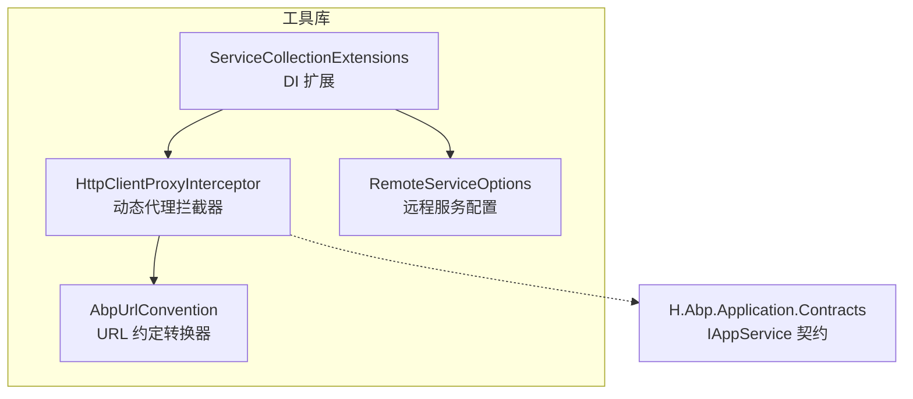
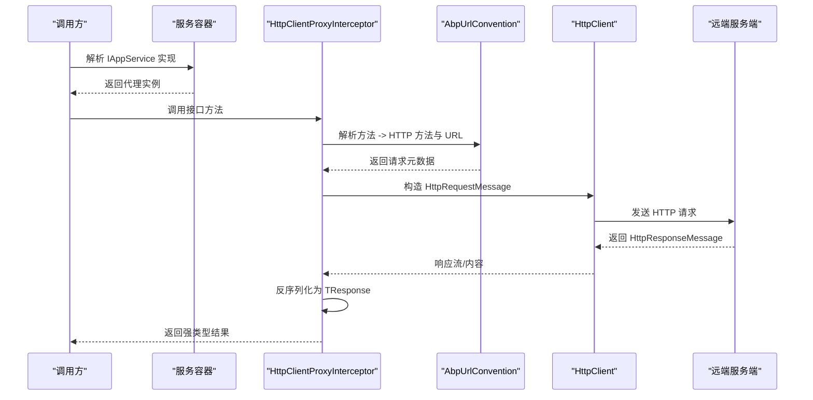
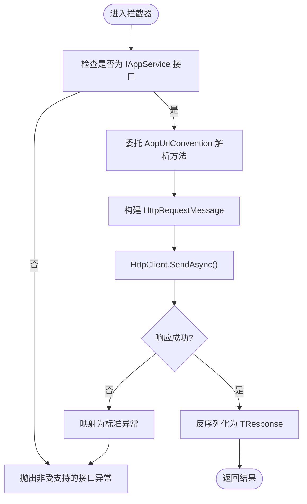
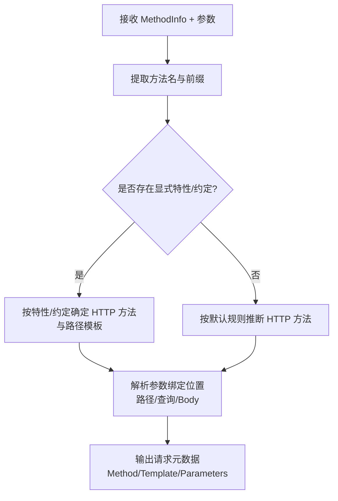
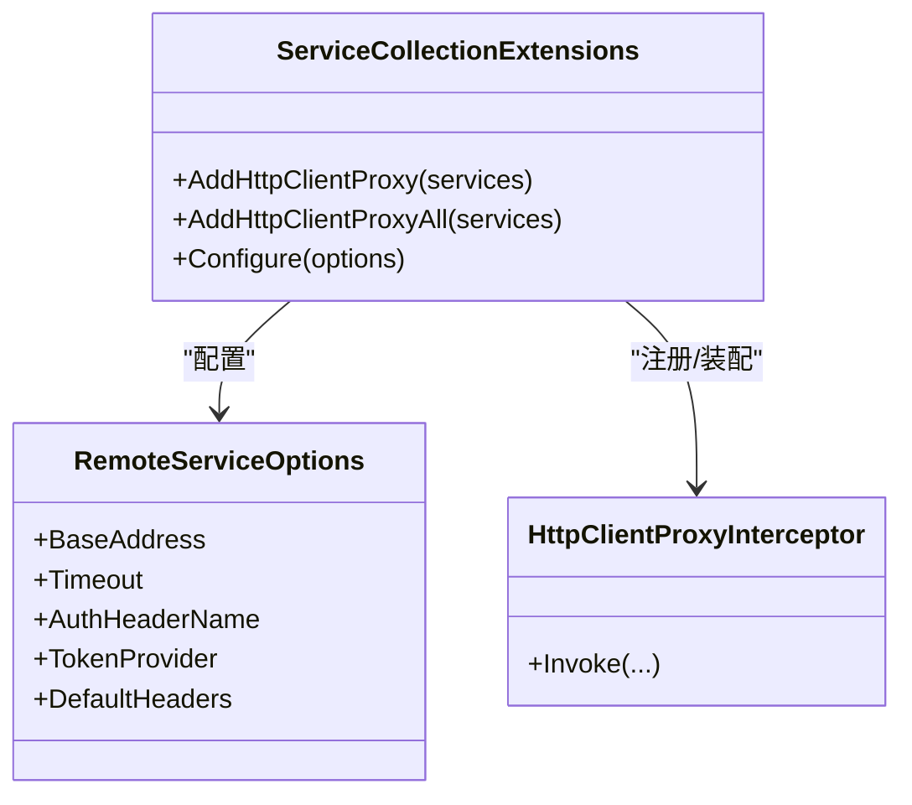
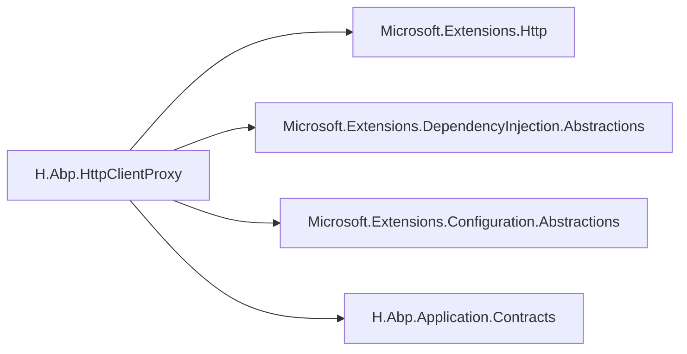
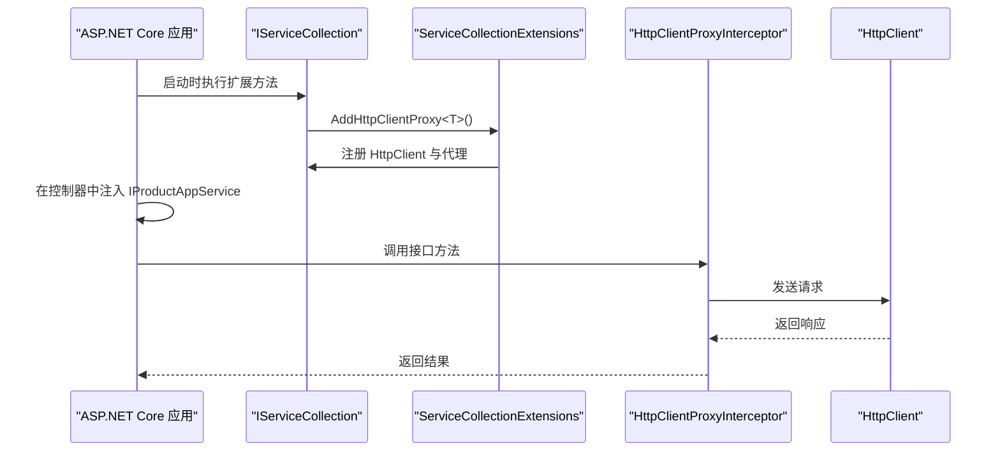

# H.Abp.HttpClientProxy HTTP客户端代理

<cite>
**本文引用的文件**   
- [H.Abp.HttpClientProxy.csproj](file://src/Utils/H.Abp.HttpClientProxy/H.Abp.HttpClientProxy.csproj)
- [HttpClientProxyInterceptor.cs](file://src/Utils/H.Abp.HttpClientProxy/HttpClientProxyInterceptor.cs)
- [AbpUrlConvention.cs](file://src/Utils/H.Abp.HttpClientProxy/AbpUrlConvention.cs)
- [RemoteServiceOptions.cs](file://src/Utils/H.Abp.HttpClientProxy/RemoteServiceOptions.cs)
- [ServiceCollectionExtensions.cs](file://src/Utils/H.Abp.HttpClientProxy/ServiceCollectionExtensions.cs)
- [IAppService.cs](file://src/Utils/H.Abp.Application.Contracts/IAppService.cs)
</cite>

## 目录
1. [引言](#引言)
2. [项目结构](#项目结构)
3. [核心组件](#核心组件)
4. [架构总览](#架构总览)
5. [详细组件分析](#详细组件分析)
6. [依赖关系分析](#依赖关系分析)
7. [性能与连接池](#性能与连接池)
8. [集成示例](#集成示例)
9. [常见问题排查](#常见问题排查)
10. [结论](#结论)

## 引言
H.Abp.HttpClientProxy 是一个面向 ABP 风格 AppService 接口的轻量级 HTTP 客户端动态代理库。它通过 .NET 的动态代理机制，将实现了 IAppService 的接口自动转换为基于 HttpClient 的远程调用实现，并借助 AbpUrlConvention 将 C# 方法签名映射为 RESTful URL、HTTP 方法与参数绑定。配合 ServiceCollectionExtensions 提供的扩展方法，可以在 ASP.NET Core 服务容器中完成统一注册与配置；RemoteServiceOptions 提供基础地址、超时、认证令牌传递等远程服务行为开关。该库适用于 Blazor WebAssembly、控制台应用或任意支持 DI 的 .NET 环境。

## 项目结构
本仓库中与 H.Abp.HttpClientProxy 直接相关的源码位于 Utils 下的独立项目，采用“工具类库 + 契约”的分离组织方式：
- H.Abp.HttpClientProxy：动态代理、URL 约定、服务注册扩展与远程配置选项。
- H.Abp.Application.Contracts：ABP 风格的 IAppService 与常见 DTO 契约，供客户端与服务端共享。

图表来源
- [HttpClientProxyInterceptor.cs](file://src/Utils/H.Abp.HttpClientProxy/HttpClientProxyInterceptor.cs)
- [AbpUrlConvention.cs](file://src/Utils/H.Abp.HttpClientProxy/AbpUrlConvention.cs)
- [ServiceCollectionExtensions.cs](file://src/Utils/H.Abp.HttpClientProxy/ServiceCollectionExtensions.cs)
- [RemoteServiceOptions.cs](file://src/Utils/H.Abp.HttpClientProxy/RemoteServiceOptions.cs)
- [IAppService.cs](file://src/Utils/H.Abp.Application.Contracts/IAppService.cs)

章节来源
- [H.Abp.HttpClientProxy.csproj:1-13](file://src/Utils/H.Abp.HttpClientProxy/H.Abp.HttpClientProxy.csproj#L1-L13)

## 核心组件
- HttpClientProxyInterceptor：基于 .NET 动态代理的拦截器，负责解析目标接口与方法、委托给 AbpUrlConvention 生成请求信息，并通过 HttpClient 发起网络请求、反序列化响应。
- AbpUrlConvention：URL 约定转换器，根据方法名、特性（如存在）与参数类型，推导 HTTP 方法、路径模板与参数绑定位置。
- RemoteServiceOptions：集中式远程服务配置项，包含基础 URL、超时、认证头注入策略等。
- ServiceCollectionExtensions：在 IServiceCollection 上提供 AddHttpClientProxy<T>() 等扩展，完成 HttpClient 与代理实例的注册与装配。
- IAppService：抽象契约基接口，作为客户端代理的目标类型约定。

章节来源
- [HttpClientProxyInterceptor.cs](file://src/Utils/H.Abp.HttpClientProxy/HttpClientProxyInterceptor.cs)
- [AbpUrlConvention.cs](file://src/Utils/H.Abp.HttpClientProxy/AbpUrlConvention.cs)
- [RemoteServiceOptions.cs](file://src/Utils/H.Abp.HttpClientProxy/RemoteServiceOptions.cs)
- [ServiceCollectionExtensions.cs](file://src/Utils/H.Abp.HttpClientProxy/ServiceCollectionExtensions.cs)
- [IAppService.cs](file://src/Utils/H.Abp.Application.Contracts/IAppService.cs)

## 架构总览
下图展示了从接口调用到 HTTP 响应的端到端流程，以及各组件之间的职责边界。

图表来源
- [HttpClientProxyInterceptor.cs](file://src/Utils/H.Abp.HttpClientProxy/HttpClientProxyInterceptor.cs)
- [AbpUrlConvention.cs](file://src/Utils/H.Abp.HttpClientProxy/AbpUrlConvention.cs)

## 详细组件分析

### HttpClientProxyInterceptor 动态代理拦截器
- 作用：对实现了 IAppService 的接口进行动态代理，捕获所有方法调用，将其转化为 HTTP 请求。
- 关键流程：
  - 识别目标接口是否继承 IAppService。
  - 使用 AbpUrlConvention 解析方法签名，得到 HTTP 方法、路径模板与参数绑定规则。
  - 使用服务容器中的 HttpClient（建议以 Named/Typed HttpClient 方式注册）发送请求。
  - 根据返回的 JSON 响应体反序列化为泛型返回值或 Task<T>。
- 错误处理：
  - 当响应为非成功状态码时，抛出标准化异常（例如包含状态码与消息）。
  - 对序列化失败、网络不可用、超时等异常进行包装，便于上层统一处理。
- 性能要点：
  - 复用 HttpClient 实例，避免频繁创建销毁导致端口耗尽。
  - 尽量缓存已解析的方法元数据，减少反射开销。
- 可观测性：
  - 可在拦截前后记录耗时、方法名、URL 与状态码，用于监控与日志。

图表来源
- [HttpClientProxyInterceptor.cs](file://src/Utils/H.Abp.HttpClientProxy/HttpClientProxyInterceptor.cs)

章节来源
- [HttpClientProxyInterceptor.cs](file://src/Utils/H.Abp.HttpClientProxy/HttpClientProxyInterceptor.cs)

### AbpUrlConvention URL 约定转换器
- 作用：将 C# 方法名与参数映射为 RESTful 路由、HTTP 方法与查询/路径/Body 参数。
- 默认规则（概念说明）：
  - 方法名前缀决定 HTTP 方法：Get/List/Find/ById 等通常映射为 GET；Create/Add 映射为 POST；Update/Patch 映射为 PUT/PATCH；Delete/Remove 映射为 DELETE。
  - 若方法名包含 Id 或 Guid 等标识符参数，默认将其作为路径段。
  - 复杂对象参数默认映射为 JSON Body。
  - 简单标量参数（int、string、DateTime 等）默认映射为查询字符串。
- 扩展点：
  - 可通过自定义特性或约定覆盖默认映射。
  - 允许显式指定 HTTP 方法与路径模板。
- 典型转换：
  - GetUsers(int page, int size) → GET /api/users?page=...&size=...
  - GetUserById(Guid id) → GET /api/users/{id}
  - CreateUser(UserDto dto) → POST /api/users (JSON Body)
  - UpdateUser(Guid id, UserDto dto) → PUT /api/users/{id} (JSON Body)
  - DeleteUser(Guid id) → DELETE /api/users/{id}

图表来源
- [AbpUrlConvention.cs](file://src/Utils/H.Abp.HttpClientProxy/AbpUrlConvention.cs)

章节来源
- [AbpUrlConvention.cs](file://src/Utils/H.Abp.HttpClientProxy/AbpUrlConvention.cs)

### RemoteServiceOptions 远程服务配置
- 用途：集中管理远程服务行为，避免硬编码基础地址与超时等。
- 常见配置项（概念说明）：
  - BaseAddress：远端服务基础 URL，如 https://api.example.com。
  - Timeout：HttpClient 默认超时时间。
  - AuthHeaderName：认证头名称，通常为 Authorization。
  - TokenProvider：获取当前访问令牌的委托，由上层注入上下文。
  - DefaultHeaders：默认请求头集合，便于注入公共头。
- 使用场景：
  - 在 ServiceCollectionExtensions 中读取配置并应用到 HttpClient 与拦截器。
  - 在 Blazor WebAssembly 中结合本地存储或认证服务获取 Token。

章节来源
- [RemoteServiceOptions.cs](file://src/Utils/H.Abp.HttpClientProxy/RemoteServiceOptions.cs)

### ServiceCollectionExtensions 服务容器扩展
- 作用：简化 HttpClient 与动态代理的注册流程。
- 典型能力：
  - AddHttpClientProxy<T>()：为某个 IAppService 接口注册一个 Typed HttpClient + 动态代理实例。
  - AddHttpClientProxyAll()：扫描程序集，将所有 IAppService 实现批量注册。
  - Configure(options)：设置 RemoteServiceOptions，如 BaseAddress、Timeout、认证头等。
  - 可选：注入自定义 IHttpClientFactory 或 HttpClient 命名实例。
- 生命周期：
  - 代理实例通常按 Scoped 或 Singleton 注册，取决于业务需求与 HttpClient 生命周期策略。

图表来源
- [ServiceCollectionExtensions.cs](file://src/Utils/H.Abp.HttpClientProxy/ServiceCollectionExtensions.cs)
- [RemoteServiceOptions.cs](file://src/Utils/H.Abp.HttpClientProxy/RemoteServiceOptions.cs)
- [HttpClientProxyInterceptor.cs](file://src/Utils/H.Abp.HttpClientProxy/HttpClientProxyInterceptor.cs)

章节来源
- [ServiceCollectionExtensions.cs](file://src/Utils/H.Abp.HttpClientProxy/ServiceCollectionExtensions.cs)

## 依赖关系分析
- 外部包：
  - Microsoft.Extensions.DependencyInjection.Abstractions：依赖注入抽象。
  - Microsoft.Extensions.Http：HttpClient 相关扩展与工厂。
  - Microsoft.Extensions.Configuration.Abstractions：配置读取抽象。
- 内部项目：
  - H.Abp.Application.Contracts：提供 IAppService 契约，作为代理目标类型约束。

图表来源
- [H.Abp.HttpClientProxy.csproj:1-13](file://src/Utils/H.Abp.HttpClientProxy/H.Abp.HttpClientProxy.csproj#L1-L13)

章节来源
- [H.Abp.HttpClientProxy.csproj:1-13](file://src/Utils/H.Abp.HttpClientProxy/H.Abp.HttpClientProxy.csproj#L1-L13)

## 性能与连接池
- HttpClient 生命周期：
  - 建议使用 IHttpClientFactory 或 Named/Typed HttpClient，避免每次新建导致 Socket 耗尽。
  - 在 Blazor WebAssembly 中，注意浏览器底层连接限制，合理设置并发数与重试间隔。
- 连接池与并发：
  - 控制同一主机名的最大并发请求数量，避免触发系统或浏览器限制。
  - 对大流量 API 启用请求合并或缓存层（如内存缓存），降低后端压力。
- 序列化性能：
  - 使用高性能 JSON 序列化器（如 System.Text.Json 优化配置）。
  - 对热点 DTO 避免频繁装箱拆箱。
- 可观测性与监控：
  - 记录方法名、URL、状态码、耗时与失败率，接入指标系统（Prometheus/Grafana 等）。
  - 对慢请求进行采样告警。
- 重试与退避：
  - 对幂等 GET 请求可采用指数退避重试；POST/PUT/PATCH 谨慎重试。
  - 使用 Polly 等策略库统一封装重试与熔断逻辑。

[本节为通用性能指导，不直接分析具体文件]

## 集成示例

### 接口定义与契约
- 在服务端暴露 IAppService 接口（例如 IProductAppService）。
- 在客户端引用相同契约项目，保持 DTO 与接口一致。

章节来源
- [IAppService.cs](file://src/Utils/H.Abp.Application.Contracts/IAppService.cs)

### 在 ASP.NET Core 中注册
- 在 Program.cs 或 Startup 中：
  - 调用 ServiceCollectionExtensions.AddHttpClientProxy<IProductAppService>() 完成注册。
  - 通过 Configure<RemoteServiceOptions>() 设置 BaseAddress、Timeout 等。
  - 注入 IProductAppService 并在控制器或服务中调用。

图表来源
- [ServiceCollectionExtensions.cs](file://src/Utils/H.Abp.HttpClientProxy/ServiceCollectionExtensions.cs)
- [HttpClientProxyInterceptor.cs](file://src/Utils/H.Abp.HttpClientProxy/HttpClientProxyInterceptor.cs)

### 在 Blazor WebAssembly 中使用
- 在 Program.cs 中：
  - 使用 AddHttpClientProxy<T>() 注册代理。
  - 配置 RemoteServiceOptions.BaseAddress 指向 API 网关或后端服务。
  - 通过 TokenProvider 从本地存储或认证服务读取 Token，并注入 Authorization 头。
- 注意事项：
  - 跨域问题：确保后端启用 CORS 并允许前端 Origin。
  - Cookie 与凭据：如需携带 Cookie，需在 HttpClient 配置中开启 Credentials。
  - 单例 vs Scoped：Blazor WASM 通常是单例页面，注意 HttpClient 与认证状态的生命周期。

[本节为通用集成指导，不直接分析具体文件]

### 错误处理、重试与监控
- 错误处理：
  - 在拦截器中统一将非成功响应映射为标准异常，包含状态码与响应体摘要。
  - 在上层业务中捕获异常并给出友好提示。
- 重试机制：
  - 对幂等请求使用指数退避重试，避免雪崩。
  - 对限流（429）与临时故障（5xx）做差异化重试策略。
- 监控：
  - 在拦截前后打点，统计成功率、延迟分位与错误分布。
  - 对异常堆栈与 URL 进行脱敏后上报。

[本节为通用实践指导，不直接分析具体文件]

## 常见问题排查
- 无法解析接口为代理：
  - 确认接口继承自 IAppService。
  - 检查是否在 DI 中正确注册了代理。
- 路径或参数映射不符合预期：
  - 核对方法名前缀是否符合约定。
  - 检查参数类型与命名是否与约定匹配。
- 认证失败：
  - 确认 RemoteServiceOptions.AuthHeaderName 与 TokenProvider 是否正确配置。
  - 检查 Token 是否过期或刷新逻辑。
- 连接池耗尽或 Socket 泄漏：
  - 确保使用 IHttpClientFactory 或命名/类型化 HttpClient。
  - 避免在循环中重复创建 HttpClient。
- Blazor WebAssembly 跨域问题：
  - 后端启用 CORS，允许前端域名与 Header。
  - 必要时开启 Credentials 并处理预检请求。

章节来源
- [HttpClientProxyInterceptor.cs](file://src/Utils/H.Abp.HttpClientProxy/HttpClientProxyInterceptor.cs)
- [AbpUrlConvention.cs](file://src/Utils/H.Abp.HttpClientProxy/AbpUrlConvention.cs)
- [RemoteServiceOptions.cs](file://src/Utils/H.Abp.HttpClientProxy/RemoteServiceOptions.cs)
- [ServiceCollectionExtensions.cs](file://src/Utils/H.Abp.HttpClientProxy/ServiceCollectionExtensions.cs)

## 结论
H.Abp.HttpClientProxy 通过动态代理与 URL 约定，将 ABP 风格的 IAppService 接口无缝转换为 HTTP 客户端调用，显著减少了样板代码与手动拼接 URL 的工作量。配合 ServiceCollectionExtensions 与 RemoteServiceOptions，可以在多种 .NET 运行时中以一致的体验进行远程服务调用。在生产环境中，建议关注 HttpClient 生命周期、连接池、重试策略与可观测性，以获得稳定与高性能的远程调用能力。