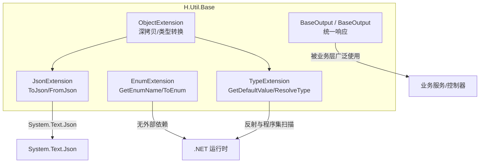
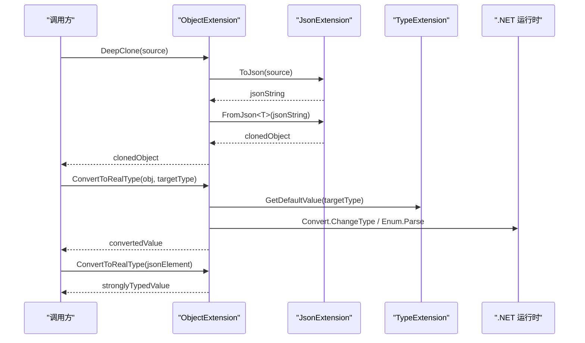
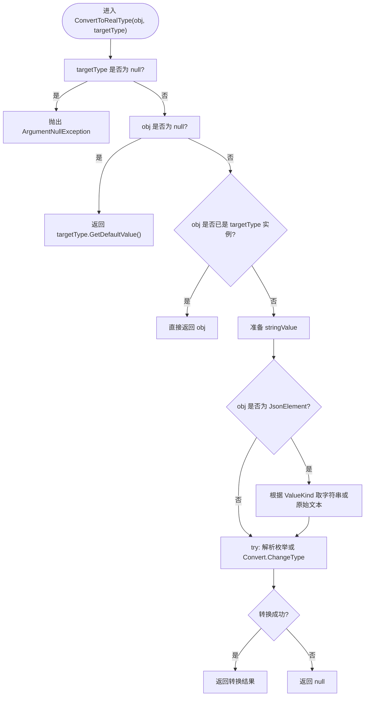
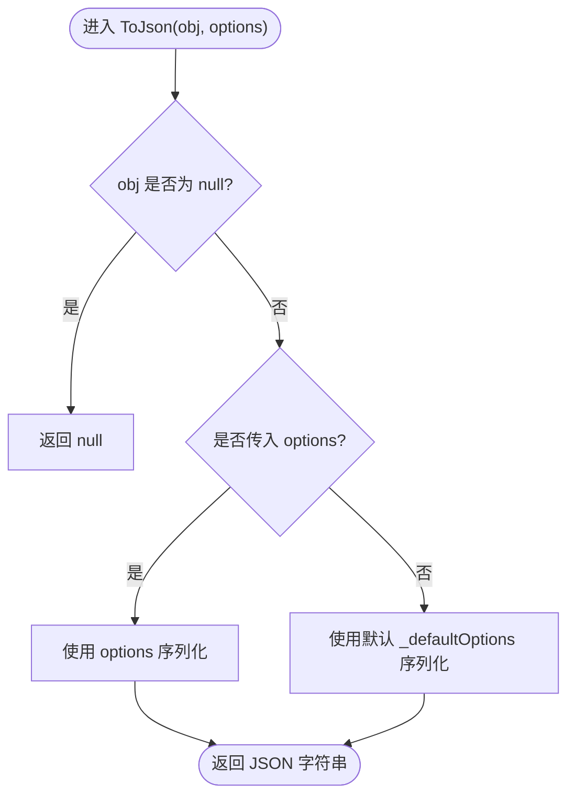
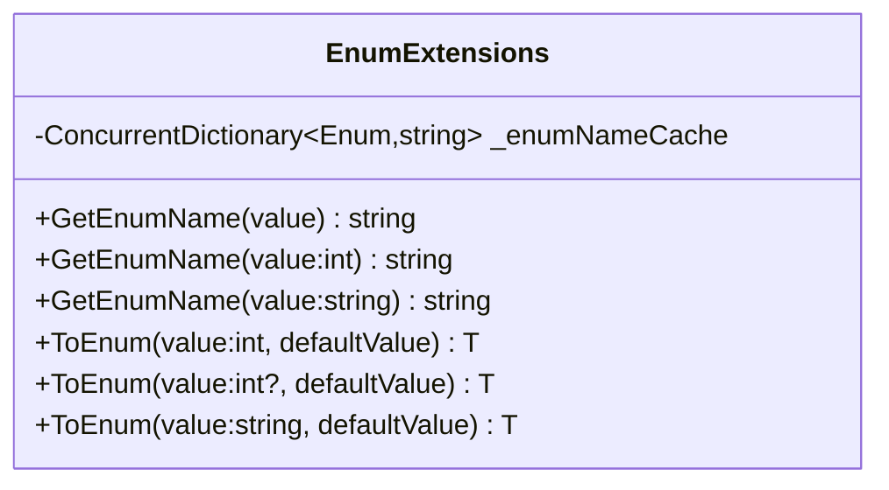
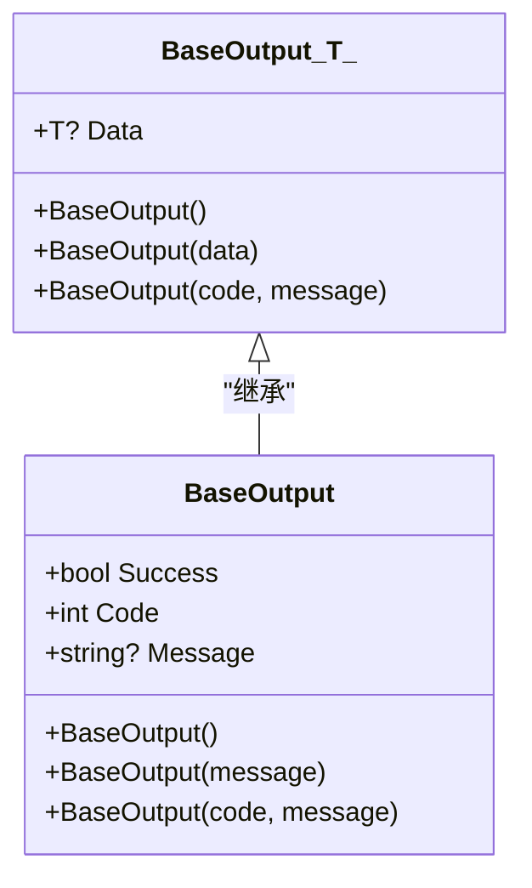
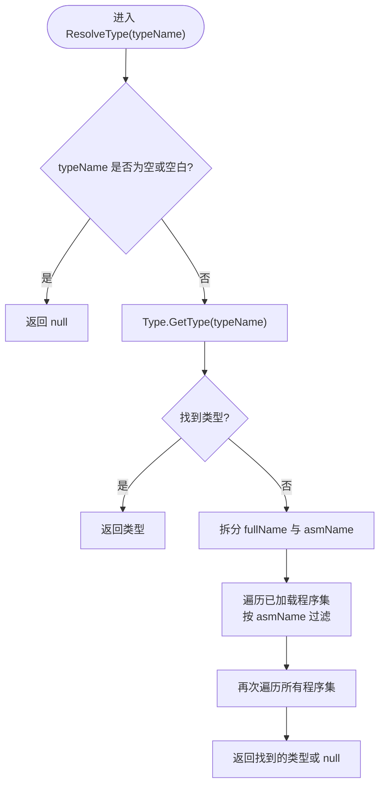
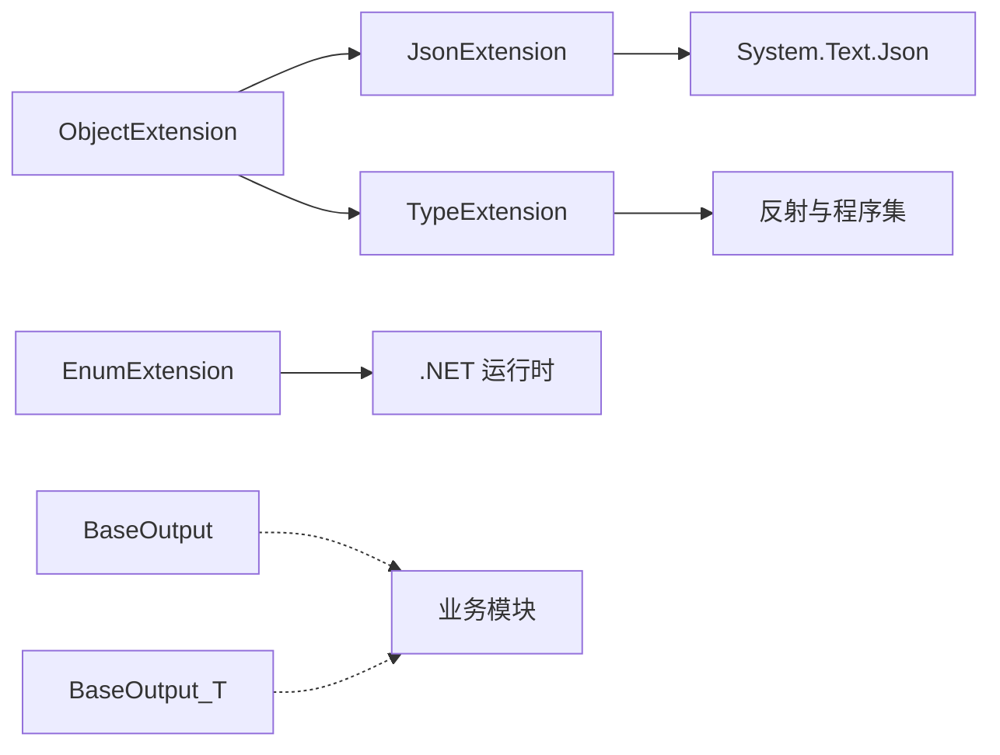

# H.Util.Base 基础工具库

<cite>
**本文引用的文件**   
- [ObjectExtension.cs](file://src/Utils/H.Util.Base/ObjectExtension.cs)
- [JsonExtension.cs](file://src/Utils/H.Util.Base/JsonExtension.cs)
- [EnumExtension.cs](file://src/Utils/H.Util.Base/EnumExtension.cs)
- [BaseOutput.cs](file://src/Utils/H.Util.Base/BaseOutput.cs)
- [TypeExtension.cs](file://src/Utils/H.Util.Base/TypeExtension.cs)
- [H.Util.Base.csproj](file://src/Utils/H.Util.Base/H.Util.Base.csproj)
</cite>

## 目录
1. [简介](#简介)
2. [项目结构](#项目结构)
3. [核心组件](#核心组件)
4. [架构总览](#架构总览)
5. [详细组件分析](#详细组件分析)
6. [依赖关系分析](#依赖关系分析)
7. [性能与使用建议](#性能与使用建议)
8. [故障排查指南](#故障排查指南)
9. [结论](#结论)
10. [附录：示例与最佳实践](#附录示例与最佳实践)

## 简介
H.Util.Base 是一个轻量级 C# 基础工具库，提供对象扩展、JSON 序列化扩展、枚举扩展、统一响应基类以及类型解析等常用能力。它围绕以下目标设计：
- 简化对象深拷贝与 JSON 序列化/反序列化
- 将动态或弱类型数据智能转换为强类型
- 为 API 返回体提供统一的 Success/Code/Message 规范
- 为泛型与非泛型场景提供一致的枚举转换体验
- 通过反射和程序集搜索实现灵活的类型解析与默认值生成

该库面向 .NET 应用（当前工程目标为 net10.0），依赖 System.Text.Json 等系统库，不引入额外第三方运行时依赖。

## 项目结构
H.Util.Base 项目由一组静态扩展类和通用输出模型组成，采用按职责拆分的扁平结构：
- ObjectExtension：对象扩展（深拷贝、类型转换、JsonElement 智能转换）
- JsonExtension：JSON 序列化扩展（ToJson、FromJson 及默认 JsonSerializerOptions）
- EnumExtension：枚举扩展（名称获取、多输入类型 ToEnum）
- BaseOutput / BaseOutput<T>：统一响应基类与泛型封装
- TypeExtension：类型扩展（默认值生成、类型解析）

图表来源
- [ObjectExtension.cs:1-105](file://src/Utils/H.Util.Base/ObjectExtension.cs#L1-L105)
- [JsonExtension.cs:1-45](file://src/Utils/H.Util.Base/JsonExtension.cs#L1-L45)
- [EnumExtension.cs:1-44](file://src/Utils/H.Util.Base/EnumExtension.cs#L1-L44)
- [BaseOutput.cs:1-52](file://src/Utils/H.Util.Base/BaseOutput.cs#L1-L52)
- [TypeExtension.cs:1-78](file://src/Utils/H.Util.Base/TypeExtension.cs#L1-L78)

章节来源
- [H.Util.Base.csproj:1-4](file://src/Utils/H.Util.Base/H.Util.Base.csproj#L1-L4)

## 核心组件
- ObjectExtension：提供 DeepClone 深拷贝、ConvertToRealType 类型转换、JsonElement 智能转换等能力。
- JsonExtension：提供 ToJson 序列化与 FromJson 反序列化，内置宽松编码器与忽略默认值的序列化选项。
- EnumExtension：提供 GetEnumName 名称获取与 ToEnum 安全转换，支持 int/string 输入与缓存优化。
- BaseOutput / BaseOutput<T>：定义 Success、Code、Message 的响应契约，T 用于承载业务数据。
- TypeExtension：提供 GetDefaultValue 默认值生成与 ResolveType 类型解析，基于反射与程序集遍历。

章节来源
- [ObjectExtension.cs:1-105](file://src/Utils/H.Util.Base/ObjectExtension.cs#L1-L105)
- [JsonExtension.cs:1-45](file://src/Utils/H.Util.Base/JsonExtension.cs#L1-L45)
- [EnumExtension.cs:1-44](file://src/Utils/H.Util.Base/EnumExtension.cs#L1-L44)
- [BaseOutput.cs:1-52](file://src/Utils/H.Util.Base/BaseOutput.cs#L1-L52)
- [TypeExtension.cs:1-78](file://src/Utils/H.Util.Base/TypeExtension.cs#L1-L78)

## 架构总览
下图展示各工具类的协作关系与调用路径：

图表来源
- [ObjectExtension.cs:12-33](file://src/Utils/H.Util.Base/ObjectExtension.cs#L12-L33)
- [ObjectExtension.cs:35-83](file://src/Utils/H.Util.Base/ObjectExtension.cs#L35-L83)
- [ObjectExtension.cs:85-105](file://src/Utils/H.Util.Base/ObjectExtension.cs#L85-L105)
- [JsonExtension.cs:14-45](file://src/Utils/H.Util.Base/JsonExtension.cs#L14-L45)
- [TypeExtension.cs:4-26](file://src/Utils/H.Util.Base/TypeExtension.cs#L4-L26)

## 详细组件分析

### ObjectExtension：对象扩展
ObjectExtension 聚焦三类能力：
- 深拷贝 DeepClone：基于 JSON 序列化的“对象克隆”模式，适用于复杂对象的浅拷贝到深拷贝转换。
- 类型转换 ConvertToRealType：对任意 object 转为指定 targetType，内部处理 null、同类型、JsonElement 的智能分支，并尝试 Convert.ChangeType 或枚举解析。
- JsonElement 智能转换 ConvertToRealType(JsonElement)：将 JsonElement 映射为 string/int/double/bool/null/Dictionary/List 等原生 CLR 类型。

关键点与复杂度：
- DeepClone：时间复杂度取决于对象图大小；空间复杂度与对象图深度相关。
- ConvertToRealType(object?, Type)：
  - 当 obj 为 JsonElement 时，先做字符串化再转换，避免重复解析。
  - 针对枚举类型优先走 Enum.Parse。
  - 其他类型走 Convert.ChangeType，失败时返回 null（吞异常）。
- ConvertToRealType(JsonElement)：递归遍历对象与数组，O(n) 线性于元素数量。

图表来源
- [ObjectExtension.cs:35-83](file://src/Utils/H.Util.Base/ObjectExtension.cs#L35-L83)
- [TypeExtension.cs:4-26](file://src/Utils/H.Util.Base/TypeExtension.cs#L4-L26)

章节来源
- [ObjectExtension.cs:12-33](file://src/Utils/H.Util.Base/ObjectExtension.cs#L12-L33)
- [ObjectExtension.cs:35-83](file://src/Utils/H.Util.Base/ObjectExtension.cs#L35-L83)
- [ObjectExtension.cs:85-105](file://src/Utils/H.Util.Base/ObjectExtension.cs#L85-L105)
- [TypeExtension.cs:4-26](file://src/Utils/H.Util.Base/TypeExtension.cs#L4-L26)

#### 使用示例与最佳实践
- 深拷贝对象：适合配置对象、DTO 复制等场景，避免引用共享导致的状态污染。
  - 参考路径：[DeepClone 实现](file://src/Utils/H.Util.Base/ObjectExtension.cs#L12-L20)
- 将动态数据转换为强类型：例如从消息队列、配置文件、API 响应中读取到的 object/JsonElement，统一转成具体类型。
  - 参考路径：[ConvertToRealType(object?, Type)](file://src/Utils/H.Util.Base/ObjectExtension.cs#L35-L83)
- 将 JsonElement 转为原生集合/字典：便于在纯 C# 代码中进行 LINQ 处理。
  - 参考路径：[ConvertToRealType(JsonElement)](file://src/Utils/H.Util.Base/ObjectExtension.cs#L85-L105)

### JsonExtension：JSON 序列化扩展
JsonExtension 提供两个关键方法：
- ToJson：将对象序列化为 JSON 字符串，支持传入自定义 JsonSerializerOptions；未传入时使用默认选项。
- FromJson<T>：将 JSON 字符串反序列化为 T；对异常进行包装，附加 message/path/json 上下文信息。

默认选项特性：
- 使用 JsonSerializerDefaults.Web 作为基础配置。
- DefaultIgnoreCondition = WhenWritingDefault：写入时忽略默认值，减小负载体积。
- Encoder = UnsafeRelaxedJsonEscaping：放宽编码限制，减少转义开销，提升吞吐。

图表来源
- [JsonExtension.cs:14-27](file://src/Utils/H.Util.Base/JsonExtension.cs#L14-L27)

章节来源
- [JsonExtension.cs:1-45](file://src/Utils/H.Util.Base/JsonExtension.cs#L1-L45)

#### 使用示例与最佳实践
- 使用默认配置：大多数 Web 场景下直接使用 ToJson()/FromJson<T>() 即可。
  - 参考路径：[ToJson/FromJson 实现](file://src/Utils/H.Util.Base/JsonExtension.cs#L14-L45)
- 自定义序列化策略：需要忽略某些属性、处理日期格式或循环引用时，传入 JsonSerializerOptions。
  - 参考路径：[ToJson(options) 分支](file://src/Utils/H.Util.Base/JsonExtension.cs#L20-L27)

### EnumExtension：枚举扩展
EnumExtension 提供两类功能：
- GetEnumName：将枚举值或 int/string 形式的枚举转换为名称，内部使用 ConcurrentDictionary 缓存，降低重复计算成本。
- ToEnum：安全地将 int/nullable int/string 转为枚举，并提供默认值回退。

关键点：
- 名称缓存：_enumNameCache 基于 ConcurrentDictionary，线程安全且高效。
- ToEnum 的多重载：分别覆盖 int、int?、string 三种常见输入，空值/无效值返回 defaultValue。

图表来源
- [EnumExtension.cs:1-44](file://src/Utils/H.Util.Base/EnumExtension.cs#L1-L44)

章节来源
- [EnumExtension.cs:1-44](file://src/Utils/H.Util.Base/EnumExtension.cs#L1-L44)

#### 使用示例与最佳实践
- 将后端枚举值显示在前端：使用 GetEnumName 获取友好名称，结合前端下拉框或标签渲染。
- 将用户输入的编号或名称转为枚举：使用 ToEnum 并设置合理默认值，避免异常中断流程。
  - 参考路径：[GetEnumName 系列](file://src/Utils/H.Util.Base/EnumExtension.cs#L7-L24)
  - 参考路径：[ToEnum 系列](file://src/Utils/H.Util.Base/EnumExtension.cs#L26-L44)

### BaseOutput / BaseOutput<T>：统一响应基类
BaseOutput 定义了统一的响应契约：
- Success：布尔标志，true 表示成功。
- Code：数字状态码，0 通常表示成功。
- Message：可选的消息描述。

BaseOutput<T> 继承自 BaseOutput，增加 Data 字段承载业务数据。

构造器约定：
- 无参构造函数默认 Success=true。
- 带 code/message 的构造函数根据 code==0 推导 Success。
- 泛型版本带 data 的构造函数会设置 Data、Success=true、Code=0。

图表来源
- [BaseOutput.cs:1-52](file://src/Utils/H.Util.Base/BaseOutput.cs#L1-L52)

章节来源
- [BaseOutput.cs:1-52](file://src/Utils/H.Util.Base/BaseOutput.cs#L1-L52)

#### 使用示例与最佳实践
- 控制器/服务方法返回 BaseOutput<T>，确保前端能统一判断 Success/Code 并读取 Data。
- 错误路径使用带 code/message 的构造函数，保持响应语义一致。
  - 参考路径：[BaseOutput 与 BaseOutput<T>](file://src/Utils/H.Util.Base/BaseOutput.cs#L1-L52)

### TypeExtension：类型扩展
TypeExtension 提供两项能力：
- GetDefaultValue：根据类型返回合适的默认实例：
  - 数组：返回长度为 0 的数组实例。
  - List<T>/Dictionary<TKey,TValue>：创建空集合实例。
  - 实现 IList 接口的类型：返回 Array.Empty<object>()。
  - 值类型：Activator.CreateInstance 得到零初始化值。
  - 引用类型：返回 null。
- ResolveType：根据类型名解析 Type，支持“全名,程序集名”格式，先在当前域内精确匹配程序集，再全量扫描。

图表来源
- [TypeExtension.cs:28-78](file://src/Utils/H.Util.Base/TypeExtension.cs#L28-L78)

章节来源
- [TypeExtension.cs:1-78](file://src/Utils/H.Util.Base/TypeExtension.cs#L1-L78)

#### 使用示例与最佳实践
- 动态工厂/路由：根据配置中的 typeName 解析具体实现类型，完成依赖注入或反射调用。
- 默认值生成：在反序列化后为未赋值集合字段赋空集合而非 null，降低空引用检查成本。
  - 参考路径：[GetDefaultValue](file://src/Utils/H.Util.Base/TypeExtension.cs#L4-L26)
  - 参考路径：[ResolveType](file://src/Utils/H.Util.Base/TypeExtension.cs#L28-L78)

## 依赖关系分析
- ObjectExtension 依赖 JsonExtension（深拷贝通过 ToJson/FromJson）与 TypeExtension（null 时获取默认值）。
- JsonExtension 依赖 System.Text.Json 与 System.Text.Encodings.Web。
- EnumExtension 仅依赖 .NET 运行时与 ConcurrentDictionary。
- BaseOutput/BaseOutput<T> 为纯 POCO，无外部依赖。
- TypeExtension 依赖反射与 AppDomain.CurrentDomain.GetAssemblies。

图表来源
- [ObjectExtension.cs:1-105](file://src/Utils/H.Util.Base/ObjectExtension.cs#L1-L105)
- [JsonExtension.cs:1-45](file://src/Utils/H.Util.Base/JsonExtension.cs#L1-L45)
- [EnumExtension.cs:1-44](file://src/Utils/H.Util.Base/EnumExtension.cs#L1-L44)
- [BaseOutput.cs:1-52](file://src/Utils/H.Util.Base/BaseOutput.cs#L1-L52)
- [TypeExtension.cs:1-78](file://src/Utils/H.Util.Base/TypeExtension.cs#L1-L78)

章节来源
- [ObjectExtension.cs:1-105](file://src/Utils/H.Util.Base/ObjectExtension.cs#L1-L105)
- [JsonExtension.cs:1-45](file://src/Utils/H.Util.Base/JsonExtension.cs#L1-L45)
- [EnumExtension.cs:1-44](file://src/Utils/H.Util.Base/EnumExtension.cs#L1-L44)
- [BaseOutput.cs:1-52](file://src/Utils/H.Util.Base/BaseOutput.cs#L1-L52)
- [TypeExtension.cs:1-78](file://src/Utils/H.Util.Base/TypeExtension.cs#L1-L78)

## 性能与使用建议
- 深拷贝 DeepClone
  - 优点：实现简单，适用于中等规模对象。
  - 注意：每次都会触发 JSON 序列化/反序列化，频繁调用可能带来 GC 压力。建议在边界处使用，避免在热点路径中滥用。
- 类型转换 ConvertToRealType
  - 对于来自外部系统的弱类型数据，建议先判空并校验 targetType 合法性。
  - 对大量数据转换时，可考虑批处理与缓存中间结果。
- JsonExtension
  - 默认选项启用宽松编码与忽略默认值，有助于缩小传输体积。
  - 若需严格校验，可在 FromJson 外层加验证逻辑，或在自定义 JsonSerializerOptions 中关闭宽松编码。
- EnumExtension
  - GetEnumName 使用并发缓存，适合高并发场景。
  - ToEnum 的 string 重载忽略大小写，便于兼容不同来源的用户输入。
- TypeExtension
  - ResolveType 的程序集扫描可能较慢，建议在启动阶段预解析或缓存结果。
  - 对大型程序集，尽量使用“全名,程序集名”以提升查找效率。

[本节为通用建议，不直接分析具体文件]

## 故障排查指南
- FromJson 抛出的 JsonException
  - 包含 message、path、json 三个维度信息，便于定位问题字段与完整输入。
  - 建议：记录异常日志时保留 path 与 json 片段，必要时脱敏敏感字段。
  - 参考路径：[FromJson 异常包装](file://src/Utils/H.Util.Base/JsonExtension.cs#L31-L45)
- ConvertToRealType 返回 null
  - 当字符串无法转换为目标类型或枚举不存在时会返回 null。
  - 建议：在调用方显式判空并给出提示，或提供 fallback 默认值。
  - 参考路径：[ConvertToRealType 异常捕获分支](file://src/Utils/H.Util.Base/ObjectExtension.cs#L68-L83)
- ResolveType 返回 null
  - 类型名不正确或未加载对应程序集。
  - 建议：确认 typeName 格式（可含“,程序集名”），并在启动阶段预加载必要程序集。
  - 参考路径：[ResolveType](file://src/Utils/H.Util.Base/TypeExtension.cs#L28-L78)
- 枚举转换失败
  - ToEnum(string) 忽略大小写，但名称仍需匹配枚举成员。
  - 建议：对外部输入做规范化（去空格、统一大小写）后再转换。
  - 参考路径：[ToEnum(string)](file://src/Utils/H.Util.Base/EnumExtension.cs#L38-L44)

章节来源
- [JsonExtension.cs:31-45](file://src/Utils/H.Util.Base/JsonExtension.cs#L31-L45)
- [ObjectExtension.cs:68-83](file://src/Utils/H.Util.Base/ObjectExtension.cs#L68-L83)
- [TypeExtension.cs:28-78](file://src/Utils/H.Util.Base/TypeExtension.cs#L28-L78)
- [EnumExtension.cs:38-44](file://src/Utils/H.Util.Base/EnumExtension.cs#L38-L44)

## 结论
H.Util.Base 以简洁的扩展方法和通用模型，覆盖了日常开发中的对象克隆、JSON 编解码、枚举处理、类型解析与统一响应等高频需求。其设计强调易用性与一致性，并通过缓存、默认选项与健壮的错误处理提升实际可用性。建议在项目中统一使用该库的基础能力，以降低样板代码与维护成本。

[本节为总结性内容，不直接分析具体文件]

## 附录：示例与最佳实践

### 深拷贝对象
- 适用场景：配置对象、表单草稿、临时 DTO 复制。
- 推荐用法：在请求进入服务层之前对输入对象执行 DeepClone，避免后续修改影响上游。
- 参考路径：[DeepClone 实现](file://src/Utils/H.Util.Base/ObjectExtension.cs#L12-L20)

### 将 JsonElement 转换为强类型
- 适用场景：处理 API 响应中的动态字段、跨语言互操作的数据交换。
- 推荐用法：先用 ConvertToRealType(JsonElement) 转为 Dictionary/List 等原生类型，再进行业务处理。
- 参考路径：[JsonElement 转换](file://src/Utils/H.Util.Base/ObjectExtension.cs#L85-L105)

### 使用 ToJson/FromJson 进行序列化
- 默认行为：忽略默认值、宽松编码。
- 自定义行为：传入 JsonSerializerOptions 控制日期格式、忽略策略、循环引用等。
- 参考路径：[ToJson/FromJson](file://src/Utils/H.Util.Base/JsonExtension.cs#L14-L45)

### 枚举名称与转换
- 名称获取：GetEnumName(int|string) 可快速获得可读名称，配合前端 UI 展示。
- 安全转换：ToEnum 提供默认值，避免非法输入引发异常。
- 参考路径：[GetEnumName/ToEnum](file://src/Utils/H.Util.Base/EnumExtension.cs#L7-L44)

### 统一响应体 BaseOutput<T>
- 成功路径：new BaseOutput<T>(data)。
- 失败路径：new BaseOutput(code, message)，Success 自动由 code 决定。
- 参考路径：[BaseOutput 与 BaseOutput<T>](file://src/Utils/H.Util.Base/BaseOutput.cs#L1-L52)

### 类型解析与默认值
- 动态类型：ResolveType("FullName,AssemblyName") 支持带程序集名的类型解析。
- 默认值：GetDefaultValue 对集合与值类型返回合理的空/零值实例。
- 参考路径：[GetDefaultValue/ResolveType](file://src/Utils/H.Util.Base/TypeExtension.cs#L4-L78)