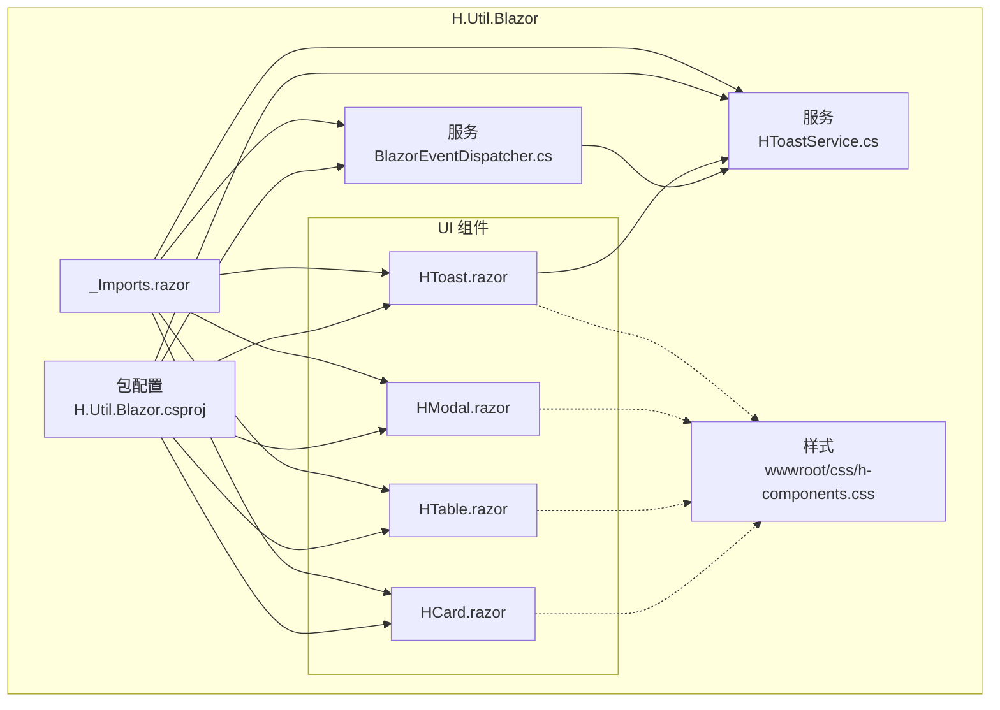
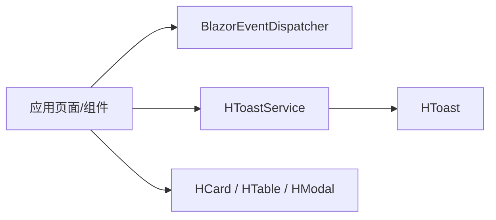
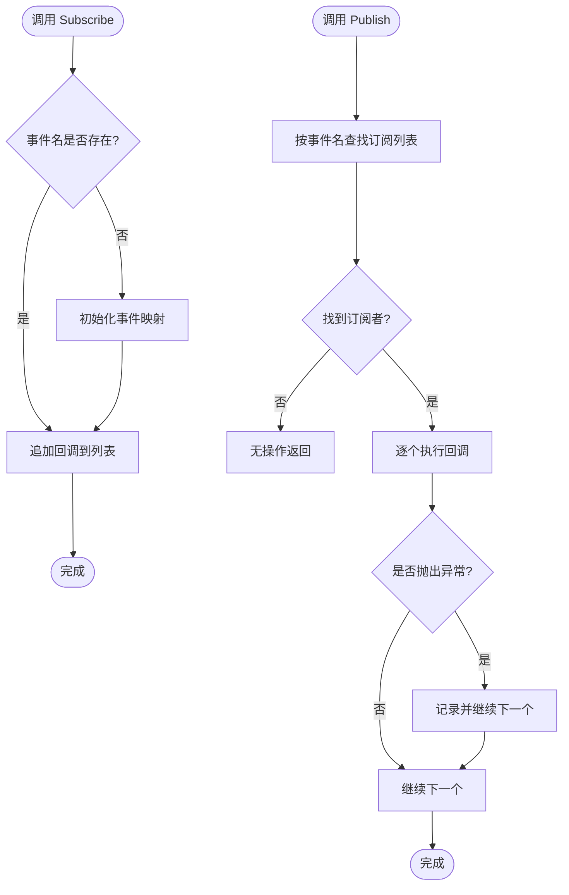
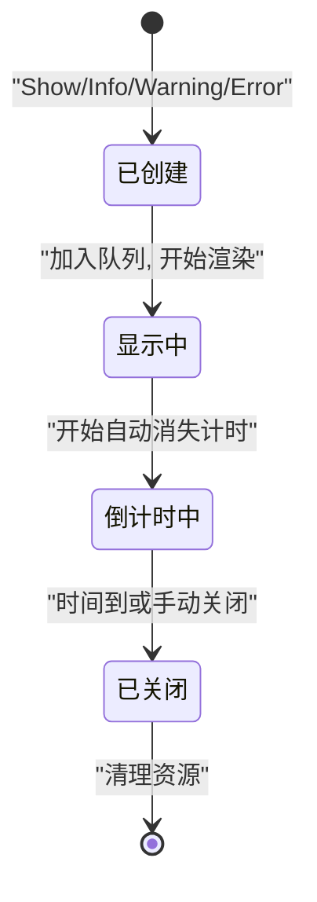
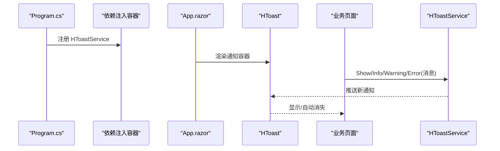

# H.Util.Blazor Blazor辅助库

<cite>
**本文引用的文件**
- [BlazorEventDispatcher.cs](file://src/Utils/H.Util.Blazor/BlazorEventDispatcher.cs)
- [HToastService.cs](file://src/Utils/H.Util.Blazor/HToastService.cs)
- [HCard.razor](file://src/Utils/H.Util.Blazor/Components/HCard.razor)
- [HTable.razor](file://src/Utils/H.Util.Blazor/Components/HTable.razor)
- [HModal.razor](file://src/Utils/H.Util.Blazor/Components/HModal.razor)
- [HToast.razor](file://src/Utils/H.Util.Blazor/Components/HToast.razor)
- [H.Util.Blazor.csproj](file://src/Utils/H.Util.Blazor/H.Util.Blazor.csproj)
- [h-components.css](file://src/Utils/H.Util.Blazor/wwwroot/css/h-components.css)
- [Program.cs](file://src/Host/H.AppLab.Web.Host/H.AppLab.Web.Host/Program.cs)
</cite>

## 目录
1. [简介](#简介)
2. [项目结构](#项目结构)
3. [核心组件](#核心组件)
4. [架构总览](#架构总览)
5. [详细组件分析](#详细组件分析)
6. [依赖与集成](#依赖与集成)
7. [性能与最佳实践](#性能与最佳实践)
8. [故障排查](#故障排查)
9. [结论](#结论)

## 简介
H.Util.Blazor 是一个面向 Blazor WebAssembly 的轻量级辅助库，提供跨组件事件分发、统一通知服务和一组常用 UI 组件。它适合在低代码平台、设计器与渲染引擎等前端应用中复用，帮助团队统一交互行为、简化页面状态管理并提升开发效率。

本库重点包含：
- 全局事件分发器：用于解耦发布方与订阅方，支持自定义事件名（如 designengine.dragitem.onclick）。
- Toast 通知服务：统一管理消息类型、消息模型、自动消失与生命周期。
- 通用 UI 组件：卡片、表格、模态框和通知容器，便于快速构建界面。

## 项目结构
H.Util.Blazor 采用“服务 + 组件”的简单分层组织方式：
- 服务层：BlazorEventDispatcher、HToastService，负责事件总线与通知能力。
- 组件层：HCard、HTable、HModal、HToast，封装常见 UI 模式。
- 资源层：wwwroot/css 下的样式文件，统一视觉风格。
- 入口与包配置：_Imports.razor 暴露公共命名空间，csproj 定义包输出与静态资源。

图表来源
- [BlazorEventDispatcher.cs](file://src/Utils/H.Util.Blazor/BlazorEventDispatcher.cs)
- [HToastService.cs](file://src/Utils/H.Util.Blazor/HToastService.cs)
- [HCard.razor](file://src/Utils/H.Util.Blazor/Components/HCard.razor)
- [HTable.razor](file://src/Utils/H.Util.Blazor/Components/HTable.razor)
- [HModal.razor](file://src/Utils/H.Util.Blazor/Components/HModal.razor)
- [HToast.razor](file://src/Utils/H.Util.Blazor/Components/HToast.razor)
- [H.Util.Blazor.csproj](file://src/Utils/H.Util.Blazor/H.Util.Blazor.csproj)
- [h-components.css](file://src/Utils/H.Util.Blazor/wwwroot/css/h-components.css)

章节来源
- [H.Util.Blazor.csproj](file://src/Utils/H.Util.Blazor/H.Util.Blazor.csproj)
- [h-components.css](file://src/Utils/H.Util.Blazor/wwwroot/css/h-components.css)

## 核心组件
- 事件分发器 BlazorEventDispatcher
  - 职责：维护事件订阅表，提供订阅、发布与移除能力；支持任意字符串事件名。
  - 关键方法：Subscribe、Publish、Remove。
  - 使用场景：跨组件通信、模块间解耦、低代码设计器事件协议扩展。
- Toast 通知服务 HToastService
  - 职责：集中创建、显示与销毁通知；管理消息类型与自动消失。
  - 数据模型：消息类型枚举、消息实体（含内容、类型、持续时间、唯一标识等）。
  - 生命周期：创建 -> 入队 -> 渲染 -> 倒计时 -> 关闭 -> 清理。
- UI 组件
  - HCard：可配置的卡片容器，支持标题、边框、阴影、内边距等样式属性。
  - HTable：基于集合绑定的表格组件，支持列定义、排序与分页的基础骨架。
  - HModal：可重复使用的模态框，支持打开/关闭、遮罩、确认取消回调。
  - HToast：通知展示容器，监听 HToastService 的事件队列并渲染。

章节来源
- [BlazorEventDispatcher.cs](file://src/Utils/H.Util.Blazor/BlazorEventDispatcher.cs)
- [HToastService.cs](file://src/Utils/H.Util.Blazor/HToastService.cs)
- [HCard.razor](file://src/Utils/H.Util.Blazor/Components/HCard.razor)
- [HTable.razor](file://src/Utils/H.Util.Blazor/Components/HTable.razor)
- [HModal.razor](file://src/Utils/H.Util.Blazor/Components/HModal.razor)
- [HToast.razor](file://src/Utils/H.Util.Blazor/Components/HToast.razor)

## 架构总览
H.Util.Blazor 通过服务与组件分离的方式，将业务无关的横切关注点抽离出来。事件分发器作为应用级总线，Toast 服务作为用户反馈中心，UI 组件则对外暴露一致的 API。

图表来源
- [BlazorEventDispatcher.cs](file://src/Utils/H.Util.Blazor/BlazorEventDispatcher.cs)
- [HToastService.cs](file://src/Utils/H.Util.Blazor/HToastService.cs)
- [HToast.razor](file://src/Utils/H.Util.Blazor/Components/HToast.razor)

## 详细组件分析

### BlazorEventDispatcher 事件分发器
工作原理：
- 内部维护一个以事件名为键的订阅者集合。
- Subscribe 注册回调到指定事件名。
- Publish 查找匹配事件名的订阅者并逐个触发。
- Remove 从对应事件名下注销回调。
- 线程安全与异常隔离：在并发发布时保证订阅表稳定，单个订阅者异常不影响其他订阅者。

典型用法：
- 订阅：在需要接收事件的组件中调用 Subscribe，传入事件名与回调。
- 发布：在动作发生时调用 Publish，传递事件名与可选参数。
- 移除：在组件释放或不再需要时调用 Remove，避免内存泄漏。

事件命名约定：
- 推荐使用“领域.子域.对象.动作”的分段式命名，例如 designengine.dragitem.onclick。
- 同一领域内的相关事件应保持一致前缀，便于搜索与维护。

图表来源
- [BlazorEventDispatcher.cs](file://src/Utils/H.Util.Blazor/BlazorEventDispatcher.cs)

章节来源
- [BlazorEventDispatcher.cs](file://src/Utils/H.Util.Blazor/BlazorEventDispatcher.cs)

### HToastService 通知服务
能力概览：
- 消息类型：通过枚举区分信息、成功、警告、错误等语义。
- 消息模型：每条消息包含文本、类型、持续时长、唯一 ID 等字段。
- 自动消失：为每条消息维护计时器，到期后自动关闭。
- 生命周期：创建 -> 入队 -> 渲染 -> 倒计时 -> 关闭 -> 清理。

生命周期流程：

图表来源
- [HToastService.cs](file://src/Utils/H.Util.Blazor/HToastService.cs)

章节来源
- [HToastService.cs](file://src/Utils/H.Util.Blazor/HToastService.cs)

### HCard 卡片组件
功能要点：
- 属性配置：标题、副标题、边框、圆角、阴影、背景色、内边距等。
- 插槽内容：承载任意子组件或 HTML 片段。
- 样式定制：通过类名、CSS 变量或外部样式覆盖默认主题。

建议：
- 对于复杂卡片，优先使用 HCard 作为容器，再组合 HTable、HModal 等组件。
- 保持间距一致，遵循 h-components.css 中的尺寸规范。

章节来源
- [HCard.razor](file://src/Utils/H.Util.Blazor/Components/HCard.razor)
- [h-components.css](file://src/Utils/H.Util.Blazor/wwwroot/css/h-components.css)

### HTable 表格组件
功能要点：
- 数据绑定：支持泛型集合数据源，逐行渲染。
- 列定义：支持文本、数值、日期、操作按钮等列类型。
- 交互能力：基础排序、分页、选择行的骨架接口。

建议：
- 大数据量场景建议结合服务端分页，避免一次性加载过多 DOM。
- 操作列按钮可与 BlazorEventDispatcher 联动，触发领域事件。

章节来源
- [HTable.razor](file://src/Utils/H.Util.Blazor/Components/HTable.razor)

### HModal 模态框组件
功能要点：
- 参数设置：标题、宽度、遮罩、拖拽、确认/取消回调。
- 状态控制：Open/Close 方法控制显隐，支持异步回调。
- 嵌套内容：可承载表单、表格或其他复杂布局。

建议：
- 对耗时操作，在确认回调中使用异步任务并在 UI 上给出等待提示。
- 通过 HToastService 反馈用户操作结果。

章节来源
- [HModal.razor](file://src/Utils/H.Util.Blazor/Components/HModal.razor)

### HToast 通知组件
集成方式：
- 在应用根组件或布局中放置 HToast 容器，使其常驻。
- 通过 HToastService 创建不同消息类型的通知。
- 支持点击关闭、自动消失、堆叠显示等交互。

章节来源
- [HToast.razor](file://src/Utils/H.Util.Blazor/Components/HToast.razor)
- [HToastService.cs](file://src/Utils/H.Util.Blazor/HToastService.cs)

## 依赖与集成

### 在 Blazor WebAssembly 项目中注册与配置
推荐步骤：
1. 引用 H.Util.Blazor 程序集。
2. 在 Program.cs 中注入 HToastService（若使用依赖注入）。
3. 在 App.razor 或布局组件中添加 HToast 容器。
4. 在需要的页面或服务中通过依赖注入获取 HToastService。
5. 若使用事件分发器，可直接实例化或通过 DI 注册单例。

图表来源
- [Program.cs](file://src/Host/H.AppLab.Web.Host/H.AppLab.Web.Host/Program.cs)
- [HToastService.cs](file://src/Utils/H.Util.Blazor/HToastService.cs)
- [HToast.razor](file://src/Utils/H.Util.Blazor/Components/HToast.razor)

章节来源
- [Program.cs](file://src/Host/H.AppLab.Web.Host/H.AppLab.Web.Host/Program.cs)
- [H.Util.Blazor.csproj](file://src/Utils/H.Util.Blazor/H.Util.Blazor.csproj)

### 依赖注入与服务生命周期
- HToastService：建议在 WebAssembly 中以单例或作用域注入，确保通知状态与应用生命周期一致。
- BlazorEventDispatcher：可作为单例注入，保证跨组件事件一致性。
- 组件本身不持有服务实例，通过 Razor 的 @inject 或构造函数注入使用。

章节来源
- [H.Util.Blazor.csproj](file://src/Utils/H.Util.Blazor/H.Util.Blazor.csproj)

## 性能与最佳实践
- 事件分发器
  - 合理拆分事件名，避免单一事件过载。
  - 及时 Remove 订阅，防止长驻组件造成内存泄漏。
  - 大量订阅场景下，考虑批量发布与节流。
- Toast 通知
  - 合并同类消息，避免刷屏。
  - 为高频操作设置最小间隔与去重策略。
  - 长时间任务使用进度型通知，避免误以为卡死。
- UI 组件
  - HTable 大列表务必分页或使用虚拟滚动方案。
  - 避免在组件 RenderTree 中频繁重建复杂对象。
  - 合理使用 CSS 变量与 scoped 样式，降低样式冲突成本。

## 故障排查
常见问题与解决思路：
- 通知未显示
  - 检查是否在应用根层级添加了 HToast 容器。
  - 确认 HToastService 已正确注入且未被提前释放。
- 事件未触发
  - 确认 Subscribe 先于 Publish 调用。
  - 检查事件名拼写与大小写是否一致。
  - 检查订阅是否被 Remove 过早移除。
- 样式不生效
  - 确认 wwwroot/css/h-components.css 已随程序集引入。
  - 检查浏览器缓存或打包阶段是否清除了旧资源。
- 模态框无法关闭
  - 检查遮罩点击与 ESC 按键事件是否正确绑定。
  - 确认回调未抛出异常导致状态不一致。

章节来源
- [HToastService.cs](file://src/Utils/H.Util.Blazor/HToastService.cs)
- [BlazorEventDispatcher.cs](file://src/Utils/H.Util.Blazor/BlazorEventDispatcher.cs)
- [HModal.razor](file://src/Utils/H.Util.Blazor/Components/HModal.razor)
- [h-components.css](file://src/Utils/H.Util.Blazor/wwwroot/css/h-components.css)

## 结论
H.Util.Blazor 以简洁的服务与组件划分，为 Blazor 应用提供了可靠的事件分发与通知能力，并沉淀了常用 UI 组件。通过统一的事件命名与通知模型，团队可以更容易地构建高内聚、低耦合的前端系统。建议在设计器与渲染引擎等复杂场景中优先采用该库提供的抽象，以降低集成与维护成本。