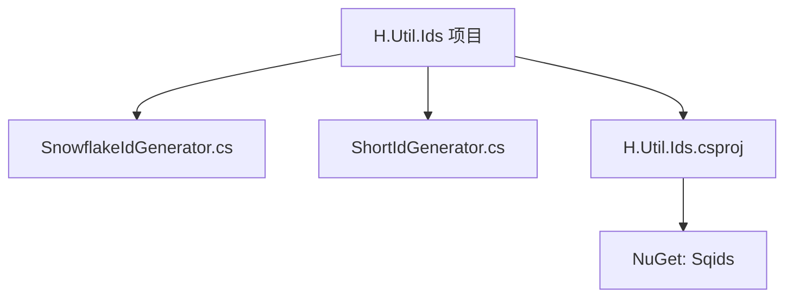
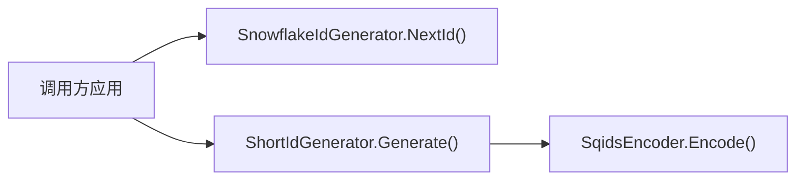
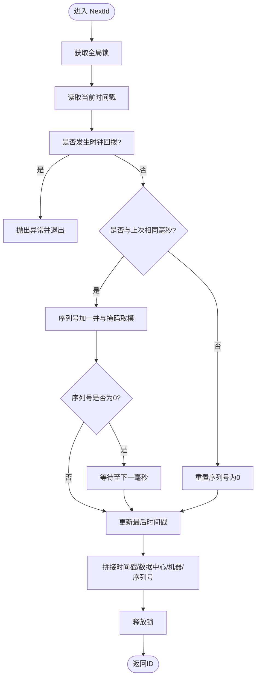
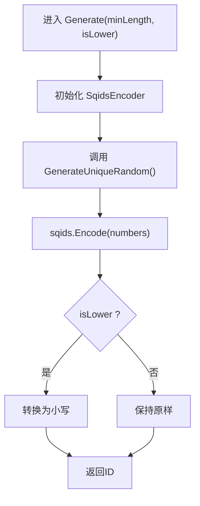
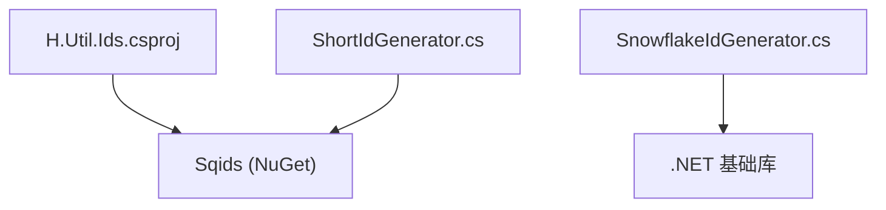

# H.Util.Ids ID生成器库

<cite>
**本文引用的文件**   
- [SnowflakeIdGenerator.cs](file://src/Utils/H.Util.Ids/SnowflakeIdGenerator.cs)
- [ShortIdGenerator.cs](file://src/Utils/H.Util.Ids/ShortIdGenerator.cs)
- [H.Util.Ids.csproj](file://src/Utils/H.Util.Ids/H.Util.Ids.csproj)
</cite>

## 目录
1. [简介](#简介)
2. [项目结构](#项目结构)
3. [核心组件](#核心组件)
4. [架构总览](#架构总览)
5. [详细组件分析](#详细组件分析)
6. [依赖关系分析](#依赖关系分析)
7. [性能与并发特性](#性能与并发特性)
8. [适用场景与选型建议](#适用场景与选型建议)
9. [使用示例与最佳实践](#使用示例与最佳实践)
10. [故障排除指南](#故障排除指南)
11. [结论](#结论)

## 简介
H.Util.Ids 是面向 .NET 的轻量级 ID 生成工具库，提供两类生成器：
- SnowflakeIdGenerator：基于雪花算法的分布式有序 ID 生成器，适用于需要全局唯一、趋势递增且具备时间序的分布式系统。
- ShortIdGenerator：基于 Sqids 的短ID生成器，将一组随机整数编码为较短的字符串，适合用于用户友好的 URL 参数、分享链接或对外 API 的不可猜测标识。

本库强调实现简洁、易于集成，并提供基本的时钟回拨保护与线程安全机制，便于在微服务与多进程环境中使用。

## 项目结构
该库是一个独立的 .NET SDK 风格项目，包含两个核心源文件与一个项目文件：
- SnowflakeIdGenerator.cs：雪花算法 ID 生成器实现
- ShortIdGenerator.cs：短ID生成器实现（依赖第三方 Sqids）
- H.Util.Ids.csproj：项目定义，引入 Sqids NuGet 包

图表来源
- [H.Util.Ids.csproj:1-8](file://src/Utils/H.Util.Ids/H.Util.Ids.csproj#L1-L8)

章节来源
- [H.Util.Ids.csproj:1-8](file://src/Utils/H.Util.Ids/H.Util.Ids.csproj#L1-L8)

## 核心组件
- 雪花ID生成器（SnowflakeIdGenerator）
  - 提供静态方法 NextId() 生成 64 位长整型 ID。
  - 通过时间戳、数据中心ID、机器ID和序列号组合保证全局唯一性。
  - 内置锁确保多线程并发安全。
  - 提供时钟回拨检测，拒绝生成可能重复的 ID。

- 短ID生成器（ShortIdGenerator）
  - 提供静态方法 Generate(minLength, isLower) 生成短字符串ID。
  - 内部使用 SqidsEncoder<int> 对一组随机整数进行编码。
  - 支持最小长度与大小写控制。

章节来源
- [SnowflakeIdGenerator.cs:1-90](file://src/Utils/H.Util.Ids/SnowflakeIdGenerator.cs#L1-L90)
- [ShortIdGenerator.cs:1-62](file://src/Utils/H.Util.Ids/ShortIdGenerator.cs#L1-L62)

## 架构总览
H.Util.Ids 由两个独立、无状态（除雪花生成器的静态状态）的组件组成，彼此不耦合。SnowflakeIdGenerator 负责生成长整型 ID，ShortIdGenerator 依赖外部 Sqids 包生成短字符串 ID。二者均通过静态接口暴露能力，便于在任何业务层直接调用。

图表来源
- [SnowflakeIdGenerator.cs:1-90](file://src/Utils/H.Util.Ids/SnowflakeIdGenerator.cs#L1-L90)
- [ShortIdGenerator.cs:1-62](file://src/Utils/H.Util.Ids/ShortIdGenerator.cs#L1-L62)

## 详细组件分析

### SnowflakeIdGenerator 雪花ID生成器
雪花算法将 64 位长整型划分为多个字段：时间戳、数据中心ID、机器ID和序列号。本实现的位分配如下：
- 时间戳：偏移起始时间 Twepoch（2024-01-01 00:00:00 UTC），左移 22 位
- 数据中心ID：5 位
- 机器ID：5 位
- 序列号：12 位

位布局示意（从高位到低位）：
- 时间戳（41 位）| 数据中心ID（5 位）| 机器ID（5 位）| 序列号（12 位）

关键常量与变量说明：
- Twepoch：基准时间，单位毫秒
- WorkerIdBits、DatacenterIdBits、SequenceBits：各字段位数
- MaxWorkerId、MaxDatacenterId：对应最大可配置值
- SequenceMask：序列号掩码
- WorkerIdShift、DatacenterIdShift、TimestampLeftShift：位移常量
- _workerId、_datacenterId、_sequence、_lastTimestamp：运行时状态
- _lock：线程同步锁

并发与安全机制：
- NextId() 使用 lock 保护临界区，避免多线程下 _sequence 与 _lastTimestamp 竞争。
- 当同一毫秒内序列号溢出时，TilNextMillis() 自旋等待到下一毫秒再重置序列号。
- 若检测到时钟回拨（timestamp < lastTimestamp），抛出异常以阻止生成重复ID。

时序流程概览：

图表来源
- [SnowflakeIdGenerator.cs:23-66](file://src/Utils/H.Util.Ids/SnowflakeIdGenerator.cs#L23-L66)

复杂度与性能：
- 单次生成操作的时间复杂度 O(1)，空间复杂度 O(1)。
- 锁粒度覆盖整个生成过程，简单可靠；在高并发场景下会形成串行瓶颈。
- 单毫秒最多可生成 2^12 = 4096 个不同序列号，超出后需等待下一毫秒。

扩展点与注意事项：
- 当前 WorkerId 与 DatacenterId 为固定静态值，生产环境应通过配置注入并校验范围。
- 可考虑引入更细粒度的分段锁或每实例隔离策略提升吞吐。
- 时钟回拨处理采用抛异常策略，上层可根据业务需求重试或降级。

章节来源
- [SnowflakeIdGenerator.cs:1-90](file://src/Utils/H.Util.Ids/SnowflakeIdGenerator.cs#L1-L90)

### ShortIdGenerator 短ID生成器
ShortIdGenerator 使用 Sqids 将一组随机整数编码为短字符串。主要逻辑：
- 使用 SqidsEncoder<int> 指定最小长度 Alphabet（自定义字符集）。
- 通过内部 GenerateUniqueRandom() 生成 n 个不重复的随机整数。
- 根据 isLower 参数决定是否转换为小写。

随机数生成算法：
- GenerateUniqueRandom(minValue, maxValue, n) 使用“索引数组 + 随机交换”的方式抽取 n 个不重复数字，避免重复。
- 当请求数量超过可用范围时，自动限制为范围大小。
- 每次调用都会创建新的 Random 实例，这在高频并发场景可能带来性能问题。

字符集与大小写：
- 默认 Alphabet 为一组字母与数字的组合，可通过修改常量调整。
- isLower 控制最终结果是否全部转为小写。

流程图示：

图表来源
- [ShortIdGenerator.cs:1-62](file://src/Utils/H.Util.Ids/ShortIdGenerator.cs#L1-L62)

复杂度与性能：
- 随机数生成部分平均 O(n)，n 通常为较小常数（如 3）。
- Sqids 编码过程近似 O(n)。
- 整体单次生成开销较低，但频繁创建 Random 对象可能影响高并发性能。

优化建议：
- 使用线程安全的随机源（例如 Random.Shared 或加密随机源）替代每次 new Random()。
- 缓存 SqidsEncoder 实例以减少对象分配。
- 若追求更高熵与不可预测性，可在随机数生成阶段结合更好的熵源。

章节来源
- [ShortIdGenerator.cs:1-62](file://src/Utils/H.Util.Ids/ShortIdGenerator.cs#L1-L62)

## 依赖关系分析
- H.Util.Ids.csproj 引用了第三方 NuGet 包 Sqids，供 ShortIdGenerator 使用。
- SnowflakeIdGenerator 不依赖第三方库，仅使用 .NET 基础类型与时钟 API。

图表来源
- [H.Util.Ids.csproj:1-8](file://src/Utils/H.Util.Ids/H.Util.Ids.csproj#L1-L8)
- [ShortIdGenerator.cs:1-10](file://src/Utils/H.Util.Ids/ShortIdGenerator.cs#L1-L10)

章节来源
- [H.Util.Ids.csproj:1-8](file://src/Utils/H.Util.Ids/H.Util.Ids.csproj#L1-L8)

## 性能与并发特性
- SnowflakeIdGenerator
  - 并发安全：通过全局锁保证线程安全，避免重复ID。
  - 吞吐限制：单毫秒上限为 4096 条记录；超限时需等待下一毫秒。
  - 时钟回拨：检测到回拨即抛异常，避免生成冲突ID。
  - 可扩展性：可考虑分片或每实例隔离以提升吞吐。

- ShortIdGenerator
  - 并发安全：未显式加锁，依赖 Random 的线程安全性；当前实现每次 new Random() 存在风险。
  - 随机性：使用固定长度的随机数组进行编码，短ID本身不具备时间序。
  - 性能：对象分配较多（Random、SqidsEncoder），在高并发下可优化。

章节来源
- [SnowflakeIdGenerator.cs:23-66](file://src/Utils/H.Util.Ids/SnowflakeIdGenerator.cs#L23-L66)
- [ShortIdGenerator.cs:1-62](file://src/Utils/H.Util.Ids/ShortIdGenerator.cs#L1-L62)

## 适用场景与选型建议
- SnowflakeIdGenerator
  - 分布式系统主键、事件ID、流水号等需要全局唯一且趋势递增的场景。
  - 数据库分库分表键、消息队列消息ID、日志追踪ID等。
  - 优点：有序、可解析时间信息、无需中心协调。
  - 注意：需合理配置 WorkerId/DatacenterId，监控时钟同步。

- ShortIdGenerator
  - 对外API的短链接、分享码、邀请码等用户友好型标识。
  - URL 参数中不希望暴露自增主键的业务ID。
  - 优点：短小、可读性较好、不可直接推测。
  - 注意：不具备时间序；如需防猜可结合更多随机性或额外混淆。

选型建议：
- 内部系统优先选择 SnowflakeIdGenerator，便于排序、分页与聚合。
- 对外暴露给用户的短ID优先选择 ShortIdGenerator，兼顾可读性与不可猜测性。

## 使用示例与最佳实践
以下为典型用法步骤（不包含具体代码内容）：

- 初始化与基本使用
  - 在任意业务模块直接调用 SnowflakeIdGenerator.NextId() 获取长整型ID。
  - 调用 ShortIdGenerator.Generate(minLength, isLower) 获取短字符串ID。

- 配置与部署
  - 在生产环境中为每个实例设置唯一的 WorkerId 与 DatacenterId（当前实现为静态值，建议改为可配置注入）。
  - 确保服务器时钟通过 NTP 同步，避免时钟回拨导致异常。

- 性能测试
  - 使用多线程并发调用 SnowflakeIdGenerator.NextId()，统计每秒生成量与是否有重复ID。
  - 针对 ShortIdGenerator.Generate() 进行高并发压力测试，观察 CPU 与内存占用变化。

- 并发安全性验证
  - 验证 SnowflakeIdGenerator 在多进程/多线程下的唯一性与顺序性。
  - 对 ShortIdGenerator 验证随机数生成的稳定性与可重复性（必要时固定种子进行测试）。

章节来源
- [SnowflakeIdGenerator.cs:1-90](file://src/Utils/H.Util.Ids/SnowflakeIdGenerator.cs#L1-L90)
- [ShortIdGenerator.cs:1-62](file://src/Utils/H.Util.Ids/ShortIdGenerator.cs#L1-L62)

## 故障排除指南
- 时钟同步问题
  - 现象：SnowflakeIdGenerator 抛出“时钟回拨”相关异常。
  - 原因：系统时间被手动调整或虚拟机时间漂移。
  - 解决：启用 NTP 同步，监控时间跳变；必要时增加容错策略（如告警、限流）。

- ID冲突检测
  - 现象：出现重复ID。
  - 排查：确认 WorkerId/DatacenterId 是否唯一；检查是否有多实例共享同一配置；验证数据库去重约束。
  - 建议：为业务表添加唯一索引，并在写入前进行去重检查。

- 短ID可读性与大小写
  - 现象：URL 中出现大写字符不符合预期。
  - 解决：调用 Generate(isLower: true) 强制输出小写。

- 性能瓶颈
  - SnowflakeIdGenerator：单锁串行化导致吞吐受限。
    - 优化：按实例或分区加锁，或使用原子计数器+分段锁。
  - ShortIdGenerator：频繁创建 Random 对象导致 GC 压力。
    - 优化：使用线程安全的随机源，缓存编码器实例。

章节来源
- [SnowflakeIdGenerator.cs:33-55](file://src/Utils/H.Util.Ids/SnowflakeIdGenerator.cs#L33-L55)
- [ShortIdGenerator.cs:28-60](file://src/Utils/H.Util.Ids/ShortIdGenerator.cs#L28-L60)

## 结论
H.Util.Ids 提供了两类互补的 ID 生成方案：
- SnowflakeIdGenerator 适合分布式系统中的全局唯一、有序ID，具备基础的时钟回拨保护与线程安全。
- ShortIdGenerator 适合对外暴露的短字符串ID，借助 Sqids 实现短小、可读且不易猜测的标识。

在实际微服务架构中，建议内部主键使用雪花ID，对外展示使用短ID，并结合合理的配置管理、时钟同步与性能优化策略，以获得稳定高效的ID生成能力。