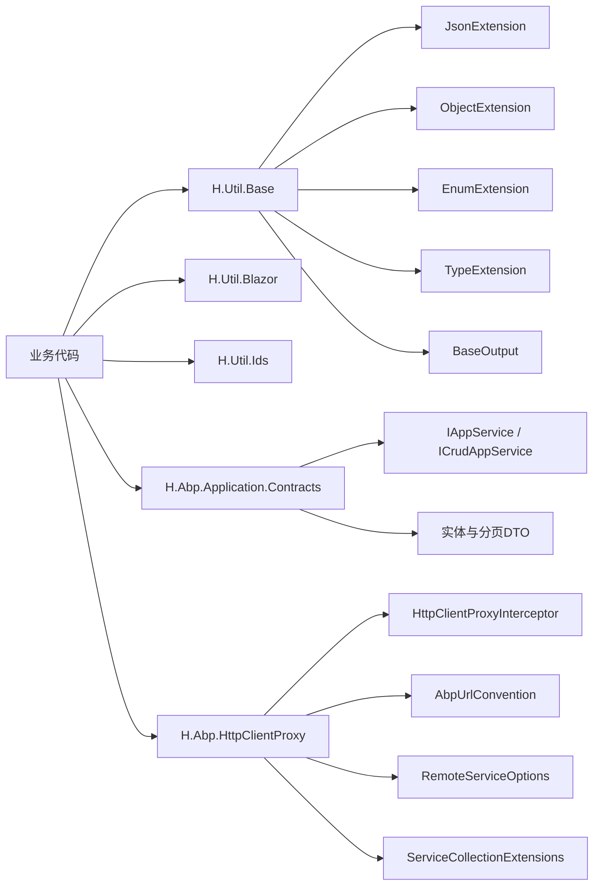
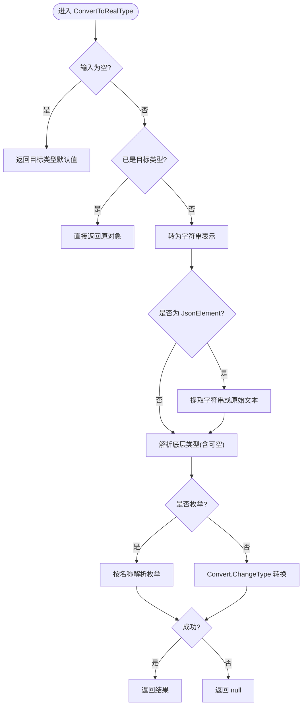
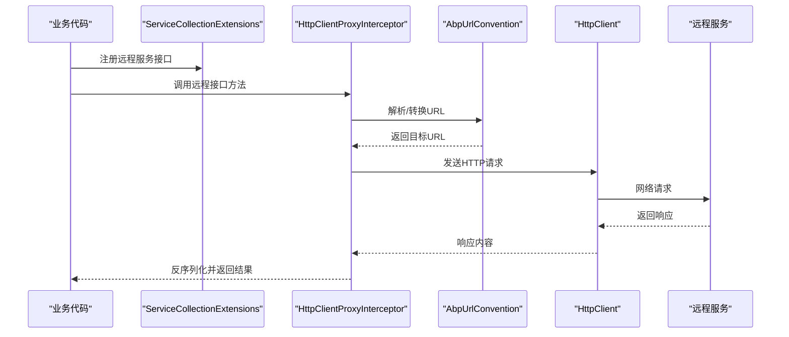
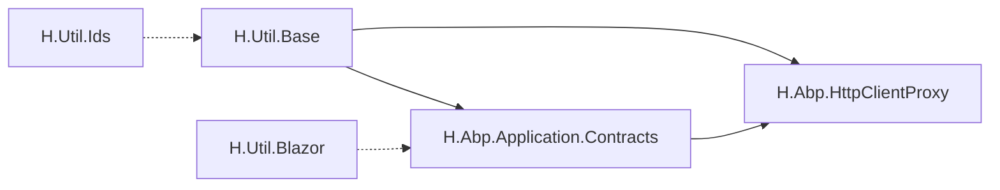

# 通用工具库

<cite>
**本文引用的文件**   
- [ObjectExtension.cs](file://src/Utils/H.Util.Base/ObjectExtension.cs)
- [JsonExtension.cs](file://src/Utils/H.Util.Base/JsonExtension.cs)
- [EnumExtension.cs](file://src/Utils/H.Util.Base/EnumExtension.cs)
- [TypeExtension.cs](file://src/Utils/H.Util.Base/TypeExtension.cs)
- [BaseOutput.cs](file://src/Utils/H.Util.Base/BaseOutput.cs)
- [BlazorEventDispatcher.cs](file://src/Utils/H.Util.Blazor/BlazorEventDispatcher.cs)
- [HToastService.cs](file://src/Utils/H.Util.Blazor/HToastService.cs)
- [ShortIdGenerator.cs](file://src/Utils/H.Util.Ids/ShortIdGenerator.cs)
- [SnowflakeIdGenerator.cs](file://src/Utils/H.Util.Ids/SnowflakeIdGenerator.cs)
- [EntityDto.cs](file://src/Utils/H.Abp.Application.Contracts/EntityDto.cs)
- [AuditedEntityDto.cs](file://src/Utils/H.Abp.Application.Contracts/AuditedEntityDto.cs)
- [CreationAuditedEntityDto.cs](file://src/Utils/H.Abp.Application.Contracts/CreationAuditedEntityDto.cs)
- [FullAuditedEntityDto.cs](file://src/Utils/H.Abp.Application.Contracts/FullAuditedEntityDto.cs)
- [PagedResultRequestDto.cs](file://src/Utils/H.Abp.Application.Contracts/PagedResultRequestDto.cs)
- [PagedAndSortedResultRequestDto.cs](file://src/Utils/H.Abp.Application.Contracts/PagedAndSortedResultRequestDto.cs)
- [PagedResultDto.cs](file://src/Utils/H.Abp.Application.Contracts/PagedResultDto.cs)
- [IAppService.cs](file://src/Utils/H.Abp.Application.Contracts/IAppService.cs)
- [ICrudAppService.cs](file://src/Utils/H.Abp.Application.Contracts/ICrudAppService.cs)
- [AbpUrlConvention.cs](file://src/Utils/H.Abp.HttpClientProxy/AbpUrlConvention.cs)
- [HttpClientProxyInterceptor.cs](file://src/Utils/H.Abp.HttpClientProxy/HttpClientProxyInterceptor.cs)
- [RemoteServiceOptions.cs](file://src/Utils/H.Abp.HttpClientProxy/RemoteServiceOptions.cs)
- [ServiceCollectionExtensions.cs](file://src/Utils/H.Abp.HttpClientProxy/ServiceCollectionExtensions.cs)
</cite>

## 目录
1. [简介](#简介)
2. [项目结构](#项目结构)
3. [核心组件总览](#核心组件总览)
4. [架构总览](#架构总览)
5. [详细组件分析](#详细组件分析)
6. [依赖关系分析](#依赖关系分析)
7. [性能与使用建议](#性能与使用建议)
8. [故障排查](#故障排查)
9. [结论](#结论)

## 简介
本文件为 H.AppLab 通用工具库的完整使用文档，围绕以下五个子库展开：
- H.Util.Base：基础工具类，提供对象深拷贝、JSON序列化辅助、枚举扩展、类型转换等能力。
- H.Util.Blazor：Blazor UI增强库，包含事件分发器、Toast通知服务及自定义组件集合。
- H.Util.Ids：ID生成器库，实现雪花算法与短ID生成器。
- H.Abp.Application.Contracts：ABP应用契约封装，提供标准化实体DTO、分页请求与响应、CRUD接口基类等。
- H.Abp.HttpClientProxy：动态HTTP客户端代理库，支持拦截器、URL约定转换器与远程服务配置。

该文档既适合快速上手的新手，也适合需要深入理解内部机制的高级开发者。

## 项目结构
H.AppLab 通用工具库位于 src/Utils 下，按职责拆分为多个独立项目：
- H.Util.Base：基础扩展方法、类型转换与输出模型。
- H.Util.Blazor：Blazor运行时UI能力。
- H.Util.Ids：分布式与短ID生成。
- H.Abp.Application.Contracts：面向ABP应用的契约定义。
- H.Abp.HttpClientProxy：基于HttpClient的动态代理。

```mermaid
graph TB
    Utils["通用工具库根"] --> Base["H.Util.Base"]
    Utils --> Blazor["H.Util.Blazor"]
    Utils --> Ids["H.Util.Ids"]
    Utils --> AbpContracts["H.Abp.Application.Contracts"]
    Utils --> HttpClientProxy["H.Abp.HttpClientProxy"]

    Base --> ObjExt["对象扩展<br/>ObjectExtension"]
    Base --> JsonExt["JSON扩展<br/>JsonExtension"]
    Base --> EnumExt["枚举扩展<br/>EnumExtension"]
    Base --> TypeExt["类型扩展<br/>TypeExtension"]
    Base --> Output["基础输出模型<br/>BaseOutput"]

    Blazor --> EventDisp["事件分发器<br/>BlazorEventDispatcher"]
    Blazor --> Toast["通知服务<br/>HToastService"]

    Ids --> Snow["雪花ID生成器<br/>SnowflakeIdGenerator"]
    Ids --> Short["短ID生成器<br/>ShortIdGenerator"]

    AbpContracts --> Dtos["实体与分页DTO"]
    AbpContracts --> IApp["应用接口<br/>IAppService / ICrudAppService"]

    HttpClientProxy --> Interceptor["动态拦截器<br/>HttpClientProxyInterceptor"]
    HttpClientProxy --> UrlConv["URL约定转换器<br/>AbpUrlConvention"]
    HttpClientProxy --> Options["远程服务选项<br/>RemoteServiceOptions"]
    HttpClientProxy --> Reg["注册扩展<br/>ServiceCollectionExtensions"]
```

**图表来源**
- [ObjectExtension.cs:1-105](file://src/Utils/H.Util.Base/ObjectExtension.cs#L1-L105)
- [JsonExtension.cs:1-45](file://src/Utils/H.Util.Base/JsonExtension.cs#L1-L45)
- [EnumExtension.cs:1-44](file://src/Utils/H.Util.Base/EnumExtension.cs#L1-L44)
- [TypeExtension.cs:1-78](file://src/Utils/H.Util.Base/TypeExtension.cs#L1-L78)
- [BaseOutput.cs:1-52](file://src/Utils/H.Util.Base/BaseOutput.cs#L1-L52)
- [BlazorEventDispatcher.cs](file://src/Utils/H.Util.Blazor/BlazorEventDispatcher.cs)
- [HToastService.cs](file://src/Utils/H.Util.Blazor/HToastService.cs)
- [ShortIdGenerator.cs](file://src/Utils/H.Util.Ids/ShortIdGenerator.cs)
- [SnowflakeIdGenerator.cs](file://src/Utils/H.Util.Ids/SnowflakeIdGenerator.cs)
- [EntityDto.cs](file://src/Utils/H.Abp.Application.Contracts/EntityDto.cs)
- [AuditedEntityDto.cs](file://src/Utils/H.Abp.Application.Contracts/AuditedEntityDto.cs)
- [CreationAuditedEntityDto.cs](file://src/Utils/H.Abp.Application.Contracts/CreationAuditedEntityDto.cs)
- [FullAuditedEntityDto.cs](file://src/Utils/H.Abp.Application.Contracts/FullAuditedEntityDto.cs)
- [PagedResultRequestDto.cs](file://src/Utils/H.Abp.Application.Contracts/PagedResultRequestDto.cs)
- [PagedAndSortedResultRequestDto.cs](file://src/Utils/H.Abp.Application.Contracts/PagedAndSortedResultRequestDto.cs)
- [PagedResultDto.cs](file://src/Utils/H.Abp.Application.Contracts/PagedResultDto.cs)
- [IAppService.cs](file://src/Utils/H.Abp.Application.Contracts/IAppService.cs)
- [ICrudAppService.cs](file://src/Utils/H.Abp.Application.Contracts/ICrudAppService.cs)
- [AbpUrlConvention.cs](file://src/Utils/H.Abp.HttpClientProxy/AbpUrlConvention.cs)
- [HttpClientProxyInterceptor.cs](file://src/Utils/H.Abp.HttpClientProxy/HttpClientProxyInterceptor.cs)
- [RemoteServiceOptions.cs](file://src/Utils/H.Abp.HttpClientProxy/RemoteServiceOptions.cs)
- [ServiceCollectionExtensions.cs](file://src/Utils/H.Abp.HttpClientProxy/ServiceCollectionExtensions.cs)

**章节来源**
- [ObjectExtension.cs:1-105](file://src/Utils/H.Util.Base/ObjectExtension.cs#L1-L105)
- [JsonExtension.cs:1-45](file://src/Utils/H.Util.Base/JsonExtension.cs#L1-L45)
- [EnumExtension.cs:1-44](file://src/Utils/H.Util.Base/EnumExtension.cs#L1-L44)
- [TypeExtension.cs:1-78](file://src/Utils/H.Util.Base/TypeExtension.cs#L1-L78)
- [BaseOutput.cs:1-52](file://src/Utils/H.Util.Base/BaseOutput.cs#L1-L52)

## 核心组件总览
- H.Util.Base
  - ObjectExtension：对象深拷贝、JSON元素到真实类型的转换。
  - JsonExtension：统一JSON序列化和反序列化，默认Web友好选项。
  - EnumExtension：枚举名称获取、从int/string安全转换为枚举。
  - TypeExtension：类型默认值生成、按字符串解析类型（支持程序集限定）。
  - BaseOutput：统一API返回包装。
- H.Util.Blazor
  - BlazorEventDispatcher：跨组件事件分发中心。
  - HToastService：Toast通知服务。
  - Components：若干自定义Blazor组件（由项目结构可见）。
- H.Util.Ids
  - SnowflakeIdGenerator：雪花算法ID生成器。
  - ShortIdGenerator：短ID生成器。
- H.Abp.Application.Contracts
  - 实体DTO：EntityDto、AuditedEntityDto、CreationAuditedEntityDto、FullAuditedEntityDto。
  - 分页DTO：PagedResultRequestDto、PagedAndSortedResultRequestDto、PagedResultDto。
  - 应用接口：IAppService、ICrudAppService。
- H.Abp.HttpClientProxy
  - HttpClientProxyInterceptor：动态代理拦截器。
  - AbpUrlConvention：URL约定转换器。
  - RemoteServiceOptions：远程服务配置。
  - ServiceCollectionExtensions：服务注册扩展。

**章节来源**
- [ObjectExtension.cs:1-105](file://src/Utils/H.Util.Base/ObjectExtension.cs#L1-L105)
- [JsonExtension.cs:1-45](file://src/Utils/H.Util.Base/JsonExtension.cs#L1-L45)
- [EnumExtension.cs:1-44](file://src/Utils/H.Util.Base/EnumExtension.cs#L1-L44)
- [TypeExtension.cs:1-78](file://src/Utils/H.Util.Base/TypeExtension.cs#L1-L78)
- [BaseOutput.cs:1-52](file://src/Utils/H.Util.Base/BaseOutput.cs#L1-L52)
- [BlazorEventDispatcher.cs](file://src/Utils/H.Util.Blazor/BlazorEventDispatcher.cs)
- [HToastService.cs](file://src/Utils/H.Util.Blazor/HToastService.cs)
- [ShortIdGenerator.cs](file://src/Utils/H.Util.Ids/ShortIdGenerator.cs)
- [SnowflakeIdGenerator.cs](file://src/Utils/H.Util.Ids/SnowflakeIdGenerator.cs)
- [EntityDto.cs](file://src/Utils/H.Abp.Application.Contracts/EntityDto.cs)
- [AuditedEntityDto.cs](file://src/Utils/H.Abp.Application.Contracts/AuditedEntityDto.cs)
- [CreationAuditedEntityDto.cs](file://src/Utils/H.Abp.Application.Contracts/CreationAuditedEntityDto.cs)
- [FullAuditedEntityDto.cs](file://src/Utils/H.Abp.Application.Contracts/FullAuditedEntityDto.cs)
- [PagedResultRequestDto.cs](file://src/Utils/H.Abp.Application.Contracts/PagedResultRequestDto.cs)
- [PagedAndSortedResultRequestDto.cs](file://src/Utils/H.Abp.Application.Contracts/PagedAndSortedResultRequestDto.cs)
- [PagedResultDto.cs](file://src/Utils/H.Abp.Application.Contracts/PagedResultDto.cs)
- [IAppService.cs](file://src/Utils/H.Abp.Application.Contracts/IAppService.cs)
- [ICrudAppService.cs](file://src/Utils/H.Abp.Application.Contracts/ICrudAppService.cs)
- [AbpUrlConvention.cs](file://src/Utils/H.Abp.HttpClientProxy/AbpUrlConvention.cs)
- [HttpClientProxyInterceptor.cs](file://src/Utils/H.Abp.HttpClientProxy/HttpClientProxyInterceptor.cs)
- [RemoteServiceOptions.cs](file://src/Utils/H.Abp.HttpClientProxy/RemoteServiceOptions.cs)
- [ServiceCollectionExtensions.cs](file://src/src/Utils/H.Abp.HttpClientProxy/ServiceCollectionExtensions.cs)

## 架构总览
下图展示了工具库之间的调用关系和职责边界：

**图表来源**
- [JsonExtension.cs:1-45](file://src/Utils/H.Util.Base/JsonExtension.cs#L1-L45)
- [ObjectExtension.cs:1-105](file://src/Utils/H.Util.Base/ObjectExtension.cs#L1-L105)
- [EnumExtension.cs:1-44](file://src/Utils/H.Util.Base/EnumExtension.cs#L1-L44)
- [TypeExtension.cs:1-78](file://src/Utils/H.Util.Base/TypeExtension.cs#L1-L78)
- [BaseOutput.cs:1-52](file://src/Utils/H.Util.Base/BaseOutput.cs#L1-L52)
- [HttpClientProxyInterceptor.cs](file://src/Utils/H.Abp.HttpClientProxy/HttpClientProxyInterceptor.cs)
- [AbpUrlConvention.cs](file://src/Utils/H.Abp.HttpClientProxy/AbpUrlConvention.cs)
- [RemoteServiceOptions.cs](file://src/Utils/H.Abp.HttpClientProxy/RemoteServiceOptions.cs)
- [ServiceCollectionExtensions.cs](file://src/Utils/H.Abp.HttpClientProxy/ServiceCollectionExtensions.cs)
- [IAppService.cs](file://src/Utils/H.Abp.Application.Contracts/IAppService.cs)
- [ICrudAppService.cs](file://src/Utils/H.Abp.Application.Contracts/ICrudAppService.cs)

## 详细组件分析

### H.Util.Base 基础工具类

#### 对象扩展与类型转换
- ObjectExtension
  - DeepClone：通过“对象→JSON→对象”的方式完成深拷贝。
  - ConvertToRealType(object, Type)：将任意对象按目标类型进行转换，支持JsonElement、枚举、可空类型；失败时返回null。
  - ConvertToRealType(JsonElement)：将JsonElement递归转为原生.NET对象（string/int/double/bool/null/dictionary/list）。
- TypeExtension
  - GetDefaultValue(Type)：为数组、List<T>、Dictionary<TKey,TValue>、IList、值类型分别返回合理的默认实例或空数组。
  - ResolveType(string)：按“全名[,程序集名]”解析类型，先精确匹配，再遍历当前域所有程序集。

**图表来源**
- [ObjectExtension.cs:1-105](file://src/Utils/H.Util.Base/ObjectExtension.cs#L1-L105)
- [TypeExtension.cs:1-78](file://src/Utils/H.Util.Base/TypeExtension.cs#L1-L78)

**章节来源**
- [ObjectExtension.cs:1-105](file://src/Utils/H.Util.Base/ObjectExtension.cs#L1-L105)
- [TypeExtension.cs:1-78](file://src/Utils/H.Util.Base/TypeExtension.cs#L1-L78)

#### JSON序列化辅助
- JsonExtension
  - 提供 ToJson(obj) 与 FromJson<T>(json)。
  - 默认使用 Web 友好选项：忽略默认值、宽松JavaScript编码。
  - FromJson 对异常进行包装并附带消息、路径、原始JSON以便调试。

最佳实践：
- 统一使用 ToJson/FromJson 替代分散的 JsonSerializer 调用，保证一致行为。
- 若需特殊序列化策略，传入自定义 JsonSerializerOptions。

**章节来源**
- [JsonExtension.cs:1-45](file://src/Utils/H.Util.Base/JsonExtension.cs#L1-L45)

#### 枚举扩展
- EnumExtension
  - GetEnumName(value/int/string)：缓存枚举名称，避免重复反射。
  - ToEnum(int/int?/string)：安全地将int或字符串转为枚举，支持默认值回退。

使用场景：
- 前端传整数状态码，后端安全转换为枚举。
- 日志记录枚举显示名称，提升可读性。

**章节来源**
- [EnumExtension.cs:1-44](file://src/Utils/H.Util.Base/EnumExtension.cs#L1-L44)

#### 类型扩展
- TypeExtension
  - GetDefaultValue(Type)：为常见泛型集合与值类型返回合理默认值。
  - ResolveType(string)：支持“FullName,AssemblyName”形式解析类型，便于配置化类型加载。

**章节来源**
- [TypeExtension.cs:1-78](file://src/Utils/H.Util.Base/TypeExtension.cs#L1-L78)

#### 统一输出模型
- BaseOutput / BaseOutput<T>
  - 提供 Success、Code、Message 字段，以及带 Data 的泛型版本。
  - 构造函数支持无参、消息、code+message、data等常用构造方式。

使用示例（思路）：
- 在应用层返回 BaseOutput<T>，前端根据 Success/Code 判断结果。
- 错误分支使用 new BaseOutput(code, message) 快速构造失败响应。

**章节来源**
- [BaseOutput.cs:1-52](file://src/Utils/H.Util.Base/BaseOutput.cs#L1-L52)

### H.Util.Blazor Blazor辅助组件库

- BlazorEventDispatcher：集中式事件分发器，用于跨组件通信与解耦。典型用法是在组件中订阅事件，在服务或另一个组件中触发事件。
- HToastService：Toast通知服务，提供统一的提示、警告、成功、错误通知能力，简化UI反馈逻辑。
- Components：自定义Blazor组件集合，配合上述服务提供开箱即用的交互体验。

建议：
- 在根组件或服务启动时注册事件分发器与Toast服务。
- 页面级组件优先消费事件与Toast，不直接耦合业务细节。

**章节来源**
- [BlazorEventDispatcher.cs](file://src/Utils/H.Util.Blazor/BlazorEventDispatcher.cs)
- [HToastService.cs](file://src/Utils/H.Util.Blazor/HToastService.cs)

### H.Util.Ids ID生成器库

- SnowflakeIdGenerator：雪花算法实现，适用于分布式环境下唯一ID生成，具备时间戳、机器标识与序列号组合特性。
- ShortIdGenerator：短ID生成器，适用于需要更短且易读标识符的场景（如分享链接、短码）。

使用建议：
- 分布式主键首选雪花ID，保证全局唯一与时序递增。
- 对外展示或短链场景使用短ID生成器，注意冲突概率与长度权衡。

**章节来源**
- [SnowflakeIdGenerator.cs](file://src/Utils/H.Util.Ids/SnowflakeIdGenerator.cs)
- [ShortIdGenerator.cs](file://src/Utils/H.Util.Ids/ShortIdGenerator.cs)

### H.Abp.Application.Contracts ABP应用契约封装

- 实体DTO族
  - EntityDto：最小化实体标识DTO。
  - AuditedEntityDto：增加审计信息（如创建时间等）。
  - CreationAuditedEntityDto：强调创建审计信息。
  - FullAuditedEntityDto：包含完整审计信息（创建、修改、删除等）。
- 分页DTO族
  - PagedResultRequestDto：分页请求基类。
  - PagedAndSortedResultRequestDto：支持排序的分页请求。
  - PagedResultDto：分页结果封装，包含数据与总数等。
- 应用接口
  - IAppService：通用应用服务接口基类。
  - ICrudAppService：标准CRUD操作抽象，包括Get、Create、Update、Delete、List等。

推荐模式：
- 所有领域实体DTO继承AuditedEntityDto或FullAuditedEntityDto，统一审计字段。
- 查询接口统一使用 PagedAndSortedResultRequestDto 作为入参，返回 PagedResultDto。
- 应用服务实现 ICrudAppService<TDto, TKey>，减少样板代码。

**章节来源**
- [EntityDto.cs](file://src/Utils/H.Abp.Application.Contracts/EntityDto.cs)
- [AuditedEntityDto.cs](file://src/Utils/H.Abp.Application.Contracts/AuditedEntityDto.cs)
- [CreationAuditedEntityDto.cs](file://src/Utils/H.Abp.Application.Contracts/CreationAuditedEntityDto.cs)
- [FullAuditedEntityDto.cs](file://src/Utils/H.Abp.Application.Contracts/FullAuditedEntityDto.cs)
- [PagedResultRequestDto.cs](file://src/Utils/H.Abp.Application.Contracts/PagedResultRequestDto.cs)
- [PagedAndSortedResultRequestDto.cs](file://src/Utils/H.Abp.Application.Contracts/PagedAndSortedResultRequestDto.cs)
- [PagedResultDto.cs](file://src/Utils/H.Abp.Application.Contracts/PagedResultDto.cs)
- [IAppService.cs](file://src/Utils/H.Abp.Application.Contracts/IAppService.cs)
- [ICrudAppService.cs](file://src/Utils/H.Abp.Application.Contracts/ICrudAppService.cs)

### H.Abp.HttpClientProxy HTTP客户端代理库

- HttpClientProxyInterceptor：动态代理拦截器，负责在调用远程服务前/后进行统一处理（如鉴权、重试、日志、异常转换）。
- AbpUrlConvention：URL约定转换器，根据接口规范自动生成或修正远端URL。
- RemoteServiceOptions：远程服务配置项，包括基础地址、超时、重试策略等。
- ServiceCollectionExtensions：扩展方法，便捷注册动态代理与服务。

典型调用流程（概念图）：

**图表来源**
- [HttpClientProxyInterceptor.cs](file://src/Utils/H.Abp.HttpClientProxy/HttpClientProxyInterceptor.cs)
- [AbpUrlConvention.cs](file://src/Utils/H.Abp.HttpClientProxy/AbpUrlConvention.cs)
- [ServiceCollectionExtensions.cs](file://src/Utils/H.Abp.HttpClientProxy/ServiceCollectionExtensions.cs)

**章节来源**
- [HttpClientProxyInterceptor.cs](file://src/Utils/H.Abp.HttpClientProxy/HttpClientProxyInterceptor.cs)
- [AbpUrlConvention.cs](file://src/Utils/H.Abp.HttpClientProxy/AbpUrlConvention.cs)
- [RemoteServiceOptions.cs](file://src/Utils/H.Abp.HttpClientProxy/RemoteServiceOptions.cs)
- [ServiceCollectionExtensions.cs](file://src/Utils/H.Abp.HttpClientProxy/ServiceCollectionExtensions.cs)

## 依赖关系分析
- H.Util.Base 被其他工具库广泛引用，提供通用扩展与输出模型。
- H.Abp.Application.Contracts 与 H.Abp.HttpClientProxy 通常配合使用：前者定义契约，后者以动态代理调用远端服务。
- H.Util.Blazor 主要服务于前端渲染层，与后端契约解耦，通过服务注入获得能力。
- H.Util.Ids 独立于其他模块，仅依赖基础类型。

**图表来源**
- [BaseOutput.cs:1-52](file://src/Utils/H.Util.Base/BaseOutput.cs#L1-L52)
- [JsonExtension.cs:1-45](file://src/Utils/H.Util.Base/JsonExtension.cs#L1-L45)
- [IAppService.cs](file://src/Utils/H.Abp.Application.Contracts/IAppService.cs)
- [ICrudAppService.cs](file://src/Utils/H.Abp.Application.Contracts/ICrudAppService.cs)
- [HttpClientProxyInterceptor.cs](file://src/Utils/H.Abp.HttpClientProxy/HttpClientProxyInterceptor.cs)
- [ServiceCollectionExtensions.cs](file://src/Utils/H.Abp.HttpClientProxy/ServiceCollectionExtensions.cs)

## 性能与使用建议
- JSON序列化
  - 尽量复用默认选项，避免频繁创建 JsonSerializerOptions。
  - 大数据量传输时考虑分块或流式处理。
- 类型转换
  - ConvertToRealType 在失败时返回null，调用方应判空，避免NRE。
  - 大量枚举转换建议使用 ToEnum(string,int) 的安全重载。
- ID生成
  - 高并发场景优先使用雪花ID，确保时序性与唯一性。
  - 短ID生成器需注意碰撞率与业务可接受度。
- HTTP代理
  - 合理设置 RemoteServiceOptions 的超时与重试参数，避免雪崩。
  - 在拦截器中集中处理鉴权与日志，保持业务代码简洁。

[本节为通用建议，无需具体文件来源]

## 故障排查
- JSON反序列化失败
  - 检查 FromJson 抛出的异常信息（包含 message、path、json），定位问题字段与格式。
  - 确认目标类型属性命名与序列化规则一致。
- 类型转换异常
  - 当 ConvertToRealType 无法转换时返回null，建议在调用处打印原始值与目标类型。
  - 对于枚举转换，确认枚举名称大小写与值范围。
- URL约定错误
  - 检查 AbpUrlConvention 的规则是否与远端API一致。
  - 核对 RemoteServiceOptions 的基础地址与路径前缀。
- 代理调用异常
  - 在 HttpClientProxyInterceptor 中捕获并记录异常详情，区分网络错误与业务错误。
  - 检查 ServiceCollectionExtensions 是否正确注册了代理与服务。

**章节来源**
- [JsonExtension.cs:1-45](file://src/Utils/H.Util.Base/JsonExtension.cs#L1-L45)
- [ObjectExtension.cs:1-105](file://src/Utils/H.Util.Base/ObjectExtension.cs#L1-L105)
- [HttpClientProxyInterceptor.cs](file://src/Utils/H.Abp.HttpClientProxy/HttpClientProxyInterceptor.cs)
- [AbpUrlConvention.cs](file://src/Utils/H.Abp.HttpClientProxy/AbpUrlConvention.cs)
- [RemoteServiceOptions.cs](file://src/Utils/H.Abp.HttpClientProxy/RemoteServiceOptions.cs)

## 结论
H.AppLab 通用工具库以清晰的分层与职责划分，提供了从基础工具、UI增强、ID生成到ABP契约与HTTP代理的一体化能力。通过统一JSON与类型转换、标准化分页与审计DTO、动态代理与URL约定，开发者可以快速构建稳定、可维护、可扩展的应用。建议在新项目中优先采用这些工具，以提升开发效率与代码一致性。

[本节为总结，无需具体文件来源]