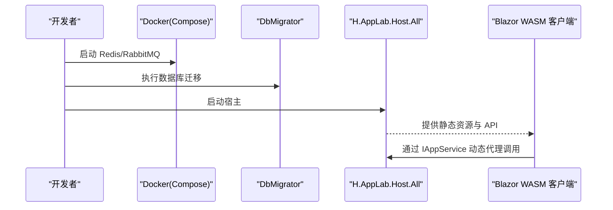
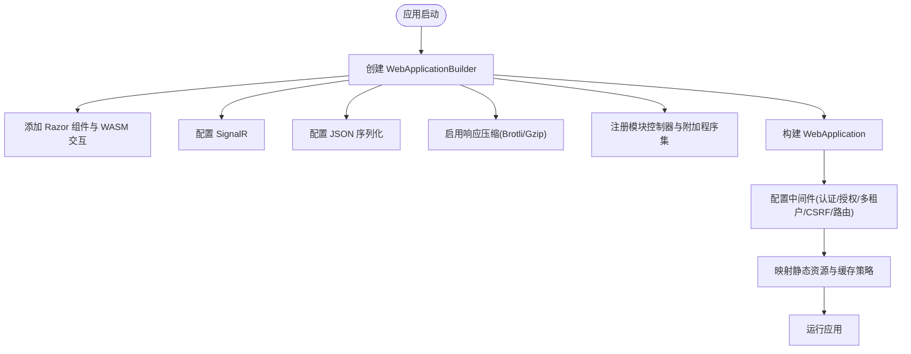
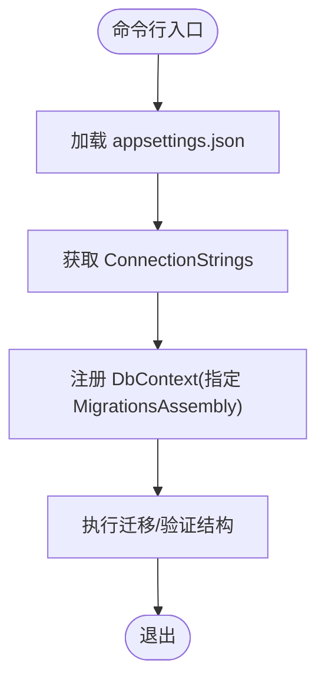
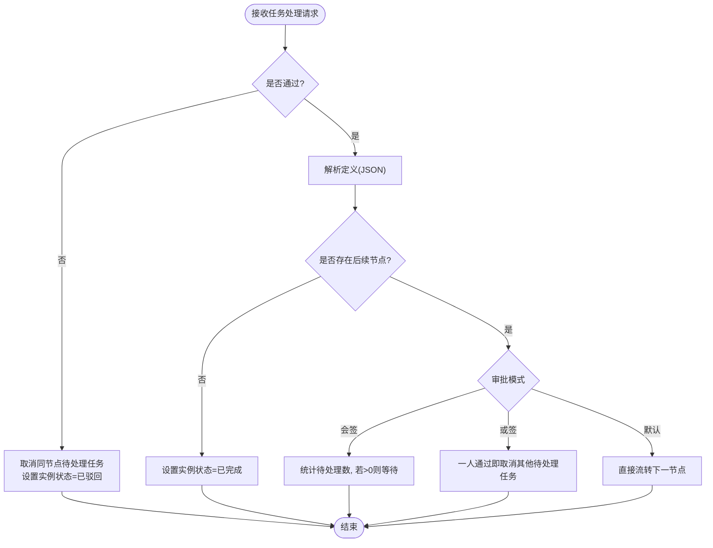
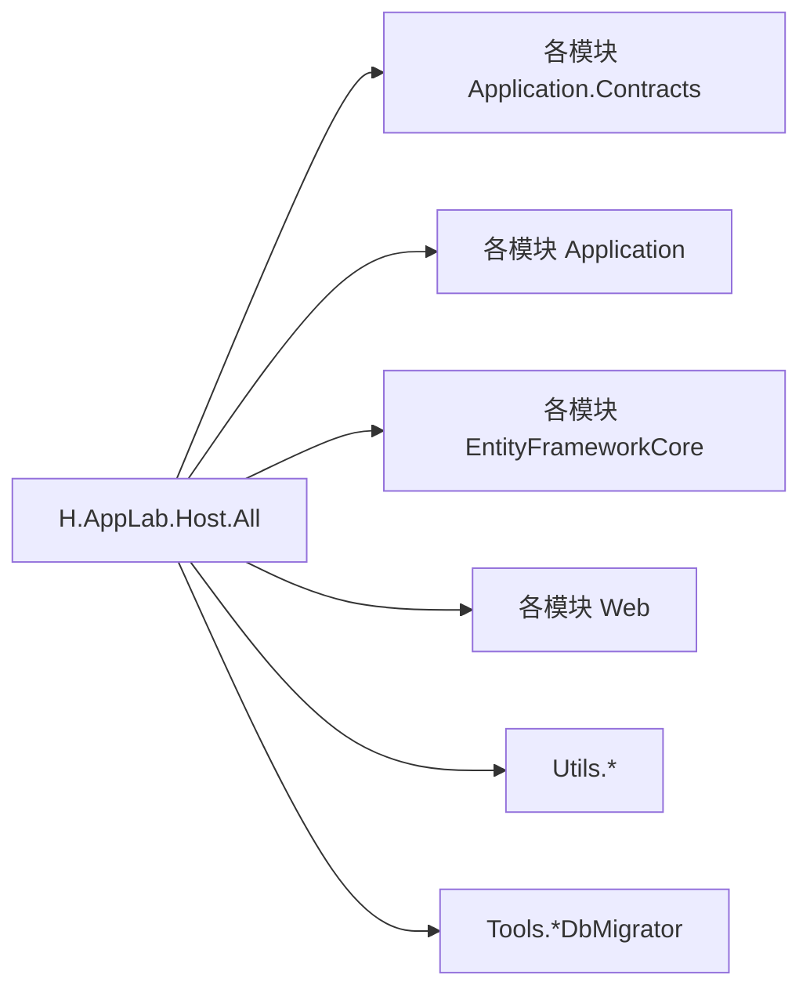

# 开发指南

<cite>
**本文引用的文件**
- [README.md](file://README.md)
- [global.json](file://src/global.json)
- [common.props](file://src/common.props)
- [Directory.Packages.props](file://src/Directory.Packages.props)
- [docker-compose.yml](file://cd/docker-compose.yml)
- [AppLab.slnx](file://src/AppLab.slnx)
- [Program.cs](file://src/Host/H.AppLab.Host.All/H.AppLab.Host.All/Program.cs)
- [appsettings.json](file://src/Host/H.AppLab.Host.All/H.AppLab.Host.All/appsettings.json)
- [HostAllModule.cs](file://src/Host/H.AppLab.Host.All/H.AppLab.Host.All/HostAllModule.cs)
- [Program.cs（组织迁移）](file://src/Tools/H.Organization.DbMigrator/Program.cs)
- [Program.cs（企业迁移）](file://src/Tools/H.Enterprise.DbMigrator/Program.cs)
- [Program.cs（低代码迁移）](file://src/Tools/H.LowCode.DbMigrator/Program.cs)
- [Program.cs（通知迁移）](file://src/Tools/H.Notification.DbMigrator/Program.cs)
- [Program.cs（助手迁移）](file://src/Tools/H.Assistant.DbMigrator/Program.cs)
- [Program.cs（审批迁移）](file://src/Tools/H.Approval.DbMigrator/Program.cs)
- [ApprovalWorkflowEngine.cs](file://src/services/Approval/H.Approval.Application/Services/ApprovalWorkflowEngine.cs)
- [ApprovalTaskAppService.cs](file://src/services/Approval/H.Approval.Application/Services/ApprovalTaskAppService.cs)
</cite>

## 目录
1. [简介](#简介)
2. [项目结构](#项目结构)
3. [核心组件](#核心组件)
4. [架构总览](#架构总览)
5. [详细组件分析](#详细组件分析)
6. [依赖关系分析](#依赖关系分析)
7. [性能与构建优化](#性能与构建优化)
8. [调试与常见问题](#调试与常见问题)
9. [测试指南](#测试指南)
10. [代码规范与质量检查](#代码规范与质量检查)
11. [新功能开发流程与最佳实践](#新功能开发流程与最佳实践)
12. [贡献与提交流程](#贡献与提交流程)
13. [结论](#结论)

## 简介
本指南面向 AppLab 平台的开发者，覆盖本地环境搭建、IDE 配置、依赖服务启动、代码结构与约定、测试方法、调试技巧、质量要求以及新功能开发与贡献流程。平台基于 .NET + Blazor，采用模块化架构，支持单体部署与按服务独立部署。

## 项目结构
- Host：宿主程序，仅做服务注册与管线配置；H.AppLab.Host.All 为单体宿主，其他 Host 为单服务宿主。
- Components：共享 UI 组件（如 AppDrawer）。
- LowCode：低代码核心，包含元数据 Schema、设计引擎、渲染引擎与主题等。
- Services：按限界上下文划分的业务模块（Account、Organization、Approval、Notification、Order、Setting、SupplyChain、BackgroundTask、Testing 等），每个模块遵循 Application.Contracts / Application / EntityFrameworkCore / Web 分层。
- System：系统级应用（Enterprise、SystemPortal），与 Services 隔离。
- Tools：各服务的 DbMigrator 控制台程序，用于创建/更新数据库结构。
- Utils：工具类库（ABP 契约、HTTP 动态代理、Blazor 工具、ID 生成等）。

```mermaid
graph TB
subgraph "宿主"
HostAll["H.AppLab.Host.All"]
AccountHost["H.Account.Host"]
RenderEngineHost["H.LowCode.RenderEngine.Host"]
end
subgraph "共享UI"
AppDrawer["H.AppDrawer.Components"]
end
subgraph "低代码"
Common["LowCode/Common"]
Design["LowCode/DesignEngine"]
Render["LowCode/RenderEngine"]
Themes["LowCode/Themes.AntBlazor"]
end
subgraph "业务服务"
S_Account["Services/Account"]
S_Org["Services/Organization"]
S_Approval["Services/Approval"]
S_Notification["Services/Notification"]
S_Order["Services/Order"]
S_Setting["Services/Setting"]
S_SupplyChain["Services/SupplyChain"]
S_BackgroundTask["Services/BackgroundTask"]
S_Testing["Services/Testing"]
end
subgraph "系统应用"
Sys_Enterprise["System/Enterprise"]
Sys_SystemPortal["System/SystemPortal"]
end
subgraph "工具"
Tools["Tools/*DbMigrator"]
Utils["Utils/*"]
end
HostAll --> AppDrawer
HostAll --> Common
HostAll --> Design
HostAll --> Render
HostAll --> Themes
HostAll --> S_Account
HostAll --> S_Org
HostAll --> S_Approval
HostAll --> S_Notification
HostAll --> S_Order
HostAll --> S_Setting
HostAll --> S_SupplyChain
HostAll --> S_BackgroundTask
HostAll --> S_Testing
HostAll --> Sys_Enterprise
HostAll --> Sys_SystemPortal
HostAll --> Tools
HostAll --> Utils
```

图表来源
- [AppLab.slnx](file://src/AppLab.slnx)

章节来源
- [README.md](file://README.md)
- [AppLab.slnx](file://src/AppLab.slnx)

## 核心组件
- 应用抽屉（AppDrawer）：统一顶部导航、侧边菜单与应用切换能力，通过元数据接入应用。
- HTTP 动态代理：前端只依赖 IAppService 接口，运行时根据 ABP 路由约定生成 HTTP 请求，简化客户端调用。
- 懒加载与 AOT：按需加载程序集，Release 模式启用 AOT 与裁剪，减少体积并提升启动速度。

章节来源
- [README.md](file://README.md)

## 架构总览
- 宿主层：使用 Blazor Web App（Server + WebAssembly Client），集成 SignalR、响应压缩、认证授权、多租户、Hangfire 仪表盘等。
- 应用层：按模块划分 Application.Contracts / Application / EF Core / Web 四层，控制器与服务通过 ABP 约定暴露。
- 数据层：EF Core + SQL Server，配合 DbMigrator 进行迁移。
- 外部依赖：Redis、RabbitMQ（通过 Docker Compose 启动）。

图表来源
- [Program.cs](file://src/Host/H.AppLab.Host.All/H.AppLab.Host.All/Program.cs)
- [appsettings.json](file://src/Host/H.AppLab.Host.All/H.AppLab.Host.All/appsettings.json)
- [docker-compose.yml](file://cd/docker-compose.yml)

章节来源
- [Program.cs](file://src/Host/H.AppLab.Host.All/H.AppLab.Host.All/Program.cs)
- [appsettings.json](file://src/Host/H.AppLab.Host.All/H.AppLab.Host.All/appsettings.json)
- [docker-compose.yml](file://cd/docker-compose.yml)

## 详细组件分析

### 宿主与启动管线（H.AppLab.Host.All）
- 使用 AddRazorComponents().AddInteractiveWebAssemblyComponents() 启用 Blazor 混合渲染。
- 配置 SignalR、JSON 序列化、响应压缩（Brotli/Gzip）、静态资源映射与缓存策略。
- 注册所有模块的控制器与额外程序集，支持多应用懒加载。
- 启用 Hangfire 仪表盘、MCP 路由、HTTPS 重定向、异常处理与 HSTS。

图表来源
- [Program.cs](file://src/Host/H.AppLab.Host.All/H.AppLab.Host.All/Program.cs)

章节来源
- [Program.cs](file://src/Host/H.AppLab.Host.All/H.AppLab.Host.All/Program.cs)
- [HostAllModule.cs](file://src/Host/H.AppLab.Host.All/H.AppLab.Host.All/HostAllModule.cs)

### 数据库迁移（DbMigrator）
- 每个服务提供独立的 DbMigrator 控制台程序，读取 appsettings.json 中的连接字符串，注册 DbContext 并执行迁移。
- 常用命令示例：dotnet run --project src/Tools/H.Xxx.DbMigrator

图表来源
- [Program.cs（组织迁移）](file://src/Tools/H.Organization.DbMigrator/Program.cs)
- [Program.cs（企业迁移）](file://src/Tools/H.Enterprise.DbMigrator/Program.cs)
- [Program.cs（低代码迁移）](file://src/Tools/H.LowCode.DbMigrator/Program.cs)
- [Program.cs（通知迁移）](file://src/Tools/H.Notification.DbMigrator/Program.cs)
- [Program.cs（助手迁移）](file://src/Tools/H.Assistant.DbMigrator/Program.cs)
- [Program.cs（审批迁移）](file://src/Tools/H.Approval.DbMigrator/Program.cs)

章节来源
- [Program.cs（组织迁移）](file://src/Tools/H.Organization.DbMigrator/Program.cs)
- [Program.cs（企业迁移）](file://src/Tools/H.Enterprise.DbMigrator/Program.cs)
- [Program.cs（低代码迁移）](file://src/Tools/H.LowCode.DbMigrator/Program.cs)
- [Program.cs（通知迁移）](file://src/Tools/H.Notification.DbMigrator/Program.cs)
- [Program.cs（助手迁移）](file://src/Tools/H.Assistant.DbMigrator/Program.cs)
- [Program.cs（审批迁移）](file://src/Tools/H.Approval.DbMigrator/Program.cs)

### 审批工作流引擎（Approval）
- 解析设计器产出的节点树 JSON，支持发起、审批（依次/会签/或签）、抄送、条件分支与结束。
- 任务推进逻辑：驳回则取消同节点待处理任务并结束实例；通过则根据模式判断是否继续流转。

图表来源
- [ApprovalWorkflowEngine.cs](file://src/services/Approval/H.Approval.Application/Services/ApprovalWorkflowEngine.cs)
- [ApprovalTaskAppService.cs](file://src/services/Approval/H.Approval.Application/Services/ApprovalTaskAppService.cs)

章节来源
- [ApprovalWorkflowEngine.cs](file://src/services/Approval/H.Approval.Application/Services/ApprovalWorkflowEngine.cs)
- [ApprovalTaskAppService.cs](file://src/services/Approval/H.Approval.Application/Services/ApprovalTaskAppService.cs)

## 依赖关系分析
- 解决方案由多个子项目组成，通过 AppLab.slnx 统一管理。
- 包版本集中管理于 Directory.Packages.props，确保一致性。
- 宿主通过 Program.cs 注入各模块控制器与附加程序集，形成松耦合的多模块体系。

图表来源
- [AppLab.slnx](file://src/AppLab.slnx)
- [Directory.Packages.props](file://src/Directory.Packages.props)

章节来源
- [AppLab.slnx](file://src/AppLab.slnx)
- [Directory.Packages.props](file://src/Directory.Packages.props)

## 性能与构建优化
- 响应压缩：启用 Brotli/Gzip，降低 WASM 与静态资源传输体积。
- 静态资源缓存：MapStaticAssets 自动对指纹化程序集设置 immutable 长缓存，避免清单过期导致的 404。
- 懒加载：在 Routes.razor 中按路由触发程序集加载，首页仅加载必要程序集。
- AOT 与裁剪：Release 模式启用 AOT 与 Trimming，进一步减小体积。

章节来源
- [Program.cs](file://src/Host/H.AppLab.Host.All/H.AppLab.Host.All/Program.cs)
- [README.md](file://README.md)

## 调试与常见问题
- 开发模式启用 WASM 调试与详细错误输出。
- 常见错误定位：
  - 页面卡在“加载中...”：检查静态资源缓存与清单一致性，避免将 /_framework 整体标记为 immutable。
  - 跨域与认证失败：确认 HTTPS 重定向、CORS、CookieHandler 与 RemoteServices 配置。
  - 数据库连接失败：核对 appsettings.json 的连接字符串与 DbMigrator 是否正确执行。
- 日志与监控：Serilog 与 Hangfire Dashboard 辅助问题排查。

章节来源
- [Program.cs](file://src/Host/H.AppLab.Host.All/H.AppLab.Host.All/Program.cs)
- [appsettings.json](file://src/Host/H.AppLab.Host.All/H.AppLab.Host.All/appsettings.json)

## 测试指南
- 单元测试：针对 Application 层的 Service 与领域逻辑编写，建议使用 xUnit/NUnit 与 Moq/NSubstitute 模拟依赖。
- 集成测试：使用 InMemory 或 Testcontainers 启动真实数据库/消息队列，验证端到端流程（如审批流转）。
- 建议：
  - 以 IAppService 接口为边界编写用例，保证前后端一致。
  - 对复杂工作流（如会签/或签）补充场景覆盖。
  - 使用 Mock 外部依赖（Redis/RabbitMQ）加速测试。

[本节为通用指导，不直接分析具体文件]

## 代码规范与质量检查
- 目标框架与语言特性：net10.0，ImplicitUsings、Nullable 开启，LangVersion 使用 preview。
- 包版本集中管理：Directory.Packages.props 统一版本，避免冲突。
- 命名与分层：严格遵循 Application.Contracts / Application / Domain / EF Core / Web 分层。
- 代码风格：遵循团队约定的 Roslyn Analyzers 与 Code Style 规则（建议在 IDE 中启用）。
- 质量门禁：CI 中集成编译、静态分析与测试，确保 PR 质量。

章节来源
- [common.props](file://src/common.props)
- [Directory.Packages.props](file://src/Directory.Packages.props)

## 新功能开发流程与最佳实践
- 需求与设计：明确限界上下文与接口契约，优先定义 Application.Contracts。
- 实现步骤：
  1) 新增模块或扩展现有模块，遵循分层结构。
  2) 在 Application 层实现服务，Domain 层建模与校验。
  3) EF Core 层定义实体与仓储，必要时新增迁移。
  4) Web 层暴露控制器或页面，注册到宿主。
- 配置与依赖：在 HostAllModule 中注册控制器与附加程序集，确保路由与 DI 正确。
- 测试与文档：补充单元/集成测试，更新 README 或模块说明。
- 发布与回滚：通过 DbMigrator 更新结构，灰度发布并监控 Hangfire 与日志。

章节来源
- [HostAllModule.cs](file://src/Host/H.AppLab.Host.All/H.AppLab.Host.All/HostAllModule.cs)
- [AppLab.slnx](file://src/AppLab.slnx)

## 贡献与提交流程
- 环境准备：安装 .NET SDK（版本见 global.json），WSL + Docker（Engine+Compose）+ Portainer。
- 启动依赖：将 cd/docker-compose.yml 复制到 WSL，执行 docker-compose up -d 启动 Redis/RabbitMQ。
- 数据库迁移：运行对应 DbMigrator 创建/更新数据库。
- 启动宿主：运行 H.AppLab.Host.All（默认端口 http://localhost:5045，https: 7065）。
- 提交规范：
  - 分支策略：feature/xxx、fix/xxx、hotfix/xxx。
  - 提交信息：简洁描述变更影响范围与动机。
  - 代码审查：至少一名 reviewer，关注契约稳定性与兼容性。
  - CI 门禁：通过编译、静态分析、测试后合并。

章节来源
- [README.md](file://README.md)
- [global.json](file://src/global.json)
- [docker-compose.yml](file://cd/docker-compose.yml)
- [Program.cs（某迁移）](file://src/Tools/H.Organization.DbMigrator/Program.cs)

## 结论
本指南提供了 AppLab 平台的完整开发路径：从环境搭建、架构理解、模块开发到测试与发布。遵循分层与契约优先的原则，结合懒加载与 AOT 优化，可在保证可维护性的同时获得良好的用户体验。建议持续完善测试覆盖率与质量门禁，确保平台稳定演进。