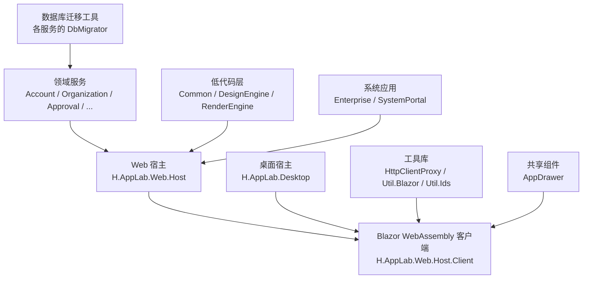
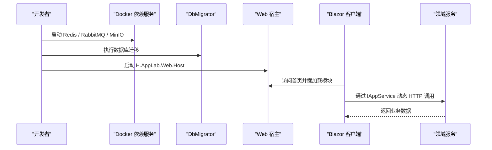
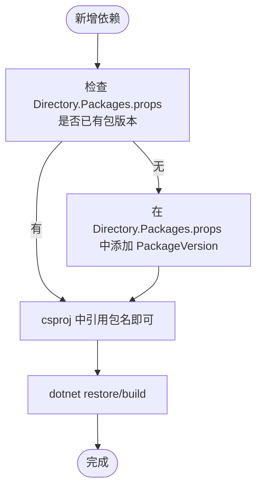
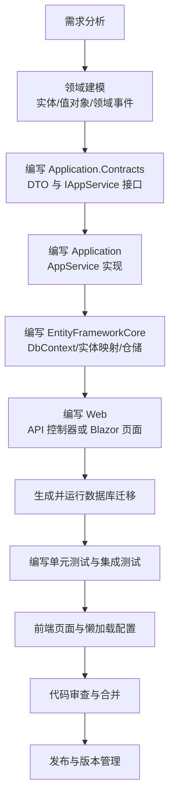
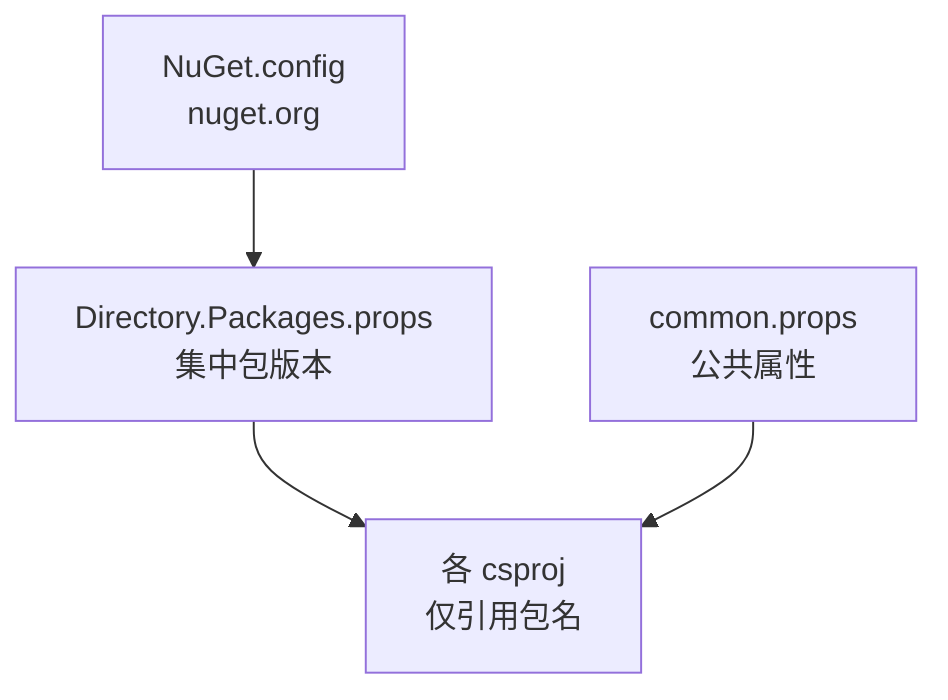

# 开发指南

<cite>
**本文引用的文件**   
- [README.md](file://README.md)
- [global.json](file://src/global.json)
- [Directory.Packages.props](file://src/Directory.Packages.props)
- [NuGet.config](file://src/NuGet.config)
- [common.props](file://src/common.props)
- [docker-compose.yml](file://cd/docker-compose.yml)
- [H.AppLab.Desktop.csproj](file://src/Host/H.AppLab.Desktop/H.AppLab.Desktop.csproj)
- [Program.cs（桌面宿主）](file://src/Host/H.AppLab.Desktop/Program.cs)
- [appsettings.json（桌面宿主）](file://src/Host/H.AppLab.Desktop/appsettings.json)
- [H.AppLab.Web.Host.csproj](file://src/Host/H.AppLab.Web.Host/H.AppLab.Web.Host/H.AppLab.Web.Host.csproj)
- [H.AppLab.Web.Host.Client.csproj](file://src/Host/H.AppLab.Web.Host/H.AppLab.Web.Host.Client/H.AppLab.Web.Host.Client.csproj)
</cite>

## 目录
1. [引言](#引言)
2. [项目结构](#项目结构)
3. [核心组件](#核心组件)
4. [架构总览](#架构总览)
5. [详细组件分析](#详细组件分析)
6. [依赖与包管理分析](#依赖与包管理分析)
7. [性能考虑](#性能考虑)
8. [故障排查指南](#故障排查指南)
9. [结论](#结论)
10. [附录：上手路径与学习资源](#附录上手路径与学习资源)

## 引言
本指南面向 AppLab 新加入的开发者，目标是帮助你在本地快速搭建 .NET 10 + Blazor 开发环境，理解项目的模块化架构、包管理机制、调试方式、新功能开发流程以及发布和版本管理策略。AppLab 是基于 .NET 与 Blazor 的实验性应用平台，采用模块化架构，既支持单体部署，也支持按服务独立部署；同时提供低代码设计引擎与渲染引擎、多领域服务、Avalonia 桌面宿主等能力。

## 项目结构
仓库根目录下的 README 对项目整体进行了分层说明：Host 是宿主程序，不包含业务逻辑；Components 提供可复用的 UI 组件；LowCode 包含低代码核心与服务；Services 是按限界上下文划分的企业级服务；System 为系统级应用；Tools 为数据库迁移工具；Utils 为公共工具库。

```mermaid
graph TB
    HostWeb["Web 宿主<br/>H.AppLab.Web.Host"] --> Client["Blazor WebAssembly 客户端<br/>H.AppLab.Web.Host.Client"]
    HostDesktop["桌面宿主<br/>H.AppLab.Desktop"] --> Client
    Services["领域服务<br/>Account / Organization / Approval / ..."] --> HostWeb
    LowCode["低代码层<br/>Common / DesignEngine / RenderEngine"] --> HostWeb
    SystemApps["系统应用<br/>Enterprise / SystemPortal"] --> HostWeb
    Tools["数据库迁移工具<br/>各服务的 DbMigrator"] --> Services
    Utils["工具库<br/>HttpClientProxy / Util.Blazor / Util.Ids"] --> Client
    Components["共享组件<br/>AppDrawer"] --> Client
```

图表来源
- [README.md:1-73](file://README.md#L1-L73)
- [H.AppLab.Web.Host.csproj:1-66](file://src/Host/H.AppLab.Web.Host/H.AppLab.Web.Host/H.AppLab.Web.Host.csproj#L1-L66)
- [H.AppLab.Web.Host.Client.csproj:1-147](file://src/Host/H.AppLab.Web.Host/H.AppLab.Web.Host.Client/H.AppLab.Web.Host.Client.csproj#L1-L147)
- [H.AppLab.Desktop.csproj:1-28](file://src/Host/H.AppLab.Desktop/H.AppLab.Desktop.csproj#L1-L28)

章节来源
- [README.md:1-73](file://README.md#L1-L73)

## 核心组件
- Web 宿主：基于 ASP.NET Core Web，聚合多个 Application 层模块，并提供 Blazor Server/WebAssembly 混合运行能力。
- WebAssembly 客户端：负责前端路由、懒加载各模块程序集、通过动态代理调用后端 IAppService。
- 桌面宿主：基于 Avalonia 的统一外壳，接入 Workbench 等客户端应用。
- 低代码层：包含元数据 Schema、组件基类、默认组件库、设计引擎与渲染引擎。
- 领域服务：按限界上下文划分，遵循 Application.Contracts/Application/EntityFrameworkCore/Web 分层。
- 迁移工具：每个服务对应一个控制台 DbMigrator，用于创建和更新数据库结构。
- 工具库：HTTP 动态代理、Blazor 工具、ID 生成器、基础类型扩展等。

章节来源
- [README.md:1-73](file://README.md#L1-L73)

## 架构总览
AppLab 的整体架构由“宿主 + 前端客户端 + 低代码层 + 领域服务 + 工具与基础设施”构成。Web 宿主作为聚合入口，注册并暴露各服务；WebAssembly 客户端按需加载模块程序集并通过 HttpClientProxy 调用后端接口；桌面宿主以 Avalonia 形式承载客户端应用；低代码层提供可视化设计与运行时渲染能力；迁移工具保证数据库结构与领域模型同步。

```mermaid
sequenceDiagram
    participant Dev as "开发者"
    participant Docker as "Docker 依赖服务"
    participant Migrator as "DbMigrator"
    participant WebHost as "Web 宿主"
    participant Client as "Blazor 客户端"
    participant Service as "领域服务"
    
    Dev->>Docker: 启动 Redis / RabbitMQ / MinIO
    Dev->>Migrator: 执行数据库迁移
    Dev->>WebHost: 启动 H.AppLab.Web.Host
    Client->>WebHost: 访问首页并懒加载模块
    Client->>Service: 通过 IAppService 动态 HTTP 调用
    Service-->>Client: 返回业务数据
```

图表来源
- [docker-compose.yml:1-48](file://cd/docker-compose.yml#L1-L48)
- [README.md:1-73](file://README.md#L1-L73)
- [H.AppLab.Web.Host.csproj:1-66](file://src/Host/H.AppLab.Web.Host/H.AppLab.Web.Host/H.AppLab.Web.Host.csproj#L1-L66)
- [H.AppLab.Web.Host.Client.csproj:1-147](file://src/Host/H.AppLab.Web.Host/H.AppLab.Web.Host.Client/H.AppLab.Web.Host.Client.csproj#L1-L147)

## 详细组件分析

### 开发环境搭建
- .NET SDK：使用 src/global.json 指定的 SDK 版本，启用 latestFeature 回退策略。
- SQL Server：由各领域服务的 EntityFrameworkCore 与 SqlServer 包驱动，需确保连接字符串正确指向本地或容器化实例。
- Redis/RabbitMQ/MinIO：通过 cd/docker-compose.yml 统一编排，分别提供缓存/消息存储、消息队列、对象存储能力。

建议步骤：
1. 安装 .NET 10 SDK（与 global.json 对齐）。
2. 安装 Docker Engine 与 Compose，并按 README 说明在 WSL 中启动依赖服务。
3. 初始化数据库：运行 Tools 目录下对应服务的 DbMigrator。
4. 启动主程序：优先从 Web 宿主启动，也可选择桌面宿主进行客户端调试。

章节来源
- [global.json:1-6](file://src/global.json#L1-L6)
- [README.md:1-73](file://README.md#L1-L73)
- [docker-compose.yml:1-48](file://cd/docker-compose.yml#L1-L48)

### 包管理机制
本项目采用集中式包版本管理，所有第三方包版本集中在 Directory.Packages.props 中定义，csproj 中仅引用包名而不写版本号；NuGet 源由 NuGet.config 指定；公共编译属性由 common.props 统一管理。

关键点：
- Directory.Packages.props：启用 ManagePackageVersionsCentrally，并集中维护 Microsoft.AspNetCore.*、EF Core、ABP、Avalonia、Serilog、CAP、Hangfire、Minio 等包版本。
- NuGet.config：仅保留官方 nuget.org 源，避免私有源干扰本地构建。
- common.props：统一 TargetFramework=net10.0、ImplicitUsings、Nullable、LangVersion=preview、Version=0.7.0、Authors/Company/Description/SatelliteResourceLanguages 等全局属性。

```mermaid
flowchart TD
    Start(["新增依赖"]) --> CheckProps["检查 Directory.Packages.props<br/>是否已有包版本"]
    CheckProps -->|有| UseRef["csproj 中引用包名即可"]
    CheckProps -->|无| AddVersion["在 Directory.Packages.props 中添加 PackageVersion"]
    AddVersion --> UseRef
    UseRef --> Build["dotnet restore/build"]
    Build --> End(["完成"])
```

图表来源
- [Directory.Packages.props:1-102](file://src/Directory.Packages.props#L1-L102)
- [NuGet.config:1-7](file://src/NuGet.config#L1-L7)
- [common.props:1-15](file://src/common.props#L1-L15)

章节来源
- [Directory.Packages.props:1-102](file://src/Directory.Packages.props#L1-L102)
- [NuGet.config:1-7](file://src/NuGet.config#L1-L7)
- [common.props:1-15](file://src/common.props#L1-L15)

### 编码规范与最佳实践
- C# 语言与编译选项：TargetFramework 为 net10.0，开启 ImplicitUsings 与 Nullable，LangVersion 使用 preview。
- 命名约定：沿用 ABP 与 Blazor 社区常见约定，如 Application.Contracts 中的 DTO、IAppService 接口、Application 层的 AppService 实现、EF Core 的 DbContext 与实体映射。
- 注释规范：关键入口类与方法应添加 summary 注释，例如桌面宿主的 Program 对角色与职责进行说明。
- 单元测试：建议在 Testing 服务中参考现有测试结构，使用 xUnit/MSTest/NUnit 结合 EF Core InMemory/TestContainers 或真实数据库进行测试；对于 HTTP 动态代理，可在客户端或服务端分别验证 IAppService 行为。

注意：本仓库未提供统一的代码风格配置文件，建议团队内部约定基于 ABP 与 Blazor 社区惯例，并使用 IDE 自动格式化规则保持一致。

章节来源
- [common.props:1-15](file://src/common.props#L1-L15)
- [Program.cs（桌面宿主）:1-19](file://src/Host/H.AppLab.Desktop/Program.cs#L1-L19)
- [README.md:1-73](file://README.md#L1-L73)

### 调试技巧
- Web 宿主调试：
  - 启动 H.AppLab.Web.Host，默认地址在 README 中给出；可通过浏览器开发者工具观察 WASM 懒加载程序集与请求。
  - 服务端断点：在 Application 层的 AppService 中设置断点，确认 IAppService 调用链路。
  - 日志查看：若启用 Serilog，请检查控制台输出与文件输出位置；若使用 CAP/Elsa/Hangfire，可查看各自后台任务与作业状态。
- 桌面宿主调试：
  - 启动 H.AppLab.Desktop，基于 Avalonia 启动桌面应用；RemoteServices 配置在 appsettings.json 中指向后端地址。
  - 断点调试：在 Avalonia App 与业务 ViewModel 中设置断点；同时检查 RemoteServices 与 HttpClient 证书允许配置。
- 前端调试：
  - 使用浏览器开发者工具的 Network 面板查看 Blazor WebAssembly 程序集与 pdb 的懒加载情况。
  - 在 ClientServices 或路由导航处设置断点，验证 LazyModuleRegistry 与 CompositeServiceProvider 的服务解析过程。

章节来源
- [README.md:1-73](file://README.md#L1-L73)
- [appsettings.json（桌面宿主）:1-10](file://src/Host/H.AppLab.Desktop/appsettings.json#L1-L10)
- [H.AppLab.Web.Host.Client.csproj:1-147](file://src/Host/H.AppLab.Web.Host/H.AppLab.Web.Host.Client/H.AppLab.Web.Host.Client.csproj#L1-L147)

### 新功能开发工作流程
以新增一个领域服务为例，典型流程如下：

```mermaid
flowchart TD
    Req["需求分析"] --> Domain["领域建模<br/>实体/值对象/领域事件"]
    Domain --> Contracts["编写 Application.Contracts<br/>DTO 与 IAppService 接口"]
    Contracts --> App["编写 Application<br/>AppService 实现"]
    App --> Infra["编写 EntityFrameworkCore<br/>DbContext/实体映射/仓储"]
    Infra --> Web["编写 Web<br/>API 控制器或 Blazor 页面"]
    Web --> Migration["生成并运行数据库迁移"]
    Migration --> Test["编写单元测试与集成测试"]
    Test --> Frontend["前端页面与懒加载配置"]
    Frontend --> Review["代码审查与合并"]
    Review --> Release["发布与版本管理"]
```

图表来源
- [README.md:1-73](file://README.md#L1-L73)
- [H.AppLab.Web.Host.csproj:1-66](file://src/Host/H.AppLab.Web.Host/H.AppLab.Web.Host/H.AppLab.Web.Host.csproj#L1-L66)

具体步骤建议：
1. 在 Services 下新建限界上下文，按 Application.Contracts/Application/EntityFrameworkCore/Web 四层组织代码。
2. 在 Application.Contracts 中定义 DTO 与 IAppService 接口；在 Application 中实现 AppService。
3. 在 EntityFrameworkCore 中定义 DbContext、实体、映射与初始数据；使用 Tools 下对应 DbMigrator 生成迁移。
4. 在 Web 项目中暴露 API 或提供 Blazor 页面；在客户端 csproj 中将新模块程序集加入 BlazorWebAssemblyLazyLoad。
5. 编写测试，覆盖关键用例与异常场景。
6. 提交前执行完整构建与测试，确保不破坏既有功能。

章节来源
- [README.md:1-73](file://README.md#L1-L73)
- [H.AppLab.Web.Host.Client.csproj:1-147](file://src/Host/H.AppLab.Web.Host/H.AppLab.Web.Host.Client/H.AppLab.Web.Host.Client.csproj#L1-L147)

### 代码审查清单
- 架构一致性：是否遵循 ABP 分层与限界上下文划分。
- 包管理：是否通过 Directory.Packages.props 引入依赖，是否存在未集中管理的版本。
- 配置安全：连接字符串、密钥、远程服务地址是否在配置文件中管理，是否避免硬编码。
- 可测试性：是否提供接口抽象、是否注入依赖、是否可替换仓储与外部服务。
- 可维护性：是否添加必要注释、是否拆分复杂方法、是否避免深层嵌套条件。
- 性能：是否避免 N+1 查询、是否合理使用分页与投影、是否减少不必要的序列化。
- 前端：是否正确使用 IAppService 动态代理、是否正确配置懒加载、是否处理错误与空状态。
- 发布：是否更新版本号、是否记录变更、是否验证数据库迁移与部署脚本。

### 发布流程与版本管理策略
- 版本号：common.props 中统一 Version=0.7.0，发布时应提升该版本号并记录变更日志。
- 构建产物：Web 宿主与客户端分别构建；Release 模式启用 AOT 与裁剪以减少体积。
- 数据库迁移：发布前确保所有迁移已生成并经过测试；生产环境通过 DbMigrator 执行迁移。
- 部署：单体部署可直接发布 H.AppLab.Web.Host；微服务部署可按服务独立发布，并通过网关或反向代理组合。
- 回滚：数据库迁移需具备回滚方案；前端懒加载程序集需保证向后兼容。

章节来源
- [common.props:1-15](file://src/common.props#L1-L15)
- [H.AppLab.Web.Host.Client.csproj:1-147](file://src/Host/H.AppLab.Web.Host/H.AppLab.Web.Host.Client/H.AppLab.Web.Host.Client.csproj#L1-L147)
- [README.md:1-73](file://README.md#L1-L73)

## 依赖与包管理分析
- 官方与生态包：Microsoft.AspNetCore.*、EF Core、Identity、HttpClient、Extensions；ABP 框架全套包；Elsa、CAP、Hangfire 工作流与后台任务；Serilog 日志；Minio 对象存储。
- 桌面与前端：Avalonia 系列包用于桌面宿主；Blazor WebAssembly 相关包用于客户端。
- 包版本策略：所有版本集中于 Directory.Packages.props，便于升级与审计；NuGet 源仅指向官方源，降低供应链风险。
- 公共属性：TargetFramework、ImplicitUsings、Nullable、LangVersion、Version、Authors/Company/Description 等由 common.props 统一管理。

```mermaid
graph TB
    Props["Directory.Packages.props<br/>集中包版本"] --> CsProj["各 csproj<br/>仅引用包名"]
    Config["NuGet.config<br/>nuget.org"] --> Props
    Common["common.props<br/>公共属性"] --> CsProj
```

图表来源
- [Directory.Packages.props:1-102](file://src/Directory.Packages.props#L1-L102)
- [NuGet.config:1-7](file://src/NuGet.config#L1-L7)
- [common.props:1-15](file://src/common.props#L1-L15)

章节来源
- [Directory.Packages.props:1-102](file://src/Directory.Packages.props#L1-L102)
- [NuGet.config:1-7](file://src/NuGet.config#L1-L7)
- [common.props:1-15](file://src/common.props#L1-L15)

## 性能考虑
- WebAssembly 懒加载：客户端仅在导航到对应路由时下载模块程序集与 pdb，显著降低首屏体积与启动时间。
- AOT 与裁剪：Release 模式启用 RunAOTCompilation，并对关键程序集设置 TrimmerRootAssembly，减少运行时代码体积。
- 数据库查询：避免 N+1 问题，合理分页、投影与缓存；对热点数据可使用 Redis。
- 异步与并发：后端尽量使用异步 IO，避免阻塞线程池；后台任务使用 Hangfire 或 Elsa 管理。
- 日志与监控：使用 Serilog 输出结构化日志，配合文件与控制台 Sink，必要时接入集中式日志系统。

[本节为通用性能建议，不直接分析具体源码文件]

## 故障排查指南
- 依赖服务无法连接：
  - 检查 docker-compose.yml 中 Redis/RabbitMQ/MinIO 端口与环境变量是否与应用程序配置一致。
  - 确认防火墙与 WSL 网络转发正常。
- 数据库迁移失败：
  - 检查连接字符串与 SQL Server 实例可用性。
  - 确认迁移文件顺序与回滚脚本正确。
- 前端懒加载程序集未加载：
  - 检查 H.AppLab.Web.Host.Client.csproj 中 BlazorWebAssemblyLazyLoad 列表是否包含新模块。
  - 查看浏览器 Network 面板是否有 404 或 CORS 错误。
- 桌面宿主无法调用后端：
  - 检查 appsettings.json 中 RemoteServices 的 BaseUrl 与 Http.AllowInvalidCertificates。
  - 确认后端 HTTPS 证书在本机被信任或允许无效证书。

章节来源
- [docker-compose.yml:1-48](file://cd/docker-compose.yml#L1-L48)
- [appsettings.json（桌面宿主）:1-10](file://src/Host/H.AppLab.Desktop/appsettings.json#L1-L10)
- [H.AppLab.Web.Host.Client.csproj:1-147](file://src/Host/H.AppLab.Web.Host/H.AppLab.Web.Host.Client/H.AppLab.Web.Host.Client.csproj#L1-L147)

## 结论
AppLab 是一个基于 .NET 10 与 Blazor 的模块化低代码平台，具备良好的分层架构、集中式包管理与前后端解耦能力。通过 Docker 编排依赖服务、DbMigrator 管理数据库、HttpClientProxy 简化前后端交互，开发者可以高效地扩展领域服务、设计页面并快速迭代。建议新加入者先从 README 与环境搭建入手，逐步熟悉低代码层与领域服务，再参与新功能开发与发布流程。

## 附录：上手路径与学习资源
- 第一步：阅读 README，了解整体结构与本地开发流程。
- 第二步：安装 .NET 10 SDK、WSL、Docker，并按 cd/docker-compose.yml 启动依赖服务。
- 第三步：运行 Tools 下对应 DbMigrator，初始化数据库。
- 第四步：启动 H.AppLab.Web.Host，体验 Web 宿主与 Blazor 客户端。
- 第五步：尝试 H.AppLab.Desktop，了解 Avalonia 桌面宿主与 RemoteServices 配置。
- 第六步：选择一个 Services 下的限界上下文，模仿现有结构新增功能。
- 第七步：在 H.AppLab.Web.Host.Client.csproj 中配置懒加载，并在前端页面中调用 IAppService。
- 第八步：编写测试、进行代码审查、提升版本号并发布。

推荐学习方向：
- ABP Framework 分层与模块概念。
- Blazor Server/WebAssembly 与懒加载机制。
- EF Core 迁移与数据库设计。
- Avalonia 桌面应用开发。
- Serilog、CAP、Hangfire、Elsa 等中间件的使用。

[本节为通用学习建议，不直接分析具体源码文件]