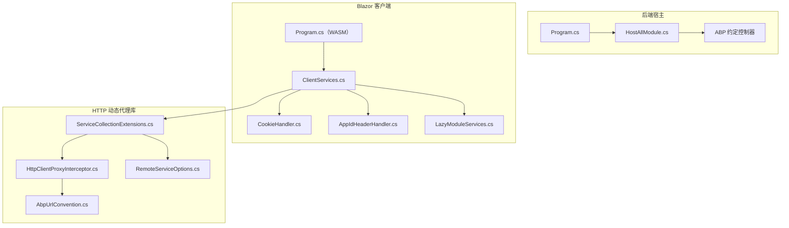
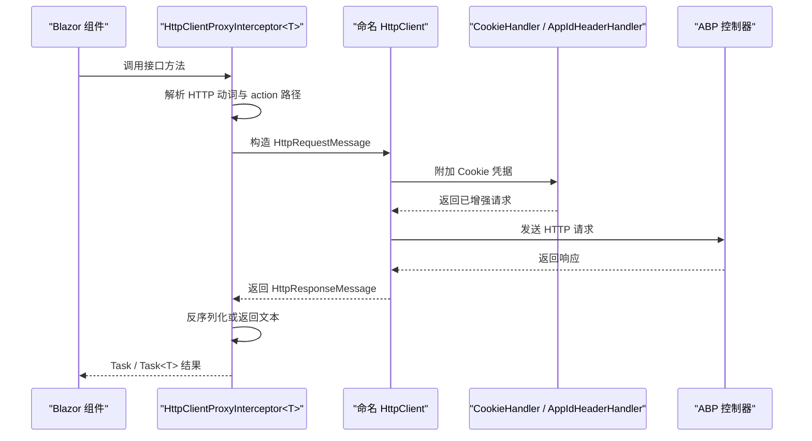
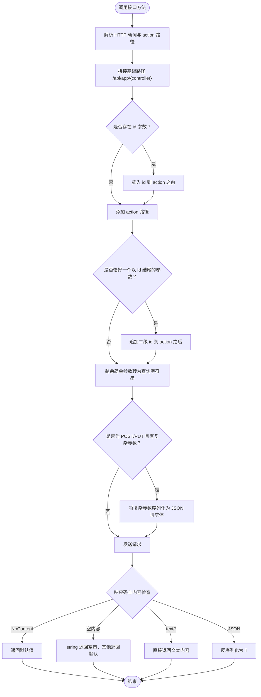
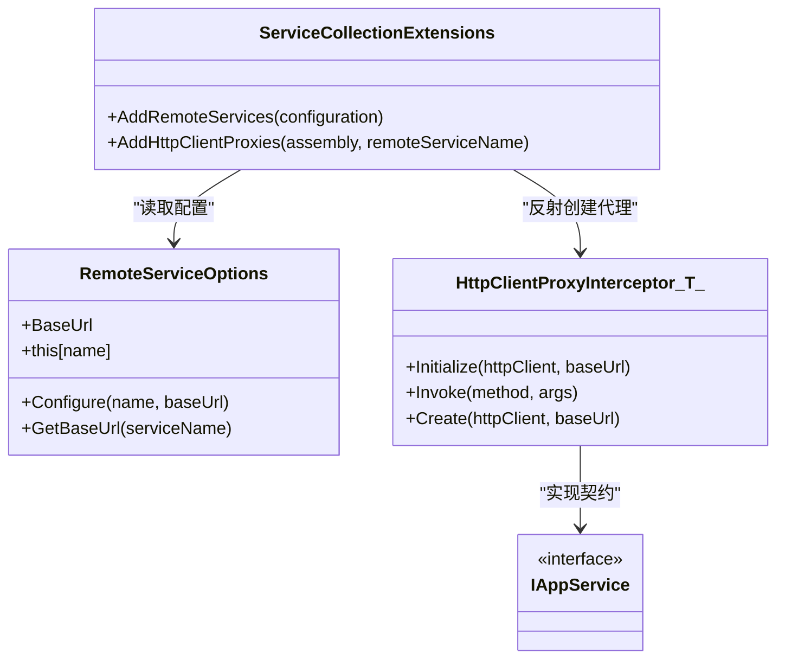
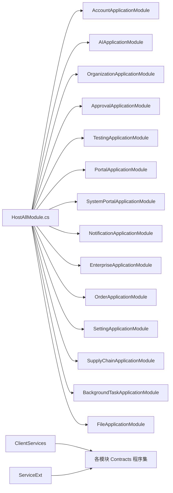
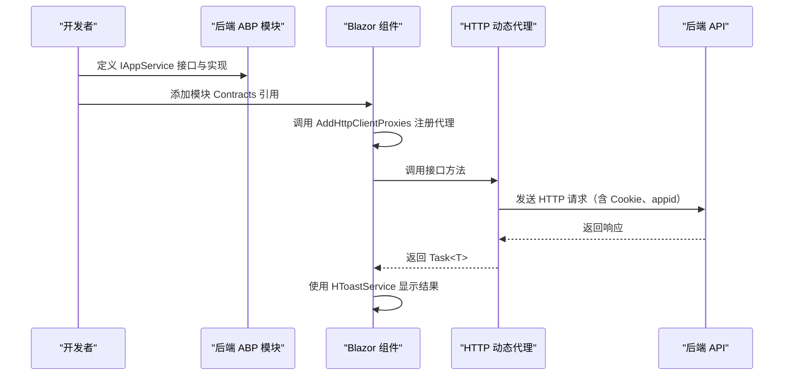

# API接口与前端集成

<cite>
**本文引用的文件**   
- [Program.cs](file://src/Host/H.AppLab.Web.Host/H.AppLab.Web.Host/Program.cs)
- [HostAllModule.cs](file://src/Host/H.AppLab.Web.Host/H.AppLab.Web.Host/HostAllModule.cs)
- [ClientServices.cs](file://src/Host/H.AppLab.Web.Host/H.AppLab.Web.Host.Client/ClientServices.cs)
- [Program.cs（客户端）](file://src/Host/H.AppLab.Web.Host/H.AppLab.Web.Host.Client/Program.cs)
- [CookieHandler.cs](file://src/Host/H.AppLab.Web.Host/H.AppLab.Web.Host.Client/CookieHandler.cs)
- [AppIdHeaderHandler.cs](file://src/Host/H.AppLab.Web.Host/H.AppLab.Web.Host.Client/AppIdHeaderHandler.cs)
- [LazyModuleServices.cs](file://src/Host/H.AppLab.Web.Host/H.AppLab.Web.Host.Client/LazyModuleServices.cs)
- [AbpUrlConvention.cs](file://src/Utils/H.Abp.HttpClientProxy/AbpUrlConvention.cs)
- [HttpClientProxyInterceptor.cs](file://src/Utils/H.Abp.HttpClientProxy/HttpClientProxyInterceptor.cs)
- [RemoteServiceOptions.cs](file://src/Utils/H.Abp.HttpClientProxy/RemoteServiceOptions.cs)
- [ServiceCollectionExtensions.cs](file://src/Utils/H.Abp.HttpClientProxy/ServiceCollectionExtensions.cs)
</cite>

## 目录
1. [引言](#引言)
2. [项目结构](#项目结构)
3. [核心组件](#核心组件)
4. [架构总览](#架构总览)
5. [详细组件分析](#详细组件分析)
6. [依赖关系分析](#依赖关系分析)
7. [性能考虑](#性能考虑)
8. [故障排查指南](#故障排查指南)
9. [结论](#结论)
10. [附录：端到端集成示例](#附录端到端集成示例)

## 引言
本文面向 H.AppLab 平台的后端 API 暴露与 Blazor WebAssembly 前端集成，重点说明以下内容：
- 后端如何统一注册控制器、启用认证、多租户、SignalR、静态资源与压缩等。
- 前端如何通过自定义 HTTP 动态代理将 C# 接口方法转换为 ABP 风格 URL 请求。
- HttpClient 命名客户端、Cookie 凭据传递、应用标识头注入、错误处理与服务发现机制。
- 懒加载模块的服务注册、路由到模块映射、组件通信与状态管理。
- 部署相关的跨域、CORS、安全与性能注意事项。

本仓库未包含 Swagger/OpenAPI 生成代码；文档中涉及“Swagger”的部分为通用实践建议，并非当前代码的直接实现。

## 项目结构
H.AppLab 采用 ABP 模块化架构，宿主程序负责聚合各业务领域服务，Blazor WASM 作为交互式 WebAssembly 客户端通过 HTTP 调用后端。

**图示来源**
- [Program.cs:1-112](file://src/Host/H.AppLab.Web.Host/H.AppLab.Web.Host/Program.cs#L1-L112)
- [HostAllModule.cs:1-200](file://src/Host/H.AppLab.Web.Host/H.AppLab.Web.Host/HostAllModule.cs#L1-L200)
- [Program.cs（客户端）:1-13](file://src/Host/H.AppLab.Web.Host/H.AppLab.Web.Host.Client/Program.cs#L1-L13)
- [ClientServices.cs:1-193](file://src/Host/H.AppLab.Web.Host/H.AppLab.Web.Host.Client/ClientServices.cs#L1-L193)
- [CookieHandler.cs:1-16](file://src/Host/H.AppLab.Web.Host/H.AppLab.Web.Host.Client/CookieHandler.cs#L1-L16)
- [AppIdHeaderHandler.cs:1-50](file://src/Host/H.AppLab.Web.Host/H.AppLab.Web.Host.Client/AppIdHeaderHandler.cs#L1-L50)
- [LazyModuleServices.cs:1-141](file://src/Host/H.AppLab.Web.Host/H.AppLab.Web.Host.Client/LazyModuleServices.cs#L1-L141)
- [AbpUrlConvention.cs:1-86](file://src/Utils/H.Abp.HttpClientProxy/AbpUrlConvention.cs#L1-L86)
- [HttpClientProxyInterceptor.cs:1-234](file://src/Utils/H.Abp.HttpClientProxy/HttpClientProxyInterceptor.cs#L1-L234)
- [RemoteServiceOptions.cs:1-33](file://src/Utils/H.Abp.HttpClientProxy/RemoteServiceOptions.cs#L1-L33)
- [ServiceCollectionExtensions.cs:1-63](file://src/Utils/H.Abp.HttpClientProxy/ServiceCollectionExtensions.cs#L1-L63)

**章节来源**
- [Program.cs:1-112](file://src/Host/H.AppLab.Web.Host/H.AppLab.Web.Host/Program.cs#L1-L112)
- [HostAllModule.cs:1-200](file://src/Host/H.AppLab.Web.Host/H.AppLab.Web.Host/HostAllModule.cs#L1-L200)
- [Program.cs（客户端）:1-13](file://src/Host/H.AppLab.Web.Host/H.AppLab.Web.Host.Client/Program.cs#L1-L13)
- [ClientServices.cs:1-193](file://src/Host/H.AppLab.Web.Host/H.AppLab.Web.Host.Client/ClientServices.cs#L1-L193)

## 核心组件
- 后端宿主 Program：构建 ASP.NET Core 应用、注册 Razor Components、SignalR、JSON、响应压缩、中间件管道、控制器映射、Hangfire 仪表盘以及 Blazor 组件集合。
- 宿主模块 HostAllModule：聚合 ABP 模块、配置认证 Cookie、多租户、外部登录、自动控制器扫描、全局服务（如 LowCodeAppState、HToastService）。
- 客户端 Program：创建 WebAssembly 宿主、注册组合式容器与懒加载模块注册表、调用 ClientServices.Configure。
- 客户端服务 ClientServices：集中注册远程服务名常量、加载 RemoteServices 配置、默认 HttpClient、Cookie/AppId 消息处理器、按模块懒加载代理。
- HTTP 动态代理库：AbpUrlConvention 定义 URL 约定；HttpClientProxyInterceptor 基于 DispatchProxy 拦截接口调用并构造 HTTP 请求；ServiceCollectionExtensions 提供 AddRemoteServices 与 AddHttpClientProxies；RemoteServiceOptions 读取 appsettings.json 的 RemoteServices。
- 客户端中间件 CookieHandler 与 AppIdHeaderHandler：前者让浏览器 fetch 携带 Cookie，后者从路由解析 appId 并注入请求头。
- 懒加载模块 LazyModuleServices：LazyModuleRegistry 与 CompositeServiceProvider/Scope 在模块程序集下载后向子容器追加服务。

**章节来源**
- [Program.cs:1-112](file://src/Host/H.AppLab.Web.Host/H.AppLab.Web.Host/Program.cs#L1-L112)
- [HostAllModule.cs:1-200](file://src/Host/H.AppLab.Web.Host/H.AppLab.Web.Host/HostAllModule.cs#L1-L200)
- [ClientServices.cs:1-193](file://src/Host/H.AppLab.Web.Host/H.AppLab.Web.Host.Client/ClientServices.cs#L1-L193)
- [AbpUrlConvention.cs:1-86](file://src/Utils/H.Abp.HttpClientProxy/AbpUrlConvention.cs#L1-L86)
- [HttpClientProxyInterceptor.cs:1-234](file://src/Utils/H.Abp.HttpClientProxy/HttpClientProxyInterceptor.cs#L1-L234)
- [ServiceCollectionExtensions.cs:1-63](file://src/Utils/H.Abp.HttpClientProxy/ServiceCollectionExtensions.cs#L1-L63)
- [RemoteServiceOptions.cs:1-33](file://src/Utils/H.Abp.HttpClientProxy/RemoteServiceOptions.cs#L1-L33)
- [CookieHandler.cs:1-16](file://src/Host/H.AppLab.Web.Host/H.AppLab.Web.Host.Client/CookieHandler.cs#L1-L16)
- [AppIdHeaderHandler.cs:1-50](file://src/Host/H.AppLab.Web.Host/H.AppLab.Web.Host.Client/AppIdHeaderHandler.cs#L1-L50)
- [LazyModuleServices.cs:1-141](file://src/Host/H.AppLab.Web.Host/H.AppLab.Web.Host.Client/LazyModuleServices.cs#L1-L141)

## 架构总览
后端以 ABP 模块组织领域服务，并通过约定式控制器对外暴露 REST API；前端通过 Blazor WebAssembly 调用由 IAppService 契约生成的 HTTP 代理，所有请求经由命名 HttpClient 和两个 DelegatingHandler 完成 Cookie 传递与 appId 注入。

**图示来源**
- [HttpClientProxyInterceptor.cs:1-234](file://src/Utils/H.Abp.HttpClientProxy/HttpClientProxyInterceptor.cs#L1-L234)
- [CookieHandler.cs:1-16](file://src/Host/H.AppLab.Web.Host/H.AppLab.Web.Host.Client/CookieHandler.cs#L1-L16)
- [AppIdHeaderHandler.cs:1-50](file://src/Host/H.AppLab.Web.Host/H.AppLab.Web.Host.Client/AppIdHeaderHandler.cs#L1-L50)

## 详细组件分析

### 后端 API 暴露方式
- 控制器注册：通过 ABP 的约定式控制器扫描，宿主模块显式声明多个 Application 模块的程序集，使各领域的 AppService 自动成为 MVC 控制器。
- JSON 序列化：使用 camelCase 命名策略，便于前端直接消费。
- 认证与会话：使用 Cookie 认证方案，支持主系统 Cookie 与系统级 Cookie 双方案；禁用自动 CSRF 验证，因为 WASM 场景下 SameSite Cookie 已足够。
- 多租户：启用 ABP 多租户，从 Claim 中解析租户 ID，并提供租户无效时的友好处理。
- 静态资源与压缩：启用 Brotli/Gzip 压缩，MapStaticAssets 用于 WASM 资源缓存；开发模式启用调试，生产模式启用异常页与 HSTS。
- SignalR：启用并设置最大接收消息大小，开发环境开启详细错误。
- Hangfire：挂载后台任务仪表盘。

**章节来源**
- [Program.cs:1-112](file://src/Host/H.AppLab.Web.Host/H.AppLab.Web.Host/Program.cs#L1-L112)
- [HostAllModule.cs:1-200](file://src/Host/H.AppLab.Web.Host/H.AppLab.Web.Host/HostAllModule.cs#L1-L200)

### Controller 编写与路由约定
- 后端遵循 ABP 约定：继承 IAppService 的接口会被自动注册为控制器。
- URL 约定由客户端侧 AbpUrlConvention 与服务端保持一致：
  - 控制器名称：去除 I 前缀与 AppService/ApplicationService 后缀，转 kebab-case。
  - 方法前缀：GetList/GetAll/Get/Put/Update/Delete/Remove/Create/Add/Insert/Post/Patch 映射到对应 HTTP 动词。
  - 参数规则：名为 id 的简单类型参数放在 action 之前；一个以 Id 结尾的简单类型参数放在 action 之后；其余简单参数进入查询字符串；POST/PUT 的复杂参数放入请求体。
- 返回值：Task 或 Task<T>；T 为 string 时可能返回纯文本；空响应体按类型返回默认值。

注意：本仓库未包含服务端控制器具体实现代码，以上约定来自客户端 URL 构建逻辑与宿主模块对 ABP 约定的使用。

**章节来源**
- [AbpUrlConvention.cs:1-86](file://src/Utils/H.Abp.HttpClientProxy/AbpUrlConvention.cs#L1-L86)
- [HttpClientProxyInterceptor.cs:1-234](file://src/Utils/H.Abp.HttpClientProxy/HttpClientProxyInterceptor.cs#L1-L234)
- [HostAllModule.cs:1-200](file://src/Host/H.AppLab.Web.Host/H.AppLab.Web.Host/HostAllModule.cs#L1-L200)

### Swagger 文档生成
- 当前代码未包含 Swagger/OpenAPI 相关注册。若需要，可在宿主 Program 中引入 OpenAPI 扩展并注册文档，同时在模块中启用 ConventionalControllers 以便自动生成文档。该部分为通用实践建议，非当前代码直接实现。

[本节不引用具体代码文件]

### Blazor 客户端 HTTP 动态代理机制
- 代理拦截器：HttpClientProxyInterceptor<TService> 基于 DispatchProxy 拦截接口方法调用，解析 HTTP 动词、action 路径与参数，构造 HttpRequestMessage，交由命名 HttpClient 发送。
- URL 转换：AbpUrlConvention 提供控制器名与方法名的 ABP 风格转换；HttpClientProxyInterceptor.BuildUrl 根据参数位置与类型拼装路径、查询字符串与请求体。
- 反序列化：使用 System.Text.Json，启用 camelCase 且属性名忽略大小写；对 NoContent、空内容、text/* 响应做兼容处理。

**图示来源**
- [HttpClientProxyInterceptor.cs:1-234](file://src/Utils/H.Abp.HttpClientProxy/HttpClientProxyInterceptor.cs#L1-L234)
- [AbpUrlConvention.cs:1-86](file://src/Utils/H.Abp.HttpClientProxy/AbpUrlConvention.cs#L1-L86)

**章节来源**
- [HttpClientProxyInterceptor.cs:1-234](file://src/Utils/H.Abp.HttpClientProxy/HttpClientProxyInterceptor.cs#L1-L234)
- [AbpUrlConvention.cs:1-86](file://src/Utils/H.Abp.HttpClientProxy/AbpUrlConvention.cs#L1-L86)

### 接口契约定义与服务发现
- 契约类型：各业务模块的 Application.Contracts 程序集中定义了继承 IAppService 的接口，供前端代理扫描。
- 服务发现：ServiceCollectionExtensions.AddHttpClientProxies 扫描指定程序集中的 IAppService 接口，为每个接口注册一个代理实例，代理实例通过 HttpClientFactory 创建对应命名 HttpClient，并从 RemoteServiceOptions 获取 BaseUrl。

**图示来源**
- [ServiceCollectionExtensions.cs:1-63](file://src/Utils/H.Abp.HttpClientProxy/ServiceCollectionExtensions.cs#L1-L63)
- [RemoteServiceOptions.cs:1-33](file://src/Utils/H.Abp.HttpClientProxy/RemoteServiceOptions.cs#L1-L33)
- [HttpClientProxyInterceptor.cs:1-234](file://src/Utils/H.Abp.HttpClientProxy/HttpClientProxyInterceptor.cs#L1-L234)

**章节来源**
- [ServiceCollectionExtensions.cs:1-63](file://src/Utils/H.Abp.HttpClientProxy/ServiceCollectionExtensions.cs#L1-L63)
- [RemoteServiceOptions.cs:1-33](file://src/Utils/H.Abp.HttpClientProxy/RemoteServiceOptions.cs#L1-L33)
- [HttpClientProxyInterceptor.cs:1-234](file://src/Utils/H.Abp.HttpClientProxy/HttpClientProxyInterceptor.cs#L1-L234)

### 客户端服务注册与配置
- 启动流程：WASM Program 创建宿主 Builder，注册 LazyModuleRegistry 与 CompositeServiceProviderFactory，然后调用 ClientServices.Configure。
- 远程服务配置：AddRemoteServices 从 IConfiguration 的 RemoteServices 节点加载每个服务的 BaseUrl，并注入 RemoteServiceOptions。
- HttpClient 配置：
  - 默认 HttpClient：BaseAddress 设置为宿主地址，供直接使用 HttpClient 的场景。
  - 命名 HttpClient：为每个业务模块注册命名客户端，并附加 CookieHandler 与 AppIdHeaderHandler。
  - 测试服务超时：Testing 命名客户端设置为无限超时，避免长时间测试被取消。
- 懒加载模块：
  - RouteModuleKeys 将路由首段映射到模块 key，例如 devhome/designengine 同时注册 lowcode-render 与 lowcode-design。
  - LazyModuleRegistrations 保存各模块的延迟注册动作，仅在模块程序集下载后执行。
  - RegisterLazyModule 转发根容器的 RemoteServiceOptions、IHttpClientFactory、IJSRuntime，再执行模块自身注册。

**章节来源**
- [Program.cs（客户端）:1-13](file://src/Host/H.AppLab.Web.Host/H.AppLab.Web.Host.Client/Program.cs#L1-L13)
- [ClientServices.cs:1-193](file://src/Host/H.AppLab.Web.Host/H.AppLab.Web.Host.Client/ClientServices.cs#L1-L193)
- [ServiceCollectionExtensions.cs:1-63](file://src/Utils/H.Abp.HttpClientProxy/ServiceCollectionExtensions.cs#L1-L63)

### 认证令牌传递与 Cookie 处理
- Cookie 认证：后端使用 Cookie 认证方案，登录成功后 Cookie 由浏览器自动携带；前端 CookieHandler 通过 SetBrowserRequestCredentials(BrowserRequestCredentials.Include) 确保 fetch 请求携带 Cookie。
- 系统 Cookie：HostAllModule 还注册了 SystemCookies 方案，用于系统级登录路径与过期时间。
- CSRF：WASM 场景禁用自动 Validate Antiforgery，依靠 SameSite Cookie 保护。

**章节来源**
- [HostAllModule.cs:1-200](file://src/Host/H.AppLab.Web.Host/H.AppLab.Web.Host/HostAllModule.cs#L1-L200)
- [CookieHandler.cs:1-16](file://src/Host/H.AppLab.Web.Host/H.AppLab.Web.Host.Client/CookieHandler.cs#L1-L16)

### 应用标识头注入
- AppIdHeaderHandler 从 NavigationManager 解析当前 URI，当路径以 app/{appId}/... 或 designer/{appId}/... 开头时，向请求添加 appid 请求头，供服务端按应用加载数据源。

**章节来源**
- [AppIdHeaderHandler.cs:1-50](file://src/Host/H.AppLab.Web.Host/H.AppLab.Web.Host.Client/AppIdHeaderHandler.cs#L1-L50)

### 前端组件集成：路由懒加载、组件通信与状态管理
- 路由懒加载：ClientServices.RouteModuleKeys 与 LazyModuleRegistrations 配合 LazyModuleRegistry，在导航到特定路由段时下载对应程序集并注册模块服务。
- 组件通信：使用 H.Util.Blazor.HToastService 提供全局提示；LowCodeAppState 提供设计时状态。
- 状态管理：CurrentProjectSelection 等模块共享状态在服务懒加载时注册；RenderEngineBase 提供列表数据操作管理等能力。

**章节来源**
- [ClientServices.cs:1-193](file://src/Host/H.AppLab.Web.Host/H.AppLab.Web.Host.Client/ClientServices.cs#L1-L193)
- [LazyModuleServices.cs:1-141](file://src/Host/H.AppLab.Web.Host/H.AppLab.Web.Host.Client/LazyModuleServices.cs#L1-L141)

### 错误处理
- 后端：开发模式启用异常页与详细错误；生产模式启用标准异常页与 HSTS。
- 代理层：EnsureSuccessStatusCode 抛出非成功状态码异常；对 NoContent、空响应、text/* 响应进行兼容处理。
- 客户端：可结合 HToastService 展示用户友好的错误提示。

**章节来源**
- [Program.cs:1-112](file://src/Host/H.AppLab.Web.Host/H.AppLab.Web.Host/Program.cs#L1-L112)
- [HttpClientProxyInterceptor.cs:1-234](file://src/Utils/H.Abp.HttpClientProxy/HttpClientProxyInterceptor.cs#L1-L234)

## 依赖关系分析
- 宿主依赖 ABP 模块：Account、AI、Organization、Approval、Testing、Portal、SystemPortal、Notification、Enterprise、Order、Setting、SupplyChain、BackgroundTask、File 等。
- 客户端依赖各模块 Contracts 程序集，通过 AddHttpClientProxies 生成代理。
- HTTP 动态代理库依赖 System.Reflection、System.Net.Http.Json、System.Text.Json、System.Web 等。

**图示来源**
- [HostAllModule.cs:1-200](file://src/Host/H.AppLab.Web.Host/H.AppLab.Web.Host/HostAllModule.cs#L1-L200)
- [ClientServices.cs:1-193](file://src/Host/H.AppLab.Web.Host/H.AppLab.Web.Host.Client/ClientServices.cs#L1-L193)
- [ServiceCollectionExtensions.cs:1-63](file://src/Utils/H.Abp.HttpClientProxy/ServiceCollectionExtensions.cs#L1-L63)

**章节来源**
- [HostAllModule.cs:1-200](file://src/Host/H.AppLab.Web.Host/H.AppLab.Web.Host/HostAllModule.cs#L1-L200)
- [ClientServices.cs:1-193](file://src/Host/H.AppLab.Web.Host/H.AppLab.Web.Host.Client/ClientServices.cs#L1-L193)
- [ServiceCollectionExtensions.cs:1-63](file://src/Utils/H.Abp.HttpClientProxy/ServiceCollectionExtensions.cs#L1-L63)

## 性能考虑
- 响应压缩：启用 Brotli 与 Gzip，优化 WASM 程序集传输体积。
- 静态资源缓存：MapStaticAssets 提供带指纹的资源长缓存与启动清单校验，避免浏览器缓存过期导致静默 404。
- 信号量与并发：SignalR 配置最大接收消息大小，开发环境开启详细错误便于定位。
- 测试服务超时：Testing 命名客户端设置为无限超时，避免长时间测试用例被取消。

**章节来源**
- [Program.cs:1-112](file://src/Host/H.AppLab.Web.Host/H.AppLab.Web.Host/Program.cs#L1-L112)
- [ClientServices.cs:1-193](file://src/Host/H.AppLab.Web.Host/H.AppLab.Web.Host.Client/ClientServices.cs#L1-L193)

## 故障排查指南
- 401 未认证：确认 Cookie 是否携带，检查 CookieHandler 是否生效；确认后端 Cookie 认证方案与登录路径配置。
- 403 无权限：检查租户是否正确解析（ClaimsTenantResolveContributor），确认 __tenant Cookie 是否有效。
- 跨域失败：当前代码未显式配置 CORS；如需前后端分离部署，请在宿主 Program 中添加 CORS 策略，允许前端域名与凭据。
- 代理无法解析：确认 RemoteServices 配置中的 BaseUrl 正确，且模块 Contracts 程序集已被 AddHttpClientProxies 扫描。
- 接口 URL 不匹配：核对接口方法名是否符合 ABP 前缀约定，参数命名是否符合 id 与 Id 的路径规则。
- 长时间运行失败：检查测试服务是否使用 Testing 命名客户端；必要时调整超时。

[本节为通用排错建议，不直接分析具体代码文件]

## 结论
H.AppLab 平台通过 ABP 模块化架构统一暴露 API，并通过自定义 HTTP 动态代理将 Blazor 前端与后端解耦。前端利用命名 HttpClient、Cookie 与 appId 注入中间件完成认证与上下文传递，借助懒加载机制按需注册模块服务，降低初始包体积。部署时需关注跨域、Cookie 安全、静态资源缓存与压缩等关键点。

[本节为总结性内容，不引用具体代码文件]

## 附录：端到端集成示例
以下流程描述从后端 API 开发到前端组件调用的完整步骤（概念性示例，不直接粘贴代码）：

1. 定义接口契约
   - 在某个业务模块的 Application.Contracts 程序集中定义一个继承 IAppService 的接口，例如订单或服务通知接口。
   - 在后端 Application 模块中实现该接口，并使用 ABP 约定式控制器自动暴露为 REST API。

2. 配置远程服务地址
   - 在宿主与客户端的 appsettings.json 中配置 RemoteServices 节点，为每个服务设置 BaseUrl，指向后端托管地址。

3. 注册客户端代理
   - 在 ClientServices.Configure 中调用 AddRemoteServices 加载配置，并为各模块调用 AddHttpClientProxies 注册代理。
   - 通过命名 HttpClient 附加 CookieHandler 与 AppIdHeaderHandler，确保认证与应用上下文传递。

4. 前端组件调用
   - 在 Blazor 组件中注入目标接口代理（由 AddHttpClientProxies 生成），调用其方法，获得 Task 或 Task<T> 结果。
   - 使用 HToastService 显示成功或错误提示。

5. 懒加载模块
   - 当用户导航到对应路由段时，调用 ClientServices.RegisterLazyModule，下载模块程序集并注册服务。
   - 代理实例在模块子容器中解析，不影响根容器与其他模块。

6. 部署与安全
   - 启用 HTTPS，配置 CORS 允许前端域名与凭据。
   - 使用 MapStaticAssets 提供 WASM 资源缓存，避免更新后静默 404。
   - 在生产环境启用异常页与 HSTS，开发环境保留详细错误以便调试。

[此图为概念流程图，不映射具体源码文件]