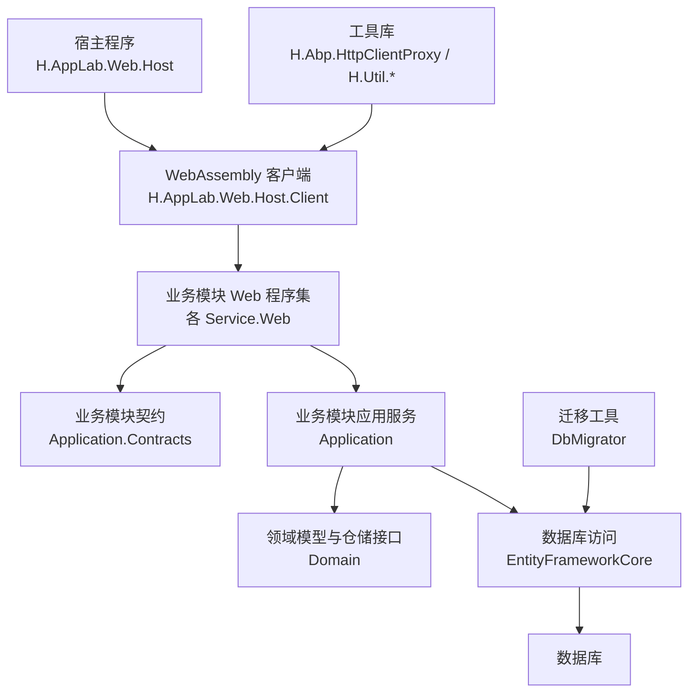
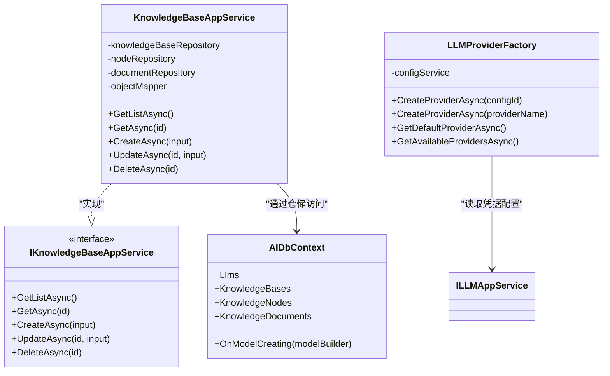
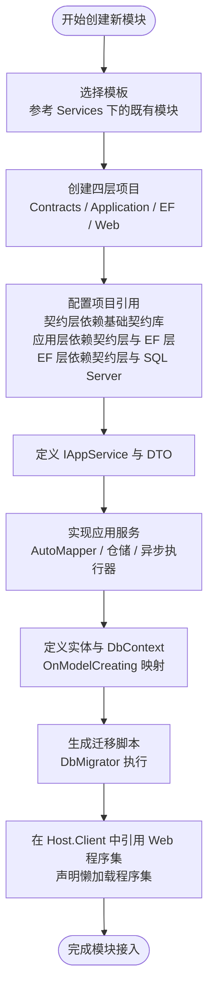
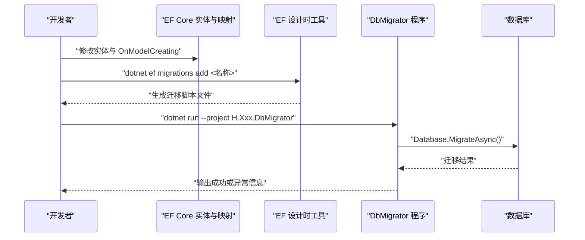
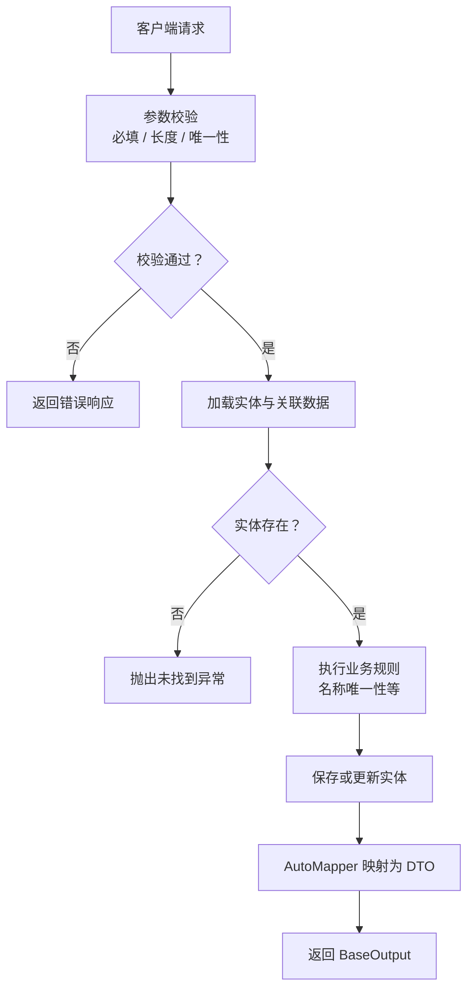
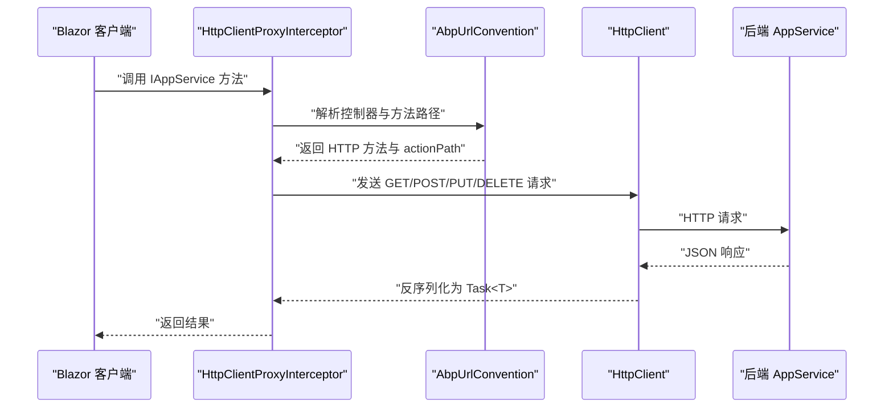
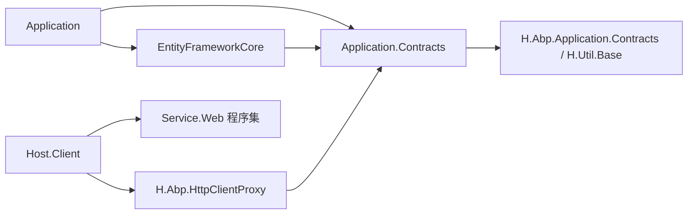

# 业务模块开发流程

<cite>
**本文引用的文件**   
- [README.md](file://README.md)
- [H.AI.Application.csproj](file://src/Services/AI/H.AI.Application/H.AI.Application.csproj)
- [H.AI.Application.Contracts.csproj](file://src/Services/AI/H.AI.Application.Contracts/H.AI.Application.Contracts.csproj)
- [H.AI.EntityFrameworkCore.csproj](file://src/Services/AI/H.AI.EntityFrameworkCore/H.AI.EntityFrameworkCore.csproj)
- [AIApplicationContractsModule.cs](file://src/Services/AI/H.AI.Application.Contracts/AIApplicationContractsModule.cs)
- [KnowledgeBaseAppService.cs](file://src/Services/AI/H.AI.Application/Services/KnowledgeBaseAppService.cs)
- [LLMProviderFactory.cs](file://src/Services/AI/H.AI.Application/Llm/LLMProviderFactory.cs)
- [AIDbContext.cs](file://src/Services/AI/H.AI.EntityFrameworkCore/AIDbContext.cs)
- [H.AppLab.Web.Host.Client.csproj](file://src/Host/H.AppLab.Web.Host/H.AppLab.Web.Host.Client/H.AppLab.Web.Host.Client.csproj)
- [Program.cs（客户端启动）](file://src/Host/H.AppLab.Web.Host/H.AppLab.Web.Host.Client/Program.cs)
- [LazyModuleServices.cs](file://src/Host/H.AppLab.Web.Host/H.AppLab.Web.Host.Client/LazyModuleServices.cs)
- [ServiceCollectionExtensions.cs（HttpClientProxy）](file://src/Utils/H.Abp.HttpClientProxy/ServiceCollectionExtensions.cs)
- [HttpClientProxyInterceptor.cs（HttpClientProxy）](file://src/Utils/H.Abp.HttpClientProxy/HttpClientProxyInterceptor.cs)
- [H.Account.DbMigrator.csproj](file://src/Tools/H.Account.DbMigrator/H.Account.DbMigrator.csproj)
- [Program.cs（数据库迁移工具）](file://src/Tools/H.Account.DbMigrator/Program.cs)
- [MigratorDbContext.cs](file://src/Tools/H.Account.DbMigrator/MigratorDbContext.cs)
- [AccountDbContextFactory.cs](file://src/Tools/H.Account.DbMigrator/AccountDbContextFactory.cs)
</cite>

## 目录
1. [引言](#引言)
2. [项目结构](#项目结构)
3. [核心组件](#核心组件)
4. [架构总览](#架构总览)
5. [详细组件分析](#详细组件分析)
6. [依赖关系分析](#依赖关系分析)
7. [性能与体积优化](#性能与体积优化)
8. [故障排查指南](#故障排查指南)
9. [结论](#结论)
10. [附录：端到端示例清单](#附录端到端示例清单)

## 引言
本文件面向 H.AppLab 平台开发者，系统化说明如何基于现有 ABP 模块化架构，从零创建一个新业务模块。文档覆盖从模板选择、目录搭建、依赖注入配置，到领域实体建模、EF Core 映射、迁移脚本生成，再到 AppService API 开发、DTO 设计、错误处理，以及 Blazor WebAssembly 客户端集成和懒加载注册的全过程。文中以 AI 模块为例，贯穿后端 Application.Contracts / Application / EntityFrameworkCore / Web 各层职责，并结合 Host 客户端的 HttpClient 动态代理机制，给出可复用的最佳实践。

## 项目结构
H.AppLab 采用“宿主 + 共享 UI + 低代码引擎 + 企业级服务 + 系统应用 + 迁移工具 + 工具库”的分层组织方式：
- Host：Blazor Web App 宿主程序，负责服务注册与页面入口，不含业务逻辑。
- Components：跨应用共享的 UI 组件，如抽屉导航。
- LowCode：低代码设计引擎与渲染引擎，包含元数据 Schema、组件基类与默认组件库。
- Services：按限界上下文划分的业务模块，每个模块遵循 Application.Contracts / Application / EntityFrameworkCore / Web 分层。
- System：系统级应用，面向平台运营侧，与企业级服务隔离。
- Tools：每个服务的 DbMigrator 控制台程序，用于创建或更新数据库结构。
- Utils：通用工具库，包括基础契约、HTTP 动态代理、Blazor 工具、ID 生成等。

图示来源
- [README.md:1-73](file://README.md#L1-L73)
- [H.AppLab.Web.Host.Client.csproj:1-147](file://src/Host/H.AppLab.Web.Host/H.AppLab.Web.Host.Client/H.AppLab.Web.Host.Client.csproj#L1-L147)

章节来源
- [README.md:1-73](file://README.md#L1-L73)

## 核心组件
围绕一个新业务模块，需要关注以下核心组件：
- 契约层（Application.Contracts）：定义对外暴露的 IAppService 接口与 DTO，供客户端与服务端共享。
- 应用层（Application）：实现 IAppService，编排业务流程，调用仓储、AutoMapper、外部服务等。
- 领域层（Domain，通常位于 EF Core 项目中）：定义实体、值对象、领域事件及仓储接口。
- 数据访问层（EntityFrameworkCore）：定义 DbContext、实体映射、迁移工厂。
- Web 层（Web）：模块 Web 程序集，负责模块 DI 注册、路由、视图与静态资源。
- 客户端集成（Host.Client）：通过 HttpClient 动态代理将 IAppService 调用转换为 HTTP 请求，并支持懒加载。

章节来源
- [H.AI.Application.csproj:1-18](file://src/Services/AI/H.AI.Application/H.AI.Application.csproj#L1-L18)
- [H.AI.Application.Contracts.csproj:1-13](file://src/Services/AI/H.AI.Application.Contracts/H.AI.Application.Contracts.csproj#L1-L13)
- [H.AI.EntityFrameworkCore.csproj:1-15](file://src/Services/AI/H.AI.EntityFrameworkCore/H.AI.EntityFrameworkCore.csproj#L1-L15)
- [H.AppLab.Web.Host.Client.csproj:1-147](file://src/Host/H.AppLab.Web.Host/H.AppLab.Web.Host.Client/H.AppLab.Web.Host.Client.csproj#L1-L147)

## 架构总览
ABP 模块化架构在本项目中的体现如下：
- 契约层只暴露接口与数据传输对象，不依赖具体实现。
- 应用层依赖契约层与数据访问层，使用 AutoMapper 在实体与 DTO 之间转换。
- 数据访问层使用 AbpDbContext 与 EF Core 进行持久化，并提供迁移能力。
- Web 层提供模块的 ASP.NET Core 配置、路由与中间件。
- 客户端通过 AddHttpClientProxies 扫描 IAppService 接口，自动生成 HttpClient 代理，配合 RemoteServiceOptions 管理远程服务地址。

图示来源
- [KnowledgeBaseAppService.cs:1-133](file://src/Services/AI/H.AI.Application/Services/KnowledgeBaseAppService.cs#L1-L133)
- [AIDbContext.cs:1-68](file://src/Services/AI/H.AI.EntityFrameworkCore/AIDbContext.cs#L1-L68)
- [LLMProviderFactory.cs:1-72](file://src/Services/AI/H.AI.Application/Llm/LLMProviderFactory.cs#L1-L72)

## 详细组件分析

### 新建模块步骤与目录结构
1. 选择模板
   - 参考现有 Services 下各模块（如 Account、Organization、Approval、AI），每个模块均包含 Application.Contracts、Application、EntityFrameworkCore、Web 四个主要子项目。
   - 若需独立前端 WebAssembly 模块，则新增一个 Web 项目并在 Host.Client 中引用。

2. 创建项目结构
   - Application.Contracts：放置 IAppService 接口与 DTO。
   - Application：实现 IAppService，使用 AutoMapper、仓储、异步执行器完成业务编排。
   - EntityFrameworkCore：定义 DbContext、实体、映射、迁移工厂。
   - Web：模块 Web 程序集，注册模块 DI、路由、视图。

3. 依赖注入配置
   - Application.Contracts 引入 H.Abp.Application.Contracts 与 H.Util.Base。
   - Application 引用契约层与 EF Core 层，并引入 Volo.Abp.AutoMapper、Volo.Abp.AspNetCore.Mvc。
   - EntityFrameworkCore 引用契约层，并引入 Volo.Abp.EntityFrameworkCore.SqlServer。
   - Web 层在模块初始化时注册控制器、AutoMapper、仓储与 EF Core。

章节来源
- [H.AI.Application.csproj:1-18](file://src/Services/AI/H.AI.Application/H.AI.Application.csproj#L1-L18)
- [H.AI.Application.Contracts.csproj:1-13](file://src/Services/AI/H.AI.Application.Contracts/H.AI.Application.Contracts.csproj#L1-L13)
- [H.AI.EntityFrameworkCore.csproj:1-15](file://src/Services/AI/H.AI.EntityFrameworkCore/H.AI.EntityFrameworkCore.csproj#L1-L15)

### ABP 模块化架构与各层职责
- Application.Contracts
  - 定义模块对外契约，例如 AI 模块的 IKnowledgeBaseAppService、ILLMAppService、IAiCompletionAppService。
  - 通过 AIApplicationContractsModule 提供程序集定位，便于反射扫描。

- Application
  - 实现 IAppService，编排领域逻辑，调用仓储与外部服务。
  - 使用 AutoMapper 在实体与 DTO 之间映射。
  - 使用 AsyncExecuter 执行复杂查询与聚合统计。
  - 封装外部 LLM Provider 的工厂模式，根据配置动态创建不同厂商的 Provider。

- EntityFrameworkCore
  - 定义 AIDbContext，继承 AbpDbContext，并使用 ConnectionStringName 指定连接字符串。
  - 在 OnModelCreating 中配置表名、主键、字段长度、唯一索引与复合索引。
  - 提供 OwnerTypes 等枚举与扩展类型。

- Web
  - 模块 Web 程序集，负责模块 DI、路由、视图与静态资源。
  - 在 Host.Client 中作为 Blazor WebAssembly 懒加载程序集引用。

图示来源
- [H.AI.Application.csproj:1-18](file://src/Services/AI/H.AI.Application/H.AI.Application.csproj#L1-L18)
- [H.AI.Application.Contracts.csproj:1-13](file://src/Services/AI/H.AI.Application.Contracts/H.AI.Application.Contracts.csproj#L1-L13)
- [H.AI.EntityFrameworkCore.csproj:1-15](file://src/Services/AI/H.AI.EntityFrameworkCore/H.AI.EntityFrameworkCore.csproj#L1-L15)
- [H.AppLab.Web.Host.Client.csproj:1-147](file://src/Host/H.AppLab.Web.Host/H.AppLab.Web.Host.Client/H.AppLab.Web.Host.Client.csproj#L1-L147)

章节来源
- [AIApplicationContractsModule.cs:1-9](file://src/Services/AI/H.AI.Application.Contracts/AIApplicationContractsModule.cs#L1-L9)
- [KnowledgeBaseAppService.cs:1-133](file://src/Services/AI/H.AI.Application/Services/KnowledgeBaseAppService.cs#L1-L133)
- [AIDbContext.cs:1-68](file://src/Services/AI/H.AI.EntityFrameworkCore/AIDbContext.cs#L1-L68)

### 数据库设计与迁移流程
- 实体类定义
  - 在 EntityFrameworkCore 项目中定义实体类，如 LLMEntity、KnowledgeBaseEntity、KnowledgeNodeEntity、KnowledgeDocumentEntity。
  - 实体应包含 Id、常用字段、必要校验属性。

- 关系映射
  - 在 AIDbContext.OnModelCreating 中配置表名、主键、字段长度、唯一索引与复合索引。
  - 为关联查询与统计建立合适的索引，例如 OwnerType、KnowledgeBaseId、ParentId 的复合索引。

- 迁移脚本生成
  - 使用对应服务的 DbMigrator 项目，配置 appsettings.json 中的连接字符串。
  - 运行 dotnet ef migrations add xxx 生成迁移文件，或使用 Program.Main 直接执行迁移。
  - MigratorDbContext 用于在 DbMigrator 中显式配置模型，避免依赖 ABP 模块系统初始化。

图示来源
- [AIDbContext.cs:1-68](file://src/Services/AI/H.AI.EntityFrameworkCore/AIDbContext.cs#L1-L68)
- [H.Account.DbMigrator.csproj:1-26](file://src/Tools/H.Account.DbMigrator/H.Account.DbMigrator.csproj#L1-L26)
- [Program.cs（数据库迁移工具）:1-59](file://src/Tools/H.Account.DbMigrator/Program.cs#L1-L59)
- [MigratorDbContext.cs:1-22](file://src/Tools/H.Account.DbMigrator/MigratorDbContext.cs#L1-L22)
- [AccountDbContextFactory.cs:1-28](file://src/Tools/H.Account.DbMigrator/AccountDbContextFactory.cs#L1-L28)

章节来源
- [AIDbContext.cs:1-68](file://src/Services/AI/H.AI.EntityFrameworkCore/AIDbContext.cs#L1-L68)
- [H.Account.DbMigrator.csproj:1-26](file://src/Tools/H.Account.DbMigrator/H.Account.DbMigrator.csproj#L1-L26)
- [Program.cs（数据库迁移工具）:1-59](file://src/Tools/H.Account.DbMigrator/Program.cs#L1-L59)
- [MigratorDbContext.cs:1-22](file://src/Tools/H.Account.DbMigrator/MigratorDbContext.cs#L1-L22)
- [AccountDbContextFactory.cs:1-28](file://src/Tools/H.Account.DbMigrator/AccountDbContextFactory.cs#L1-L28)

### API 接口开发与错误处理
- AppService 编写
  - 实现 IAppService，使用 IRepository<T, TKey> 访问数据，使用 AutoMapper 映射 DTO。
  - 对缺失实体抛出 InvalidOperationException，并在集合查询中使用 AsyncExecuter 提高性能。
  - 对业务约束（如名称唯一性）在执行插入或更新前进行检查。

- DTO 设计
  - 在 Application.Contracts 中定义输入 DTO（如 CreateXxxDto、UpdateXxxDto）与输出 DTO（如 XxxDto）。
  - DTO 应包含必要字段、可选字段与展示字段（如文档数量）。

- 验证规则
  - 在实体与 DTO 上添加必要校验属性（长度、必填、唯一索引）。
  - 在应用服务中进行二次校验，确保业务一致性。

- 错误处理
  - 对不存在实体抛出自定义异常，便于上层统一处理。
  - 对批量删除等复杂操作，先查询关联数据再逐条删除，保证数据一致性。

图示来源
- [KnowledgeBaseAppService.cs:1-133](file://src/Services/AI/H.AI.Application/Services/KnowledgeBaseAppService.cs#L1-L133)
- [AIDbContext.cs:1-68](file://src/Services/AI/H.AI.EntityFrameworkCore/AIDbContext.cs#L1-L68)

章节来源
- [KnowledgeBaseAppService.cs:1-133](file://src/Services/AI/H.AI.Application/Services/KnowledgeBaseAppService.cs#L1-L133)

### 前端集成指南（Blazor WebAssembly）
- 代理生成
  - 通过 AddRemoteServices 加载 RemoteServices 配置，AddHttpClientProxies 扫描 IAppService 接口并注册代理。
  - HttpClientProxyInterceptor 基于 DispatchProxy 拦截方法调用，按 ABP 约定生成 URL，简单参数放入查询字符串，复杂参数放入请求体。

- 路由配置
  - 在 Host.Client 中引用各模块 Web 程序集，并在 csproj 中声明 BlazorWebAssemblyLazyLoad，使模块按需下载。
  - 在 Routes.razor 的 OnNavigateAsync 中触发模块程序集加载。

- 组件集成
  - 模块 Web 程序集提供页面与组件，宿主仅需注册路由与菜单项。
  - LazyModuleRegistry 与 CompositeServiceProvider 组合容器，支持懒加载后服务注册与回退解析。

图示来源
- [ServiceCollectionExtensions.cs（HttpClientProxy）:1-63](file://src/Utils/H.Abp.HttpClientProxy/ServiceCollectionExtensions.cs#L1-L63)
- [HttpClientProxyInterceptor.cs（HttpClientProxy）:1-234](file://src/Utils/H.Abp.HttpClientProxy/HttpClientProxyInterceptor.cs#L1-L234)
- [H.AppLab.Web.Host.Client.csproj:1-147](file://src/Host/H.AppLab.Web.Host/H.AppLab.Web.Host.Client/H.AppLab.Web.Host.Client.csproj#L1-L147)
- [Program.cs（客户端启动）:1-13](file://src/Host/H.AppLab.Web.Host/H.AppLab.Web.Host.Client/Program.cs#L1-L13)
- [LazyModuleServices.cs:1-141](file://src/Host/H.AppLab.Web.Host/H.AppLab.Web.Host.Client/LazyModuleServices.cs#L1-L141)

章节来源
- [ServiceCollectionExtensions.cs（HttpClientProxy）:1-63](file://src/Utils/H.Abp.HttpClientProxy/ServiceCollectionExtensions.cs#L1-L63)
- [HttpClientProxyInterceptor.cs（HttpClientProxy）:1-234](file://src/Utils/H.Abp.HttpClientProxy/HttpClientProxyInterceptor.cs#L1-L234)
- [H.AppLab.Web.Host.Client.csproj:1-147](file://src/Host/H.AppLab.Web.Host/H.AppLab.Web.Host.Client/H.AppLab.Web.Host.Client.csproj#L1-L147)
- [Program.cs（客户端启动）:1-13](file://src/Host/H.AppLab.Web.Host/H.AppLab.Web.Host.Client/Program.cs#L1-L13)
- [LazyModuleServices.cs:1-141](file://src/Host/H.AppLab.Web.Host/H.AppLab.Web.Host.Client/LazyModuleServices.cs#L1-L141)

### 端到端示例清单（以 AI 模块为例）
- 契约层
  - 定义 IKnowledgeBaseAppService、ILLMAppService、IAiCompletionAppService。
  - 定义 DTO：CreateKnowledgeBaseDto、UpdateKnowledgeBaseDto、KnowledgeBaseDto、CreateLLMDto、LLMDto、UpdateLLMDto 等。

- 应用层
  - KnowledgeBaseAppService 实现知识库 CRUD，包含名称唯一性校验、文档数量统计、级联删除节点与文档内容。
  - LLMProviderFactory 根据配置获取 Provider 名称与密钥，动态创建 BaiLianLLMProvider 或 DeepSeekLLMProvider。

- 数据访问层
  - AIDbContext 定义 DbSet 与 OnModelCreating，配置表名、字段长度、唯一索引与复合索引。
  - 实体：LLMEntity、KnowledgeBaseEntity、KnowledgeNodeEntity、KnowledgeDocumentEntity。

- 迁移与运行
  - 使用 H.AI.DbMigrator 或 H.Account.DbMigrator 的范式配置连接字符串与迁移程序集。
  - 执行迁移命令并检查数据库表结构。

- 前端集成
  - 在 Host.Client 中引用 H.AI.Web 与 H.AI.Application.Contracts，并声明 BlazorWebAssemblyLazyLoad。
  - 通过 AddHttpClientProxies 自动代理 IAppService 方法调用。

章节来源
- [KnowledgeBaseAppService.cs:1-133](file://src/Services/AI/H.AI.Application/Services/KnowledgeBaseAppService.cs#L1-L133)
- [LLMProviderFactory.cs:1-72](file://src/Services/AI/H.AI.Application/Llm/LLMProviderFactory.cs#L1-L72)
- [AIDbContext.cs:1-68](file://src/Services/AI/H.AI.EntityFrameworkCore/AIDbContext.cs#L1-L68)
- [H.AppLab.Web.Host.Client.csproj:1-147](file://src/Host/H.AppLab.Web.Host/H.AppLab.Web.Host.Client/H.AppLab.Web.Host.Client.csproj#L1-L147)

## 依赖关系分析
- 项目引用关系
  - Application.Contracts 引用 H.Abp.Application.Contracts 与 H.Util.Base。
  - Application 引用 Application.Contracts 与 EntityFrameworkCore，并引入 Volo.Abp.AutoMapper 与 Volo.Abp.AspNetCore.Mvc。
  - EntityFrameworkCore 引用 Application.Contracts，并引入 Volo.Abp.EntityFrameworkCore.SqlServer。
  - Host.Client 引用所有 Service.Web 与相关 Contract 程序集，并通过 BlazorWebAssemblyLazyLoad 声明懒加载。

- 运行时依赖
  - HttpClientProxy 依赖 IConfiguration 与 Microsoft.Extensions.Http，通过 AddRemoteServices 加载 RemoteServices 配置。
  - 客户端启动程序使用 LazyModuleRegistry 与 CompositeServiceProvider 实现懒加载模块的服务注册与解析。

图示来源
- [H.AI.Application.csproj:1-18](file://src/Services/AI/H.AI.Application/H.AI.Application.csproj#L1-L18)
- [H.AI.Application.Contracts.csproj:1-13](file://src/Services/AI/H.AI.Application.Contracts/H.AI.Application.Contracts.csproj#L1-L13)
- [H.AI.EntityFrameworkCore.csproj:1-15](file://src/Services/AI/H.AI.EntityFrameworkCore/H.AI.EntityFrameworkCore.csproj#L1-L15)
- [H.AppLab.Web.Host.Client.csproj:1-147](file://src/Host/H.AppLab.Web.Host/H.AppLab.Web.Host.Client/H.AppLab.Web.Host.Client.csproj#L1-L147)
- [ServiceCollectionExtensions.cs（HttpClientProxy）:1-63](file://src/Utils/H.Abp.HttpClientProxy/ServiceCollectionExtensions.cs#L1-L63)

章节来源
- [H.AI.Application.csproj:1-18](file://src/Services/AI/H.AI.Application/H.AI.Application.csproj#L1-L18)
- [H.AI.Application.Contracts.csproj:1-13](file://src/Services/AI/H.AI.Application.Contracts/H.AI.Application.Contracts.csproj#L1-L13)
- [H.AI.EntityFrameworkCore.csproj:1-15](file://src/Services/AI/H.AI.EntityFrameworkCore/H.AI.EntityFrameworkCore.csproj#L1-L15)
- [H.AppLab.Web.Host.Client.csproj:1-147](file://src/Host/H.AppLab.Web.Host/H.AppLab.Web.Host.Client/H.AppLab.Web.Host.Client.csproj#L1-L147)
- [ServiceCollectionExtensions.cs（HttpClientProxy）:1-63](file://src/Utils/H.Abp.HttpClientProxy/ServiceCollectionExtensions.cs#L1-L63)

## 性能与体积优化
- WebAssembly 懒加载
  - 在 Host.Client 的 csproj 中声明 BlazorWebAssemblyLazyLoad，将各模块 Web 与 Contract 程序集延迟下载，减少首屏体积。
  - 在 Routes.razor 的 OnNavigateAsync 中触发程序集加载，提升启动速度。

- AOT 与裁剪
  - Release 模式启用 RunAOTCompilation，显著减少 WASM 启动时间。
  - 使用 TrimmerRootAssembly 保留仅被字符串反射引用的类型，避免裁剪导致运行期错误。

- 自定义组合式 DI
  - LazyModuleRegistry 与 CompositeServiceProvider 提供根容器与模块子容器的组合解析，支持懒加载后追加服务注册。

章节来源
- [H.AppLab.Web.Host.Client.csproj:1-147](file://src/Host/H.AppLab.Web.Host/H.AppLab.Web.Host.Client/H.AppLab.Web.Host.Client.csproj#L1-L147)
- [LazyModuleServices.cs:1-141](file://src/Host/H.AppLab.Web.Host/H.AppLab.Web.Host.Client/LazyModuleServices.cs#L1-L141)

## 故障排查指南
- 迁移失败
  - 检查 appsettings.json 中连接字符串是否正确。
  - 确认 MigratorDbContext 是否已正确配置模型，尤其是 Identity 模型的 ConfigureIdentity。
  - 查看 Program.Main 的输出日志，捕获异常信息与堆栈。

- 客户端代理无法调用
  - 检查 RemoteServices 配置是否包含目标服务的 BaseUrl。
  - 确认 AddHttpClientProxies 已扫描到目标 IAppService 接口。
  - 检查 HttpClientProxyInterceptor 生成的 URL 是否符合后端路由约定。

- 懒加载服务未解析
  - 确认 LazyModuleRegistry.RootProvider 已初始化。
  - 检查模块是否在导航时被加载，且 RegisterModule 已调用。
  - 确认 CompositeServiceProvider 的 GetService 能回退到模块子容器。

章节来源
- [Program.cs（数据库迁移工具）:1-59](file://src/Tools/H.Account.DbMigrator/Program.cs#L1-L59)
- [MigratorDbContext.cs:1-22](file://src/Tools/H.Account.DbMigrator/MigratorDbContext.cs#L1-L22)
- [ServiceCollectionExtensions.cs（HttpClientProxy）:1-63](file://src/Utils/H.Abp.HttpClientProxy/ServiceCollectionExtensions.cs#L1-L63)
- [HttpClientProxyInterceptor.cs（HttpClientProxy）:1-234](file://src/Utils/H.Abp.HttpClientProxy/HttpClientProxyInterceptor.cs#L1-L234)
- [LazyModuleServices.cs:1-141](file://src/Host/H.AppLab.Web.Host/H.AppLab.Web.Host.Client/LazyModuleServices.cs#L1-L141)

## 结论
H.AppLab 平台通过 ABP 模块化架构与自研 HttpClient 动态代理，实现了前后端解耦、按需加载与统一的服务调用体验。开发者在新增业务模块时，应严格遵循 Application.Contracts / Application / EntityFrameworkCore / Web 的分层职责，完善实体映射与迁移脚本，规范 DTO 与错误处理，并在 Host.Client 中完成懒加载与代理注册。AI 模块展示了完整的端到端实现，可作为新模块开发的参考样板。

## 附录：端到端示例清单
- 契约层
  - IKnowledgeBaseAppService、ILLMAppService、IAiCompletionAppService
  - DTO：CreateKnowledgeBaseDto、UpdateKnowledgeBaseDto、KnowledgeBaseDto、CreateLLMDto、LLMDto、UpdateLLMDto

- 应用层
  - KnowledgeBaseAppService：CRUD、唯一性校验、文档数量统计、级联删除
  - LLMProviderFactory：凭据读取、Provider 动态创建、可用 Provider 列表

- 数据访问层
  - AIDbContext：DbSet 与 OnModelCreating
  - 实体：LLMEntity、KnowledgeBaseEntity、KnowledgeNodeEntity、KnowledgeDocumentEntity

- 迁移与运行
  - H.AI.DbMigrator 或 H.Account.DbMigrator：连接字符串、迁移程序集、执行迁移

- 前端集成
  - Host.Client：引用模块 Web 与 Contract，声明 BlazorWebAssemblyLazyLoad
  - HttpClientProxy：AddRemoteServices、AddHttpClientProxies、DispatchProxy 代理

章节来源
- [KnowledgeBaseAppService.cs:1-133](file://src/Services/AI/H.AI.Application/Services/KnowledgeBaseAppService.cs#L1-L133)
- [LLMProviderFactory.cs:1-72](file://src/Services/AI/H.AI.Application/Llm/LLMProviderFactory.cs#L1-L72)
- [AIDbContext.cs:1-68](file://src/Services/AI/H.AI.EntityFrameworkCore/AIDbContext.cs#L1-L68)
- [H.AppLab.Web.Host.Client.csproj:1-147](file://src/Host/H.AppLab.Web.Host/H.AppLab.Web.Host.Client/H.AppLab.Web.Host.Client.csproj#L1-L147)
- [ServiceCollectionExtensions.cs（HttpClientProxy）:1-63](file://src/Utils/H.Abp.HttpClientProxy/ServiceCollectionExtensions.cs#L1-L63)