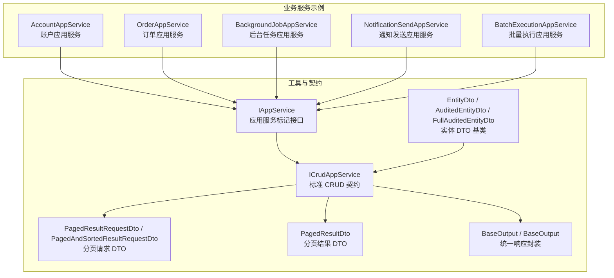
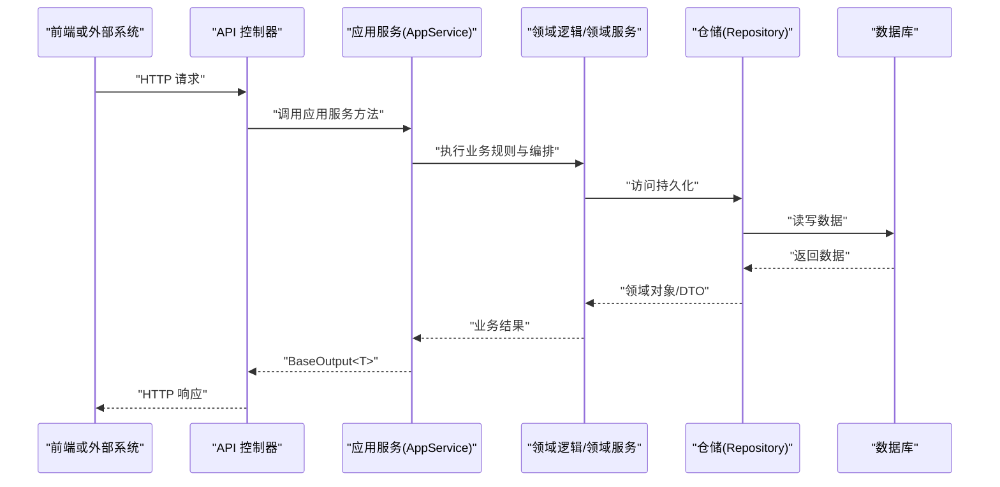
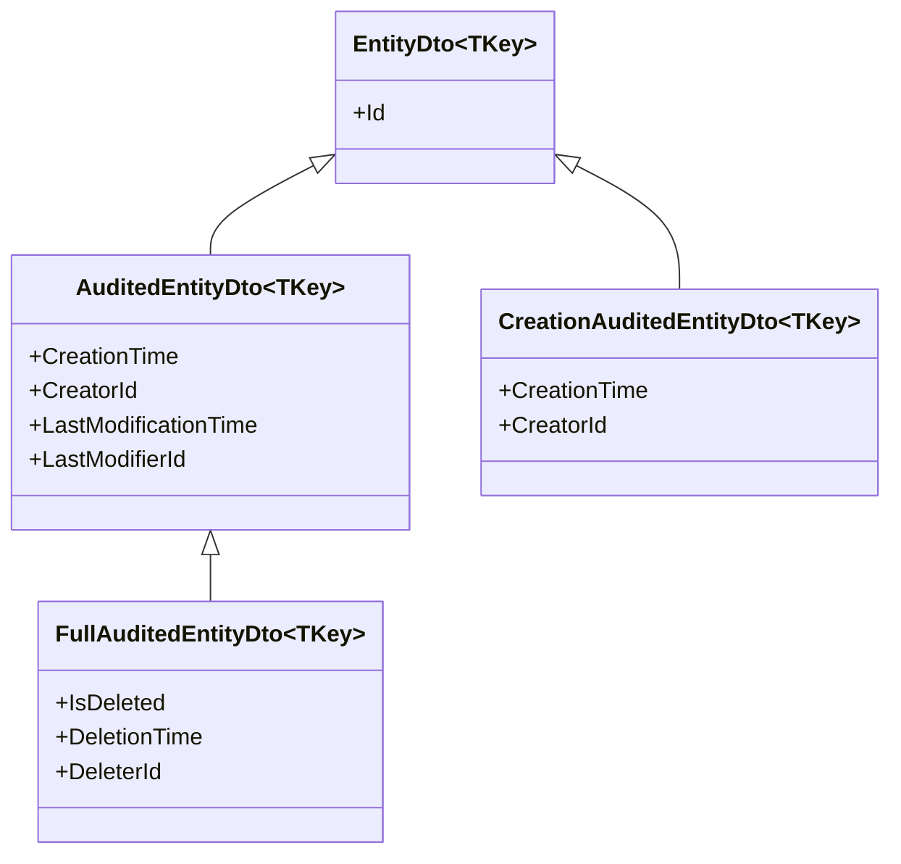
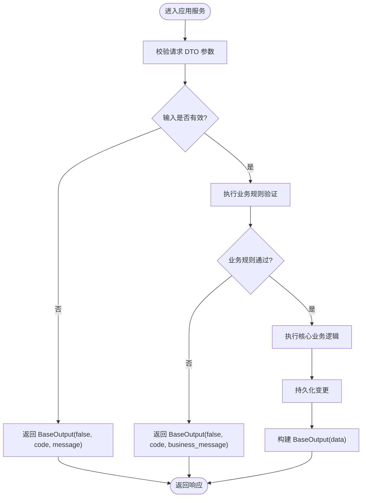
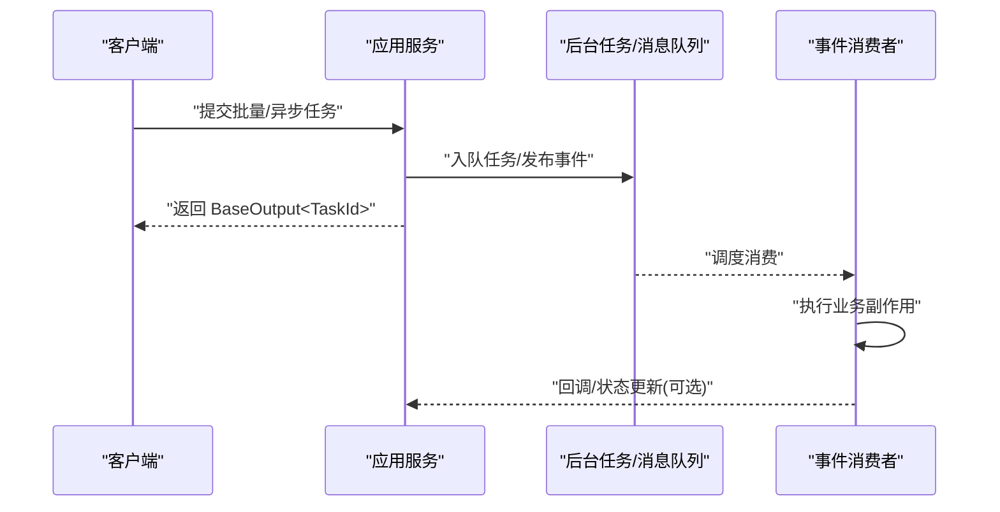
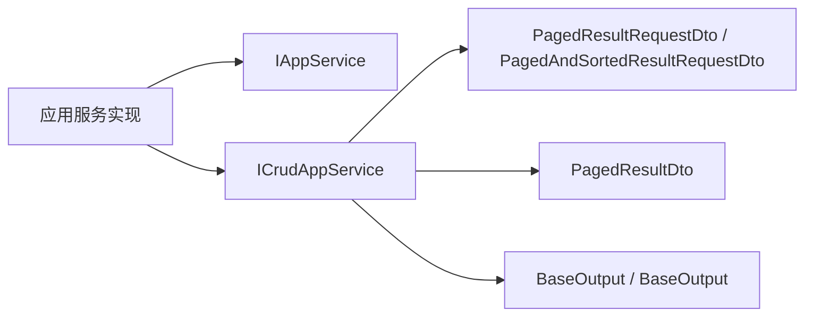

# 应用服务开发

<cite>
**本文引用的文件**
- [IAppService.cs](file://src/Utils/H.Abp.Application.Contracts/IAppService.cs)
- [ICrudAppService.cs](file://src/Utils/H.Abp.Application.Contracts/ICrudAppService.cs)
- [PagedResultRequestDto.cs](file://src/Utils/H.Abp.Application.Contracts/PagedResultRequestDto.cs)
- [PagedAndSortedResultRequestDto.cs](file://src/Utils/H.Abp.Application.Contracts/PagedAndSortedResultRequestDto.cs)
- [PagedResultDto.cs](file://src/Utils/H.Abp.Application.Contracts/PagedResultDto.cs)
- [EntityDto.cs](file://src/Utils/H.Abp.Application.Contracts/EntityDto.cs)
- [AuditedEntityDto.cs](file://src/Utils/H.Abp.Application.Contracts/AuditedEntityDto.cs)
- [CreationAuditedEntityDto.cs](file://src/Utils/H.Abp.Application.Contracts/CreationAuditedEntityDto.cs)
- [FullAuditedEntityDto.cs](file://src/Utils/H.Abp.Application.Contracts/FullAuditedEntityDto.cs)
- [BaseOutput.cs](file://src/Utils/H.Util.Base/BaseOutput.cs)
</cite>

## 目录
1. [引言](#引言)
2. [项目结构](#项目结构)
3. [核心组件](#核心组件)
4. [架构总览](#架构总览)
5. [详细组件分析](#详细组件分析)
6. [依赖关系分析](#依赖关系分析)
7. [性能与可观测性](#性能与可观测性)
8. [故障排查指南](#故障排查指南)
9. [结论](#结论)
10. [附录：规范清单](#附录规范清单)

## 引言
本文件面向 H.AppLab 平台的后端应用服务开发者，系统化说明 AppService 的编写规范、CRUD 方法实现约定、DTO 设计模式、验证机制、权限控制集成、复杂业务场景实践以及异常处理、日志与性能监控的最佳实践。文档以平台提供的通用契约类型为基础，给出可直接落地的指导。

## 项目结构
H.AppLab 采用领域服务分层与多服务拆分组织方式。与“应用服务开发”直接相关的代码集中在以下位置：
- 应用契约与 DTO 基类：位于 Utils 层的 H.Abp.Application.Contracts 与 H.Util.Base
- 各业务域的服务实现：位于 Services 层下的具体应用模块（如 Account、Order、BackgroundTask、Notification、Testing 等）

图表来源
- [IAppService.cs:1-8](file://src/Utils/H.Abp.Application.Contracts/IAppService.cs#L1-L8)
- [ICrudAppService.cs:1-15](file://src/Utils/H.Abp.Application.Contracts/ICrudAppService.cs#L1-L15)
- [PagedResultRequestDto.cs:1-11](file://src/Utils/H.Abp.Application.Contracts/PagedResultRequestDto.cs#L1-L11)
- [PagedAndSortedResultRequestDto.cs:1-9](file://src/Utils/H.Abp.Application.Contracts/PagedAndSortedResultRequestDto.cs#L1-L9)
- [PagedResultDto.cs:1-19](file://src/Utils/H.Abp.Application.Contracts/PagedResultDto.cs#L1-L19)
- [EntityDto.cs:1-6](file://src/Utils/H.Abp.Application.Contracts/EntityDto.cs#L1-L6)
- [AuditedEntityDto.cs:1-9](file://src/Utils/H.Abp.Application.Contracts/AuditedEntityDto.cs#L1-L9)
- [FullAuditedEntityDto.cs:1-11](file://src/Utils/H.Abp.Application.Contracts/FullAuditedEntityDto.cs#L1-L11)
- [BaseOutput.cs:1-52](file://src/Utils/H.Util.Base/BaseOutput.cs#L1-L52)

章节来源
- [IAppService.cs:1-8](file://src/Utils/H.Abp.Application.Contracts/IAppService.cs#L1-L8)
- [ICrudAppService.cs:1-15](file://src/Utils/H.Abp.Application.Contracts/ICrudAppService.cs#L1-L15)
- [PagedResultRequestDto.cs:1-11](file://src/Utils/H.Abp.Application.Contracts/PagedResultRequestDto.cs#L1-L11)
- [PagedAndSortedResultRequestDto.cs:1-9](file://src/Utils/H.Abp.Application.Contracts/PagedAndSortedResultRequestDto.cs#L1-L9)
- [PagedResultDto.cs:1-19](file://src/Utils/H.Abp.Application.Contracts/PagedResultDto.cs#L1-L19)
- [EntityDto.cs:1-6](file://src/Utils/H.Abp.Application.Contracts/EntityDto.cs#L1-L6)
- [AuditedEntityDto.cs:1-9](file://src/Utils/H.Abp.Application.Contracts/AuditedEntityDto.cs#L1-L9)
- [CreationAuditedEntityDto.cs:1-7](file://src/Utils/H.Abp.Application.Contracts/CreationAuditedEntityDto.cs#L1-L7)
- [FullAuditedEntityDto.cs:1-11](file://src/Utils/H.Abp.Application.Contracts/FullAuditedEntityDto.cs#L1-L11)
- [BaseOutput.cs:1-52](file://src/Utils/H.Util.Base/BaseOutput.cs#L1-L52)

## 核心组件
本节聚焦于 AppService 契约与 DTO 体系，明确各类职责边界与使用约定。

- IAppService：作为所有可通过 HTTP 代理远程调用的应用服务的标记接口，用于识别并生成客户端代理。
- ICrudAppService：定义标准 CRUD 操作契约，包括按 ID 查询、列表分页查询、创建、更新、删除；返回统一封装的 BaseOutput<T>。
- 分页请求 DTO：
  - PagedResultRequestDto：包含 SkipCount、MaxResultCount，提供默认分页大小。
  - PagedAndSortedResultRequestDto：在分页基础上增加 Sorting 字段，支持排序。
- 分页结果 DTO：
  - PagedResultDto<T>：包含 TotalCount 与 Items，用于承载分页数据。
- 实体 DTO 基类：
  - EntityDto<TKey>：统一 Id 标识。
  - AuditedEntityDto<TKey>：扩展 CreationTime、CreatorId、LastModificationTime、LastModifierId。
  - CreationAuditedEntityDto<TKey>：仅保留创建审计信息。
  - FullAuditedEntityDto<TKey>：在 AuditedEntityDto 基础上增加 IsDeleted、DeletionTime、DeleterId，表示软删除审计。
- 统一响应封装：
  - BaseOutput：包含 Success、Code、Message。
  - BaseOutput<T>：在 BaseOutput 基础上增加 Data 泛型属性。

章节来源
- [IAppService.cs:1-8](file://src/Utils/H.Abp.Application.Contracts/IAppService.cs#L1-L8)
- [ICrudAppService.cs:1-15](file://src/Utils/H.Abp.Application.Contracts/ICrudAppService.cs#L1-L15)
- [PagedResultRequestDto.cs:1-11](file://src/Utils/H.Abp.Application.Contracts/PagedResultRequestDto.cs#L1-L11)
- [PagedAndSortedResultRequestDto.cs:1-9](file://src/Utils/H.Abp.Application.Contracts/PagedAndSortedResultRequestDto.cs#L1-L9)
- [PagedResultDto.cs:1-19](file://src/Utils/H.Abp.Application.Contracts/PagedResultDto.cs#L1-L19)
- [EntityDto.cs:1-6](file://src/Utils/H.Abp.Application.Contracts/EntityDto.cs#L1-L6)
- [AuditedEntityDto.cs:1-9](file://src/Utils/H.Abp.Application.Contracts/AuditedEntityDto.cs#L1-L9)
- [CreationAuditedEntityDto.cs:1-7](file://src/Utils/H.Abp.Application.Contracts/CreationAuditedEntityDto.cs#L1-L7)
- [FullAuditedEntityDto.cs:1-11](file://src/Utils/H.Abp.Application.Contracts/FullAuditedEntityDto.cs#L1-L11)
- [BaseOutput.cs:1-52](file://src/Utils/H.Util.Base/BaseOutput.cs#L1-L52)

## 架构总览
下图展示一个典型的请求到响应的调用链，体现控制器、应用服务、领域逻辑、仓储与数据库之间的协作关系。该图是概念性示意，便于理解整体流程。

[此图为概念流程示意，不直接映射具体源文件]

## 详细组件分析

### AppService 编写规范
- 服务定位
  - 每个应用服务应实现 IAppService 标记接口，以便被框架发现并生成 HTTP 客户端代理。
  - 对于标准 CRUD 能力，优先实现 ICrudAppService<TEntityDto, TKey, TGetListInput, TCreateInput, TUpdateInput>，保持与 ABP 一致的签名与语义。
- 输入输出约定
  - 所有对外暴露的方法必须返回 BaseOutput 或 BaseOutput<T>，保证统一的 Success/Code/Message/Data 语义。
  - 列表查询参数使用 PagedResultRequestDto 或其子类 PagedAndSortedResultRequestDto。
  - 列表结果使用 PagedResultDto<T>，避免暴露内部实体结构。
- 方法命名与职责
  - GetAsync(id)：按主键获取单条记录。
  - GetListAsync(input)：分页查询，input 继承自 PagedResultRequestDto。
  - CreateAsync(input)：创建资源。
  - UpdateAsync(id, input)：更新资源。
  - DeleteAsync(id)：删除资源（建议结合软删除策略）。
- 错误与状态码
  - 成功时返回 BaseOutput<T>(data)，Success=true、Code=0。
  - 失败时返回 BaseOutput(code, message)，Success=false，并根据错误类型设置 Code。

章节来源
- [IAppService.cs:1-8](file://src/Utils/H.Abp.Application.Contracts/IAppService.cs#L1-L8)
- [ICrudAppService.cs:1-15](file://src/Utils/H.Abp.Application.Contracts/ICrudAppService.cs#L1-L15)
- [BaseOutput.cs:1-52](file://src/Utils/H.Util.Base/BaseOutput.cs#L1-L52)

### DTO 设计模式
- 请求 DTO
  - 分页请求：使用 PagedResultRequestDto，必要时组合自定义过滤条件；如需排序，使用 PagedAndSortedResultRequestDto。
  - 创建/更新 DTO：从对应的实体 DTO 派生或单独定义，遵循最小可见原则，避免暴露敏感字段。
- 响应 DTO
  - 使用 EntityDto<TKey> 及其审计变体作为基础，确保 Id 一致性与审计字段对齐。
  - 分页结果统一使用 PagedResultDto<T>，包含 TotalCount 和 Items。
- 审计与软删除
  - 需要审计信息的实体 DTO 使用 AuditedEntityDto<TKey> 或 CreationAuditedEntityDto<TKey>。
  - 需要软删除的实体 DTO 使用 FullAuditedEntityDto<TKey>，配合仓储层进行 IsDeleted 过滤。

图表来源
- [EntityDto.cs:1-6](file://src/Utils/H.Abp.Application.Contracts/EntityDto.cs#L1-L6)
- [AuditedEntityDto.cs:1-9](file://src/Utils/H.Abp.Application.Contracts/AuditedEntityDto.cs#L1-L9)
- [CreationAuditedEntityDto.cs:1-7](file://src/Utils/H.Abp.Application.Contracts/CreationAuditedEntityDto.cs#L1-L7)
- [FullAuditedEntityDto.cs:1-11](file://src/Utils/H.Abp.Application.Contracts/FullAuditedEntityDto.cs#L1-L11)

章节来源
- [PagedResultRequestDto.cs:1-11](file://src/Utils/H.Abp.Application.Contracts/PagedResultRequestDto.cs#L1-L11)
- [PagedAndSortedResultRequestDto.cs:1-9](file://src/Utils/H.Abp.Application.Contracts/PagedAndSortedResultRequestDto.cs#L1-L9)
- [PagedResultDto.cs:1-19](file://src/Utils/H.Abp.Application.Contracts/PagedResultDto.cs#L1-L19)
- [EntityDto.cs:1-6](file://src/Utils/H.Abp.Application.Contracts/EntityDto.cs#L1-L6)
- [AuditedEntityDto.cs:1-9](file://src/Utils/H.Abp.Application.Contracts/AuditedEntityDto.cs#L1-L9)
- [CreationAuditedEntityDto.cs:1-7](file://src/Utils/H.Abp.Application.Contracts/CreationAuditedEntityDto.cs#L1-L7)
- [FullAuditedEntityDto.cs:1-11](file://src/Utils/H.Abp.Application.Contracts/FullAuditedEntityDto.cs#L1-L11)

### 验证机制实现
- 输入验证
  - 在应用服务入口处对请求 DTO 进行校验，优先使用结构化校验规则；对分页参数做范围限制（例如 MaxResultCount 上限）。
- 业务规则验证
  - 在领域层或服务编排中检查业务约束，例如唯一性、状态机转换合法性、外键一致性等。
- 错误信息处理
  - 将校验失败与业务异常转换为 BaseOutput(code, message) 返回，保证前端能统一解析 Success/Code/Message。
  - 为常见错误建立稳定 Code 枚举，便于前端分类提示。

[此图为概念流程示意，不直接映射具体源文件]

### 权限控制集成
- 使用 Authorize 特性
  - 在应用服务或具体方法上添加权限特性，声明所需权限字符串或角色。
- 权限检查
  - 由框架在请求入口进行鉴权，未授权时返回统一的未授权响应。
- 角色管理
  - 结合组织与用户模型，在服务内根据当前用户上下文进行细粒度权限判断。

章节来源
- [IAppService.cs:1-8](file://src/Utils/H.Abp.Application.Contracts/IAppService.cs#L1-L8)

### 复杂业务场景实践

#### 批量操作
- 适用场景
  - 批量创建、批量更新、批量删除、批量状态流转。
- 实现要点
  - 接收批量 DTO 列表，逐条校验并累积错误；事务包裹整批写入，失败回滚。
  - 返回聚合结果：成功数、失败数及失败明细，封装在 BaseOutput<T> 中。

#### 异步处理
- 适用场景
  - 耗时任务、第三方接口调用、消息队列生产。
- 实现要点
  - 使用异步方法（async/await），避免阻塞线程；对 I/O 密集任务合理设置超时与重试。
  - 将长时间任务交给后台作业服务，应用服务仅负责提交任务并返回任务 ID。

#### 事件触发
- 适用场景
  - 领域事件发布、通知投递、审计日志记录。
- 实现要点
  - 在关键业务节点发布领域事件；消费者订阅并执行副作用操作（如发送通知、统计指标）。

[此图为概念流程示意，不直接映射具体源文件]

## 依赖关系分析
应用服务依赖契约层定义的 DTO 与响应封装，并通过 ICrudAppService 与分页类型保持一致的交互契约。

图表来源
- [IAppService.cs:1-8](file://src/Utils/H.Abp.Application.Contracts/IAppService.cs#L1-L8)
- [ICrudAppService.cs:1-15](file://src/Utils/H.Abp.Application.Contracts/ICrudAppService.cs#L1-L15)
- [PagedResultRequestDto.cs:1-11](file://src/Utils/H.Abp.Application.Contracts/PagedResultRequestDto.cs#L1-L11)
- [PagedAndSortedResultRequestDto.cs:1-9](file://src/Utils/H.Abp.Application.Contracts/PagedAndSortedResultRequestDto.cs#L1-L9)
- [PagedResultDto.cs:1-19](file://src/Utils/H.Abp.Application.Contracts/PagedResultDto.cs#L1-L19)
- [BaseOutput.cs:1-52](file://src/Utils/H.Util.Base/BaseOutput.cs#L1-L52)

章节来源
- [ICrudAppService.cs:1-15](file://src/Utils/H.Abp.Application.Contracts/ICrudAppService.cs#L1-L15)
- [PagedResultRequestDto.cs:1-11](file://src/Utils/H.Abp.Application.Contracts/PagedResultRequestDto.cs#L1-L11)
- [PagedAndSortedResultRequestDto.cs:1-9](file://src/Utils/H.Abp.Application.Contracts/PagedAndSortedResultRequestDto.cs#L1-L9)
- [PagedResultDto.cs:1-19](file://src/Utils/H.Abp.Application.Contracts/PagedResultDto.cs#L1-L19)
- [BaseOutput.cs:1-52](file://src/Utils/H.Util.Base/BaseOutput.cs#L1-L52)

## 性能与可观测性
- 分页与排序
  - 严格使用 PagedResultRequestDto/Sorting，避免全表扫描；在仓储层实现高效分页 SQL。
- 异步与并发
  - 对 I/O 密集型操作使用异步；合理配置连接池与超时。
- 缓存与幂等
  - 读多写少场景引入缓存；对外部调用与批量操作实现幂等键，避免重复执行。
- 日志与指标
  - 在应用服务入口与关键分支记录结构化日志；对慢查询与外部调用打点埋点。
- 监控告警
  - 基于指标阈值设置告警；对错误率与延迟进行可视化监控。

[本节为通用指导，不直接分析具体源文件]

## 故障排查指南
- 统一响应诊断
  - 检查 BaseOutput.Success 与 Code，确认是否为预期成功路径。
  - 若 Message 为空但 Success=false，检查是否在异常捕获后遗漏了消息填充。
- 分页问题
  - 确认传入 SkipCount 与 MaxResultCount 是否符合预期；Sorting 字段是否与仓储实现一致。
- 权限问题
  - 检查 Authorize 特性是否正确配置；用户角色与权限字符串是否匹配。
- 批量与异步
  - 核对事务边界与回滚策略；确认后台任务是否成功调度与消费。

章节来源
- [BaseOutput.cs:1-52](file://src/Utils/H.Util.Base/BaseOutput.cs#L1-L52)

## 结论
通过在应用服务中严格遵循 IAppService/ICrudAppService 契约、统一 DTO 与 BaseOutput 响应格式、完善验证与权限机制，并结合分页、异步与事件驱动等模式，可以构建出高内聚、低耦合、易测试且可观测的应用服务。建议在新增服务时复用现有 DTO 基类与分页类型，并在服务编排中集中处理业务规则与异常转换。

[本节为总结性内容，不直接分析具体源文件]

## 附录：规范清单
- 接口与契约
  - 应用服务实现 IAppService；具备 CRUD 能力的服务实现 ICrudAppService。
- DTO 约定
  - 请求 DTO：使用 PagedResultRequestDto 或其子类；创建/更新 DTO 与实体 DTO 分离。
  - 响应 DTO：继承 EntityDto<TKey> 及其审计变体；分页结果使用 PagedResultDto<T>。
- 响应封装
  - 所有方法返回 BaseOutput 或 BaseOutput<T>；成功返回 data，失败返回 code/message。
- 验证与权限
  - 入口校验 + 业务校验；使用 Authorize 特性声明权限；角色与权限在上下文中注入。
- 复杂场景
  - 批量操作：批量校验、事务包裹、聚合结果返回。
  - 异步处理：异步 I/O、任务调度、幂等控制。
  - 事件触发：领域事件发布与消费者解耦。
- 可观测性
  - 结构化日志、指标埋点、监控告警与错误追踪。

[本节为规范汇总，不直接分析具体源文件]