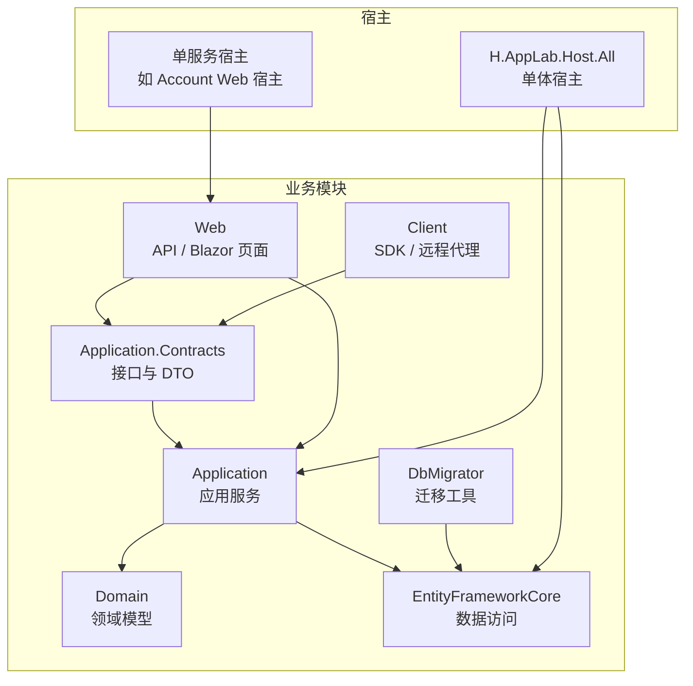
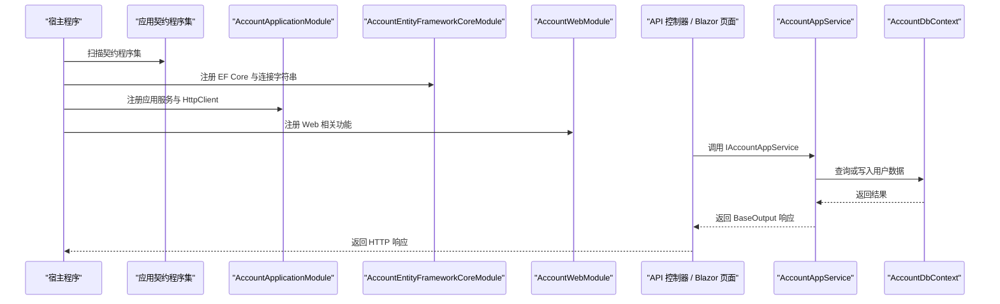
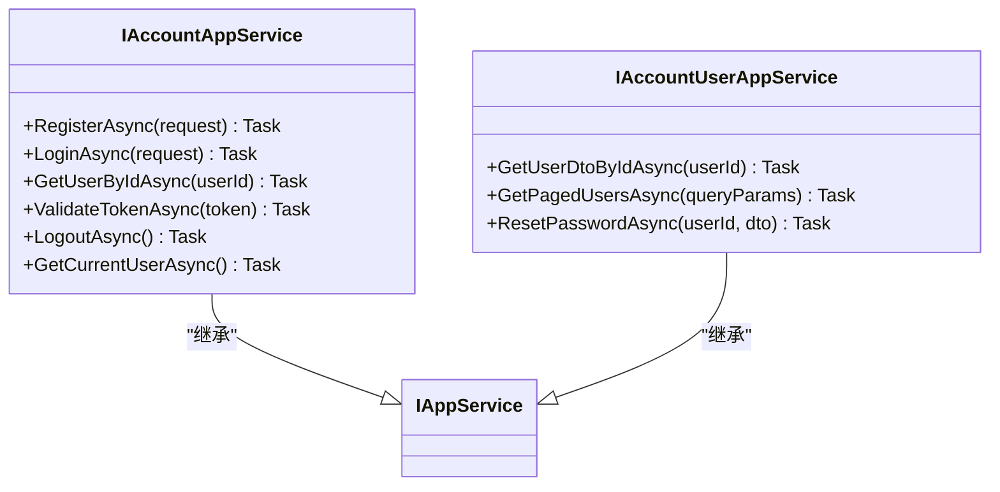
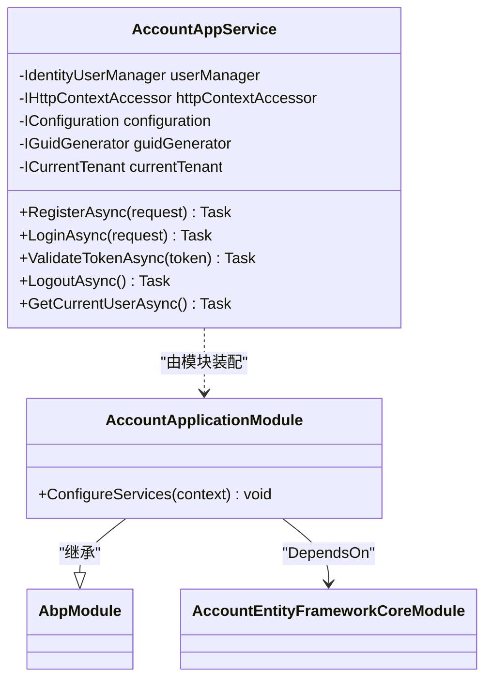
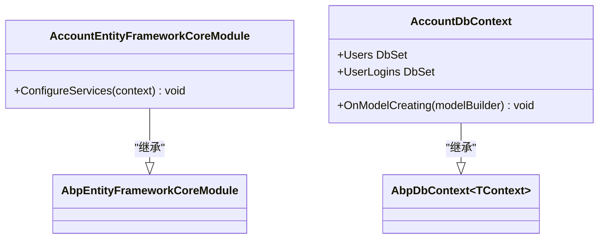
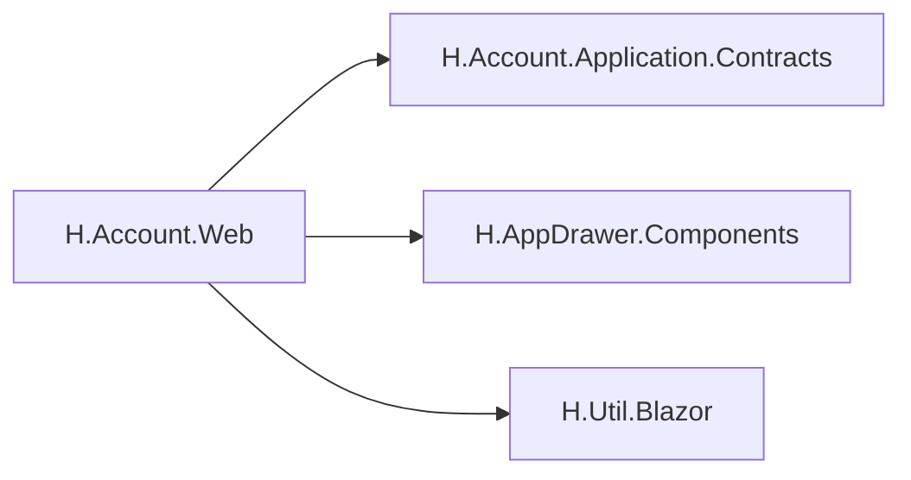
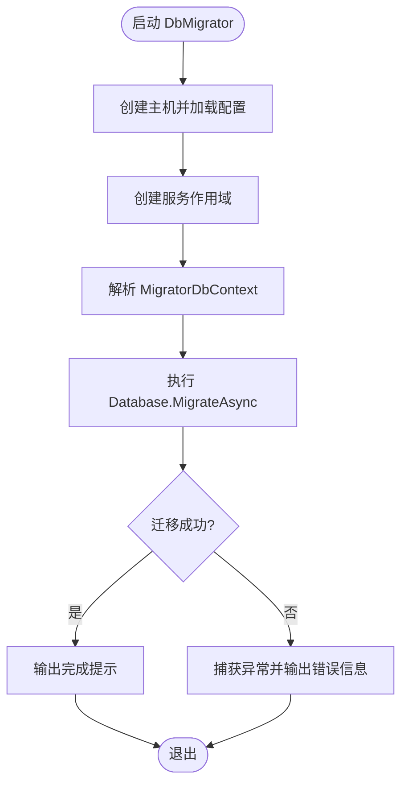
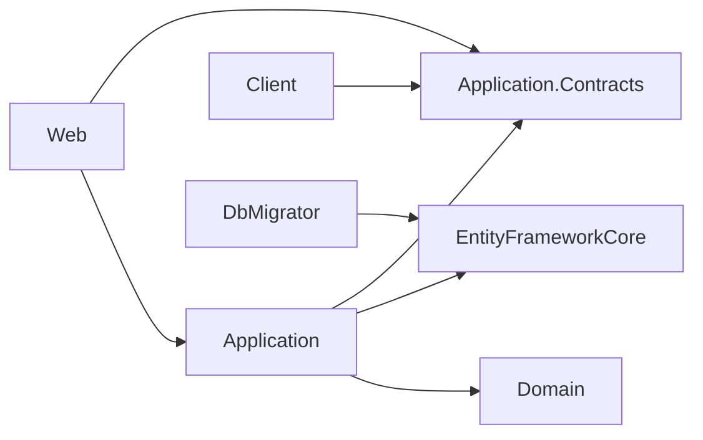

# 模块创建与初始化

<cite>
**本文引用的文件**   
- [README.md](file://README.md)
- [AccountApplicationContractsModule.cs](file://src/Services/Account/H.Account.Application.Contracts/AccountApplicationContractsModule.cs)
- [IAccountAppService.cs](file://src/Services/Account/H.Account.Application.Contracts/Services/IAccountAppService.cs)
- [IAccountUserAppService.cs](file://src/Services/Account/H.Account.Application.Contracts/Services/IAccountUserAppService.cs)
- [AccountAppService.cs](file://src/Services/Account/H.Account.Application/Services/AccountAppService.cs)
- [AccountApplicationModule.cs](file://src/Services/Account/H.Account.Application/AccountApplicationModule.cs)
- [AccountEntityFrameworkCoreModule.cs](file://src/Services/Account/H.Account.EntityFrameworkCore/AccountEntityFrameworkCoreModule.cs)
- [AccountDbContext.cs](file://src/Services/Account/H.Account.EntityFrameworkCore/AccountDbContext.cs)
- [AccountWebModule.cs](file://src/Services/Account/H.Account.Web/AccountWebModule.cs)
- [H.Account.Application.Contracts.csproj](file://src/Services/Account/H.Account.Application.Contracts/H.Account.Application.Contracts.csproj)
- [H.Account.Application.csproj](file://src/Services/Account/H.Account.Application/H.Account.Application.csproj)
- [H.Account.EntityFrameworkCore.csproj](file://src/Services/Account/H.Account.EntityFrameworkCore/H.Account.EntityFrameworkCore.csproj)
- [H.Account.Web.csproj](file://src/Services/Account/H.Account.Web/H.Account.Web.csproj)
- [H.Account.DbMigrator.csproj](file://src/Tools/H.Account.DbMigrator/H.Account.DbMigrator.csproj)
- [Program.cs（账户迁移工具）](file://src/Tools/H.Account.DbMigrator/Program.cs)
- [AccountClientModule.cs](file://src/Services/Account/H.Account.Client/AccountClientModule.cs)
</cite>

## 目录
1. [引言](#引言)
2. [项目结构](#项目结构)
3. [核心分层职责](#核心分层职责)
4. [架构总览](#架构总览)
5. [详细组件分析](#详细组件分析)
6. [依赖关系分析](#依赖关系分析)
7. [性能与可维护性建议](#性能与可维护性建议)
8. [常见问题与排错](#常见问题与排错)
9. [结论](#结论)
10. [附录：从零创建一个最小可用业务模块](#附录从零创建一个最小可用业务模块)

## 引言
本文件面向 H.AppLab 平台开发者，说明如何基于 ABP 框架和现有仓库风格，创建并初始化一个完整的业务模块。文档以“账号服务”作为参考实现，覆盖从空项目到可运行最小化模块的完整流程，包括命令行与手动创建方式、各层职责、ABP 模块注册与依赖注入、数据访问配置、客户端 SDK 接入以及常见问题的解决方案。

## 项目结构
H.AppLab 采用模块化架构，支持单体部署与按服务独立部署。每个业务模块遵循统一的分层约定：应用契约、应用服务、领域模型、EF Core 数据访问、Web 接口或 Blazor 页面，并提供独立的数据库迁移工具。

**图表来源**
- [README.md:1-73](file://README.md#L1-L73)

**章节来源**
- [README.md:1-73](file://README.md#L1-L73)

## 核心分层职责
- Application.Contracts：定义对外暴露的 IAppService 接口、DTO、枚举、常量等契约；不依赖具体实现，供 Web、Client、外部系统引用。
- Application：实现 IAppService，编排业务逻辑，调用领域服务、仓储、第三方服务，处理事务与校验。
- Domain：定义实体、聚合根、领域事件、领域服务、仓储接口等核心业务规则。
- EntityFrameworkCore：提供 DbContext、实体映射、默认仓储实现、连接字符串配置。
- Web：提供 API 控制器或 Blazor 页面，负责请求路由、鉴权、视图渲染；通常引用 Contracts 与 Application。
- Client：为前端或外部系统生成 SDK，通过动态 HTTP 代理调用远端 IAppService。
- DbMigrator：控制台程序，用于执行 EF Core 迁移，创建或更新数据库结构。

**章节来源**
- [README.md:1-73](file://README.md#L1-L73)

## 架构总览
下面的图展示了“账号服务”模块在运行时如何被宿主加载、如何注册 ABP 模块、以及如何通过 Web 或 Client 消费。

**图表来源**
- [AccountApplicationModule.cs:1-22](file://src/Services/Account/H.Account.Application/AccountApplicationModule.cs#L1-L22)
- [AccountEntityFrameworkCoreModule.cs:1-37](file://src/Services/Account/H.Account.EntityFrameworkCore/AccountEntityFrameworkCoreModule.cs#L1-L37)
- [AccountWebModule.cs:1-8](file://src/Services/Account/H.Account.Web/AccountWebModule.cs#L1-L8)
- [IAccountAppService.cs:1-18](file://src/Services/Account/H.Account.Application.Contracts/Services/IAccountAppService.cs#L1-L18)
- [AccountDbContext.cs:1-28](file://src/Services/Account/H.Account.EntityFrameworkCore/AccountDbContext.cs#L1-L28)

## 详细组件分析

### 应用契约层（Application.Contracts）
该层只包含接口与数据对象，避免引入业务实现细节，便于被 Web、Client 和其他服务引用。

- 契约模块标记类：用于定位程序集，方便宿主扫描。
- IAccountAppService：定义认证、用户信息查询、令牌验证、登出等接口。
- IAccountUserAppService：定义用户列表分页查询、密码重置等管理接口。

**图表来源**
- [IAccountAppService.cs:1-18](file://src/Services/Account/H.Account.Application.Contracts/Services/IAccountAppService.cs#L1-L18)
- [IAccountUserAppService.cs:1-26](file://src/Services/Account/H.Account.Application.Contracts/Services/IAccountUserAppService.cs#L1-L26)

**章节来源**
- [AccountApplicationContractsModule.cs:1-9](file://src/Services/Account/H.Account.Application.Contracts/AccountApplicationContractsModule.cs#L1-L9)
- [IAccountAppService.cs:1-18](file://src/Services/Account/H.Account.Application.Contracts/Services/IAccountAppService.cs#L1-L18)
- [IAccountUserAppService.cs:1-26](file://src/Services/Account/H.Account.Application.Contracts/Services/IAccountUserAppService.cs#L1-L26)

### 应用服务层（Application）
该层实现契约接口，编排业务逻辑，依赖 EF Core 模块提供的上下文与服务。

- AccountApplicationModule：声明对 EF Core 模块与 ABP Identity 模块的依赖，并注册 HttpContextAccessor、HttpClient。
- AccountAppService：实现用户注册、登录、令牌校验、登出、当前用户信息获取等逻辑。

**图表来源**
- [AccountApplicationModule.cs:1-22](file://src/Services/Account/H.Account.Application/AccountApplicationModule.cs#L1-L22)
- [AccountAppService.cs:1-200](file://src/Services/Account/H.Account.Application/Services/AccountAppService.cs#L1-L200)

**章节来源**
- [AccountApplicationModule.cs:1-22](file://src/Services/Account/H.Account.Application/AccountApplicationModule.cs#L1-L22)
- [AccountAppService.cs:1-200](file://src/Services/Account/H.Account.Application/Services/AccountAppService.cs#L1-L200)

### 数据访问层（EntityFrameworkCore）
该层提供 DbContext、默认仓储与连接字符串配置，并与 ABP Identity 集成。

- AccountEntityFrameworkCoreModule：读取连接字符串，注册 DbContext、默认仓储，配置 SQL Server 与连接名称。
- AccountDbContext：继承 AbpDbContext，定义 DbSet，并在 OnModelCreating 中配置 Identity 实体。

**图表来源**
- [AccountEntityFrameworkCoreModule.cs:1-37](file://src/Services/Account/H.Account.EntityFrameworkCore/AccountEntityFrameworkCoreModule.cs#L1-L37)
- [AccountDbContext.cs:1-28](file://src/Services/Account/H.Account.EntityFrameworkCore/AccountDbContext.cs#L1-L28)

**章节来源**
- [AccountEntityFrameworkCoreModule.cs:1-37](file://src/Services/Account/H.Account.EntityFrameworkCore/AccountEntityFrameworkCoreModule.cs#L1-L37)
- [AccountDbContext.cs:1-28](file://src/Services/Account/H.Account.EntityFrameworkCore/AccountDbContext.cs#L1-L28)

### Web 层（Web）
该层提供 Blazor 页面或 API 入口，引用契约与应用服务，并使用共享 UI 组件与工具库。

- AccountWebModule：Web 模块标记类，用于宿主扫描与扩展。
- csproj：引用契约、AppDrawer 组件与 Blazor 工具库。

**图表来源**
- [AccountWebModule.cs:1-8](file://src/Services/Account/H.Account.Web/AccountWebModule.cs#L1-L8)
- [H.Account.Web.csproj:1-12](file://src/Services/Account/H.Account.Web/H.Account.Web.csproj#L1-L12)

**章节来源**
- [AccountWebModule.cs:1-8](file://src/Services/Account/H.Account.Web/AccountWebModule.cs#L1-L8)
- [H.Account.Web.csproj:1-12](file://src/Services/Account/H.Account.Web/H.Account.Web.csproj#L1-L12)

### 客户端 SDK（Client）
该层为外部系统或前端提供 SDK，通常基于 IAppService 接口生成动态 HTTP 代理。

- AccountClientModule：SDK 模块标记类，用于客户端程序集注册。

**章节来源**
- [AccountClientModule.cs](file://src/Services/Account/H.Account.Client/AccountClientModule.cs)

### 数据库迁移工具（DbMigrator）
该层是独立控制台程序，用于执行 EF Core 迁移，创建或更新数据库结构。

- Program：创建主机、构建服务容器、解析 MigratorDbContext，执行 Database.MigrateAsync。
- csproj：引用 EF Core 设计包、SQL Server 提供程序、配置与宿主工具，并引用 EF Core 模块程序集。

**图表来源**
- [Program.cs（账户迁移工具）:1-59](file://src/Tools/H.Account.DbMigrator/Program.cs#L1-L59)

**章节来源**
- [H.Account.DbMigrator.csproj:1-26](file://src/Tools/H.Account.DbMigrator/H.Account.DbMigrator.csproj#L1-L26)
- [Program.cs（账户迁移工具）:1-59](file://src/Tools/H.Account.DbMigrator/Program.cs#L1-L59)

## 依赖关系分析
各层之间的依赖方向清晰，契约层无内部依赖，应用层依赖契约与 EF Core，Web 层依赖契约与 UI 工具，迁移工具仅依赖 EF Core。

**图表来源**
- [H.Account.Application.Contracts.csproj:1-10](file://src/Services/Account/H.Account.Application.Contracts/H.Account.Application.Contracts.csproj#L1-L10)
- [H.Account.Application.csproj:1-14](file://src/Services/Account/H.Account.Application/H.Account.Application.csproj#L1-L14)
- [H.Account.EntityFrameworkCore.csproj:1-11](file://src/Services/Account/H.Account.EntityFrameworkCore/H.Account.EntityFrameworkCore.csproj#L1-L11)
- [H.Account.Web.csproj:1-12](file://src/Services/Account/H.Account.Web/H.Account.Web.csproj#L1-L12)
- [H.Account.DbMigrator.csproj:1-26](file://src/Tools/H.Account.DbMigrator/H.Account.DbMigrator.csproj#L1-L26)

**章节来源**
- [H.Account.Application.Contracts.csproj:1-10](file://src/Services/Account/H.Account.Application.Contracts/H.Account.Application.Contracts.csproj#L1-L10)
- [H.Account.Application.csproj:1-14](file://src/Services/Account/H.Account.Application/H.Account.Application.csproj#L1-L14)
- [H.Account.EntityFrameworkCore.csproj:1-11](file://src/Services/Account/H.Account.EntityFrameworkCore/H.Account.EntityFrameworkCore.csproj#L1-L11)
- [H.Account.Web.csproj:1-12](file://src/Services/Account/H.Account.Web/H.Account.Web.csproj#L1-L12)
- [H.Account.DbMigrator.csproj:1-26](file://src/Tools/H.Account.DbMigrator/H.Account.DbMigrator.csproj#L1-L26)

## 性能与可维护性建议
- 将稳定且跨模块复用的契约放入 Application.Contracts，避免循环依赖。
- 使用 ABP 的 DependsOn 明确模块依赖，减少隐式耦合。
- 在 Application 层封装复杂业务逻辑，保持 Web 层薄而专注。
- 将 EF Core 配置集中在 EntityFrameworkCore 模块，统一管理连接字符串与仓储。
- 使用 DbMigrator 独立迁移程序，避免与宿主生命周期互相影响。
- 对频繁调用的接口，结合缓存与分页参数，减少数据库压力。
- 对敏感操作（如密码重置、状态变更）记录审计日志并限制权限。

[本节为通用建议，不直接分析具体文件]

## 常见问题与排错
- 无法找到 DbContext：确保 DbMigrator 的 StartupProject 指向包含 DbContext 配置的项目。
- 找不到迁移程序集：检查 MigrationsAssembly 是否正确设置。
- 连接字符串未配置：在 appsettings.json 中配置 DefaultConnection 或模块对应的连接名称。
- 模块未加载：确认 Module 类正确声明 DependsOn，并由宿主扫描加载。
- 客户端代理无法调用：确认 RemoteServices 配置与 IAppService 命名符合 ABP 约定。

**章节来源**
- [README.md:1-73](file://README.md#L1-L73)
- [AccountEntityFrameworkCoreModule.cs:1-37](file://src/Services/Account/H.Account.EntityFrameworkCore/AccountEntityFrameworkCoreModule.cs#L1-L37)
- [Program.cs（账户迁移工具）:1-59](file://src/Tools/H.Account.DbMigrator/Program.cs#L1-L59)

## 结论
通过统一的模块分层与 ABP 模块体系，H.AppLab 可以快速创建、组合与部署业务模块。账号服务提供了从契约、应用、领域、数据访问到 Web 与迁移工具的完整示例。开发者可以据此复制出新的业务模块，逐步完善领域模型、应用服务、Web 界面与客户端 SDK。

[本节为总结性内容，不直接分析具体文件]

## 附录：从零创建一个最小可用业务模块

### 一、使用命令行快速创建
如果仓库中包含 ABP 模板或脚手架脚本，可在目标 Services 目录下执行命令生成基础结构，然后按需补齐各层文件。若未提供模板，请参考下方“手动创建”步骤。

[本节为通用指引，不直接分析具体文件]

### 二、手动创建最小化模块
以新模块 “Example” 为例，建议在 src/Services 下新建 Example 子目录，并按以下结构创建项目与文件。

1. 创建应用契约项目
- 新建 H.Example.Application.Contracts 项目。
- 引用公共契约库 H.Abp.Application.Contracts 与 H.Util.Base。
- 新增模块标记类 ExampleApplicationContractsModule，导出 Assembly 属性。
- 新增 IExampleAppService，继承 IAppService，定义至少一个简单方法。

**章节来源**
- [H.Account.Application.Contracts.csproj:1-10](file://src/Services/Account/H.Account.Application.Contracts/H.Account.Application.Contracts.csproj#L1-L10)
- [AccountApplicationContractsModule.cs:1-9](file://src/Services/Account/H.Account.Application.Contracts/AccountApplicationContractsModule.cs#L1-L9)
- [IAccountAppService.cs:1-18](file://src/Services/Account/H.Account.Application.Contracts/Services/IAccountAppService.cs#L1-L18)

2. 创建 EF Core 项目
- 新建 H.Example.EntityFrameworkCore 项目。
- 引用 Volo.Abp.EntityFrameworkCore、Volo.Abp.Identity.EntityFrameworkCore、Microsoft.EntityFrameworkCore.SqlServer。
- 新增 ExampleEntityFrameworkCoreModule，注册 DbContext、默认仓储与连接字符串。
- 新增 ExampleDbContext，继承 AbpDbContext，定义必要 DbSet，并在 OnModelCreating 中调用 ConfigureIdentity 或其他领域配置。

**章节来源**
- [H.Account.EntityFrameworkCore.csproj:1-11](file://src/Services/Account/H.Account.EntityFrameworkCore/H.Account.EntityFrameworkCore.csproj#L1-L11)
- [AccountEntityFrameworkCoreModule.cs:1-37](file://src/Services/Account/H.Account.EntityFrameworkCore/AccountEntityFrameworkCoreModule.cs#L1-L37)
- [AccountDbContext.cs:1-28](file://src/Services/Account/H.Account.EntityFrameworkCore/AccountDbContext.cs#L1-L28)

3. 创建应用服务项目
- 新建 H.Example.Application 项目。
- 引用 Volo.Abp.Ddd.Application、Volo.Abp.Identity.Application、Volo.Abp.Account.Application、JwtBearer 相关包。
- 引用契约与 EF Core 项目。
- 新增 ExampleApplicationModule，DependsOn EF Core 模块与 ABP Identity 模块，注册 HttpContextAccessor 与 HttpClient。
- 新增 ExampleAppService，实现 IExampleAppService，封装基础业务逻辑。

**章节来源**
- [H.Account.Application.csproj:1-14](file://src/Services/Account/H.Account.Application/H.Account.Application.csproj#L1-L14)
- [AccountApplicationModule.cs:1-22](file://src/Services/Account/H.Account.Application/AccountApplicationModule.cs#L1-L22)
- [AccountAppService.cs:1-200](file://src/Services/Account/H.Account.Application/Services/AccountAppService.cs#L1-L200)

4. 创建 Web 项目
- 新建 H.Example.Web 项目（Razor）。
- 引用契约、AppDrawer 组件与 H.Util.Blazor。
- 新增 ExampleWebModule 作为 Web 模块标记类。
- 在宿主中启用该模块，并添加页面或 API 控制器。

**章节来源**
- [H.Account.Web.csproj:1-12](file://src/Services/Account/H.Account.Web/H.Account.Web.csproj#L1-L12)
- [AccountWebModule.cs:1-8](file://src/Services/Account/H.Account.Web/AccountWebModule.cs#L1-L8)

5. 创建客户端 SDK
- 新建 H.Example.Client 项目。
- 新增 ExampleClientModule，用于注册 SDK 的动态代理。
- 在需要调用的前端或外部系统中引用该 SDK。

**章节来源**
- [AccountClientModule.cs](file://src/Services/Account/H.Account.Client/AccountClientModule.cs)

6. 创建迁移工具
- 新建 H.Example.DbMigrator 控制台项目。
- 引用 EF Core 设计包、SQL Server 提供程序、配置与宿主工具。
- 引用 Example.EntityFrameworkCore 项目。
- 新增 Program，创建主机、加载配置、解析 MigratorDbContext，执行 Database.MigrateAsync。
- 新增 appsettings.json，配置 ExampleDb 连接字符串。

**章节来源**
- [H.Account.DbMigrator.csproj:1-26](file://src/Tools/H.Account.DbMigrator/H.Account.DbMigrator.csproj#L1-L26)
- [Program.cs（账户迁移工具）:1-59](file://src/Tools/H.Account.DbMigrator/Program.cs#L1-L59)

### 三、模块注册与依赖注入要点
- 在每个层增加 Module 标记类，用于宿主扫描与程序集定位。
- 在 ApplicationModule 中使用 DependsOn 声明对 EF Core 模块与 ABP Identity 模块的依赖。
- 在 ConfigureServices 中注册 HttpContextAccessor、HttpClient 等基础设施服务。
- 在 EntityFrameworkCoreModule 中配置连接字符串、UseSqlServer、AddAbpDbContext 与默认仓储。
- 在 Web 项目中引入契约与 UI 工具，必要时扩展服务注册。

**章节来源**
- [AccountApplicationModule.cs:1-22](file://src/Services/Account/H.Account.Application/AccountApplicationModule.cs#L1-L22)
- [AccountEntityFrameworkCoreModule.cs:1-37](file://src/Services/Account/H.Account.EntityFrameworkCore/AccountEntityFrameworkCoreModule.cs#L1-L37)
- [AccountWebModule.cs:1-8](file://src/Services/Account/H.Account.Web/AccountWebModule.cs#L1-L8)

### 四、从空项目到可运行的最小化模块清单
- 契约层：模块标记类、IExampleAppService、基础 DTO。
- 应用层：ExampleApplicationModule、ExampleAppService。
- 数据访问层：ExampleEntityFrameworkCoreModule、ExampleDbContext。
- Web 层：ExampleWebModule、至少一个页面或 API。
- 客户端 SDK：ExampleClientModule。
- 迁移工具：Program、appsettings.json、示例迁移。

完成上述文件后，运行 DbMigrator 创建数据库，再启动宿主即可访问最小化接口。

[本节为通用指引，不直接分析具体文件]