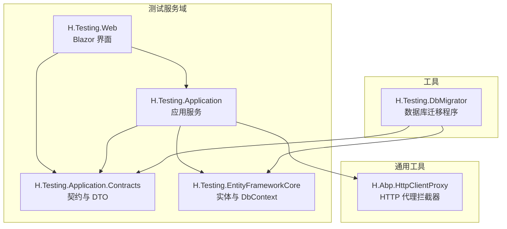
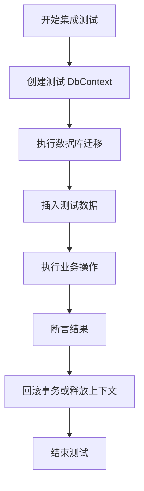
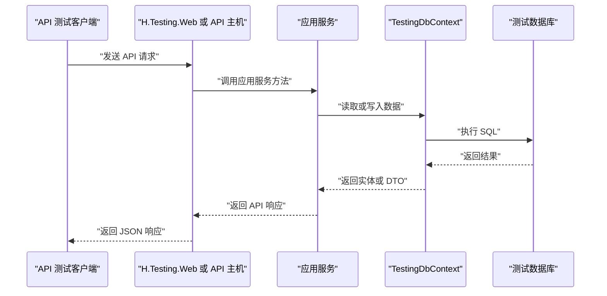

# 模块测试与调试

<cite>
**本文引用的文件**   
- [H.Testing.Web.csproj](file://src/Services/Testing/H.Testing.Web/H.Testing.Web.csproj)
- [H.Testing.DbMigrator.csproj](file://src/Tools/H.Testing.DbMigrator/H.Testing.DbMigrator.csproj)
- [Program.cs（测试数据库迁移程序）](file://src/Tools/H.Testing.DbMigrator/Program.cs)
- [appsettings.json（测试数据库迁移配置）](file://src/Tools/H.Testing.DbMigrator/appsettings.json)
- [TestingDbContextFactory.cs](file://src/Tools/H.Testing.DbMigrator/TestingDbContextFactory.cs)
- [TestingDbContext.cs](file://src/Services/Testing/H.Testing.EntityFrameworkCore/TestingDbContext.cs)
- [TestingEntityFrameworkCoreModule.cs](file://src/Services/Testing/H.Testing.EntityFrameworkCore/TestingEntityFrameworkCoreModule.cs)
- [TestingApplicationModule.cs](file://src/Services/Testing/H.Testing.Application/TestingApplicationModule.cs)
- [ProjectAppService.cs](file://src/Services/Testing/H.Testing.Application/Services/ProjectAppService.cs)
- [CaseAppService.cs](file://src/Services/Testing/H.Testing.Application/Services/Cases/CaseAppService.cs)
- [TestExecutionEngineAppService.cs](file://src/Services/Testing/H.Testing.Application/Services/Execution/TestExecutionEngineAppService.cs)
- [BatchExecutionAppService.cs](file://src/Services/Testing/H.Testing.Application/Services/Execution/BatchExecutionAppService.cs)
- [CiAppService.cs](file://src/Services/Testing/H.Testing.Application/Services/Execution/CiAppService.cs)
- [PerformanceTestSettingsDto.cs](file://src/Services/Testing/H.Testing.Application.Contracts/Dtos/Execution/PerformanceTestSettingsDto.cs)
- [RemoteServiceOptions.cs](file://src/Utils/H.Abp.HttpClientProxy/RemoteServiceOptions.cs)
- [HttpClientProxyInterceptor.cs](file://src/Utils/H.Abp.HttpClientProxy/HttpClientProxyInterceptor.cs)
- [ServiceCollectionExtensions.cs（HttpClient代理扩展）](file://src/Utils/H.Abp.HttpClientProxy/ServiceCollectionExtensions.cs)
</cite>

## 目录

1. [引言](#引言)
2. [项目结构中的测试相关位置](#项目结构中的测试相关位置)
3. [单元测试编写方法](#单元测试编写方法)
4. [集成测试与环境隔离](#集成测试与环境隔离)
5. [API 接口测试方法](#api-接口测试方法)
6. [调试技巧](#调试技巧)
7. [常见问题排查](#常见问题排查)
8. [持续集成中的测试策略](#持续集成中的测试策略)
9. [结论](#结论)

## 引言

H.AppLab 平台包含一个专门的“测试”服务域，用于管理测试计划、用例、数据集、执行记录、报告以及性能测试等能力。从仓库结构看，该领域以 `src/Services/Testing` 为中心，提供应用层服务、实体框架上下文、Web 组件和迁移工具；同时通过 `src/Tools/H.Testing.DbMigrator` 提供测试数据库初始化能力。

本文件面向 H.AppLab 的开发者与维护者，说明如何在该代码库中编写单元测试、集成测试、API 自动化测试与性能测试，并给出调试、排错和持续集成的建议。由于当前仓库中未发现显式的测试工程引用 xUnit、NUnit、MSTest、Moq 或 EF Core InMemory 测试包，因此本文在分析现有实现的基础上，提出与现有架构兼容的测试方案，而不是虚构已经存在的测试类。

## 项目结构中的测试相关位置

H.AppLab 中与“测试”直接相关的代码主要分布在以下位置：

| 路径 | 职责 | 与测试的关系 |
|---|---|---|
| `src/Services/Testing/H.Testing.Web` | Blazor Web 端展示与交互 | 提供测试计划的可视化界面、执行入口和数据录入界面 |
| `src/Services/Testing/H.Testing.Application` | 测试业务逻辑和应用服务 | 封装用例、执行引擎、批量执行、CI 执行等业务行为 |
| `src/Services/Testing/H.Testing.Application.Contracts` | 测试领域的数据传输对象与服务契约 | 定义 DTO、接口和枚举，便于 API 测试和外部客户端使用 |
| `src/Services/Testing/H.Testing.EntityFrameworkCore` | 测试数据持久化模型与 EF Core 配置 | 定义 DbContext、实体、模块注册，是集成测试的核心依赖 |
| `src/Tools/H.Testing.DbMigrator` | 测试数据库迁移工具 | 提供独立可执行程序，用于创建或升级测试数据库 |
| `src/Utils/H.Abp.HttpClientProxy` | HTTP 客户端代理拦截器 | 可用于远程服务调用模拟、请求日志和测试替身 |

**图示来源**
- [H.Testing.Web.csproj:1-15](file://src/Services/Testing/H.Testing.Web/H.Testing.Web.csproj#L1-L15)
- [H.Testing.DbMigrator.csproj:1-25](file://src/Tools/H.Testing.DbMigrator/H.Testing.DbMigrator.csproj#L1-L25)

**章节来源**
- [H.Testing.Web.csproj:1-15](file://src/Services/Testing/H.Testing.Web/H.Testing.Web.csproj#L1-L15)
- [H.Testing.DbMigrator.csproj:1-25](file://src/Tools/H.Testing.DbMigrator/H.Testing.DbMigrator.csproj#L1-L25)

## 单元测试编写方法

### 测试边界划分

在当前代码库中，适合进行单元测试的主要边界是应用服务中的纯业务逻辑部分，例如：

- 输入参数校验
- DTO 到实体的转换
- 基于配置或规则的计算
- 状态流转判断
- 对无副作用工具的调用

不适合直接单元测试的部分包括：

- 直接操作数据库的服务
- 需要完整 ABP 模块容器才能启动的服务
- 依赖外部系统、浏览器或 Playwright 的执行服务

### Mock 对象的使用建议

虽然当前仓库未引入 Moq、FakeItEasy 等常见 .NET Mock 框架，但可以从现有实现中借鉴 Mock 思路：

1. **优先注入接口而非具体实现**。如果应用服务依赖仓储、远程服务或配置服务，应通过接口抽象，以便测试时替换为内存实现。
2. **使用轻量替身替代真实依赖**。对于 HTTP 远程调用，可参考 `H.Abp.HttpClientProxy` 的设计，构造一个返回固定响应或抛出预期异常的替身。
3. **避免在单元测试中启动完整宿主**。单元测试应尽量保持快速、确定和无外部依赖。

### 测试数据准备

测试数据可分为三类：

| 类型 | 用途 | 建议 |
|---|---|---|
| 最小输入数据 | 验证单个方法的行为 | 直接在测试方法内构造 |
| 场景数据 | 验证复杂业务流程 | 放在测试夹具或静态工厂中 |
| 持久化数据 | 仅用于集成测试 | 通过临时 DbContext 或内存上下文生成 |

对于测试服务域，典型测试数据包括：

- 项目信息
- 用例步骤
- 数据集条目
- 执行记录
- 性能测试设置

### 断言方法建议

即使当前仓库没有发现 xUnit 或 NUnit 测试类，也可以按照通用 .NET 实践组织断言：

- 断言返回值是否符合预期
- 断言异常类型和消息
- 断言被调用的依赖是否按预期执行
- 断言状态变更后的结果
- 断言 DTO 字段映射是否正确

### 示例测试场景

以下场景适合用单元测试覆盖：

| 场景 | 输入 | 期望输出 |
|---|---|---|
| 用例步骤排序 | 无序步骤列表 | 按顺序排列后的结果 |
| 性能测试配置校验 | 缺少并发数或超时时间 | 抛出参数异常 |
| 执行结果汇总 | 多个步骤执行结果 | 统计成功、失败、跳过数量 |
| CI 任务触发条件 | 定时表达式或事件 | 正确解析触发规则 |

**章节来源**
- [ProjectAppService.cs](file://src/Services/Testing/H.Testing.Application/Services/ProjectAppService.cs)
- [CaseAppService.cs](file://src/Services/Testing/H.Testing.Application/Services/Cases/CaseAppService.cs)
- [PerformanceTestSettingsDto.cs](file://src/Services/Testing/H.Testing.Application.Contracts/Dtos/Execution/PerformanceTestSettingsDto.cs)

## 集成测试与环境隔离

### 测试数据库设置

H.AppLab 使用 EF Core 管理测试服务的数据库模型。`TestingDbContext` 是测试域的数据库上下文，`TestingEntityFrameworkCoreModule` 负责 EF Core 模块注册，`H.Testing.DbMigrator` 提供独立迁移程序。

推荐集成测试使用以下策略之一：

1. **专用测试数据库**：每个测试会话连接一个独立的 SQL Server 数据库，由 `H.Testing.DbMigrator` 初始化。
2. **事务回滚模式**：在测试开始前开启事务，测试结束后回滚，避免污染共享数据库。
3. **内存上下文**：仅在 EF Core 支持且业务允许的情况下使用内存数据库，注意其不支持所有 SQL Server 特性。

**图示来源**
- [TestingDbContext.cs](file://src/Services/Testing/H.Testing.EntityFrameworkCore/TestingDbContext.cs)
- [TestingEntityFrameworkCoreModule.cs](file://src/Services/Testing/H.Testing.EntityFrameworkCore/TestingEntityFrameworkCoreModule.cs)
- [Program.cs（测试数据库迁移程序）](file://src/Tools/H.Testing.DbMigrator/Program.cs)

### 事务回滚

事务回滚的关键原则是：

- 测试类启动时创建数据库上下文
- 测试方法开始时开启事务
- 测试方法结束时回滚事务
- 不要跨测试方法共享未提交的状态

如果测试需要验证持久化结果，可使用单独的事务外查询，或使用只读快照上下文。

### 测试环境隔离

测试环境隔离包括：

- 使用不同连接字符串
- 使用不同数据库名称
- 使用不同用户权限
- 隔离远程服务地址
- 隔离文件存储路径
- 隔离外部 API 密钥

对于测试服务域，尤其要注意：

- 测试计划与真实项目的用例不能互相干扰
- 执行记录不应污染生产报告
- 性能测试不应影响正常 API 吞吐

**章节来源**
- [TestingDbContext.cs](file://src/Services/Testing/H.Testing.EntityFrameworkCore/TestingDbContext.cs)
- [TestingEntityFrameworkCoreModule.cs](file://src/Services/Testing/H.Testing.EntityFrameworkCore/TestingEntityFrameworkCoreModule.cs)
- [Program.cs（测试数据库迁移程序）](file://src/Tools/H.Testing.DbMigrator/Program.cs)
- [appsettings.json（测试数据库迁移配置）](file://src/Tools/H.Testing.DbMigrator/appsettings.json)

## API 接口测试方法

### 接口范围

测试服务域暴露的 API 主要围绕以下内容：

| 接口类别 | 说明 |
|---|---|
| 项目管理 | 创建、查询、更新测试项目 |
| 用例管理 | 创建、编辑、分类、导入导出用例 |
| 执行引擎 | 单条用例执行、批量执行、执行记录查询 |
| CI 集成 | 触发 CI 任务、查看执行状态 |
| 性能测试 | 配置并发、阈值、超时等性能测试参数 |
| 报告与记录 | 查看执行报告、步骤记录 |

### Postman 集合

建议为测试服务域维护一份 Postman 集合，至少覆盖：

- 健康检查
- 认证登录
- 用例 CRUD
- 执行单条用例
- 批量执行
- 查询执行记录
- 查询性能测试配置
- 错误分支与权限不足场景

Postman 集合应包含环境变量，例如：

| 变量 | 示例值 |
|---|---|
| `baseUrl` | 本地或 CI 环境的基础 URL |
| `token` | 登录后获取的访问令牌 |
| `projectId` | 测试项目标识 |
| `caseId` | 测试用例标识 |
| `datasetId` | 测试数据集标识 |

### 自动化测试脚本

推荐使用以下层次：

1. **契约测试**：验证 API 响应结构、必填字段、枚举值。
2. **功能测试**：验证业务流程，例如创建用例后能够执行。
3. **端到端测试**：通过 Blazor 前端或浏览器自动化执行完整流程。
4. **性能测试**：使用负载工具或内置性能测试配置验证吞吐和延迟。

对于远程服务调用，可以复用 `H.Abp.HttpClientProxy` 的设计思想：

- 使用统一的 HTTP 客户端工厂
- 统一处理远程服务地址
- 在测试中替换为本地替身或固定响应

**图示来源**
- [H.Testing.Web.csproj:1-15](file://src/Services/Testing/H.Testing.Web/H.Testing.Web.csproj#L1-L15)
- [TestingDbContext.cs](file://src/Services/Testing/H.Testing.EntityFrameworkCore/TestingDbContext.cs)
- [ProjectAppService.cs](file://src/Services/Testing/H.Testing.Application/Services/ProjectAppService.cs)

### 性能测试

性能测试配置通过 `PerformanceTestSettingsDto` 表达，通常包含并发度、持续时间、超时、目标吞吐量等参数。建议将性能测试分为两类：

| 类型 | 目标 | 注意事项 |
|---|---|---|
| 冒烟性能测试 | 验证基本接口是否明显退化 | 时间短、并发低 |
| 压力测试 | 验证上限和稳定性 | 需要独立环境，避免影响其他服务 |

**章节来源**
- [ProjectAppService.cs](file://src/Services/Testing/H.Testing.Application/Services/ProjectAppService.cs)
- [TestExecutionEngineAppService.cs](file://src/Services/Testing/H.Testing.Application/Services/Execution/TestExecutionEngineAppService.cs)
- [BatchExecutionAppService.cs](file://src/Services/Testing/H.Testing.Application/Services/Execution/BatchExecutionAppService.cs)
- [CiAppService.cs](file://src/Services/Testing/H.Testing.Application/Services/Execution/CiAppService.cs)
- [PerformanceTestSettingsDto.cs](file://src/Services/Testing/H.Testing.Application.Contracts/Dtos/Execution/PerformanceTestSettingsDto.cs)

## 调试技巧

### 本地调试配置

本地调试建议按以下顺序进行：

1. 确认 `appsettings.json` 中的数据库连接字符串指向本地 SQL Server。
2. 运行 `H.Testing.DbMigrator` 完成数据库迁移。
3. 启动 H.AppLab 主机或测试服务 Web 项目。
4. 打开 Blazor 页面验证 UI 是否正常加载。
5. 使用浏览器开发者工具观察网络请求和错误日志。

### 远程调试

远程调试适用于部署到开发服务器或容器的场景：

- 启用调试端口
- 配置防火墙放行调试端口
- 使用 IDE 附加到远程进程
- 避免在生产环境启用详细调试日志

### 日志分析

建议关注以下日志内容：

- 数据库连接建立和断开
- 迁移执行过程
- 应用服务异常堆栈
- HTTP 请求和响应
- 远程服务调用失败原因
- 执行引擎执行步骤和失败原因

### 性能剖析

性能剖析建议聚焦：

- 慢查询 SQL
- 长耗时应用服务方法
- 远程 API 调用延迟
- 大数据集序列化与反序列化
- 批量执行时的线程竞争

**章节来源**
- [appsettings.json（测试数据库迁移配置）](file://src/Tools/H.Testing.DbMigrator/appsettings.json)
- [Program.cs（测试数据库迁移程序）](file://src/Tools/H.Testing.DbMigrator/Program.cs)
- [TestExecutionEngineAppService.cs](file://src/Services/Testing/H.Testing.Application/Services/Execution/TestExecutionEngineAppService.cs)

## 常见问题排查

### 数据库连接问题

**现象**：迁移失败、上下文无法连接、SQL Server 不可达。

**排查步骤**：

1. 检查 `appsettings.json` 中的连接字符串是否正确。
2. 确认 SQL Server 服务已启动。
3. 确认用户名和密码有效。
4. 确认防火墙允许数据库端口。
5. 尝试使用数据库客户端手动连接。
6. 检查迁移版本是否与当前数据库一致。

**章节来源**
- [appsettings.json（测试数据库迁移配置）](file://src/Tools/H.Testing.DbMigrator/appsettings.json)
- [Program.cs（测试数据库迁移程序）](file://src/Tools/H.Testing.DbMigrator/Program.cs)

### 依赖注入问题

**现象**：启动时报找不到服务、接口未注册、循环依赖。

**排查步骤**：

1. 确认 ABP 模块已正确注册。
2. 确认 EF Core 模块已注册。
3. 确认应用服务依赖的接口有对应实现。
4. 检查是否误把瞬态服务注册为单例。
5. 检查是否存在循环依赖。

**章节来源**
- [TestingApplicationModule.cs](file://src/Services/Testing/H.Testing.Application/TestingApplicationModule.cs)
- [TestingEntityFrameworkCoreModule.cs](file://src/Services/Testing/H.Testing.EntityFrameworkCore/TestingEntityFrameworkCoreModule.cs)

### 权限配置问题

**现象**：API 返回未授权、角色缺失、菜单不显示。

**排查步骤**：

1. 确认当前用户具有所需角色。
2. 确认 API 接口未错误限制权限。
3. 确认前端菜单权限配置与后端一致。
4. 确认 Token 已正确传递。
5. 检查是否使用了错误的租户或组织上下文。

### HTTP 远程服务调用问题

**现象**：远程服务返回空响应、地址错误、拦截器未生效。

**排查步骤**：

1. 检查 `RemoteServiceOptions` 中的基础地址。
2. 检查 `IHttpClientFactory` 是否正确注册。
3. 检查代理拦截器是否被注册。
4. 检查目标服务是否可达。
5. 在测试中使用固定响应替代真实远程服务。

**章节来源**
- [RemoteServiceOptions.cs](file://src/Utils/H.Abp.HttpClientProxy/RemoteServiceOptions.cs)
- [HttpClientProxyInterceptor.cs](file://src/Utils/H.Abp.HttpClientProxy/HttpClientProxyInterceptor.cs)
- [ServiceCollectionExtensions.cs（HttpClient代理扩展）](file://src/Utils/H.Abp.HttpClientProxy/ServiceCollectionExtensions.cs)

## 持续集成中的测试策略

### 构建阶段

- 编译所有项目
- 运行单元测试
- 运行静态分析和代码规范检查
- 生成 NuGet 包或镜像前验证依赖

### 测试阶段

建议分层执行：

| 阶段 | 测试类型 | 执行顺序 |
|---|---|---|
| 快速反馈 | 单元测试 | 最先执行 |
| 集成测试 | 数据库与 EF Core | 单元测试通过后 |
| API 测试 | HTTP 接口契约和功能 | 集成测试通过后 |
| 端到端测试 | 浏览器或 UI 流程 | 可选，资源充足时执行 |
| 性能测试 | 负载和稳定性 | 合并前或发布候选阶段 |

### 质量门禁

建议在持续集成中加入以下门禁：

- 单元测试通过率必须为 100%
- 新增代码必须有相应测试
- 关键业务逻辑必须有集成测试
- API 契约测试不得回归
- 性能测试结果不得明显劣于基线
- 安全扫描和依赖漏洞扫描必须通过

### 测试数据管理

持续集成中的测试数据应遵循：

- 每次测试前重建或重置数据库
- 不使用生产数据副本
- 敏感数据脱敏
- 测试数据可重复生成
- 迁移脚本与测试数据保持一致

**章节来源**
- [H.Testing.DbMigrator.csproj:1-25](file://src/Tools/H.Testing.DbMigrator/H.Testing.DbMigrator.csproj#L1-L25)
- [Program.cs（测试数据库迁移程序）](file://src/Tools/H.Testing.DbMigrator/Program.cs)
- [CiAppService.cs](file://src/Services/Testing/H.Testing.Application/Services/Execution/CiAppService.cs)

## 结论

H.AppLab 平台的测试能力体现在两个方面：一是平台自身提供的测试服务域，二是未来为该平台添加的测试工程。当前仓库明确提供了测试服务的应用层、EF Core 上下文、Web 组件和数据库迁移工具，但未发现显式的单元测试或集成测试工程引用常见测试框架。

因此，推荐的落地方式是：

- 为应用服务编写单元测试，重点覆盖业务规则和数据处理逻辑。
- 为数据库相关逻辑编写集成测试，复用 `TestingDbContext` 和迁移工具。
- 为 API 接口编写自动化测试，覆盖核心 CRUD、执行流程和错误分支。
- 使用 `H.Abp.HttpClientProxy` 的设计思想，简化远程服务调用测试。
- 在持续集成中分层执行测试，确保质量门禁稳定可靠。

这样既能利用现有代码结构，又能逐步补齐测试覆盖，使 H.AppLab 平台的测试服务具备更高的可靠性、可维护性和可扩展性。