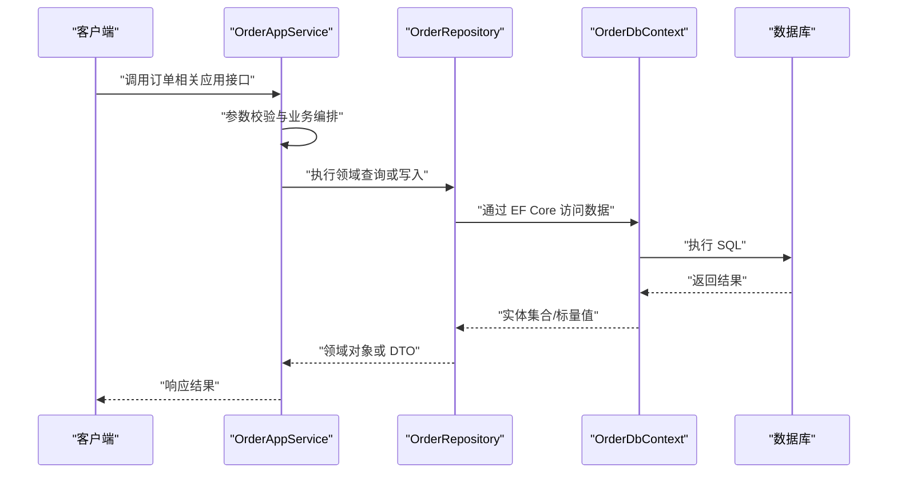
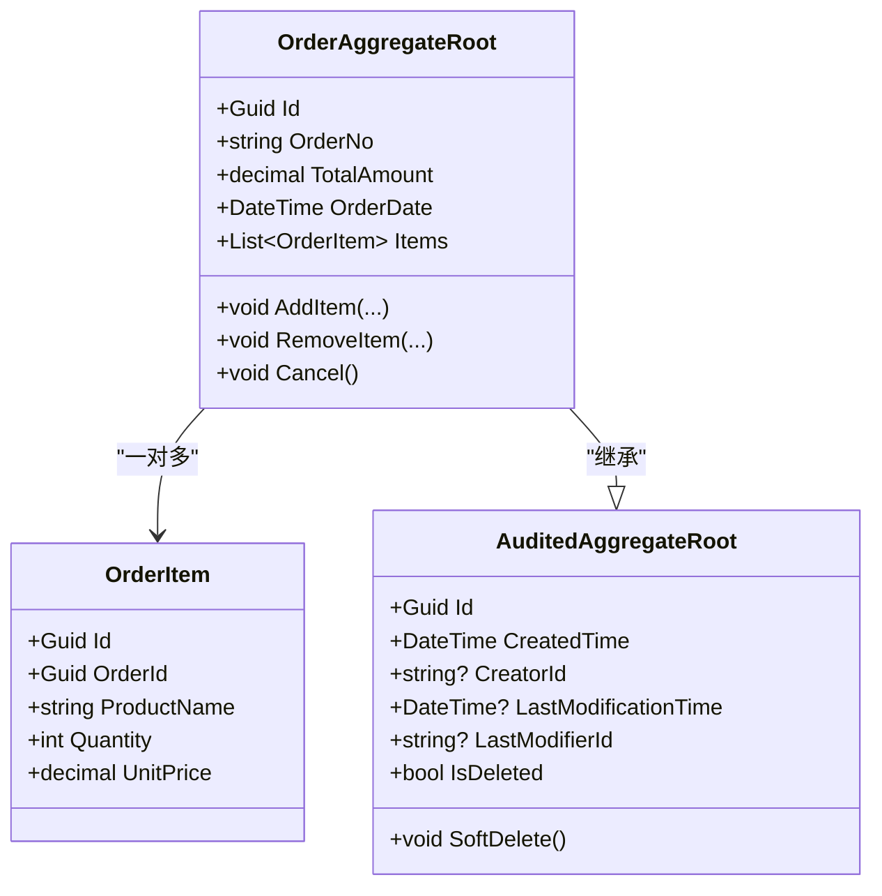
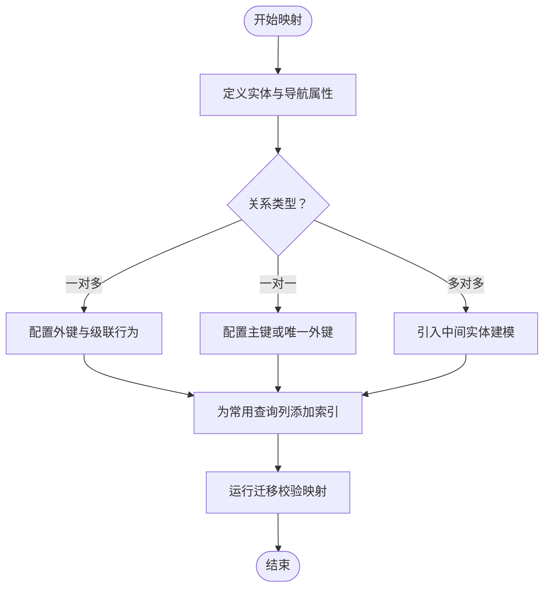
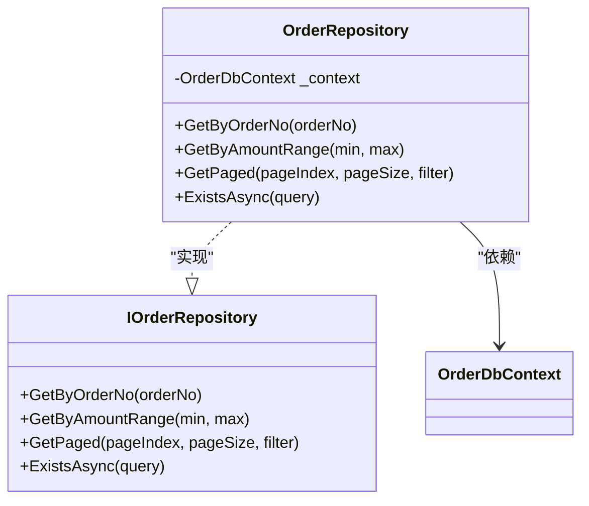
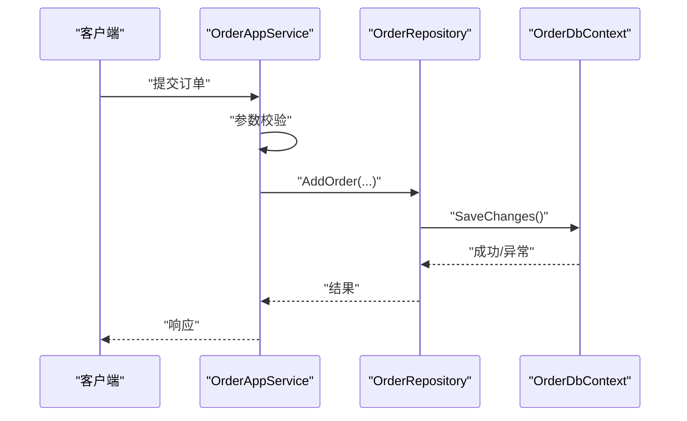
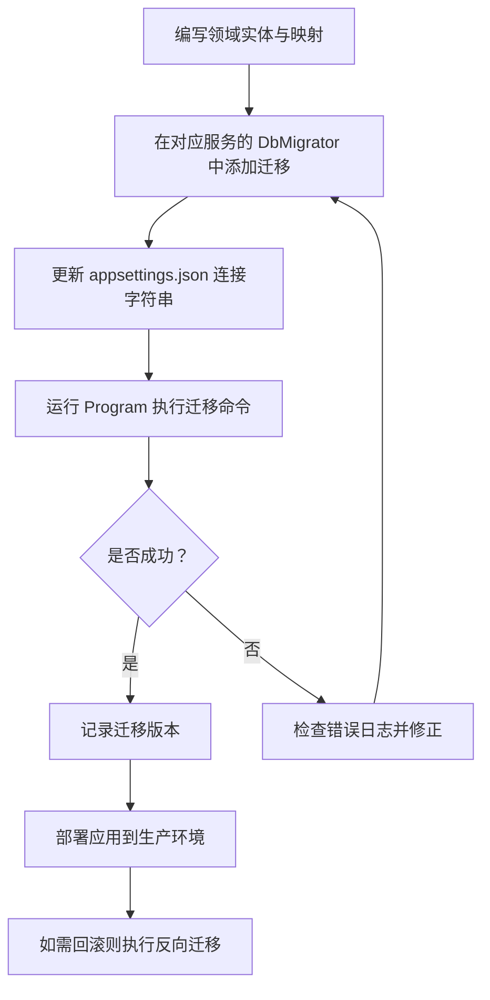
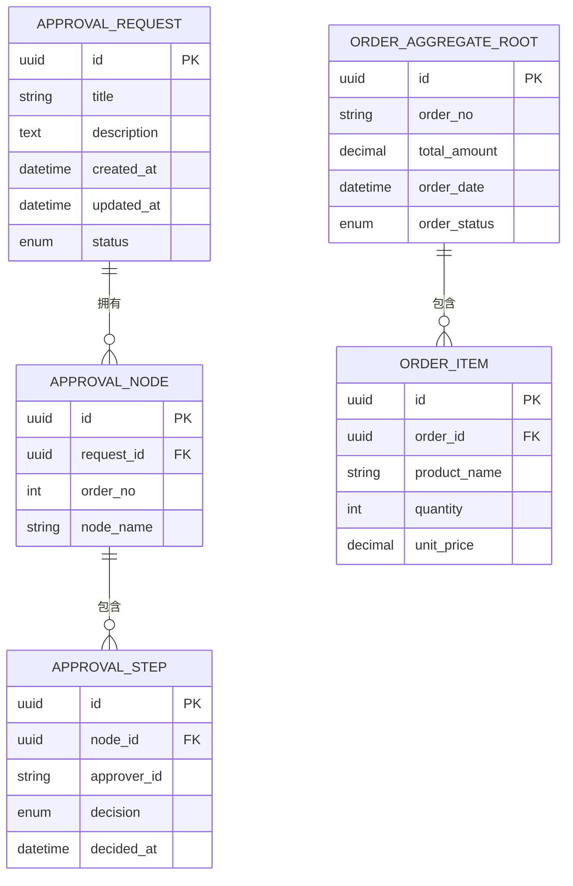
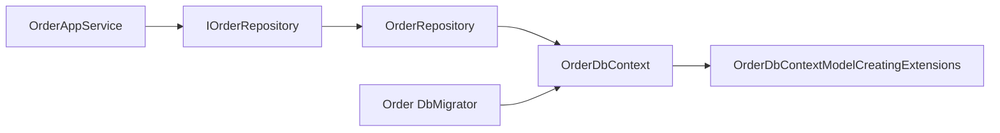

# 领域建模与数据库设计

<cite>
**本文引用的文件**   
- [AppMenuItem.cs](file://src/src/Components/AppDrawer/H.AppDrawer.Model/AppMenuItem.cs)
- [H.LowCode.DbMigrator/Program.cs](file://src/src/Tools/H.LowCode.DbMigrator/Program.cs)
- [H.LowCode.DbMigrator/LowCodeDbMigratorModule.cs](file://src/src/Tools/H.LowCode.DbMigrator/LowCodeDbMigratorModule.cs)
- [H.Order.EntityFrameworkCore/OrderDbContextFactory.cs](file://src/src/Tools/H.Order.DbMigrator/OrderDbContextFactory.cs)
- [H.Order.DbMigrator/appsettings.json](file://src/src/Tools/H.Order.DbMigrator/appsettings.json)
- [H.Order.DbMigrator/Migrations/20251006080000_InitialCreate.cs](file://src/src/Tools/H.Order.DbMigrator/Migrations/20251006080000_InitialCreate.cs)
- [H.Order.Application.Contracts/IOrderAppService.cs](file://src/src/Services/Order/H.Order.Application.Contracts/IOrderAppService.cs)
- [H.Order.Application/OrderAppService.cs](file://src/src/Services/Order/H.Order.Application/OrderAppService.cs)
- [H.Order.Domain/Entities/OrderAggregateRoot.cs](file://src/src/Services/Order/H.Order.Domain/Entities/OrderAggregateRoot.cs)
- [H.Order.Domain/Entities/OrderItem.cs](file://src/src/Services/Order/H.Order.Domain/Entities/OrderItem.cs)
- [H.Order.EntityFrameworkCore/EntityFrameworkCore/OrderDbContext.cs](file://src/src/Services/Order/H.Order.EntityFrameworkCore/EntityFrameworkCore/OrderDbContext.cs)
- [H.Order.EntityFrameworkCore/EntityFrameworkCore/OrderDbContextModelCreatingExtensions.cs](file://src/src/Services/Order/H.Order.EntityFrameworkCore/EntityFrameworkCore/OrderDbContextModelCreatingExtensions.cs)
- [H.Order.EntityFrameworkCore/Repositories/OrderRepository.cs](file://src/src/Services/Order/H.Order.EntityFrameworkCore/Repositories/OrderRepository.cs)
- [IOrderRepository.cs](file://src/src/Services/Order/H.Order.Domain/IOrderRepository.cs)
- [AuditedAggregateRoot.cs](file://src/src/System/SystemPortal/H.SystemPortal.Domain/AuditedAggregateRoot.cs)
</cite>

## 目录
1. [引言](#引言)
2. [项目结构](#项目结构)
3. [核心组件](#核心组件)
4. [架构总览](#架构总览)
5. [详细组件分析](#详细组件分析)
6. [依赖关系分析](#依赖关系分析)
7. [性能考虑](#性能考虑)
8. [故障排查指南](#故障排查指南)
9. [结论](#结论)
10. [附录](#附录)

## 引言
本文面向 H.AppLab 平台的领域建模与数据库设计，聚焦以下目标：
- 实体类设计原则：继承 AuditedAggregateRoot、属性注解使用、验证规则定义。
- 实体关系映射：一对一、一对多、多对多的 EF Core 配置方式。
- 仓储模式：IRepository 接口定义、自定义查询方法、事务处理。
- 数据库迁移流程：Migration 生成、版本管理、回滚策略。
- 复杂业务场景建模示例：审批流程、订单管理等。
- 性能优化建议与索引设计原则。

## 项目结构
H.AppLab 采用按“服务域”划分的模块化结构，每个服务包含 Domain、Application、Application.Contracts、EntityFrameworkCore 等分层；同时存在共享工具层、低代码引擎、Host 宿主以及各服务的 DbMigrator 迁移工具。

```mermaid
graph TB
    subgraph "应用服务域"
        Order["订单服务<br/>Domain / Application / EF Core"]
        Approval["审批服务<br/>Domain / Application / EF Core"]
        Organization["组织服务<br/>Domain / Application / EF Core"]
        Setting["设置服务<br/>Domain / Application / EF Core"]
        File["文件服务<br/>Domain / Application / EF Core"]
        Notification["通知服务<br/>Domain / Application / EF Core"]
        BackgroundTask["后台任务服务<br/>Domain / Application / EF Core"]
        AI["AI 服务<br/>Domain / Application / EF Core"]
        SupplyChain["供应链服务<br/>Domain / Application / EF Core"]
        Testing["测试服务<br/>Domain / Application / EF Core"]
    end

    subgraph "系统支撑"
        SystemPortal["系统门户<br/>SystemPortal"]
        LowCode["低代码引擎<br/>Common / DesignEngine / RenderEngine"]
        Utils["通用工具<br/>Abp 扩展 / HttpClientProxy / Blazor / Ids"]
    end

    subgraph "宿主与迁移"
        Host["Web 宿主<br/>H.AppLab.Web.Host"]
        Migrators["各服务迁移工具<br/>*.DbMigrator"]
    end

    Order --> Migrators
    Approval --> Migrators
    Organization --> Migrators
    Setting --> Migrators
    File --> Migrators
    Notification --> Migrators
    BackgroundTask --> Migrators
    AI --> Migrators
    SupplyChain --> Migrators
    Testing --> Migrators

    LowCode --> Host
    Utils --> Host
    SystemPortal --> Host
```

图表来源
- [H.LowCode.DbMigrator/Program.cs:1-200](file://src/src/Tools/H.LowCode.DbMigrator/Program.cs#L1-L200)
- [H.Order.DbMigrator/appsettings.json:1-200](file://src/src/Tools/H.Order.DbMigrator/appsettings.json#L1-L200)

章节来源
- [H.LowCode.DbMigrator/Program.cs:1-200](file://src/src/Tools/H.LowCode.DbMigrator/Program.cs#L1-L200)
- [H.Order.DbMigrator/appsettings.json:1-200](file://src/src/Tools/H.Order.DbMigrator/appsettings.json#L1-L200)

## 核心组件
围绕 H.AppLab 的领域建模与数据访问，核心组件包括：
- 领域实体基类：AuditedAggregateRoot，提供审计字段（创建、修改、删除）及聚合根语义。
- 领域实体：如 OrderAggregateRoot、OrderItem，体现订单聚合与明细的一对多关系。
- 应用服务：IOrderAppService 与 OrderAppService，封装业务流程与事务边界。
- 仓储接口与实现：IOrderRepository 与 OrderRepository，暴露领域查询能力并屏蔽持久化细节。
- 数据库上下文与模型配置：OrderDbContext 与 OrderDbContextModelCreatingExtensions，负责 EF Core 映射与关系配置。
- 迁移工具：各 *.DbMigrator 工程通过 Program 与 DbContextFactory 驱动迁移执行。

章节来源
- [AuditedAggregateRoot.cs:1-200](file://src/src/System/SystemPortal/H.SystemPortal.Domain/AuditedAggregateRoot.cs#L1-L200)
- [OrderAggregateRoot.cs:1-200](file://src/src/Services/Order/H.Order.Domain/Entities/OrderAggregateRoot.cs#L1-L200)
- [OrderItem.cs:1-200](file://src/src/Services/Order/H.Order.Domain/Entities/OrderItem.cs#L1-L200)
- [IOrderAppService.cs:1-200](file://src/src/Services/Order/H.Order.Application.Contracts/IOrderAppService.cs#L1-L200)
- [OrderAppService.cs:1-200](file://src/src/Services/Order/H.Order.Application/OrderAppService.cs#L1-L200)
- [OrderDbContext.cs:1-200](file://src/src/Services/Order/H.Order.EntityFrameworkCore/EntityFrameworkCore/OrderDbContext.cs#L1-L200)
- [OrderDbContextModelCreatingExtensions.cs:1-200](file://src/src/Services/Order/H.Order.EntityFrameworkCore/EntityFrameworkCore/OrderDbContextModelCreatingExtensions.cs#L1-L200)
- [OrderRepository.cs:1-200](file://src/src/Services/Order/H.Order.EntityFrameworkCore/Repositories/OrderRepository.cs#L1-L200)
- [IOrderRepository.cs:1-200](file://src/src/Services/Order/H.Order.Domain/IOrderRepository.cs#L1-L200)

## 架构总览
下图展示从应用服务到数据库上下文的调用链，以及仓储在其中的职责分工。

图表来源
- [OrderAppService.cs:1-200](file://src/src/Services/Order/H.Order.Application/OrderAppService.cs#L1-L200)
- [OrderRepository.cs:1-200](file://src/src/Services/Order/H.Order.EntityFrameworkCore/Repositories/OrderRepository.cs#L1-L200)
- [OrderDbContext.cs:1-200](file://src/src/Services/Order/H.Order.EntityFrameworkCore/EntityFrameworkCore/OrderDbContext.cs#L1-L200)

## 详细组件分析

### 实体基类与审计设计
- 继承 AuditedAggregateRoot：统一承载创建时间、创建者、修改时间、修改者、软删除等审计信息，减少重复代码。
- 属性注解使用：在实体属性上使用 EF Core 数据注解（如主键、长度、必填、唯一等），以声明式方式完成映射约束。
- 验证规则定义：可在领域实体中结合数据注解或 Fluent API 进行基本校验；更复杂的校验可下沉到应用服务层或 DTO 层。

图表来源
- [AuditedAggregateRoot.cs:1-200](file://src/src/System/SystemPortal/H.SystemPortal.Domain/AuditedAggregateRoot.cs#L1-L200)
- [OrderAggregateRoot.cs:1-200](file://src/src/Services/Order/H.Order.Domain/Entities/OrderAggregateRoot.cs#L1-L200)
- [OrderItem.cs:1-200](file://src/src/Services/Order/H.Order.Domain/Entities/OrderItem.cs#L1-L200)

章节来源
- [AuditedAggregateRoot.cs:1-200](file://src/src/System/SystemPortal/H.SystemPortal.Domain/AuditedAggregateRoot.cs#L1-L200)
- [OrderAggregateRoot.cs:1-200](file://src/src/Services/Order/H.Order.Domain/Entities/OrderAggregateRoot.cs#L1-L200)
- [OrderItem.cs:1-200](file://src/src/Services/Order/H.Order.Domain/Entities/OrderItem.cs#L1-L200)

### 实体关系映射（EF Core）
- 一对多关系：订单与订单项通过导航属性与外键建立关系，通常由 EF Core 自动推断或使用 Fluent API 显式配置。
- 一对一关系：适用于强耦合且生命周期一致的实体，可通过主键关联或唯一外键映射。
- 多对多关系：通过中间表实体建模，避免直接的多对多导航，便于扩展附加属性（如角色权限、标签分类）。

在 H.AppLab 中，订单与订单项的典型一对多关系由 OrderDbContextModelCreatingExtensions 集中配置，确保关系、级联行为、索引一致。

图表来源
- [OrderDbContextModelCreatingExtensions.cs:1-200](file://src/src/Services/Order/H.Order.EntityFrameworkCore/EntityFrameworkCore/OrderDbContextModelCreatingExtensions.cs#L1-L200)
- [OrderDbContext.cs:1-200](file://src/src/Services/Order/H.Order.EntityFrameworkCore/EntityFrameworkCore/OrderDbContext.cs#L1-L200)

章节来源
- [OrderDbContextModelCreatingExtensions.cs:1-200](file://src/src/Services/Order/H.Order.EntityFrameworkCore/EntityFrameworkCore/OrderDbContextModelCreatingExtensions.cs#L1-L200)
- [OrderDbContext.cs:1-200](file://src/src/Services/Order/H.Order.EntityFrameworkCore/EntityFrameworkCore/OrderDbContext.cs#L1-L200)

### 仓储模式（IRepository）
- 接口定义：IOrderRepository 暴露领域级查询方法，如按订单号查找、统计金额范围、分页查询等。
- 自定义查询：优先使用 LINQ 组合条件，必要时通过原生 SQL 或存储过程提升复杂查询性能。
- 事务处理：应用服务作为事务边界，调用仓储方法时包裹在同一事务内，保证一致性。

图表来源
- [IOrderRepository.cs:1-200](file://src/src/Services/Order/H.Order.Domain/IOrderRepository.cs#L1-L200)
- [OrderRepository.cs:1-200](file://src/src/Services/Order/H.Order.EntityFrameworkCore/Repositories/OrderRepository.cs#L1-L200)
- [OrderDbContext.cs:1-200](file://src/src/Services/Order/H.Order.EntityFrameworkCore/EntityFrameworkCore/OrderDbContext.cs#L1-L200)

章节来源
- [IOrderRepository.cs:1-200](file://src/src/Services/Order/H.Order.Domain/IOrderRepository.cs#L1-L200)
- [OrderRepository.cs:1-200](file://src/src/Services/Order/H.Order.EntityFrameworkCore/Repositories/OrderRepository.cs#L1-L200)

### 应用服务与事务边界
- IOrderAppService 定义对外应用接口，OrderAppService 实现具体业务流程。
- 事务边界：在写操作（新增、修改、删除）中使用事务包裹仓储调用，确保原子性。
- 输入校验：在应用服务层对请求参数进行校验，失败时快速失败，避免进入领域逻辑。

图表来源
- [IOrderAppService.cs:1-200](file://src/src/Services/Order/H.Order.Application.Contracts/IOrderAppService.cs#L1-L200)
- [OrderAppService.cs:1-200](file://src/src/Services/Order/H.Order.Application/OrderAppService.cs#L1-L200)
- [OrderRepository.cs:1-200](file://src/src/Services/Order/H.Order.EntityFrameworkCore/Repositories/OrderRepository.cs#L1-L200)
- [OrderDbContext.cs:1-200](file://src/src/Services/Order/H.Order.EntityFrameworkCore/EntityFrameworkCore/OrderDbContext.cs#L1-L200)

章节来源
- [IOrderAppService.cs:1-200](file://src/src/Services/Order/H.Order.Application.Contracts/IOrderAppService.cs#L1-L200)
- [OrderAppService.cs:1-200](file://src/src/Services/Order/H.Order.Application/OrderAppService.cs#L1-L200)
- [OrderRepository.cs:1-200](file://src/src/Services/Order/H.Order.EntityFrameworkCore/Repositories/OrderRepository.cs#L1-L200)
- [OrderDbContext.cs:1-200](file://src/src/Services/Order/H.Order.EntityFrameworkCore/EntityFrameworkCore/OrderDbContext.cs#L1-L200)

### 数据库迁移流程
H.AppLab 为每个服务提供独立的 DbMigrator 工程，用于生成与应用部署时的数据库迁移。典型流程如下：
- 配置连接字符串：在 appsettings.json 中指定数据库连接。
- 构建 DbContextFactory：根据环境加载配置，提供 EF Core 上下文实例。
- 启动迁移程序：Program 初始化容器并执行迁移命令。
- 版本管理与回滚：通过 EF Core 迁移脚本管理版本；支持向上迁移、向下回滚。

图表来源
- [H.Order.DbMigrator/appsettings.json:1-200](file://src/src/Tools/H.Order.DbMigrator/appsettings.json#L1-L200)
- [H.Order.EntityFrameworkCore/OrderDbContextFactory.cs:1-200](file://src/src/Tools/H.Order.DbMigrator/OrderDbContextFactory.cs#L1-L200)
- [H.LowCode.DbMigrator/Program.cs:1-200](file://src/src/Tools/H.LowCode.DbMigrator/Program.cs#L1-L200)
- [H.LowCode.DbMigrator/LowCodeDbMigratorModule.cs:1-200](file://src/src/Tools/H.LowCode.DbMigrator/LowCodeDbMigratorModule.cs#L1-L200)
- [H.Order.DbMigrator/Migrations/20251006080000_InitialCreate.cs:1-200](file://src/src/Tools/H.Order.DbMigrator/Migrations/20251006080000_InitialCreate.cs#L1-L200)

章节来源
- [H.Order.DbMigrator/appsettings.json:1-200](file://src/src/Tools/H.Order.DbMigrator/appsettings.json#L1-L200)
- [H.Order.EntityFrameworkCore/OrderDbContextFactory.cs:1-200](file://src/src/Tools/H.Order.DbMigrator/OrderDbContextFactory.cs#L1-L200)
- [H.LowCode.DbMigrator/Program.cs:1-200](file://src/src/Tools/H.LowCode.DbMigrator/Program.cs#L1-L200)
- [H.LowCode.DbMigrator/LowCodeDbMigratorModule.cs:1-200](file://src/src/Tools/H.LowCode.DbMigrator/LowCodeDbMigratorModule.cs#L1-L200)
- [H.Order.DbMigrator/Migrations/20251006080000_InitialCreate.cs:1-200](file://src/src/Tools/H.Order.DbMigrator/Migrations/20251006080000_InitialCreate.cs#L1-L200)

### 复杂业务场景建模示例
- 审批流程建模：
  - 主体实体：ApprovalRequest（申请单）、ApprovalNode（审批节点）、ApprovalStep（审批步骤）。
  - 关系：一个申请单包含多个审批节点，每个节点有多个审批步骤；节点之间按顺序流转。
  - 状态机：在领域实体中维护当前状态与流转规则，应用服务协调跨节点变更。
  - 审计与追溯：基于 AuditedAggregateRoot 记录每一步操作的审计信息。
- 订单管理建模：
  - 主体实体：OrderAggregateRoot（订单）、OrderItem（订单项）。
  - 关系：一对多，订单包含多条订单项。
  - 业务规则：金额汇总、库存校验、状态流转（已创建、已支付、已发货、已完成、已取消）。
  - 事务边界：下单、支付、发货等关键操作需包裹在事务中，确保数据一致性。

图表来源
- [OrderAggregateRoot.cs:1-200](file://src/src/Services/Order/H.Order.Domain/Entities/OrderAggregateRoot.cs#L1-L200)
- [OrderItem.cs:1-200](file://src/src/Services/Order/H.Order.Domain/Entities/OrderItem.cs#L1-L200)

章节来源
- [OrderAggregateRoot.cs:1-200](file://src/src/Services/Order/H.Order.Domain/Entities/OrderAggregateRoot.cs#L1-L200)
- [OrderItem.cs:1-200](file://src/src/Services/Order/H.Order.Domain/Entities/OrderItem.cs#L1-L200)

## 依赖关系分析
- 服务内部依赖：
  - Application 层依赖 Domain 层接口（IOrderRepository），不直接感知 EF Core。
  - EntityFrameworkCore 层实现仓储并依赖 DbContext。
  - Domain 层保持纯净，不包含基础设施细节。
- 迁移工具依赖：
  - *.DbMigrator 工程依赖对应服务的 EF Core 上下文与实体映射。
  - Program 与模块类负责容器初始化与迁移执行。

图表来源
- [OrderAppService.cs:1-200](file://src/src/Services/Order/H.Order.Application/OrderAppService.cs#L1-L200)
- [IOrderRepository.cs:1-200](file://src/src/Services/Order/H.Order.Domain/IOrderRepository.cs#L1-L200)
- [OrderRepository.cs:1-200](file://src/src/Services/Order/H.Order.EntityFrameworkCore/Repositories/OrderRepository.cs#L1-L200)
- [OrderDbContext.cs:1-200](file://src/src/Services/Order/H.Order.EntityFrameworkCore/EntityFrameworkCore/OrderDbContext.cs#L1-L200)
- [OrderDbContextModelCreatingExtensions.cs:1-200](file://src/src/Services/Order/H.Order.EntityFrameworkCore/EntityFrameworkCore/OrderDbContextModelCreatingExtensions.cs#L1-L200)

章节来源
- [OrderAppService.cs:1-200](file://src/src/Services/Order/H.Order.Application/OrderAppService.cs#L1-L200)
- [IOrderRepository.cs:1-200](file://src/src/Services/Order/H.Order.Domain/IOrderRepository.cs#L1-L200)
- [OrderRepository.cs:1-200](file://src/src/Services/Order/H.Order.EntityFrameworkCore/Repositories/OrderRepository.cs#L1-L200)
- [OrderDbContext.cs:1-200](file://src/src/Services/Order/H.Order.EntityFrameworkCore/EntityFrameworkCore/OrderDbContext.cs#L1-L200)
- [OrderDbContextModelCreatingExtensions.cs:1-200](file://src/src/Services/Order/H.Order.EntityFrameworkCore/EntityFrameworkCore/OrderDbContextModelCreatingExtensions.cs#L1-L200)

## 性能考虑
- 查询优化：
  - 在仓储层使用选择性投影，仅加载必要字段。
  - 避免 N+1 查询，合理 Include 导航属性或使用批量查询。
- 索引设计：
  - 为高频过滤、排序、外键列添加索引。
  - 复合索引覆盖常见查询组合（如订单号、日期范围）。
- 事务与锁：
  - 控制事务粒度，避免长事务导致锁竞争。
  - 在高并发写场景下评估悲观锁或乐观锁策略。
- 分页与缓存：
  - 列表查询强制分页，减少单次数据传输。
  - 对读多写少的静态配置或字典数据引入缓存。

[本节为通用性能指导，未直接分析具体文件]

## 故障排查指南
- 迁移失败：
  - 检查 appsettings.json 中的连接字符串是否正确。
  - 查看 Program 输出的错误日志，确认 EF Core 上下文配置无误。
  - 若版本冲突，核对数据库中已应用的迁移历史。
- 关系映射异常：
  - 检查 OrderDbContextModelCreatingExtensions 中的关系配置是否与实体导航属性一致。
  - 确认外键命名、级联行为是否符合预期。
- 性能问题：
  - 使用数据库执行计划分析慢查询。
  - 检查是否缺少必要索引或存在全表扫描。

章节来源
- [H.Order.DbMigrator/appsettings.json:1-200](file://src/src/Tools/H.Order.DbMigrator/appsettings.json#L1-L200)
- [H.LowCode.DbMigrator/Program.cs:1-200](file://src/src/Tools/H.LowCode.DbMigrator/Program.cs#L1-L200)
- [OrderDbContextModelCreatingExtensions.cs:1-200](file://src/src/Services/Order/H.Order.EntityFrameworkCore/EntityFrameworkCore/OrderDbContextModelCreatingExtensions.cs#L1-L200)

## 结论
H.AppLab 平台通过清晰的领域分层与统一的审计基类，构建了可扩展、可维护的领域模型。借助 EF Core 的关系映射与仓储模式，平台将业务逻辑与数据访问解耦；通过独立迁移工具，实现了稳健的版本管理与回滚策略。在实际落地中，应持续优化查询与索引设计，严格控制事务边界，以确保系统的性能与一致性。

[本节为总结性内容，未直接分析具体文件]

## 附录
- 实体设计原则清单：
  - 所有聚合根继承 AuditedAggregateRoot。
  - 实体属性使用数据注解表达约束。
  - 复杂校验下沉到应用服务或 DTO 层。
- 关系映射最佳实践：
  - 一对多通过导航属性与外键建模。
  - 多对多引入中间实体以便扩展。
- 迁移操作要点：
  - 每次领域变更生成新的迁移脚本。
  - 在生产环境执行前进行预演与备份。
  - 回滚前评估数据影响与兼容性。

[本节为补充说明，未直接分析具体文件]