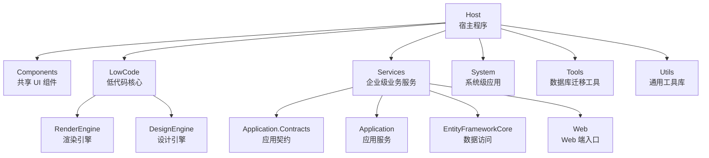
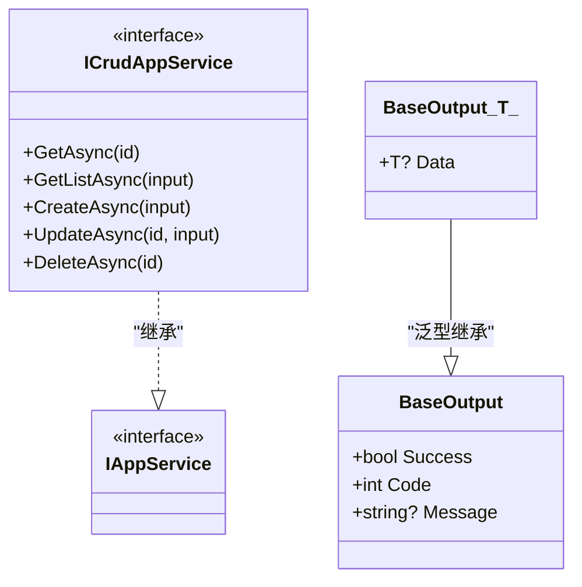
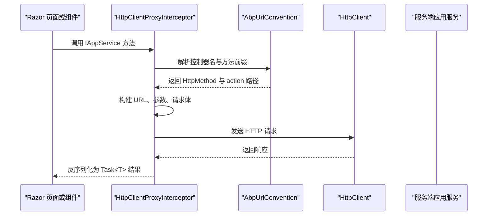
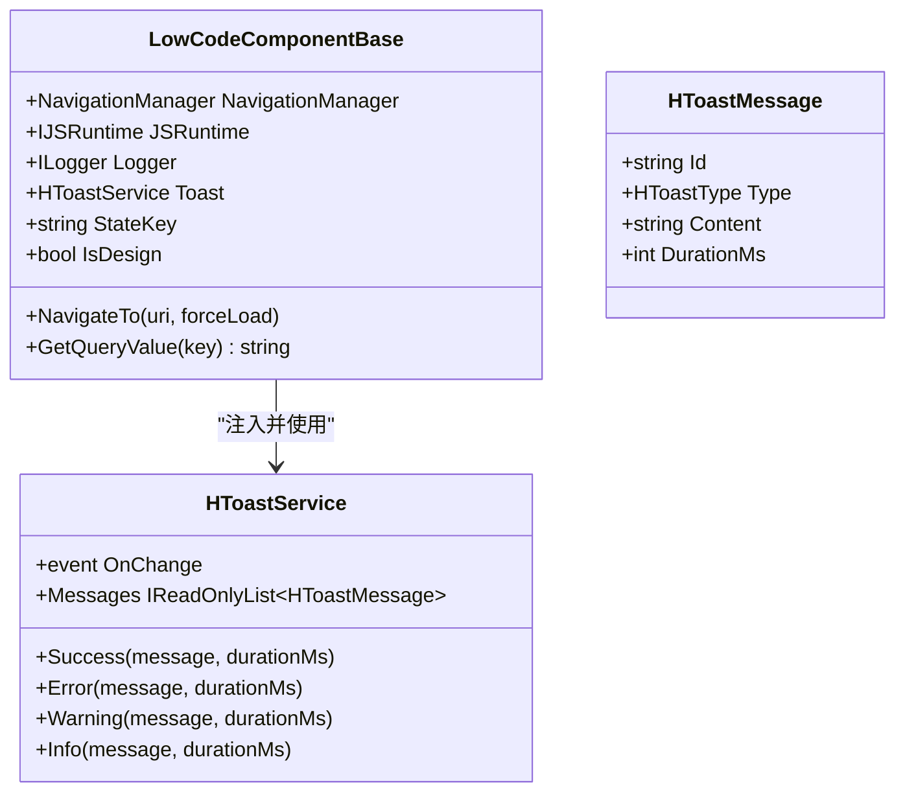
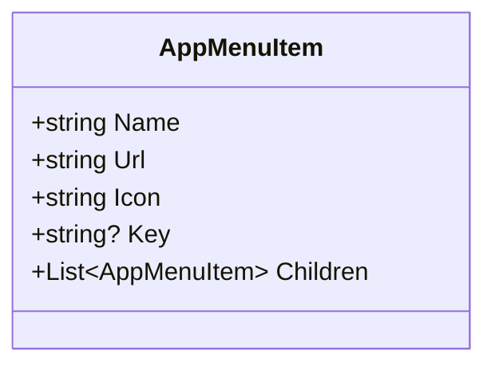
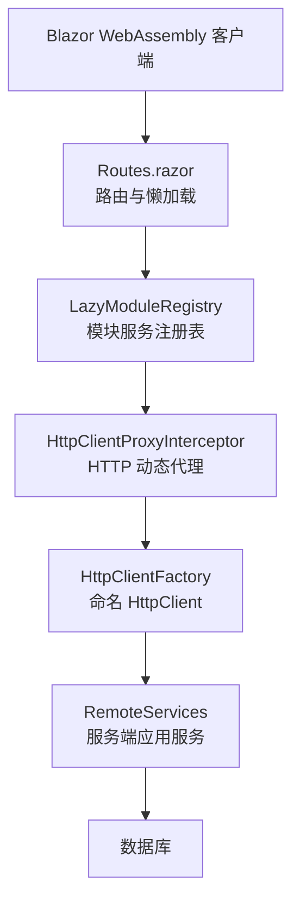
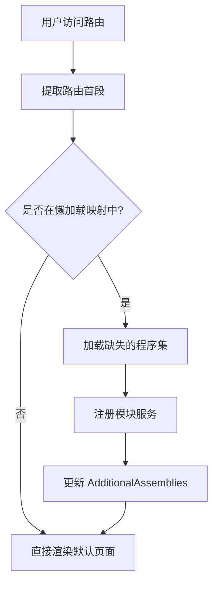
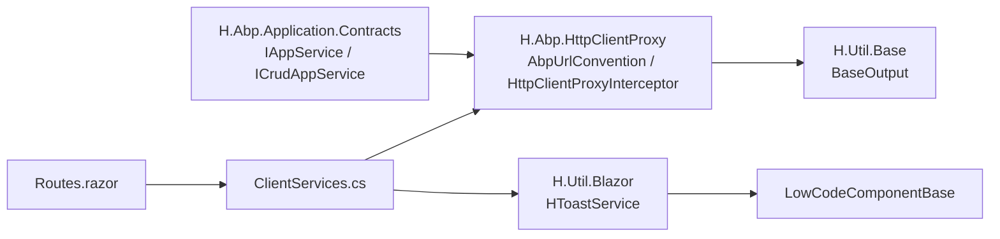

# 代码规范与质量标准

<cite>
**本文引用的文件**   
- [README.md](file://README.md)
- [global.json](file://src/global.json)
- [common.props](file://src/common.props)
- [Directory.Packages.props](file://src/Directory.Packages.props)
- [NuGet.config](file://src/NuGet.config)
- [nuget.pack.props](file://src/nuget.pack.props)
- [IAppService.cs](file://src/Utils/H.Abp.Application.Contracts/IAppService.cs)
- [ICrudAppService.cs](file://src/Utils/H.Abp.Application.Contracts/ICrudAppService.cs)
- [BaseOutput.cs](file://src/Utils/H.Util.Base/BaseOutput.cs)
- [AbpUrlConvention.cs](file://src/Utils/H.Abp.HttpClientProxy/AbpUrlConvention.cs)
- [HttpClientProxyInterceptor.cs](file://src/Utils/H.Abp.HttpClientProxy/HttpClientProxyInterceptor.cs)
- [ServiceCollectionExtensions.cs](file://src/Utils/H.Abp.HttpClientProxy/ServiceCollectionExtensions.cs)
- [HToastService.cs](file://src/Utils/H.Util.Blazor/HToastService.cs)
- [LowCodeComponentBase.cs](file://src/LowCode/Common/H.LowCode.ComponentBase/LowCodeComponentBase.cs)
- [AppMenuItem.cs](file://src/Components/AppDrawer/H.AppDrawer.Model/AppMenuItem.cs)
- [Routes.razor](file://src/Host/H.AppLab.Web.Host/H.AppLab.Web.Host.Client/Routes.razor)
- [ClientServices.cs](file://src/Host/H.AppLab.Web.Host/H.AppLab.Web.Host.Client/ClientServices.cs)
</cite>

## 目录
1. [引言](#引言)
2. [项目结构](#项目结构)
3. [核心组件](#核心组件)
4. [架构总览](#架构总览)
5. [详细组件分析](#详细组件分析)
6. [依赖关系分析](#依赖关系分析)
7. [性能考虑](#性能考虑)
8. [代码规范与质量要求](#代码规范与质量要求)
9. [故障排查指南](#故障排查指南)
10. [结论](#结论)

## 引言
本文件面向 H.AppLab 平台的 C# 与 Blazor 开发者，目标是把仓库中已经体现的编码约定、架构模式、前端组件组织方式以及工具链配置总结为可执行的“代码规范与质量标准”。文档不仅解释“应该怎么写”，还通过仓库中的实际实现说明“为什么这样设计”，并给出代码审查清单和自动化检查建议。

项目整体基于 .NET + Blazor，采用模块化架构，支持单体部署与按服务独立部署；前端以 Blazor Web App（Server + WebAssembly）为主，后端按限界上下文拆分为多个 Services，并通过统一的应用契约、HTTP 动态代理和低代码渲染引擎组合成平台能力。

**章节来源**
- [README.md:1-73](file://README.md#L1-L73)

## 项目结构
仓库以 `src` 为核心工程目录，分层清晰：

| 目录 | 职责 | 典型产物 |
|---|---|---|
| `src/Host` | 宿主程序，负责服务注册与启动，不包含业务逻辑 | `H.AppLab.Web.Host`、各单服务宿主 |
| `src/Components` | 跨应用共享 UI 组件 | `H.AppDrawer.Components`、`H.AppDrawer.Model` |
| `src/LowCode` | 低代码核心：元数据、设计器、渲染引擎 | `Common`、`DesignEngine`、`RenderEngine`、`meta` |
| `src/Services` | 按领域划分的后端服务模块 | `Account`、`Order`、`Approval`、`AI` 等 |
| `src/System` | 系统级应用，与业务服务隔离 | `Enterprise`、`SystemPortal` |
| `src/Tools` | 数据库迁移控制台程序 | 各服务的 `DbMigrator` |
| `src/Utils` | 通用库与工具 | ABP 契约扩展、HTTP 代理、Blazor 工具、ID 生成 |

**图表来源**
- [README.md:1-73](file://README.md#L1-L73)

**章节来源**
- [README.md:1-73](file://README.md#L1-L73)

## 核心组件
本节聚焦仓库中与“代码规范”直接相关的核心抽象：应用契约、统一返回体、HTTP 动态代理、Blazor 组件基类、Toast 提示服务和菜单模型。

### 应用契约与 CRUD 约定
- `IAppService` 是标记接口，用于标识可通过 HTTP 代理远程调用的服务接口。
- `ICrudAppService<TEntityDto, TKey, TGetListInput, TCreateInput, TUpdateInput>` 提供标准 CRUD 签名，与 ABP 风格保持一致。
- 所有应用服务方法普遍返回 `Task<BaseOutput<T>>`，保证前后端统一响应语义。

**图表来源**
- [IAppService.cs:1-8](file://src/Utils/H.Abp.Application.Contracts/IAppService.cs#L1-L8)
- [ICrudAppService.cs:1-15](file://src/Utils/H.Abp.Application.Contracts/ICrudAppService.cs#L1-L15)
- [BaseOutput.cs:1-52](file://src/Utils/H.Util.Base/BaseOutput.cs#L1-L52)

**章节来源**
- [IAppService.cs:1-8](file://src/Utils/H.Abp.Application.Contracts/IAppService.cs#L1-L8)
- [ICrudAppService.cs:1-15](file://src/Utils/H.Abp.Application.Contracts/ICrudAppService.cs#L1-L15)
- [BaseOutput.cs:1-52](file://src/Utils/H.Util.Base/BaseOutput.cs#L1-L52)

### HTTP 动态代理机制
客户端不手写 `HttpClient` 调用，而是通过 `AddHttpClientProxies` 扫描所有继承 `IAppService` 的接口，使用 `DispatchProxy` 拦截方法调用，并根据 ABP 路由约定转换为 HTTP 请求。

**图表来源**
- [HttpClientProxyInterceptor.cs:1-200](file://src/Utils/H.Abp.HttpClientProxy/HttpClientProxyInterceptor.cs#L1-L200)
- [AbpUrlConvention.cs:1-86](file://src/Utils/H.Abp.HttpClientProxy/AbpUrlConvention.cs#L1-L86)
- [ServiceCollectionExtensions.cs:1-63](file://src/Utils/H.Abp.HttpClientProxy/ServiceCollectionExtensions.cs#L1-L63)

**章节来源**
- [AbpUrlConvention.cs:1-86](file://src/Utils/H.Abp.HttpClientProxy/AbpUrlConvention.cs#L1-L86)
- [HttpClientProxyInterceptor.cs:1-200](file://src/Utils/H.Abp.HttpClientProxy/HttpClientProxyInterceptor.cs#L1-L200)
- [ServiceCollectionExtensions.cs:1-63](file://src/Utils/H.Abp.HttpClientProxy/ServiceCollectionExtensions.cs#L1-L63)

### Blazor 组件基类与 Toast 提示
- `LowCodeComponentBase` 封装了注入的导航、JS 互操作、日志工厂、Toast 服务，并提供 `NavigateTo`、`GetQueryValue`、`IsDesign` 等常用能力。
- `HToastService` 提供全局 Toast 消息，支持成功、错误、警告、信息四种类型，并在指定时长后自动消失。

**图表来源**
- [LowCodeComponentBase.cs:1-61](file://src/LowCode/Common/H.LowCode.ComponentBase/LowCodeComponentBase.cs#L1-L61)
- [HToastService.cs:1-82](file://src/Utils/H.Util.Blazor/HToastService.cs#L1-L82)

**章节来源**
- [LowCodeComponentBase.cs:1-61](file://src/LowCode/Common/H.LowCode.ComponentBase/LowCodeComponentBase.cs#L1-L61)
- [HToastService.cs:1-82](file://src/Utils/H.Util.Blazor/HToastService.cs#L1-L82)

### 菜单与应用抽屉模型
`AppMenuItem` 表示应用抽屉中的菜单项，包含名称、URL、图标、唯一 Key 与子菜单列表，适合树形菜单场景。

**图表来源**
- [AppMenuItem.cs:1-21](file://src/Components/AppDrawer/H.AppDrawer.Model/AppMenuItem.cs#L1-L21)

**章节来源**
- [AppMenuItem.cs:1-21](file://src/Components/AppDrawer/H.AppDrawer.Model/AppMenuItem.cs#L1-L21)

## 架构总览
从运行时视角看，H.AppLab 的前端在 Blazor WebAssembly 中运行，通过懒加载机制按需下载模块程序集，再根据路由首段注册对应模块的 HTTP 代理与服务；后端则以 ABP 风格的 Application Service 暴露接口，前端通过 `IAppService` 动态代理进行调用。

**图表来源**
- [Routes.razor:1-145](file://src/Host/H.AppLab.Web.Host/H.AppLab.Web.Host.Client/Routes.razor#L1-L145)
- [ClientServices.cs:1-193](file://src/Host/H.AppLab.Web.Host/H.AppLab.Web.Host.Client/ClientServices.cs#L1-L193)
- [HttpClientProxyInterceptor.cs:1-200](file://src/Utils/H.Abp.HttpClientProxy/HttpClientProxyInterceptor.cs#L1-L200)

**章节来源**
- [Routes.razor:1-145](file://src/Host/H.AppLab.Web.Host/H.AppLab.Web.Host.Client/Routes.razor#L1-L145)
- [ClientServices.cs:1-193](file://src/Host/H.AppLab.Web.Host/H.AppLab.Web.Host.Client/ClientServices.cs#L1-L193)

## 详细组件分析

### 应用服务开发规范
应用服务应遵循以下约定：

| 维度 | 规范 | 依据 |
|---|---|---|
| 接口定义 | 业务接口继承 `IAppService`，CRUD 接口优先继承 `ICrudAppService` | [IAppService.cs:1-8](file://src/Utils/H.Abp.Application.Contracts/IAppService.cs#L1-L8)、[ICrudAppService.cs:1-15](file://src/Utils/H.Abp.Application.Contracts/ICrudAppService.cs#L1-L15) |
| 返回值 | 统一返回 `Task<BaseOutput<T>>`，成功时 `Success=true`、`Code=0` | [BaseOutput.cs:1-52](file://src/Utils/H.Util.Base/BaseOutput.cs#L1-L52) |
| 方法命名 | 使用 ABP 约定前缀：`Get`、`Create`、`Update`、`Delete`、`GetList` 等 | [AbpUrlConvention.cs:1-86](file://src/Utils/H.Abp.HttpClientProxy/AbpUrlConvention.cs#L1-L86) |
| 参数传递 | GET/DELETE 的复杂对象展开为查询参数；POST/PUT 的复杂对象放入请求体 | [HttpClientProxyInterceptor.cs:1-200](file://src/Utils/H.Abp.HttpClientProxy/HttpClientProxyInterceptor.cs#L1-L200) |
| ID 参数 | 名为 `id` 的简单类型参数作为路径段；以 `Id` 结尾且唯一的简单类型参数放在 action 之后 | [HttpClientProxyInterceptor.cs:1-200](file://src/Utils/H.Abp.HttpClientProxy/HttpClientProxyInterceptor.cs#L1-L200) |
| 异常处理 | 应用层尽量不向上抛出未包装异常；错误通过 `BaseOutput` 表达失败状态 | [BaseOutput.cs:1-52](file://src/Utils/H.Util.Base/BaseOutput.cs#L1-L52) |

#### 正确写法要点
- 接口命名为 `IXxxAppService`，方法使用 `GetXxxAsync`、`CreateXxxAsync`、`UpdateXxxAsync`、`DeleteXxxAsync`。
- 返回体始终包裹在 `BaseOutput<T>` 中，前端根据 `Success` 和 `Code` 判断结果。
- 对分页查询使用带输入对象的 DTO，避免过多零散查询参数。

#### 需要避免的写法
- 直接返回原始实体或原始异常。
- 方法命名不符合 ABP 约定，导致前端代理无法映射到正确 HTTP 动词。
- 在 GET 请求中放置复杂对象作为 JSON 请求体。

**章节来源**
- [ICrudAppService.cs:1-15](file://src/Utils/H.Abp.Application.Contracts/ICrudAppService.cs#L1-L15)
- [BaseOutput.cs:1-52](file://src/Utils/H.Util.Base/BaseOutput.cs#L1-L52)
- [AbpUrlConvention.cs:1-86](file://src/Utils/H.Abp.HttpClientProxy/AbpUrlConvention.cs#L1-L86)
- [HttpClientProxyInterceptor.cs:1-200](file://src/Utils/H.Abp.HttpClientProxy/HttpClientProxyInterceptor.cs#L1-L200)

### Blazor 组件开发规范
组件开发应围绕 `LowCodeComponentBase` 和统一的 UI 工具进行：

| 维度 | 规范 | 依据 |
|---|---|---|
| 组件基类 | 自定义组件继承 `LowCodeComponentBase`，复用导航、日志、Toast、设计态判断 | [LowCodeComponentBase.cs:1-61](file://src/LowCode/Common/H.LowCode.ComponentBase/LowCodeComponentBase.cs#L1-L61) |
| 属性定义 | 使用 `[Parameter]` 定义可配置属性，对外暴露必要状态 | 仓库中多处 Razor 组件均使用 `[Parameter]` |
| 事件处理 | 使用 `EventCallback` 或 `EventCallback<T>` 通知父组件 | 仓库中 Modal、Navbar 等组件均使用 |
| 样式组织 | 组件样式与组件文件就近管理，避免全局样式污染 | 组件化目录结构体现该实践 |
| 用户反馈 | 通过 `HToastService` 展示成功、错误、警告、信息提示 | [HToastService.cs:1-82](file://src/Utils/H.Util.Blazor/HToastService.cs#L1-L82) |
| 导航 | 使用 `NavigateTo` 而非直接操作 `NavigationManager`，便于测试与扩展 | [LowCodeComponentBase.cs:1-61](file://src/LowCode/Common/H.LowCode.ComponentBase/LowCodeComponentBase.cs#L1-L61) |

#### 组件生命周期与状态
- 组件应尽量减少自身可变状态，优先通过参数控制行为。
- 若需维护内部状态，应在适当时机调用 `StateHasChanged` 触发重新渲染。
- 异步任务应避免阻塞 UI 线程，建议使用 `async` 方法与 `await`。

#### 事件与双向绑定
- 对表单控件，优先使用 Blazor 的双向绑定语法。
- 对模态框、下拉框等交互组件，使用 `EventCallback` 暴露状态变化，由父组件接管业务逻辑。

**章节来源**
- [LowCodeComponentBase.cs:1-61](file://src/LowCode/Common/H.LowCode.ComponentBase/LowCodeComponentBase.cs#L1-L61)
- [HToastService.cs:1-82](file://src/Utils/H.Util.Blazor/HToastService.cs#L1-L82)

### 前端路由与懒加载规范
`Routes.razor` 定义了路由与懒加载程序集映射，将路由首段映射到一组程序集，并在导航时按需加载。

**图表来源**
- [Routes.razor:1-145](file://src/Host/H.AppLab.Web.Host/H.AppLab.Web.Host.Client/Routes.razor#L1-L145)

**章节来源**
- [Routes.razor:1-145](file://src/Host/H.AppLab.Web.Host/H.AppLab.Web.Host.Client/Routes.razor#L1-L145)

### 客户端服务注册规范
`ClientServices` 集中管理客户端服务注册，包括远程服务名称常量、HTTP 客户端配置、Cookie 处理器、模块懒加载服务注册表。

| 类别 | 内容 |
|---|---|
| 远程服务名称 | 每个业务模块对应一个 `RemoteServiceName` 常量 |
| HTTP 客户端 | 为每个模块注册命名 `HttpClient`，并附加 Cookie 与 AppId 处理器 |
| 特殊超时 | `Testing` 模块设置无限超时，避免长时间测试执行被取消 |
| 模块注册 | 路由首段映射到模块 key，懒加载完成后延迟注册代理和服务 |

**章节来源**
- [ClientServices.cs:1-193](file://src/Host/H.AppLab.Web.Host/H.AppLab.Web.Host.Client/ClientServices.cs#L1-L193)

## 依赖关系分析

**图表来源**
- [IAppService.cs:1-8](file://src/Utils/H.Abp.Application.Contracts/IAppService.cs#L1-L8)
- [ICrudAppService.cs:1-15](file://src/Utils/H.Abp.Application.Contracts/ICrudAppService.cs#L1-L15)
- [BaseOutput.cs:1-52](file://src/Utils/H.Util.Base/BaseOutput.cs#L1-L52)
- [AbpUrlConvention.cs:1-86](file://src/Utils/H.Abp.HttpClientProxy/AbpUrlConvention.cs#L1-L86)
- [HttpClientProxyInterceptor.cs:1-200](file://src/Utils/H.Abp.HttpClientProxy/HttpClientProxyInterceptor.cs#L1-L200)
- [HToastService.cs:1-82](file://src/Utils/H.Util.Blazor/HToastService.cs#L1-L82)
- [LowCodeComponentBase.cs:1-61](file://src/LowCode/Common/H.LowCode.ComponentBase/LowCodeComponentBase.cs#L1-L61)
- [Routes.razor:1-145](file://src/Host/H.AppLab.Web.Host/H.AppLab.Web.Host.Client/Routes.razor#L1-L145)
- [ClientServices.cs:1-193](file://src/Host/H.AppLab.Web.Host/H.AppLab.Web.Host.Client/ClientServices.cs#L1-L193)

**章节来源**
- [ClientServices.cs:1-193](file://src/Host/H.AppLab.Web.Host/H.AppLab.Web.Host.Client/ClientServices.cs#L1-L193)

## 性能考虑
- **WebAssembly 懒加载**：首页仅加载必要程序集，其他模块在导航时按需下载，减少初始包体积。
- **AOT 与裁剪**：Release 模式启用 AOT 与 Trimming，进一步降低客户端资源占用。
- **HTTP 超时优化**：长耗时模块（如 Testing）使用无限超时，避免中途取消导致数据丢失。
- **JSON 序列化选项**：代理层统一使用驼峰命名策略，减少前后端字段不一致带来的额外转换成本。

这些特性在 README、Routes 与 ClientServices 中均有明确体现。

**章节来源**
- [README.md:1-73](file://README.md#L1-L73)
- [Routes.razor:1-145](file://src/Host/H.AppLab.Web.Host/H.AppLab.Web.Host.Client/Routes.razor#L1-L145)
- [ClientServices.cs:1-193](file://src/Host/H.AppLab.Web.Host/H.AppLab.Web.Host.Client/ClientServices.cs#L1-L193)
- [HttpClientProxyInterceptor.cs:1-200](file://src/Utils/H.Abp.HttpClientProxy/HttpClientProxyInterceptor.cs#L1-L200)

## 代码规范与质量要求

### C# 编码规范
| 类别 | 规范 | 说明 |
|---|---|---|
| 目标框架与语言版本 | 统一使用 `net10.0`、`LangVersion=preview`、`Nullable=enable` | 见公共属性文件 |
| SDK 版本 | 使用 `global.json` 锁定 SDK 版本，启用 `latestFeature` 滚动 | 保证团队环境一致 |
| 包版本管理 | 使用 `Directory.Packages.props` 集中管理 NuGet 包版本 | 避免版本漂移 |
| 命名约定 | 接口以 `I` 开头；应用服务接口以 `AppService` 结尾；类与方法使用 PascalCase | 与 ABP 约定一致 |
| 可空引用 | 开启 Nullable，显式表达可空字段 | 提升安全性 |
| 隐式 using | 启用 ImplicitUsings，减少样板代码 | 保持简洁 |
| 返回值 | 应用服务返回 `BaseOutput<T>`，前端根据 `Success`、`Code`、`Message`、`Data` 处理 | 统一响应格式 |
| 异常处理 | 应用层封装业务异常；基础设施层记录日志；UI 层通过 Toast 提示 | 分层关注点分离 |
| 注释规范 | 对公共接口、关键类和方法添加 XML 摘要注释 | 提升可读性与 IntelliSense 体验 |

**章节来源**
- [common.props:1-15](file://src/common.props#L1-L15)
- [global.json:1-6](file://src/global.json#L1-L6)
- [Directory.Packages.props:1-105](file://src/Directory.Packages.props#L1-L105)
- [BaseOutput.cs:1-52](file://src/Utils/H.Util.Base/BaseOutput.cs#L1-L52)

### Blazor 组件开发规范
| 类别 | 规范 | 说明 |
|---|---|---|
| 组件继承 | 自定义组件继承 `LowCodeComponentBase` | 复用导航、日志、Toast、设计态判断 |
| 属性 | 使用 `[Parameter]` 定义输入属性，必要时提供默认值 | 提高组件可复用性 |
| 事件 | 使用 `EventCallback` 暴露事件，避免组件直接耦合业务 | 保持单向数据流 |
| 样式 | 组件样式就近组织，避免全局样式冲突 | 提升可维护性 |
| 主题 | 渲染引擎使用 Ant Design Blazor 主题布局 | 保持 UI 一致性 |
| 用户反馈 | 使用 `HToastService` 显示操作结果 | 统一提示体验 |
| 导航 | 使用 `NavigateTo`，避免直接操作 `NavigationManager` | 便于测试与扩展 |

**章节来源**
- [LowCodeComponentBase.cs:1-61](file://src/LowCode/Common/H.LowCode.ComponentBase/LowCodeComponentBase.cs#L1-L61)
- [HToastService.cs:1-82](file://src/Utils/H.Util.Blazor/HToastService.cs#L1-L82)

### 项目结构与模块划分规范
- **宿主层**：`Host` 只负责服务注册与启动，不写业务逻辑。
- **服务层**：每个业务模块按 `Application.Contracts`、`Application`、`EntityFrameworkCore`、`Web` 分层。
- **低代码层**：`Common` 提供元数据、组件基类与默认组件；`DesignEngine` 负责可视化设计；`RenderEngine` 负责动态渲染。
- **系统层**：`System` 与 `Services` 严格隔离，避免业务系统与平台运营侧耦合。
- **工具层**：`Utils` 提供 ABP 契约扩展、HTTP 代理、Blazor 工具、ID 生成等基础能力。
- **迁移工具**：`Tools` 下每个服务有独立 `DbMigrator` 控制台程序。

**章节来源**
- [README.md:1-73](file://README.md#L1-L73)

### 代码审查清单
在提交代码前，请对照以下清单自查：

| 审查项 | 检查点 |
|---|---|
| 命名 | 接口以 `I` 开头，应用服务以 `AppService` 结尾，类和方法使用 PascalCase |
| 返回值 | 应用服务是否返回 `BaseOutput<T>`，是否正确使用 `Success`、`Code`、`Message` |
| 方法命名 | 是否符合 ABP 约定前缀，能否被 HTTP 代理正确映射 |
| 参数设计 | GET/DELETE 是否避免复杂对象；POST/PUT 是否正确放置请求体 |
| 异常处理 | 是否避免直接抛出未包装异常；是否记录必要日志 |
| Blazor 组件 | 是否继承 `LowCodeComponentBase`；是否使用 `[Parameter]` 和 `EventCallback` |
| 用户反馈 | 是否通过 `HToastService` 提示操作结果 |
| 依赖注册 | 新模块是否添加远程服务名称常量、HTTP 客户端、懒加载映射 |
| 懒加载 | 新程序集是否加入 `Routes.razor` 的懒加载映射 |
| 包版本 | 新增依赖是否加入 `Directory.Packages.props` |
| 可空引用 | 是否启用 Nullable 并正确处理可空类型 |
| 注释 | 公共 API 是否有 XML 摘要注释 |

### 质量检查工具配置建议
当前仓库未发现 `.editorconfig`、StyleCop、SonarQube 配置文件，但已具备以下可用于集成质量检查的基础：

| 工具 | 当前状态 | 建议配置 |
|---|---|---|
| Roslyn 分析器 | 依赖中包含 `Microsoft.CodeAnalysis.CSharp` 等 | 在项目或解决方案级别启用 Roslyn 规则集，结合 Nullable、ImplicitUsings |
| StyleCop | 未发现 StyleCop 规则文件或 Analyzer 引用 | 引入 `StyleCop.Analyzers`，启用命名、顺序、空白行等规则 |
| SonarQube | 未发现 SonarQube 配置 | 在 CI 中集成 SonarScanner，配合 SonarQube/SonarCloud 进行分析 |
| NuGet 包版本管理 | 已启用集中版本管理 | 继续使用 `Directory.Packages.props`，定期审计过期包 |
| 构建与打包 | 已有 `common.props`、`nuget.pack.props` | 在 CI 中加入编译、静态分析、打包目标 |

由于仓库中没有现有 StyleCop 或 SonarQube 配置，建议在以下位置新增配置：

- 根级或 `src` 级 `.editorconfig`：统一缩进、换行、using 排序、空行规则。
- 根级或 `src` 级 `Directory.Build.props`：统一引入 StyleCop、Roslyn 分析器。
- CI 流水线：在执行 `dotnet build` 后增加 `dotnet format`、`dotnet analyze`、SonarScanner 步骤。
- NuGet 源：继续使用 `src/NuGet.config`，确保只允许受信任源。

**章节来源**
- [Directory.Packages.props:1-105](file://src/Directory.Packages.props#L1-L105)
- [NuGet.config:1-7](file://src/NuGet.config#L1-L7)
- [nuget.pack.props:1-22](file://src/nuget.pack.props#L1-L22)
- [common.props:1-15](file://src/common.props#L1-L15)

## 故障排查指南

### HTTP 代理调用失败
常见问题及排查方向：

| 现象 | 可能原因 | 排查建议 |
|---|---|---|
| 前端调用接口返回 404 | 方法名不符合 ABP 约定，或控制器名映射错误 | 检查接口命名、`AbpUrlConvention` 映射规则 |
| POST/PUT 请求体为空 | 复杂参数未被识别为 body 参数 | 确认参数类型是否为简单类型，复杂对象应放在请求体 |
| ID 参数未进入 URL | `id` 或 `*Id` 参数类型不是简单类型 | 检查参数类型是否为字符串、Guid、整数等简单类型 |
| 查询参数未序列化 | GET/DELETE 复杂对象未按属性展开 | 确认代理是否处于 GET/DELETE 分支，并检查属性可访问性 |
| 认证 Cookie 未携带 | 未注册 `CookieHandler` 或未挂载到命名 HttpClient | 检查 `ClientServices` 中 HTTP 客户端注册 |

**章节来源**
- [AbpUrlConvention.cs:1-86](file://src/Utils/H.Abp.HttpClientProxy/AbpUrlConvention.cs#L1-L86)
- [HttpClientProxyInterceptor.cs:1-200](file://src/Utils/H.Abp.HttpClientProxy/HttpClientProxyInterceptor.cs#L1-L200)
- [ClientServices.cs:1-193](file://src/Host/H.AppLab.Web.Host/H.AppLab.Web.Host.Client/ClientServices.cs#L1-L193)

### Blazor 组件状态不更新
| 现象 | 可能原因 | 排查建议 |
|---|---|---|
| 修改状态后 UI 未刷新 | 未在异步回调或事件处理中触发状态变更 | 检查是否需要调用 `StateHasChanged` 或使用 Blazor 内置绑定 |
| Toast 不显示 | `HToastService` 未注入或组件未使用 | 检查依赖注入与组件中是否调用 Toast 方法 |
| 导航无效 | 直接使用 `NavigationManager` 而非基类方法 | 改为使用 `NavigateTo` |

**章节来源**
- [LowCodeComponentBase.cs:1-61](file://src/LowCode/Common/H.LowCode.ComponentBase/LowCodeComponentBase.cs#L1-L61)
- [HToastService.cs:1-82](file://src/Utils/H.Util.Blazor/HToastService.cs#L1-L82)

### 懒加载模块服务未解析
| 现象 | 可能原因 | 排查建议 |
|---|---|---|
| 导航到新模块后 DI 解析失败 | 模块程序集未加载或服务未延迟注册 | 检查 `Routes.razor` 映射与 `ClientServices` 中模块注册 |
| 重复加载程序集 | 懒加载缓存未生效 | 检查 `_loadedAssemblies` 缓存逻辑 |
| 模块间共享服务缺失 | 未转发根容器服务 | 检查 `RegisterLazyModule` 中是否转发 `RemoteServiceOptions`、`IHttpClientFactory`、`IJSRuntime` |

**章节来源**
- [Routes.razor:1-145](file://src/Host/H.AppLab.Web.Host/H.AppLab.Web.Host.Client/Routes.razor#L1-L145)
- [ClientServices.cs:1-193](file://src/Host/H.AppLab.Web.Host/H.AppLab.Web.Host.Client/ClientServices.cs#L1-L193)

## 结论
H.AppLab 的代码规范以 ABP 约定、统一响应体、HTTP 动态代理、Blazor 组件基类和模块化架构为基础。开发者应重点遵循接口命名、返回值封装、参数传递、组件属性与事件、懒加载模块注册等约定。虽然仓库尚未包含 StyleCop、SonarQube 或 `.editorconfig` 配置，但已具备足够的结构和工具基础来逐步建立完整的静态分析与质量门禁体系。

在实际工程中，建议优先落地以下改进：
1. 引入 `.editorconfig` 统一代码格式。
2. 引入 StyleCop 与 Roslyn 分析器，固化命名与代码质量规则。
3. 在 CI 中集成 SonarQube 或 SonarCloud，形成持续质量报告。
4. 对所有新增模块严格执行懒加载映射与 HTTP 代理注册规范。
5. 对所有应用服务统一使用 `BaseOutput<T>`，并对异常进行分层处理。