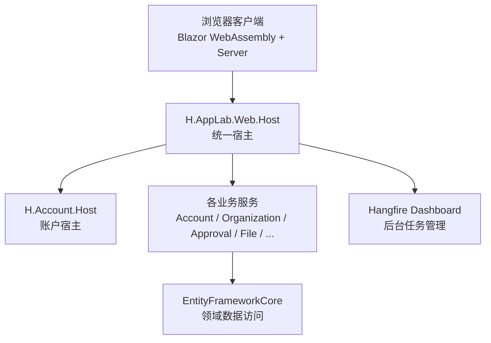
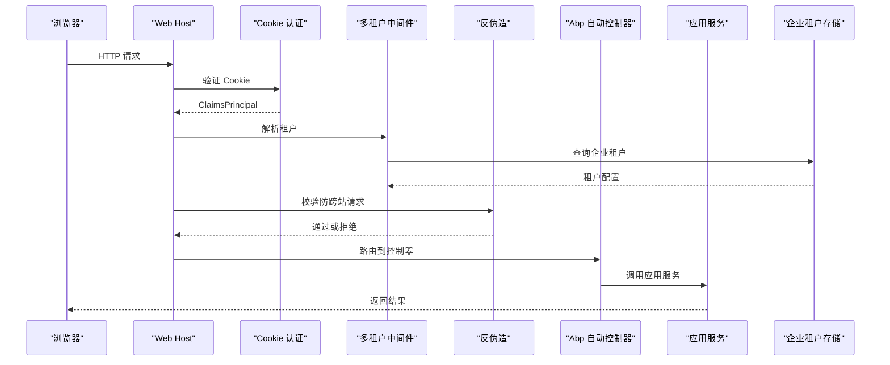
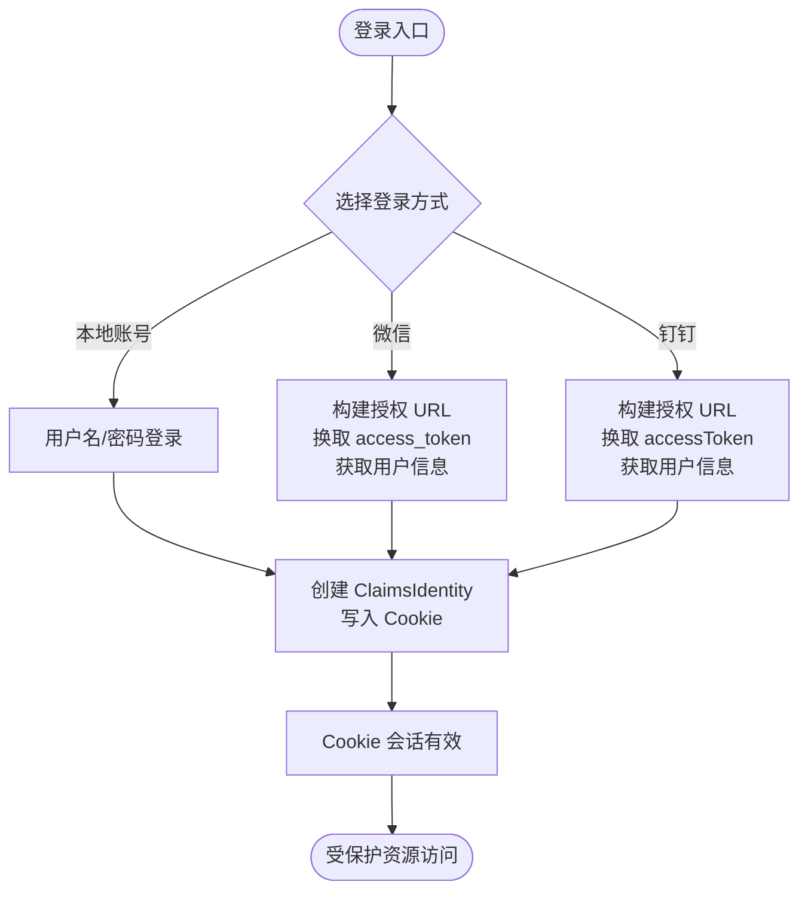
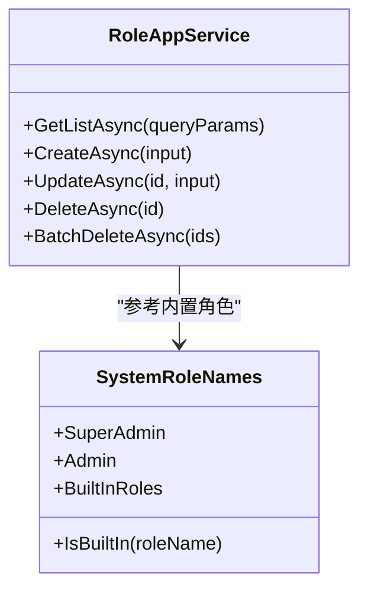
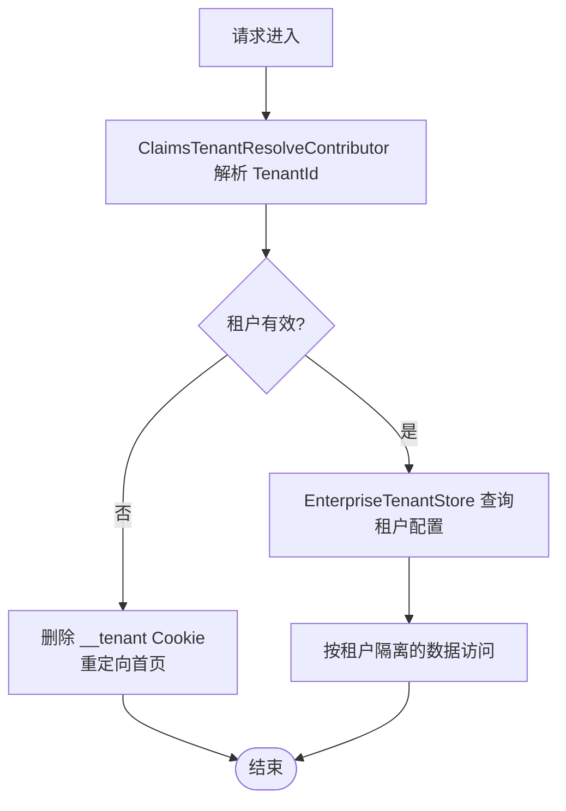
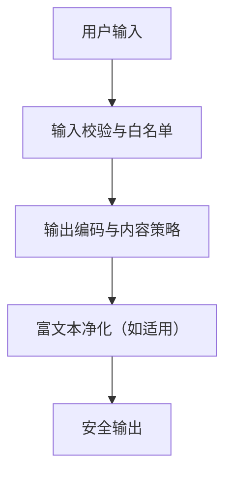
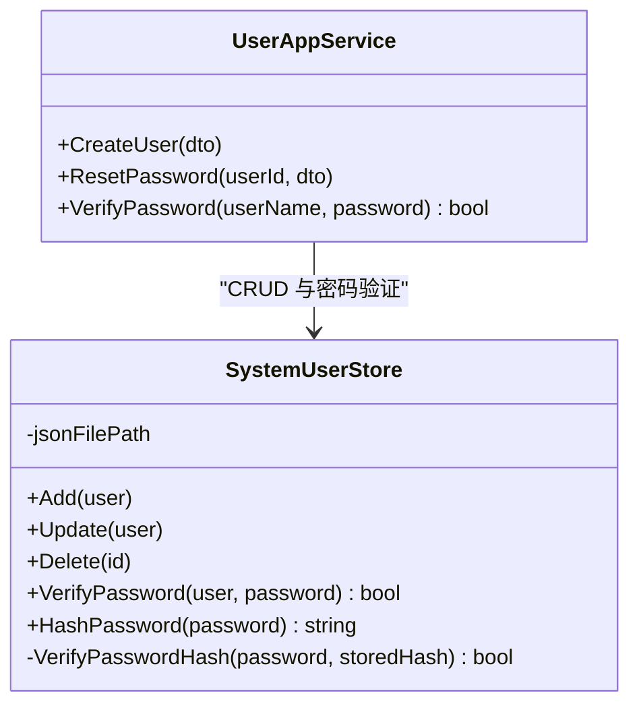
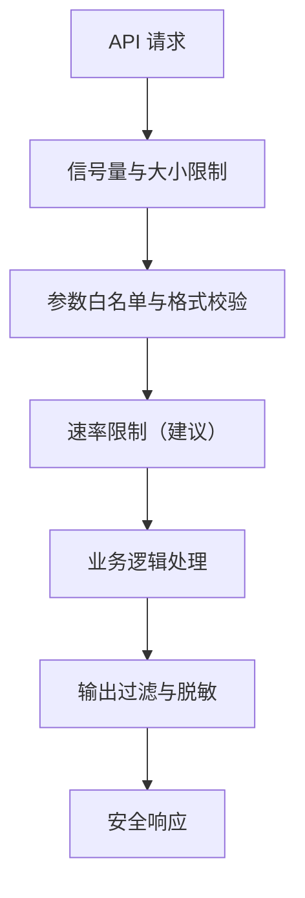
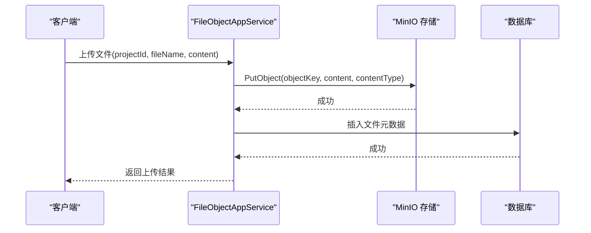
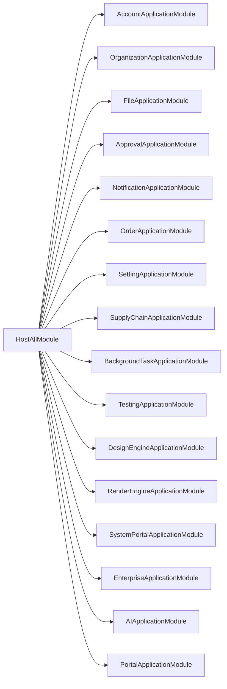

# 安全加固与防护

<cite>
**本文引用的文件列表**   
- [README.md](file://README.md)
- [Program.cs（Web Host）](file://src/Host/H.AppLab.Web.Host/H.AppLab.Web.Host/Program.cs)
- [HostAllModule.cs](file://src/Host/H.AppLab.Web.Host/H.AppLab.Web.Host/HostAllModule.cs)
- [ClaimsTenantResolveContributor.cs](file://src/Host/H.AppLab.Web.Host/H.AppLab.Web.Host/ClaimsTenantResolveContributor.cs)
- [Program.cs（Account Host）](file://src/Host/Account/H.Account.Host/Program.cs)
- [AccountHostModule.cs](file://src/Host/Account/H.Account.Host/AccountHostModule.cs)
- [ExternalLoginAppService.cs](file://src/Services/Account/H.Account.Application/ExternalLogin/ExternalLoginAppService.cs)
- [WeChatAuthService.cs](file://src/Services/Account/H.Account.Application/ExternalLogin/WeChatAuthService.cs)
- [DingTalkAuthService.cs](file://src/Services/Account/H.Account.Application/ExternalLogin/DingTalkAuthService.cs)
- [EnterpriseTenantStore.cs](file://src/System/Enterprise/H.Enterprise.EntityFrameworkCore/EnterpriseTenantStore.cs)
- [UserAppService.cs（SystemPortal）](file://src/System/SystemPortal/H.SystemPortal.Application/Services/UserAppService.cs)
- [SystemUserStore.cs](file://src/System/SystemPortal/H.SystemPortal.Application/Services/SystemUserStore.cs)
- [SystemRoleNames.cs](file://src/System/SystemPortal/H.SystemPortal.Application.Contracts/Constants/SystemRoleNames.cs)
- [FileObjectAppService.cs](file://src/Services/File/H.File.Application/Services/FileObjectAppService.cs)
</cite>

## 目录
1. [引言](#引言)
2. [项目结构](#项目结构)
3. [核心组件](#核心组件)
4. [架构总览](#架构总览)
5. [详细组件分析](#详细组件分析)
6. [依赖关系分析](#依赖关系分析)
7. [性能与安全权衡](#性能与安全权衡)
8. [故障排查指南](#故障排查指南)
9. [结论](#结论)
10. [附录：安全加固清单](#附录安全加固清单)

## 引言
本文件面向 H.AppLab 平台，从代码实现出发，梳理身份认证、授权、多租户隔离、输入输出校验、数据存储、外部登录、文件上传等关键安全机制，并给出针对常见 Web 威胁的防护措施建议、审计日志实践以及漏洞扫描与渗透测试指导。文档目标是在不改变现有功能的前提下，帮助开发者理解当前安全能力边界，并明确后续加固方向。

## 项目结构
H.AppLab 采用模块化架构，支持单体部署与服务独立部署。整体结构可概括为：
- Host：宿主程序，负责服务注册、HTTP 管线配置、Blazor 与 SignalR 集成。
- Services：按限界上下文划分的业务服务，每个服务包含 Application、Application.Contracts、EntityFrameworkCore、Web 分层。
- System：系统级应用，如 Enterprise、SystemPortal，用于平台运营与管理。
- LowCode：低代码核心，包含设计引擎与渲染引擎。
- Utils：通用工具库，如 HttpClient 代理、Blazor 工具、ID 生成器。
- Tools：数据库迁移工具集。

图表来源
- [Program.cs（Web Host）:1-112](file://src/Host/H.AppLab.Web.Host/H.AppLab.Web.Host/Program.cs#L1-L112)
- [HostAllModule.cs:1-200](file://src/Host/H.AppLab.Web.Host/H.AppLab.Web.Host/HostAllModule.cs#L1-L200)

章节来源
- [README.md:1-73](file://README.md#L1-L73)
- [Program.cs（Web Host）:1-112](file://src/Host/H.AppLab.Web.Host/H.AppLab.Web.Host/Program.cs#L1-L112)
- [HostAllModule.cs:1-200](file://src/Host/H.AppLab.Web.Host/H.AppLab.Web.Host/HostAllModule.cs#L1-L200)

## 核心组件
本节聚焦与安全相关的关键组件：
- 认证与授权：基于 ASP.NET Core Cookie 认证；ABP Identity；外部登录；反伪造令牌。
- 多租户：ABP MultiTenancy；自定义租户解析器；企业租户存储。
- 用户与角色：系统门户用户与角色常量；组织服务中的角色管理。
- 数据安全：密码哈希、敏感配置、连接字符串、MinIO 对象存储。
- API 防护：请求管道、状态码页、异常处理、SignalR 消息大小限制、响应压缩。

章节来源
- [HostAllModule.cs:1-200](file://src/Host/H.AppLab.Web.Host/H.AppLab.Web.Host/HostAllModule.cs#L1-L200)
- [Program.cs（Web Host）:1-112](file://src/Host/H.AppLab.Web.Host/H.AppLab.Web.Host/Program.cs#L1-L112)
- [AccountHostModule.cs:1-76](file://src/Host/Account/H.Account.Host/AccountHostModule.cs#L1-L76)
- [Program.cs（Account Host）:1-48](file://src/Host/Account/H.Account.Host/Program.cs#L1-L48)

## 架构总览
下图展示认证、多租户、API 控制器与后端服务的交互路径：

图表来源
- [Program.cs（Web Host）:40-112](file://src/Host/H.AppLab.Web.Host/H.AppLab.Web.Host/Program.cs#L40-L112)
- [HostAllModule.cs:120-200](file://src/Host/H.AppLab.Web.Host/H.AppLab.Web.Host/HostAllModule.cs#L120-L200)
- [EnterpriseTenantStore.cs:1-86](file://src/System/Enterprise/H.Enterprise.EntityFrameworkCore/EnterpriseTenantStore.cs#L1-L86)

## 详细组件分析

### 身份认证与会话管理
- 认证方案：使用 ASP.NET Core Cookie 认证，默认 Scheme 与一个名为“SystemCookies”的独立 Scheme，分别对应普通登录与系统登录路径。
- 会话策略：设置登录路径、访问被拒路径、固定过期时间与滑动过期。
- 反伪造：在统一宿主中禁用 ABP 自动反伪造校验，注释说明 WASM 前端使用 JSON API + Cookie 认证，SameSite Cookie 提供 CSRF 保护。
- 外部登录：提供微信与钉钉 OAuth2 流程封装，最终通过 ClaimsIdentity 写入 Cookie。

图表来源
- [HostAllModule.cs:140-190](file://src/Host/H.AppLab.Web.Host/H.AppLab.Web.Host/HostAllModule.cs#L140-L190)
- [AccountHostModule.cs:40-76](file://src/Host/Account/H.Account.Host/AccountHostModule.cs#L40-L76)
- [ExternalLoginAppService.cs:1-200](file://src/Services/Account/H.Account.Application/ExternalLogin/ExternalLoginAppService.cs#L1-L200)
- [WeChatAuthService.cs:1-118](file://src/Services/Account/H.Account.Application/ExternalLogin/WeChatAuthService.cs#L1-L118)
- [DingTalkAuthService.cs:1-139](file://src/Services/Account/H.Account.Application/ExternalLogin/DingTalkAuthService.cs#L1-L139)

#### 安全评估与建议
- 当前未启用 JWT Bearer；如需无状态 API 或微服务间调用，应引入 JWT 颁发、验证与刷新策略。
- Cookie 安全：生产环境需确保 SameSite、Secure、HttpOnly；结合 HTTPS 强制跳转与 HSTS。
- 外部登录回调：应严格校验 state、redirect_uri、code 有效性，并进行签名或密钥校验；避免将敏感参数暴露于 URL。
- 会话固定与重放：应启用 SecurityStamp 轮换、登录成功后重新签发凭证。

章节来源
- [HostAllModule.cs:140-190](file://src/Host/H.AppLab.Web.Host/H.AppLab.Web.Host/HostAllModule.cs#L140-L190)
- [AccountHostModule.cs:40-76](file://src/Host/Account/H.Account.Host/AccountHostModule.cs#L40-L76)
- [ExternalLoginAppService.cs:1-200](file://src/Services/Account/H.Account.Application/ExternalLogin/ExternalLoginAppService.cs#L1-L200)
- [WeChatAuthService.cs:1-118](file://src/Services/Account/H.Account.Application/ExternalLogin/WeChatAuthService.cs#L1-L118)
- [DingTalkAuthService.cs:1-139](file://src/Services/Account/H.Account.Application/ExternalLogin/DingTalkAuthService.cs#L1-L139)

### 授权与权限控制
- ABP 框架提供了身份与权限基础设施，当前代码通过 AbpAspNetCoreMvcOptions 注册各模块的控制器，并使用 ApplicationService 作为服务层。
- 系统角色常量定义了内置超级管理员与普通管理员角色名称。
- 组织服务提供角色 CRUD 与成员管理，但未见显式基于角色的访问控制注解。

图表来源
- [RoleAppService.cs:1-200](file://src/services/Organization/H.Organization.Application/Services/RoleAppService.cs#L1-L200)
- [SystemRoleNames.cs:1-29](file://src/System/SystemPortal/H.SystemPortal.Application.Contracts/Constants/SystemRoleNames.cs#L1-L29)

#### 安全评估与建议
- 建议对所有写操作与敏感读接口添加 `[Authorize]` 或 ABP 的 `[AbpAuthorize]` 注解，并结合角色或权限策略进行细粒度控制。
- 对管理端接口实施最小权限原则，避免所有接口默认开放。
- 引入基于资源的授权模型（如 RBAC 扩展），以支撑多租户与多组织的复杂场景。

章节来源
- [HostAllModule.cs:160-200](file://src/Host/H.AppLab.Web.Host/H.AppLab.Web.Host/HostAllModule.cs#L160-L200)
- [SystemRoleNames.cs:1-29](file://src/System/SystemPortal/H.SystemPortal.Application.Contracts/Constants/SystemRoleNames.cs#L1-L29)

### 多租户隔离
- 启用 ABP MultiTenancy，并通过自定义 `ClaimsTenantResolveContributor` 从 Claims 中读取 `TenantId`，优先解析当前租户。
- 自定义 `EnterpriseTenantStore` 从企业实体中读取租户配置，支持独立数据库模式下的连接字符串注入。
- 当租户无效时，中间件清理旧租户 Cookie 并重定向首页，避免阻断请求。

图表来源
- [ClaimsTenantResolveContributor.cs:1-29](file://src/Host/H.AppLab.Web.Host/H.AppLab.Web.Host/ClaimsTenantResolveContributor.cs#L1-L29)
- [EnterpriseTenantStore.cs:1-86](file://src/System/Enterprise/H.Enterprise.EntityFrameworkCore/EnterpriseTenantStore.cs#L1-L86)
- [HostAllModule.cs:170-200](file://src/Host/H.AppLab.Web.Host/H.AppLab.Web.Host/HostAllModule.cs#L170-L200)

#### 安全评估与建议
- 建议在解析前对 `TenantId` 进行白名单校验，防止非法租户标识。
- 在多租户数据访问层统一附加租户过滤条件，避免业务逻辑遗漏导致跨租户数据泄露。
- 对独立数据库模式，建议加强连接字符串加密与访问控制。

章节来源
- [ClaimsTenantResolveContributor.cs:1-29](file://src/Host/H.AppLab.Web.Host/H.AppLab.Web.Host/ClaimsTenantResolveContributor.cs#L1-L29)
- [EnterpriseTenantStore.cs:1-86](file://src/System/Enterprise/H.Enterprise.EntityFrameworkCore/EnterpriseTenantStore.cs#L1-L86)
- [HostAllModule.cs:170-200](file://src/Host/H.AppLab.Web.Host/H.AppLab.Web.Host/HostAllModule.cs#L170-L200)

### 常见 Web 安全威胁防护
- SQL 注入：当前数据访问主要通过 EF Core 与 Repository，减少了直接拼接 SQL 的风险；但部分查询使用字符串 Contains，应避免拼接用户输入。
- XSS 攻击：前端 Blazor 通常具备内置 HTML 转义；服务端应限制富文本输入，必要时启用输出编码与内容安全策略。
- CSRF 攻击：统一宿主禁用 ABP 自动反伪造，依赖 SameSite Cookie；对于非交互式 API，建议引入请求签名或临时令牌。
- 文件上传：文件上传至 MinIO，使用服务端代理下载与预览；需限制文件类型、大小、内容检测与存储配额。

#### 安全评估与建议
- 在所有输入点增加强类型校验、长度限制、正则白名单与范围检查。
- 对富文本输入使用安全的 HTML 净化库，禁止危险标签与事件处理器。
- 为 API 启用请求体大小限制、速率限制与重试退避策略。
- 文件上传必须校验扩展名、MIME 类型、魔数、大小与病毒扫描结果。

章节来源
- [Program.cs（Web Host）:1-112](file://src/Host/H.AppLab.Web.Host/H.AppLab.Web.Host/Program.cs#L1-L112)
- [HostAllModule.cs:150-200](file://src/Host/H.AppLab.Web.Host/H.AppLab.Web.Host/HostAllModule.cs#L150-L200)

### 数据安全保护
- 密码存储：系统门户用户服务使用 PBKDF2（SHA256，迭代次数 100000）加盐哈希，并在首次明文登录时自动迁移为哈希。
- 敏感配置：外部登录客户端 ID/Secret 通过配置绑定；连接字符串在独立租户模式下由租户存储注入。
- 传输安全：统一宿主启用 HTTPS 重定向与 HSTS（生产环境）。

图表来源
- [SystemUserStore.cs:1-200](file://src/System/SystemPortal/H.SystemPortal.Application/Services/SystemUserStore.cs#L1-L200)
- [UserAppService.cs:1-200](file://src/System/SystemPortal/H.SystemPortal.Application/Services/UserAppService.cs#L1-L200)

#### 安全评估与建议
- 提升 PBKDF2 迭代次数与算法强度（例如切换到 Argon2），并定期更新策略。
- 对配置文件与连接字符串实施加密存储与访问控制，避免明文泄露。
- 在生产环境强制启用 HTTPS 与 HSTS，限制不安全协议与弱加密套件。

章节来源
- [SystemUserStore.cs:1-200](file://src/System/SystemPortal/H.SystemPortal.Application/Services/SystemUserStore.cs#L1-L200)
- [UserAppService.cs:1-200](file://src/System/SystemPortal/H.SystemPortal.Application/Services/UserAppService.cs#L1-L200)
- [Program.cs（Web Host）:1-112](file://src/Host/H.AppLab.Web.Host/H.AppLab.Web.Host/Program.cs#L1-L112)

### API 安全防护
- 请求管道：启用异常处理、状态码页面、HTTPS 重定向、响应压缩、SignalR 最大消息大小限制。
- 输入校验：后台任务服务中对触发类型、执行类型、Cron 表达式、API 地址、SQL 连接串与语句进行校验。
- 输出过滤：文件预览根据扩展名判断类型，限制 Office 文件预览大小，文本类文件直接读取内容。

#### 安全评估与建议
- 对所有 API 接口启用请求体验证与输入白名单，拒绝非法类型与越界值。
- 引入速率限制与熔断机制，防止滥用与资源耗尽。
- 对敏感输出字段进行脱敏处理，避免泄露内部信息与用户隐私。

章节来源
- [Program.cs（Web Host）:1-112](file://src/Host/H.AppLab.Web.Host/H.AppLab.Web.Host/Program.cs#L1-L112)
- [BackgroundJobAppService.cs:58-125](file://src/Services/BackgroundTask/H.BackgroundTask.Application/Services/BackgroundJobAppService.cs#L58-L125)
- [FileObjectAppService.cs:1-200](file://src/Services/File/H.File.Application/Services/FileObjectAppService.cs#L1-L200)

### 文件上传与存储安全
- 文件上传：服务端代理 MinIO，对象键由 GUID 生成，避免中文路径问题；文件名与类型来自元数据。
- 预览与下载：文本类文件直接读取，图片/PDF 通过服务端内联预览，Office 文件限制大小并可选 Base64 预览。
- 统计维护：上传后更新项目文件计数与总大小。

图表来源
- [FileObjectAppService.cs:1-200](file://src/Services/File/H.File.Application/Services/FileObjectAppService.cs#L1-L200)

#### 安全评估与建议
- 增加文件类型白名单与 MIME 类型校验，拒绝可执行脚本与高风险扩展名。
- 设置单文件大小上限与项目存储配额，防止资源耗尽。
- 对上传内容进行病毒扫描与恶意代码检测。
- 对下载与预览接口增加鉴权与租户隔离，防止越权访问。

章节来源
- [FileObjectAppService.cs:1-200](file://src/Services/File/H.File.Application/Services/FileObjectAppService.cs#L1-L200)

## 依赖关系分析
- 统一宿主模块依赖多个应用模块（Account、Organization、Approval、File、Notification、Order、Setting、SupplyChain、BackgroundTask、Testing、LowCode Design/Render、SystemPortal、Enterprise、AI、Portal）。
- 认证与多租户通过 ABP 模块体系注册，外部登录服务通过配置注入。
- 租户解析器与租户存储解耦，便于扩展不同租户来源。

图表来源
- [HostAllModule.cs:1-200](file://src/Host/H.AppLab.Web.Host/H.AppLab.Web.Host/HostAllModule.cs#L1-L200)

章节来源
- [HostAllModule.cs:1-200](file://src/Host/H.AppLab.Web.Host/H.AppLab.Web.Host/HostAllModule.cs#L1-L200)

## 性能与安全权衡
- 响应压缩：启用 Brotli 与 Gzip，减少 WASM 资源体积，提高加载速度；注意 CPU 开销与安全性（压缩泄露攻击风险）。
- SignalR 最大接收消息大小：设置为 1MB，兼顾实时通信需求，同时防止超大消息导致内存压力。
- 文件预览：Office 文件过大时转为下载链接，避免前端内存溢出。

章节来源
- [Program.cs（Web Host）:1-112](file://src/Host/H.AppLab.Web.Host/H.AppLab.Web.Host/Program.cs#L1-L112)
- [FileObjectAppService.cs:1-200](file://src/Services/File/H.File.Application/Services/FileObjectAppService.cs#L1-L200)

## 故障排查指南
- 认证失败：检查 Cookie 是否携带、过期时间、滑动过期、登录路径与访问被拒路径是否正确。
- 多租户错误：检查 Claims 中 `TenantId` 是否存在且有效；确认 `__tenant` Cookie 是否被清理。
- 外部登录异常：核对微信/钉钉客户端 ID、Secret、回调地址与 scope；检查授权码与 token 交换流程。
- 文件上传失败：确认 MinIO 连接、Bucket 权限、对象键生成规则与元数据写入是否成功。
- API 报错：查看异常处理与状态码页面，结合请求体大小限制与输入校验定位问题。

章节来源
- [HostAllModule.cs:140-200](file://src/Host/H.AppLab.Web.Host/H.AppLab.Web.Host/HostAllModule.cs#L140-L200)
- [Program.cs（Web Host）:1-112](file://src/Host/H.AppLab.Web.Host/H.AppLab.Web.Host/Program.cs#L1-L112)
- [ExternalLoginAppService.cs:1-200](file://src/Services/Account/H.Account.Application/ExternalLogin/ExternalLoginAppService.cs#L1-L200)
- [FileObjectAppService.cs:1-200](file://src/Services/File/H.File.Application/Services/FileObjectAppService.cs#L1-L200)

## 结论
H.AppLab 平台已具备基础的认证、多租户与数据访问能力，但在 JWT 无状态令牌、细粒度授权、输入输出净化、速率限制、审计日志与漏洞扫描方面仍有明显加固空间。建议按优先级逐步完善：
- 立即：强化输入校验、文件上传安全、HTTPS/HSTS、Cookie 安全策略。
- 短期：引入 JWT、RBAC 策略、速率限制、输出脱敏与审计日志。
- 长期：建立自动化安全扫描与渗透测试流程，持续监控与改进。

## 附录：安全加固清单
- 身份认证
  - 引入 JWT 颁发与验证，支持刷新令牌与设备指纹。
  - 启用 Cookie Secure/SameSite/HttpOnly，配置 SecurityStamp 轮换。
  - 外部登录回调严格校验 state、redirect_uri、code 与签名。
- 授权与多租户
  - 对所有敏感接口添加角色/权限注解。
  - 在数据访问层统一附加租户过滤条件。
  - 对 `TenantId` 进行白名单校验。
- Web 威胁防护
  - 全面输入校验与白名单；富文本净化与输出编码。
  - CSRF 防护增强：请求签名或临时令牌。
  - 文件上传类型、大小、内容与病毒扫描限制。
- 数据安全
  - 提升密码哈希强度与迭代次数。
  - 配置文件与连接字符串加密存储。
  - 强制 HTTPS 与 HSTS。
- API 防护
  - 请求体验证、速率限制、熔断与重试退避。
  - 输出字段脱敏，避免敏感信息泄露。
- 审计与合规
  - 记录操作日志、安全事件、异常与租户上下文。
  - 生成合规报告与告警，支持审计追踪。
- 漏洞扫描与渗透测试
  - 引入 SAST/DAST 工具，纳入 CI/CD。
  - 定期渗透测试与修复闭环，建立安全基线与回归测试。