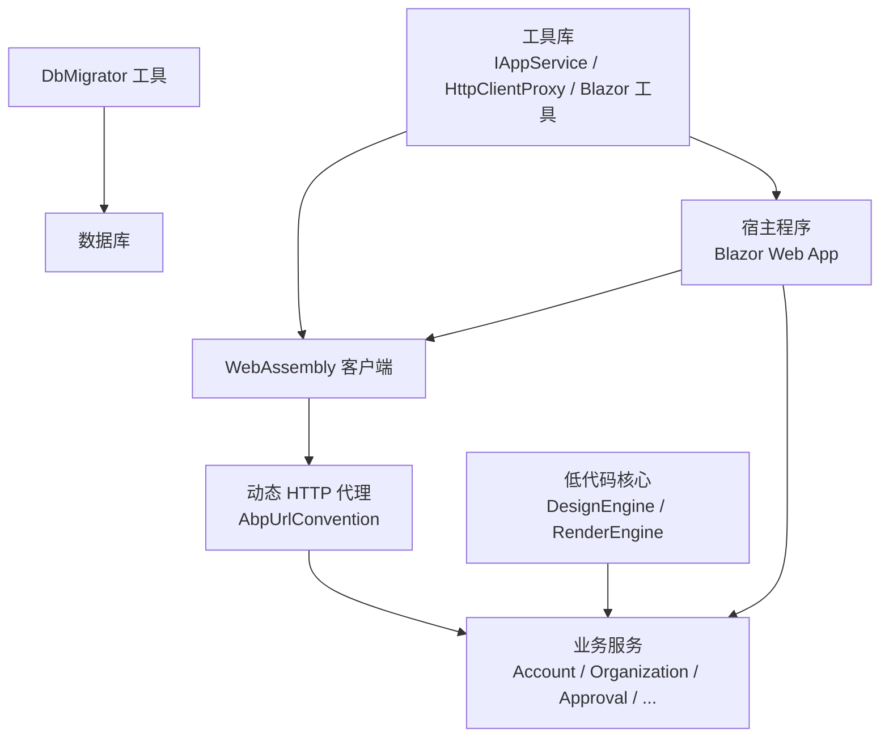
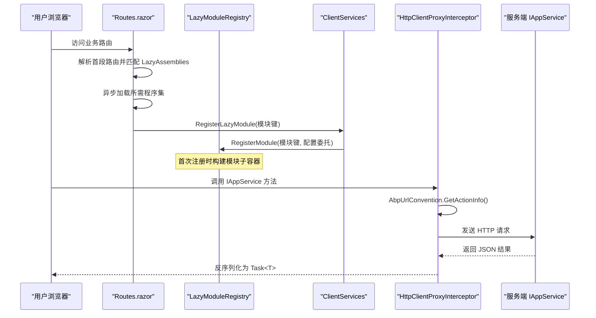
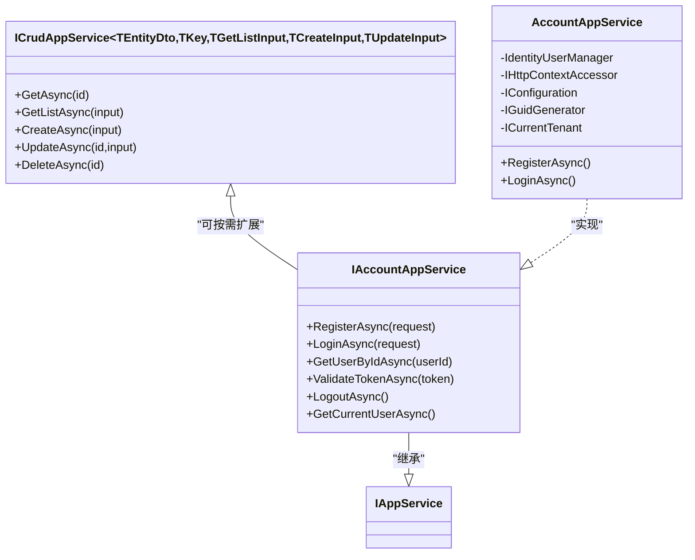
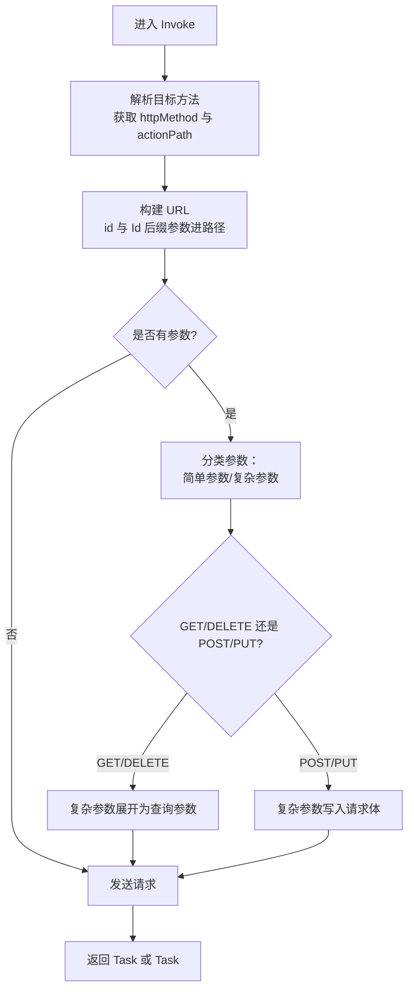
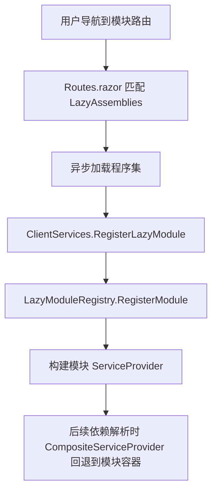
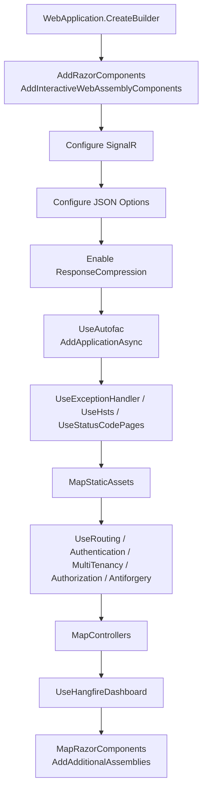
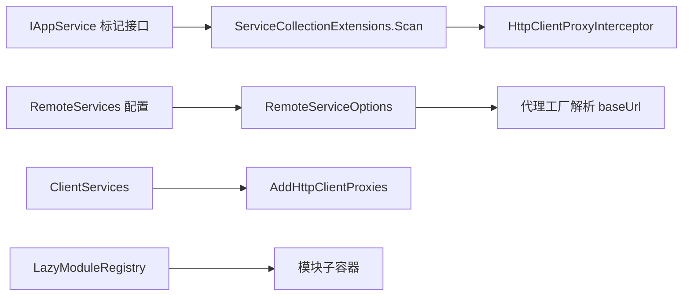
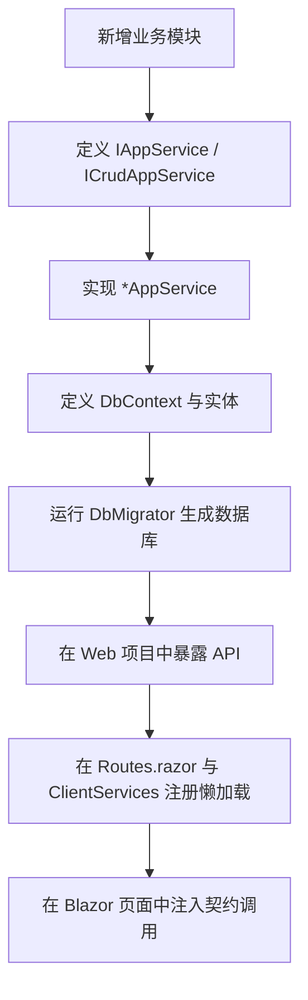

# 开发指南

<cite>
**本文引用的文件**   
- [README.md](file://README.md)
- [Program.cs（Web 宿主）](file://src/Host/H.AppLab.Web.Host/H.AppLab.Web.Host/Program.cs)
- [Routes.razor（客户端路由与懒加载映射）](file://src/Host/H.AppLab.Web.Host/H.AppLab.Web.Host.Client/Routes.razor)
- [Program.cs（Blazor WebAssembly 客户端）](file://src/Host/H.AppLab.Web.Host/H.AppLab.Web.Host.Client/Program.cs)
- [LazyModuleServices.cs（组合式依赖注入）](file://src/Host/H.AppLab.Web.Host/H.AppLab.Web.Host.Client/LazyModuleServices.cs)
- [ClientServices.cs（前端服务注册与模块懒加载入口）](file://src/Host/H.AppLab.Web.Host/H.AppLab.Web.Host.Client/ClientServices.cs)
- [IAppService.cs（应用服务标记接口）](file://src/Utils/H.Abp.Application.Contracts/IAppService.cs)
- [ICrudAppService.cs（通用 CRUD 应用服务契约）](file://src/Utils/H.Abp.Application.Contracts/ICrudAppService.cs)
- [HttpClientProxyInterceptor.cs（动态 HTTP 代理拦截器）](file://src/Utils/H.Abp.HttpClientProxy/HttpClientProxyInterceptor.cs)
- [ServiceCollectionExtensions.cs（远程服务与代理注册扩展）](file://src/Utils/H.Abp.HttpClientProxy/ServiceCollectionExtensions.cs)
- [AccountAppService.cs（账户应用服务实现）](file://src/Services/Account/H.Account.Application/Services/AccountAppService.cs)
- [IAccountAppService.cs（账户应用服务契约）](file://src/Services/Account/H.Account.Application.Contracts/Services/IAccountAppService.cs)
- [Program.cs（账户数据库迁移工具）](file://src/Tools/H.Account.DbMigrator/Program.cs)
- [AccountDbContext.cs（账户数据上下文）](file://src/Services/Account/H.Account.EntityFrameworkCore/AccountDbContext.cs)
- [common.props（公共项目属性）](file://src/common.props)
- [Directory.Packages.props（集中化 NuGet 包版本）](file://src/Directory.Packages.props)
- [global.json（SDK 版本约束）](file://src/global.json)
</cite>

## 目录
1. [引言](#引言)
2. [项目结构](#项目结构)
3. [核心组件](#核心组件)
4. [架构总览](#架构总览)
5. [详细组件分析](#详细组件分析)
6. [依赖关系分析](#依赖关系分析)
7. [性能与安全](#性能与安全)
8. [代码质量与 DevOps](#代码质量与-devops)
9. [调试与故障排查](#调试与故障排查)
10. [结论](#结论)

## 引言
H.AppLab 是一个基于 .NET 与 Blazor 的模块化应用开发实验平台。它采用“按业务模块划分、支持单体或独立部署”的架构，并提供低代码设计引擎与渲染引擎、企业级基础服务、系统运营门户以及数据库迁移工具等能力。本指南面向希望参与 H.AppLab 开发的工程师，说明编码规范、模块开发流程、前后端集成方式、质量保证措施、性能优化与安全加固建议，以及常见问题的调试方法。

## 项目结构
仓库以 `src` 为根组织多个子系统：
- Host：宿主程序。包含单体宿主与各单服务宿主，统一启动 Blazor Web App（Server + WebAssembly）。
- Components：共享 UI 组件，例如 AppDrawer 抽屉导航。
- LowCode：低代码核心，包括元数据 Schema、组件基类、默认组件库、设计引擎与渲染引擎。
- Services：按限界上下文划分的业务服务，如 Account、Organization、Approval、Order、Notification、BackgroundTask、AI、Testing 等。
- System：系统级应用，如 Enterprise、SystemPortal。
- Tools：各服务的 DbMigrator 控制台程序，用于创建和更新数据库结构。
- Utils：跨模块工具库，包括 ABP 契约封装、HTTP 动态代理、Blazor 工具、ID 生成器等。

**图示来源**
- [README.md:1-73](file://README.md#L1-L73)
- [Program.cs（Web 宿主）:1-112](file://src/Host/H.AppLab.Web.Host/H.AppLab.Web.Host/Program.cs#L1-L112)

**章节来源**
- [README.md:1-73](file://README.md#L1-L73)

## 核心组件
本节聚焦 H.AppLab 的关键基础设施与开发入口：
- 应用服务契约与标记接口：通过 `IAppService` 标识可通过 HTTP 代理调用的服务接口；`ICrudAppService` 提供统一的增删改查契约签名。
- 动态 HTTP 代理：`HttpClientProxyInterceptor` 结合 `AbpUrlConvention` 将接口方法调用转换为 REST 请求；`ServiceCollectionExtensions` 扫描并批量注册代理。
- 前端懒加载与组合式 DI：`Routes.razor` 维护路由到程序集的映射，在导航时按需下载；`LazyModuleRegistry` 与 `CompositeServiceProvider` 在程序集加载后延迟注册模块服务。
- 宿主管线：`Program.cs` 构建 Blazor Web App、SignalR、响应压缩、多租户、认证授权、Hangfire 仪表盘、静态资源与控制器路由。
- 业务服务示例：Account 模块展示了应用服务契约、实现、EF Core 数据上下文及迁移工具的基本形态。

**章节来源**
- [IAppService.cs:1-8](file://src/Utils/H.Abp.Application.Contracts/IAppService.cs#L1-L8)
- [ICrudAppService.cs:1-15](file://src/Utils/H.Abp.Application.Contracts/ICrudAppService.cs#L1-L15)
- [HttpClientProxyInterceptor.cs:1-200](file://src/Utils/H.Abp.HttpClientProxy/HttpClientProxyInterceptor.cs#L1-L200)
- [ServiceCollectionExtensions.cs:1-63](file://src/Utils/H.Abp.HttpClientProxy/ServiceCollectionExtensions.cs#L1-L63)
- [Routes.razor:1-145](file://src/Host/H.AppLab.Web.Host/H.AppLab.Web.Host.Client/Routes.razor#L1-L145)
- [LazyModuleServices.cs:1-141](file://src/Host/H.AppLab.Web.Host/H.AppLab.Web.Host.Client/LazyModuleServices.cs#L1-L141)
- [ClientServices.cs:1-193](file://src/Host/H.AppLab.Web.Host/H.AppLab.Web.Host.Client/ClientServices.cs#L1-L193)
- [Program.cs（Web 宿主）:1-112](file://src/Host/H.AppLab.Web.Host/H.AppLab.Web.Host/Program.cs#L1-L112)

## 架构总览
H.AppLab 的前后端交互围绕“契约驱动、动态代理、按需加载”展开：
- 服务端暴露 `IAppService` 派生接口，由 Application 层实现并通过 ABP/MVC 暴露 API。
- 客户端仅引用契约程序集，通过 `AddHttpClientProxies` 自动获得代理实现。
- 代理拦截器根据 ABP 约定把方法名转换为 HTTP 动作与路径，简单参数走查询字符串，复杂对象走请求体。
- 前端使用 Blazor Web App 混合渲染模式，首页只加载必要程序集，其他模块在路由命中时懒加载，并通过组合式容器完成延迟服务注册。

**图示来源**
- [Routes.razor:1-145](file://src/Host/H.AppLab.Web.Host/H.AppLab.Web.Host.Client/Routes.razor#L1-L145)
- [ClientServices.cs:1-193](file://src/Host/H.AppLab.Web.Host/H.AppLab.Web.Host.Client/ClientServices.cs#L1-L193)
- [LazyModuleServices.cs:1-141](file://src/Host/H.AppLab.Web.Host/H.AppLab.Web.Host.Client/LazyModuleServices.cs#L1-L141)
- [HttpClientProxyInterceptor.cs:1-200](file://src/Utils/H.Abp.HttpClientProxy/HttpClientProxyInterceptor.cs#L1-L200)

## 详细组件分析

### 应用服务契约与实现规范
- 所有可被前端动态代理的服务接口都应继承 `IAppService`，以便代理扫描发现。
- 通用 CRUD 场景推荐继承 `ICrudAppService<TEntityDto, TKey, TGetListInput, TCreateInput, TUpdateInput>`，保证 Get、GetList、Create、Update、Delete 的统一签名。
- 业务应用服务通常位于 Services 下的 `{模块}.Application` 项目中，契约放在 `{模块}.Application.Contracts`。
- Account 模块的 `IAccountAppService` 定义了注册、登录、获取用户、校验 Token、登出等方法；其实现 `AccountAppService` 基于 ABP Identity 进行用户管理，并使用 Cookie 认证。

**图示来源**
- [IAppService.cs:1-8](file://src/Utils/H.Abp.Application.Contracts/IAppService.cs#L1-L8)
- [ICrudAppService.cs:1-15](file://src/Utils/H.Abp.Application.Contracts/ICrudAppService.cs#L1-L15)
- [IAccountAppService.cs:1-18](file://src/Services/Account/H.Account.Application.Contracts/Services/IAccountAppService.cs#L1-L18)
- [AccountAppService.cs:1-200](file://src/Services/Account/H.Account.Application/Services/AccountAppService.cs#L1-L200)

**章节来源**
- [IAppService.cs:1-8](file://src/Utils/H.Abp.Application.Contracts/IAppService.cs#L1-L8)
- [ICrudAppService.cs:1-15](file://src/Utils/H.Abp.Application.Contracts/ICrudAppService.cs#L1-L15)
- [IAccountAppService.cs:1-18](file://src/Services/Account/H.Account.Application.Contracts/Services/IAccountAppService.cs#L1-L18)
- [AccountAppService.cs:1-200](file://src/Services/Account/H.Account.Application/Services/AccountAppService.cs#L1-L200)

### 动态 HTTP 代理机制
代理拦截器负责：
- 从接口方法名推断 HTTP 方法与路径。
- 识别名为 `id` 的路径参数与以 `Id` 结尾的次级路径参数。
- 将 GET/DELETE 的复杂参数展开为查询参数，POST/PUT 的复杂参数放入请求体。
- 使用 `JsonNamingPolicy.CamelCase` 与不区分大小写的属性名进行序列化/反序列化。
- 对返回值类型进行泛型处理，支持 `Task` 与 `Task<T>`。

**图示来源**
- [HttpClientProxyInterceptor.cs:1-200](file://src/Utils/H.Abp.HttpClientProxy/HttpClientProxyInterceptor.cs#L1-L200)

**章节来源**
- [HttpClientProxyInterceptor.cs:1-200](file://src/Utils/H.Abp.HttpClientProxy/HttpClientProxyInterceptor.cs#L1-L200)

### 前端懒加载与组合式依赖注入
- `Routes.razor` 维护了首段路由到程序集数组的映射，并在 `OnNavigateAsync` 中通过 `LazyAssemblyLoader.LoadAssembliesAsync` 按需加载。
- 程序集加载完成后，调用 `ClientServices.RegisterLazyModule`，按路由首段或预定义模块键执行延迟注册。
- `LazyModuleRegistry` 为每个模块构建独立的 `ServiceProvider`，并以 key 去重，避免重复注册。
- `CompositeServiceProvider` 与 `CompositeServiceScope` 作为包装器，优先从内部容器解析，未命中再回退到模块子容器。

**图示来源**
- [Routes.razor:1-145](file://src/Host/H.AppLab.Web.Host/H.AppLab.Web.Host.Client/Routes.razor#L1-L145)
- [ClientServices.cs:1-193](file://src/Host/H.AppLab.Web.Host/H.AppLab.Web.Host.Client/ClientServices.cs#L1-L193)
- [LazyModuleServices.cs:1-141](file://src/Host/H.AppLab.Web.Host/H.AppLab.Web.Host.Client/LazyModuleServices.cs#L1-L141)

**章节来源**
- [Routes.razor:1-145](file://src/Host/H.AppLab.Web.Host/H.AppLab.Web.Host.Client/Routes.razor#L1-L145)
- [ClientServices.cs:1-193](file://src/Host/H.AppLab.Web.Host/H.AppLab.Web.Host.Client/ClientServices.cs#L1-L193)
- [LazyModuleServices.cs:1-141](file://src/Host/H.AppLab.Web.Host/H.AppLab.Web.Host.Client/LazyModuleServices.cs#L1-L141)

### 宿主与服务管线
宿主 `Program.cs` 的主要职责：
- 注册 Blazor Interactive WebAssembly 组件。
- 配置 SignalR、JSON 序列化策略。
- 启用 Brotli 与 Gzip 响应压缩，减少 WASM 程序集传输体积。
- 使用 Autofac 模块系统加载应用。
- 初始化应用、配置错误页、HTTPS 重定向、静态资源、路由、认证、多租户、CSRF、控制器。
- 挂载 Hangfire 后台任务仪表盘。
- 注册所有 Web 模块的 `_Imports` 程序集以启用交互式渲染。

**图示来源**
- [Program.cs（Web 宿主）:1-112](file://src/Host/H.AppLab.Web.Host/H.AppLab.Web.Host/Program.cs#L1-L112)

**章节来源**
- [Program.cs（Web 宿主）:1-112](file://src/Host/H.AppLab.Web.Host/H.AppLab.Web.Host/Program.cs#L1-L112)

## 依赖关系分析
- 前端代理注册依赖 `IAppService` 标记接口，通过反射扫描并注册 `HttpClientProxyInterceptor<TService>`。
- 远程服务名称来自配置文件中的 `RemoteServices` 节点，由 `AddRemoteServices` 读取并保存为 `RemoteServiceOptions`。
- 客户端在 `ClientServices.Configure` 中为每个远程服务命名客户端添加 Cookie 处理器与应用 ID 头处理器，确保认证上下文传递。
- 模块懒加载依赖于 `LazyModuleRegistry` 提供的子容器，避免在 MEDI 根容器构建后追加注册导致的不可变问题。

**图示来源**
- [ServiceCollectionExtensions.cs:1-63](file://src/Utils/H.Abp.HttpClientProxy/ServiceCollectionExtensions.cs#L1-L63)
- [HttpClientProxyInterceptor.cs:1-200](file://src/Utils/H.Abp.HttpClientProxy/HttpClientProxyInterceptor.cs#L1-L200)
- [ClientServices.cs:1-193](file://src/Host/H.AppLab.Web.Host/H.AppLab.Web.Host.Client/ClientServices.cs#L1-L193)
- [LazyModuleServices.cs:1-141](file://src/Host/H.AppLab.Web.Host/H.AppLab.Web.Host.Client/LazyModuleServices.cs#L1-L141)

**章节来源**
- [ServiceCollectionExtensions.cs:1-63](file://src/Utils/H.Abp.HttpClientProxy/ServiceCollectionExtensions.cs#L1-L63)
- [HttpClientProxyInterceptor.cs:1-200](file://src/Utils/H.Abp.HttpClientProxy/HttpClientProxyInterceptor.cs#L1-L200)
- [ClientServices.cs:1-193](file://src/Host/H.AppLab.Web.Host/H.AppLab.Web.Host.Client/ClientServices.cs#L1-L193)

## 性能与安全

### 性能优化
- 响应压缩：宿主启用 Brotli 与 Gzip，并对 `.wasm`、`.dll`、`application/octet-stream` 等 MIME 类型进行压缩，降低 WebAssembly 初始下载体积。
- WebAssembly 懒加载：仅在路由命中时加载模块程序集，减少首屏负载。
- AOT 与裁剪：Release 模式启用 AOT 与 Trimming，进一步减小运行时体积。
- 长耗时请求超时：测试执行相关远程服务客户端设置为无限超时，避免长时间批处理任务被取消。
- 静态资源缓存：使用 `MapStaticAssets` 统一管理缓存策略，指纹化程序集配合 immutable 长缓存，避免误用导致启动清单过期。

**章节来源**
- [Program.cs（Web 宿主）:1-112](file://src/Host/H.AppLab.Web.Host/H.AppLab.Web.Host/Program.cs#L1-L112)
- [Routes.razor:1-145](file://src/Host/H.AppLab.Web.Host/H.AppLab.Web.Host.Client/Routes.razor#L1-L145)
- [ClientServices.cs:1-193](file://src/Host/H.AppLab.Web.Host/H.AppLab.Web.Host.Client/ClientServices.cs#L1-L193)
- [README.md:1-73](file://README.md#L1-L73)

### 安全加固
- 身份认证与权限：Account 模块基于 ABP Identity，使用 Cookie 认证方案签发 Claims，并结合多租户隔离上下文。
- CSRF 防护：宿主启用 Antiforgery，对写操作提供保护。
- XSS 防护：建议使用 Blazor 内置 HTML 转义输出；对用户输入进行验证与清理，避免直接拼接 HTML。
- SQL 注入防护：使用 EF Core 参数化查询，避免拼接 SQL；在 DTO 层做输入长度与格式校验。
- 敏感信息：JWT、连接字符串等敏感配置应通过环境变量或受管密钥存储，避免硬编码。
- HTTPS：生产环境启用 HTTPS 重定向与 HSTS。

**章节来源**
- [AccountAppService.cs:1-200](file://src/Services/Account/H.Account.Application/Services/AccountAppService.cs#L1-L200)
- [Program.cs（Web 宿主）:1-112](file://src/Host/H.AppLab.Web.Host/H.AppLab.Web.Host/Program.cs#L1-L112)

## 代码质量与 DevOps

### C# 编码规范与质量标准
- 目标框架与语言版本：统一使用 `net10.0`，启用 `ImplicitUsings`，`Nullable` 开启，语言版本为 preview。
- 包版本集中管理：通过 `Directory.Packages.props` 统一 ABP、EF Core、Serilog、Hangfire、Playwright 等依赖版本。
- 命名约定：
  - 接口以 `I` 开头，应用服务接口以 `*AppService` 结尾。
  - DTO 以 `*Dto` 结尾，请求以 `*RequestDto` 结尾。
  - 枚举与常量使用 PascalCase，字段使用私有下划线前缀。
- 注释规范：
  - 对外接口与方法使用 XML 文档注释说明用途、参数与返回值。
  - 关键业务逻辑增加行内注释，解释判断分支与边界条件。
- 异常处理：
  - 在应用服务层捕获并包装为统一返回体（如 `BaseOutput`），避免直接抛出未处理异常。
  - 在宿主层启用全局异常处理页与详细错误日志（开发环境）。

**章节来源**
- [common.props:1-15](file://src/common.props#L1-L15)
- [Directory.Packages.props:1-105](file://src/Directory.Packages.props#L1-L105)
- [IAccountAppService.cs:1-18](file://src/Services/Account/H.Account.Application.Contracts/Services/IAccountAppService.cs#L1-L18)
- [AccountAppService.cs:1-200](file://src/Services/Account/H.Account.Application/Services/AccountAppService.cs#L1-L200)

### 新业务模块开发流程
1. 创建模块：
   - 在 `Services/{ModuleName}` 下新建 Application、Application.Contracts、EntityFrameworkCore、Web 四个项目。
   - 契约接口继承 `IAppService` 或 `ICrudAppService`。
2. 依赖注入：
   - 服务端通过 ABP Module 注册服务；客户端通过 `ClientServices` 的懒加载注册表按路由键注册代理。
3. 数据库设计：
   - 在 EntityFrameworkCore 项目中定义 DbContext 与实体；使用 EF Core 迁移生成数据库结构。
   - 迁移工具 `DbMigrator` 通过 `MigratorDbContext` 执行迁移。
4. API 开发：
   - 在 Application 层实现 `*AppService`，注入领域服务或仓储，编写业务逻辑。
   - 契约方法返回统一结果包装（如 `BaseOutput`）。
5. 前端集成：
   - 在 `Routes.razor` 的 `LazyAssemblies` 中添加路由首段到模块程序集的映射。
   - 在 `ClientServices.LazyModuleRegistrations` 中添加模块键到代理注册的委托。
   - 在 Blazor 页面中注入契约接口调用 API。

**图示来源**
- [IAccountAppService.cs:1-18](file://src/Services/Account/H.Account.Application.Contracts/Services/IAccountAppService.cs#L1-L18)
- [AccountAppService.cs:1-200](file://src/Services/Account/H.Account.Application/Services/AccountAppService.cs#L1-L200)
- [AccountDbContext.cs:1-200](file://src/Services/Account/H.Account.EntityFrameworkCore/AccountDbContext.cs#L1-L200)
- [Program.cs（账户数据库迁移工具）:1-59](file://src/Tools/H.Account.DbMigrator/Program.cs#L1-L59)
- [Routes.razor:1-145](file://src/Host/H.AppLab.Web.Host/H.AppLab.Web.Host.Client/Routes.razor#L1-L145)
- [ClientServices.cs:1-193](file://src/Host/H.AppLab.Web.Host/H.AppLab.Web.Host.Client/ClientServices.cs#L1-L193)

**章节来源**
- [IAccountAppService.cs:1-18](file://src/Services/Account/H.Account.Application.Contracts/Services/IAccountAppService.cs#L1-L18)
- [AccountAppService.cs:1-200](file://src/Services/Account/H.Account.Application/Services/AccountAppService.cs#L1-L200)
- [AccountDbContext.cs:1-200](file://src/Services/Account/H.Account.EntityFrameworkCore/AccountDbContext.cs#L1-L200)
- [Program.cs（账户数据库迁移工具）:1-59](file://src/Tools/H.Account.DbMigrator/Program.cs#L1-L59)
- [Routes.razor:1-145](file://src/Host/H.AppLab.Web.Host/H.AppLab.Web.Host.Client/Routes.razor#L1-L145)
- [ClientServices.cs:1-193](file://src/Host/H.AppLab.Web.Host/H.AppLab.Web.Host.Client/ClientServices.cs#L1-L193)

### 单元测试与集成测试
- 单元测试：
  - 针对应用服务中的纯业务逻辑，使用 Mock 仓储或领域服务进行隔离测试。
  - 验证 DTO 映射、输入校验、状态机转换等。
- 集成测试：
  - 使用 InMemory 或 TestContainer 数据库验证 EF Core 查询与迁移。
  - 通过 `TestServer` 模拟 HTTP 请求，端到端验证 API 行为。
- Playwright：
  - 项目已引入 Playwright，可用于 UI 自动化测试，覆盖关键业务流程。

**章节来源**
- [Directory.Packages.props:1-105](file://src/Directory.Packages.props#L1-L105)

### 代码审查与持续集成
- 代码审查：
  - 建议在 PR 中要求至少一名资深开发者审查契约变更、API 行为、安全影响与性能回归。
  - 重点检查：契约稳定性、DTO 兼容性、SQL 安全性、异常处理与日志。
- 持续集成：
  - 建议 CI 流水线包含：还原包、编译、单元测试、集成测试、发布构建、AOT 与裁剪验证。
  - 对 Docker Compose 依赖服务（Redis、RabbitMQ、数据库）进行本地或 CI 环境标准化启动。

[本节为通用实践建议，不直接分析具体文件]

## 调试与故障排查

### 常见问题与定位方法
- WebAssembly 启动失败：
  - 现象：页面卡在“加载中...”，无错误日志。
  - 原因：误将整个 `/_framework` 标记为 immutable，导致启动清单缓存过期但指纹程序集文件名变化。
  - 解决：使用 `MapStaticAssets` 统一处理静态资源缓存，不要手动标记整个框架目录为 immutable。
- 模块服务解析失败：
  - 现象：页面报错“No service for type”。
  - 原因：模块程序集尚未加载或懒加载模块未注册。
  - 解决：确认 `Routes.razor` 的 `LazyAssemblies` 与 `ClientServices.LazyModuleRegistrations` 是否包含该模块。
- HTTP 代理请求失败：
  - 现象：404 或参数绑定异常。
  - 原因：方法名不符合 ABP 约定，或参数位置与类型不符合拦截器规则。
  - 解决：检查方法名与参数命名（`id`、`*Id`），确保复杂参数在 POST/PUT 中作为 body。
- 认证 Cookie 未携带：
  - 现象：后端无法识别用户身份。
  - 原因：WASM 客户端未正确附加 Cookie。
  - 解决：确认 `CookieHandler` 与命名客户端已注册并添加到 HTTP 管道。

**章节来源**
- [Program.cs（Web 宿主）:1-112](file://src/Host/H.AppLab.Web.Host/H.AppLab.Web.Host/Program.cs#L1-L112)
- [Routes.razor:1-145](file://src/Host/H.AppLab.Web.Host/H.AppLab.Web.Host.Client/Routes.razor#L1-L145)
- [ClientServices.cs:1-193](file://src/Host/H.AppLab.Web.Host/H.AppLab.Web.Host.Client/ClientServices.cs#L1-L193)
- [HttpClientProxyInterceptor.cs:1-200](file://src/Utils/H.Abp.HttpClientProxy/HttpClientProxyInterceptor.cs#L1-L200)

## 结论
H.AppLab 以模块化架构为核心，通过契约驱动与动态代理实现前后端解耦，借助 Blazor WebAssembly 懒加载与组合式依赖注入提升前端性能与可维护性。遵循本文的编码规范、模块开发流程、安全与性能最佳实践，可以帮助团队高效地扩展业务模块、保障代码质量并快速定位问题。建议在持续集成中加入契约兼容性与安全扫描，确保平台长期演进的可控性与稳定性。