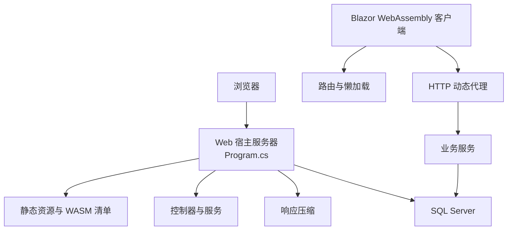
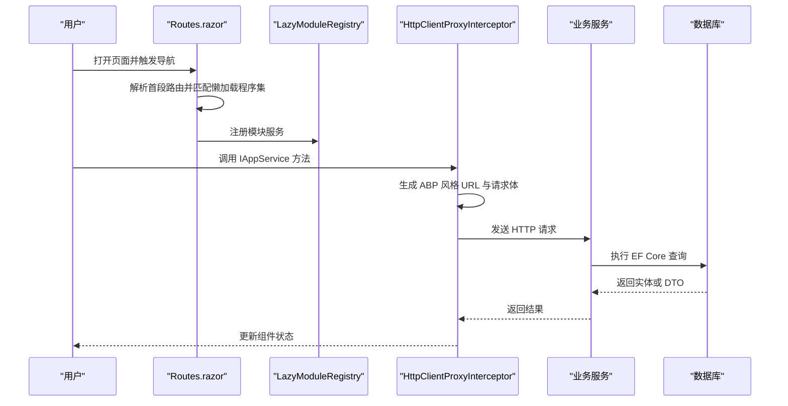
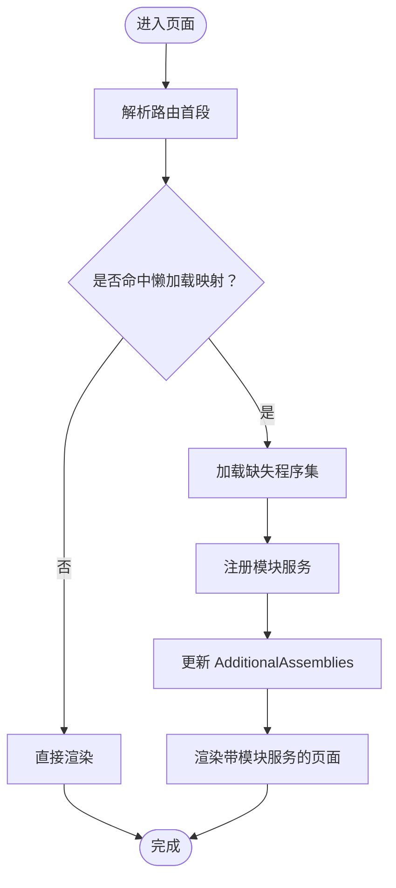
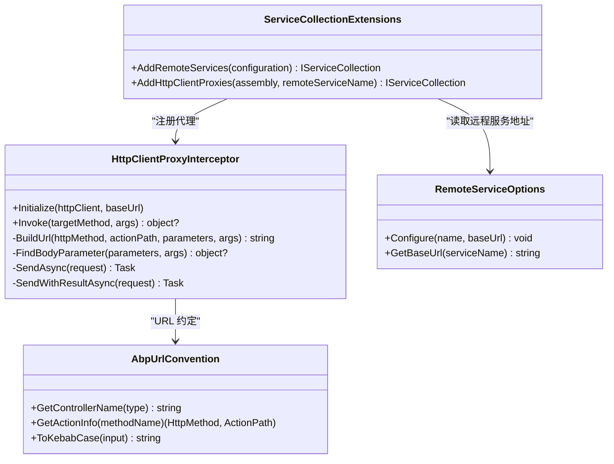
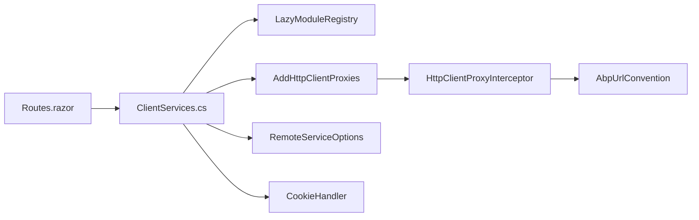
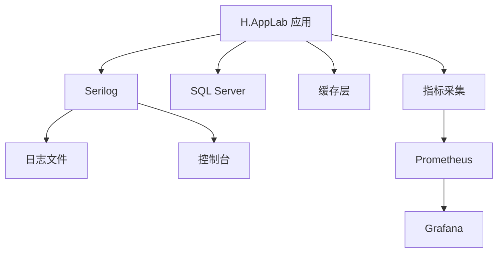

# 性能优化与监控

<cite>
**本文引用的文件**   
- [README.md](file://README.md)
- [Program.cs（Web 宿主）](file://src/Host/H.AppLab.Web.Host/H.AppLab.Web.Host/Program.cs)
- [appsettings.json（Web 宿主）](file://src/Host/H.AppLab.Web.Host/H.AppLab.Web.Host/appsettings.json)
- [appsettings.json（渲染引擎宿主）](file://src/Host/RenderEngine/H.LowCode.RenderEngine.Host/appsettings.json)
- [Routes.razor](file://src/Host/H.AppLab.Web.Host/H.AppLab.Web.Host.Client/Routes.razor)
- [LazyModuleServices.cs](file://src/Host/H.AppLab.Web.Host/H.AppLab.Web.Host.Client/LazyModuleServices.cs)
- [ClientServices.cs](file://src/Host/H.AppLab.Web.Host/H.AppLab.Web.Host.Client/ClientServices.cs)
- [CookieHandler.cs](file://src/Host/H.AppLab.Web.Host/H.AppLab.Web.Host.Client/CookieHandler.cs)
- [HttpClientProxyInterceptor.cs](file://src/Utils/H.Abp.HttpClientProxy/HttpClientProxyInterceptor.cs)
- [ServiceCollectionExtensions.cs（HTTP 客户端代理）](file://src/Utils/H.Abp.HttpClientProxy/ServiceCollectionExtensions.cs)
- [AbpUrlConvention.cs](file://src/Utils/H.Abp.HttpClientProxy/AbpUrlConvention.cs)
- [RemoteServiceOptions.cs](file://src/Utils/H.Abp.HttpClientProxy/RemoteServiceOptions.cs)
- [H.AppLab.Web.Host.Client.csproj](file://src/Host/H.AppLab.Web.Host/H.AppLab.Web.Host.Client/H.AppLab.Web.Host.Client.csproj)
- [OrderEntityFrameworkCoreModule.cs](file://src/Services/Order/H.Order.EntityFrameworkCore/OrderEntityFrameworkCoreModule.cs)
- [OrganizationEntityFrameworkCoreModule.cs](file://src/Services/Organization/H.Organization.EntityFrameworkCore/OrganizationEntityFrameworkCoreModule.cs)
- [TestingEntityFrameworkCoreModule.cs](file://src/Services/Testing/H.Testing.EntityFrameworkCore/TestingEntityFrameworkCoreModule.cs)
- [RenderEngineEntityFrameworkCoreModule.cs](file://src/LowCode/RenderEngine/H.LowCode.RenderEngine.EntityFrameworkCore/RenderEngineEntityFrameworkCoreModule.cs)
</cite>

## 目录
1. [引言](#引言)
2. [项目结构](#项目结构)
3. [核心组件](#核心组件)
4. [架构总览](#架构总览)
5. [详细组件分析](#详细组件分析)
6. [依赖关系分析](#依赖关系分析)
7. [性能优化方案](#性能优化方案)
8. [监控与可观测性](#监控与可观测性)
9. [性能瓶颈定位方法](#性能瓶颈定位方法)
10. [生产环境最佳实践](#生产环境最佳实践)
11. [常见问题排查](#常见问题排查)
12. [结论](#结论)

## 引言
本文件面向 H.AppLab 平台的性能优化与监控，目标是在不改变现有业务语义的前提下，系统性说明前端 Blazor WebAssembly、后端服务、数据库访问、HTTP 请求链路以及监控工具的使用方式。文档内容既包括仓库中已实现的机制，也包括基于该架构的优化建议与生产调优指南。

平台采用模块化架构，支持单体部署与按服务独立部署；前端使用 Blazor Web App 混合模式，后端由多个限界上下文的服务组成，并通过 ABP 风格的 HTTP 动态代理实现前后端解耦。

**章节来源**
- [README.md:1-73](file://README.md#L1-L73)

## 项目结构
从性能视角看，项目可以划分为以下关键区域：
- 前端入口与路由懒加载：Blazor WebAssembly 程序集按需下载，配合组合式依赖注入容器支持模块延迟注册。
- HTTP 动态代理：基于 DispatchProxy 将 IAppService 接口转换为 HTTP 请求，统一处理 URL 约定、参数映射与 JSON 序列化。
- 服务端管道：启用响应压缩、静态资源指纹缓存、SignalR、Hangfire 等能力。
- 数据访问层：各服务通过 Entity Framework Core 连接 SQL Server，部分服务使用 DbContextFactory 控制生命周期。
- 配置与遥测：应用设置集中管理远程服务地址、连接字符串、日志级别；Telemetry 默认关闭，Serilog 作为日志输出。

**图示来源**
- [Program.cs（Web 宿主）:1-112](file://src/Host/H.AppLab.Web.Host/H.AppLab.Web.Host/Program.cs#L1-L112)
- [Routes.razor:1-145](file://src/Host/H.AppLab.Web.Host/H.AppLab.Web.Host.Client/Routes.razor#L1-L145)
- [HttpClientProxyInterceptor.cs:1-234](file://src/Utils/H.Abp.HttpClientProxy/HttpClientProxyInterceptor.cs#L1-L234)

**章节来源**
- [README.md:1-73](file://README.md#L1-L73)
- [Program.cs（Web 宿主）:1-112](file://src/Host/H.AppLab.Web.Host/H.AppLab.Web.Host/Program.cs#L1-L112)

## 核心组件
本节聚焦对性能影响最大的几个核心组件：
- Blazor WebAssembly 懒加载与组合式容器
- ABP 风格 HTTP 动态代理
- 服务端响应压缩与静态资源缓存
- 数据库上下文与工厂
- 配置与远程服务选项

这些组件共同决定首次加载时间、导航延迟、网络带宽占用、数据库连接压力以及可观测性能力。

**章节来源**
- [Routes.razor:1-145](file://src/Host/H.AppLab.Web.Host/H.AppLab.Web.Host.Client/Routes.razor#L1-L145)
- [LazyModuleServices.cs:1-141](file://src/Host/H.AppLab.Web.Host/H.AppLab.Web.Host.Client/LazyModuleServices.cs#L1-L141)
- [ClientServices.cs:1-193](file://src/Host/H.AppLab.Web.Host/H.AppLab.Web.Host.Client/ClientServices.cs#L1-L193)
- [HttpClientProxyInterceptor.cs:1-234](file://src/Utils/H.Abp.HttpClientProxy/HttpClientProxyInterceptor.cs#L1-L234)
- [ServiceCollectionExtensions.cs（HTTP 客户端代理）:1-63](file://src/Utils/H.Abp.HttpClientProxy/ServiceCollectionExtensions.cs#L1-L63)
- [Program.cs（Web 宿主）:1-112](file://src/Host/H.AppLab.Web.Host/H.AppLab.Web.Host/Program.cs#L1-L112)

## 架构总览
H.AppLab 的性能相关架构可以分为四层：
1. 浏览器层：Blazor WebAssembly、路由、组件渲染、JavaScript 互操作。
2. 客户端服务层：HttpClient、CookieHandler、AppIdHeaderHandler、动态代理拦截器。
3. 服务端应用层：Blazor Web App、API 控制器、SignalR、Hangfire、中间件。
4. 基础设施层：SQL Server、Redis、RabbitMQ、MinIO 等外部依赖。

**图示来源**
- [Routes.razor:1-145](file://src/Host/H.AppLab.Web.Host/H.AppLab.Web.Host.Client/Routes.razor#L1-L145)
- [LazyModuleServices.cs:1-141](file://src/Host/H.AppLab.Web.Host/H.AppLab.Web.Host.Client/LazyModuleServices.cs#L1-L141)
- [HttpClientProxyInterceptor.cs:1-234](file://src/Utils/H.Abp.HttpClientProxy/HttpClientProxyInterceptor.cs#L1-L234)
- [OrderEntityFrameworkCoreModule.cs:21-24](file://src/Services/Order/H.Order.EntityFrameworkCore/OrderEntityFrameworkCoreModule.cs#L21-L24)

**章节来源**
- [README.md:1-73](file://README.md#L1-L73)
- [ClientServices.cs:1-193](file://src/Host/H.AppLab.Web.Host/H.AppLab.Web.Host.Client/ClientServices.cs#L1-L193)

## 详细组件分析

### Blazor WebAssembly 懒加载与组合式依赖注入
Routes.razor 维护了“路由首段到程序集名称”的映射，在 OnNavigateAsync 中按需调用 LazyAssemblyLoader 下载所需程序集，并在加载完成后更新 AdditionalAssemblies，使路由能解析新加载的程序集。LazyModuleRegistry 为每个模块构建独立的 ServiceProvider，CompositeServiceProvider 和 CompositeServiceScope 负责在主容器无法解析时回退到模块子容器。

这种设计显著降低了初始下载体积，但也会带来导航时的程序集加载延迟。性能优化的关键是：
- 精确划分懒加载边界，避免把小模块与大型公共库绑在一起。
- 减少跨模块循环引用，防止一个路由触发大量间接依赖。
- 谨慎使用立即加载程序集，只保留真正启动必需的类型。

**图示来源**
- [Routes.razor:1-145](file://src/Host/H.AppLab.Web.Host/H.AppLab.Web.Host.Client/Routes.razor#L1-L145)
- [LazyModuleServices.cs:1-141](file://src/Host/H.AppLab.Web.Host/H.AppLab.Web.Host.Client/LazyModuleServices.cs#L1-L141)

**章节来源**
- [Routes.razor:1-145](file://src/Host/H.AppLab.Web.Host/H.AppLab.Web.Host.Client/Routes.razor#L1-L145)
- [LazyModuleServices.cs:1-141](file://src/Host/H.AppLab.Web.Host/H.AppLab.Web.Host.Client/LazyModuleServices.cs#L1-L141)
- [ClientServices.cs:1-193](file://src/Host/H.AppLab.Web.Host/H.AppLab.Web.Host.Client/ClientServices.cs#L1-L193)
- [H.AppLab.Web.Host.Client.csproj:18-107](file://src/Host/H.AppLab.Web.Host/H.AppLab.Web.Host.Client/H.AppLab.Web.Host.Client.csproj#L18-L107)

### HTTP 动态代理与请求构造
HttpClientProxyInterceptor 使用 DispatchProxy 拦截 IAppService 方法调用，将方法名转换为 HTTP 动词和 action 路径，并根据参数类型选择查询字符串或请求体。AbpUrlConvention 提供控制器名称转换、HTTP 前缀映射与 kebab-case 转换，确保客户端与 ABP 服务端路由一致。ServiceCollectionExtensions 扫描所有 IAppService 接口并注册代理，同时从 RemoteServices 配置读取 BaseUrl。

性能相关注意点：
- 反射创建 HttpRequestMessage 和 JsonContent 会带来一定开销，适合高频 API 场景考虑批处理或缓存策略。
- 复杂对象展开为查询参数时，属性数量较多会导致 URL 过长，应优先使用请求体。
- CookieHandler 确保 Blazor WebAssembly 的 fetch 请求携带认证凭据，避免重复登录。

**图示来源**
- [HttpClientProxyInterceptor.cs:1-234](file://src/Utils/H.Abp.HttpClientProxy/HttpClientProxyInterceptor.cs#L1-L234)
- [AbpUrlConvention.cs:1-86](file://src/Utils/H.Abp.HttpClientProxy/AbpUrlConvention.cs#L1-L86)
- [ServiceCollectionExtensions.cs（HTTP 客户端代理）:1-63](file://src/Utils/H.Abp.HttpClientProxy/ServiceCollectionExtensions.cs#L1-L63)
- [RemoteServiceOptions.cs:1-33](file://src/Utils/H.Abp.HttpClientProxy/RemoteServiceOptions.cs#L1-L33)

**章节来源**
- [HttpClientProxyInterceptor.cs:1-234](file://src/Utils/H.Abp.HttpClientProxy/HttpClientProxyInterceptor.cs#L1-L234)
- [AbpUrlConvention.cs:1-86](file://src/Utils/H.Abp.HttpClientProxy/AbpUrlConvention.cs#L1-L86)
- [ServiceCollectionExtensions.cs（HTTP 客户端代理）:1-63](file://src/Utils/H.Abp.HttpClientProxy/ServiceCollectionExtensions.cs#L1-L63)
- [RemoteServiceOptions.cs:1-33](file://src/Utils/H.Abp.HttpClientProxy/RemoteServiceOptions.cs#L1-L33)
- [CookieHandler.cs:1-16](file://src/Host/H.AppLab.Web.Host/H.AppLab.Web.Host.Client/CookieHandler.cs#L1-L16)

### 服务端管道、响应压缩与静态资源缓存
Program.cs 中启用了 Blazor Web App 混合渲染、SignalR、JSON 驼峰命名、Brotli 与 Gzip 响应压缩，并特别添加了 application/wasm 与 application/dll 的 MIME 类型。静态资源通过 MapStaticAssets 统一处理，注释明确指出不要将整个 /_framework 标记为 immutable，以避免应用重新构建后启动清单与指纹程序集不一致导致永久加载失败。

这意味着：
- 生产环境应始终启用响应压缩以降低 WASM 和资源体积。
- 需要区分“可长期缓存的指纹资源”和“需要校验的启动清单”。
- 开发环境与生产环境的错误处理、调试行为应分开配置。

**章节来源**
- [Program.cs（Web 宿主）:1-112](file://src/Host/H.AppLab.Web.Host/H.AppLab.Web.Host/Program.cs#L1-L112)

### 数据库上下文与连接池
项目中各服务均使用 EF Core 连接 SQL Server。常见模式包括：
- 直接使用 AddDbContext 注册作用域 DbContext。
- 使用 ABP 的 Configure<AbpDbContextOptions>.UseSqlServer。
- 为高并发或特殊场景注册 DbContextFactory，例如 RenderEngineDbContext。

连接池由 .NET 内置的 SqlClient 管理，通常不需要手动配置连接数，但应关注：
- 连接字符串中的超时、加密、信任证书等安全与性能选项。
- 慢查询、N+1 查询、未使用索引的大表扫描。
- 长事务或异步阻塞导致的连接泄漏。

**章节来源**
- [OrderEntityFrameworkCoreModule.cs:21-24](file://src/Services/Order/H.Order.EntityFrameworkCore/OrderEntityFrameworkCoreModule.cs#L21-L24)
- [OrganizationEntityFrameworkCoreModule.cs:22-24](file://src/Services/Organization/H.Organization.EntityFrameworkCore/OrganizationEntityFrameworkCoreModule.cs#L22-L24)
- [TestingEntityFrameworkCoreModule.cs:21-24](file://src/Services/Testing/H.Testing.EntityFrameworkCore/TestingEntityFrameworkCoreModule.cs#L21-L24)
- [RenderEngineEntityFrameworkCoreModule.cs:23-33](file://src/LowCode/RenderEngine/H.LowCode.RenderEngine.EntityFrameworkCore/RenderEngineEntityFrameworkCoreModule.cs#L23-L33)

## 依赖关系分析
下图展示前端客户端与服务端之间的关键依赖关系，重点体现 HttpClient、代理拦截器、路由懒加载与远程服务配置之间的耦合。

**图示来源**
- [Routes.razor:1-145](file://src/Host/H.AppLab.Web.Host/H.AppLab.Web.Host.Client/Routes.razor#L1-L145)
- [ClientServices.cs:1-193](file://src/Host/H.AppLab.Web.Host/H.AppLab.Web.Host.Client/ClientServices.cs#L1-L193)
- [LazyModuleServices.cs:1-141](file://src/Host/H.AppLab.Web.Host/H.AppLab.Web.Host.Client/LazyModuleServices.cs#L1-L141)
- [HttpClientProxyInterceptor.cs:1-234](file://src/Utils/H.Abp.HttpClientProxy/HttpClientProxyInterceptor.cs#L1-L234)
- [AbpUrlConvention.cs:1-86](file://src/Utils/H.Abp.HttpClientProxy/AbpUrlConvention.cs#L1-L86)
- [RemoteServiceOptions.cs:1-33](file://src/Utils/H.Abp.HttpClientProxy/RemoteServiceOptions.cs#L1-L33)

**章节来源**
- [ClientServices.cs:1-193](file://src/Host/H.AppLab.Web.Host/H.AppLab.Web.Host.Client/ClientServices.cs#L1-L193)
- [HttpClientProxyInterceptor.cs:1-234](file://src/Utils/H.Abp.HttpClientProxy/HttpClientProxyInterceptor.cs#L1-L234)

## 性能优化方案

### 前端性能优化
1. **Blazor WebAssembly 加载优化**
   - 保持 Routes.razor 的路由到程序集映射尽量精准，避免一个路由加载过多无关程序集。
   - 利用 H.AppLab.Web.Host.Client.csproj 中的 BlazorWebAssemblyLazyLoad 条目，将业务模块、Contracts、LowCode 基础库与第三方依赖合理拆分。
   - 仅在启动时必须存在的类型放入立即加载程序集，其余一律懒加载。

2. **组件渲染优化**
   - 列表与表格组件应避免一次性渲染超大数据量，结合分页、虚拟滚动或增量加载。
   - 减少不必要的 StateHasChanged 调用，合并多次状态更新。
   - 对频繁变化的 UI 使用局部更新，而不是重建整棵组件树。

3. **内存管理**
   - 懒加载模块的 LazyModuleRegistry 会创建多个 ServiceProvider，应在模块不再使用时注意释放相关单例。
   - 避免在组件中持有长时间生命周期的静态集合、事件订阅或未取消的异步任务。
   - 大对象、图片、Excel/PPT 预览资源应显式释放或限制缓存大小。

4. **Bundle 大小优化**
   - 使用 Release 模式下的 AOT 与裁剪功能，减少运行时体积。
   - 移除未使用的第三方库，尤其是大型 Markdown、富文本、图表库。
   - 对非关键 JS 资源进行延迟加载，避免阻塞主线程。

**章节来源**
- [Routes.razor:1-145](file://src/Host/H.AppLab.Web.Host/H.AppLab.Web.Host.Client/Routes.razor#L1-L145)
- [LazyModuleServices.cs:1-141](file://src/Host/H.AppLab.Web.Host/H.AppLab.Web.Host.Client/LazyModuleServices.cs#L1-L141)
- [H.AppLab.Web.Host.Client.csproj:18-107](file://src/Host/H.AppLab.Web.Host/H.AppLab.Web.Host.Client/H.AppLab.Web.Host.Client.csproj#L18-L107)
- [README.md:1-73](file://README.md#L1-L73)

### 后端性能调优
1. **数据库查询优化**
   - 使用 Include 或投影减少 N+1 查询。
   - 为大表添加合适索引，避免 SELECT * 和无过滤条件的全表扫描。
   - 对只读列表使用 AsNoTracking 提升读取性能。
   - 避免在循环内执行数据库操作，改用批量插入或批量更新。

2. **缓存策略**
   - 对热点字典、租户信息、菜单、元数据等可加入内存缓存。
   - 对跨服务共享数据可使用 Redis 缓存，注意设置过期时间与缓存穿透保护。
   - 对静态资源使用 CDN 缓存，对动态数据使用短 TTL 缓存。

3. **异步编程**
   - 避免在异步代码中使用 .Result 或 .Wait()，防止死锁。
   - 使用 CancellationToken 支持请求取消，避免长耗时任务占用资源。
   - 对后台任务使用 Hangfire 或消息队列，避免同步阻塞请求线程。

4. **连接池配置**
   - 根据数据库实例规格调整最大连接数。
   - 避免长事务持有连接，缩短事务范围。
   - 对高并发服务使用 DbContextFactory 或作用域 DbContext，避免跨请求共享。

**章节来源**
- [OrderEntityFrameworkCoreModule.cs:21-24](file://src/Services/Order/H.Order.EntityFrameworkCore/OrderEntityFrameworkCoreModule.cs#L21-L24)
- [RenderEngineEntityFrameworkCoreModule.cs:23-33](file://src/LowCode/RenderEngine/H.LowCode.RenderEngine.EntityFrameworkCore/RenderEngineEntityFrameworkCoreModule.cs#L23-L33)
- [Program.cs（Web 宿主）:1-112](file://src/Host/H.AppLab.Web.Host/H.AppLab.Web.Host/Program.cs#L1-L112)

### HTTP 请求优化
1. **HttpClient 复用**
   - 使用 IHttpClientFactory 管理命名 HttpClient，避免 Socket 耗尽。
   - ClientServices.cs 已为多个远程服务注册命名 HttpClient，并附加 CookieHandler 与 AppIdHeaderHandler。

2. **请求批处理**
   - 对于批量列表、批量导出、批量测试执行，应提供聚合接口，减少往返次数。
   - Testing 远程服务已设置无限超时，以支持长时间执行的 UI 测试用例。

3. **响应压缩**
   - Program.cs 已启用 Brotli 与 Gzip，并包含 application/wasm 与 application/dll。
   - 生产环境应确保反向代理也启用压缩，避免双重压缩。

4. **CDN 加速**
   - 将静态资源、WASM 程序集、图片、视频放到 CDN。
   - 对启动清单与 boot manifest 做版本化，但不要将其整体标记为 immutable。

**章节来源**
- [ClientServices.cs:1-193](file://src/Host/H.AppLab.Web.Host/H.AppLab.Web.Host.Client/ClientServices.cs#L1-L193)
- [CookieHandler.cs:1-16](file://src/Host/H.AppLab.Web.Host/H.AppLab.Web.Host.Client/CookieHandler.cs#L1-L16)
- [Program.cs（Web 宿主）:1-112](file://src/Host/H.AppLab.Web.Host/H.AppLab.Web.Host/Program.cs#L1-L112)

## 监控与可观测性
当前仓库中已经具备以下可观测性基础：
- Serilog：写入文件和控制台，支持异步写入、文件大小限制、按天滚动。
- ABP Telemetry：在渲染引擎宿主与客户端配置中明确设置为关闭。
- Logging：应用设置中定义了默认日志级别，并对 System、Microsoft、Volo 等命名空间降低噪音。

推荐在生产环境中补充：
- Application Insights：用于请求追踪、异常收集、依赖调用可视化。
- Prometheus + Grafana：暴露指标，如 QPS、延迟、错误率、内存、GC、数据库连接数。
- OpenTelemetry：统一采集日志、指标、追踪，便于接入多种后端。

**图示来源**
- [appsettings.json（渲染引擎宿主）:1-65](file://src/Host/RenderEngine/H.LowCode.RenderEngine.Host/appsettings.json#L1-L65)
- [appsettings.json（Web 宿主）:1-128](file://src/Host/H.AppLab.Web.Host/H.AppLab.Web.Host/appsettings.json#L1-L128)

**章节来源**
- [appsettings.json（渲染引擎宿主）:1-65](file://src/Host/RenderEngine/H.LowCode.RenderEngine.Host/appsettings.json#L1-L65)
- [appsettings.json（Web 宿主）:1-128](file://src/Host/H.AppLab.Web.Host/H.AppLab.Web.Host/appsettings.json#L1-L128)

## 性能瓶颈定位方法

### CPU 分析
- 使用 .NET Profiler 或 Visual Studio Diagnostic Tools 分析热点方法。
- 重点关注反射、序列化、正则表达式、大型集合遍历、组件重渲染。
- 对 HttpClientProxyInterceptor 的高频调用场景，评估是否可以减少反射与 JSON 序列化成本。

### 内存泄漏检测
- 使用 dotnet-gcstress、dotnet-trace、dotnet-memory-diagnostics 分析托管堆。
- 检查是否有静态集合持续增长、未取消的异步任务、全局事件订阅。
- 关注 LazyModuleRegistry 创建的 ServiceProvider 是否被正确释放。

### 数据库慢查询分析
- 启用 SQL Server 查询存储或使用扩展事件捕获慢查询。
- 分析执行计划，关注全表扫描、索引缺失、隐式转换。
- 对 EF Core 查询开启日志，定位 N+1、无索引字段、过度投影或缺少分页。

### 前端性能分析
- 使用浏览器开发者工具的 Performance、Network、Memory 面板。
- 分析 WASM 加载时间、程序集懒加载顺序、JS 互操作耗时。
- 检查组件重渲染频率、事件冒泡、定时器与轮询。

**章节来源**
- [HttpClientProxyInterceptor.cs:1-234](file://src/Utils/H.Abp.HttpClientProxy/HttpClientProxyInterceptor.cs#L1-L234)
- [LazyModuleServices.cs:1-141](file://src/Host/H.AppLab.Web.Host/H.AppLab.Web.Host.Client/LazyModuleServices.cs#L1-L141)
- [OrderEntityFrameworkCoreModule.cs:21-24](file://src/Services/Order/H.Order.EntityFrameworkCore/OrderEntityFrameworkCoreModule.cs#L21-L24)
- [RenderEngineEntityFrameworkCoreModule.cs:23-33](file://src/LowCode/RenderEngine/H.LowCode.RenderEngine.EntityFrameworkCore/RenderEngineEntityFrameworkCoreModule.cs#L23-L33)

## 生产环境最佳实践
1. **构建与发布**
   - 使用 Release 模式，启用 AOT 与裁剪。
   - 分离开发调试符号，避免将 .pdb 打包进生产产物。
   - 使用镜像分层与多阶段构建，减小部署包体积。

2. **部署与运行**
   - 使用反向代理启用 HTTPS、缓存、压缩与限流。
   - 对 WASM 资源使用 CDN，对 API 使用负载均衡与健康检查。
   - 合理配置容器资源限制，避免 OOM 与 CPU 抖动。

3. **配置管理**
   - 将连接字符串、远程服务地址、密钥等放入环境变量或密钥管理服务。
   - 区分开发、测试、预发、生产环境配置。
   - 避免在生产环境开启敏感日志与详细错误。

4. **监控告警**
   - 对关键指标设置阈值告警，如错误率、延迟、CPU、内存、数据库连接数。
   - 保留足够的历史数据用于趋势分析与容量规划。
   - 对异常日志进行分类，避免告警疲劳。

**章节来源**
- [Program.cs（Web 宿主）:1-112](file://src/Host/H.AppLab.Web.Host/H.AppLab.Web.Host/Program.cs#L1-L112)
- [appsettings.json（Web 宿主）:1-128](file://src/Host/H.AppLab.Web.Host/H.AppLab.Web.Host/appsettings.json#L1-L128)

## 常见问题排查

### 问题一：WASM 页面永远显示加载中
可能原因：
- 将 /_framework 整体标记为 immutable，导致启动清单与指纹程序集不一致。
- 路由懒加载映射错误，缺少必要程序集。
- 静态资源未通过 MapStaticAssets 正确处理。

解决步骤：
- 检查 Program.cs 中对静态资源的处理方式。
- 检查 Routes.razor 中对应路由是否声明了所需程序集。
- 清理浏览器缓存后重试，观察 Network 面板中 404 资源。

**章节来源**
- [Program.cs（Web 宿主）:1-112](file://src/Host/H.AppLab.Web.Host/H.AppLab.Web.Host/Program.cs#L1-L112)
- [Routes.razor:1-145](file://src/Host/H.AppLab.Web.Host/H.AppLab.Web.Host.Client/Routes.razor#L1-L145)

### 问题二：Blazor WASM 请求没有携带 Cookie
可能原因：
- 客户端未启用浏览器请求凭据。

解决步骤：
- 确认 CookieHandler 已添加到命名 HttpClient。
- 确认远程服务地址配置正确。
- 检查服务端是否允许跨域与凭据传递。

**章节来源**
- [CookieHandler.cs:1-16](file://src/Host/H.AppLab.Web.Host/H.AppLab.Web.Host.Client/CookieHandler.cs#L1-L16)
- [ClientServices.cs:1-193](file://src/Host/H.AppLab.Web.Host/H.AppLab.Web.Host.Client/ClientServices.cs#L1-L193)
- [appsettings.json（Web 宿主）:1-128](file://src/Host/H.AppLab.Web.Host/H.AppLab.Web.Host/appsettings.json#L1-L128)

### 问题三：UI 测试执行中途被取消
可能原因：
- 默认 HttpClient 超时过短。

解决步骤：
- 对 Testing 远程服务使用无限超时，避免长时间测试执行被取消。
- 对普通 API 保持合理超时，避免资源长时间占用。

**章节来源**
- [ClientServices.cs:1-193](file://src/Host/H.AppLab.Web.Host/H.AppLab.Web.Host.Client/ClientServices.cs#L1-L193)

### 问题四：ABP 路由不匹配
可能原因：
- 客户端 AbpUrlConvention 与服务端路由约定不一致。
- 方法名前缀不符合 GetList、GetAll、Get、Put、Update、Delete、Remove、Create、Add、Insert、Post、Patch。

解决步骤：
- 检查 AbpUrlConvention 的前缀映射。
- 调整接口方法命名，使其符合 ABP 约定。
- 核对服务端控制器路由与客户端代理生成的 URL。

**章节来源**
- [AbpUrlConvention.cs:1-86](file://src/Utils/H.Abp.HttpClientProxy/AbpUrlConvention.cs#L1-L86)
- [HttpClientProxyInterceptor.cs:1-234](file://src/Utils/H.Abp.HttpClientProxy/HttpClientProxyInterceptor.cs#L1-L234)

## 结论
H.AppLab 已经在前端懒加载、HTTP 动态代理、响应压缩、静态资源缓存、Serilog 日志等方面形成了可复用的性能基础。进一步优化应围绕三个方向展开：
1. 前端侧继续精细化懒加载边界、组件渲染与内存管理。
2. 后端侧加强数据库查询优化、缓存策略、异步与连接池管理。
3. 监控侧补齐指标、追踪与告警体系，形成闭环的性能治理。

在实际生产中，建议先建立基线指标，再逐项优化，并以压测验证效果，避免“盲目优化”带来的回归风险。