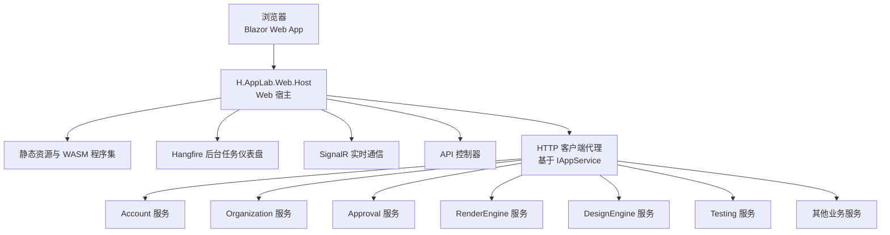
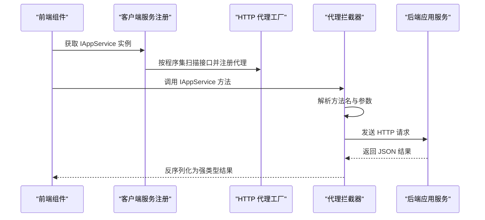

# 调试技巧与故障排查

<cite>
**本文引用的文件**   
- [README.md](file://README.md)
- [docker-compose.yml](file://cd/docker-compose.yml)
- [Program.cs（H.AppLab.Web.Host）](file://src/Host/H.AppLab.Web.Host/H.AppLab.Web.Host/Program.cs)
- [ClientServices.cs（H.AppLab.Web.Host.Client）](file://src/Host/H.AppLab.Web.Host/H.AppLab.Web.Host.Client/ClientServices.cs)
- [ServiceCollectionExtensions.cs（H.Abp.HttpClientProxy）](file://src/Utils/H.Abp.HttpClientProxy/ServiceCollectionExtensions.cs)
- [HttpClientProxyInterceptor.cs（H.Abp.HttpClientProxy）](file://src/Utils/H.Abp.HttpClientProxy/HttpClientProxyInterceptor.cs)
- [RemoteServiceOptions.cs（H.Abp.HttpClientProxy）](file://src/Utils/H.Abp.HttpClientProxy/RemoteServiceOptions.cs)
- [appsettings.json（H.AppLab.Web.Host）](file://src/Host/H.AppLab.Web.Host/H.AppLab.Web.Host/appsettings.json)
- [appsettings.json（H.AppLab.Web.Host.Client）](file://src/Host/H.AppLab.Web.Host/H.AppLab.Web.Host.Client/wwwroot/appsettings.json)
- [appsettings.serilog.json（H.LowCode.DbMigrator）](file://src/Tools/H.LowCode.DbMigrator/appsettings.serilog.json)
</cite>

## 目录
1. [引言](#引言)
2. [项目结构与调试入口](#项目结构与调试入口)
3. [本地开发环境调试方法](#本地开发环境调试方法)
4. [远程生产环境问题排查方法](#远程生产环境问题排查方法)
5. [常见故障诊断与解决方案](#常见故障诊断与解决方案)
6. [分布式系统调试技巧](#分布式系统调试技巧)
7. [调试工具与资源推荐](#调试工具与资源推荐)
8. [应急预案与故障恢复流程](#应急预案与故障恢复流程)
9. [结论](#结论)

## 引言
本文件面向 H.AppLab 平台开发者、测试人员与运维人员，提供一套从本地到生产环境的完整调试与故障排查指南。内容覆盖 Visual Studio 调试配置、断点调试、变量查看、调用栈分析，日志收集与分析，性能监控，错误追踪，数据库连接问题、API 调用失败、前端组件报错、内存泄漏等典型场景，并补充微服务通信、消息队列、缓存失效等复杂问题的处理方法。

H.AppLab 采用模块化架构，支持单体部署和按服务独立部署；Web 宿主使用 Blazor Web App（Server + WebAssembly），并通过自研 HTTP 动态代理把前端对 `IAppService` 的调用自动转换为 HTTP 请求，同时配合 Redis、RabbitMQ、MinIO 等基础设施运行。

## 项目结构与调试入口
H.AppLab 的核心调试入口是 Web 宿主程序 `H.AppLab.Web.Host`。它负责注册 Blazor 组件、SignalR、控制器、Hangfire 仪表盘、多租户、认证授权、静态资源映射以及多个 Blazor 模块程序集。客户端通过 `ClientServices` 注册远程服务代理，并根据路由懒加载各业务模块的 `IAppService` HTTP 代理。

**图示来源**
- [Program.cs（H.AppLab.Web.Host）:1-112](file://src/Host/H.AppLab.Web.Host/H.AppLab.Web.Host/Program.cs#L1-L112)
- [ClientServices.cs（H.AppLab.Web.Host.Client）:1-193](file://src/Host/H.AppLab.Web.Host/H.AppLab.Web.Host.Client/ClientServices.cs#L1-L193)

**章节来源**
- [README.md:1-73](file://README.md#L1-L73)
- [Program.cs（H.AppLab.Web.Host）:1-112](file://src/Host/H.AppLab.Web.Host/H.AppLab.Web.Host/Program.cs#L1-L112)

## 本地开发环境调试方法

### 环境准备与依赖服务
本地开发需要 .NET SDK、WSL、Docker 与 Docker Compose。依赖服务包括 Redis、RabbitMQ 和 MinIO，配置文件位于 `cd/docker-compose.yml`。Redis 默认启用密码保护，RabbitMQ 控制台暴露管理端口，MinIO 暴露 API 与控制台端口。

调试前建议先启动依赖服务：
- 将 `cd/docker-compose.yml` 复制到 WSL 中执行容器编排命令。
- 检查 Redis、RabbitMQ、MinIO 是否成功启动。
- 确认 RabbitMQ 管理界面可访问，便于观察队列状态。

**章节来源**
- [README.md:18-40](file://README.md#L18-L40)
- [docker-compose.yml:1-48](file://cd/docker-compose.yml#L1-L48)

### 数据库迁移与初始化
每个服务都有对应的 DbMigrator 控制台程序，用于创建或更新数据库结构。例如 Account 服务可通过对应项目运行迁移命令。在本地调试时，应优先执行相关服务的数据库迁移，确保 LocalDB 中的数据库表结构正确。

常用操作：
- 找到目标服务的 DbMigrator 项目路径。
- 使用命令行运行该项目以应用迁移。
- 如出现连接字符串错误或数据库不存在，优先检查 `appsettings.json` 中的连接字符串与服务端数据库状态。

**章节来源**
- [README.md:33-40](file://README.md#L33-L40)
- [appsettings.json（H.AppLab.Web.Host）:1-25](file://src/Host/H.AppLab.Web.Host/H.AppLab.Web.Host/appsettings.json#L1-L25)

### Visual Studio 调试配置
H.AppLab 主程序为 ASP.NET Core Web 应用，可使用 Visual Studio 直接启动调试。关键调试要点如下：

1. **选择启动项目**  
   将 `H.AppLab.Web.Host` 设为启动项目，以便调试宿主层、Blazor Server/WASM 混合渲染、SignalR、Hangfire 仪表盘和 API 控制器。

2. **启用 WebAssembly 调试**  
   宿主在开发环境下启用 Blazor WebAssembly 调试能力，便于在浏览器中断点调试前端逻辑。

3. **设置启动参数与环境变量**  
   - 如需切换不同远端服务地址，调整宿主和客户端的 `RemoteServices` 配置。
   - 如需开启详细错误信息，可在开发环境利用 SignalR 的详细错误选项辅助定位服务端异常。

4. **调试 Hangfire 后台任务**  
   宿主已挂载 Hangfire 仪表盘 `/hangfire`，可在浏览器中查看作业执行情况；若需断点调试后台任务，可直接在服务端代码中打断点并触发对应作业。

**章节来源**
- [Program.cs（H.AppLab.Web.Host）:1-112](file://src/Host/H.AppLab.Web.Host/H.AppLab.Web.Host/Program.cs#L1-L112)
- [README.md:33-40](file://README.md#L33-L40)

### 断点调试、变量查看与调用栈分析
#### 后端断点调试
- 在应用服务、控制器、中间件、扩展方法中设置断点。
- 当 Blazor 页面调用远端服务时，请求会经过 HTTP 代理拦截器，因此可在拦截器和具体业务服务两端同时打断点。
- 查看调用栈时，注意区分“Blazor 前端调用”和“.NET 后端处理”，因为代理层会把接口调用转为 HTTP 请求。

#### 前端断点调试
- 在开发模式下，Blazor WebAssembly 会加载调试符号，浏览器开发者工具可定位前端 JS/TS 与运行时行为。
- 对于懒加载模块，需在导航到对应路由后程序集下载完成，才能在对应模块中命中断点。

#### 变量查看建议
- 后端：关注 `HttpClient` 的 BaseAddress、超时时间、Cookie 处理器、应用 ID 头处理器。
- 前端：关注 `RemoteServices` 配置、模块懒加载 key、当前路由段。
- 跨进程：对比前后端 `RemoteServices` 中的服务名称与 BaseUrl 是否一致。

**章节来源**
- [Program.cs（H.AppLab.Web.Host）:1-112](file://src/Host/H.AppLab.Web.Host/H.AppLab.Web.Host/Program.cs#L1-L112)
- [ClientServices.cs（H.AppLab.Web.Host.Client）:1-193](file://src/Host/H.AppLab.Web.Host/H.AppLab.Web.Host.Client/ClientServices.cs#L1-L193)

## 远程生产环境问题排查方法

### 日志收集与分析
项目中存在 Serilog 配置示例，输出到异步文件 sink 和控制台，并包含时间戳、级别、上下文、事件 ID、消息与异常信息。虽然该示例位于 LowCode DbMigrator，但可作为生产环境日志采集参考。

生产环境排查步骤：
1. 确认日志级别：默认 `Information`，底层框架如 Entity Framework Core 可降低至 `Warning`。
2. 检查日志轮转策略：文件大小限制、保留数量、按日滚动。
3. 根据 SourceContext 和 EventId 快速定位异常来源。
4. 结合业务日志记录异常上下文，避免只记录堆栈而丢失业务参数。

**章节来源**
- [appsettings.serilog.json（H.LowCode.DbMigrator）:1-41](file://src/Tools/H.LowCode.DbMigrator/appsettings.serilog.json#L1-L41)

### 性能监控
可从以下维度观察性能：
- **前端体积与加载时间**：宿主已启用 Brotli 和 Gzip 压缩，并对 WASM、DLL 等资源类型进行压缩；注意静态资源指纹化与 boot manifest 的缓存语义。
- **网络请求耗时**：通过浏览器 Network 面板观察 API 延迟与重试情况。
- **后台任务耗时**：通过 Hangfire 仪表盘观察作业排队、执行时长与失败次数。
- **数据库访问耗时**：结合 EF Core 日志与数据库慢查询分析。

**章节来源**
- [Program.cs（H.AppLab.Web.Host）:1-112](file://src/Host/H.AppLab.Web.Host/H.AppLab.Web.Host/Program.cs#L1-L112)

### 错误追踪
- 非开发环境启用异常处理中间件，统一返回 `/Error`。
- 前端组件报错通常表现为页面卡住、WASM 加载失败或路由无法解析。
- 后端 API 调用失败通常表现为 HTTP 非 2xx 响应、超时、认证 Cookie 缺失、远端服务地址错误。

**章节来源**
- [Program.cs（H.AppLab.Web.Host）:1-112](file://src/Host/H.AppLab.Web.Host/H.AppLab.Web.Host/Program.cs#L1-L112)

## 常见故障诊断与解决方案

### 数据库连接问题
**现象**  
- 启动时报数据库连接失败。
- 迁移命令执行失败。
- 应用能启动但数据读写失败。

**诊断思路**  
1. 检查 `ConnectionStrings` 中的数据库地址、用户名、密码、证书信任设置。
2. 确认 LocalDB 或远程 SQL Server 可访问。
3. 确认已运行对应服务的 DbMigrator，数据库表结构已初始化。
4. 区分不同服务的数据库名，避免误连。

**解决方案**  
- 修正连接字符串。
- 重新启动依赖数据库。
- 重新执行对应服务的迁移程序。
- 如果生产环境使用外部数据库，确保防火墙、SSL、凭据配置正确。

**章节来源**
- [appsettings.json（H.AppLab.Web.Host）:1-25](file://src/Host/H.AppLab.Web.Host/H.AppLab.Web.Host/appsettings.json#L1-L25)
- [README.md:33-40](file://README.md#L33-L40)

### API 调用失败
**现象**  
- 前端页面显示 API 错误。
- 浏览器 Network 中出现 401、403、404、500。
- 某些模块页面无法加载。

**诊断思路**  
1. 检查客户端和服务端的 `RemoteServices` 配置，确认服务名称与 BaseUrl 一致。
2. 检查 `ClientServices` 中命名 HttpClient 的超时配置。
3. 检查 CookieHandler 和 AppIdHeaderHandler 是否生效。
4. 检查代理拦截器生成的 URL 是否符合 ABP 约定。

**解决方案**  
- 修正远端服务地址。
- 对长耗时测试任务，使用 Testing 服务专用 HttpClient，避免默认超时取消。
- 检查认证 Cookie 是否正确携带。
- 检查前端路由是否触发了对应模块的懒加载代理注册。

**章节来源**
- [appsettings.json（H.AppLab.Web.Host）:38-110](file://src/Host/H.AppLab.Web.Host/H.AppLab.Web.Host/appsettings.json#L38-L110)
- [appsettings.json（H.AppLab.Web.Host.Client）:1-52](file://src/Host/H.AppLab.Web.Host/H.AppLab.Web.Host.Client/wwwroot/appsettings.json#L1-L52)
- [ClientServices.cs（H.AppLab.Web.Host.Client）:1-193](file://src/Host/H.AppLab.Web.Host/H.AppLab.Web.Host.Client/ClientServices.cs#L1-L193)
- [ServiceCollectionExtensions.cs（H.Abp.HttpClientProxy）:1-63](file://src/Utils/H.Abp.HttpClientProxy/ServiceCollectionExtensions.cs#L1-L63)
- [HttpClientProxyInterceptor.cs（H.Abp.HttpClientProxy）:1-200](file://src/Utils/H.Abp.HttpClientProxy/HttpClientProxyInterceptor.cs#L1-L200)

### 前端组件报错
**现象**  
- 页面显示加载中。
- 路由切换后组件不渲染。
- 浏览器控制台出现 JavaScript 或 Blazor 运行时错误。

**诊断思路**  
1. 检查是否启用了 Blazor WebAssembly 调试。
2. 检查静态资源是否被正确映射。
3. 检查懒加载模块是否已在路由导航时注册。
4. 检查组件依赖的服务是否在模块容器中可用。

**解决方案**  
- 在开发环境启用详细错误。
- 检查 `MapStaticAssets` 配置，避免误把整个 `_framework` 标记为 immutable。
- 确保路由首段与 `LazyModuleRegistrations` 中的 key 匹配。
- 检查模块懒加载后是否转发根容器的基础服务。

**章节来源**
- [Program.cs（H.AppLab.Web.Host）:1-112](file://src/Host/H.AppLab.Web.Host/H.AppLab.Web.Host/Program.cs#L1-L112)
- [ClientServices.cs（H.AppLab.Web.Host.Client）:1-193](file://src/Host/H.AppLab.Web.Host/H.AppLab.Web.Host.Client/ClientServices.cs#L1-L193)

### 内存泄漏与性能问题
**现象**  
- 长时间运行后内存持续增长。
- 后台任务堆积。
- WASM 包体过大导致加载缓慢。

**诊断思路**  
1. 检查是否有未释放的事件订阅或长生命周期对象。
2. 检查后台任务是否重复注册或长时间阻塞。
3. 检查 WASM 懒加载是否合理，是否存在不必要的程序集提前加载。
4. 检查压缩配置是否启用，是否影响大文件传输。

**解决方案**  
- 减少全局单例中持有的大对象引用。
- 优化后台任务执行逻辑，避免无限循环和长时间同步阻塞。
- 合理使用 Blazor 懒加载模块。
- 保持 Brotli 与 Gzip 压缩启用，并关注静态资源缓存策略。

**章节来源**
- [Program.cs（H.AppLab.Web.Host）:1-112](file://src/Host/H.AppLab.Web.Host/H.AppLab.Web.Host/Program.cs#L1-L112)
- [ClientServices.cs（H.AppLab.Web.Host.Client）:1-193](file://src/Host/H.AppLab.Web.Host/H.AppLab.Web.Host.Client/ClientServices.cs#L1-L193)

## 分布式系统调试技巧

### 微服务间通信问题
H.AppLab 通过 `AddHttpClientProxies` 扫描程序集中所有 `IAppService` 接口，并为每个接口生成基于 `DispatchProxy` 的 HTTP 客户端代理。代理会根据方法名和参数生成 ABP 风格 URL，并将复杂参数放入请求体或查询字符串。

**图示来源**
- [ServiceCollectionExtensions.cs（H.Abp.HttpClientProxy）:1-63](file://src/Utils/H.Abp.HttpClientProxy/ServiceCollectionExtensions.cs#L1-L63)
- [HttpClientProxyInterceptor.cs（H.Abp.HttpClientProxy）:1-200](file://src/Utils/H.Abp.HttpClientProxy/HttpClientProxyInterceptor.cs#L1-L200)
- [ClientServices.cs（H.AppLab.Web.Host.Client）:1-193](file://src/Host/H.AppLab.Web.Host/H.AppLab.Web.Host.Client/ClientServices.cs#L1-L193)

**章节来源**
- [ServiceCollectionExtensions.cs（H.Abp.HttpClientProxy）:1-63](file://src/Utils/H.Abp.HttpClientProxy/ServiceCollectionExtensions.cs#L1-L63)
- [HttpClientProxyInterceptor.cs（H.Abp.HttpClientProxy）:1-200](file://src/Utils/H.Abp.HttpClientProxy/HttpClientProxyInterceptor.cs#L1-L200)
- [ClientServices.cs（H.AppLab.Web.Host.Client）:1-193](file://src/Host/H.AppLab.Web.Host/H.AppLab.Web.Host.Client/ClientServices.cs#L1-L193)

### 消息队列故障
RabbitMQ 在本地 compose 文件中暴露管理界面和 AMQP 端口。排查时建议：
- 检查 RabbitMQ 容器是否运行。
- 检查用户权限和虚拟主机。
- 使用管理界面观察队列长度、消费者数量和消息积压。
- 结合后端日志查看消费者是否抛出异常或被拒绝消费。

**章节来源**
- [docker-compose.yml:1-48](file://cd/docker-compose.yml#L1-L48)

### 缓存失效
Redis 在 compose 中启用密码保护。排查缓存问题时建议：
- 检查 Redis 连接字符串和密码。
- 使用 Redis 客户端验证键是否存在。
- 检查缓存写入和读取逻辑是否使用了相同的键空间。
- 在生产环境中关注缓存穿透、雪崩和热点键问题。

**章节来源**
- [docker-compose.yml:1-48](file://cd/docker-compose.yml#L1-L48)

## 调试工具与资源推荐

### Fiddler
适用于抓包分析 HTTP/HTTPS 流量，帮助定位前后端请求不一致、URL 拼接错误、参数序列化异常等问题。

### Postman
适合单独测试后端 API，验证接口契约、认证方式、请求体和响应体格式是否与前端代理期望一致。

### Chrome DevTools
- Network 面板：观察 API 请求、响应码、耗时、WASM 加载过程。
- Console 面板：查看 JavaScript 和 Blazor 运行时错误。
- Application 面板：查看 Cookie、LocalStorage、IndexedDB 等客户端状态。

### Serilog
项目中的 Serilog 配置展示了结构化日志输出模式，可用于生产环境日志采集、文件轮转、控制台输出。建议结合业务上下文增加 SourceContext、EventId、用户标识、请求 ID 等信息。

**章节来源**
- [appsettings.serilog.json（H.LowCode.DbMigrator）:1-41](file://src/Tools/H.LowCode.DbMigrator/appsettings.serilog.json#L1-L41)

## 应急预案与故障恢复流程

### 快速止血
1. **隔离故障服务**  
   如果是某个远端服务异常，先暂停相关功能入口，避免用户持续失败。
2. **降级前端体验**  
   对不可用服务返回友好提示，避免页面长期卡在加载中。
3. **关闭非必要功能**  
   暂时关闭后台任务、通知、第三方登录等非核心能力。

### 定位问题
1. **查看日志**  
   优先查看最近时间段的错误日志，关注异常类型、SourceContext、EventId。
2. **检查依赖服务**  
   检查数据库、Redis、RabbitMQ、MinIO 是否正常运行。
3. **检查配置**  
   核对连接字符串、远端服务地址、认证凭据、外部服务开关。
4. **复现问题**  
   在本地或预发布环境尝试复现，缩小范围。

### 恢复服务
1. **重启故障进程**  
   针对卡死或内存异常的进程进行重启。
2. **回滚版本**  
   如果新版本引入回归问题，尽快回滚到稳定版本。
3. **修复配置**  
   修正错误的连接字符串、远端服务地址或权限配置。
4. **清理积压任务**  
   对 Hangfire 积压任务进行评估，必要时清空失败队列并重新调度。

### 事后复盘
- 补充必要日志，提高后续排查效率。
- 完善监控告警，覆盖关键依赖和服务健康状态。
- 更新故障手册，沉淀常见问题处理方案。

## 结论
H.AppLab 的调试体系围绕 Blazor Web App、HTTP 动态代理、ABP 约定、Hangfire 后台任务和 Docker 依赖服务展开。本地调试应重点关注数据库迁移、依赖服务启动、远端服务地址和代理 URL 生成；生产环境排查应重点依靠日志、Hangfire 仪表盘、浏览器 Network 面板和基础设施监控。通过规范的应急流程和工具链，可以快速定位并恢复服务，降低故障影响面。