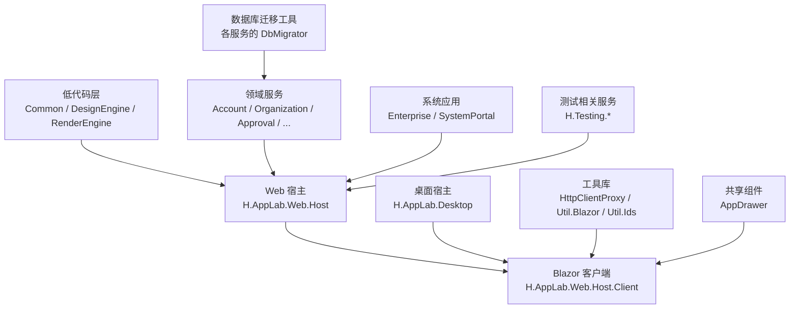
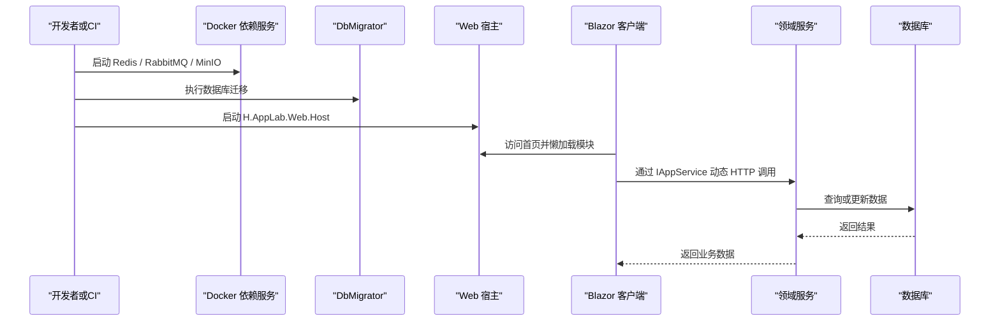
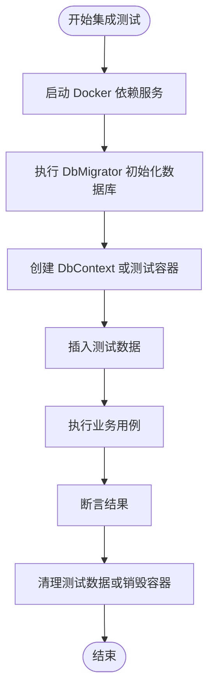
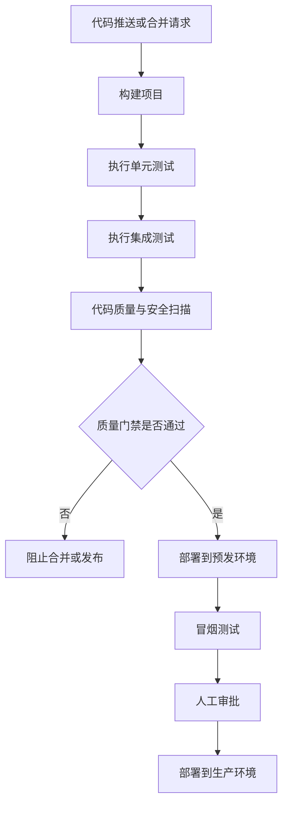
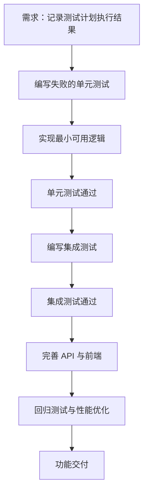
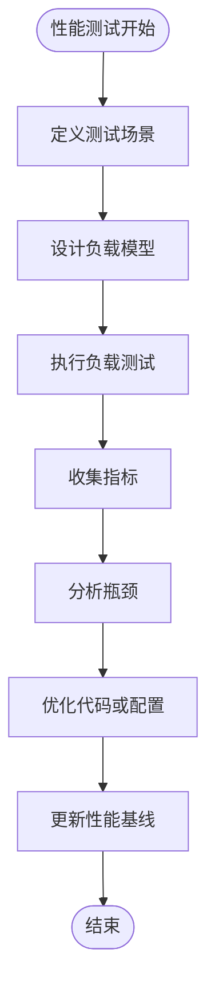
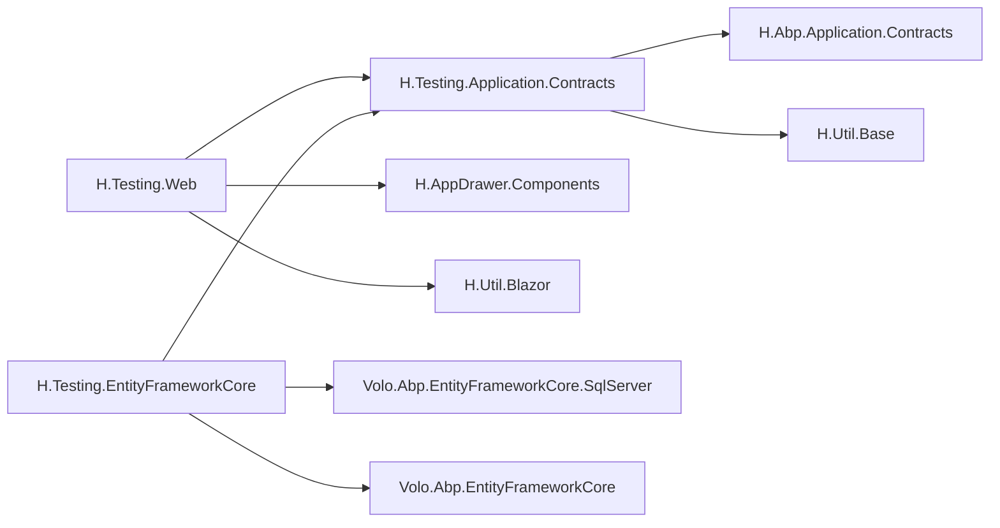

# 质量保证与测试策略

<cite>
**本文引用的文件**   
- [README.md](file://README.md)
- [开发指南.md](file://.qoder/repowiki/zh/content/开发指南.md)
- [global.json](file://src/global.json)
- [Directory.Packages.props](file://src/Directory.Packages.props)
- [NuGet.config](file://src/NuGet.config)
- [common.props](file://src/common.props)
- [docker-compose.yml](file://cd/docker-compose.yml)
- [H.Testing.Web.csproj](file://src/Services/Testing/H.Testing.Web/H.Testing.Web.csproj)
- [H.Testing.EntityFrameworkCore.csproj](file://src/Services/Testing/H.Testing.EntityFrameworkCore/H.Testing.EntityFrameworkCore.csproj)
- [H.Testing.Application.Contracts.csproj](file://src/Services/Testing/H.Testing.Application.Contracts/H.Testing.Application.Contracts.csproj)
</cite>

## 目录
1. [引言](#引言)
2. [项目结构](#project-structure)
3. [核心组件](#core-components)
4. [架构总览](#architecture-overview)
5. [单元测试编写指南](#unit-testing-guide)
6. [集成测试策略](#integration-testing-strategy)
7. [代码质量工具链配置](#code-quality-toolchain)
8. [持续集成流水线配置](#ci-pipeline)
9. [测试驱动开发实践案例](#tdd-practice)
10. [性能测试与负载测试](#performance-and-load-testing)
11. [依赖分析](#dependency-analysis)
12. [故障排查指南](#troubleshooting)
13. [结论](#conclusion)

## 引言
本质量保证与测试策略面向 H.AppLab 平台，目标是在现有 ABP + Blazor + Entity Framework Core + Docker 工程基础上，建立可执行、可度量、可持续演进的质量保障体系。文档覆盖单元测试最佳实践、集成测试方法、代码质量工具链、持续集成流水线、测试驱动开发示例以及生产级性能与负载测试建议。

H.AppLab 采用模块化架构：Host 提供宿主能力，Components 提供可复用 UI 组件，LowCode 提供低代码设计引擎与渲染引擎，Services 按限界上下文划分领域服务，System 提供系统应用，Tools 提供数据库迁移工具，Utils 提供公共工具库。该分层为测试分层提供了清晰边界。

**章节来源**
- [README.md:1-73](file://README.md#L1-L73)
- [开发指南.md:1-120](file://.qoder/repowiki/zh/content/开发指南.md#L1-L120)

## 项目结构
仓库根目录下的 README 已经对整体分层做了说明；开发指南进一步给出了 Web 宿主、Blazor 客户端、桌面宿主、低代码层、领域服务、迁移工具和工具库的职责关系。对于测试而言，关键结构如下：
- 每个 Services 领域通常包含 Application.Contracts、Application、EntityFrameworkCore、Web 四个子项目，便于隔离接口契约、业务实现、数据持久化和 Web 暴露面。
- Testing 相关代码目前集中在 Services/Testing 下，包括 EF Core 基础设施、Application Contracts、Web Razor 项目等。
- Tools 下每个 DbMigrator 对应一个服务的数据库迁移入口，适合集成测试时准备真实数据库结构。
- cd/docker-compose.yml 用于编排 Redis、RabbitMQ、MinIO 等外部依赖，是集成测试环境的重要基础。

图表来源
- [README.md:1-73](file://README.md#L1-L73)
- [开发指南.md:1-120](file://.qoder/repowiki/zh/content/开发指南.md#L1-L120)

**章节来源**
- [README.md:1-73](file://README.md#L1-L73)
- [开发指南.md:1-120](file://.qoder/repowiki/zh/content/开发指南.md#L1-L120)

## 核心组件
从质量保证角度，以下组件最值得关注：
- Web 宿主：聚合多个 Application 层模块，暴露 API，并承载 Blazor Server/WebAssembly 混合运行能力。
- Blazor 客户端：负责前端路由、懒加载模块程序集，并通过 HttpClientProxy 调用后端 IAppService。
- 领域服务：遵循 Application.Contracts/Application/EntityFrameworkCore/Web 分层，适合按层拆分单元测试和集成测试。
- EF Core 数据层：使用 SqlServer 提供持久化能力，适合通过 TestContainers 或内存数据库进行集成测试。
- 迁移工具：每个服务对应一个 DbMigrator，可用于集成测试前初始化数据库结构。
- 工具库：HTTP 动态代理、Blazor 工具、ID 生成器等，可作为被测对象或测试辅助工具。

**章节来源**
- [README.md:1-73](file://README.md#L1-L73)
- [开发指南.md:120-297](file://.qoder/repowiki/zh/content/开发指南.md#L120-L297)

## 架构总览
下图展示 H.AppLab 在测试视角下的交互关系：开发者或 CI 触发构建与测试，DbMigrator 初始化数据库，Docker 启动外部依赖，Web 宿主启动后由 Blazor 客户端发起 HTTP 请求，最终访问领域服务与数据库。

图表来源
- [docker-compose.yml:1-48](file://cd/docker-compose.yml#L1-L48)
- [README.md:1-73](file://README.md#L1-L73)
- [开发指南.md:1-120](file://.qoder/repowiki/zh/content/开发指南.md#L1-L120)

## 单元测试编写指南
### 测试框架选择
当前仓库中未出现 xUnit、NUnit 或 MSTest 的显式测试项目引用；开发指南提到可在 Testing 服务中参考现有测试结构，使用 xUnit/MSTest/NUnit 结合 EF Core InMemory/TestContainers 或真实数据库进行测试。因此建议团队统一选择一个框架，例如：
- 若偏好 .NET 社区主流生态，可选择 xUnit。
- 若希望与 ABP 生态更贴近，可评估 MSTest。
- 若已有 NUnit 历史资产，可继续保留 NUnit。

无论选择哪种框架，都应遵循单一职责、可重复执行、无副作用的原则。

### 测试项目组织
建议为每个 Services 限界上下文创建独立测试项目：
- Unit 测试项目：测试 Application 层的 AppService、领域逻辑、DTO 映射、验证规则等。
- Integration 测试项目：测试 EF Core 仓储、数据库约束、事务行为、API 控制器或远程服务调用。
- Shared 测试基础设施：封装 Mock 工厂、测试数据生成器、数据库连接配置、断言扩展。

### Mock 对象创建
- 对 IAppService、IRepository、IExternalService 等抽象依赖，优先使用 Moq 或 NSubstitute 创建 Mock。
- Mock 应模拟输入输出契约，而不是复制被测试对象的内部实现。
- 对时间、随机数、文件系统、网络请求等外部依赖，建议使用可注入的替代实现，而非全局单例。

### 异步测试编写
- 所有异步测试方法应返回 Task 或 Task<T>，并使用 async/await。
- 避免在测试中使用阻塞调用如 Wait() 或 Result，防止死锁。
- 对并发场景，使用 Parallel.ForEachAsync、Task.WhenAll 等明确控制并发度，并设置合理超时。

### 测试数据准备
- 简单数据：使用集合初始值、静态常量、工厂方法。
- 复杂实体：使用 Builder 模式或 Fixture 类集中管理。
- 数据库测试：优先使用轻量种子数据；必要时使用 Faker 类库生成符合规则的测试数据。

### 断言最佳实践
- 只断言对外可见的结果，不断言内部状态。
- 对异常路径，明确断言异常类型、消息或错误码。
- 对异步结果，先等待任务完成再断言。

### 测试命名约定
建议采用 Given_When_Then 或 Should_When 风格，例如：
- “当用户不存在时应抛出授权异常”
- “当订单金额为零时应拒绝提交”

**章节来源**
- [开发指南.md:180-297](file://.qoder/repowiki/zh/content/开发指南.md#L180-L297)

## 集成测试策略
### 数据库测试
- 推荐使用 TestContainers 启动 SQL Server、Redis、RabbitMQ、MinIO 等依赖，使测试更接近生产环境。
- 对 EF Core 集成测试，使用临时数据库或事务回滚机制保证测试隔离性。
- 使用 Tools 下的 DbMigrator 初始化数据库结构，确保迁移脚本正确。

图表来源
- [docker-compose.yml:1-48](file://cd/docker-compose.yml#L1-L48)
- [开发指南.md:120-297](file://.qoder/repowiki/zh/content/开发指南.md#L120-L297)

### API 测试
- 对 Web 宿主暴露的 API，使用 HttpClient 或 Abp 提供的远程服务代理发起请求。
- 使用 TestServer 或 InProcess 方式减少进程间开销。
- 覆盖正常路径、参数校验失败、权限不足、业务异常等场景。

### 前端组件测试
- 对 Blazor 组件，可使用 Bunit 或官方组件测试方案。
- 模拟 StateContainer、导航、Toast、HttpClient 等依赖。
- 验证组件渲染结果、事件触发、异步状态变化。

### 端到端测试
- 对关键业务流程，可使用 Playwright 或 Selenium 模拟浏览器操作。
- 端到端测试数量应少而精，重点覆盖登录、下单、审批、发布等主流程。

**章节来源**
- [docker-compose.yml:1-48](file://cd/docker-compose.yml#L1-L48)
- [开发指南.md:120-297](file://.qoder/repowiki/zh/content/开发指南.md#L120-L297)

## 代码质量工具链配置
### 静态代码分析
建议引入以下工具：
- Roslyn Analyzers：启用 C# 默认规则，补充 ABP、Blazor、EF Core 相关规则。
- StyleCop：统一代码格式、注释、命名规范。
- SonarQube/SonarCloud：集中管理代码质量门禁、技术债务和安全扫描。

### 代码覆盖率统计
- 使用 Coverlet 收集覆盖率，输出 XML 或 JSON。
- 使用 ReportGenerator 生成 HTML 报告，便于在 CI 中归档。
- 设定最低覆盖率阈值，例如行覆盖率不低于 80%，分支覆盖率不低于 70%。

### 安全漏洞扫描
- 使用 dotnet audit 检查 NuGet 包漏洞。
- 使用 Snyk、GitHub Dependabot 或 Azure Security Center 监控第三方依赖风险。
- 将安全扫描纳入 CI 门禁，严重漏洞必须修复后才能合并。

### 自动化检查清单
- 编译成功
- 单元测试通过
- 集成测试通过
- 代码覆盖率达标
- 静态分析无严重问题
- 安全扫描无高危漏洞

**章节来源**
- [Directory.Packages.props:1-102](file://src/Directory.Packages.props#L1-L102)
- [common.props:1-15](file://src/common.props#L1-L15)
- [开发指南.md:120-297](file://.qoder/repowiki/zh/content/开发指南.md#L120-L297)

## 持续集成流水线配置
### GitHub Actions 建议
建议在 .github/workflows 中定义以下阶段：
- Build：还原依赖、编译、打包。
- Unit Test：执行单元测试，收集覆盖率。
- Integration Test：启动 Docker 依赖，执行数据库和 API 集成测试。
- Quality Gate：运行静态分析、覆盖率检查、安全扫描。
- Publish：可选地推送 NuGet 包或镜像到仓库。

### Azure DevOps 管道建议
Azure DevOps 管道可包含：
- .NET restore/build/test
- SonarQube 分析
- Code Coverage 上报
- Artifact 归档
- Release 管道触发部署

### 自动化部署流程
- 预发环境：自动部署到预览环境，触发冒烟测试。
- 生产环境：人工审批后部署，支持灰度发布、回滚。
- 数据库变更：优先使用 DbMigrator 自动迁移，失败则阻断发布。

图表来源
- [docker-compose.yml:1-48](file://cd/docker-compose.yml#L1-L48)
- [README.md:1-73](file://README.md#L1-L73)
- [开发指南.md:120-297](file://.qoder/repowiki/zh/content/开发指南.md#L120-L297)

**章节来源**
- [docker-compose.yml:1-48](file://cd/docker-compose.yml#L1-L48)
- [README.md:1-73](file://README.md#L1-L73)
- [开发指南.md:120-297](file://.qoder/repowiki/zh/content/开发指南.md#L120-L297)

## 测试驱动开发实践案例
以下以“测试计划执行记录”为例，展示从测试用例开始构建高质量代码的过程。该案例基于 H.Testing 服务的相关结构，但仅描述流程，不直接粘贴代码。

### 需求假设
- 需要记录测试计划的执行结果。
- 需要支持查询执行报告。
- 需要支持异步执行任务。

### 步骤一：编写失败的单元测试
- 在 Application 层 AppService 测试项目中，编写“执行测试计划后应返回成功报告”的失败用例。
- 断言执行状态、耗时、结果摘要等关键字段。

### 步骤二：编写最小实现
- 在 AppService 中实现最小可用逻辑，使单元测试通过。
- 对依赖的外部服务，使用 Mock 隔离。

### 步骤三：编写集成测试
- 新增 EF Core 集成测试，验证数据写入、查询、排序、分页。
- 使用临时数据库或 TestContainers 保证隔离。

### 步骤四：完善 API 与前端
- 在 Web 层暴露查询执行报告的 API。
- 在前端添加查看执行记录的页面。

### 步骤五：回归与优化
- 补充异常路径测试。
- 抽取公共测试数据构造器。
- 添加性能基准测试，观察慢查询。

图表来源
- [开发指南.md:200-297](file://.qoder/repowiki/zh/content/开发指南.md#L200-L297)

**章节来源**
- [开发指南.md:200-297](file://.qoder/repowiki/zh/content/开发指南.md#L200-L297)

## 性能测试与负载测试
### 性能测试目标
- 验证关键接口的响应时间、吞吐量和资源占用。
- 识别数据库慢查询、内存泄漏、GC 压力点。
- 评估缓存、连接池、线程池配置是否合理。

### 推荐工具
- k6、JMeter、Locust：用于 HTTP API 负载测试。
- BenchmarkDotNet：用于 C# 方法级微基准测试。
- Application Insights、Prometheus、Grafana：用于生产性能观测。

### 典型场景
- 登录接口高并发登录。
- 测试计划批量执行。
- 大文件上传下载。
- 报表导出与分页查询。

### 基线与告警
- 建立性能基线，每次变更对比基线。
- 对 P95/P99 延迟、错误率、CPU、内存设置阈值。
- 超出阈值时触发告警并阻断发布。

[此图为概念流程图，不对应具体源代码文件]

## 依赖分析
H.Testing 相关项目的依赖关系如下：
- H.Testing.Web 引用 H.Testing.Application.Contracts、AppDrawer 组件和 H.Util.Blazor。
- H.Testing.EntityFrameworkCore 引用 Volo.Abp.EntityFrameworkCore.SqlServer 和 Volo.Abp.EntityFrameworkCore，并依赖 H.Testing.Application.Contracts。
- H.Testing.Application.Contracts 引用 H.Abp.Application.Contracts 和 H.Util.Base。

图表来源
- [H.Testing.Web.csproj:1-15](file://src/Services/Testing/H.Testing.Web/H.Testing.Web.csproj#L1-L15)
- [H.Testing.EntityFrameworkCore.csproj:1-16](file://src/Services/Testing/H.Testing.EntityFrameworkCore/H.Testing.EntityFrameworkCore.csproj#L1-L16)
- [H.Testing.Application.Contracts.csproj:1-10](file://src/Services/Testing/H.Testing.Application.Contracts/H.Testing.Application.Contracts.csproj#L1-L10)

**章节来源**
- [H.Testing.Web.csproj:1-15](file://src/Services/Testing/H.Testing.Web/H.Testing.Web.csproj#L1-L15)
- [H.Testing.EntityFrameworkCore.csproj:1-16](file://src/Services/Testing/H.Testing.EntityFrameworkCore/H.Testing.EntityFrameworkCore.csproj#L1-L16)
- [H.Testing.Application.Contracts.csproj:1-10](file://src/Services/Testing/H.Testing.Application.Contracts/H.Testing.Application.Contracts.csproj#L1-L10)

## 故障排查指南
### 本地环境问题
- SDK 版本不一致：确认 src/global.json 指定版本，并使用 dotnet --info 核对。
- 数据库连接失败：检查连接字符串、SQL Server 实例、防火墙、账号权限。
- Docker 依赖未启动：通过 docker ps 检查 Redis、RabbitMQ、MinIO 是否运行。

### 测试失败问题
- 单元测试 Mock 不正确：检查 Mock 返回值、调用次数、异常抛出。
- 集成测试数据污染：确认事务回滚或容器销毁逻辑。
- 异步测试超时：检查 await 是否正确、任务是否被取消、资源是否释放。

### CI 流水线问题
- 构建失败：检查 NuGet 源、包版本、TargetFramework。
- 覆盖率不达标：检查测试项目是否被纳入覆盖范围。
- 安全扫描失败：根据 SonarQube 或依赖扫描报告修复漏洞。

**章节来源**
- [global.json:1-6](file://src/global.json#L1-L6)
- [Directory.Packages.props:1-102](file://src/Directory.Packages.props#L1-L102)
- [NuGet.config:1-7](file://src/NuGet.config#L1-L7)
- [docker-compose.yml:1-48](file://cd/docker-compose.yml#L1-L48)
- [开发指南.md:120-297](file://.qoder/repowiki/zh/content/开发指南.md#L120-L297)

## 结论
H.AppLab 平台具备清晰的模块化架构和完善的宿主、低代码、服务、工具与基础设施能力。通过本文提出的单元测试指南、集成测试策略、代码质量工具链、持续集成流水线、TDD 实践案例以及性能与负载测试建议，团队可以逐步建立起稳定、高效、可演进的工程质量体系。建议优先落地：
- 统一测试框架与命名规范。
- 为关键领域服务补齐单元测试与集成测试。
- 接入静态分析与安全扫描。
- 搭建 GitHub Actions 或 Azure DevOps 自动化流水线。
- 建立性能基线并持续监控。

[本节为总结性内容，不直接分析具体文件]