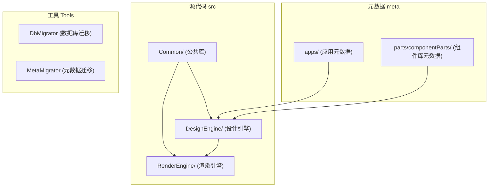
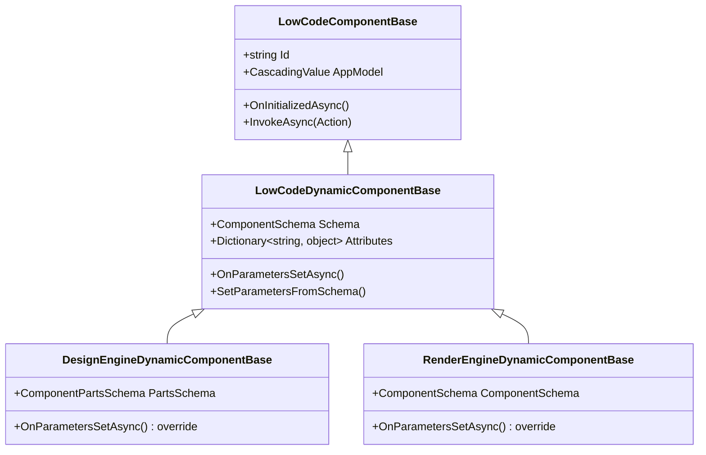

# 开发者指南

<cite>
**本文档引用的文件**   
- [README.md](file://README.md)
- [Program.cs](file://src/DesignEngine/H.LowCode.DesignEngine.Host/Program.cs)
- [Program.cs](file://src/RenderEngine/H.LowCode.RenderEngine.Host/Program.cs)
- [Program.cs](file://src/DesignEngine/H.LowCode.DesignEngine.Host.Client/Program.cs)
- [LowCodeGlobalVariables.cs](file://src/DesignEngine/H.LowCode.DesignEngine.Host.Client/LowCodeGlobalVariables.cs)
- [LowCodeGlobalVariables.cs](file://src/RenderEngine/H.LowCode.RenderEngine.Host.Client/LowCodeGlobalVariables.cs)
- [LowCodeComponentBase.cs](file://src/Common/H.LowCode.ComponentBase/LowCodeComponentBase.cs)
- [LowCodeDynamicComponentBase.cs](file://src/Common/H.LowCode.ComponentBase/LowCodeDynamicComponentBase.cs)
- [DesignEngineDynamicComponentBase.cs](file://src/DesignEngine/H.LowCode.DesignEngineBase/DesignEngineDynamicComponentBase.cs)
- [RenderEngineDynamicComponentBase.cs](file://src/RenderEngine/H.LowCode.RenderEngine.Abstraction/RenderEngineDynamicComponentBase.cs)
- [ComponentSchemaBase.cs](file://src/Common/H.LowCode.MetaSchema/ComponentSchemaBase.cs)
- [PageSchemaBase.cs](file://src/Common/H.LowCode.MetaSchema/PageSchemaBase.cs)
</cite>

## 目录
1. [简介](#简介)
2. [项目结构](#项目结构)
3. [环境搭建](#环境搭建)
4. [模块开发规范](#模块开发规范)
5. [动态组件加载机制](#动态组件加载机制)
6. [调试与全局状态跟踪](#调试与全局状态跟踪)
7. [常见问题排查](#常见问题排查)
8. [编码规范与性能优化](#编码规范与性能优化)

## 简介
本指南旨在为开发者提供一份详尽的实践性文档，帮助其快速上手 H.LowCode 项目并进行二次开发。H.LowCode 是一个基于 .NET 8.0 和 Blazor 的低代码实验性项目，采用模块化架构，包含设计引擎（DesignEngine）和渲染引擎（RenderEngine）两大核心。本指南将详细介绍环境配置、模块开发、动态组件、调试技巧及问题解决方案。

## 项目结构
项目采用分层和模块化设计，主要分为 `meta`（元数据）、`src`（源代码）和 `Tools`（工具）三大目录。



**图示来源**
- [README.md](file://README.md)
- 项目结构信息

## 环境搭建
### 安装 .NET 8.0 SDK
确保已安装 .NET 8.0 SDK。可通过命令行验证：
```bash
dotnet --version
```

### 配置 IDE
推荐使用 Visual Studio 2022 或 Visual Studio Code 配合 C# 扩展进行开发。

### 还原 NuGet 包
在项目根目录执行：
```bash
dotnet restore
```

### 运行 DesignEngine
1.  启动设计引擎后端：
    ```bash
    dotnet run --project src/DesignEngine/H.LowCode.DesignEngine.Host
    ```
2.  启动设计引擎前端（WebAssembly）：
    ```bash
    dotnet run --project src/DesignEngine/H.LowCode.DesignEngine.Host.Client
    ```
    后端 `Program.cs` 文件配置了服务端和 WebAssembly 两种渲染模式，前端 `Program.cs` 文件负责初始化客户端应用。

**代码示例：DesignEngine 后端启动配置**
```csharp
// src/DesignEngine/H.LowCode.DesignEngine.Host/Program.cs
var builder = WebApplication.CreateBuilder(args);
builder.Services.AddRazorComponents()
    .AddInteractiveServerComponents()
    .AddInteractiveWebAssemblyComponents();

await builder.AddApplicationAsync<DesignEngineHostModule>(); // 注册 ABP 模块

app.MapRazorComponents<App>()
    .AddInteractiveServerRenderMode()
    .AddInteractiveWebAssemblyRenderMode()
    .AddAdditionalAssemblies(LowCodeGlobalVariables.AdditionalAssemblies); // 动态加载程序集
```

### 运行 RenderEngine
运行渲染引擎的步骤与设计引擎类似：
```bash
dotnet run --project src/RenderEngine/H.LowCode.RenderEngine.Host
dotnet run --project src/RenderEngine/H.LowCode.RenderEngine.Host.Client
```
其 `Program.cs` 文件结构与 DesignEngine 高度一致，体现了代码复用。

**图示来源**
- [Program.cs](file://src/DesignEngine/H.LowCode.DesignEngine.Host/Program.cs#L1-L77)
- [Program.cs](file://src/RenderEngine/H.LowCode.RenderEngine.Host/Program.cs#L1-L78)
- [Program.cs](file://src/DesignEngine/H.LowCode.DesignEngine.Host.Client/Program.cs#L1-L20)

## 模块开发规范
### 创建新的 ABP 模块
1.  在 `src` 目录下创建新项目，例如 `H.LowCode.MyModule`。
2.  创建一个继承自 `AbpModule` 的类，例如 `MyModule.cs`。
3.  在 `ConfigureServices` 方法中注册服务和依赖。

**代码示例：模块定义**
```csharp
// MyAppModule.cs
public class MyAppModule : AbpModule
{
    public override void ConfigureServices(ServiceConfigurationContext context)
    {
        // 注册服务
        context.Services.AddTransient<IMyService, MyService>();
        // 处理依赖注入
        Configure<AbpLocalizationOptions>(options =>
        {
            options.Resources.Add<MyResource>("zh-Hans");
        });
    }
}
```

### 服务注册与依赖注入
遵循 ABP 框架的依赖注入规范，使用 `context.Services` 进行服务注册，并通过构造函数注入使用。

**节来源**
- [MyAppModule.cs](file://src/DesignEngine/H.LowCode.MyApp/MyAppModule.cs)

## 动态组件加载机制
### 实现原理
动态组件是低代码平台的核心。`LowCodeDynamicComponentBase` 是所有动态组件的基类，它通过元数据（JSON）来驱动 UI 的渲染。

1.  **元数据驱动**：组件的属性、样式、事件等信息存储在 `meta` 目录的 JSON 文件中。
2.  **基类继承**：所有组件继承自 `LowCodeComponentBase`，而动态组件则继承自 `LowCodeDynamicComponentBase`。
3.  **运行时解析**：在运行时，系统读取 JSON 元数据，创建组件实例，并根据元数据设置其属性。

**类图：动态组件继承关系**


**图示来源**
- [LowCodeComponentBase.cs](file://src/Common/H.LowCode.ComponentBase/LowCodeComponentBase.cs#L1-L50)
- [LowCodeDynamicComponentBase.cs](file://src/Common/H.LowCode.ComponentBase/LowCodeDynamicComponentBase.cs#L1-L40)
- [DesignEngineDynamicComponentBase.cs](file://src/DesignEngine/H.LowCode.DesignEngineBase/DesignEngineDynamicComponentBase.cs#L1-L20)
- [RenderEngineDynamicComponentBase.cs](file://src/RenderEngine/H.LowCode.RenderEngine.Abstraction/RenderEngineDynamicComponentBase.cs#L1-L20)

### 调试技巧
-   在 `LowCodeDynamicComponentBase.OnParametersSetAsync()` 方法中设置断点，观察 `Schema` 对象的加载过程。
-   检查 `meta` 目录下的 JSON 文件是否正确，确保 `id` 字段与代码中的组件匹配。

## 调试与全局状态跟踪
### 调试组件渲染流程
1.  在 `RenderEngine` 的 `MetaAppService` 中获取页面元数据。
2.  在 `App.razor` 组件的 `OnInitializedAsync` 方法中，观察元数据的传递。
3.  在具体的组件（如 `FormComponentRender.razor`）中，通过 `ComponentSchema` 属性查看其配置。

### 利用 LowCodeGlobalVariables 进行全局状态跟踪
`LowCodeGlobalVariables` 类用于在客户端存储全局变量，如动态加载的程序集。

**代码示例：全局变量使用**
```csharp
// src/DesignEngine/H.LowCode.DesignEngine.Host.Client/LowCodeGlobalVariables.cs
public static class LowCodeGlobalVariables
{
    public static Assembly[] AdditionalAssemblies { get; set; } = Array.Empty<Assembly>();
}

// 在 Program.cs 中使用
app.MapRazorComponents<App>()
    .AddAdditionalAssemblies(LowCodeGlobalVariables.AdditionalAssemblies);
```
通过修改 `AdditionalAssemblies`，可以动态地向应用注入新的功能模块，便于调试和扩展。

**节来源**
- [LowCodeGlobalVariables.cs](file://src/DesignEngine/H.LowCode.DesignEngine.Host.Client/LowCodeGlobalVariables.cs#L1-L10)
- [LowCodeGlobalVariables.cs](file://src/RenderEngine/H.LowCode.RenderEngine.Host.Client/LowCodeGlobalVariables.cs#L1-L10)

## 常见问题排查
### 元数据加载失败
-   **检查点**：确认 `meta` 目录下的 JSON 文件路径和文件名是否正确。
-   **检查点**：检查 `appsettings.json` 中的元数据路径配置。

### 组件不显示
-   **检查点**：检查组件的 `id` 是否在元数据中正确定义。
-   **检查点**：在 `LowCodeDynamicComponentBase` 的 `SetParametersFromSchema` 方法中调试，确认属性是否成功绑定。

### 事件绑定无效
-   **检查点**：检查元数据中 `events` 字段的配置，确保 `target` 和 `action` 正确。
-   **检查点**：在组件的 `OnInitializedAsync` 方法中，确认事件处理程序是否被正确注册。

## 编码规范与性能优化
### 编码规范
-   遵循 ABP 框架的命名和分层规范。
-   组件的元数据变更需同步更新 JSON Schema。

### 性能优化建议
-   **元数据缓存**：对频繁读取的元数据进行内存缓存，减少文件 I/O。
-   **按需加载**：对于大型应用，实现组件的懒加载，提升首屏渲染速度。
-   **减少重渲染**：在 `OnParametersSetAsync` 中进行必要的变更检查，避免不必要的 UI 更新。