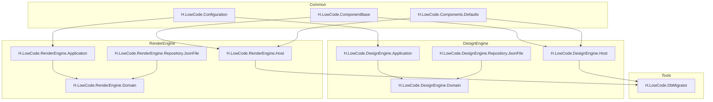
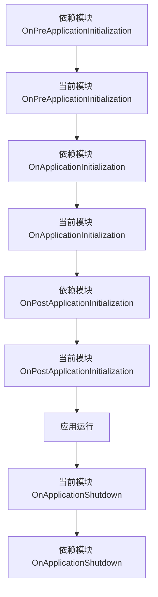

# 模块开发规范

<cite>
**本文档引用的文件**  
- [LowCodeComponentBaseModule.cs](file://src/Common/H.LowCode.ComponentBase/LowCodeComponentBaseModule.cs)
- [DesignEngineHostModule.cs](file://src/DesignEngine/H.LowCode.DesignEngine.Host/DesignEngineHostModule.cs)
- [RenderEngineHostModule.cs](file://src/RenderEngine/H.LowCode.RenderEngine.Host/RenderEngineHostModule.cs)
- [DesignEngineApplicationModule.cs](file://src/DesignEngine/H.LowCode.DesignEngine.Application/DesignEngineApplicationModule.cs)
- [RenderEngineApplicationModule.cs](file://src/RenderEngine/H.LowCode.RenderEngine.Application/RenderEngineApplicationModule.cs)
- [LowCodeComponentBase.cs](file://src/Common/H.LowCode.ComponentBase/LowCodeComponentBase.cs)
- [LowCodeAppState.cs](file://src/Common/H.LowCode.ComponentBase/LowCodeAppState.cs)
- [MetaOption.cs](file://src/Common/H.LowCode.Configuration/Options/MetaOption.cs)
- [DesignEngineModule.cs](file://src/DesignEngine/H.LowCode.DesignEngine/DesignEngineModule.cs)
- [RenderEngineModule.cs](file://src/RenderEngine/H.LowCode.RenderEngine/RenderEngineModule.cs)
- [LowCodeDefaultComponentModule.cs](file://src/Common/H.LowCode.Components.Defaults/LowCodeDefaultComponentModule.cs)
- [MyAppModule.cs](file://src/DesignEngine/H.LowCode.MyApp/MyAppModule.cs)
</cite>

## 目录
1. [引言](#引言)
2. [项目结构](#项目结构)
3. [核心模块实现模式](#核心模块实现模式)
4. [模块依赖关系与解耦设计](#模块依赖关系与解耦设计)
5. [模块生命周期管理](#模块生命周期管理)
6. [服务注册与依赖注入](#服务注册与依赖注入)
7. [配置选项注入实践](#配置选项注入实践)
8. [应用状态管理](#应用状态管理)
9. [最佳实践建议](#最佳实践建议)
10. [结论](#结论)

## 引言
本文档详细说明基于ABP框架的模块化开发规范，涵盖模块定义、服务注册、依赖管理、生命周期控制等关键方面。通过分析实际代码实现，提供可操作的最佳实践指导，帮助开发者构建高内聚、低耦合的模块化系统。

## 项目结构
本项目采用分层模块化架构，主要分为Common、DesignEngine、RenderEngine和Tools四大模块群。每个模块群包含多个功能模块，遵循ABP框架的模块化设计原则。



**图示来源**  
- [DesignEngineHostModule.cs](file://src/DesignEngine/H.LowCode.DesignEngine.Host/DesignEngineHostModule.cs)
- [RenderEngineHostModule.cs](file://src/RenderEngine/H.LowCode.RenderEngine.Host/RenderEngineHostModule.cs)

## 核心模块实现模式
ABP模块通过继承`AbpModule`基类实现，每个模块类负责定义其自身的服务注册和配置逻辑。

### 基础模块实现
`LowCodeComponentBaseModule`作为基础组件模块，展示了最简化的模块实现模式：

```csharp
public class LowCodeComponentBaseModule : AbpModule
{
    public override void ConfigureServices(ServiceConfigurationContext context)
    {
        //状态管理
        context.Services.AddScoped(typeof(ComponentState<>));
        context.Services.AddScoped(typeof(ComponentState<,>));
    }
}
```

该模块仅在`ConfigureServices`方法中注册了泛型组件状态服务，生命周期为Scoped。

**模块来源**  
- [LowCodeComponentBaseModule.cs](file://src/Common/H.LowCode.ComponentBase/LowCodeComponentBaseModule.cs)

### 高级模块实现
`DesignEngineHostModule`展示了复杂的模块实现，包含多个依赖模块和丰富的配置逻辑：

```csharp
[DependsOn(
    typeof(AbpAutofacModule),
    typeof(AbpAspNetCoreMvcModule),
    typeof(DesignEngineApplicationModule),
    typeof(DesignEngineEntityFrameworkCoreModule),
    typeof(DesignEngineJsonFileRepositoryModule),
    typeof(LowCodeWorkbenchModule),
    typeof(DesignEngineModule),
    typeof(MyAppModule),
    typeof(PartsDesignEngineModule),
    typeof(LowCodeDefaultComponentModule),
    typeof(LowCodeComponentBaseModule)
)]
public class DesignEngineHostModule : AbpModule
{
    public override void ConfigureServices(ServiceConfigurationContext context)
    {
        ConfigureAutoApiControllers();
        context.Services.AddSingleton(new LowCodeAppState(true));
    }

    private void ConfigureAutoApiControllers()
    {
        Configure<AbpAspNetCoreMvcOptions>(options =>
        {
            options.ConventionalControllers.Create(typeof(DesignEngineApplicationModule).Assembly);
        });
    }
}
```

此模块通过`[DependsOn]`特性声明了对多个其他模块的依赖，并在`ConfigureServices`中配置了自动API控制器和应用状态服务。

**模块来源**  
- [DesignEngineHostModule.cs](file://src/DesignEngine/H.LowCode.DesignEngine.Host/DesignEngineHostModule.cs)

## 模块依赖关系与解耦设计
ABP框架通过`[DependsOn]`特性管理模块间的依赖关系，确保模块按正确顺序初始化。

### 依赖关系图

```mermaid
graph TD
AbpAutofacModule --> DesignEngineHostModule
AbpAspNetCoreMvcModule --> DesignEngineHostModule
DesignEngineApplicationModule --> DesignEngineHostModule
DesignEngineEntityFrameworkCoreModule --> DesignEngineHostModule
DesignEngineJsonFileRepositoryModule --> DesignEngineHostModule
LowCodeWorkbenchModule --> DesignEngineHostModule
DesignEngineModule --> DesignEngineHostModule
MyAppModule --> DesignEngineHostModule
PartsDesignEngineModule --> DesignEngineHostModule
LowCodeDefaultComponentModule --> DesignEngineHostModule
LowCodeComponentBaseModule --> DesignEngineHostModule
DesignEngineDomainModule --> DesignEngineApplicationModule
DesignEngineDomainModule --> DesignEngineJsonFileRepositoryModule
DesignEngineDomainModule --> DesignEngineRemoteServiceRepositoryModule
RenderEngineDomainModule --> RenderEngineApplicationModule
RenderEngineDomainModule --> RenderEngineJsonFileRepositoryModule
RenderEngineDomainModule --> RenderEngineRemoteServiceRepositoryModule
```


**图示来源**  
- [DesignEngineHostModule.cs](file://src/DesignEngine/H.LowCode.DesignEngine.Host/DesignEngineHostModule.cs)
- [DesignEngineApplicationModule.cs](file://src/DesignEngine/H.LowCode.DesignEngine.Application/DesignEngineApplicationModule.cs)
- [RenderEngineApplicationModule.cs](file://src/RenderEngine/H.LowCode.RenderEngine.Application/RenderEngineApplicationModule.cs)

### 解耦设计原则
1. **单向依赖**：模块间依赖应为单向，避免循环依赖
2. **分层依赖**：高层模块可以依赖低层模块，但反之则不行
3. **接口隔离**：通过接口而非具体实现进行依赖
4. **最小依赖**：只依赖必需的模块，避免过度依赖

## 模块生命周期管理
ABP模块提供了完整的生命周期管理方法，包括初始化和关闭阶段。

### 生命周期方法
```csharp
public class RenderEngineHostModule : AbpModule
{
    public override void OnApplicationInitialization(ApplicationInitializationContext context)
    {
        // 应用初始化逻辑
    }

    public override void OnApplicationShutdown(ApplicationShutdownContext context)
    {
        // 应用关闭逻辑
    }
}
```

### 生命周期执行顺序


**图示来源**  
- [RenderEngineHostModule.cs](file://src/RenderEngine/H.LowCode.RenderEngine.Host/RenderEngineHostModule.cs)

## 服务注册与依赖注入
ABP框架基于Microsoft.Extensions.DependencyInjection实现依赖注入，支持三种生命周期。

### 服务生命周期
| 生命周期 | 说明 | 使用场景 |
|--------|------|--------|
| Singleton | 单例模式，整个应用生命周期内仅创建一次 | 全局状态、配置服务 |
| Scoped | 作用域模式，每个请求创建一次 | 数据库上下文、用户会话 |
| Transient | 瞬态模式，每次请求都创建新实例 | 工具类、无状态服务 |

### 服务注册示例
```csharp
// 单例服务注册
context.Services.AddSingleton(new LowCodeAppState(true));

// 作用域服务注册
context.Services.AddScoped(typeof(ComponentState<>));

// 瞬态服务注册
context.Services.AddTransient<DragDropStateService>();

// 框架服务注册
context.Services.AddAntDesign();
```

**代码来源**  
- [LowCodeComponentBaseModule.cs](file://src/Common/H.LowCode.ComponentBase/LowCodeComponentBaseModule.cs)
- [DesignEngineModule.cs](file://src/DesignEngine/H.LowCode.DesignEngine/DesignEngineModule.cs)
- [DesignEngineHostModule.cs](file://src/DesignEngine/H.LowCode.DesignEngine.Host/DesignEngineHostModule.cs)

## 配置选项注入实践
ABP框架支持通过`IOptions<T>`模式注入配置选项，实现配置与代码的解耦。

### 配置类定义
```csharp
public class MetaOption
{
    public const string SectionName = "Meta";
    public string AppsFilePath { get; set; }
    public string PartsFilePath { get; set; }
}
```

### 配置注入实现
```csharp
public class RenderEngineApplicationModule : AbpModule
{
    public override void ConfigureServices(ServiceConfigurationContext context)
    {
        var configuration = context.Services.GetConfiguration();
        context.Services.Configure<MetaOption>(configuration.GetSection(MetaOption.SectionName));
        
        Configure<AbpAutoMapperOptions>(options =>
        {
            options.AddMaps<RenderEngineApplicationModule>();
        });
    }
}
```

### 配置使用方式
在服务中通过依赖注入获取配置：

```csharp
public class SomeService
{
    private readonly MetaOption _metaOption;
    
    public SomeService(IOptions<MetaOption> metaOption)
    {
        _metaOption = metaOption.Value;
    }
}
```

**代码来源**  
- [MetaOption.cs](file://src/Common/H.LowCode.Configuration/Options/MetaOption.cs)
- [RenderEngineApplicationModule.cs](file://src/RenderEngine/H.LowCode.RenderEngine.Application/RenderEngineApplicationModule.cs)

## 应用状态管理
应用状态通过`LowCodeAppState`类实现，用于区分设计时和运行时环境。

### 状态类实现
```csharp
public class LowCodeAppState
{
    public LowCodeAppState(bool isDesign)
    {
        IsDesign = isDesign;
    }

    /// <summary>
    /// 是否设计时
    /// </summary>
    public bool IsDesign { get; }
}
```

### 状态注入与使用
```csharp
public abstract class LowCodeComponentBase : AbpComponentBase
{
    [Inject]
    private LowCodeAppState LowCodeAppState { get; set; }

    protected bool IsDesign
    {
        get
        {
            return LowCodeAppState.IsDesign;
        }
    }
}
```

在宿主模块中注册为单例服务：

```csharp
// 设计时环境
context.Services.AddSingleton(new LowCodeAppState(true));

// 运行时环境
context.Services.AddSingleton(new LowCodeAppState(false));
```

**代码来源**  
- [LowCodeAppState.cs](file://src/Common/H.LowCode.ComponentBase/LowCodeAppState.cs)
- [LowCodeComponentBase.cs](file://src/Common/H.LowCode.ComponentBase/LowCodeComponentBase.cs)
- [DesignEngineHostModule.cs](file://src/DesignEngine/H.LowCode.DesignEngine.Host/DesignEngineHostModule.cs)

## 最佳实践建议
### 模块设计原则
1. **单一职责**：每个模块应专注于单一功能领域
2. **高内聚**：模块内部组件应紧密相关
3. **低耦合**：模块间依赖应尽量减少
4. **可复用**：设计通用模块供多个项目使用

### 服务注册最佳实践
1. **选择合适的生命周期**：
   - 无状态服务使用Transient
   - 请求级服务使用Scoped
   - 全局服务使用Singleton

2. **避免服务膨胀**：
   - 不要将所有服务注册在同一个模块
   - 按功能领域分组注册

3. **使用条件注册**：
```csharp
if (!context.Services.Any(s => s.ServiceType == typeof(SomeService)))
{
    context.Services.AddScoped<SomeService>();
}
```

### 依赖管理建议
1. **显式声明依赖**：使用`[DependsOn]`特性明确声明依赖
2. **避免循环依赖**：通过接口抽象或事件机制解耦
3. **分层依赖管理**：建立清晰的依赖层次结构

### 配置管理建议
1. **配置分离**：不同环境使用不同配置文件
2. **配置验证**：在启动时验证关键配置项
3. **配置默认值**：为可选配置提供合理默认值

## 结论
基于ABP框架的模块化开发提供了强大的基础设施支持。通过遵循本文档的规范和最佳实践，开发者可以构建出结构清晰、易于维护的模块化系统。关键要点包括：
- 正确使用`AbpModule`基类和生命周期方法
- 合理管理模块间的依赖关系
- 恰当选择服务生命周期
- 规范使用配置选项注入
- 遵循解耦设计原则

这些实践将帮助团队构建高质量、可扩展的低代码平台。