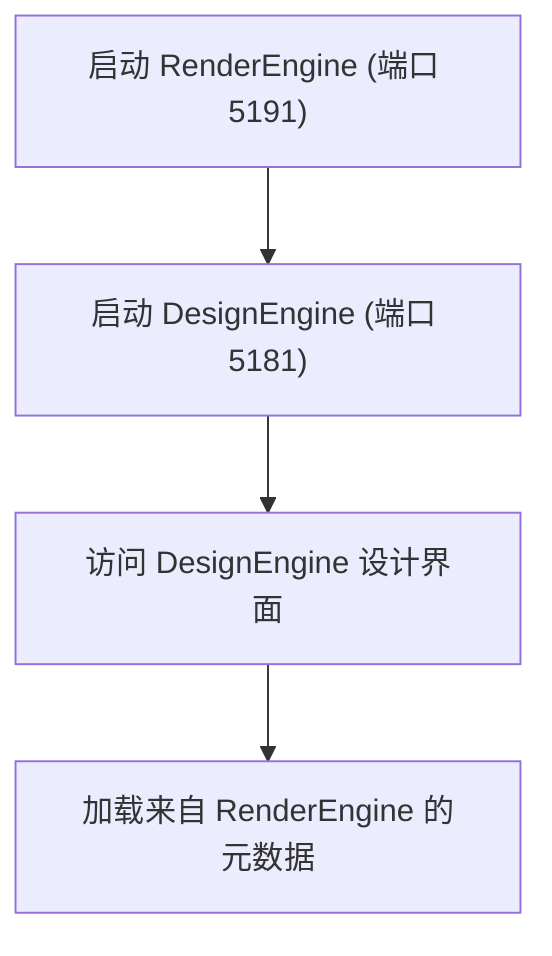

# 环境搭建

<cite>
**本文档引用的文件**  
- [global.json](file://global.json)
- [README.md](file://README.md)
- [src\DesignEngine\H.LowCode.DesignEngine.Host\Program.cs](file://src/DesignEngine/H.LowCode.DesignEngine.Host/Program.cs)
- [src\RenderEngine\H.LowCode.RenderEngine.Host\Program.cs](file://src/RenderEngine/H.LowCode.RenderEngine.Host/Program.cs)
- [src\DesignEngine\H.LowCode.DesignEngine.Host\appsettings.json](file://src/DesignEngine/H.LowCode.DesignEngine.Host/appsettings.json)
- [src\RenderEngine\H.LowCode.RenderEngine.Host\appsettings.json](file://src/RenderEngine/H.LowCode.RenderEngine.Host/appsettings.json)
- [src\DesignEngine\H.LowCode.DesignEngine.Host\Properties\launchSettings.json](file://src/DesignEngine/H.LowCode.DesignEngine.Host/Properties/launchSettings.json)
- [src\RenderEngine\H.LowCode.RenderEngine.Host\Properties\launchSettings.json](file://src/RenderEngine/H.LowCode.RenderEngine.Host/Properties/launchSettings.json)
- [src\Common\H.LowCode.Configuration\Options\MetaOption.cs](file://src/Common/H.LowCode.Configuration/Options/MetaOption.cs)
- [src\Common\H.LowCode.Configuration\Options\SiteOption.cs](file://src/Common/H.LowCode.Configuration/Options/SiteOption.cs)
- [src\DesignEngine\H.LowCode.DesignEngine.Host.Client\LowCodeGlobalVariables.cs](file://src/DesignEngine/H.LowCode.DesignEngine.Host.Client/LowCodeGlobalVariables.cs)
- [src\RenderEngine\H.LowCode.RenderEngine.Host.Client\LowCodeGlobalVariables.cs](file://src/RenderEngine/H.LowCode.RenderEngine.Host.Client/LowCodeGlobalVariables.cs)
</cite>

## 目录
1. [开发环境搭建](#开发环境搭建)
2. [IDE配置](#ide配置)
3. [项目依赖还原](#项目依赖还原)
4. [服务启动与端口配置](#服务启动与端口配置)
5. [前后端联调方法](#前后端联调方法)
6. [常见问题解决方案](#常见问题解决方案)
7. [环境验证清单](#环境验证清单)

## 开发环境搭建

### .NET 8.0 SDK安装与验证

根据项目根目录下的 `global.json` 文件，本项目要求使用 **.NET 9.0.100** SDK。尽管文档目标中提及 .NET 8.0，但实际配置已升级至 .NET 9.0。

**安装步骤：**
1. 访问 [.NET 下载官网](https://dotnet.microsoft.com/download)
2. 下载并安装 **.NET SDK 9.0.100**
3. 安装完成后，打开命令行工具，执行以下命令验证安装：
```bash
dotnet --version
```
预期输出：`9.0.100`

**验证要点：**
- 确保 `dotnet --list-sdks` 命令输出中包含 `9.0.100`
- 若存在多个版本，`global.json` 会自动引导使用指定版本

**Section sources**
- [global.json](file://global.json)

## IDE配置

### 推荐IDE：Visual Studio 2022 或 VS Code

#### Visual Studio 2022 配置
1. 安装 **Visual Studio 2022**（建议 17.9 或更高版本）
2. 安装工作负载：
   - **ASP.NET 和 Web 开发**
   - **.NET 桌面开发**
3. 打开解决方案文件（若存在）或直接打开项目根目录
4. 启用 **Blazor WebAssembly** 和 **Blazor Server** 支持

#### VS Code 配置
1. 安装 **VS Code**
2. 安装必要扩展：
   - **C# for Visual Studio Code (powered by OmniSharp)**
   - **.NET Install Tool for Extension Authors**
   - **Blazor Developer Tools**
3. 安装完成后，打开项目根目录
4. 使用集成终端执行 `dotnet restore` 还原依赖

**Section sources**
- [README.md](file://README.md)

## 项目依赖还原

### NuGet包恢复步骤

项目采用标准的 .NET 多项目结构，依赖通过 NuGet 包管理。

**还原步骤：**
1. 打开命令行，进入项目根目录 ``
2. 执行以下命令还原所有项目的依赖：
```bash
dotnet restore
```
3. 构建整个解决方案以验证依赖完整性：
```bash
dotnet build
```

**关键依赖说明：**
- **Blazor WebAssembly**：用于前端交互
- **Autofac**：依赖注入容器
- **EntityFrameworkCore**：数据库访问
- **System.Text.Json**：JSON序列化

**Section sources**
- [README.md](file://README.md)

## 服务启动与端口配置

### DesignEngine（设计引擎）启动

DesignEngine 是低代码平台的设计界面宿主服务。

**启动配置：**
- **HTTPS端口**：`5181`
- **HTTP端口**：`5180`
- **启动项目**：`H.LowCode.DesignEngine.Host`

**启动方式：**
```bash
cd src\DesignEngine\H.LowCode.DesignEngine.Host
dotnet run
```

**配置文件来源：**
- `launchSettings.json` 明确定义了 `applicationUrl` 为 `https://localhost:5181;http://localhost:5180`

### RenderEngine（渲染引擎）启动

RenderEngine 是低代码应用的运行时渲染服务。

**启动配置：**
- **HTTPS端口**：`5191`
- **HTTP端口**：`5190`
- **启动项目**：`H.LowCode.RenderEngine.Host`

**启动方式：**
```bash
cd src\RenderEngine\H.LowCode.RenderEngine.Host
dotnet run
```

**配置文件来源：**
- `launchSettings.json` 明确定义了 `applicationUrl` 为 `https://localhost:5191;http://localhost:5190`

### 启动顺序

**必须先启动 RenderEngine，再启动 DesignEngine**。

**原因分析：**
- DesignEngine 的 `appsettings.json` 中配置了 `RemoteServices.Default.BaseUrl` 为 `https://localhost:5181`，但此配置存在循环引用风险
- RenderEngine 的 `RemoteServices.Default.BaseUrl` 指向 `https://localhost:5191`，表明 DesignEngine 可能需要调用 RenderEngine 的元数据服务
- 为确保元数据加载正常，应优先启动 RenderEngine



**Diagram sources**
- [src\DesignEngine\H.LowCode.DesignEngine.Host\appsettings.json](file://src/DesignEngine/H.LowCode.DesignEngine.Host/appsettings.json#L18-L21)
- [src\RenderEngine\H.LowCode.RenderEngine.Host\appsettings.json](file://src/RenderEngine/H.LowCode.RenderEngine.Host/appsettings.json#L18-L21)
- [src\DesignEngine\H.LowCode.DesignEngine.Host\Properties\launchSettings.json](file://src/DesignEngine/H.LowCode.DesignEngine.Host/Properties/launchSettings.json#L10-L11)
- [src\RenderEngine\H.LowCode.RenderEngine.Host\Properties\launchSettings.json](file://src/RenderEngine/H.LowCode.RenderEngine.Host/Properties/launchSettings.json#L10-L11)

**Section sources**
- [src\DesignEngine\H.LowCode.DesignEngine.Host\Program.cs](file://src/DesignEngine/H.LowCode.DesignEngine.Host/Program.cs)
- [src\RenderEngine\H.LowCode.RenderEngine.Host\Program.cs](file://src/RenderEngine/H.LowCode.RenderEngine.Host/Program.cs)

## 前后端联调方法

### 前后端架构分析

本项目采用 **Blazor Server + WebAssembly** 混合渲染模式。

**前端组件加载机制：**
- 通过 `LowCodeGlobalVariables.AdditionalAssemblies` 动态加载额外程序集
- DesignEngine 加载工作台、部件设计等模块
- RenderEngine 加载 AntBlazor 主题模块

**联调步骤：**
1. 确保两个服务均已启动
2. 访问 DesignEngine 界面：`https://localhost:5181`
3. 在设计界面中创建或编辑页面
4. 元数据将自动保存至 `meta` 目录下的 JSON 文件
5. 访问 RenderEngine 查看渲染效果：`https://localhost:5191`

**元数据路径配置：**
- `Meta.appsFilePath`：`../../../meta/apps` （相对路径）
- `Meta.partsFilePath`：`../../../meta/parts` （部件库路径）

```mermaid
classDiagram
class MetaOption {
+string AppsFilePath
+string PartsFilePath
}
class SiteOption {
+string AppId
+string SiteUrl
}
class LowCodeGlobalVariables {
+Type LowCodeDefaultLayout
+Assembly[] AdditionalAssemblies
}
MetaOption --> "DesignEngine & RenderEngine" : 配置注入
SiteOption --> "RenderEngine" : 多站点支持
LowCodeGlobalVariables --> "Host.Client" : 组件程序集加载
```

**Diagram sources**
- [src\Common\H.LowCode.Configuration\Options\MetaOption.cs](file://src/Common/H.LowCode.Configuration/Options/MetaOption.cs)
- [src\Common\H.LowCode.Configuration\Options\SiteOption.cs](file://src/Common/H.LowCode.Configuration/Options/SiteOption.cs)
- [src\DesignEngine\H.LowCode.DesignEngine.Host.Client\LowCodeGlobalVariables.cs](file://src/DesignEngine/H.LowCode.DesignEngine.Host.Client/LowCodeGlobalVariables.cs)
- [src\RenderEngine\H.LowCode.RenderEngine.Host.Client\LowCodeGlobalVariables.cs](file://src/RenderEngine/H.LowCode.RenderEngine.Host.Client/LowCodeGlobalVariables.cs)

**Section sources**
- [src\DesignEngine\H.LowCode.DesignEngine.Host\appsettings.json](file://src/DesignEngine/H.LowCode.DesignEngine.Host/appsettings.json)
- [src\RenderEngine\H.LowCode.RenderEngine.Host\appsettings.json](file://src/RenderEngine/H.LowCode.RenderEngine.Host/appsettings.json)

## 常见问题解决方案

### SDK版本不匹配

**问题现象：**
`dotnet run` 报错，提示找不到指定版本的 SDK。

**解决方案：**
1. 确认已安装 `.NET 9.0.100`
2. 检查 `dotnet --list-sdks` 输出
3. 若版本不符，修改 `global.json` 或安装对应版本

### 端口占用

**问题现象：**
`Unable to bind to https://localhost:5181` 等错误。

**解决方案：**
1. 查找占用进程：
```bash
netstat -ano | findstr :5181
```
2. 结束占用进程：
```bash
taskkill /PID <进程ID> /F
```
3. 或修改 `launchSettings.json` 中的端口号

### HTTPS证书错误

**问题现象：**
浏览器提示 `NET::ERR_CERT_AUTHORITY_INVALID`

**解决方案：**
1. 信任开发证书：
```bash
dotnet dev-certs https --trust
```
2. 若失败，重置证书：
```bash
dotnet dev-certs https --clean
dotnet dev-certs https --trust
```

### 元数据加载失败

**问题现象：**
DesignEngine 无法加载应用或部件。

**解决方案：**
1. 检查 `meta` 目录路径是否正确
2. 确认 `Meta.appsFilePath` 和 `Meta.partsFilePath` 配置
3. 验证 JSON 文件格式是否正确

**Section sources**
- [global.json](file://global.json)
- [src\DesignEngine\H.LowCode.DesignEngine.Host\appsettings.json](file://src/DesignEngine/H.LowCode.DesignEngine.Host/appsettings.json)
- [src\RenderEngine\H.LowCode.RenderEngine.Host\appsettings.json](file://src/RenderEngine/H.LowCode.RenderEngine.Host/appsettings.json)

## 环境验证清单

完成环境搭建后，请按以下清单验证：

| 检查项 | 验证方法 | 预期结果 |
|--------|---------|---------|
| **.NET SDK版本** | `dotnet --version` | 输出 `9.0.100` |
| **DesignEngine启动** | 访问 `https://localhost:5181` | 页面正常加载，无500错误 |
| **RenderEngine启动** | 访问 `https://localhost:5191` | 页面正常加载，显示应用列表 |
| **元数据加载** | 检查浏览器开发者工具网络请求 | 成功加载 `meta/apps/caseapp/caseapp.json` 等文件 |
| **前后端通信** | 在DesignEngine中创建页面 | 元数据保存至 `meta` 目录，可在RenderEngine中查看 |

**验证成功标志：**
- 两个服务均能独立启动
- DesignEngine 可正常编辑页面
- RenderEngine 可正确渲染设计结果
- 无控制台错误或警告

**Section sources**
- [src\DesignEngine\H.LowCode.DesignEngine.Host\appsettings.json](file://src/DesignEngine/H.LowCode.DesignEngine.Host/appsettings.json)
- [src\RenderEngine\H.LowCode.RenderEngine.Host\appsettings.json](file://src/RenderEngine/H.LowCode.RenderEngine.Host/appsettings.json)
- [meta](file://meta)