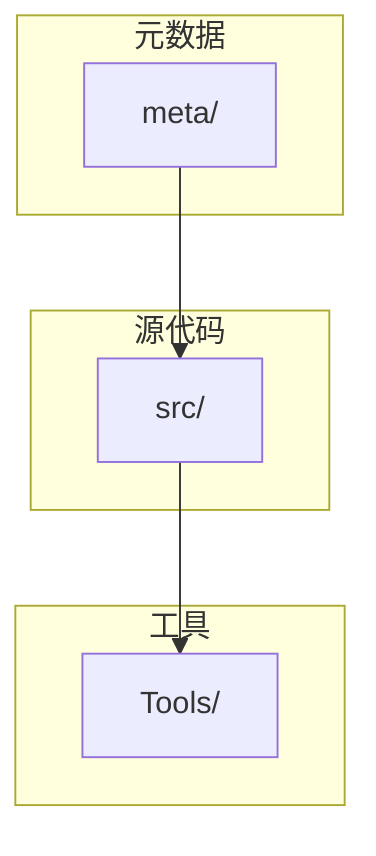
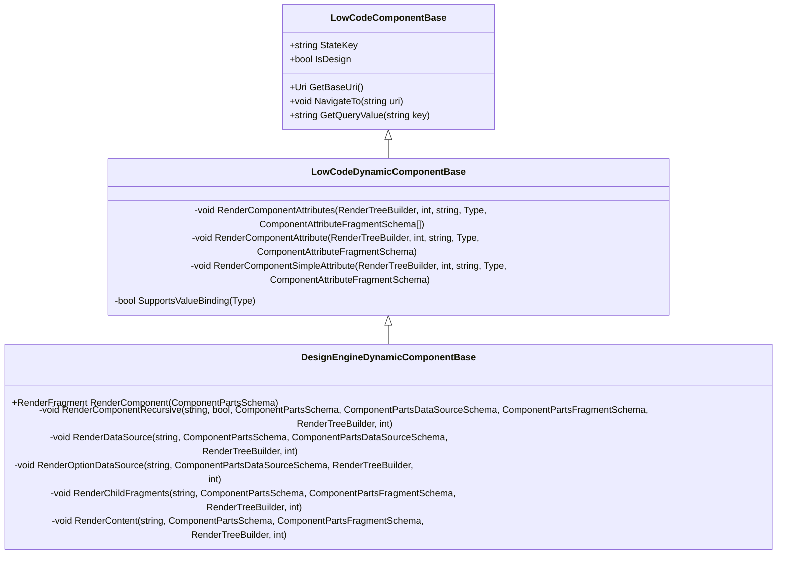
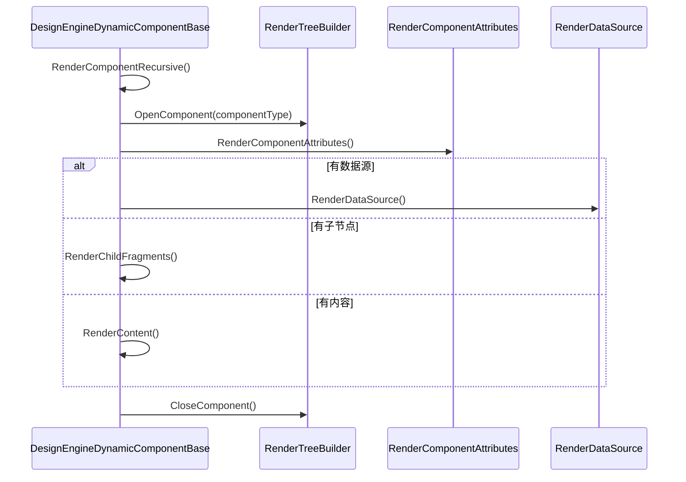
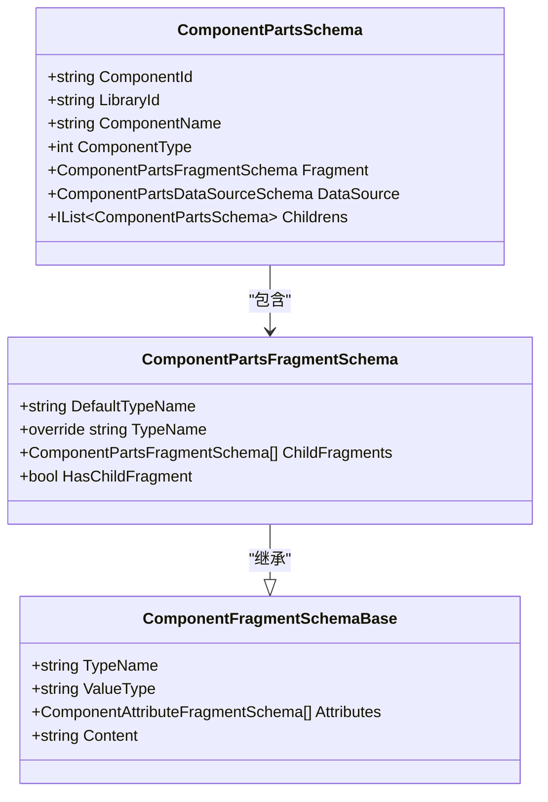

# 组件调试技巧

<cite>
**本文档引用的文件**   
- [LowCodeGlobalVariables.cs](file://src/DesignEngine/H.LowCode.DesignEngine.Host.Client/LowCodeGlobalVariables.cs)
- [LowCodeGlobalVariables.cs](file://src/RenderEngine/H.LowCode.RenderEngine.Host.Client/LowCodeGlobalVariables.cs)
- [LowCodeDynamicComponentBase.cs](file://src/Common/H.LowCode.ComponentBase/LowCodeDynamicComponentBase.cs)
- [DesignEngineDynamicComponentBase.cs](file://src/DesignEngine/H.LowCode.DesignEngineBase/DesignEngineDynamicComponentBase.cs)
- [LowCodeComponentBase.cs](file://src/Common/H.LowCode.ComponentBase/LowCodeComponentBase.cs)
- [ComponentFragmentSchemaBase.cs](file://src/Common/H.LowCode.MetaSchema/PropertySchemas/ComponentFragmentSchemaBase.cs)
- [ComponentPartsSchema.cs](file://src/Common/H.LowCode.MetaSchema.DesignEngine/ComponentPartsSchema.cs)
- [ComponentPartsFragmentSchema.cs](file://src/Common/H.LowCode.MetaSchema.DesignEngine/PropertySchemas/ComponentPartsFragmentSchema.cs)
</cite>

## 目录
1. [简介](#简介)
2. [项目结构](#项目结构)
3. [核心组件](#核心组件)
4. [架构概述](#架构概述)
5. [详细组件分析](#详细组件分析)
6. [依赖分析](#依赖分析)
7. [性能考虑](#性能考虑)
8. [故障排除指南](#故障排除指南)
9. [结论](#结论)

## 简介
本文档深入讲解低代码平台中组件的调试方法，重点介绍如何利用全局变量进行状态跟踪与日志输出，定位组件渲染异常问题。文档剖析了动态组件加载机制的实现原理，包括组件类型解析、实例化过程和生命周期管理。提供了调试组件渲染流程的具体步骤，包括设置断点、查看元数据绑定、检查属性赋值顺序。最后，文档列举了组件不显示、属性未生效、事件绑定失败等典型问题的排查路径与解决方案。

## 项目结构
本项目采用分层架构设计，主要分为 `meta`（元数据）、`src`（源代码）和工具模块。`meta` 目录存放应用、页面和组件的JSON元数据定义。`src` 目录是核心代码所在，包含通用组件基类、设计引擎和渲染引擎。设计引擎（DesignEngine）负责可视化设计时的组件管理，而渲染引擎（RenderEngine）负责运行时的组件渲染。`Tools` 目录包含数据库和元数据迁移工具。



**Diagram sources**
- [meta](file://meta)
- [src](file://src)
- [Tools](file://Tools)

**Section sources**
- [project_structure](file://#L1-L20)

## 核心组件
低代码平台的核心在于其组件化架构。`LowCodeComponentBase` 是所有组件的基类，提供了导航、状态管理等基础功能。`LowCodeDynamicComponentBase` 是动态组件的核心，负责根据元数据动态创建和渲染Blazor组件。`DesignEngineDynamicComponentBase` 继承自前者，是设计引擎中组件渲染的实现，包含了渲染数据源、子节点和内容的完整逻辑。

**Section sources**
- [LowCodeComponentBase.cs](file://src/Common/H.LowCode.ComponentBase/LowCodeComponentBase.cs#L10-L49)
- [LowCodeDynamicComponentBase.cs](file://src/Common/H.LowCode.ComponentBase/LowCodeDynamicComponentBase.cs#L12-L121)
- [DesignEngineDynamicComponentBase.cs](file://src/DesignEngine/H.LowCode.DesignEngineBase/DesignEngineDynamicComponentBase.cs#L9-L219)

## 架构概述
该低代码平台采用设计时与运行时分离的架构。设计时，用户通过设计引擎拖拽组件，其元数据（如组件类型、属性、数据源）被保存为JSON文件。运行时，渲染引擎读取这些元数据，并通过反射动态创建对应的Blazor组件实例，完成页面渲染。`LowCodeGlobalVariables` 在两个环境中定义了不同的默认布局和附加程序集，实现了环境隔离。


**Diagram sources**
- [meta](file://meta)
- [DesignEngineDynamicComponentBase.cs](file://src/DesignEngine/H.LowCode.DesignEngineBase/DesignEngineDynamicComponentBase.cs#L9-L219)

## 详细组件分析

### 动态组件加载机制分析
动态组件加载是低代码平台的核心功能，其实现主要依赖于 `LowCodeDynamicComponentBase` 和 `DesignEngineDynamicComponentBase` 两个类。

#### 类图


**Diagram sources**
- [LowCodeComponentBase.cs](file://src/Common/H.LowCode.ComponentBase/LowCodeComponentBase.cs#L10-L49)
- [LowCodeDynamicComponentBase.cs](file://src/Common/H.LowCode.ComponentBase/LowCodeDynamicComponentBase.cs#L12-L121)
- [DesignEngineDynamicComponentBase.cs](file://src/DesignEngine/H.LowCode.DesignEngineBase/DesignEngineDynamicComponentBase.cs#L9-L219)

#### 实现原理
1.  **组件类型解析**：`RenderComponentRecursive` 方法首先检查 `ComponentPartsFragmentSchema` 的 `TypeName`。如果为空，则使用 `DefaultTypeName`。然后通过 `Type.GetType(componentFragment.TypeName, true)` 反射获取组件的 `Type` 对象。
2.  **实例化过程**：在获取到 `Type` 对象后，使用 `RenderTreeBuilder.OpenComponent(index++, componentType)` 在渲染树中打开一个组件节点，Blazor框架会在此时实例化该组件。
3.  **生命周期管理**：组件的生命周期由Blazor框架管理。`RenderComponentRecursive` 方法在 `OpenComponent` 和 `CloseComponent` 之间调用 `RenderComponentAttributes` 等方法，这些方法在组件的 `OnParametersSet` 或 `BuildRenderTree` 阶段执行，负责设置属性和绑定事件。

**Section sources**
- [LowCodeDynamicComponentBase.cs](file://src/Common/H.LowCode.ComponentBase/LowCodeDynamicComponentBase.cs#L12-L121)
- [DesignEngineDynamicComponentBase.cs](file://src/DesignEngine/H.LowCode.DesignEngineBase/DesignEngineDynamicComponentBase.cs#L31-L65)

### 组件渲染流程分析
组件渲染流程是调试的关键，主要在 `DesignEngineDynamicComponentBase` 的 `RenderComponentRecursive` 方法中实现。

#### 序列图


**Diagram sources**
- [DesignEngineDynamicComponentBase.cs](file://src/DesignEngine/H.LowCode.DesignEngineBase/DesignEngineDynamicComponentBase.cs#L31-L65)

#### 调试步骤
1.  **设置断点**：在 `DesignEngineDynamicComponentBase.cs` 的 `RenderComponentRecursive` 方法的起始处设置断点。
2.  **查看元数据绑定**：在断点处，检查传入的 `componentFragment` 参数。其 `TypeName` 属性决定了要渲染的组件类型，`Attributes` 数组包含了所有要绑定的属性。
3.  **检查属性赋值顺序**：程序会依次调用 `RenderComponentAttributes` -> `RenderComponentAttribute` -> `RenderComponentSimpleAttribute`。在 `RenderComponentSimpleAttribute` 中，`attr.AttributeClrType` 定义了属性的CLR类型，`attr.AttributeValue` 是原始值，通过 `ConvertToRealType` 转换后赋值给组件。

**Section sources**
- [DesignEngineDynamicComponentBase.cs](file://src/DesignEngine/H.LowCode.DesignEngineBase/DesignEngineDynamicComponentBase.cs#L31-L65)
- [LowCodeDynamicComponentBase.cs](file://src/Common/H.LowCode.ComponentBase/LowCodeDynamicComponentBase.cs#L70-L121)

### 全局状态跟踪分析
`LowCodeGlobalVariables` 类用于在不同环境中定义全局常量，是调试时的重要参考。

#### 设计引擎全局变量
```csharp
public static class LowCodeGlobalVariables
{
    public static readonly Type LowCodeDefaultLayout = typeof(DesignEngineBase.DesignEngineNavLayout);
    public static readonly Assembly[] AdditionalAssemblies = [...];
}
```
此定义指明了设计时的默认布局组件和需要加载的程序集。

#### 渲染引擎全局变量
```csharp
public static class LowCodeGlobalVariables
{
    public static readonly Type LowCodeDefaultLayout = typeof(AntBlazorThemeLayout);
    public static readonly Assembly[] AdditionalAssemblies = [...];
}
```
此定义指明了运行时的默认布局组件和需要加载的程序集。

通过对比这两个文件，可以快速定位环境配置问题。

**Section sources**
- [LowCodeGlobalVariables.cs](file://src/DesignEngine/H.LowCode.DesignEngine.Host.Client/LowCodeGlobalVariables.cs#L1-L16)
- [LowCodeGlobalVariables.cs](file://src/RenderEngine/H.LowCode.RenderEngine.Host.Client/LowCodeGlobalVariables.cs#L1-L14)

## 依赖分析
组件的渲染依赖于清晰的元数据结构。`ComponentPartsSchema` 是设计时组件的元数据模型，它包含 `Fragment`（渲染片段）、`DataSource`（数据源）和 `AttributeDefineGroups`（属性定义）等关键信息。`ComponentPartsFragmentSchema` 继承自 `ComponentFragmentSchemaBase`，定义了 `DefaultTypeName` 和 `ChildFragments`，是组件树结构的基础。



**Diagram sources**
- [ComponentPartsSchema.cs](file://src/Common/H.LowCode.MetaSchema.DesignEngine/ComponentPartsSchema.cs#L5-L177)
- [ComponentPartsFragmentSchema.cs](file://src/Common/H.LowCode.MetaSchema.DesignEngine/PropertySchemas/ComponentPartsFragmentSchema.cs#L7-L38)
- [ComponentFragmentSchemaBase.cs](file://src/Common/H.LowCode.MetaSchema/PropertySchemas/ComponentFragmentSchemaBase.cs#L31-L44)

## 性能考虑
动态组件渲染涉及反射和大量的对象创建，可能影响性能。建议在生产环境中对元数据进行缓存，并优化 `Type.GetType` 的调用。此外，避免在 `RenderFragment` 中进行复杂的计算，以减少渲染开销。

## 故障排除指南
以下是常见组件问题的排查路径与解决方案。

### 组件不显示
1.  **检查 `TypeName`**：在 `RenderComponentRecursive` 方法中，确认 `componentFragment.TypeName` 是否正确解析。如果为 `null` 或无效，会抛出 `NullReferenceException`。
2.  **检查程序集**：确认 `LowCodeGlobalVariables.AdditionalAssemblies` 是否包含了组件所在的程序集。如果缺少，`Type.GetType` 将无法找到类型。
3.  **检查父组件**：如果组件作为子节点渲染，检查父组件的 `ChildFragments` 是否正确配置。

### 属性未生效
1.  **检查属性名**：在 `RenderComponentAttribute` 方法中，`componentType.GetProperty(attr.AttributeName)` 可能返回 `null`，说明组件上不存在该属性。
2.  **检查属性类型**：在 `RenderComponentSimpleAttribute` 方法中，`attr.AttributeClrType` 必须与组件属性的CLR类型完全匹配，否则 `ConvertToRealType` 会失败。
3.  **检查属性值**：`attr.AttributeValue` 为 `null` 时，代码会记录警告日志，但不会抛出异常，可能导致属性未设置。

### 事件绑定失败
1.  **检查方法名**：在 `RenderComponentAttribute` 方法中，`GetType().GetMethod(attr.AttributeValue?.ToString())` 会查找事件处理方法。确保方法名拼写正确且为 `public` 或 `private`。
2.  **检查方法签名**：事件处理方法的签名必须与 `EventCallback` 兼容。例如，`onclick` 事件的处理方法应为 `void HandleClick()` 或 `Task HandleClick()`。

**Section sources**
- [DesignEngineDynamicComponentBase.cs](file://src/DesignEngine/H.LowCode.DesignEngineBase/DesignEngineDynamicComponentBase.cs#L31-L65)
- [LowCodeDynamicComponentBase.cs](file://src/Common/H.LowCode.ComponentBase/LowCodeDynamicComponentBase.cs#L45-L70)

## 结论
本文档系统地介绍了低代码平台组件的调试技巧。通过理解 `LowCodeDynamicComponentBase` 的实现原理，利用 `LowCodeGlobalVariables` 进行环境对比，并遵循推荐的调试步骤，开发者可以高效地定位和解决组件渲染中的各种问题。掌握这些技巧对于维护和扩展低代码平台至关重要。