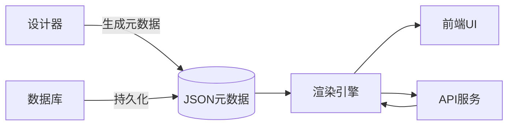
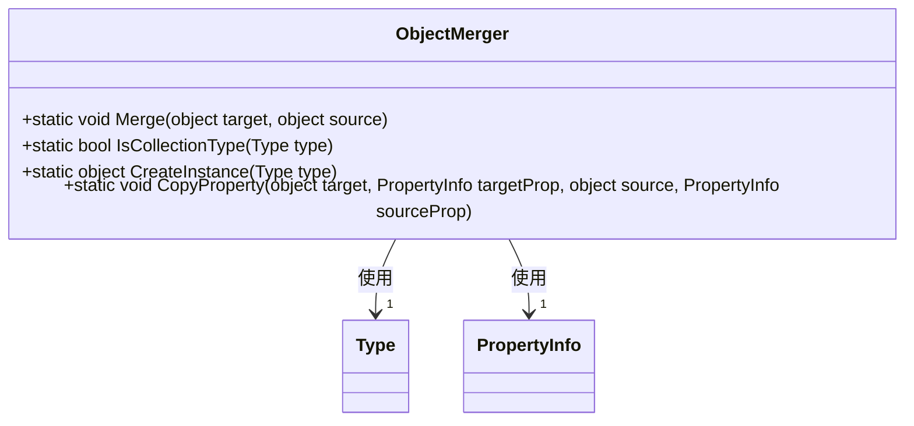
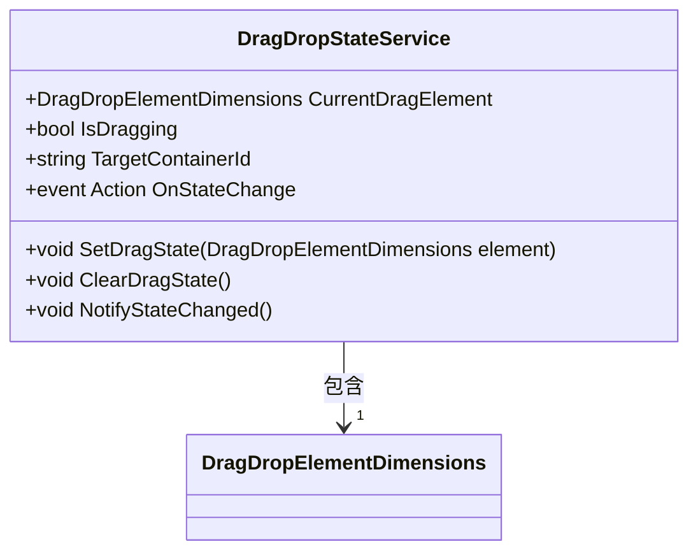
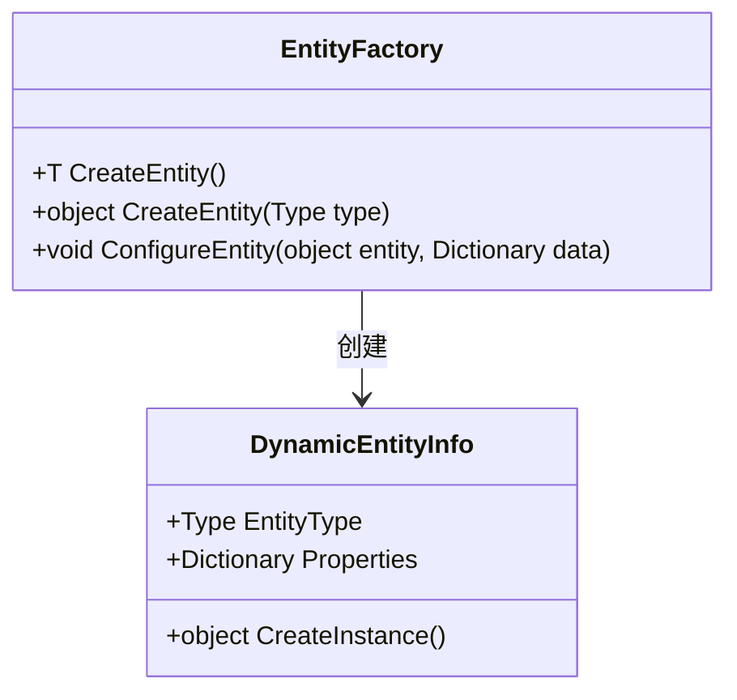
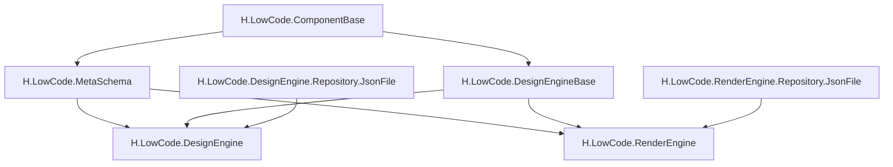

# 编码规范与性能优化

<cite>
**本文档引用文件**  
- [AppCascadingModel.cs](file://src/Common/H.LowCode.ComponentBase/CascadingModels/AppCascadingModel.cs)
- [PageCascadingModel.cs](file://src/Common/H.LowCode.ComponentBase/CascadingModels/PageCascadingModel.cs)
- [LowCodeAppState.cs](file://src/Common/H.LowCode.ComponentBase/LowCodeAppState.cs)
- [LowCodeComponentBase.cs](file://src/Common/H.LowCode.ComponentBase/LowCodeComponentBase.cs)
- [ObjectMerger.cs](file://src/Common/H.LowCode.MetaSchema/Utils/ObjectMerger.cs)
- [DragDropStateService.cs](file://src/DesignEngine/H.LowCode.DesignEngineBase/Services/DragDropStateService.cs)
- [MetaOption.cs](file://src/Common/H.LowCode.Configuration/Options/MetaOption.cs)
- [SiteOption.cs](file://src/Common/H.LowCode.Configuration/Options/SiteOption.cs)
- [EntityBase.cs](file://src/Common/H.LowCode.Entity/Base/EntityBase.cs)
- [FormEntity.cs](file://src/Common/H.LowCode.Entity/Base/FormEntity.cs)
- [DynamicEntityInfo.cs](file://src/Common/H.LowCode.Entity/EntityManager/DynamicEntityInfo.cs)
</cite>

## 目录
1. [引言](#引言)
2. [项目结构](#项目结构)
3. [核心组件](#核心组件)
4. [架构概览](#架构概览)
5. [详细组件分析](#详细组件分析)
6. [依赖分析](#依赖分析)
7. [性能考虑](#性能考虑)
8. [故障排除指南](#故障排除指南)
9. [结论](#结论)

## 引言
本文档旨在为低代码平台的二次开发制定统一的编码规范与性能优化建议。通过分析项目结构与核心代码逻辑，提出可读性、可维护性与性能提升的最佳实践，重点涵盖元数据合并、拖拽状态管理等关键模块的优化策略。

## 项目结构
项目采用分层架构设计，主要分为元数据（meta）、源码（src）与工具（Tools）三大目录。源码部分遵循模块化组织，包含通用组件、设计引擎、渲染引擎等独立模块，支持高内聚低耦合的开发模式。

```mermaid
graph TB
subgraph "元数据"
meta["meta/"]
apps["apps/"]
parts["parts/"]
meta --> apps
meta --> parts
end
subgraph "源码"
src["src/"]
Common["Common/"]
DesignEngine["DesignEngine/"]
RenderEngine["RenderEngine/"]
Tools["Tools/"]
src --> Common
src --> DesignEngine
src --> RenderEngine
src --> Tools
end
subgraph "通用组件"
HLCB["H.LowCode.ComponentBase"]
HLCDef["H.LowCode.Components.Defaults"]
HLCConf["H.LowCode.Configuration"]
HLCMeta["H.LowCode.MetaSchema"]
HLCB --> HLCDef
HLCB --> HLCConf
HLCB --> HLCMeta
end
subgraph "设计引擎"
HLCDE["H.LowCode.DesignEngine"]
HLCDEApp["H.LowCode.DesignEngine.Application"]
HLCDEDomain["H.LowCode.DesignEngine.Domain"]
HLCDERepo["H.LowCode.DesignEngine.Repository.JsonFile"]
HLCDE --> HLCDEApp
HLCDEApp --> HLCDEDomain
HLCDEDomain --> HLCDERepo
end
subgraph "渲染引擎"
HLCRE["H.LowCode.RenderEngine"]
HLCREApp["H.LowCode.RenderEngine.Application"]
HLCREDomain["H.LowCode.RenderEngine.Domain"]
HLCRERepo["H.LowCode.RenderEngine.Repository.JsonFile"]
HLCRE --> HLCREApp
HLCREApp --> HLCREDomain
HLCREDomain --> HLCRERepo
end
Common --> DesignEngine
Common --> RenderEngine
```

**图示来源**  
- [AppCascadingModel.cs](file://src/Common/H.LowCode.ComponentBase/CascadingModels/AppCascadingModel.cs)
- [LowCodeComponentBase.cs](file://src/Common/H.LowCode.ComponentBase/LowCodeComponentBase.cs)

**本节来源**  
- [AppCascadingModel.cs](file://src/Common/H.LowCode.ComponentBase/CascadingModels/AppCascadingModel.cs)
- [PageCascadingModel.cs](file://src/Common/H.LowCode.ComponentBase/CascadingModels/PageCascadingModel.cs)

## 核心组件
系统核心组件包括状态管理（LowCodeAppState）、元数据合并（ObjectMerger）、拖拽状态服务（DragDropStateService）等。这些组件支撑平台的动态配置与交互能力。

**本节来源**  
- [LowCodeAppState.cs](file://src/Common/H.LowCode.ComponentBase/LowCodeAppState.cs)
- [ObjectMerger.cs](file://src/Common/H.LowCode.MetaSchema/Utils/ObjectMerger.cs)
- [DragDropStateService.cs](file://src/DesignEngine/H.LowCode.DesignEngineBase/Services/DragDropStateService.cs)

## 架构概览
系统采用前后端分离的微服务架构，设计引擎与渲染引擎分别独立部署。元数据驱动UI生成，通过JSON配置描述应用结构，实现可视化开发。

**图示来源**  
- [MetaOption.cs](file://src/Common/H.LowCode.Configuration/Options/MetaOption.cs)
- [SiteOption.cs](file://src/Common/H.LowCode.Configuration/Options/SiteOption.cs)

## 详细组件分析

### 元数据合并组件分析
`ObjectMerger` 类负责合并不同来源的元数据配置，确保组件属性的正确继承与覆盖。

**图示来源**  
- [ObjectMerger.cs](file://src/Common/H.LowCode.MetaSchema/Utils/ObjectMerger.cs)

### 拖拽状态管理组件分析
`DragDropStateService` 管理拖拽过程中的状态，包括拖拽元素、位置信息与目标容器，确保UI交互的流畅性。

**图示来源**  
- [DragDropStateService.cs](file://src/DesignEngine/H.LowCode.DesignEngineBase/Services/DragDropStateService.cs)
- [DragDropElementDimensions.cs](file://src/DesignEngine/H.LowCode.DesignEngineBase/Dtos/DragDropElementDimensions.cs)

**本节来源**  
- [DragDropStateService.cs](file://src/DesignEngine/H.LowCode.DesignEngineBase/Services/DragDropStateService.cs)

### 实体管理组件分析
实体管理模块负责动态实体的创建与映射，支持运行时数据模型的灵活扩展。

**图示来源**  
- [EntityFactory.cs](file://src/Common/H.LowCode.Entity/EntityManager/EntityFactory.cs)
- [DynamicEntityInfo.cs](file://src/Common/H.LowCode.Entity/EntityManager/DynamicEntityInfo.cs)

**本节来源**  
- [EntityBase.cs](file://src/Common/H.LowCode.Entity/Base/EntityBase.cs)
- [FormEntity.cs](file://src/Common/H.LowCode.Entity/Base/FormEntity.cs)
- [DynamicEntityInfo.cs](file://src/Common/H.LowCode.Entity/EntityManager/DynamicEntityInfo.cs)

## 依赖分析
系统模块间依赖清晰，Common层为共享基础，DesignEngine与RenderEngine分别依赖其提供基础能力。Repository层支持JSON文件与远程服务两种存储方式。

**图示来源**  
- [LowCodeComponentBase.cs](file://src/Common/H.LowCode.ComponentBase/LowCodeComponentBase.cs)
- [ObjectMerger.cs](file://src/Common/H.LowCode.MetaSchema/Utils/ObjectMerger.cs)

**本节来源**  
- [LowCodeComponentBase.cs](file://src/Common/H.LowCode.ComponentBase/LowCodeComponentBase.cs)
- [ObjectMerger.cs](file://src/Common/H.LowCode.MetaSchema/Utils/ObjectMerger.cs)

## 性能考虑
针对频繁操作如元数据合并与拖拽交互，建议采取以下优化措施：
- **避免内存泄漏**：在 `DragDropStateService` 中及时清理事件订阅，使用弱引用或取消令牌。
- **减少对象创建**：缓存常用元数据合并结果，避免重复调用 `ObjectMerger.Merge`。
- **异步处理**：对耗时的元数据加载操作使用异步方法，防止阻塞UI线程。
- **节流与防抖**：对拖拽过程中的位置更新事件添加防抖处理，减少不必要的状态变更通知。
- **合理使用缓存**：对解析后的JSON元数据进行内存缓存，设置合理的过期策略。

## 故障排除指南
常见问题及解决方案：
- **元数据合并失败**：检查源对象与目标对象的属性类型是否匹配，确保 `ObjectMerger` 支持该类型。
- **拖拽状态未更新**：确认 `DragDropStateService` 的 `OnStateChange` 事件已正确订阅，调用 `NotifyStateChanged()` 触发更新。
- **动态实体创建异常**：验证传入的类型是否具有无参构造函数，检查 `EntityFactory` 配置是否正确。

**本节来源**  
- [ObjectMerger.cs](file://src/Common/H.LowCode.MetaSchema/Utils/ObjectMerger.cs)
- [DragDropStateService.cs](file://src/DesignEngine/H.LowCode.DesignEngineBase/Services/DragDropStateService.cs)
- [EntityFactory.cs](file://src/Common/H.LowCode.Entity/EntityManager/EntityFactory.cs)

## 结论
本文档系统梳理了低代码平台的编码规范与性能优化策略。通过遵循统一的命名规范、强化异常处理、优化核心逻辑性能，可显著提升二次开发功能的稳定性与可维护性。建议在代码审查中重点关注对象生命周期管理、频繁操作优化及缓存策略的合理性。