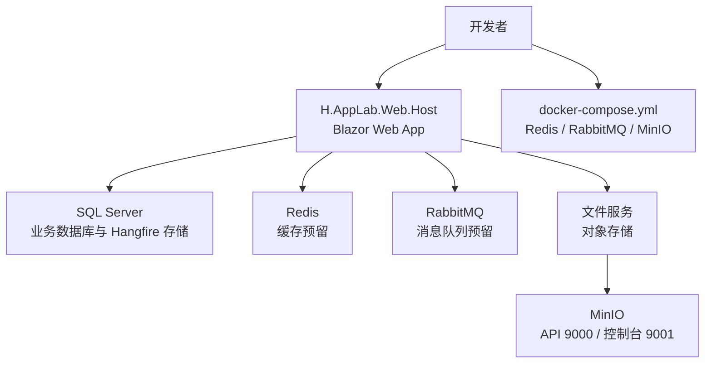

# 快速开始

<cite>
**本文引用的文件**   
- [README.md](file://README.md)
- [global.json](file://src/global.json)
- [AppLab.slnx](file://src/AppLab.slnx)
- [AppLab.slnLaunch](file://src/AppLab.slnLaunch)
- [H.AppLab.Web.Host.csproj](file://src/Host/H.AppLab.Web.Host/H.AppLab.Web.Host/H.AppLab.Web.Host.csproj)
- [Program.cs](file://src/Host/H.AppLab.Web.Host/H.AppLab.Web.Host/Program.cs)
- [HostAllModule.cs](file://src/Host/H.AppLab.Web.Host/H.AppLab.Web.Host/HostAllModule.cs)
- [appsettings.json](file://src/Host/H.AppLab.Web.Host/H.AppLab.Web.Host/appsettings.json)
- [appsettings.Development.json](file://src/Host/H.AppLab.Web.Host/H.AppLab.Web.Host/appsettings.Development.json)
- [MinioOptions.cs](file://src/Services/File/H.File.Application/MinioOptions.cs)
- [BackgroundTaskApplicationModule.cs](file://src/Services/BackgroundTask/H.BackgroundTask.Application/BackgroundTaskApplicationModule.cs)
- [H.Account.DbMigrator.csproj](file://src/Tools/H.Account.DbMigrator/H.Account.DbMigrator.csproj)
- [H.LowCode.DbMigrator.csproj](file://src/Tools/H.LowCode.DbMigrator/H.LowCode.DbMigrator.csproj)
- [H.Testing.DbMigrator.csproj](file://src/Tools/H.Testing.DbMigrator/H.Testing.DbMigrator.csproj)
- [docker-compose.yml（容器编排文档）](file://.qoder/repowiki/zh/content/宿主与部署/Docker%20容器化部署.md)
</cite>

## 目录
1. [简介](#简介)
2. [环境准备清单](#环境准备清单)
3. [本地开发环境搭建](#本地开发环境搭建)
4. [一键启动依赖服务](#一键启动依赖服务)
5. [数据库初始化](#数据库初始化)
6. [启动主程序](#启动主程序)
7. [验证安装成功](#验证安装成功)
8. [基本使用示例](#基本使用示例)
9. [常见问题排查](#常见问题排查)
10. [架构概览](#架构概览)
11. [附录：配置文件与端口参考](#附录配置文件与端口参考)

## 简介
H.AppLab 是一个基于 .NET 与 Blazor 的应用开发实验平台。它采用模块化架构，既支持单体部署，也支持按服务独立部署。项目包含低代码设计引擎、渲染引擎、企业级基础服务、系统管理应用以及配套的数据库迁移工具。

仓库中的 README 已经给出最低限度的本地开发步骤：准备 .NET SDK、WSL + Docker、启动 Redis 与 RabbitMQ 等依赖服务，运行对应的 DbMigrator 初始化数据库，然后启动 H.AppLab.Host.All 宿主。

本节“快速开始”把上述内容整理成可执行的完整流程，并补充连接字符串、端口、验证方法和排错建议，帮助你在最短时间内跑通第一个应用。

**章节来源**
- [README.md:1-73](file://README.md#L1-L73)

## 环境准备清单
### 必须安装的基础环境
| 项目 | 要求 | 说明 |
|---|---|---|
| .NET SDK | 10.0.0，启用 latestFeature | 由 `src/global.json` 锁定；建议使用 dotnet SDK 管理器或官方安装包安装 10.x 版本 |
| WSL | Windows Subsystem for Linux | README 明确要求 WSL；用于在 Windows 上运行 Linux 风格的命令和 Docker |
| Docker Engine | 已安装并可执行 `docker` | README 要求在 WSL 中启动依赖服务 |
| Docker Compose | v2 插件可用 | README 使用 `docker-compose up -d`，需要 compose 插件或旧版 compose 命令 |
| Portainer（可选） | 可选 | README 列出为推荐项，便于可视化查看容器状态 |

### 必须运行的外部依赖
| 服务 | 默认端口 | 用途 | 是否当前代码直接消费 |
|---|---:|---|---|
| SQL Server | 通常 1433 | 持久化业务数据、Hangfire 后台任务存储 | 是 |
| Redis | 6379 | 缓存、会话、分布式能力预留 | 容器已启动，但当前 Web 宿主未直接集成 |
| RabbitMQ | 5672 / 15672 | 消息队列预留与管理界面 | 容器已启动，但当前 Web 宿主未直接集成 |
| MinIO | API 9000 / 控制台 9001 | 对象存储，供文件服务使用 | 是，通过 MinioOptions 配置 |

### 版本依据
- .NET SDK 版本由 `src/global.json` 指定为 `10.0.0`，并允许 rollForward 到最新特性版本。
- README 明确说明基础安装包括 .NET SDK、WSL、Docker、Portainer。

**章节来源**
- [global.json:1-6](file://src/global.json#L1-L6)
- [README.md:1-73](file://README.md#L1-L73)
- [docker-compose.yml（容器编排文档）:1-48](file://.qoder/repowiki/zh/content/宿主与部署/Docker%20容器化部署.md#L1-L48)

## 本地开发环境搭建
### 克隆代码
```bash
git clone <你的仓库地址>
cd <仓库根目录>
```

### 确认解决方案结构
解决方案入口位于 `src` 目录下：
- `src/AppLab.slnx` 是解决方案定义文件。
- `src/AppLab.slnLaunch` 是 VS Code 或相关 IDE 的启动配置。
- `src/Host/H.AppLab.Web.Host/H.AppLab.Web.Host` 是单体宿主项目。
- `src/Tools/*DbMigrator` 是各模块的数据库迁移工具。

建议在 IDE 中打开 `src/AppLab.slnx`，或使用命令行方式构建和运行。

**章节来源**
- [AppLab.slnx](file://src/AppLab.slnx)
- [AppLab.slnLaunch](file://src/AppLab.slnLaunch)
- [H.AppLab.Web.Host.csproj](file://src/Host/H.AppLab.Web.Host/H.AppLab.Web.Host/H.AppLab.Web.Host.csproj)

### 恢复 NuGet 包
在仓库根目录或 `src` 目录执行：
```bash
dotnet restore src/AppLab.slnx
```
如果只关注某个子项目，也可以针对具体项目恢复，例如：
```bash
dotnet restore src/Host/H.AppLab.Web.Host/H.AppLab.Web.Host/H.AppLab.Web.Host.csproj
dotnet restore src/Tools/H.Account.DbMigrator/H.Account.DbMigrator.csproj
```

### 检查 .NET SDK 版本
```bash
dotnet --version
```
应输出符合 `global.json` 要求的 10.x 版本。若提示找不到 SDK，请重新安装 .NET SDK 10.0.0 或更新 PATH。

**章节来源**
- [global.json:1-6](file://src/global.json#L1-L6)
- [README.md:1-73](file://README.md#L1-L73)

## 一键启动依赖服务
### 依赖服务说明
根据容器编排文档，H.AppLab 的容器编排文件定义了以下依赖服务：
- Redis：端口 6379
- RabbitMQ：AMQP 端口 5672，管理界面 15672
- MinIO：API 端口 9000，控制台端口 9001

README 还指出需要将 `cd` 目录下的 `docker-compose.yml` 复制到 WSL 中执行。

### 启动步骤
1. 将 `cd/cd/docker-compose.yml` 复制到 WSL 环境中你方便操作的目录。
2. 在该目录执行：
   ```bash
   sudo docker-compose up -d
   ```
3. 等待 Redis、RabbitMQ、MinIO 容器启动完成。
4. 可通过 `docker ps` 或 Portainer 查看容器状态。

### 数据持久化
容器编排文档明确指出 Redis、RabbitMQ、MinIO 暴露必要端口，并通过环境变量和卷进行配置与持久化。如果你希望保留数据，请确保对应容器的卷挂载路径存在且写入权限正常。

### 停止依赖服务
```bash
sudo docker-compose down
```
如需删除数据卷，可使用：
```bash
sudo docker-compose down -v
```

**章节来源**
- [README.md:1-73](file://README.md#L1-L73)
- [docker-compose.yml（容器编排文档）:1-48](file://.qoder/repowiki/zh/content/宿主与部署/Docker%20容器化部署.md#L1-L48)

## 数据库初始化
H.AppLab 使用 ABP 风格的多服务架构，每个业务域都有独立的数据库上下文和迁移工具。你需要先启动 SQL Server，再运行对应服务的 DbMigrator 创建或更新数据库结构。

### 前置条件
- 安装并启动 SQL Server。
- 准备好至少一个可用的连接字符串，指向你的 SQL Server 实例。
- 确保防火墙允许本机或 WSL 访问 SQL Server 的 1433 端口。

### 运行数据库迁移
README 给出的示例是 Account 服务的迁移工具：
```bash
dotnet run --project src/Tools/H.Account.DbMigrator
```

其他常用迁移工具包括：
- LowCode：`src/Tools/H.LowCode.DbMigrator`
- Testing：`src/Tools/H.Testing.DbMigrator`
- 其他服务迁移工具位于 `src/Tools` 下，命名模式为 `H.<Service>.DbMigrator`。

### 配置连接字符串
迁移工具的数据库连接字符串通常来自其 `appsettings.json`。常见做法是：
1. 找到目标迁移项目的 `appsettings.json`。
2. 修改其中的数据库连接字符串，使其指向你的 SQL Server。
3. 再次运行该迁移工具。

不同迁移项目的 csproj 名称可用于定位具体目录，例如：
- `src/Tools/H.Account.DbMigrator/H.Account.DbMigrator.csproj`
- `src/Tools/H.LowCode.DbMigrator/H.LowCode.DbMigrator.csproj`
- `src/Tools/H.Testing.DbMigrator/H.Testing.DbMigrator.csproj`

**章节来源**
- [README.md:1-73](file://README.md#L1-L73)
- [H.Account.DbMigrator.csproj](file://src/Tools/H.Account.DbMigrator/H.Account.DbMigrator.csproj)
- [H.LowCode.DbMigrator.csproj](file://src/Tools/H.LowCode.DbMigrator/H.LowCode.DbMigrator.csproj)
- [H.Testing.DbMigrator.csproj](file://src/Tools/H.Testing.DbMigrator/H.Testing.DbMigrator.csproj)

## 启动主程序
### 单体宿主
H.AppLab 提供单体宿主 `H.AppLab.Host.All`，它会注册所有业务应用的服务，适合本地开发和演示。

README 给出的默认启动方式是：
```bash
dotnet run --project src/Host/H.AppLab.Host.All/H.AppLab.Host.All --launch-profile HostAll
```

实际源码中，Web 宿主位于：
- `src/Host/H.AppLab.Web.Host/H.AppLab.Web.Host`

该项目通过 `Program.cs` 和 `HostAllModule.cs` 注册 Blazor Web App、SignalR、ABP 模块化加载等功能。

### 默认访问地址
- HTTP：`http://localhost:5045`
- HTTPS：`https://localhost:7065`

如果启动失败，优先检查：
1. 端口 5045 或 7065 是否被占用。
2. 数据库连接是否正确。
3. Redis、RabbitMQ、MinIO 是否按预期运行。
4. 是否已完成数据库迁移。

**章节来源**
- [README.md:1-73](file://README.md#L1-L73)
- [Program.cs](file://src/Host/H.AppLab.Web.Host/H.AppLab.Web.Host/Program.cs)
- [HostAllModule.cs](file://src/Host/H.AppLab.Web.Host/H.AppLab.Web.Host/HostAllModule.cs)

## 验证安装成功
### 1. 检查 .NET 环境
```bash
dotnet --info
```
确认 SDK 版本满足 `global.json` 要求。

### 2. 检查依赖服务
```bash
docker ps
```
应看到 Redis、RabbitMQ、MinIO 三个容器处于运行状态。

### 3. 检查数据库
登录 SQL Server，确认迁移工具创建的数据库和表已存在。你可以使用：
- SQL Server Management Studio
- Azure Data Studio
- 命令行工具如 `sqlcmd`

### 4. 启动 Web 宿主并访问
```bash
dotnet run --project src/Host/H.AppLab.Web.Host/H.AppLab.Web.Host/H.AppLab.Web.Host.csproj --launch-profile HostAll
```
然后在浏览器打开：
- `http://localhost:5045`
- 或 `https://localhost:7065`

如果能进入平台主页，说明 Web 宿主、Blazor、ABP 模块加载、数据库连接基本正常。

### 5. 检查 MinIO
- 访问 MinIO API：`http://localhost:9000`
- 访问 MinIO 控制台：`http://localhost:9001`
- 如果控制台不可用，检查容器端口映射、防火墙和 MinIO 启动参数。

### 6. 检查 RabbitMQ
- AMQP 端口：`localhost:5672`
- 管理界面：`http://localhost:15672`
- 默认用户名和密码取决于容器编排配置；如果未自定义，请查阅容器日志或编排文档。

### 7. 检查 Hangfire
后台任务由 BackgroundTask 模块使用 Hangfire，并将作业存储到数据库。若后续启用 Hangfire 仪表盘，需确认数据库连接字符串中包含 Hangfire 所需的连接键。

**章节来源**
- [global.json:1-6](file://src/global.json#L1-L6)
- [README.md:1-73](file://README.md#L1-L73)
- [BackgroundTaskApplicationModule.cs](file://src/Services/BackgroundTask/H.BackgroundTask.Application/BackgroundTaskApplicationModule.cs)
- [docker-compose.yml（容器编排文档）:1-48](file://.qoder/repowiki/zh/content/宿主与部署/Docker%20容器化部署.md#L1-L48)

## 基本使用示例
以下示例面向首次运行用户，目标是确认平台能加载页面、访问服务和存储。

### 示例一：打开平台主页
1. 完成环境准备、依赖服务启动、数据库迁移。
2. 启动 `H.AppLab.Web.Host`。
3. 打开 `http://localhost:5045`。
4. 观察是否能加载首页和菜单。

### 示例二：登录账号
1. 如果数据库中存在默认管理员账号，尝试登录。
2. 如果无法登录，检查 Account 模块的初始数据是否已迁移。
3. 如果仍失败，查看浏览器控制台和网络请求，确认后端返回状态码。

### 示例三：上传文件
1. 进入文件管理或支持文件上传的功能页面。
2. 选择一个较小的图片进行测试。
3. 上传成功后，检查：
   - MinIO 控制台是否存在对应 bucket 和对象。
   - 应用侧 `MinioOptions` 配置的 Endpoint、AccessKey、SecretKey、UseSsl 是否与容器一致。

### 示例四：查看后台任务
1. 如果启用了 Hangfire 仪表盘，访问对应 URL。
2. 确认任务存储使用的是正确的数据库连接字符串。
3. 如果没有配置仪表盘路由，可暂时跳过此步骤，因为当前重点不是生产运维。

**章节来源**
- [README.md:1-73](file://README.md#L1-L73)
- [MinioOptions.cs](file://src/Services/File/H.File.Application/MinioOptions.cs)
- [BackgroundTaskApplicationModule.cs](file://src/Services/BackgroundTask/H.BackgroundTask.Application/BackgroundTaskApplicationModule.cs)

## 常见问题排查
### 端口冲突
**现象：**
- 启动时报端口 5045 或 7065 被占用。
- MinIO 控制台 9001 或 API 9000 无法访问。
- RabbitMQ 管理界面 15672 无法访问。

**处理：**
1. 使用 `netstat` 或 `lsof` 查找占用端口的进程。
2. 修改宿主 launch profile 或反向代理配置，更换端口。
3. 修改容器编排中的端口映射，避免与已有服务冲突。
4. 重启受影响的服务。

### 数据库连接失败
**现象：**
- 启动时抛出数据库连接异常。
- 迁移工具报错无法连接到 SQL Server。

**处理：**
1. 确认 SQL Server 正在运行。
2. 确认连接字符串中的服务器地址、数据库名、用户名、密码正确。
3. 如果是 WSL 访问 Windows 上的 SQL Server，注意主机名可能是 `host.docker.internal` 或 WSL 的网络地址。
4. 检查 SQL Server 是否允许远程连接。
5. 清理并重建数据库后重试迁移。

### 权限问题
**现象：**
- 容器无法写入数据卷。
- MinIO 无法创建 bucket。
- 文件上传失败。

**处理：**
1. 检查宿主机挂载目录的读写权限。
2. 以 root 或非 root 用户身份运行 Docker 时保持一致。
3. 检查 MinIO 的 AccessKey、SecretKey 是否与容器配置一致。
4. 查看容器日志获取详细错误信息。

### 网络连接问题
**现象：**
- 前端调用后端接口超时。
- SignalR 连接失败。
- WASM 程序集加载失败。

**处理：**
1. 检查浏览器开发者工具中的网络请求。
2. 确认 Web 宿主绑定的是 `localhost` 还是内网 IP。
3. 如果使用反向代理，确认代理转发规则正确。
4. 检查跨域、Cookie、认证策略是否影响前端代理调用。

### Redis 连接失败
**现象：**
- 后续引入 Redis 功能时报连接失败。

**处理：**
1. 确认 Redis 容器已启动。
2. 确认端口 6379 可达。
3. 检查 Redis 密码配置是否与容器启动参数一致。
4. 当前 Web 宿主未直接集成 Redis，若后续引入，需在宿主中注册 Redis 并提供连接信息。

**章节来源**
- [docker-compose.yml（容器编排文档）:1-48](file://.qoder/repowiki/zh/content/宿主与部署/Docker%20容器化部署.md#L1-L48)

## 架构概览
H.AppLab 的整体开发体验可以理解为：
- 你通过 `src/AppLab.slnx` 管理多项目解决方案。
- 本地运行时，主要启动 `H.AppLab.Web.Host` 单体宿主。
- 数据库由 SQL Server 提供，迁移工具负责建库建表。
- Redis、RabbitMQ、MinIO 由容器编排统一管理。
- MinIO 作为对象存储后端，供文件服务使用。
- Hangfire 作为后台任务调度器，使用数据库持久化任务。



**图表来源**
- [Program.cs](file://src/Host/H.AppLab.Web.Host/H.AppLab.Web.Host/Program.cs)
- [BackgroundTaskApplicationModule.cs](file://src/Services/BackgroundTask/H.BackgroundTask.Application/BackgroundTaskApplicationModule.cs)
- [MinioOptions.cs](file://src/Services/File/H.File.Application/MinioOptions.cs)
- [docker-compose.yml（容器编排文档）:1-48](file://.qoder/repowiki/zh/content/宿主与部署/Docker%20容器化部署.md#L1-L48)

**章节来源**
- [Program.cs](file://src/Host/H.AppLab.Web.Host/H.AppLab.Web.Host/Program.cs)
- [HostAllModule.cs](file://src/Host/H.AppLab.Web.Host/H.AppLab.Web.Host/HostAllModule.cs)
- [BackgroundTaskApplicationModule.cs](file://src/Services/BackgroundTask/H.BackgroundTask.Application/BackgroundTaskApplicationModule.cs)
- [MinioOptions.cs](file://src/Services/File/H.File.Application/MinioOptions.cs)

## 附录：配置文件与端口参考
### 关键端口
| 服务 | 端口 | 用途 |
|---|---:|---|
| Web 宿主 HTTP | 5045 | 默认本地调试地址 |
| Web 宿主 HTTPS | 7065 | 默认本地调试地址 |
| Redis | 6379 | 缓存与扩展能力预留 |
| RabbitMQ AMQP | 5672 | 消息队列预留 |
| RabbitMQ 管理界面 | 15672 | 管理界面预留 |
| MinIO API | 9000 | 对象存储 API |
| MinIO 控制台 | 9001 | 对象存储管理界面 |

### 主要配置文件位置
- Web 宿主配置：`src/Host/H.AppLab.Web.Host/H.AppLab.Web.Host/appsettings.json`
- 开发环境配置：`src/Host/H.AppLab.Web.Host/H.AppLab.Web.Host/appsettings.Development.json`
- MinIO 配置模型：`src/Services/File/H.File.Application/MinioOptions.cs`
- 迁移工具配置：各 `src/Tools/H.*.DbMigrator/appsettings.json`

### 最小启动命令清单
```bash
# 恢复包
dotnet restore src/AppLab.slnx

# 启动依赖服务
sudo docker-compose up -d

# 初始化数据库
dotnet run --project src/Tools/H.Account.DbMigrator

# 启动主程序
dotnet run --project src/Host/H.AppLab.Web.Host/H.AppLab.Web.Host/H.AppLab.Web.Host.csproj --launch-profile HostAll
```

如果只想运行单个项目，可直接替换为目标 csproj 路径。

**章节来源**
- [README.md:1-73](file://README.md#L1-L73)
- [appsettings.json](file://src/Host/H.AppLab.Web.Host/H.AppLab.Web.Host/appsettings.json)
- [appsettings.Development.json](file://src/Host/H.AppLab.Web.Host/H.AppLab.Web.Host/appsettings.Development.json)
- [MinioOptions.cs](file://src/Services/File/H.File.Application/MinioOptions.cs)

## 结论
按照本指南，你可以在本地快速完成 H.AppLab 的环境准备、依赖服务启动、数据库初始化和服务启动。核心要点是：
- 使用 .NET SDK 10.0.0。
- 使用 WSL + Docker 启动 Redis、RabbitMQ、MinIO。
- 运行对应 DbMigrator 初始化 SQL Server。
- 启动 `H.AppLab.Web.Host` 单体宿主。
- 访问 `http://localhost:5045` 或 `https://localhost:7065` 验证平台可用。

当后续引入分布式缓存、消息队列、对象存储或更多业务服务时，再逐步完善连接字符串、环境变量和容器编排配置。