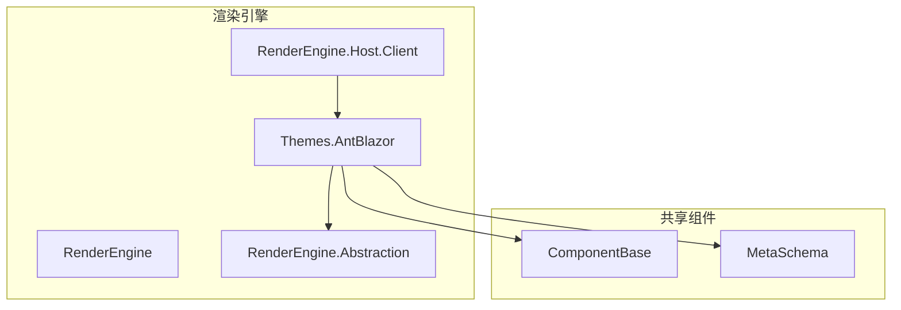
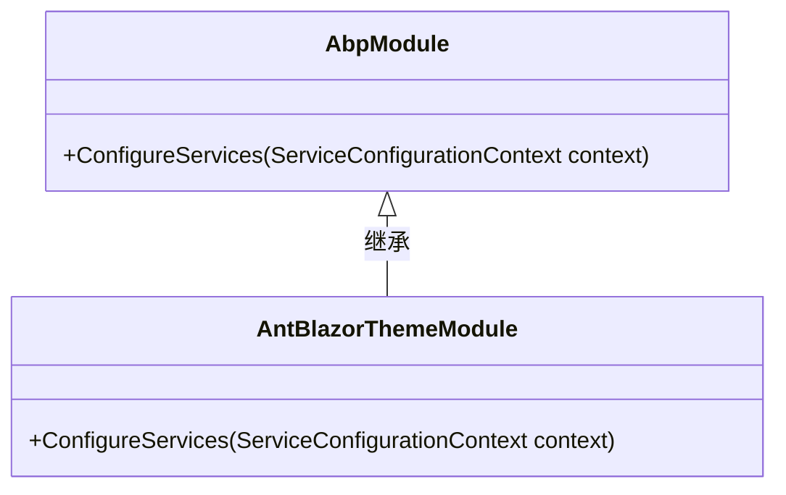
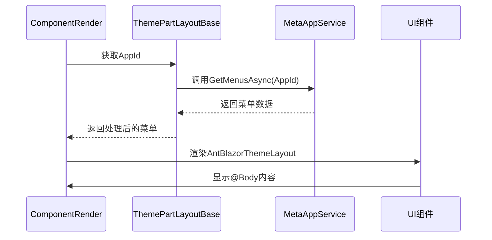

# 主题定制

<cite>
**本文档引用文件**  
- [AntBlazorThemeModule.cs](file://src/RenderEngine/H.LowCode.Themes.AntBlazor/AntBlazorThemeModule.cs)
- [ThemePartLayoutBase.cs](file://src/RenderEngine/H.LowCode.RenderEngine.Abstraction/ThemePartLayoutBase.cs)
- [AntBlazorThemeLayout.razor](file://src/RenderEngine/H.LowCode.Themes.AntBlazor/Layout/AntBlazorThemeLayout.razor)
- [ComponentRender.razor](file://src/RenderEngine/H.LowCode.Themes.AntBlazor/ComponentRender/ComponentRender.razor)
- [LowCodeGlobalVariables.cs](file://src/RenderEngine/H.LowCode.RenderEngine.Host.Client/LowCodeGlobalVariables.cs)
- [Program.cs](file://src/RenderEngine/H.LowCode.RenderEngine.Host/Program.cs)
- [ComponentSchemaBase.cs](file://src/Common/H.LowCode.MetaSchema/ComponentSchemaBase.cs)
- [LowCodeComponentBase.cs](file://src/Common/H.LowCode.ComponentBase/LowCodeComponentBase.cs)
</cite>

## 目录
1. [项目结构](#项目结构)
2. [核心组件](#核心组件)
3. [主题模块架构](#主题模块架构)
4. [主题布局实现机制](#主题布局实现机制)
5. [组件渲染与元数据映射](#组件渲染与元数据映射)
6. [模块注册与加载机制](#模块注册与加载机制)
7. [样式隔离与资源注入](#样式隔离与资源注入)
8. [调试与兼容性处理](#调试与兼容性处理)

## 项目结构

本项目采用模块化分层架构，主要分为设计引擎（DesignEngine）和渲染引擎（RenderEngine）两大核心模块。主题定制功能位于渲染引擎下的 `H.LowCode.Themes.AntBlazor` 模块中，通过继承 `ThemePartLayoutBase` 基类实现自定义UI主题。



**图示来源**
- [AntBlazorThemeModule.cs](file://src/RenderEngine/H.LowCode.Themes.AntBlazor/AntBlazorThemeModule.cs)
- [ThemePartLayoutBase.cs](file://src/RenderEngine/H.LowCode.RenderEngine.Abstraction/ThemePartLayoutBase.cs)

**本节来源**
- [AntBlazorThemeModule.cs](file://src/RenderEngine/H.LowCode.Themes.AntBlazor/AntBlazorThemeModule.cs)
- [ThemePartLayoutBase.cs](file://src/RenderEngine/H.LowCode.RenderEngine.Abstraction/ThemePartLayoutBase.cs)

## 核心组件

主题定制系统的核心组件包括主题模块类、布局基类、具体布局实现和组件渲染器。这些组件共同协作，实现从元数据到UI组件的动态映射与渲染。

**本节来源**
- [AntBlazorThemeModule.cs](file://src/RenderEngine/H.LowCode.Themes.AntBlazor/AntBlazorThemeModule.cs)
- [ThemePartLayoutBase.cs](file://src/RenderEngine/H.LowCode.RenderEngine.Abstraction/ThemePartLayoutBase.cs)
- [AntBlazorThemeLayout.razor](file://src/RenderEngine/H.LowCode.Themes.AntBlazor/Layout/AntBlazorThemeLayout.razor)

## 主题模块架构

AntBlazor主题模块通过 `AntBlazorThemeModule` 类继承 `AbpModule` 实现模块化注册。该模块作为Ant Design Blazor组件库的替代方案，提供完整的UI主题定制能力。



**图示来源**
- [AntBlazorThemeModule.cs](file://src/RenderEngine/H.LowCode.Themes.AntBlazor/AntBlazorThemeModule.cs)

**本节来源**
- [AntBlazorThemeModule.cs](file://src/RenderEngine/H.LowCode.Themes.AntBlazor/AntBlazorThemeModule.cs)

## 主题布局实现机制

主题布局通过 `ThemePartLayoutBase` 基类和 `AntBlazorThemeLayout` 具体实现构成。`ThemePartLayoutBase` 提供了菜单数据获取等基础功能，而 `AntBlazorThemeLayout` 则实现了具体的UI布局。

### 继承机制

`ThemePartLayoutBase` 继承自 `LowCodeLayoutComponentBase`，注入了 `IMetaAppService`、`NavigationManager` 和 `IConfiguration` 服务，提供了获取菜单数据的核心方法。

```csharp
public abstract class ThemePartLayoutBase : LowCodeLayoutComponentBase
{
    [Inject]
    private IMetaAppService MetaAppService { get; set; }

    [Inject]
    private NavigationManager NavigationManager { get; set; }

    [Inject]
    private IConfiguration Configuration { get; set; }

    protected async Task<IList<MenuSchema>> GetMenusAsync(string appId)
    {
        var menus = await GetMenuListAsync(appId);

        string IndexUrl = "index";
        if (menus.Any(t => string.Equals(t.MenuUrl, IndexUrl, StringComparison.OrdinalIgnoreCase)) == false)
        {
            menus.Insert(0, new MenuSchema
            {
                MenuUrl = IndexUrl,
                Title = "首页",
                Id = IndexUrl
            });
        }
        return menus;
    }
}
```

### 布局渲染重定向

`AntBlazorThemeLayout` 通过 `@inherits ThemePartLayoutBase` 指令继承基类功能，并使用 Ant Design ProLayout 组件实现现代化布局。该布局自动注入CSS资源并处理菜单数据转换。

```csharp
@inherits ThemePartLayoutBase

<link href="@Assets["_content/H.LowCode.Themes.AntBlazor/renderengine.css"]" rel="stylesheet" />

<AntDesign.ProLayout.BasicLayout FixedHeader="true" Class="renderengine" Logo="@("logo.png")" Title="@AppId"
     MenuData="@_menuDataItems" MenuAccordion="true" Layout="AntDesign.ProLayout.Layout.Side">
    <ChildContent>
        @Body
    </ChildContent>
</AntDesign.ProLayout.BasicLayout>
```

**图示来源**
- [ThemePartLayoutBase.cs](file://src/RenderEngine/H.LowCode.RenderEngine.Abstraction/ThemePartLayoutBase.cs)
- [AntBlazorThemeLayout.razor](file://src/RenderEngine/H.LowCode.Themes.AntBlazor/Layout/AntBlazorThemeLayout.razor)

**本节来源**
- [ThemePartLayoutBase.cs](file://src/RenderEngine/H.LowCode.RenderEngine.Abstraction/ThemePartLayoutBase.cs)
- [AntBlazorThemeLayout.razor](file://src/RenderEngine/H.LowCode.Themes.AntBlazor/Layout/AntBlazorThemeLayout.razor)

## 组件渲染与元数据映射

系统通过元数据驱动组件渲染，将 `ComponentSchemaBase` 中定义的组件属性映射到实际的Razor组件。

### 元数据结构

`ComponentSchemaBase` 定义了组件的核心元数据结构，包括ID、父ID、名称、标签、样式和事件等。

```csharp
public abstract class ComponentSchemaBase : StateHasChangeSchema
{
    [JsonPropertyName("id")]
    public string Id { get; set; } = ShortIdGenerator.Generate();

    [JsonPropertyName("pid")]
    public string ParentId { get; set; }

    [JsonPropertyName("n")]
    public string Name { get; set; }

    [JsonPropertyName("lb")]
    public string Label { get; set; }

    [JsonPropertyName("stl")]
    public ComponentStyleSchema Style { get; set; } = new();

    [JsonPropertyName("evs")]
    public IList<EventSchema> Events { get; set; }
}
```

### 组件渲染流程

`ComponentRender.razor` 负责根据元数据动态渲染具体组件。它通过组件类型名称查找对应的Razor组件并进行实例化，实现渲染重定向。



**图示来源**
- [ComponentSchemaBase.cs](file://src/Common/H.LowCode.MetaSchema/ComponentSchemaBase.cs)
- [ComponentRender.razor](file://src/RenderEngine/H.LowCode.Themes.AntBlazor/ComponentRender/ComponentRender.razor)

**本节来源**
- [ComponentSchemaBase.cs](file://src/Common/H.LowCode.MetaSchema/ComponentSchemaBase.cs)
- [ComponentRender.razor](file://src/RenderEngine/H.LowCode.Themes.AntBlazor/ComponentRender/ComponentRender.razor)

## 模块注册与加载机制

主题模块通过ABP框架的模块化机制在启动时自动加载，并与设计引擎的元数据保持兼容。

### 程序集注册

`LowCodeGlobalVariables` 类通过静态字段注册额外的程序集，确保主题模块能够被正确加载。

```csharp
public static class LowCodeGlobalVariables
{
    public static readonly Type LowCodeDefaultLayout = typeof(AntBlazorThemeLayout);

    public static readonly Assembly[] AdditionalAssemblies =
        [
            typeof(Themes.AntBlazor._Imports).Assembly
        ];
}
```

### 启动加载流程

服务端 `Program.cs` 通过 `AddAdditionalAssemblies` 方法将注册的程序集添加到渲染管道中，确保主题组件能够被正确解析和渲染。

```csharp
app.MapRazorComponents<App>()
    .AddInteractiveServerRenderMode()
    .AddInteractiveWebAssemblyRenderMode()
    .AddAdditionalAssemblies(LowCodeGlobalVariables.AdditionalAssemblies);
```

**图示来源**
- [LowCodeGlobalVariables.cs](file://src/RenderEngine/H.LowCode.RenderEngine.Host.Client/LowCodeGlobalVariables.cs)
- [Program.cs](file://src/RenderEngine/H.LowCode.RenderEngine.Host/Program.cs)

**本节来源**
- [LowCodeGlobalVariables.cs](file://src/RenderEngine/H.LowCode.RenderEngine.Host.Client/LowCodeGlobalVariables.cs)
- [Program.cs](file://src/RenderEngine/H.LowCode.RenderEngine.Host/Program.cs)

## 样式隔离与资源注入

主题系统通过多种机制实现样式隔离和全局覆盖，确保主题样式不会与其他组件冲突。

### CSS资源注入

通过Razor指令直接注入CSS文件，确保主题样式优先加载：

```html
<link href="@Assets["_content/H.LowCode.Themes.AntBlazor/renderengine.css"]" rel="stylesheet" />
```

### 样式隔离策略

- 使用特定CSS类名（如 `renderengine`）作为命名空间
- 在组件级别定义内联样式
- 利用Blazor的CSS隔离特性（.razor.css文件）

**本节来源**
- [AntBlazorThemeLayout.razor](file://src/RenderEngine/H.LowCode.Themes.AntBlazor/Layout/AntBlazorThemeLayout.razor)
- [ComponentRender.razor.css](file://src/RenderEngine/H.LowCode.Themes.AntBlazor/ComponentRender/ComponentRender.razor.css)

## 调试与兼容性处理

### 调试技巧

1. 检查 `AdditionalAssemblies` 是否正确注册
2. 验证 `LowCodeDefaultLayout` 是否指向正确的布局组件
3. 确认CSS资源路径是否正确
4. 使用浏览器开发者工具检查组件渲染树

### 版本升级兼容性

- 保持 `ComponentSchemaBase` 的JSON属性名称不变
- 在新增功能时使用可选属性
- 通过 `IsSupportDataSource` 等属性实现向后兼容
- 使用ABP模块的依赖声明确保正确的加载顺序

**本节来源**
- [AntBlazorThemeModule.cs](file://src/RenderEngine/H.LowCode.Themes.AntBlazor/AntBlazorThemeModule.cs)
- [ThemePartLayoutBase.cs](file://src/RenderEngine/H.LowCode.RenderEngine.Abstraction/ThemePartLayoutBase.cs)
- [LowCodeComponentBase.cs](file://src/Common/H.LowCode.ComponentBase/LowCodeComponentBase.cs)