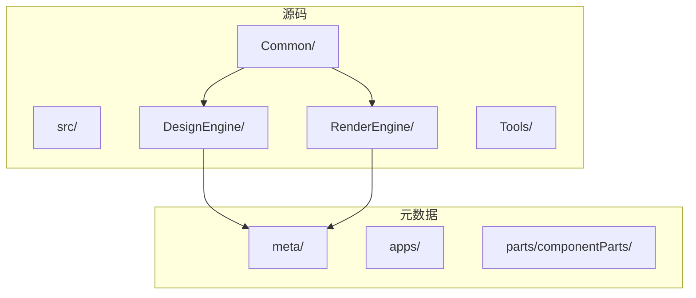
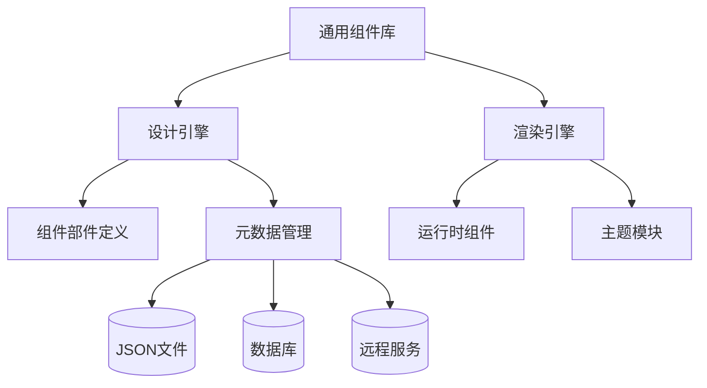
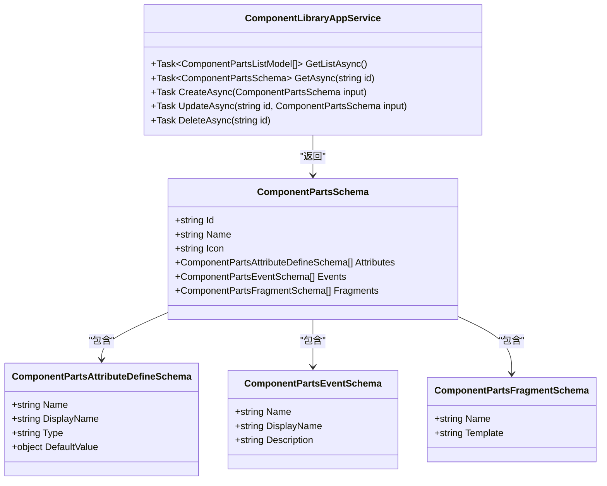
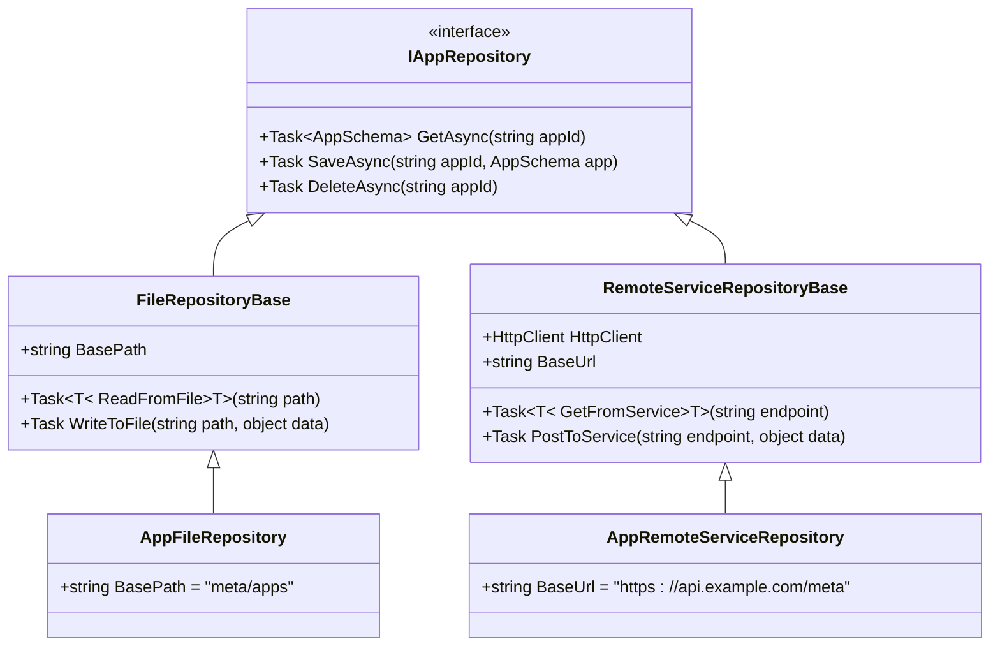
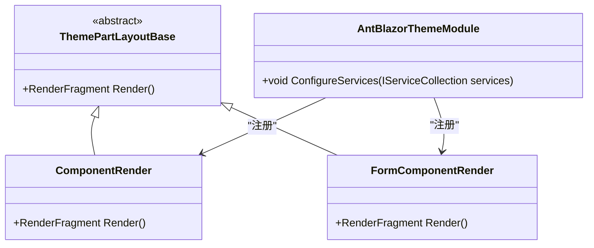
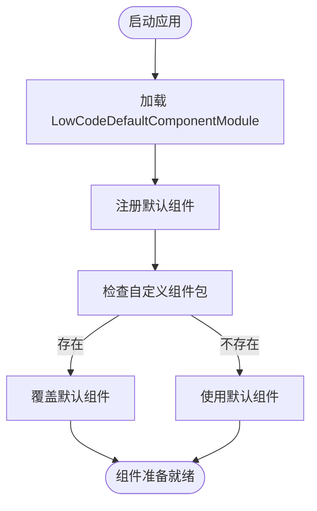
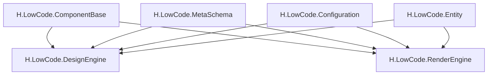

# 扩展与集成

<cite>
**本文档中引用的文件**   
- [AppCascadingModel.cs](file://src/Common/H.LowCode.ComponentBase/CascadingModels/AppCascadingModel.cs)
- [PageCascadingModel.cs](file://src/Common/H.LowCode.ComponentBase/CascadingModels/PageCascadingModel.cs)
- [LowCodeAppState.cs](file://src/Common/H.LowCode.ComponentBase/LowCodeAppState.cs)
- [LowCodeComponentBase.cs](file://src/Common/H.LowCode.ComponentBase/LowCodeComponentBase.cs)
- [LowCodeComponentBaseModule.cs](file://src/Common/H.LowCode.ComponentBase/LowCodeComponentBaseModule.cs)
- [LowCodeDynamicComponentBase.cs](file://src/Common/H.LowCode.ComponentBase/LowCodeDynamicComponentBase.cs)
- [LowCodeLayoutComponentBase.cs](file://src/Common/H.LowCode.ComponentBase/LowCodeLayoutComponentBase.cs)
- [LowCodePageComponentBase.cs](file://src/Common/H.LowCode.ComponentBase/LowCodePageComponentBase.cs)
- [LowCodeDefaultComponentModule.cs](file://src/Common/H.LowCode.Components.Defaults/LowCodeDefaultComponentModule.cs)
- [MetaOption.cs](file://src/Common/H.LowCode.Configuration/Options/MetaOption.cs)
- [SiteOption.cs](file://src/Common/H.LowCode.Configuration/Options/SiteOption.cs)
- [EntityBase.cs](file://src/Common/H.LowCode.Entity/Base/EntityBase.cs)
- [FormEntity.cs](file://src/Common/H.LowCode.Entity/Base/FormEntity.cs)
- [DynamicEntityInfo.cs](file://src/Common/H.LowCode.Entity/EntityManager/DynamicEntityInfo.cs)
- [ComponentPartsSchema.cs](file://src/Common/H.LowCode.MetaSchema.DesignEngine/ComponentPartsSchema.cs)
- [ComponentLibraryAppService.cs](file://src/DesignEngine/H.LowCode.DesignEngine.Application/PartsAppServices/ComponentLibraryAppService.cs)
- [RemoteServiceRepositoryBase.cs](file://src/DesignEngine/H.LowCode.DesignEngine.Repository.RemoteService/Base/RemoteServiceRepositoryBase.cs)
- [AntBlazorThemeModule.cs](file://src/RenderEngine/H.LowCode.Themes.AntBlazor/AntBlazorThemeModule.cs)
</cite>

## 目录
1. [简介](#简介)
2. [项目结构](#项目结构)
3. [核心组件](#核心组件)
4. [架构概述](#架构概述)
5. [详细组件分析](#详细组件分析)
6. [依赖分析](#依赖分析)
7. [性能考虑](#性能考虑)
8. [故障排除指南](#故障排除指南)
9. [结论](#结论)

## 简介
本文档旨在为低代码平台的扩展与集成提供权威指南。内容涵盖自定义组件开发、数据存储扩展机制、主题定制方法、默认组件包加载机制以及插件化开发的最佳实践。通过深入分析代码结构与设计模式，帮助开发者理解系统架构并实现灵活扩展。

## 项目结构
本项目采用模块化分层架构，主要分为 `meta` 元数据目录和 `src` 源码目录。`meta` 存放应用、页面、菜单及组件部件的JSON元数据；`src` 包含多个功能模块，如设计引擎、渲染引擎、通用组件库等。

**图示来源**
- [AppCascadingModel.cs](file://src/Common/H.LowCode.ComponentBase/CascadingModels/AppCascadingModel.cs)
- [PageCascadingModel.cs](file://src/Common/H.LowCode.ComponentBase/CascadingModels/PageCascadingModel.cs)

**本节来源**
- [AppCascadingModel.cs](file://src/Common/H.LowCode.ComponentBase/CascadingModels/AppCascadingModel.cs)
- [PageCascadingModel.cs](file://src/Common/H.LowCode.ComponentBase/CascadingModels/PageCascadingModel.cs)

## 核心组件
系统核心由组件基类、状态管理、元数据模型和扩展服务构成。`LowCodeComponentBase` 提供所有低代码组件的基础功能，`LowCodeAppState` 管理应用级状态，`ComponentPartsSchema` 定义可设计的组件元数据结构。

**本节来源**
- [LowCodeComponentBase.cs](file://src/Common/H.LowCode.ComponentBase/LowCodeComponentBase.cs)
- [LowCodeAppState.cs](file://src/Common/H.LowCode.ComponentBase/LowCodeAppState.cs)
- [ComponentPartsSchema.cs](file://src/Common/H.LowCode.MetaSchema.DesignEngine/ComponentPartsSchema.cs)

## 架构概述
系统采用前后端分离架构，设计引擎与渲染引擎共享通用组件库。元数据通过文件或远程服务存储，支持灵活扩展。

**图示来源**
- [ComponentLibraryAppService.cs](file://src/DesignEngine/H.LowCode.DesignEngine.Application/PartsAppServices/ComponentLibraryAppService.cs)
- [RemoteServiceRepositoryBase.cs](file://src/DesignEngine/H.LowCode.DesignEngine.Repository.RemoteService/Base/RemoteServiceRepositoryBase.cs)

## 详细组件分析

### 自定义组件开发
开发者可通过定义新的 `ComponentPartsSchema` 来创建可拖拽的组件部件，并实现对应的 `ComponentLibraryAppService` 以提供服务接口。

#### 类图展示

**图示来源**
- [ComponentPartsSchema.cs](file://src/Common/H.LowCode.MetaSchema.DesignEngine/ComponentPartsSchema.cs)
- [ComponentLibraryAppService.cs](file://src/DesignEngine/H.LowCode.DesignEngine.Application/PartsAppServices/ComponentLibraryAppService.cs)

**本节来源**
- [ComponentPartsSchema.cs](file://src/Common/H.LowCode.MetaSchema.DesignEngine/ComponentPartsSchema.cs)
- [ComponentLibraryAppService.cs](file://src/DesignEngine/H.LowCode.DesignEngine.Application/PartsAppServices/ComponentLibraryAppService.cs)

### 数据存储扩展机制
通过实现 `IAppRepository` 等接口，可将元数据存储从JSON文件迁移到数据库或远程服务。`RemoteServiceRepositoryBase` 提供了抽象基类，简化远程调用实现。

**图示来源**
- [RemoteServiceRepositoryBase.cs](file://src/DesignEngine/H.LowCode.DesignEngine.Repository.RemoteService/Base/RemoteServiceRepositoryBase.cs)
- [AppFileRepository.cs](file://src/DesignEngine/H.LowCode.DesignEngine.Repository.JsonFile/Repositories/AppFileRepository.cs)

**本节来源**
- [RemoteServiceRepositoryBase.cs](file://src/DesignEngine/H.LowCode.DesignEngine.Repository.RemoteService/Base/RemoteServiceRepositoryBase.cs)
- [AppFileRepository.cs](file://src/DesignEngine/H.LowCode.DesignEngine.Repository.JsonFile/Repositories/AppFileRepository.cs)

### 主题定制方法
通过创建新的主题模块（如 `AntBlazorThemeModule`），可替换UI组件库。主题模块注册自定义的渲染组件，实现界面风格的统一替换。

**图示来源**
- [AntBlazorThemeModule.cs](file://src/RenderEngine/H.LowCode.Themes.AntBlazor/AntBlazorThemeModule.cs)
- [ComponentRender.razor.css](file://src/RenderEngine/H.LowCode.Themes.AntBlazor/ComponentRender/ComponentRender.razor.css)

**本节来源**
- [AntBlazorThemeModule.cs](file://src/RenderEngine/H.LowCode.Themes.AntBlazor/AntBlazorThemeModule.cs)

### 默认组件包加载机制
`LowCodeDefaultComponentModule` 是默认组件包，通过模块化方式注册基础组件。系统支持覆盖策略，允许自定义组件包替换默认实现。

**图示来源**
- [LowCodeDefaultComponentModule.cs](file://src/Common/H.LowCode.Components.Defaults/LowCodeDefaultComponentModule.cs)

**本节来源**
- [LowCodeDefaultComponentModule.cs](file://src/Common/H.LowCode.Components.Defaults/LowCodeDefaultComponentModule.cs)

## 依赖分析
系统各模块之间通过接口解耦，依赖注入实现松耦合。通用组件库为基础依赖，设计与渲染引擎分别独立扩展。

**图示来源**
- [LowCodeComponentBaseModule.cs](file://src/Common/H.LowCode.ComponentBase/LowCodeComponentBaseModule.cs)
- [DesignEngineApplicationModule.cs](file://src/DesignEngine/H.LowCode.DesignEngine.Application/DesignEngineApplicationModule.cs)

**本节来源**
- [LowCodeComponentBaseModule.cs](file://src/Common/H.LowCode.ComponentBase/LowCodeComponentBaseModule.cs)

## 性能考虑
- 元数据读取建议使用缓存机制减少I/O开销
- 远程服务调用应实现批量接口以减少网络往返
- 组件渲染采用虚拟化技术避免大量DOM操作
- 主题资源应压缩合并以减少加载时间

## 故障排除指南
常见问题及解决方案：
- **组件不显示**：检查 `ComponentLibraryAppService` 是否正确返回组件列表
- **样式丢失**：确认主题模块已正确注册且CSS路径无误
- **数据无法保存**：验证 `IAppRepository` 实现的序列化逻辑
- **远程服务超时**：检查 `RemoteServiceRepositoryBase` 的HttpClient配置

**本节来源**
- [ComponentLibraryAppService.cs](file://src/DesignEngine/H.LowCode.DesignEngine.Application/PartsAppServices/ComponentLibraryAppService.cs)
- [RemoteServiceRepositoryBase.cs](file://src/DesignEngine/H.LowCode.DesignEngine.Repository.RemoteService/Base/RemoteServiceRepositoryBase.cs)

## 结论
本低代码平台通过模块化设计和接口抽象，提供了强大的扩展能力。开发者可遵循本文档指导，实现自定义组件、数据存储扩展、主题定制等功能，满足多样化业务需求。建议遵循最佳实践，确保系统稳定性和可维护性。