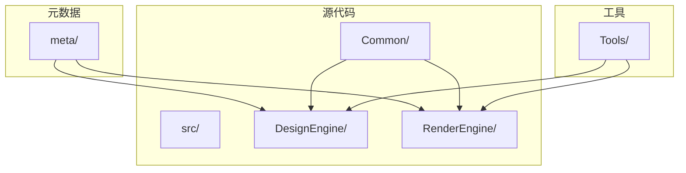
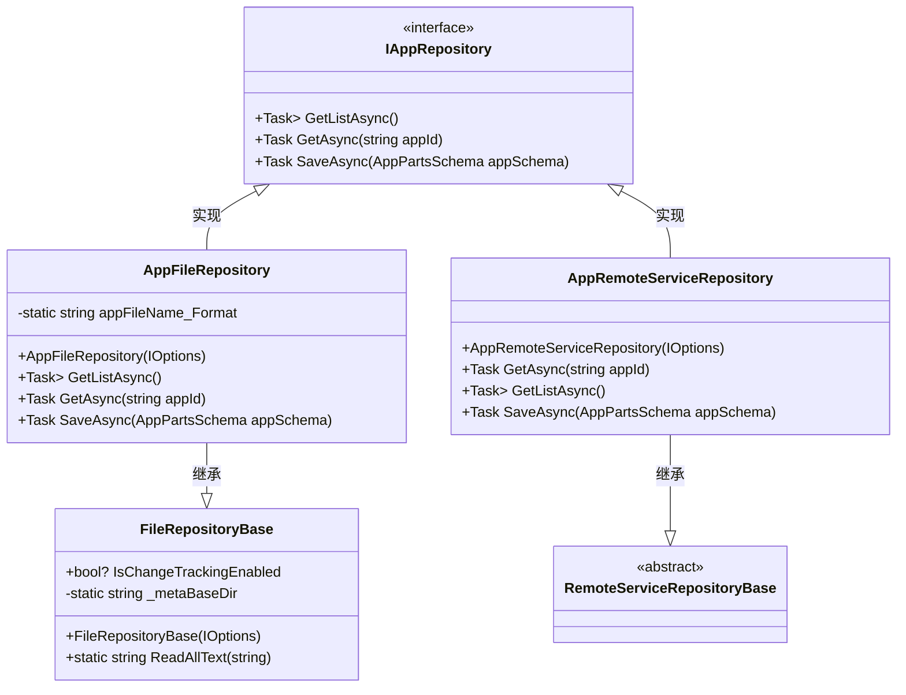
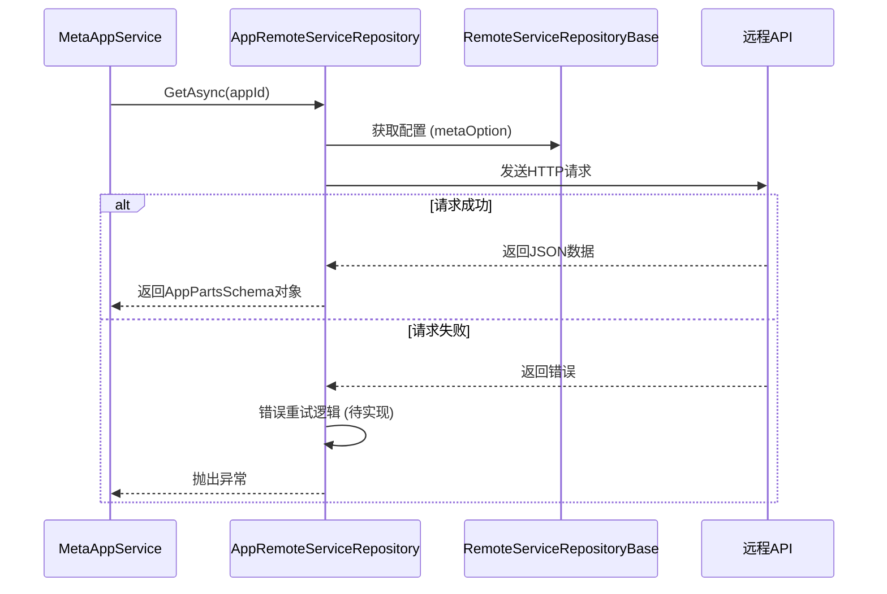
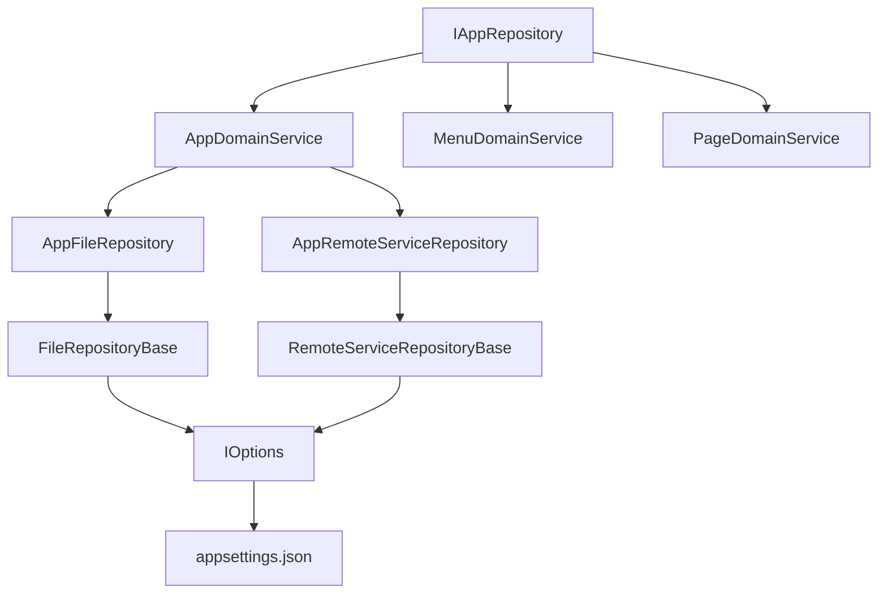

# 数据存储扩展

<cite>
**本文档引用的文件**   
- [RemoteServiceRepositoryBase.cs](file://src/DesignEngine/H.LowCode.DesignEngine.Repository.RemoteService/Base/RemoteServiceRepositoryBase.cs)
- [AppRemoteServiceRepository.cs](file://src/DesignEngine/H.LowCode.DesignEngine.Repository.RemoteService/Repositories/AppRemoteServiceRepository.cs)
- [AppFileRepository.cs](file://src/DesignEngine/H.LowCode.DesignEngine.Repository.JsonFile/Repositories/AppFileRepository.cs)
- [IAppRepository.cs](file://src/DesignEngine/H.LowCode.DesignEngine.Domain/MetaRepositories/IAppRepository.cs)
- [FileRepositoryBase.cs](file://src/DesignEngine/H.LowCode.DesignEngine.Repository.JsonFile/Base/FileRepositoryBase.cs)
- [AppRemoteServiceRepository.cs](file://src/RenderEngine/H.LowCode.RenderEngine.Repository.RemoteService/Repositories/AppRemoteServiceRepository.cs)
- [AppFileRepository.cs](file://src/RenderEngine/H.LowCode.RenderEngine.Repository.JsonFile/Repositories/AppFileRepository.cs)
- [IAppRepository.cs](file://src/RenderEngine/H.LowCode.RenderEngine.Domain/MetaRepositories/IAppRepository.cs)
</cite>

## 目录
1. [引言](#引言)
2. [项目结构](#项目结构)
3. [核心组件](#核心组件)
4. [架构概述](#架构概述)
5. [详细组件分析](#详细组件分析)
6. [依赖分析](#依赖分析)
7. [性能考虑](#性能考虑)
8. [故障排除指南](#故障排除指南)
9. [结论](#结论)

## 引言
本文档全面阐述低代码平台的数据存储扩展机制，重点分析 `RemoteServiceRepositoryBase` 抽象基类的设计原理，说明其如何通过泛型和依赖注入支持多种远程服务协议（如HTTP、gRPC）。对比 `JsonFile` 与 `RemoteService` 两种存储实现，指导开发者如何将元数据持久化从本地文件迁移到远程API或数据库。详细说明 `AppRemoteServiceRepository` 的请求封装、错误重试和缓存策略。解释 `IAppRepository` 等接口契约在领域层的作用，并演示如何实现自定义仓储以对接第三方系统。最后提供性能优化建议。

## 项目结构
本项目采用分层架构设计，主要分为 `meta`（元数据）、`src`（源代码）和 `Tools`（工具）三大目录。`src` 目录下包含 `Common`（公共组件）、`DesignEngine`（设计引擎）、`RenderEngine`（渲染引擎）等核心模块。数据存储扩展机制主要在 `DesignEngine` 和 `RenderEngine` 的 `Repository` 子模块中实现，提供了基于JSON文件和远程服务的两种持久化方案。

**图示来源**
- [project_structure](file://#L1-L200)

## 核心组件
核心组件包括 `IAppRepository` 接口、`FileRepositoryBase` 基类、`RemoteServiceRepositoryBase` 抽象基类以及具体的 `AppFileRepository` 和 `AppRemoteServiceRepository` 实现。这些组件共同构成了低代码平台灵活的数据存储扩展体系。

**组件来源**
- [IAppRepository.cs](file://src/DesignEngine/H.LowCode.DesignEngine.Domain/MetaRepositories/IAppRepository.cs#L1-L14)
- [FileRepositoryBase.cs](file://src/DesignEngine/H.LowCode.DesignEngine.Repository.JsonFile/Base/FileRepositoryBase.cs#L1-L31)
- [RemoteServiceRepositoryBase.cs](file://src/DesignEngine/H.LowCode.DesignEngine.Repository.RemoteService/Base/RemoteServiceRepositoryBase.cs#L1-L12)

## 架构概述
系统采用领域驱动设计（DDD）模式，`IAppRepository` 接口定义了应用元数据的访问契约，位于领域层。`FileRepositoryBase` 和 `RemoteServiceRepositoryBase` 分别为基础设施层提供了基于文件和远程服务的两种实现基类。`AppFileRepository` 和 `AppRemoteServiceRepository` 作为具体实现，通过依赖注入与上层服务解耦。

**图示来源**
- [IAppRepository.cs](file://src/DesignEngine/H.LowCode.DesignEngine.Domain/MetaRepositories/IAppRepository.cs#L1-L14)
- [FileRepositoryBase.cs](file://src/DesignEngine/H.LowCode.DesignEngine.Repository.JsonFile/Base/FileRepositoryBase.cs#L1-L31)
- [RemoteServiceRepositoryBase.cs](file://src/DesignEngine/H.LowCode.DesignEngine.Repository.RemoteService/Base/RemoteServiceRepositoryBase.cs#L1-L12)
- [AppFileRepository.cs](file://src/DesignEngine/H.LowCode.DesignEngine.Repository.JsonFile/Repositories/AppFileRepository.cs#L1-L70)
- [AppRemoteServiceRepository.cs](file://src/DesignEngine/H.LowCode.DesignEngine.Repository.RemoteService/Repositories/AppRemoteServiceRepository.cs#L1-L34)

## 详细组件分析

### RemoteServiceRepositoryBase 抽象基类设计
`RemoteServiceRepositoryBase` 是一个抽象基类，位于 `H.LowCode.DesignEngine.Repository.RemoteService.Base` 命名空间下。其设计原理是为所有基于远程服务的仓储提供一个统一的基类，通过依赖注入（`IOptions<MetaOption>`）获取远程服务的配置信息。虽然当前实现为空，但其设计意图是封装HTTP客户端、序列化、认证等通用逻辑，支持多种远程协议（如HTTP、gRPC）的扩展。

**组件来源**
- [RemoteServiceRepositoryBase.cs](file://src/DesignEngine/H.LowCode.DesignEngine.Repository.RemoteService/Base/RemoteServiceRepositoryBase.cs#L1-L12)

### AppRemoteServiceRepository 实现分析
`AppRemoteServiceRepository` 类继承自 `RemoteServiceRepositoryBase` 并实现了 `IAppRepository` 接口。它通过构造函数注入 `MetaOption` 配置，用于获取远程服务的地址等信息。然而，当前所有方法（`GetAsync`, `GetListAsync`, `SaveAsync`）均抛出 `NotImplementedException`，表明该实现尚未完成。其设计意图是通过封装对远程API的调用，实现元数据的集中化管理。

**图示来源**
- [AppRemoteServiceRepository.cs](file://src/DesignEngine/H.LowCode.DesignEngine.Repository.RemoteService/Repositories/AppRemoteServiceRepository.cs#L1-L34)

### JsonFile 与 RemoteService 存储实现对比
`AppFileRepository` 和 `AppRemoteServiceRepository` 都实现了 `IAppRepository` 接口，但持久化机制截然不同。

- **JsonFile 实现**：`AppFileRepository` 继承自 `FileRepositoryBase`，直接在本地文件系统中读写JSON文件。`GetListAsync` 方法遍历应用目录，读取每个应用的JSON文件并反序列化；`SaveAsync` 方法将对象序列化为JSON并写入文件。其优势是简单、无需网络依赖，适合开发和测试环境。
- **RemoteService 实现**：`AppRemoteServiceRepository` 设计用于通过网络调用远程API进行数据存取。其优势是支持集中化管理、多实例共享、高可用性，适合生产环境。

| 特性 | JsonFile 存储 | RemoteService 存储 |
| :--- | :--- | :--- |
| **持久化位置** | 本地文件系统 | 远程服务器/API |
| **实现状态** | 已完成 | 未实现 (NotImplementedException) |
| **依赖** | 文件系统 | 网络、远程服务 |
| **适用场景** | 开发、测试 | 生产、集群 |
| **扩展性** | 低 | 高 |

**组件来源**
- [AppFileRepository.cs](file://src/DesignEngine/H.LowCode.DesignEngine.Repository.JsonFile/Repositories/AppFileRepository.cs#L1-L70)
- [AppRemoteServiceRepository.cs](file://src/DesignEngine/H.LowCode.DesignEngine.Repository.RemoteService/Repositories/AppRemoteServiceRepository.cs#L1-L34)

### IAppRepository 接口契约分析
`IAppRepository` 是定义在领域层的接口契约，位于 `H.LowCode.DesignEngine.Domain.Repositories` 命名空间。它定义了应用元数据的三个核心操作：
- `GetListAsync`：获取所有应用的列表。
- `GetAsync`：根据应用ID获取单个应用的元数据。
- `SaveAsync`：保存或更新应用的元数据。

该接口是仓储模式（Repository Pattern）的体现，将领域逻辑与数据访问细节解耦。上层服务（如 `AppDomainService`）通过此接口操作数据，而无需关心底层是文件存储还是远程服务。

**组件来源**
- [IAppRepository.cs](file://src/DesignEngine/H.LowCode.DesignEngine.Domain/MetaRepositories/IAppRepository.cs#L1-L14)

### 自定义仓储实现指导
开发者可以实现自定义仓储来对接第三方系统。步骤如下：
1. 创建一个新类，实现 `IAppRepository` 接口。
2. 在构造函数中注入所需的依赖（如数据库连接、HTTP客户端）。
3. 实现 `GetListAsync`, `GetAsync`, `SaveAsync` 方法，对接具体的第三方系统（如数据库、REST API）。
4. 在依赖注入容器中注册该实现，替换默认的 `AppFileRepository` 或 `AppRemoteServiceRepository`。

例如，对接数据库的实现可能使用Entity Framework Core，而对接云存储的实现可能使用AWS SDK。

## 依赖分析
系统通过依赖注入管理组件间的依赖关系。`AppFileRepository` 和 `AppRemoteServiceRepository` 都依赖于 `IOptions<MetaOption>` 来获取配置。`MetaOption` 包含了元数据存储的路径（如 `AppsFilePath`），这使得存储位置可以灵活配置。`IAppRepository` 接口被 `AppDomainService` 等领域服务所依赖，实现了控制反转。

**图示来源**
- [IAppRepository.cs](file://src/DesignEngine/H.LowCode.DesignEngine.Domain/MetaRepositories/IAppRepository.cs#L1-L14)
- [AppFileRepository.cs](file://src/DesignEngine/H.LowCode.DesignEngine.Repository.JsonFile/Repositories/AppFileRepository.cs#L1-L70)
- [AppRemoteServiceRepository.cs](file://src/DesignEngine/H.LowCode.DesignEngine.Repository.RemoteService/Repositories/AppRemoteServiceRepository.cs#L1-L34)

## 性能考虑
尽管 `AppRemoteServiceRepository` 尚未实现，但可以预见其性能优化方向：
- **批量操作**：实现 `SaveListAsync` 方法以支持批量保存，减少网络往返次数。
- **异步读写**：所有方法均已声明为 `async Task`，确保非阻塞IO。
- **连接池管理**：在 `RemoteServiceRepositoryBase` 中管理HTTP客户端的生命周期，复用连接。
- **缓存策略**：在 `AppRemoteServiceRepository` 中引入内存缓存（如 `IMemoryCache`），避免对频繁读取的元数据重复请求远程服务。
- **错误重试**：实现指数退避算法的重试机制，提高网络请求的健壮性。

## 故障排除指南
- **问题**：`AppRemoteServiceRepository` 抛出 `NotImplementedException`。
  - **原因**：该功能尚未实现。
  - **解决方案**：在生产环境中，应优先完成 `AppRemoteServiceRepository` 的实现，或使用 `AppFileRepository` 作为临时方案。
- **问题**：`AppFileRepository` 读取文件时抛出 `FileNotFoundException`。
  - **原因**：指定的应用ID对应的JSON文件不存在。
  - **解决方案**：检查 `meta/apps/` 目录下是否存在对应的应用文件夹和JSON文件。
- **问题**：依赖注入失败，无法解析 `IAppRepository`。
  - **原因**：未在DI容器中注册任何 `IAppRepository` 的实现。
  - **解决方案**：在模块的 `ConfigureServices` 方法中注册 `AppFileRepository` 或自定义实现。

**组件来源**
- [AppRemoteServiceRepository.cs](file://src/DesignEngine/H.LowCode.DesignEngine.Repository.RemoteService/Repositories/AppRemoteServiceRepository.cs#L1-L34)
- [AppFileRepository.cs](file://src/DesignEngine/H.LowCode.DesignEngine.Repository.JsonFile/Repositories/AppFileRepository.cs#L1-L70)

## 结论
本文档详细分析了低代码平台的数据存储扩展机制。`RemoteServiceRepositoryBase` 抽象基类为支持多种远程协议提供了设计基础，而 `AppFileRepository` 则提供了稳定可靠的本地文件存储方案。`IAppRepository` 接口作为领域层的契约，确保了业务逻辑与数据访问的解耦。虽然 `AppRemoteServiceRepository` 当前尚未实现，但其架构设计清晰，为未来迁移到集中式元数据管理铺平了道路。开发者可以基于此模式轻松实现对接数据库或第三方API的自定义仓储。