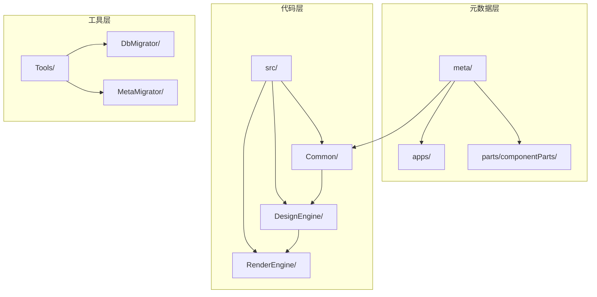
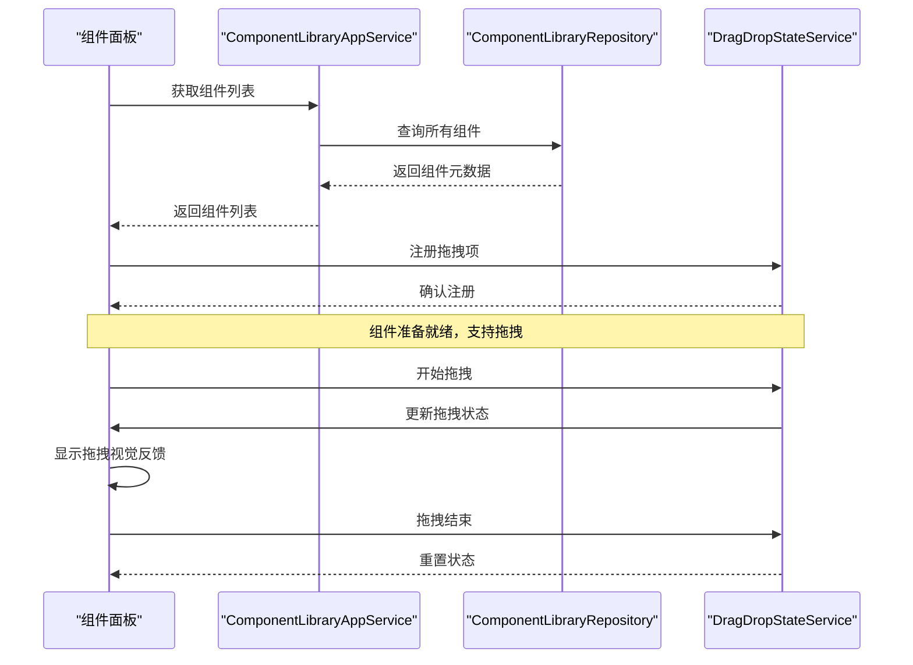
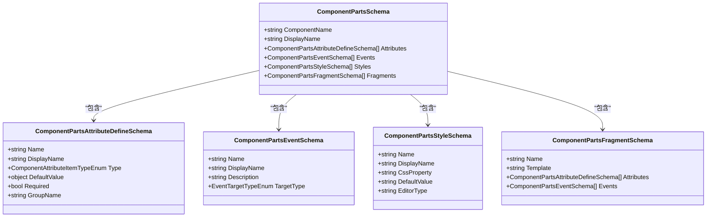
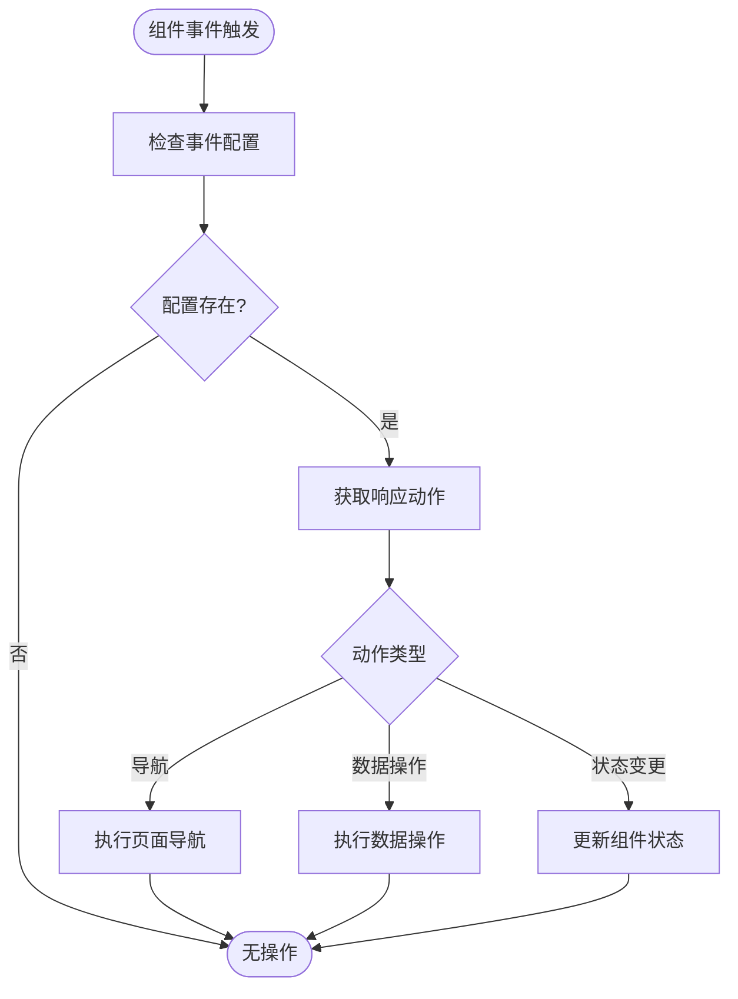
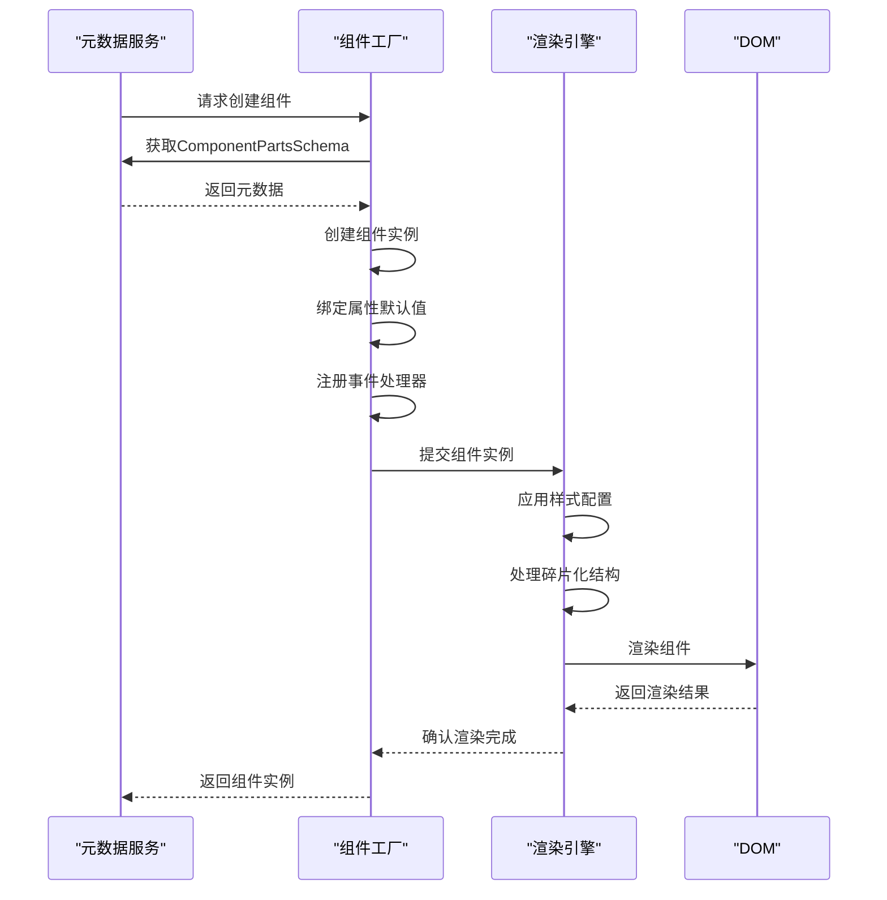

# 自定义组件开发

<cite>
**本文档引用文件**  
- [ComponentPartsSchema.cs](file://src/Common/H.LowCode.MetaSchema.DesignEngine/PropertySchemas/ComponentPartsSchema.cs)
- [ComponentPartsAttributeDefineSchema.cs](file://src/Common/H.LowCode.MetaSchema.DesignEngine/PropertySchemas/ComponentPartsAttributeDefineSchema.cs)
- [ComponentPartsEventSchema.cs](file://src/Common/H.LowCode.MetaSchema.DesignEngine/PropertySchemas/ComponentPartsEventSchema.cs)
- [ComponentLibraryAppService.cs](file://src/DesignEngine/H.LowCode.DesignEngine.Application/PartsAppServices/ComponentLibraryAppService.cs)
- [PartsDesignEngineModule.cs](file://src/DesignEngine/H.LowCode.PartsDesignEngine/PartsDesignEngineModule.cs)
- [ComponentPartsStyleSchema.cs](file://src/Common/H.LowCode.MetaSchema.DesignEngine/PropertySchemas/ComponentPartsStyleSchema.cs)
- [ComponentPartsFragmentSchema.cs](file://src/Common/H.LowCode.MetaSchema.DesignEngine/PropertySchemas/ComponentPartsFragmentSchema.cs)
- [ComponentPartsAttributeDefineGroupSchema.cs](file://src/Common/H.LowCode.MetaSchema.DesignEngine/PropertySchemas/ComponentPartsAttributeDefineGroupSchema.cs)
- [ComponentPartsRepository.cs](file://src/DesignEngine/H.LowCode.DesignEngine.Repository.JsonFile/PartsRepositories/ComponentPartsRepository.cs)
- [ComponentLibraryRepository.cs](file://src/DesignEngine/H.LowCode.DesignEngine.Repository.JsonFile/PartsRepositories/ComponentLibraryRepository.cs)
- [antdesign.json](file://meta/parts/componentParts/antdesign/antdesign.json)
</cite>

## 目录
1. [项目结构分析](#项目结构分析)
2. [核心元数据结构详解](#核心元数据结构详解)
3. [组件注册与设计引擎集成](#组件注册与设计引擎集成)
4. [组件碎片化设计](#组件碎片化设计)
5. [属性分组与样式配置](#属性分组与样式配置)
6. [事件响应机制](#事件响应机制)
7. [前端渲染逻辑绑定](#前端渲染逻辑绑定)
8. [组件面板加载机制](#组件面板加载机制)
9. [调试与验证流程](#调试与验证流程)

## 项目结构分析

本低代码平台采用模块化架构设计，主要分为元数据定义（meta）、源代码实现（src）和工具模块（Tools）三大部分。元数据目录包含应用配置、页面定义和组件库定义，其中`meta/parts/componentParts/antdesign`路径下存放了Ant Design组件库的JSON元数据文件。源代码部分采用分层架构，`H.LowCode.MetaSchema.DesignEngine`命名空间定义了设计时元数据结构，`H.LowCode.DesignEngine.Application`包含应用服务实现，`H.LowCode.PartsDesignEngine`负责组件设计引擎功能。



**图示来源**
- [ComponentPartsSchema.cs](file://src/Common/H.LowCode.MetaSchema.DesignEngine/PropertySchemas/ComponentPartsSchema.cs)
- [antdesign.json](file://meta/parts/componentParts/antdesign/antdesign.json)

**本节来源**
- [ComponentPartsSchema.cs](file://src/Common/H.LowCode.MetaSchema.DesignEngine/PropertySchemas/ComponentPartsSchema.cs)
- [antdesign.json](file://meta/parts/componentParts/antdesign/antdesign.json)

## 核心元数据结构详解

### ComponentPartsSchema 结构定义

`ComponentPartsSchema`是自定义组件的核心元数据结构，定义了组件的基本信息、属性、事件和样式。该类继承自`PartsMetaSchemaBase`，位于`H.LowCode.MetaSchema.DesignEngine`命名空间中。

```csharp
public class ComponentPartsSchema : PartsMetaSchemaBase
{
    public string ComponentName { get; set; }
    public string DisplayName { get; set; }
    public string Icon { get; set; }
    public string Category { get; set; }
    public List<ComponentPartsAttributeDefineSchema> Attributes { get; set; }
    public List<ComponentPartsEventSchema> Events { get; set; }
    public List<ComponentPartsStyleSchema> Styles { get; set; }
    public List<ComponentPartsFragmentSchema> Fragments { get; set; }
}
```

**本节来源**
- [ComponentPartsSchema.cs](file://src/Common/H.LowCode.MetaSchema.DesignEngine/PropertySchemas/ComponentPartsSchema.cs)

### 与 ComponentPartsAttributeDefineSchema 的关系

`ComponentPartsAttributeDefineSchema`定义了组件的可配置属性，与`ComponentPartsSchema`形成一对多关系。每个属性定义包含类型、默认值、是否必填等信息。

```csharp
public class ComponentPartsAttributeDefineSchema
{
    public string Name { get; set; }
    public string DisplayName { get; set; }
    public ComponentAttributeItemTypeEnum Type { get; set; }
    public object DefaultValue { get; set; }
    public bool Required { get; set; }
    public string GroupName { get; set; }
}
```

**本节来源**
- [ComponentPartsAttributeDefineSchema.cs](file://src/Common/H.LowCode.MetaSchema.DesignEngine/PropertySchemas/ComponentPartsAttributeDefineSchema.cs)

### 与 ComponentPartsEventSchema 的关系

`ComponentPartsEventSchema`定义了组件支持的事件，与`ComponentPartsSchema`形成一对多关系。事件定义包含事件名称、触发条件和参数类型。

```csharp
public class ComponentPartsEventSchema
{
    public string Name { get; set; }
    public string DisplayName { get; set; }
    public string Description { get; set; }
    public EventTargetTypeEnum TargetType { get; set; }
}
```

**本节来源**
- [ComponentPartsEventSchema.cs](file://src/Common/H.LowCode.MetaSchema.DesignEngine/PropertySchemas/ComponentPartsEventSchema.cs)

## 组件注册与设计引擎集成

### ComponentLibraryAppService 注册机制

`ComponentLibraryAppService`负责组件元数据的注册和管理，通过`IComponentLibraryRepository`持久化组件库信息。注册新组件时，需调用`CreateAsync`方法将`ComponentPartsSchema`实例保存到元数据存储中。

```csharp
public class ComponentLibraryAppService : IComponentLibraryAppService
{
    private readonly IComponentLibraryRepository _repository;
    
    public async Task<ComponentPartsSchema> CreateAsync(ComponentPartsSchema component)
    {
        return await _repository.InsertAsync(component);
    }
    
    public async Task<List<ComponentPartsSchema>> GetListAsync()
    {
        return await _repository.GetListAsync();
    }
}
```

**本节来源**
- [ComponentLibraryAppService.cs](file://src/DesignEngine/H.LowCode.DesignEngine.Application/PartsAppServices/ComponentLibraryAppService.cs)

### 设计引擎拖拽支持实现

设计引擎通过`PartsDesignEngineModule`模块初始化组件面板，加载所有注册的组件元数据。`DragItem.razor`组件实现拖拽功能，利用`DragDropStateService`管理拖拽状态。



**图示来源**
- [ComponentLibraryAppService.cs](file://src/DesignEngine/H.LowCode.DesignEngine.Application/PartsAppServices/ComponentLibraryAppService.cs)
- [ComponentLibraryRepository.cs](file://src/DesignEngine/H.LowCode.DesignEngine.Repository.JsonFile/PartsRepositories/ComponentLibraryRepository.cs)

**本节来源**
- [ComponentLibraryAppService.cs](file://src/DesignEngine/H.LowCode.DesignEngine.Application/PartsAppServices/ComponentLibraryAppService.cs)
- [PartsDesignEngineModule.cs](file://src/DesignEngine/H.LowCode.PartsDesignEngine/PartsDesignEngineModule.cs)

## 组件碎片化设计

### ComponentPartsFragmentSchema 优势

组件碎片化设计通过`ComponentPartsFragmentSchema`实现，将复杂组件分解为可复用的片段。这种设计模式具有以下优势：
- **提高复用性**：通用UI片段可在多个组件间共享
- **降低复杂度**：将大组件拆分为小的、可管理的单元
- **增强灵活性**：支持动态组合不同片段创建新组件
- **便于维护**：修改片段即可影响所有使用该片段的组件

```csharp
public class ComponentPartsFragmentSchema
{
    public string Name { get; set; }
    public string Template { get; set; }
    public List<ComponentPartsAttributeDefineSchema> Attributes { get; set; }
    public List<ComponentPartsEventSchema> Events { get; set; }
}
```

**本节来源**
- [ComponentPartsFragmentSchema.cs](file://src/Common/H.LowCode.MetaSchema.DesignEngine/PropertySchemas/ComponentPartsFragmentSchema.cs)

### 碎片化实现方式

碎片化实现分为三个步骤：
1. 定义通用UI片段模板
2. 为片段配置独立的属性和事件
3. 在主组件中引用并实例化片段

```json
{
  "fragments": [
    {
      "name": "header",
      "template": "<div class='header'>{{title}}</div>",
      "attributes": [
        {
          "name": "title",
          "type": "String",
          "defaultValue": "标题"
        }
      ]
    }
  ]
}
```

**本节来源**
- [ComponentPartsFragmentSchema.cs](file://src/Common/H.LowCode.MetaSchema.DesignEngine/PropertySchemas/ComponentPartsFragmentSchema.cs)

## 属性分组与样式配置

### ComponentPartsAttributeDefineGroupSchema

属性分组通过`ComponentPartsAttributeDefineGroupSchema`实现，将相关属性组织在逻辑组中，提升配置界面的用户体验。

```csharp
public class ComponentPartsAttributeDefineGroupSchema
{
    public string Name { get; set; }
    public string DisplayName { get; set; }
    public int Order { get; set; }
    public List<string> AttributeNames { get; set; }
}
```

**本节来源**
- [ComponentPartsAttributeDefineGroupSchema.cs](file://src/Common/H.LowCode.MetaSchema.DesignEngine/PropertySchemas/ComponentPartsAttributeDefineGroupSchema.cs)

### ComponentPartsStyleSchema 样式配置

样式配置通过`ComponentPartsStyleSchema`实现，支持CSS属性的可视化编辑。

```csharp
public class ComponentPartsStyleSchema
{
    public string Name { get; set; }
    public string DisplayName { get; set; }
    public string CssProperty { get; set; }
    public string DefaultValue { get; set; }
    public string EditorType { get; set; } // "color", "number", "text"等
}
```



**图示来源**
- [ComponentPartsSchema.cs](file://src/Common/H.LowCode.MetaSchema.DesignEngine/PropertySchemas/ComponentPartsSchema.cs)
- [ComponentPartsAttributeDefineSchema.cs](file://src/Common/H.LowCode.MetaSchema.DesignEngine/PropertySchemas/ComponentPartsAttributeDefineSchema.cs)
- [ComponentPartsEventSchema.cs](file://src/Common/H.LowCode.MetaSchema.DesignEngine/PropertySchemas/ComponentPartsEventSchema.cs)
- [ComponentPartsStyleSchema.cs](file://src/Common/H.LowCode.MetaSchema.DesignEngine/PropertySchemas/ComponentPartsStyleSchema.cs)
- [ComponentPartsFragmentSchema.cs](file://src/Common/H.LowCode.MetaSchema.DesignEngine/PropertySchemas/ComponentPartsFragmentSchema.cs)

**本节来源**
- [ComponentPartsAttributeDefineGroupSchema.cs](file://src/Common/H.LowCode.MetaSchema.DesignEngine/PropertySchemas/ComponentPartsAttributeDefineGroupSchema.cs)
- [ComponentPartsStyleSchema.cs](file://src/Common/H.LowCode.MetaSchema.DesignEngine/PropertySchemas/ComponentPartsStyleSchema.cs)

## 事件响应机制

事件响应机制通过`ComponentPartsEventSchema`定义和`EventTargetTypeEnum`枚举实现。设计时，用户可以为组件事件配置响应动作；运行时，事件系统根据配置执行相应逻辑。



**本节来源**
- [ComponentPartsEventSchema.cs](file://src/Common/H.LowCode.MetaSchema.DesignEngine/PropertySchemas/ComponentPartsEventSchema.cs)

## 前端渲染逻辑绑定

从元数据定义到前端渲染的完整流程包括：
1. 加载组件元数据
2. 解析属性、事件和样式配置
3. 生成组件实例
4. 绑定事件处理器
5. 应用样式配置
6. 渲染到DOM



**本节来源**
- [ComponentPartsSchema.cs](file://src/Common/H.LowCode.MetaSchema.DesignEngine/PropertySchemas/ComponentPartsSchema.cs)
- [ComponentPartsRepository.cs](file://src/DesignEngine/H.LowCode.DesignEngine.Repository.JsonFile/PartsRepositories/ComponentPartsRepository.cs)

## 组件面板加载机制

`PartsDesignEngineModule`负责组件面板的初始化和加载，通过依赖注入获取`ComponentLibraryAppService`，在模块初始化时加载所有可用组件。

```csharp
public class PartsDesignEngineModule : AbpModule
{
    public override void ConfigureServices(ServiceConfigurationContext context)
    {
        context.Services.AddTransient<IComponentLibraryAppService, ComponentLibraryAppService>();
        context.Services.AddTransient<IComponentPartsAppService, ComponentPartsAppService>();
    }
    
    public override void OnApplicationInitialization(ApplicationInitializationContext context)
    {
        var service = context.ServiceProvider.GetService<IComponentLibraryAppService>();
        var components = service.GetListAsync().Result;
        // 初始化组件面板
        ComponentPanel.Initialize(components);
    }
}
```

**本节来源**
- [PartsDesignEngineModule.cs](file://src/DesignEngine/H.LowCode.PartsDesignEngine/PartsDesignEngineModule.cs)

## 调试与验证流程

### 新组件集成验证步骤

1. **元数据验证**：检查JSON元数据文件的完整性和正确性
2. **注册验证**：确认组件已成功注册到`ComponentLibraryRepository`
3. **面板显示**：验证组件是否出现在设计引擎的组件面板中
4. **拖拽测试**：测试组件能否从面板拖拽到画布
5. **属性配置**：验证属性面板是否正确显示组件属性
6. **事件绑定**：测试事件配置和响应是否正常
7. **样式应用**：验证样式配置能否正确应用到组件
8. **运行时验证**：在预览模式下测试组件功能

### 常见问题排查

- **组件不显示**：检查`Category`属性是否正确，确保组件库已刷新
- **属性不生效**：验证属性名称与前端实现是否匹配
- **事件无响应**：检查事件名称拼写和事件处理器注册
- **样式不应用**：确认CSS属性名称和值格式正确

**本节来源**
- [ComponentLibraryAppService.cs](file://src/DesignEngine/H.LowCode.DesignEngine.Application/PartsAppServices/ComponentLibraryAppService.cs)
- [PartsDesignEngineModule.cs](file://src/DesignEngine/H.LowCode.PartsDesignEngine/PartsDesignEngineModule.cs)