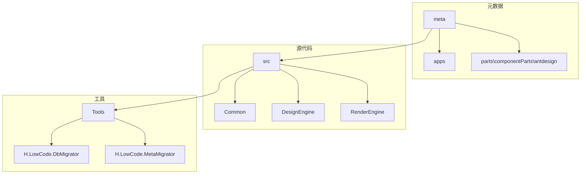
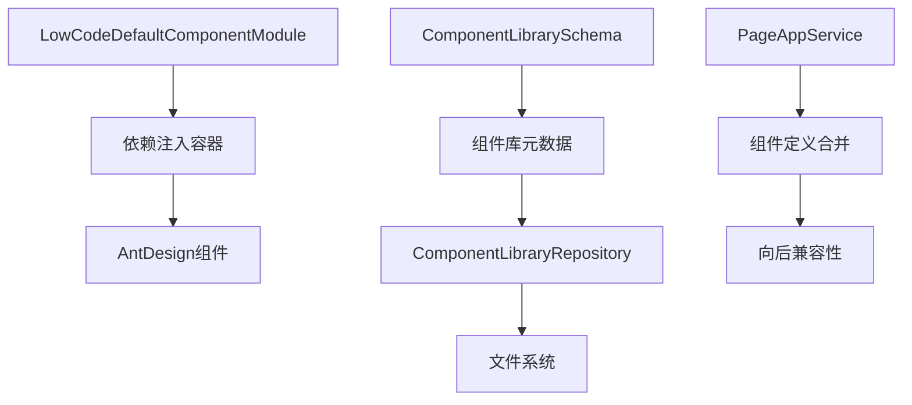
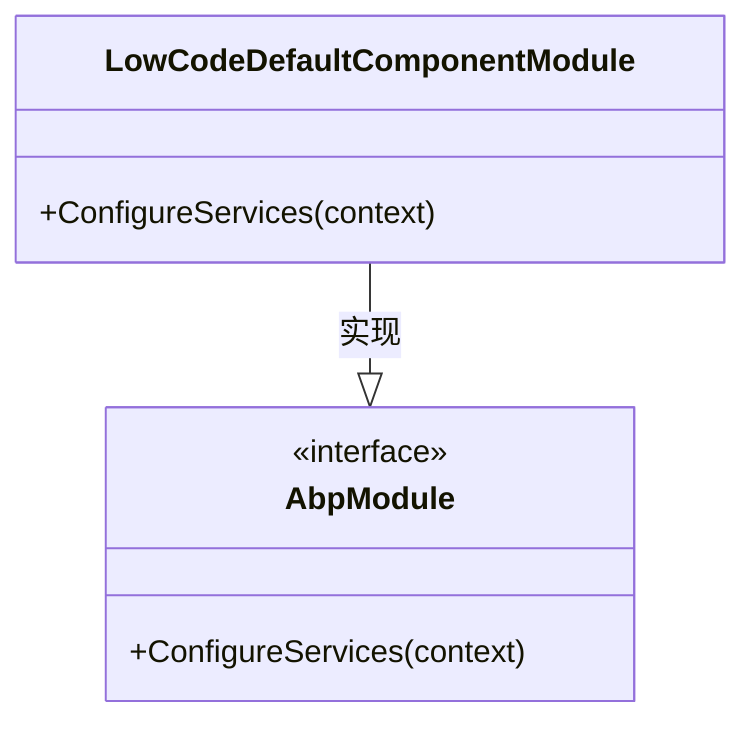
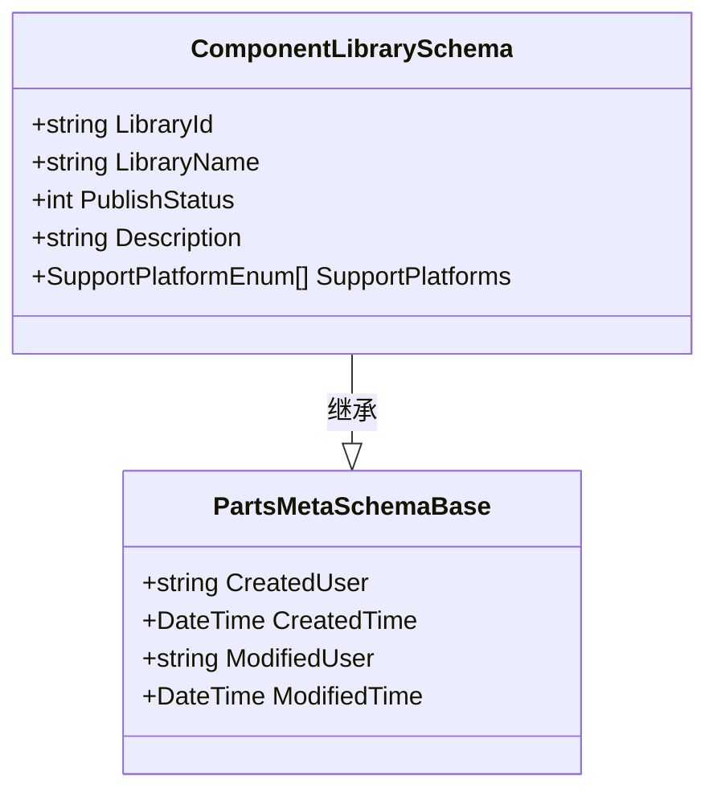
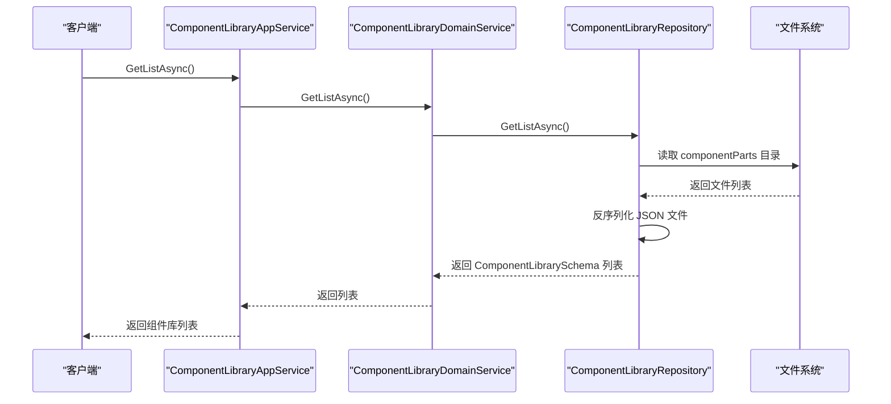
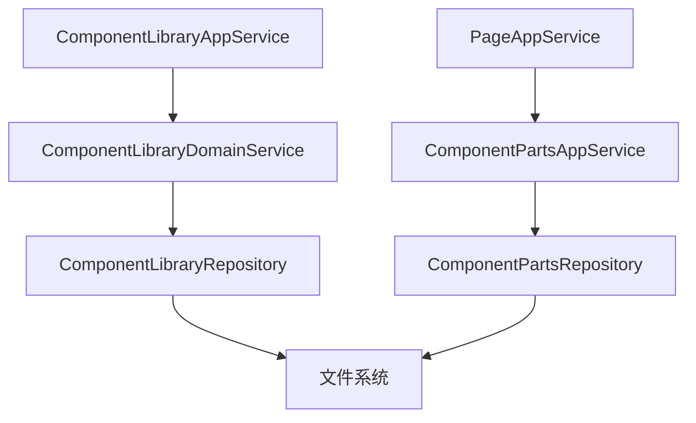

# 默认组件包管理

<cite>
**本文档中引用的文件**  
- [LowCodeDefaultComponentModule.cs](file://src/Common/H.LowCode.Components.Defaults/LowCodeDefaultComponentModule.cs)
- [ComponentLibrarySchema.cs](file://src/Common/H.LowCode.MetaSchema.DesignEngine/ComponentLibrarySchema.cs)
- [PartsMetaSchemaBase.cs](file://src/Common/H.LowCode.MetaSchema.DesignEngine/PartsMetaSchemaBase.cs)
- [ComponentLibraryRepository.cs](file://src/DesignEngine/H.LowCode.DesignEngine.Repository.JsonFile/PartsRepositories/ComponentLibraryRepository.cs)
- [ComponentPartsRepository.cs](file://src/DesignEngine/H.LowCode.DesignEngine.Repository.JsonFile/PartsRepositories/ComponentPartsRepository.cs)
- [PageAppService.cs](file://src/DesignEngine/H.LowCode.DesignEngine.Application/AppServices/PageAppService.cs)
- [antdesign.json](file://meta/parts/componentParts/antdesign/antdesign.json)
</cite>

## 目录
1. [简介](#简介)
2. [项目结构](#项目结构)
3. [核心组件](#核心组件)
4. [架构概览](#架构概览)
5. [详细组件分析](#详细组件分析)
6. [依赖关系分析](#依赖关系分析)
7. [性能考量](#性能考量)
8. [故障排除指南](#故障排除指南)
9. [结论](#结论)

## 简介
本文档深入解析低代码平台中默认组件包的加载机制与覆盖策略。重点分析 `LowCodeDefaultComponentModule` 的注册流程，说明其如何通过依赖注入向系统注入基础组件（如按钮、输入框等）。文档还解释了组件模块的优先级排序机制和冲突解决规则，并指导开发者如何安全地扩展或替换默认组件，同时保持向后兼容性。涵盖组件注册表（`ComponentLibrarySchema`）的初始化过程、动态加载机制以及热更新支持。最后提供最佳实践建议，包括命名空间管理、资源打包和按需加载优化。

## 项目结构
项目采用分层架构，主要分为元数据（meta）、源代码（src）和工具（Tools）三大目录。元数据目录存储了应用、页面、菜单和组件的JSON配置文件。源代码目录包含核心功能模块，如组件基础、默认组件、元数据模式、设计引擎和渲染引擎。工具目录则包含数据库迁移和元数据迁移工具。

**Diagram sources**
- [meta](file://meta)
- [src](file://src)
- [Tools](file://Tools)

**Section sources**
- [README.md](file://README.md)

## 核心组件
核心组件包括 `LowCodeDefaultComponentModule` 和 `ComponentLibrarySchema`。前者负责注册默认组件，后者定义了组件库的元数据结构。

**Section sources**
- [LowCodeDefaultComponentModule.cs](file://src/Common/H.LowCode.Components.Defaults/LowCodeDefaultComponentModule.cs)
- [ComponentLibrarySchema.cs](file://src/Common/H.LowCode.MetaSchema.DesignEngine/ComponentLibrarySchema.cs)

## 架构概览
系统采用模块化设计，通过依赖注入（DI）容器管理组件的生命周期。设计引擎和渲染引擎共享元数据模式，但各自独立运行。组件库通过JSON文件存储在文件系统中，支持动态加载和热更新。

**Diagram sources**
- [LowCodeDefaultComponentModule.cs](file://src/Common/H.LowCode.Components.Defaults/LowCodeDefaultComponentModule.cs)
- [ComponentLibrarySchema.cs](file://src/Common/H.LowCode.MetaSchema.DesignEngine/ComponentLibrarySchema.cs)
- [ComponentLibraryRepository.cs](file://src/DesignEngine/H.LowCode.DesignEngine.Repository.JsonFile/PartsRepositories/ComponentLibraryRepository.cs)
- [PageAppService.cs](file://src/DesignEngine/H.LowCode.DesignEngine.Application/AppServices/PageAppService.cs)

## 详细组件分析

### LowCodeDefaultComponentModule 分析
`LowCodeDefaultComponentModule` 是一个ABP模块，负责向DI容器注册AntDesign组件。其核心方法 `ConfigureServices` 调用 `AddAntDesign` 扩展方法来注入所有AntDesign UI组件。

**Diagram sources**
- [LowCodeDefaultComponentModule.cs](file://src/Common/H.LowCode.Components.Defaults/LowCodeDefaultComponentModule.cs#L0-L11)

**Section sources**
- [LowCodeDefaultComponentModule.cs](file://src/Common/H.LowCode.Components.Defaults/LowCodeDefaultComponentModule.cs#L0-L11)

### ComponentLibrarySchema 分析
`ComponentLibrarySchema` 类定义了组件库的元数据结构，继承自 `PartsMetaSchemaBase`，包含库ID、名称、描述、支持平台和修改时间等属性。

**Diagram sources**
- [ComponentLibrarySchema.cs](file://src/Common/H.LowCode.MetaSchema.DesignEngine/ComponentLibrarySchema.cs#L0-L35)
- [PartsMetaSchemaBase.cs](file://src/Common/H.LowCode.MetaSchema.DesignEngine/PartsMetaSchemaBase.cs#L0-L14)

**Section sources**
- [ComponentLibrarySchema.cs](file://src/Common/H.LowCode.MetaSchema.DesignEngine/ComponentLibrarySchema.cs#L0-L35)
- [PartsMetaSchemaBase.cs](file://src/Common/H.LowCode.MetaSchema.DesignEngine/PartsMetaSchemaBase.cs#L0-L14)

### 组件加载与热更新机制
组件库通过 `ComponentLibraryRepository` 从文件系统加载。`GetListAsync` 方法扫描 `componentParts` 目录下的所有子目录，读取每个目录下的 `*.json` 文件（如 `antdesign.json`），并反序列化为 `ComponentLibrarySchema` 对象。当组件库被修改时，`SaveAsync` 方法会更新 `ModifiedTime` 字段，从而实现热更新检测。

**Diagram sources**
- [ComponentLibraryRepository.cs](file://src/DesignEngine/H.LowCode.DesignEngine.Repository.JsonFile/PartsRepositories/ComponentLibraryRepository.cs#L0-L68)
- [ComponentLibraryDomainService.cs](file://src/DesignEngine/H.LowCode.DesignEngine.Domain/PartsDomainServices/ComponentLibraryDomainService.cs#L0-L40)
- [ComponentLibraryAppService.cs](file://src/DesignEngine/H.LowCode.DesignEngine.Application/PartsAppServices/ComponentLibraryAppService.cs#L0-L37)

**Section sources**
- [ComponentLibraryRepository.cs](file://src/DesignEngine/H.LowCode.DesignEngine.Repository.JsonFile/PartsRepositories/ComponentLibraryRepository.cs#L0-L68)

## 依赖关系分析
系统通过清晰的依赖层次管理组件。`ComponentLibraryAppService` 依赖 `ComponentLibraryDomainService`，后者又依赖 `ComponentLibraryRepository`。这种分层设计确保了业务逻辑与数据访问的分离。

**Diagram sources**
- [ComponentLibraryAppService.cs](file://src/DesignEngine/H.LowCode.DesignEngine.Application/PartsAppServices/ComponentLibraryAppService.cs#L0-L37)
- [ComponentLibraryDomainService.cs](file://src/DesignEngine/H.LowCode.DesignEngine.Domain/PartsDomainServices/ComponentLibraryDomainService.cs#L0-L40)
- [ComponentLibraryRepository.cs](file://src/DesignEngine/H.LowCode.DesignEngine.Repository.JsonFile/PartsRepositories/ComponentLibraryRepository.cs#L0-L38)

**Section sources**
- [ComponentLibraryAppService.cs](file://src/DesignEngine/H.LowCode.DesignEngine.Application/PartsAppServices/ComponentLibraryAppService.cs#L0-L37)

## 性能考量
组件的动态加载和按需加载是性能优化的关键。通过 `GetByIdAsync` 方法可以按需加载特定组件，避免一次性加载所有组件带来的性能开销。此外，`ComponentPartsRepository` 中的 `GetListAsync` 方法会对组件进行排序，确保组件在UI中按预期顺序显示。

## 故障排除指南
- **组件未加载**：检查 `antdesign.json` 文件是否存在且格式正确。
- **热更新失效**：确认 `ModifiedTime` 字段是否被正确更新。
- **依赖注入失败**：检查 `LowCodeDefaultComponentModule` 是否被正确引用。

**Section sources**
- [antdesign.json](file://meta/parts/componentParts/antdesign/antdesign.json)
- [LowCodeDefaultComponentModule.cs](file://src/Common/H.LowCode.Components.Defaults/LowCodeDefaultComponentModule.cs#L9)

## 结论
本文档详细解析了低代码平台中默认组件包的加载机制。通过 `LowCodeDefaultComponentModule` 注册AntDesign组件，利用 `ComponentLibrarySchema` 和 `ComponentLibraryRepository` 实现组件库的动态加载和热更新。开发者可以基于此机制安全地扩展或替换默认组件，同时通过组件定义合并机制确保向后兼容性。建议在开发中遵循命名空间管理和按需加载的最佳实践，以优化应用性能。