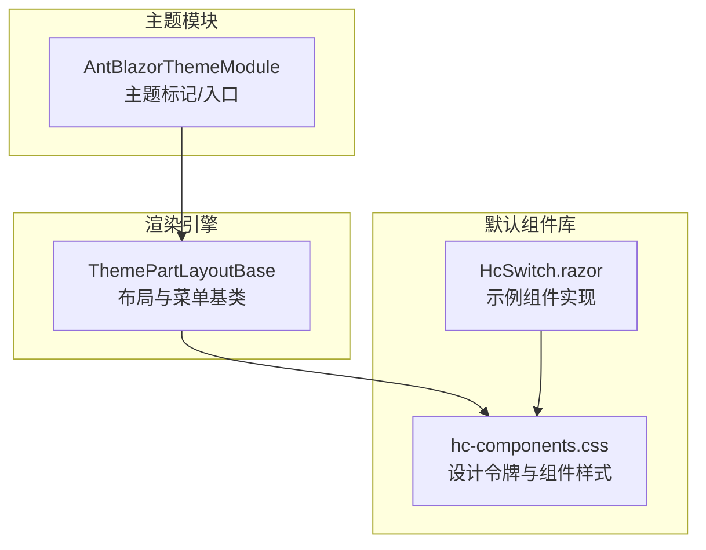
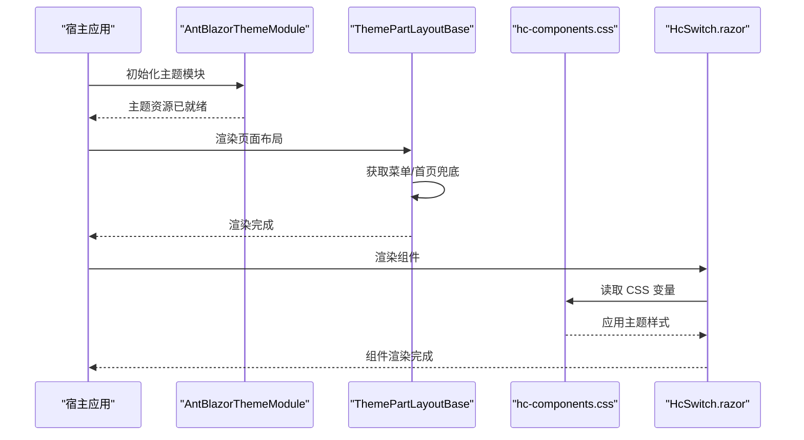
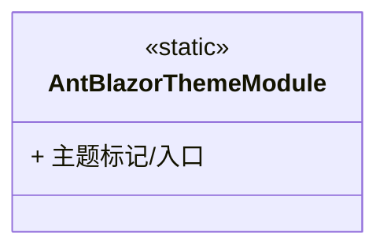
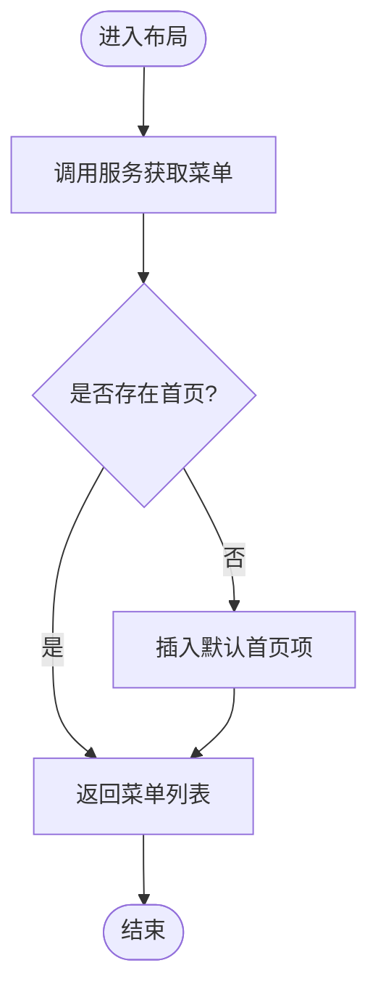
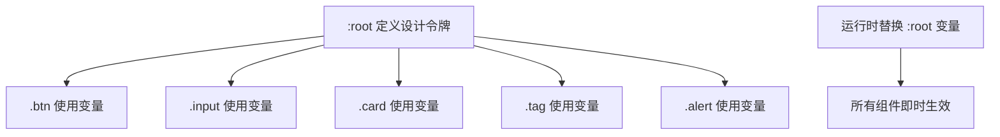
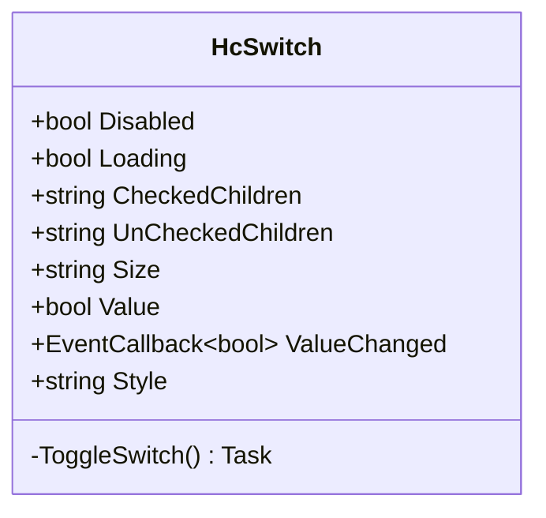
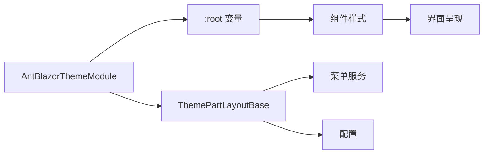

# 主题定制开发

<cite>
**本文引用的文件**   
- [AntBlazorThemeModule.cs](file://src/LowCode/RenderEngine/H.LowCode.RenderEngine/AntBlazorThemeModule.cs)
- [ThemePartLayoutBase.cs](file://src/LowCode/RenderEngine/H.LowCode.RenderEngineBase/Layout/ThemePartLayoutBase.cs)
- [hc-components.css](file://src/LowCode/Common/H.LowCode.Components/wwwroot/hc-components.css)
- [AppDrawer.css](file://src/Components/AppDrawer/H.AppDrawer.Components/wwwroot/css/AppDrawer.css)
- [designengine.css](file://src/LowCode/DesignEngine/H.LowCode.DesignEngine/wwwroot/designengine.css)
- [HcSwitch.razor](file://src/LowCode/Common/H.LowCode.Components/Components/HcSwitch.razor)
- [switch.json](file://src/LowCode/meta/parts/componentParts/antdesign/switch.json)
- [manifest.json](file://src/Host/RenderEngine/H.LowCode.RenderEngine.Host/wwwroot/manifest.json)
</cite>

## 目录
1. [简介](#简介)
2. [项目结构](#项目结构)
3. [核心组件](#核心组件)
4. [架构总览](#架构总览)
5. [详细组件分析](#详细组件分析)
6. [依赖关系分析](#依赖关系分析)
7. [性能考量](#性能考量)
8. [故障排查指南](#故障排查指南)
9. [结论](#结论)
10. [附录](#附录)

## 简介
本文件面向在 AppLab 平台上进行 AntBlazor 主题定制与扩展的开发者，系统阐述主题系统的架构与设计原理、样式组织方式、CSS 变量使用规范、主题切换机制、自定义主题创建流程（颜色方案、字体设置、组件样式覆盖）、响应式与移动端适配方法，以及主题的打包与分发策略。文档以仓库中实际代码为依据，提供可追溯的文件来源与图示说明，帮助读者快速上手并高效完成高质量的主题开发。

## 项目结构
围绕主题相关能力，本项目采用“基础渲染基类 + 默认组件库样式 + 具体主题模块”的分层组织：
- 渲染引擎基类负责页面布局与菜单等通用逻辑，为不同主题提供统一的布局基座。
- 默认组件库样式集中定义设计令牌（CSS 变量）与通用组件样式，确保跨组件一致的视觉语言。
- 主题模块作为可插拔实现，承载特定主题的配置与样式注入点。

图表来源 
- [ThemePartLayoutBase.cs:1-44](file://src/LowCode/RenderEngine/H.LowCode.RenderEngineBase/Layout/ThemePartLayoutBase.cs#L1-L44)
- [hc-components.css:1-338](file://src/LowCode/Common/H.LowCode.Components/wwwroot/hc-components.css#L1-L338)
- [HcSwitch.razor:1-50](file://src/LowCode/Common/H.LowCode.Components/Components/HcSwitch.razor#L1-L50)
- [AntBlazorThemeModule.cs:1-9](file://src/LowCode/RenderEngine/H.LowCode.RenderEngine/AntBlazorThemeModule.cs#L1-L9)

章节来源
- [ThemePartLayoutBase.cs:1-44](file://src/LowCode/RenderEngine/H.LowCode.RenderEngineBase/Layout/ThemePartLayoutBase.cs#L1-L44)
- [hc-components.css:1-338](file://src/LowCode/Common/H.LowCode.Components/wwwroot/hc-components.css#L1-L338)
- [HcSwitch.razor:1-50](file://src/LowCode/Common/H.LowCode.Components/Components/HcSwitch.razor#L1-L50)
- [AntBlazorThemeModule.cs:1-9](file://src/LowCode/RenderEngine/H.LowCode.RenderEngine/AntBlazorThemeModule.cs#L1-L9)

## 核心组件
- 主题模块标记类：用于标识与注册 AntBlazor 主题模块，便于在应用启动时按主题加载对应资源。
- 布局基类：提供菜单获取、首页兜底、导航等通用能力，是各主题布局的统一基座。
- 默认组件样式：通过 CSS 变量集中管理颜色、边框、圆角、文本色等设计令牌，统一组件外观。
- 示例组件：以开关组件为例，展示如何在组件中使用样式类并结合 CSS 变量实现主题化。

章节来源
- [AntBlazorThemeModule.cs:1-9](file://src/LowCode/RenderEngine/H.LowCode.RenderEngine/AntBlazorThemeModule.cs#L1-L9)
- [ThemePartLayoutBase.cs:1-44](file://src/LowCode/RenderEngine/H.LowCode.RenderEngineBase/Layout/ThemePartLayoutBase.cs#L1-L44)
- [hc-components.css:1-338](file://src/LowCode/Common/H.LowCode.Components/wwwroot/hc-components.css#L1-L338)
- [HcSwitch.razor:1-50](file://src/LowCode/Common/H.LowCode.Components/Components/HcSwitch.razor#L1-L50)

## 架构总览
下图展示了主题系统在运行时的关键交互：布局基类负责页面结构与菜单数据；组件样式通过 CSS 变量驱动主题表现；主题模块作为入口参与装配与资源加载。

图表来源 
- [AntBlazorThemeModule.cs:1-9](file://src/LowCode/RenderEngine/H.LowCode.RenderEngine/AntBlazorThemeModule.cs#L1-L9)
- [ThemePartLayoutBase.cs:1-44](file://src/LowCode/RenderEngine/H.LowCode.RenderEngineBase/Layout/ThemePartLayoutBase.cs#L1-L44)
- [hc-components.css:1-338](file://src/LowCode/Common/H.LowCode.Components/wwwroot/hc-components.css#L1-L338)
- [HcSwitch.razor:1-50](file://src/LowCode/Common/H.LowCode.Components/Components/HcSwitch.razor#L1-L50)

## 详细组件分析

### 主题模块（AntBlazorThemeModule）
- 作用：作为 AntBlazor 主题的标记与入口，便于在应用生命周期中进行主题识别与资源装配。
- 建议扩展点：可在该模块中引入主题样式表、配置全局 CSS 变量或注册主题服务。

图表来源 
- [AntBlazorThemeModule.cs:1-9](file://src/LowCode/RenderEngine/H.LowCode.RenderEngine/AntBlazorThemeModule.cs#L1-L9)

章节来源
- [AntBlazorThemeModule.cs:1-9](file://src/LowCode/RenderEngine/H.LowCode.RenderEngine/AntBlazorThemeModule.cs#L1-L9)

### 布局基类（ThemePartLayoutBase）
- 职责：封装菜单获取、首页兜底插入、导航管理等通用逻辑，为不同主题提供一致的结构基础。
- 关键点：
  - 通过服务接口获取菜单数据，并在缺失首页时自动插入默认项。
  - 注入导航与配置，支持后续扩展（如根据配置切换主题）。

图表来源 
- [ThemePartLayoutBase.cs:21-42](file://src/LowCode/RenderEngine/H.LowCode.RenderEngineBase/Layout/ThemePartLayoutBase.cs#L21-L42)

章节来源
- [ThemePartLayoutBase.cs:1-44](file://src/LowCode/RenderEngine/H.LowCode.RenderEngineBase/Layout/ThemePartLayoutBase.cs#L1-L44)

### 默认组件样式（hc-components.css）
- 设计令牌：通过 :root 下的 CSS 变量集中定义主色、边框、圆角、文本色、背景色、状态色等，形成统一的设计语言。
- 组件样式：按钮、输入框、选择器、卡片、标签、提示条、分割线、描述列表等均以这些变量为基础，保证一致性。
- 主题切换：通过替换根级 CSS 变量值即可实现全局主题切换，无需修改组件样式。

图表来源 
- [hc-components.css:7-20](file://src/LowCode/Common/H.LowCode.Components/wwwroot/hc-components.css#L7-L20)

章节来源
- [hc-components.css:1-338](file://src/LowCode/Common/H.LowCode.Components/wwwroot/hc-components.css#L1-L338)

### 示例组件（HcSwitch.razor）
- 行为：支持禁用、加载状态、大小尺寸、选中态切换，并通过样式类与 CSS 变量控制外观。
- 主题化：组件样式类与 hc-components.css 中的变量配合，实现一键换肤。

图表来源 
- [HcSwitch.razor:1-50](file://src/LowCode/Common/H.LowCode.Components/Components/HcSwitch.razor#L1-L50)

章节来源
- [HcSwitch.razor:1-50](file://src/LowCode/Common/H.LowCode.Components/Components/HcSwitch.razor#L1-L50)

### 低代码元数据（switch.json）
- 作用：声明开关组件的属性定义组、默认值、显示名称与类型，供设计器与渲染器使用。
- 主题关联：属性中包含样式相关字段（如 Size），结合组件样式可实现主题化效果。

章节来源
- [switch.json:1-1](file://src/LowCode/meta/parts/componentParts/antdesign/switch.json#L1-L1)

### 抽屉样式（AppDrawer.css）
- 用途：为应用抽屉提供遮罩、滑入动画、滚动条美化与响应式宽度调整。
- 主题化建议：可将颜色、阴影、圆角等抽取为 CSS 变量，以便与全局主题保持一致。

章节来源
- [AppDrawer.css:1-233](file://src/Components/AppDrawer/H.AppDrawer.Components/wwwroot/css/AppDrawer.css#L1-L233)

### 设计器样式（designengine.css）
- 用途：为设计器属性面板、输入控件、开关等提供样式，强调易用性与一致性。
- 主题化建议：将焦点色、边框色、占位符色等抽象为变量，便于与主题联动。

章节来源
- [designengine.css:412-470](file://src/LowCode/DesignEngine/H.LowCode.DesignEngine/wwwroot/designengine.css#L412-L470)

### PWA 主题色（manifest.json）
- 用途：定义应用的名称、启动页、主题色与图标，影响移动端浏览器与应用壳的外观。
- 主题化建议：与前端主题色保持一致，提升整体品牌一致性。

章节来源
- [manifest.json:1-15](file://src/Host/RenderEngine/H.LowCode.RenderEngine.Host/wwwroot/manifest.json#L1-L15)

## 依赖关系分析
- 组件样式依赖 CSS 变量：所有组件样式均从 :root 变量读取，降低耦合度，提高可维护性。
- 布局基类依赖服务与配置：菜单与导航由外部服务与配置注入，便于扩展与替换。
- 主题模块作为装配点：主题模块可与样式资源、配置或服务集成，形成完整主题体系。

图表来源 
- [hc-components.css:7-20](file://src/LowCode/Common/H.LowCode.Components/wwwroot/hc-components.css#L7-L20)
- [ThemePartLayoutBase.cs:1-44](file://src/LowCode/RenderEngine/H.LowCode.RenderEngineBase/Layout/ThemePartLayoutBase.cs#L1-L44)
- [AntBlazorThemeModule.cs:1-9](file://src/LowCode/RenderEngine/H.LowCode.RenderEngine/AntBlazorThemeModule.cs#L1-L9)

章节来源
- [hc-components.css:1-338](file://src/LowCode/Common/H.LowCode.Components/wwwroot/hc-components.css#L1-L338)
- [ThemePartLayoutBase.cs:1-44](file://src/LowCode/RenderEngine/H.LowCode.RenderEngineBase/Layout/ThemePartLayoutBase.cs#L1-L44)
- [AntBlazorThemeModule.cs:1-9](file://src/LowCode/RenderEngine/H.LowCode.RenderEngine/AntBlazorThemeModule.cs#L1-L9)

## 性能考量
- 优先使用 CSS 变量：避免重复计算与大量条件样式，减少重绘与回流。
- 最小化样式覆盖：尽量通过变量与类名组合实现主题差异，避免深度选择器与 !important。
- 按需加载主题资源：在主题模块中延迟加载样式，减少首屏体积。
- 合并与压缩：构建阶段对样式进行合并与压缩，移除未使用的规则。
- 动画与过渡：合理使用 transition 与 transform，避免触发昂贵布局。

## 故障排查指南
- 主题未生效
  - 检查 :root 变量是否被正确注入与覆盖。
  - 确认主题样式是否在应用启动后被加载。
- 组件样式异常
  - 检查组件类名是否正确，是否与样式文件匹配。
  - 查看浏览器开发者工具中的样式优先级与冲突。
- 菜单或布局问题
  - 检查布局基类的服务注入与配置项是否正确。
  - 确认菜单数据源是否返回有效数据。

## 结论
通过“布局基类 + 默认组件样式 + 主题模块”的分层架构，AppLab 平台实现了高内聚、低耦合的主题系统。基于 CSS 变量的设计令牌体系使得主题切换简单可靠，组件样式与业务逻辑解耦，便于扩展与维护。遵循本文的最佳实践与优化建议，开发者可以快速构建高质量、可复用的主题方案，满足多品牌、多场景的定制化需求。

## 附录

### 创建自定义主题的步骤
- 定义设计令牌
  - 在主题样式文件中重写 :root 下的 CSS 变量，覆盖颜色、边框、圆角、文本色等。
- 覆盖组件样式
  - 针对需要特殊处理的组件，新增样式类或使用更具体的选择器，尽量避免破坏变量体系。
- 集成到主题模块
  - 在主题模块中引入样式资源，必要时注册主题服务或配置项。
- 验证与测试
  - 在不同设备与分辨率下验证主题表现，确保响应式与可访问性。

### 响应式设计与移动端适配
- 使用媒体查询：针对不同断点调整布局与字号，确保可读性与可用性。
- 触摸友好：增大点击区域，优化滑动体验，避免复杂手势。
- 性能优化：减少大图与复杂动画，优先使用轻量级资源。
- PWA 支持：通过 manifest 与 service worker 提升离线与安装体验。

### 主题打包与分发
- 打包策略
  - 将主题样式与资源独立打包，生成可复用的主题包。
  - 构建时启用压缩与去重，减小体积。
- 分发方式
  - 通过 NuGet 包或静态资源 CDN 发布主题包。
  - 在宿主应用中按需加载主题包，支持热更新与版本管理。