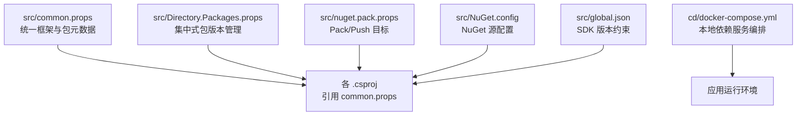
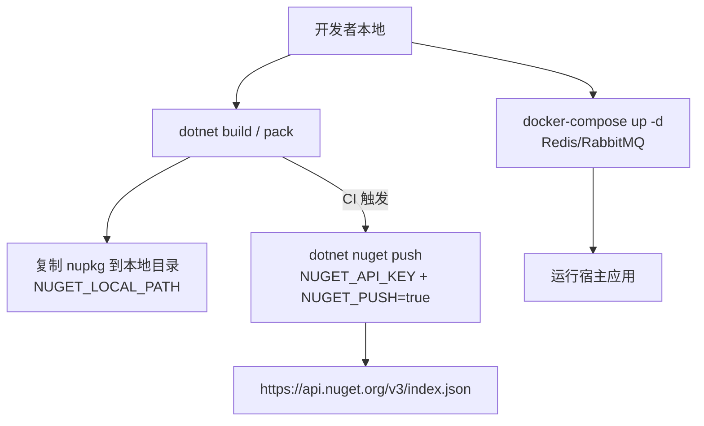
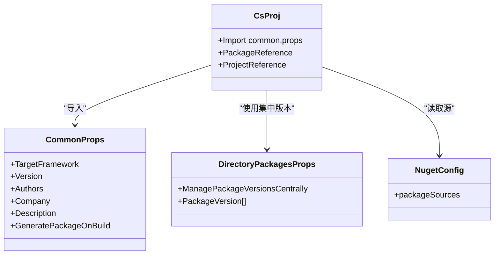
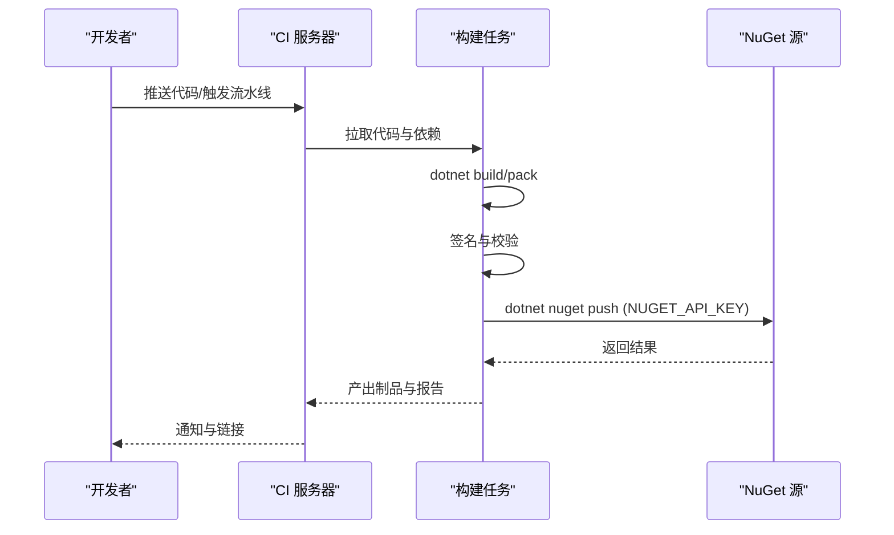
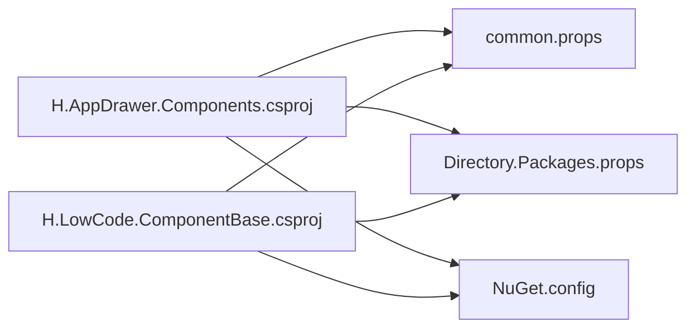

# 扩展包打包发布

<cite>
**本文引用的文件**   
- [src/common.props](file://src/common.props)
- [src/Directory.Packages.props](file://src/Directory.Packages.props)
- [src/nuget.pack.props](file://src/nuget.pack.props)
- [src/NuGet.config](file://src/NuGet.config)
- [src/global.json](file://src/global.json)
- [src/Components/AppDrawer/H.AppDrawer.Components/H.AppDrawer.Components.csproj](file://src/Components/AppDrawer/H.AppDrawer.Components/H.AppDrawer.Components.csproj)
- [src/LowCode/Common/H.LowCode.ComponentBase/H.LowCode.ComponentBase.csproj](file://src/LowCode/Common/H.LowCode.ComponentBase/H.LowCode.ComponentBase.csproj)
- [cd/docker-compose.yml](file://cd/docker-compose.yml)
- [README.md](file://README.md)
</cite>

## 目录
1. [简介](#简介)
2. [项目结构](#项目结构)
3. [核心组件](#核心组件)
4. [架构总览](#架构总览)
5. [详细组件分析](#详细组件分析)
6. [依赖分析](#依赖分析)
7. [性能考虑](#性能考虑)
8. [故障排查指南](#故障排查指南)
9. [结论](#结论)
10. [附录](#附录)

## 简介
本文件面向 AppLab 平台的扩展包（NuGet 包与 Docker 镜像）的打包、签名、发布与 CI/CD 集成，提供从项目配置到自动化流水线的全流程说明。内容涵盖：
- NuGet 包的创建与配置（项目文件、集中式版本管理、版本控制策略）
- Docker 镜像构建与发布流程
- 包签名与安全验证机制
- 自动化发布与 CI/CD 集成方法
- 文档生成与示例代码管理
- 包的更新与回滚策略

## 项目结构
仓库采用 .NET 模块化架构，扩展包主要位于 src 下的各库项目中；打包相关配置集中在根级 props 文件与 NuGet 配置中；容器化编排由 cd/docker-compose.yml 提供。

图表来源 
- [src/common.props:1-15](file://src/common.props#L1-L15)
- [src/Directory.Packages.props:1-99](file://src/Directory.Packages.props#L1-L99)
- [src/nuget.pack.props:1-22](file://src/nuget.pack.props#L1-L22)
- [src/NuGet.config:1-7](file://src/NuGet.config#L1-L7)
- [src/global.json:1-7](file://src/global.json#L1-L7)
- [cd/docker-compose.yml:1-32](file://cd/docker-compose.yml#L1-L32)

章节来源
- [README.md:1-74](file://README.md#L1-L74)

## 核心组件
- 统一构建属性与包元数据：common.props 定义目标框架、语言特性、可空上下文、版本号、作者、公司、描述、资源语言等，并控制是否自动打包。
- 集中式包版本管理：Directory.Packages.props 统一管理第三方与内部依赖的版本，确保跨项目一致性与可追溯性。
- 打包与推送目标：nuget.pack.props 启用 Pack 并在开发或 CI 环境下执行复制包或推送到 NuGet 源。
- NuGet 源配置：NuGet.config 指定官方源地址。
- SDK 版本约束：global.json 锁定 .NET SDK 版本，保证构建一致性。
- 示例项目引用：H.AppDrawer.Components.csproj 与 H.LowCode.ComponentBase.csproj 展示了如何引入 common.props 并声明依赖。

章节来源
- [src/common.props:1-15](file://src/common.props#L1-L15)
- [src/Directory.Packages.props:1-99](file://src/Directory.Packages.props#L1-L99)
- [src/nuget.pack.props:1-22](file://src/nuget.pack.props#L1-L22)
- [src/NuGet.config:1-7](file://src/NuGet.config#L1-L7)
- [src/global.json:1-7](file://src/global.json#L1-L7)
- [src/Components/AppDrawer/H.AppDrawer.Components/H.AppDrawer.Components.csproj:1-12](file://src/Components/AppDrawer/H.AppDrawer.Components/H.AppDrawer.Components.csproj#L1-L12)
- [src/LowCode/Common/H.LowCode.ComponentBase/H.LowCode.ComponentBase.csproj:1-17](file://src/LowCode/Common/H.LowCode.ComponentBase/H.LowCode.ComponentBase.csproj#L1-L17)

## 架构总览
下图展示扩展包从源码到制品的完整路径，包括本地开发与 CI 两条分支。

图表来源 
- [src/nuget.pack.props:1-22](file://src/nuget.pack.props#L1-L22)
- [src/NuGet.config:1-7](file://src/NuGet.config#L1-L7)
- [cd/docker-compose.yml:1-32](file://cd/docker-compose.yml#L1-L32)

## 详细组件分析

### NuGet 包创建与配置
- 统一属性与版本：在 common.props 中设置 Version、Authors、Company、Description、TargetFramework、LangVersion、Nullable、GeneratePackageOnBuild 等。
- 集中式依赖：在 Directory.Packages.props 中声明所有 PackageVersion，项目通过 <PackageReference Include="..." /> 引用，无需重复写版本号。
- 打包开关：common.props 默认关闭自动生成包，可通过 nuget.pack.props 覆盖为 true，或在命令行传入参数控制。
- 示例 csproj：H.AppDrawer.Components.csproj 与 H.LowCode.ComponentBase.csproj 演示了如何引入 common.props 并声明依赖项。

图表来源 
- [src/common.props:1-15](file://src/common.props#L1-L15)
- [src/Directory.Packages.props:1-99](file://src/Directory.Packages.props#L1-L99)
- [src/NuGet.config:1-7](file://src/NuGet.config#L1-L7)
- [src/Components/AppDrawer/H.AppDrawer.Components/H.AppDrawer.Components.csproj:1-12](file://src/Components/AppDrawer/H.AppDrawer.Components/H.AppDrawer.Components.csproj#L1-L12)
- [src/LowCode/Common/H.LowCode.ComponentBase/H.LowCode.ComponentBase.csproj:1-17](file://src/LowCode/Common/H.LowCode.ComponentBase/H.LowCode.ComponentBase.csproj#L1-L17)

章节来源
- [src/common.props:1-15](file://src/common.props#L1-L15)
- [src/Directory.Packages.props:1-99](file://src/Directory.Packages.props#L1-L99)
- [src/NuGet.config:1-7](file://src/NuGet.config#L1-L7)
- [src/Components/AppDrawer/H.AppDrawer.Components/H.AppDrawer.Components.csproj:1-12](file://src/Components/AppDrawer/H.AppDrawer.Components/H.AppDrawer.Components.csproj#L1-L12)
- [src/LowCode/Common/H.LowCode.ComponentBase/H.LowCode.ComponentBase.csproj:1-17](file://src/LowCode/Common/H.LowCode.ComponentBase/H.LowCode.ComponentBase.csproj#L1-L17)

### 依赖管理与版本控制
- 集中式版本管理：Directory.Packages.props 中的 ManagePackageVersionsCentrally 开启后，所有项目的包版本必须在此维护，避免版本漂移。
- 版本策略建议：
  - 主版本：破坏性变更时递增
  - 次版本：新增功能且向后兼容
  - 修订号：缺陷修复与小改动
  - 预发布：使用后缀标识预览版（如 preview、rc）
- 依赖最小化：仅引入运行时所需包，减少包体积与攻击面。

章节来源
- [src/Directory.Packages.props:1-99](file://src/Directory.Packages.props#L1-L99)

### 包签名与安全验证
- 签名方式：建议使用强名称签名或 Authenticode 签名，结合可信证书进行签名。
- 安全校验：
  - 在 CI 中强制签名与校验，未签名或校验失败则阻断发布
  - 使用 NuGet 源的安全策略（如要求签名、白名单）
  - 对关键依赖进行 SBOM 与漏洞扫描
- 密钥管理：将签名证书与 API Key 放入 CI/CD 的机密存储，禁止明文提交。

[本节为通用安全实践说明，不直接分析具体文件]

### Docker 镜像构建与发布
- 当前仓库提供了 docker-compose.yml 用于启动 Redis 与 RabbitMQ 等依赖服务，便于本地开发与测试。
- 镜像构建建议：
  - 使用多阶段构建，分离构建与运行环境
  - 基于精简基础镜像（如 alpine），减少镜像体积
  - 将敏感配置通过环境变量注入，避免硬编码
- 发布流程：
  - 构建镜像并打标签（含版本号与 Git 提交哈希）
  - 推送至企业镜像仓库或公共仓库
  - 在部署环境中拉取指定标签镜像并滚动更新

章节来源
- [cd/docker-compose.yml:1-32](file://cd/docker-compose.yml#L1-L32)

### 包发布的自动化流程与 CI/CD 集成
- 本地开发：
  - 设置环境变量 NUGET_LOCAL_PATH，构建后将 nupkg 复制到指定目录
- CI 环境：
  - 设置环境变量 NUGET_PUSH=true 与 NUGET_API_KEY
  - 构建成功后自动调用 dotnet nuget push 推送到官方源
- 推荐流水线步骤：
  - 检出代码与缓存依赖
  - 恢复 SDK 与工具链
  - 编译与单元测试
  - 生成包与制品归档
  - 签名与校验
  - 推送 NuGet 包与镜像
  - 生成文档与示例包

图表来源 
- [src/nuget.pack.props:1-22](file://src/nuget.pack.props#L1-L22)
- [src/NuGet.config:1-7](file://src/NuGet.config#L1-L7)

章节来源
- [src/nuget.pack.props:1-22](file://src/nuget.pack.props#L1-L22)
- [src/NuGet.config:1-7](file://src/NuGet.config#L1-L7)

### 包的文档生成与示例代码管理
- 文档生成：
  - 使用内置 XML 注释与第三方工具（如 DocFX、Sandcastle）生成 API 文档
  - 在 CI 中自动生成并归档文档站点
- 示例代码：
  - 提供独立示例项目，演示如何引用与配置扩展包
  - 示例项目应包含最小依赖与清晰 README，便于快速上手
- 版本绑定：
  - 示例项目固定依赖包版本，确保与发布包一致

[本节为通用实践说明，不直接分析具体文件]

### 包的更新与回滚策略
- 更新策略：
  - 语义化版本控制，明确主/次/修订号含义
  - 发布前进行兼容性测试与回归测试
  - 记录变更日志（Changelog）与迁移指南
- 回滚策略：
  - 在 NuGet 源上标记旧版本为“不可用”（Yank）
  - 提供降级脚本与回滚清单
  - 在 CI 中保留历史制品以便快速恢复

[本节为通用策略说明，不直接分析具体文件]

## 依赖分析
- 耦合关系：
  - 各 .csproj 通过 Import common.props 共享构建属性
  - 通过 Directory.Packages.props 集中管理依赖版本
  - 通过 NuGet.config 指定源地址
- 潜在风险：
  - 版本不一致导致解析冲突
  - 未签名的包被拒绝安装
  - 依赖漏洞未及时修复

图表来源 
- [src/Components/AppDrawer/H.AppDrawer.Components/H.AppDrawer.Components.csproj:1-12](file://src/Components/AppDrawer/H.AppDrawer.Components/H.AppDrawer.Components.csproj#L1-L12)
- [src/LowCode/Common/H.LowCode.ComponentBase/H.LowCode.ComponentBase.csproj:1-17](file://src/LowCode/Common/H.LowCode.ComponentBase/H.LowCode.ComponentBase.csproj#L1-L17)
- [src/common.props:1-15](file://src/common.props#L1-L15)
- [src/Directory.Packages.props:1-99](file://src/Directory.Packages.props#L1-L99)
- [src/NuGet.config:1-7](file://src/NuGet.config#L1-L7)

章节来源
- [src/Components/AppDrawer/H.AppDrawer.Components/H.AppDrawer.Components.csproj:1-12](file://src/Components/AppDrawer/H.AppDrawer.Components/H.AppDrawer.Components.csproj#L1-L12)
- [src/LowCode/Common/H.LowCode.ComponentBase/H.LowCode.ComponentBase.csproj:1-17](file://src/LowCode/Common/H.LowCode.ComponentBase/H.LowCode.ComponentBase.csproj#L1-L17)
- [src/common.props:1-15](file://src/common.props#L1-L15)
- [src/Directory.Packages.props:1-99](file://src/Directory.Packages.props#L1-L99)
- [src/NuGet.config:1-7](file://src/NuGet.config#L1-L7)

## 性能考虑
- 包体积优化：
  - 移除不必要的依赖与调试信息
  - 使用裁剪与 AOT（适用于 Blazor WebAssembly）
- 构建性能：
  - 启用并行构建与增量构建
  - 缓存依赖与中间产物
- 运行性能：
  - 按需加载程序集（WASM 懒加载）
  - 减少反射与动态解析开销

[本节为通用性能建议，不直接分析具体文件]

## 故障排查指南
- 常见问题：
  - 版本冲突：检查 Directory.Packages.props 与项目引用的一致性
  - 推送失败：确认 NUGET_API_KEY 与网络可达性
  - 签名失败：检查证书有效期与权限
- 定位方法：
  - 查看构建日志与错误输出
  - 使用 dotnet nuget locals 清理缓存
  - 在本地复现 CI 环境变量与命令

章节来源
- [src/nuget.pack.props:1-22](file://src/nuget.pack.props#L1-L22)
- [src/NuGet.config:1-7](file://src/NuGet.config#L1-L7)

## 结论
通过统一的构建属性、集中式版本管理与自动化打包推送，AppLab 平台能够高效地生产与分发扩展包。结合签名、安全校验与 CI/CD 流水线，可保障包的质量与安全性。配合文档与示例代码，降低使用者门槛，提升生态活跃度。

[本节为总结性内容，不直接分析具体文件]

## 附录
- 常用命令参考：
  - 构建与打包：dotnet build / dotnet pack
  - 本地复制包：设置 NUGET_LOCAL_PATH
  - 推送到 NuGet：设置 NUGET_PUSH=true 与 NUGET_API_KEY
- 依赖服务启动：
  - 使用 cd/docker-compose.yml 启动 Redis 与 RabbitMQ

章节来源
- [src/nuget.pack.props:1-22](file://src/nuget.pack.props#L1-L22)
- [cd/docker-compose.yml:1-32](file://cd/docker-compose.yml#L1-L32)