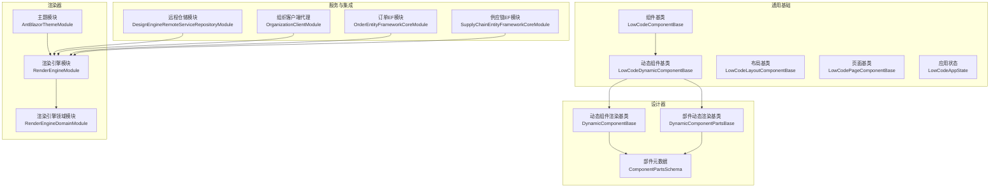
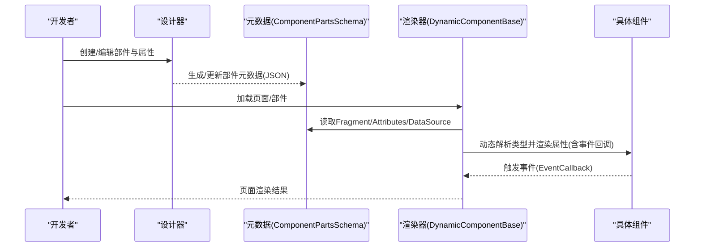
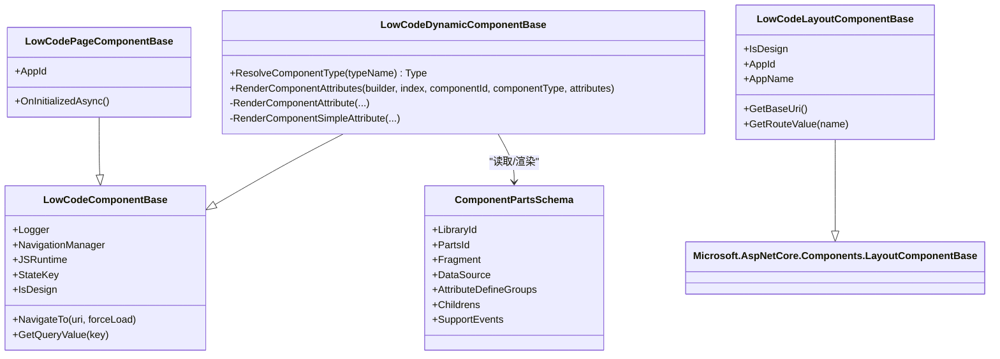
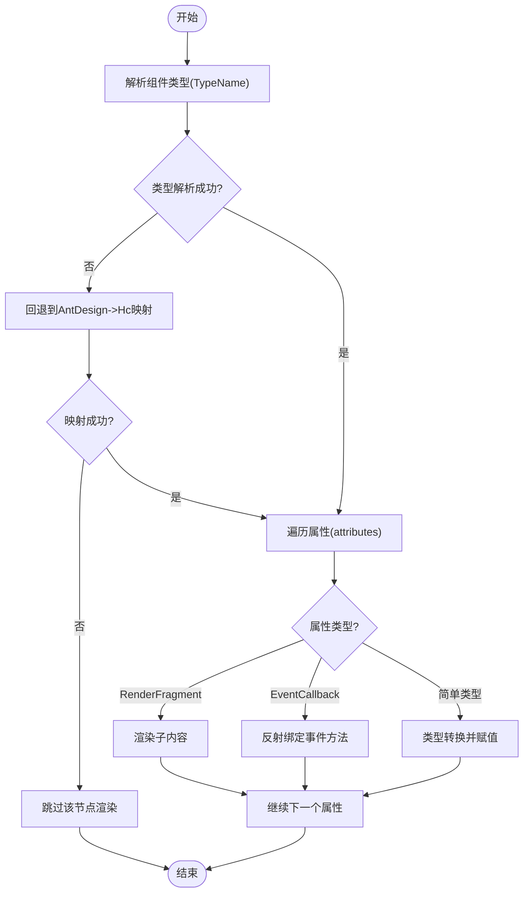
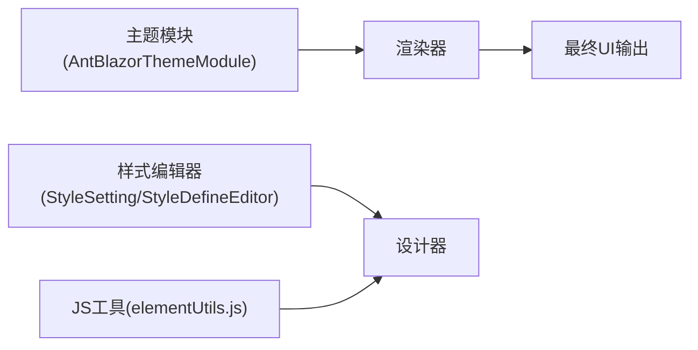
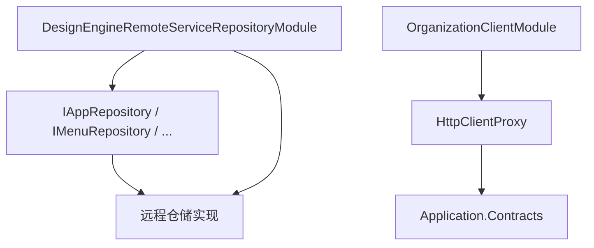
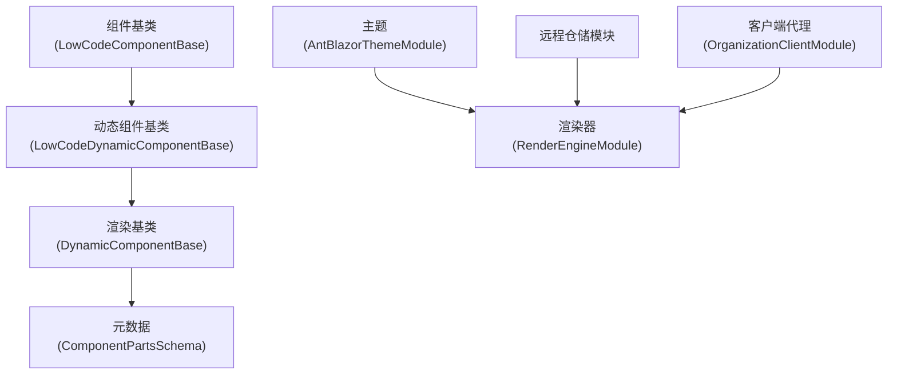

# 扩展开发

<cite>
**本文引用的文件**   
- [LowCodeComponentBase.cs](file://src/LowCode/Common/H.LowCode.ComponentBase/LowCodeComponentBase.cs)
- [LowCodeDynamicComponentBase.cs](file://src/LowCode/Common/H.LowCode.ComponentBase/LowCodeDynamicComponentBase.cs)
- [LowCodeLayoutComponentBase.cs](file://src/LowCode/Common/H.LowCode.ComponentBase/LowCodeLayoutComponentBase.cs)
- [LowCodePageComponentBase.cs](file://src/LowCode/Common/H.LowCode.ComponentBase/LowCodePageComponentBase.cs)
- [LowCodeAppState.cs](file://src/LowCode/Common/H.LowCode.ComponentBase/LowCodeAppState.cs)
- [DynamicComponentBase.cs](file://src/LowCode/DesignEngine/H.LowCode.DesignEngine.Services/DynamicComponentBase.cs)
- [DynamicComponentPartsBase.cs](file://src/LowCode/DesignEngine/H.LowCode.PartsDesignEngine.Services/DynamicComponentPartsBase.cs)
- [ComponentPartsSchema.cs](file://src/LowCode/Common/H.LowCode.MetaSchema.DesignEngine/ComponentPartsSchema.cs)
- [page_survey_editor.json](file://src/LowCode/meta/apps/survey/page/page_survey_editor.json)
- [AntBlazorThemeModule.cs](file://src/LowCode/RenderEngine/H.LowCode.Themes.AntBlazor/AntBlazorThemeModule.cs)
- [RenderEngineModule.cs](file://src/LowCode/RenderEngine/H.LowCode.RenderEngine/RenderEngineModule.cs)
- [RenderEngineDomainModule.cs](file://src/LowCode/RenderEngine/H.LowCode.RenderEngine.Domain/RenderEngineDomainModule.cs)
- [DesignEngineRemoteServiceRepositoryModule.cs](file://src/LowCode/DesignEngine/H.LowCode.DesignEngine.Repository.RemoteService/DesignEngineRemoteServiceRepositoryModule.cs)
- [OrganizationClientModule.cs](file://src/Services/Organization/H.Organization.Client/OrganizationClientModule.cs)
- [OrderEntityFrameworkCoreModule.cs](file://src/Services/Order/H.Order.EntityFrameworkCore/OrderEntityFrameworkCoreModule.cs)
- [SupplyChainEntityFrameworkCoreModule.cs](file://src/Services/SupplyChain/H.SupplyChain.EntityFrameworkCore/SupplyChainEntityFrameworkCoreModule.cs)
- [elementUtils.js](file://src/LowCode/DesignEngine/H.LowCode.DesignEngineBase/wwwroot/js/elementUtils.js)
- [StyleSetting.razor](file://src/LowCode/DesignEngine/H.LowCode.PartsDesignEngine/SettingPanel/StyleSetting.razor)
- [StyleDefineEditor.razor](file://src/LowCode/DesignEngine/H.LowCode.PartsDesignEngine/Pages/ComponentParts/Components/StyleDefineEditor.razor)
</cite>

## 目录
1. [简介](#简介)
2. [项目结构](#项目结构)
3. [核心组件](#核心组件)
4. [架构总览](#架构总览)
5. [详细组件分析](#详细组件分析)
6. [依赖关系分析](#依赖关系分析)
7. [性能考量](#性能考量)
8. [故障排查指南](#故障排查指南)
9. [结论](#结论)
10. [附录](#附录)

## 简介
本文件面向AppLab平台的扩展开发者，系统性阐述如何基于平台提供的低代码与渲染引擎进行扩展：自定义组件开发（基类、属性定义、事件处理）、插件系统与扩展点设计、主题定制与样式覆盖、服务扩展与依赖注入配置、第三方集成最佳实践与示例、扩展包打包发布流程、以及测试与调试方法。文档以仓库中的实际实现为依据，提供可追溯的文件来源与图示说明，帮助读者快速上手并深入理解。

## 项目结构
AppLab采用模块化分层架构，围绕“设计器”和“渲染器”两大核心域组织代码：
- 通用基础层：组件基类、状态管理、元数据模型等
- 设计器域：页面/部件的可视化编辑、拖拽、属性面板、样式编辑器等
- 渲染器域：运行时动态解析与渲染组件树、主题适配、数据源绑定等
- 业务服务域：账户、审批、通知、订单、供应链等独立模块
- 宿主与工具：主机应用、迁移工具、客户端代理等

图表来源 
- [LowCodeComponentBase.cs:1-73](file://src/LowCode/Common/H.LowCode.ComponentBase/LowCodeComponentBase.cs#L1-L73)
- [LowCodeDynamicComponentBase.cs:1-187](file://src/LowCode/Common/H.LowCode.ComponentBase/LowCodeDynamicComponentBase.cs#L1-L187)
- [LowCodeLayoutComponentBase.cs:1-66](file://src/LowCode/Common/H.LowCode.ComponentBase/LowCodeLayoutComponentBase.cs#L1-L66)
- [LowCodePageComponentBase.cs:1-22](file://src/LowCode/Common/H.LowCode.ComponentBase/LowCodePageComponentBase.cs#L1-L22)
- [LowCodeAppState.cs:1-21](file://src/LowCode/Common/H.LowCode.ComponentBase/LowCodeAppState.cs#L1-L21)
- [DynamicComponentBase.cs:1-34](file://src/LowCode/DesignEngine/H.LowCode.DesignEngine.Services/DynamicComponentBase.cs#L1-L34)
- [DynamicComponentPartsBase.cs:1-34](file://src/LowCode/DesignEngine/H.LowCode.PartsDesignEngine.Services/DynamicComponentPartsBase.cs#L1-L34)
- [ComponentPartsSchema.cs:1-50](file://src/LowCode/Common/H.LowCode.MetaSchema.DesignEngine/ComponentPartsSchema.cs#L1-L50)
- [AntBlazorThemeModule.cs:1-9](file://src/LowCode/RenderEngine/H.LowCode.Themes.AntBlazor/AntBlazorThemeModule.cs#L1-L9)
- [RenderEngineModule.cs:1-13](file://src/LowCode/RenderEngine/H.LowCode.RenderEngine/RenderEngineModule.cs#L1-L13)
- [RenderEngineDomainModule.cs:1-11](file://src/LowCode/RenderEngine/H.LowCode.RenderEngine.Domain/RenderEngineDomainModule.cs#L1-L11)
- [DesignEngineRemoteServiceRepositoryModule.cs:1-18](file://src/LowCode/DesignEngine/H.LowCode.DesignEngine.Repository.RemoteService/DesignEngineRemoteServiceRepositoryModule.cs#L1-L18)
- [OrganizationClientModule.cs:1-30](file://src/Services/Organization/H.Organization.Client/OrganizationClientModule.cs#L1-L30)
- [OrderEntityFrameworkCoreModule.cs:1-31](file://src/Services/Order/H.Order.EntityFrameworkCore/OrderEntityFrameworkCoreModule.cs#L1-L31)
- [SupplyChainEntityFrameworkCoreModule.cs:1-31](file://src/Services/SupplyChain/H.SupplyChain.EntityFrameworkCore/SupplyChainEntityFrameworkCoreModule.cs#L1-L31)

章节来源
- [LowCodeComponentBase.cs:1-73](file://src/LowCode/Common/H.LowCode.ComponentBase/LowCodeComponentBase.cs#L1-L73)
- [LowCodeDynamicComponentBase.cs:1-187](file://src/LowCode/Common/H.LowCode.ComponentBase/LowCodeDynamicComponentBase.cs#L1-L187)
- [DynamicComponentBase.cs:1-34](file://src/LowCode/DesignEngine/H.LowCode.DesignEngine.Services/DynamicComponentBase.cs#L1-L34)
- [ComponentPartsSchema.cs:1-50](file://src/LowCode/Common/H.LowCode.MetaSchema.DesignEngine/ComponentPartsSchema.cs#L1-L50)

## 核心组件
- 组件基类 LowCodeComponentBase：提供日志、导航、JS交互、查询参数读取、设计时标识等通用能力，是自定义组件的起点。
- 动态组件基类 LowCodeDynamicComponentBase：负责按元数据动态解析类型、渲染属性（含简单属性、RenderFragment、EventCallback）。
- 布局与页面基类：LowCodeLayoutComponentBase用于布局容器，LowCodePageComponentBase用于页面级组件，均继承自基础能力。
- 应用状态 LowCodeAppState：标记是否处于设计模式，供组件判断渲染行为差异。

章节来源
- [LowCodeComponentBase.cs:1-73](file://src/LowCode/Common/H.LowCode.ComponentBase/LowCodeComponentBase.cs#L1-L73)
- [LowCodeDynamicComponentBase.cs:1-187](file://src/LowCode/Common/H.LowCode.ComponentBase/LowCodeDynamicComponentBase.cs#L1-L187)
- [LowCodeLayoutComponentBase.cs:1-66](file://src/LowCode/Common/H.LowCode.ComponentBase/LowCodeLayoutComponentBase.cs#L1-L66)
- [LowCodePageComponentBase.cs:1-22](file://src/LowCode/Common/H.LowCode.ComponentBase/LowCodePageComponentBase.cs#L1-L22)
- [LowCodeAppState.cs:1-21](file://src/LowCode/Common/H.LowCode.ComponentBase/LowCodeAppState.cs#L1-L21)

## 架构总览
平台通过“设计器+渲染器”的双引擎协作完成扩展能力的落地：
- 设计器：将用户定义的部件（ComponentPartsSchema）及其片段（Fragment）、属性（Attributes）、事件（SupportEvents）等元数据持久化；在编辑态下提供拖拽、属性面板、样式编辑器等。
- 渲染器：在运行期根据元数据动态解析组件类型、绑定属性与事件、渲染子节点树，并通过主题模块统一外观。

图表来源 
- [DynamicComponentBase.cs:1-34](file://src/LowCode/DesignEngine/H.LowCode.DesignEngine.Services/DynamicComponentBase.cs#L1-L34)
- [ComponentPartsSchema.cs:1-50](file://src/LowCode/Common/H.LowCode.MetaSchema.DesignEngine/ComponentPartsSchema.cs#L1-L50)
- [LowCodeDynamicComponentBase.cs:1-187](file://src/LowCode/Common/H.LowCode.ComponentBase/LowCodeDynamicComponentBase.cs#L1-L187)

## 详细组件分析

### 自定义组件开发指南
- 继承基类：建议从 LowCodeComponentBase 或 LowCodeDynamicComponentBase 派生，以获得日志、导航、JS调用与设计模式支持。
- 属性定义：使用[Parameter]声明属性；若需由元数据驱动，可通过 DynamicComponentBase 的 RenderComponentAttributes 机制自动绑定。
- 事件处理：在基类中已支持 EventCallback 的动态绑定，只需在组件中暴露对应的事件回调方法即可被元数据引用。
- 数据源与子节点：通过 ComponentPartsSchema 的 DataSource 与 Childrens 字段描述数据源与嵌套结构，渲染器会递归渲染。

图表来源 
- [LowCodeComponentBase.cs:1-73](file://src/LowCode/Common/H.LowCode.ComponentBase/LowCodeComponentBase.cs#L1-L73)
- [LowCodeDynamicComponentBase.cs:1-187](file://src/LowCode/Common/H.LowCode.ComponentBase/LowCodeDynamicComponentBase.cs#L1-L187)
- [LowCodeLayoutComponentBase.cs:1-66](file://src/LowCode/Common/H.LowCode.ComponentBase/LowCodeLayoutComponentBase.cs#L1-L66)
- [LowCodePageComponentBase.cs:1-22](file://src/LowCode/Common/H.LowCode.ComponentBase/LowCodePageComponentBase.cs#L1-L22)
- [ComponentPartsSchema.cs:1-50](file://src/LowCode/Common/H.LowCode.MetaSchema.DesignEngine/ComponentPartsSchema.cs#L1-L50)

章节来源
- [LowCodeComponentBase.cs:1-73](file://src/LowCode/Common/H.LowCode.ComponentBase/LowCodeComponentBase.cs#L1-L73)
- [LowCodeDynamicComponentBase.cs:1-187](file://src/LowCode/Common/H.LowCode.ComponentBase/LowCodeDynamicComponentBase.cs#L1-L187)
- [ComponentPartsSchema.cs:1-50](file://src/LowCode/Common/H.LowCode.MetaSchema.DesignEngine/ComponentPartsSchema.cs#L1-L50)

### 动态渲染与属性/事件绑定流程
- 类型解析：直接解析TypeName。
- 属性渲染：遍历attributes，区分RenderFragment、EventCallback与简单类型，分别处理。
- 事件绑定：通过反射查找组件实例上的同名方法，构造EventCallback并注入。

图表来源 
- [LowCodeDynamicComponentBase.cs:1-187](file://src/LowCode/Common/H.LowCode.ComponentBase/LowCodeDynamicComponentBase.cs#L1-L187)

章节来源
- [LowCodeDynamicComponentBase.cs:1-187](file://src/LowCode/Common/H.LowCode.ComponentBase/LowCodeDynamicComponentBase.cs#L1-L187)

### 部件元数据与JSON结构
- ComponentPartsSchema 定义了部件库ID、部件ID、Fragment（包含TypeName与Attributes）、DataSource、属性定义分组、子节点、支持事件等。
- JSON示例展示了页面中Flex、Text等组件的属性与嵌套结构，便于理解元数据的序列化形态。

章节来源
- [ComponentPartsSchema.cs:1-50](file://src/LowCode/Common/H.LowCode.MetaSchema.DesignEngine/ComponentPartsSchema.cs#L1-L50)
- [page_survey_editor.json:282-498](file://src/LowCode/meta/apps/survey/page/page_survey_editor.json#L282-L498)

### 主题定制与样式覆盖
- 主题模块 AntBlazorThemeModule 作为主题扩展点，可在渲染器中注册主题相关资源与样式。
- 样式编辑器 StyleSetting.razor 与 StyleDefineEditor.razor 提供可视化的样式定义与自定义样式输入，支持实时刷新。
- 设计器JS辅助 elementUtils.js 提供拖拽与预览时的DOM操作与样式增强，便于调试与体验优化。

图表来源 
- [AntBlazorThemeModule.cs:1-9](file://src/LowCode/RenderEngine/H.LowCode.Themes.AntBlazor/AntBlazorThemeModule.cs#L1-L9)
- [StyleSetting.razor:1-31](file://src/LowCode/DesignEngine/H.LowCode.PartsDesignEngine/SettingPanel/StyleSetting.razor#L1-L31)
- [StyleDefineEditor.razor:153-192](file://src/LowCode/DesignEngine/H.LowCode.PartsDesignEngine/Pages/ComponentParts/Components/StyleDefineEditor.razor#L153-L192)
- [elementUtils.js:91-112](file://src/LowCode/DesignEngine/H.LowCode.DesignEngineBase/wwwroot/js/elementUtils.js#L91-L112)

章节来源
- [AntBlazorThemeModule.cs:1-9](file://src/LowCode/RenderEngine/H.LowCode.Themes.AntBlazor/AntBlazorThemeModule.cs#L1-L9)
- [StyleSetting.razor:1-31](file://src/LowCode/DesignEngine/H.LowCode.PartsDesignEngine/SettingPanel/StyleSetting.razor#L1-L31)
- [StyleDefineEditor.razor:153-192](file://src/LowCode/DesignEngine/H.LowCode.PartsDesignEngine/Pages/ComponentParts/Components/StyleDefineEditor.razor#L153-L192)
- [elementUtils.js:91-112](file://src/LowCode/DesignEngine/H.LowCode.DesignEngineBase/wwwroot/js/elementUtils.js#L91-L112)

### 插件系统与扩展点设计
- 渲染器模块 RenderEngineModule 与领域模块 RenderEngineDomainModule 为扩展点，允许注入仓储、服务与配置。
- 设计器远程仓储模块 DesignEngineRemoteServiceRepositoryModule 将仓储接口替换为远程服务实现，体现“接口+实现”的可插拔设计。
- 客户端代理 OrganizationClientModule 展示如何通过HttpClientProxy将契约程序集注册为远程服务，便于跨进程调用。

图表来源 
- [DesignEngineRemoteServiceRepositoryModule.cs:1-18](file://src/LowCode/DesignEngine/H.LowCode.DesignEngine.Repository.RemoteService/DesignEngineRemoteServiceRepositoryModule.cs#L1-L18)
- [OrganizationClientModule.cs:1-30](file://src/Services/Organization/H.Organization.Client/OrganizationClientModule.cs#L1-L30)

章节来源
- [RenderEngineModule.cs:1-13](file://src/LowCode/RenderEngine/H.LowCode.RenderEngine/RenderEngineModule.cs#L1-L13)
- [RenderEngineDomainModule.cs:1-11](file://src/LowCode/RenderEngine/H.LowCode.RenderEngine.Domain/RenderEngineDomainModule.cs#L1-L11)
- [DesignEngineRemoteServiceRepositoryModule.cs:1-18](file://src/LowCode/DesignEngine/H.LowCode.DesignEngine.Repository.RemoteService/DesignEngineRemoteServiceRepositoryModule.cs#L1-L18)
- [OrganizationClientModule.cs:1-30](file://src/Services/Organization/H.Organization.Client/OrganizationClientModule.cs#L1-L30)

### 服务扩展与依赖注入配置
- EF模块（如 OrderEntityFrameworkCoreModule、SupplyChainEntityFrameworkCoreModule）演示了如何在Abp框架中注册DbContext、仓储与连接字符串。
- 客户端代理模块（OrganizationClientModule）演示了如何将契约程序集注册为HTTP客户端代理，简化远程调用。

章节来源
- [OrderEntityFrameworkCoreModule.cs:1-31](file://src/Services/Order/H.Order.EntityFrameworkCore/OrderEntityFrameworkCoreModule.cs#L1-L31)
- [SupplyChainEntityFrameworkCoreModule.cs:1-31](file://src/Services/SupplyChain/H.SupplyChain.EntityFrameworkCore/SupplyChainEntityFrameworkCoreModule.cs#L1-L31)
- [OrganizationClientModule.cs:1-30](file://src/Services/Organization/H.Organization.Client/OrganizationClientModule.cs#L1-L30)

### 第三方集成最佳实践与示例
- 使用 HttpClientProxy 将后端契约暴露为前端代理，避免手写HTTP请求，提升一致性与可维护性。
- 通过 Abp 模块系统隔离不同服务的数据库与配置，降低耦合度。
- 在设计器中通过元数据驱动第三方组件（如AntDesign）的渲染，保持扩展的一致性与可配置性。

章节来源
- [OrganizationClientModule.cs:1-30](file://src/Services/Organization/H.Organization.Client/OrganizationClientModule.cs#L1-L30)
- [OrderEntityFrameworkCoreModule.cs:1-31](file://src/Services/Order/H.Order.EntityFrameworkCore/OrderEntityFrameworkCoreModule.cs#L1-L31)
- [SupplyChainEntityFrameworkCoreModule.cs:1-31](file://src/Services/SupplyChain/H.SupplyChain.EntityFrameworkCore/SupplyChainEntityFrameworkCoreModule.cs#L1-L31)

### 扩展包的打包与发布流程
- 将自定义组件与主题封装为独立的 Blazor 组件库项目，遵循现有命名与模块约定。
- 在宿主应用中通过 Abp 模块或 _Imports.razor 引用组件库，确保类型与资源可见。
- 使用 NuGet 或静态资源方式分发，确保运行时能正确加载组件类型与样式。

（本节为概念性指导，不直接分析具体文件）

### 扩展的测试与调试方法
- 设计器侧：利用 elementUtils.js 的DOM操作与样式增强，结合浏览器开发者工具检查渲染效果与事件绑定。
- 组件侧：通过 LowCodeComponentBase.Logger 输出调试信息，结合 IsDesign 标志区分设计态与运行态行为。
- 元数据校验：检查 ComponentPartsSchema 的 Fragment、Attributes、DataSource 是否符合预期，必要时在渲染器中加入空值保护与警告日志。

章节来源
- [elementUtils.js:91-112](file://src/LowCode/DesignEngine/H.LowCode.DesignEngineBase/wwwroot/js/elementUtils.js#L91-L112)
- [LowCodeComponentBase.cs:1-73](file://src/LowCode/Common/H.LowCode.ComponentBase/LowCodeComponentBase.cs#L1-L73)
- [ComponentPartsSchema.cs:1-50](file://src/LowCode/Common/H.LowCode.MetaSchema.DesignEngine/ComponentPartsSchema.cs#L1-L50)

## 依赖关系分析
- 组件基类与动态渲染基类形成清晰的继承链，保证扩展点稳定且可扩展。
- 设计器与渲染器通过元数据解耦，便于独立演进与替换实现。
- 主题模块与渲染器模块松耦合，支持多主题切换。
- 仓储与客户端代理通过Abp模块与HttpClientProxy实现可插拔的服务访问。

图表来源 
- [LowCodeComponentBase.cs:1-73](file://src/LowCode/Common/H.LowCode.ComponentBase/LowCodeComponentBase.cs#L1-L73)
- [LowCodeDynamicComponentBase.cs:1-187](file://src/LowCode/Common/H.LowCode.ComponentBase/LowCodeDynamicComponentBase.cs#L1-L187)
- [DynamicComponentBase.cs:1-34](file://src/LowCode/DesignEngine/H.LowCode.DesignEngine.Services/DynamicComponentBase.cs#L1-L34)
- [ComponentPartsSchema.cs:1-50](file://src/LowCode/Common/H.LowCode.MetaSchema.DesignEngine/ComponentPartsSchema.cs#L1-L50)
- [AntBlazorThemeModule.cs:1-9](file://src/LowCode/RenderEngine/H.LowCode.Themes.AntBlazor/AntBlazorThemeModule.cs#L1-L9)
- [RenderEngineModule.cs:1-13](file://src/LowCode/RenderEngine/H.LowCode.RenderEngine/RenderEngineModule.cs#L1-L13)
- [DesignEngineRemoteServiceRepositoryModule.cs:1-18](file://src/LowCode/DesignEngine/H.LowCode.DesignEngine.Repository.RemoteService/DesignEngineRemoteServiceRepositoryModule.cs#L1-L18)
- [OrganizationClientModule.cs:1-30](file://src/Services/Organization/H.Organization.Client/OrganizationClientModule.cs#L1-L30)

## 性能考量
- 动态类型解析与反射绑定会带来一定开销，建议在热点路径缓存类型映射与属性信息。
- 大量子节点渲染时，注意避免不必要的重渲染，合理使用 StateHasChanged 与 ShouldRender。
- 设计器预览时使用JS克隆与样式增强可能影响性能，应限制作用域与频率。

（本节为通用指导，不直接分析具体文件）

## 故障排查指南
- 类型解析失败：检查 ComponentPartsSchema.Fragment.TypeName 是否正确，必要时启用AntDesign->Hc映射回退逻辑。
- 属性未生效：确认 AttributeName 与组件属性名一致，AttributeClrType 与 AttributeValue 类型匹配。
- 事件未触发：检查 EventCallback 绑定的方法是否存在于组件实例，且签名匹配。
- 样式异常：审查 StyleSetting 与 StyleDefineEditor 的输出，确认CSS优先级与覆盖规则。

章节来源
- [LowCodeDynamicComponentBase.cs:1-187](file://src/LowCode/Common/H.LowCode.ComponentBase/LowCodeDynamicComponentBase.cs#L1-L187)
- [ComponentPartsSchema.cs:1-50](file://src/LowCode/Common/H.LowCode.MetaSchema.DesignEngine/ComponentPartsSchema.cs#L1-L50)
- [StyleSetting.razor:1-31](file://src/LowCode/DesignEngine/H.LowCode.PartsDesignEngine/SettingPanel/StyleSetting.razor#L1-L31)
- [StyleDefineEditor.razor:153-192](file://src/LowCode/DesignEngine/H.LowCode.PartsDesignEngine/Pages/ComponentParts/Components/StyleDefineEditor.razor#L153-L192)

## 结论
AppLab平台通过清晰的组件基类、动态渲染机制与元数据驱动的扩展点，为自定义组件、主题与服务扩展提供了强大而灵活的能力。开发者可基于现有基类与模块快速构建高质量扩展，并通过设计器与渲染器的解耦实现持续演进。遵循本文档的实践与规范，可有效提升扩展的可维护性与性能表现。

## 附录
- 参考文件清单已在文档开头列出，所有分析与图示均来源于仓库实际实现。
- 如需进一步探索，建议阅读各模块的Module文件与仓储/客户端代理实现，理解依赖注入与服务边界。