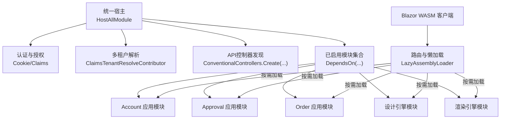
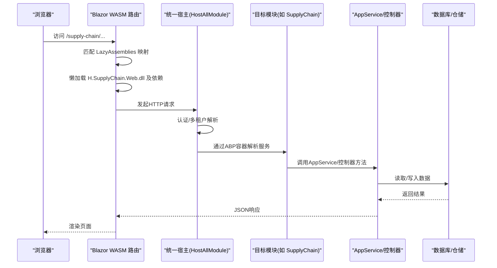
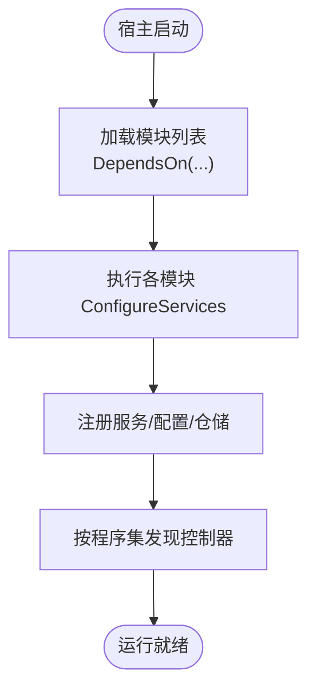
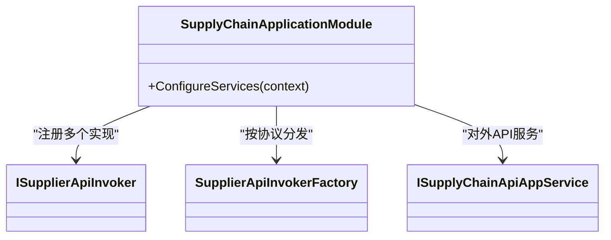
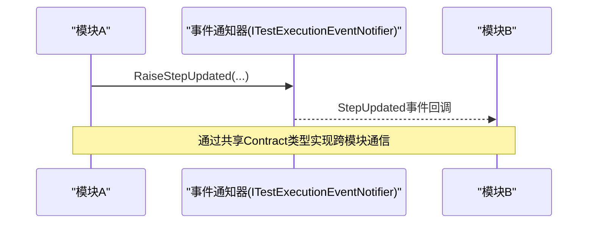
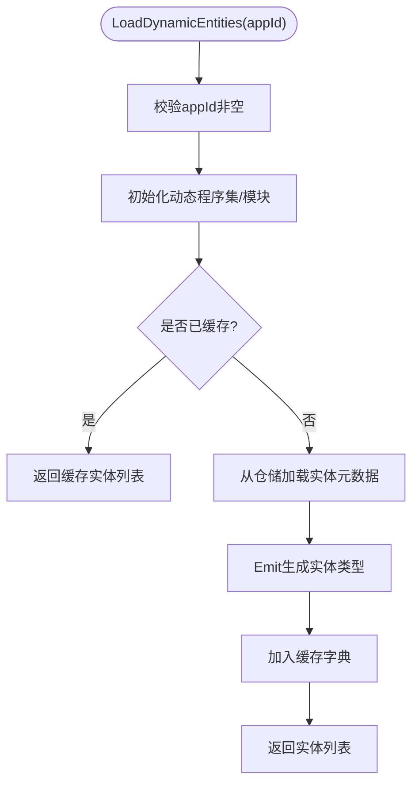
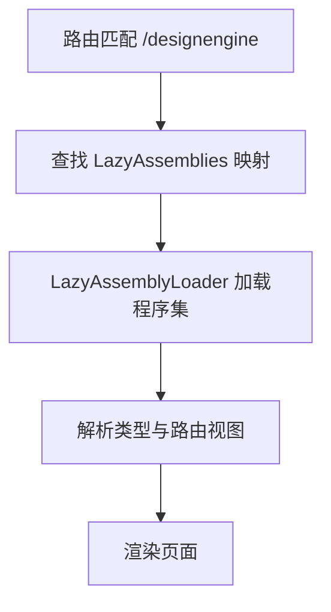
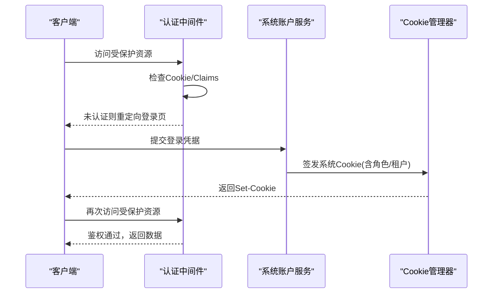
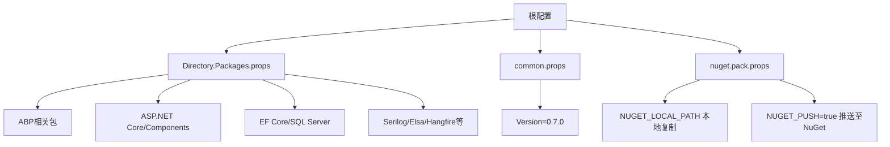

# 插件系统开发

<cite>
**本文引用的文件**   
- [HostAllModule.cs](file://src/Host/H.AppLab.Host.All/H.AppLab.Host.All/HostAllModule.cs)
- [Routes.razor（All客户端）](file://src/Host/H.AppLab.Host.All/H.AppLab.Host.All.Client/Routes.razor)
- [Directory.Packages.props](file://src/Directory.Packages.props)
- [common.props](file://src/common.props)
- [nuget.pack.props](file://src/nuget.pack.props)
- [SupplyChainApplicationModule.cs](file://src/Services/SupplyChain/H.SupplyChain.Application/SupplyChainApplicationModule.cs)
- [DesignEngineJsonFileRepositoryModule.cs](file://src/LowCode/DesignEngine/H.LowCode.DesignEngine.Repository.JsonFile/DesignEngineJsonFileRepositoryModule.cs)
- [RenderEngineDomainModule.cs](file://src/LowCode/RenderEngine/H.LowCode.RenderEngine.Domain/RenderEngineDomainModule.cs)
- [LowCodeApplicationModule.cs](file://src/LowCode/Common/H.LowCode.Application/LowCodeApplicationModule.cs)
- [EntityTypeManager（设计器EF Core）](file://src/LowCode/DesignEngine/H.LowCode.DesignEngine.EntityFrameworkCore/EntityManager/EntityTypeManager.cs)
- [EmitExtension.cs](file://src/LowCode/Common/H.LowCode.Entity/Extensions/EmitExtension.cs)
- [SystemAccountAppService.cs](file://src/System/SystemPortal/H.SystemPortal.Application/Services/SystemAccountAppService.cs)
- [ExternalLoginController.cs](file://src/Services/Account/H.Account.Application/ExternalLogin/ExternalLoginController.cs)
- [TestExecutionEventNotifier.cs](file://src/Services/Testing/H.Testing.Application.Contracts/Services/TestExecutionEventNotifier.cs)
</cite>

## 目录
1. [引言](#引言)
2. [项目结构](#项目结构)
3. [核心组件](#核心组件)
4. [架构总览](#架构总览)
5. [详细组件分析](#详细组件分析)
6. [依赖关系分析](#依赖关系分析)
7. [性能考量](#性能考量)
8. [故障排查指南](#故障排查指南)
9. [结论](#结论)
10. [附录：插件开发最佳实践清单](#附录插件开发最佳实践清单)

## 引言
本文件面向AppLab平台的插件系统开发者，基于ABP框架的模块化架构与Blazor WebAssembly懒加载机制，系统性阐述插件的生命周期、依赖注入与服务注册、插件间通信与数据共享、打包部署与版本管理、以及安全与权限控制。文档以仓库中的实际实现为依据，提供可操作的流程与图示，帮助读者从零开始构建可扩展、可插拔的AppLab插件。

## 项目结构
AppLab采用“宿主聚合 + 多模块插件”的组织方式：
- 宿主层：统一入口模块集中声明并启用所有业务模块，配置认证、多租户、控制器发现等横切能力。
- 应用层：各业务域按ABP约定拆分为 Application、Application.Contracts、EntityFrameworkCore、Web 等程序集。
- 前端层：Blazor WASM通过路由映射到不同功能域，按需懒加载对应程序集，实现“插件即程序集”的动态扩展。
- 低代码引擎：设计与渲染引擎作为核心插件域，提供动态实体生成、元数据驱动渲染等能力。

**图表来源** 
- [HostAllModule.cs:37-78](file://src/Host/H.AppLab.Host.All/H.AppLab.Host.All/HostAllModule.cs#L37-L78)
- [Routes.razor（All客户端）:22-82](file://src/Host/H.AppLab.Host.All/H.AppLab.Host.All.Client/Routes.razor#L22-L82)

**章节来源**
- [HostAllModule.cs:37-78](file://src/Host/H.AppLab.Host.All/H.AppLab.Host.All/HostAllModule.cs#L37-L78)
- [Routes.razor（All客户端）:22-82](file://src/Host/H.AppLab.Host.All/H.AppLab.Host.All.Client/Routes.razor#L22-L82)

## 核心组件
- 统一宿主模块：集中声明模块依赖、配置认证、多租户、控制器发现、外部登录等。
- 应用模块：每个业务域一个AbpModule，负责服务注册与领域装配。
- 契约程序集：定义跨进程/跨端共享的DTO与接口，便于WASM客户端与服务端共享类型。
- 存储与仓储：通过模块化的Repository抽象，支持JSON文件或EF Core等多种实现。
- 动态实体与渲染：运行时根据元数据动态生成实体类型，驱动页面与表单渲染。

**章节来源**
- [HostAllModule.cs:81-156](file://src/Host/H.AppLab.Host.All/H.AppLab.Host.All/HostAllModule.cs#L81-L156)
- [SupplyChainApplicationModule.cs:14-27](file://src/Services/SupplyChain/H.SupplyChain.Application/SupplyChainApplicationModule.cs#L14-L27)
- [DesignEngineJsonFileRepositoryModule.cs:12-25](file://src/LowCode/DesignEngine/H.LowCode.DesignEngine.Repository.JsonFile/DesignEngineJsonFileRepositoryModule.cs#L12-L25)
- [RenderEngineDomainModule.cs:6-11](file://src/LowCode/RenderEngine/H.LowCode.RenderEngine.Domain/RenderEngineDomainModule.cs#L6-L11)
- [LowCodeApplicationModule.cs:9-12](file://src/LowCode/Common/H.LowCode.Application/LowCodeApplicationModule.cs#L9-L12)

## 架构总览
下图展示从浏览器导航到后端API调用的完整调用链，体现“插件即程序集”的懒加载与ABP模块装配过程。

**图表来源** 
- [Routes.razor（All客户端）:22-82](file://src/Host/H.AppLab.Host.All/H.AppLab.Host.All.Client/Routes.razor#L22-L82)
- [HostAllModule.cs:115-156](file://src/Host/H.AppLab.Host.All/H.AppLab.Host.All/HostAllModule.cs#L115-L156)
- [SupplyChainApplicationModule.cs:14-27](file://src/Services/SupplyChain/H.SupplyChain.Application/SupplyChainApplicationModule.cs#L14-L27)

## 详细组件分析

### ABP模块化与插件生命周期
- 模块声明：通过[DependsOn]声明依赖，宿主在启动时扫描并装配所有模块。
- 生命周期阶段：ConfigureServices中完成DI注册；后续由ABP框架自动初始化模块。
- 控制器发现：通过ConventionalControllers.Create按模块程序集注册API。

**图表来源** 
- [HostAllModule.cs:37-78](file://src/Host/H.AppLab.Host.All/H.AppLab.Host.All/HostAllModule.cs#L37-L78)
- [HostAllModule.cs:135-156](file://src/Host/H.AppLab.Host.All/H.AppLab.Host.All/HostAllModule.cs#L135-L156)

**章节来源**
- [HostAllModule.cs:37-78](file://src/Host/H.AppLab.Host.All/H.AppLab.Host.All/HostAllModule.cs#L37-L78)
- [HostAllModule.cs:135-156](file://src/Host/H.AppLab.Host.All/H.AppLab.Host.All/HostAllModule.cs#L135-L156)

### 依赖注入配置与服务注册
- 应用模块内通过context.Services进行服务注册，例如HttpClient、HttpContextAccessor、工厂模式服务等。
- 契约程序集暴露接口，供服务端与WASM客户端共享类型。

**图表来源** 
- [SupplyChainApplicationModule.cs:14-27](file://src/Services/SupplyChain/H.SupplyChain.Application/SupplyChainApplicationModule.cs#L14-L27)

**章节来源**
- [SupplyChainApplicationModule.cs:14-27](file://src/Services/SupplyChain/H.SupplyChain.Application/SupplyChainApplicationModule.cs#L14-L27)

### 插件间通信与数据共享
- 事件总线/事件通知：通过Contracts层的公共事件通知器在服务端与WASM共享事件类型，实现松耦合通信。
- 共享DTO与枚举：将跨模块的数据模型放在Application.Contracts中，确保前后端一致。
- 仓储抽象：通过I*Repository抽象解耦具体存储实现（JSON文件/远程服务/EF Core）。

**图表来源** 
- [TestExecutionEventNotifier.cs:11-24](file://src/Services/Testing/H.Testing.Application.Contracts/Services/TestExecutionEventNotifier.cs#L11-L24)

**章节来源**
- [TestExecutionEventNotifier.cs:11-24](file://src/Services/Testing/H.Testing.Application.Contracts/Services/TestExecutionEventNotifier.cs#L11-L24)

### 动态实体与运行时扩展（低代码引擎）
- 动态程序集：使用Reflection.Emit创建动态程序集与模块，支持InternalsVisibleTo等特性。
- 动态实体加载：根据应用ID加载元数据，生成实体类型并缓存，避免重复开销。
- 仓储适配：通过IDataSourceRepository获取实体定义，驱动UI渲染与数据绑定。

**图表来源** 
- [EntityTypeManager（设计器EF Core）:26-42](file://src/LowCode/DesignEngine/H.LowCode.DesignEngine.EntityFrameworkCore/EntityManager/EntityTypeManager.cs#L26-L42)
- [EmitExtension.cs:41-73](file://src/LowCode/Common/H.LowCode.Entity/Extensions/EmitExtension.cs#L41-L73)

**章节来源**
- [EntityTypeManager（设计器EF Core）:26-42](file://src/LowCode/DesignEngine/H.LowCode.DesignEngine.EntityFrameworkCore/EntityManager/EntityTypeManager.cs#L26-L42)
- [EmitExtension.cs:41-73](file://src/LowCode/Common/H.LowCode.Entity/Extensions/EmitExtension.cs#L41-L73)

### 前端懒加载与插件路由
- 路由映射：基于路径段精确匹配，将路由前缀映射到一组需要懒加载的程序集。
- 懒加载器：使用LazyAssemblyLoader按需加载Web与Contracts程序集，减少初始包体积。
- 依赖链：设计器与渲染引擎包含大量基础库，需一次性加载依赖链。

**图表来源** 
- [Routes.razor（All客户端）:22-82](file://src/Host/H.AppLab.Host.All/H.AppLab.Host.All.Client/Routes.razor#L22-L82)

**章节来源**
- [Routes.razor（All客户端）:22-82](file://src/Host/H.AppLab.Host.All/H.AppLab.Host.All.Client/Routes.razor#L22-L82)

### 安全与权限控制
- Cookie认证：统一配置双Cookie方案（用户与系统），支持滑动过期与登录重定向。
- 多租户：从Claims解析租户，优先于内置解析器；无效租户清理Cookie并重定向。
- 外部登录：微信/钉钉扫码登录，State防重放，临时Cookie保存状态。
- 权限：通过ABP Authorization与Claim角色控制访问。

**图表来源** 
- [HostAllModule.cs:115-133](file://src/Host/H.AppLab.Host.All/H.AppLab.Host.All/HostAllModule.cs#L115-L133)
- [SystemAccountAppService.cs:68-104](file://src/System/SystemPortal/H.SystemPortal.Application/Services/SystemAccountAppService.cs#L68-L104)
- [ExternalLoginController.cs:14-41](file://src/Services/Account/H.Account.Application/ExternalLogin/ExternalLoginController.cs#L14-L41)

**章节来源**
- [HostAllModule.cs:115-133](file://src/Host/H.AppLab.Host.All/H.AppLab.Host.All/HostAllModule.cs#L115-L133)
- [SystemAccountAppService.cs:68-104](file://src/System/SystemPortal/H.SystemPortal.Application/Services/SystemAccountAppService.cs#L68-L104)
- [ExternalLoginController.cs:14-41](file://src/Services/Account/H.Account.Application/ExternalLogin/ExternalLoginController.cs#L14-L41)

## 依赖关系分析
- 包版本集中管理：通过Directory.Packages.props统一管理第三方与ABP包版本。
- 全局属性：common.props定义目标框架、语言版本、默认版本号等。
- NuGet打包：nuget.pack.props支持本地复制与CI环境推送。

**图表来源** 
- [Directory.Packages.props:1-99](file://src/Directory.Packages.props#L1-L99)
- [common.props:1-15](file://src/common.props#L1-L15)
- [nuget.pack.props:1-22](file://src/nuget.pack.props#L1-L22)

**章节来源**
- [Directory.Packages.props:1-99](file://src/Directory.Packages.props#L1-L99)
- [common.props:1-15](file://src/common.props#L1-L15)
- [nuget.pack.props:1-22](file://src/nuget.pack.props#L1-L22)

## 性能考量
- 懒加载降低首屏体积：按路由映射加载程序集，避免一次性加载全部插件。
- 动态实体缓存：运行时生成的实体类型按应用ID缓存，避免重复Emit开销。
- DI服务生命周期：合理选择Transient/Scoped/Singleton，避免不必要的实例化。
- HTTP客户端复用：通过AddHttpClient与工厂模式减少连接开销。

[本节为通用指导，不直接分析具体文件]

## 故障排查指南
- 模块未加载：检查HostAllModule的DependsOn是否包含目标模块程序集。
- 路由无法匹配：确认Routes.razor的LazyAssemblies映射是否正确，依赖链是否齐全。
- 认证失败：检查Cookie配置与Claims签发逻辑，确认租户解析器优先级。
- 动态实体异常：验证appId参数与仓储数据完整性，查看Emit扩展是否成功设置InternalsVisibleTo。

**章节来源**
- [HostAllModule.cs:37-78](file://src/Host/H.AppLab.Host.All/H.AppLab.Host.All/HostAllModule.cs#L37-L78)
- [Routes.razor（All客户端）:22-82](file://src/Host/H.AppLab.Host.All/H.AppLab.Host.All.Client/Routes.razor#L22-L82)
- [HostAllModule.cs:115-133](file://src/Host/H.AppLab.Host.All/H.AppLab.Host.All/HostAllModule.cs#L115-L133)
- [EmitExtension.cs:41-73](file://src/LowCode/Common/H.LowCode.Entity/Extensions/EmitExtension.cs#L41-L73)

## 结论
AppLab平台基于ABP模块化与Blazor WASM懒加载，实现了“插件即程序集”的灵活扩展体系。通过统一的宿主模块、清晰的契约分离、动态实体与渲染引擎、以及完善的安全与多租户支持，开发者可以高效地构建、打包、部署和升级插件。建议遵循本文档的流程与最佳实践，确保插件的可维护性与稳定性。

[本节为总结性内容，不直接分析具体文件]

## 附录：插件开发最佳实践清单
- 项目结构
  - 按ABP约定拆分Application、Application.Contracts、EntityFrameworkCore、Web等程序集。
  - 将跨端共享类型放入Application.Contracts。
- 配置文件
  - 在模块ConfigureServices中注册服务与配置项。
  - 使用Directory.Packages.props集中管理包版本。
- 接口定义
  - 通过契约程序集暴露接口与DTO，保证前后端一致性。
- 插件打包与部署
  - 使用nuget.pack.props支持本地复制与CI推送。
  - 在Routes.razor中配置LazyAssemblies映射，确保依赖链完整。
- 版本管理
  - 在common.props中统一设置Version，配合CI流水线发布。
- 安全与权限
  - 使用Cookie认证与Claims角色控制访问。
  - 多租户通过Claims解析，处理无效租户的重定向逻辑。

[本节为通用指导，不直接分析具体文件]