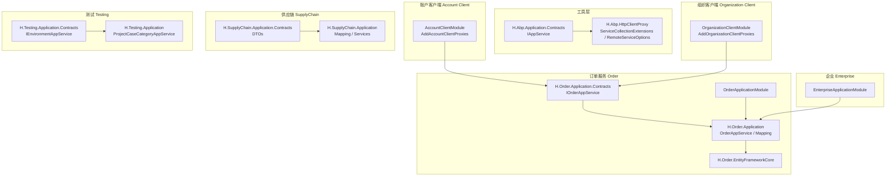
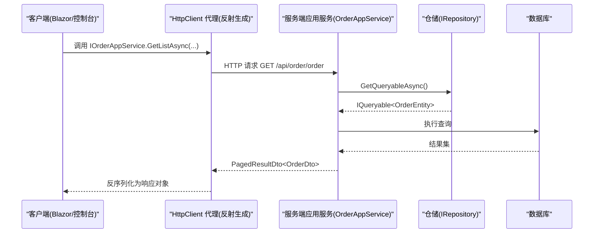
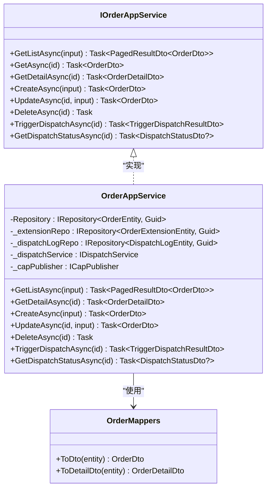
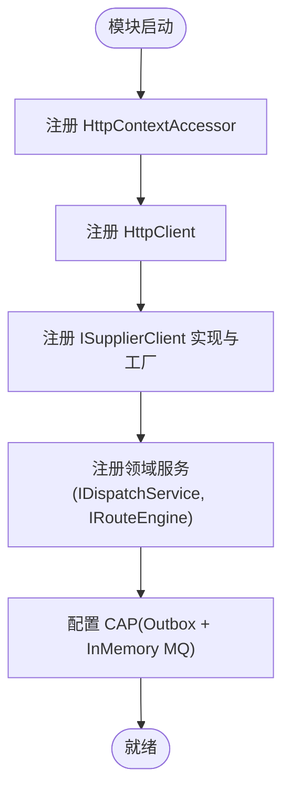
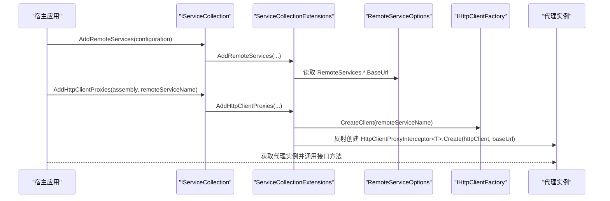
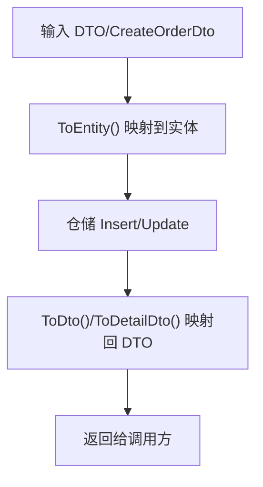
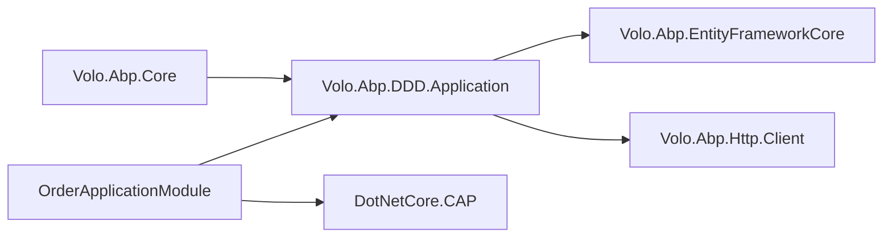

# 服务扩展开发

<cite>
**本文引用的文件**   
- [IAppService.cs](file://src/Utils/H.Abp.Application.Contracts/IAppService.cs)
- [ServiceCollectionExtensions.cs](file://src/Utils/H.Abp.HttpClientProxy/ServiceCollectionExtensions.cs)
- [HttpClientProxyInterceptor.cs](file://src/Utils/H.Abp.HttpClientProxy/HttpClientProxyInterceptor.cs)
- [RemoteServiceOptions.cs](file://src/Utils/H.Abp.HttpClientProxy/RemoteServiceOptions.cs)
- [OrderApplicationModule.cs](file://src/Services/Order/H.Order.Application/OrderApplicationModule.cs)
- [OrderAppService.cs](file://src/Services/Order/H.Order.Application/Services/OrderAppService.cs)
- [IOrderAppService.cs](file://src/Services/Order/H.Order.Application.Contracts/Services/IOrderAppService.cs)
- [OrderMappers.cs](file://src/Services/Order/H.Order.Application/Mapping/OrderMappers.cs)
- [AccountClientModule.cs](file://src/Services/Account/H.Account.Client/AccountClientModule.cs)
- [OrganizationClientModule.cs](file://src/Services/Organization/H.Organization.Client/OrganizationClientModule.cs)
- [SupplyChainMappers.cs](file://src/Services/SupplyChain/H.SupplyChain.Application/Mapping/SupplyChainMappers.cs)
- [SupplierInterfaceMappingDtos.cs](file://src/Services/SupplyChain/H.SupplyChain.Application.Contracts/Dtos/SupplierInterfaceMappingDtos.cs)
- [ProjectCaseCategoryAppService.cs](file://src/Services/Testing/H.Testing.Application/Services/ProjectCaseCategoryAppService.cs)
- [IEnvironmentAppService.cs](file://src/Services/Testing/H.Testing.Application.Contracts/Services/IEnvironmentAppService.cs)
- [EnterpriseApplicationModule.cs](file://src/System/Enterprise/H.Enterprise.Application/EnterpriseApplicationModule.cs)
- [Directory.Packages.props](file://src/Directory.Packages.props)
</cite>

## 目录
1. [简介](#简介)
2. [项目结构](#项目结构)
3. [核心组件](#核心组件)
4. [架构总览](#架构总览)
5. [详细组件分析](#详细组件分析)
6. [依赖关系分析](#依赖关系分析)
7. [性能考虑](#性能考虑)
8. [故障排查指南](#故障排查指南)
9. [结论](#结论)
10. [附录](#附录)

## 简介
本文件面向 AppLab 平台的服务扩展开发者，系统阐述基于 ABP 框架的应用服务架构与扩展点设计，覆盖以下主题：
- 应用服务接口定义、实现类与 DTO 映射规范
- 依赖注入容器使用与服务注册机制（ABP 模块 + .NET DI）
- HTTP 客户端代理的生成与调用方式
- 服务的单元测试与集成测试策略
- 服务版本管理与向后兼容性保证方法

## 项目结构
AppLab 采用多模块、分层清晰的架构。每个业务域通常包含 Application、Application.Contracts、EntityFrameworkCore、Web 等子项目；工具层提供 HttpClient 代理生成与通用契约类型。

图表来源 
- [IAppService.cs:1-9](file://src/Utils/H.Abp.Application.Contracts/IAppService.cs#L1-L9)
- [ServiceCollectionExtensions.cs:1-64](file://src/Utils/H.Abp.HttpClientProxy/ServiceCollectionExtensions.cs#L1-L64)
- [OrderApplicationModule.cs:1-49](file://src/Services/Order/H.Order.Application/OrderApplicationModule.cs#L1-L49)
- [OrderAppService.cs:1-241](file://src/Services/Order/H.Order.Application/Services/OrderAppService.cs#L1-L241)
- [IOrderAppService.cs:1-42](file://src/Services/Order/H.Order.Application.Contracts/Services/IOrderAppService.cs#L1-L42)
- [AccountClientModule.cs:1-31](file://src/Services/Account/H.Account.Client/AccountClientModule.cs#L1-L31)
- [OrganizationClientModule.cs:1-30](file://src/Services/Organization/H.Organization.Client/OrganizationClientModule.cs#L1-L30)
- [SupplyChainMappers.cs:1-44](file://src/Services/SupplyChain/H.SupplyChain.Application/Mapping/SupplyChainMappers.cs#L1-L44)
- [SupplierInterfaceMappingDtos.cs:1-37](file://src/Services/SupplyChain/H.SupplyChain.Application.Contracts/Dtos/SupplierInterfaceMappingDtos.cs#L1-L37)
- [ProjectCaseCategoryAppService.cs:1-39](file://src/Services/Testing/H.Testing.Application/Services/ProjectCaseCategoryAppService.cs#L1-L39)
- [IEnvironmentAppService.cs:1-38](file://src/Services/Testing/H.Testing.Application.Contracts/Services/IEnvironmentAppService.cs#L1-L38)
- [EnterpriseApplicationModule.cs:1-18](file://src/System/Enterprise/H.Enterprise.Application/EnterpriseApplicationModule.cs#L1-L18)

章节来源
- [OrderApplicationModule.cs:1-49](file://src/Services/Order/H.Order.Application/OrderApplicationModule.cs#L1-L49)
- [Directory.Packages.props:52-68](file://src/Directory.Packages.props#L52-L68)

## 核心组件
- IAppService 标记接口：用于标识可通过 HTTP 代理远程调用的服务接口，是客户端代理扫描的基础。
- ServiceCollectionExtensions：提供 AddRemoteServices 与 AddHttpClientProxies，从配置读取远程服务 BaseUrl，并扫描程序集中所有继承 IAppService 的接口，动态生成 HttpClient 代理实现。
- 各业务模块的 AbpModule：在 ConfigureServices 中完成服务注册、HTTP 客户端、消息队列等基础设施配置。
- 应用服务实现：继承 ApplicationService 并实现对应 IAppService 接口，通过 IRepository 访问数据，使用手工映射将实体与 DTO 转换。

章节来源
- [IAppService.cs:1-9](file://src/Utils/H.Abp.Application.Contracts/IAppService.cs#L1-L9)
- [ServiceCollectionExtensions.cs:1-64](file://src/Utils/H.Abp.HttpClientProxy/ServiceCollectionExtensions.cs#L1-L64)
- [OrderApplicationModule.cs:1-49](file://src/Services/Order/H.Order.Application/OrderApplicationModule.cs#L1-L49)

## 架构总览
下图展示“客户端 -> HTTP 代理 -> 服务端应用服务”的端到端调用链，以及 ABP 模块如何装配依赖。

图表来源 
- [ServiceCollectionExtensions.cs:35-62](file://src/Utils/H.Abp.HttpClientProxy/ServiceCollectionExtensions.cs#L35-L62)
- [OrderAppService.cs:44-59](file://src/Services/Order/H.Order.Application/Services/OrderAppService.cs#L44-L59)
- [IOrderAppService.cs:19-21](file://src/Services/Order/H.Order.Application.Contracts/Services/IOrderAppService.cs#L19-L21)

## 详细组件分析

### 应用服务接口与实现（以订单为例）
- 接口定义：IOrderAppService 继承 IAppService，声明 RESTful 风格的方法，如分页列表、详情、创建、更新、删除、触发下发、查询下发状态等。
- 实现类：OrderAppService 继承 ApplicationService，通过构造函数注入 IRepository 与领域服务，使用 CurrentUnitOfWork 管理事务，结合 CAP 发布异步事件。
- DTO 映射：OrderMappers 提供 ToDto/ToDetailDto 等扩展方法，避免依赖自动映射器，保持轻量可控。

图表来源 
- [IOrderAppService.cs:1-42](file://src/Services/Order/H.Order.Application.Contracts/Services/IOrderAppService.cs#L1-L42)
- [OrderAppService.cs:1-241](file://src/Services/Order/H.Order.Application/Services/OrderAppService.cs#L1-L241)
- [OrderMappers.cs:1-45](file://src/Services/Order/H.Order.Application/Mapping/OrderMappers.cs#L1-L45)

章节来源
- [IOrderAppService.cs:1-42](file://src/Services/Order/H.Order.Application.Contracts/Services/IOrderAppService.cs#L1-L42)
- [OrderAppService.cs:1-241](file://src/Services/Order/H.Order.Application/Services/OrderAppService.cs#L1-L241)
- [OrderMappers.cs:1-45](file://src/Services/Order/H.Order.Application/Mapping/OrderMappers.cs#L1-L45)

### 依赖注入与服务注册（ABP 模块）
- OrderApplicationModule：注册 HttpContextAccessor、HttpClient、供应商客户端工厂、领域服务、CAP 存储与队列、消费者等。
- EnterpriseApplicationModule：示例说明 ApplicationService 通过 ABP 自动注册（ITransientDependency），无需手动 Register。
- 其他模块（如 LowCodeApplicationModule）：按需注册当前应用上下文等。

图表来源 
- [OrderApplicationModule.cs:18-48](file://src/Services/Order/H.Order.Application/OrderApplicationModule.cs#L18-L48)
- [EnterpriseApplicationModule.cs:13-16](file://src/System/Enterprise/H.Enterprise.Application/EnterpriseApplicationModule.cs#L13-L16)

章节来源
- [OrderApplicationModule.cs:1-49](file://src/Services/Order/H.Order.Application/OrderApplicationModule.cs#L1-L49)
- [EnterpriseApplicationModule.cs:1-18](file://src/System/Enterprise/H.Enterprise.Application/EnterpriseApplicationModule.cs#L1-L18)

### HTTP 客户端代理的生成与使用
- 扫描规则：AddHttpClientProxies 扫描指定程序集中所有继承 IAppService 的接口，为每个接口生成代理实现。
- 配置加载：AddRemoteServices 从 IConfiguration 的 RemoteServices 节点读取 BaseUrl，供代理构造时使用。
- 客户端注册：AccountClientModule 与 OrganizationClientModule 分别暴露 AddXxxClientProxies 扩展方法，便于宿主统一注册。

图表来源 
- [ServiceCollectionExtensions.cs:16-30](file://src/Utils/H.Abp.HttpClientProxy/ServiceCollectionExtensions.cs#L16-L30)
- [ServiceCollectionExtensions.cs:35-62](file://src/Utils/H.Abp.HttpClientProxy/ServiceCollectionExtensions.cs#L35-L62)
- [AccountClientModule.cs:14-21](file://src/Services/Account/H.Account.Client/AccountClientModule.cs#L14-L21)
- [OrganizationClientModule.cs:14-21](file://src/Services/Organization/H.Organization.Client/OrganizationClientModule.cs#L14-L21)

章节来源
- [ServiceCollectionExtensions.cs:1-64](file://src/Utils/H.Abp.HttpClientProxy/ServiceCollectionExtensions.cs#L1-L64)
- [AccountClientModule.cs:1-31](file://src/Services/Account/H.Account.Client/AccountClientModule.cs#L1-L31)
- [OrganizationClientModule.cs:1-30](file://src/Services/Organization/H.Organization.Client/OrganizationClientModule.cs#L1-L30)

### DTO 映射实践
- 手工映射：OrderMappers、SupplyChainMappers 提供 ToDto/ToEntity 扩展方法，确保字段映射清晰、可维护。
- 接口映射 DTO：SupplierInterfaceMappingDtos 用于配置供应商接口参数与返回值映射，支持 JSON 描述。

图表来源 
- [OrderMappers.cs:1-45](file://src/Services/Order/H.Order.Application/Mapping/OrderMappers.cs#L1-L45)
- [SupplyChainMappers.cs:1-44](file://src/Services/SupplyChain/H.SupplyChain.Application/Mapping/SupplyChainMappers.cs#L1-L44)
- [SupplierInterfaceMappingDtos.cs:1-37](file://src/Services/SupplyChain/H.SupplyChain.Application.Contracts/Dtos/SupplierInterfaceMappingDtos.cs#L1-L37)

章节来源
- [OrderMappers.cs:1-45](file://src/Services/Order/H.Order.Application/Mapping/OrderMappers.cs#L1-L45)
- [SupplyChainMappers.cs:1-44](file://src/Services/SupplyChain/H.SupplyChain.Application/Mapping/SupplyChainMappers.cs#L1-L44)
- [SupplierInterfaceMappingDtos.cs:1-37](file://src/Services/SupplyChain/H.SupplyChain.Application.Contracts/Dtos/SupplierInterfaceMappingDtos.cs#L1-L37)

### 测试服务示例（Testing）
- ProjectCaseCategoryAppService：演示树形结构构建、CRUD 操作与 Apply 模式。
- IEnvironmentAppService：定义环境管理的标准接口，体现 IAppService 的使用约定。

章节来源
- [ProjectCaseCategoryAppService.cs:1-39](file://src/Services/Testing/H.Testing.Application/Services/ProjectCaseCategoryAppService.cs#L1-L39)
- [IEnvironmentAppService.cs:1-38](file://src/Services/Testing/H.Testing.Application.Contracts/Services/IEnvironmentAppService.cs#L1-L38)

## 依赖关系分析
- 包依赖：Volo.Abp.* 系列包版本集中在 Directory.Packages.props 中统一管理，确保一致性。
- 模块依赖：各 Application 模块通过 [DependsOn] 声明对 EF Core 模块的依赖，保证初始化顺序。
- 外部依赖：CAP 用于 Outbox 与消息队列解耦；HttpClientFactory 用于 HTTP 代理。

图表来源 
- [Directory.Packages.props:52-68](file://src/Directory.Packages.props#L52-L68)
- [OrderApplicationModule.cs:13-16](file://src/Services/Order/H.Order.Application/OrderApplicationModule.cs#L13-L16)

章节来源
- [Directory.Packages.props:52-68](file://src/Directory.Packages.props#L52-L68)
- [OrderApplicationModule.cs:1-49](file://src/Services/Order/H.Order.Application/OrderApplicationModule.cs#L1-L49)

## 性能考虑
- 列表查询仅返回核心字段，详情再单独查询扩展属性，减少不必要的数据传输与关联开销。
- 使用 AsyncExecuter 与 IQueryable 进行延迟执行与批量操作，避免 N+1 问题。
- 通过 CAP Outbox 将写库与消息发送解耦，提升吞吐与可靠性。
- HttpClient 连接复用由 IHttpClientFactory 管理，避免端口耗尽。

[本节为通用指导，不直接分析具体文件]

## 故障排查指南
- 远程服务 BaseUrl 未配置：检查配置文件 RemoteServices 节点是否正确加载。
- 代理未生成：确认 AddHttpClientProxies 传入的程序集包含 IAppService 接口，且接口未被泛型化。
- 服务未注册：确保 AbpModule 已正确 DependsOn 相关 EF Core 模块，并在 ConfigureServices 中完成必要注册。
- 映射错误：核对手工映射扩展方法的字段名与类型是否一致。

章节来源
- [ServiceCollectionExtensions.cs:16-30](file://src/Utils/H.Abp.HttpClientProxy/ServiceCollectionExtensions.cs#L16-L30)
- [ServiceCollectionExtensions.cs:35-62](file://src/Utils/H.Abp.HttpClientProxy/ServiceCollectionExtensions.cs#L35-L62)
- [OrderApplicationModule.cs:18-48](file://src/Services/Order/H.Order.Application/OrderApplicationModule.cs#L18-L48)

## 结论
AppLab 平台基于 ABP 模块化架构，结合自定义 HttpClient 代理生成与手工 DTO 映射，实现了高内聚、低耦合的服务扩展能力。通过统一的模块注册与依赖注入机制，开发者可以快速构建可扩展、可测试、易维护的应用服务，并利用 CAP 与 HttpClientFactory 提升系统的可靠性与性能。

[本节为总结性内容，不直接分析具体文件]

## 附录
- 新增服务扩展步骤建议：
  - 在 Application.Contracts 定义 IAppService 接口与 DTO
  - 在 Application 实现应用服务，使用 IRepository 与手工映射
  - 在 AbpModule 中注册必要的依赖（HTTP、CAP、领域服务等）
  - 在客户端项目中通过 AddHttpClientProxies 注册代理并调用
  - 编写单元测试与集成测试，覆盖关键路径与异常分支
- 版本管理与向后兼容：
  - 接口变更遵循最小破坏原则，新增字段与方法优先
  - DTO 增加可选字段，避免破坏现有客户端
  - 通过命名空间或版本号区分大版本，逐步迁移

[本节为通用指导，不直接分析具体文件]