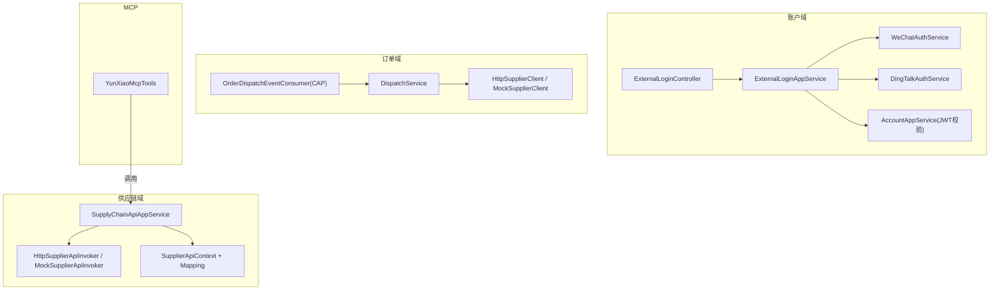
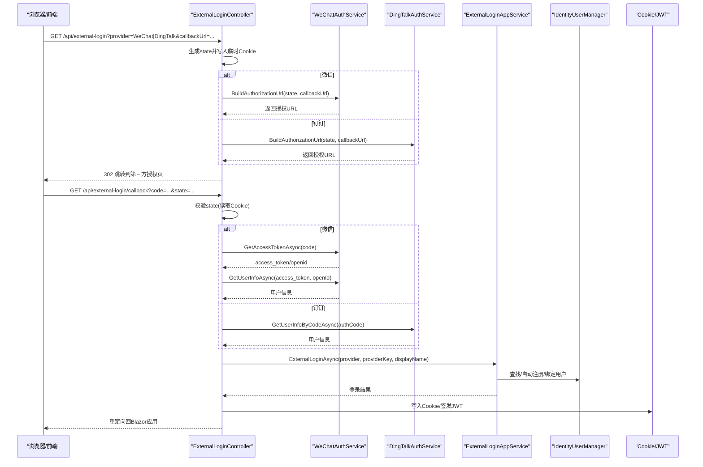
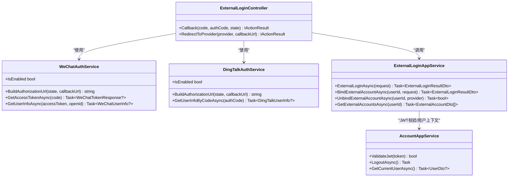
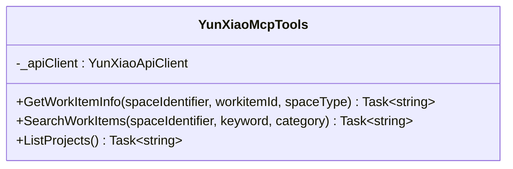
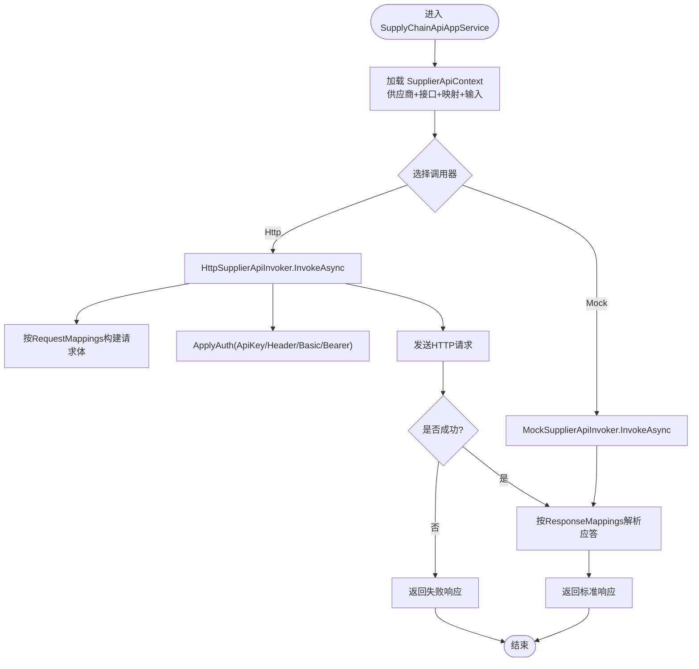
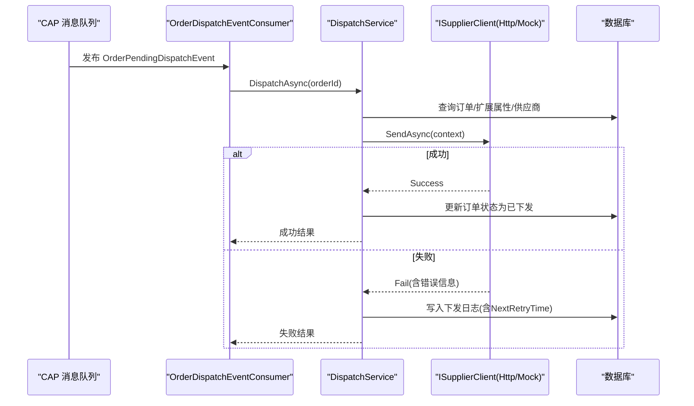
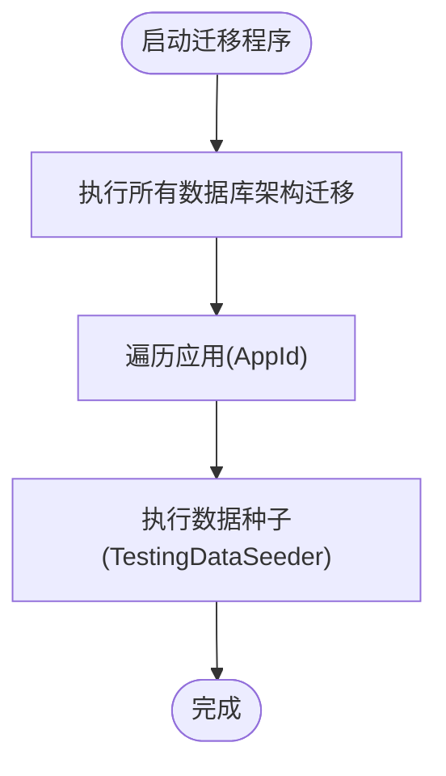
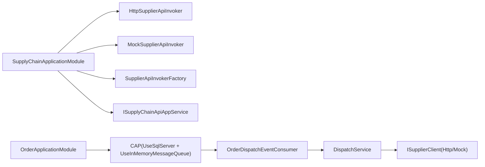

# 第三方集成开发

<cite>
**本文引用的文件**   
- [ExternalLoginOptions.cs](file://src/Services/Account/H.Account.Application/ExternalLogin/ExternalLoginOptions.cs)
- [WeChatAuthService.cs](file://src/Services/Account/H.Account.Application/ExternalLogin/WeChatAuthService.cs)
- [DingTalkAuthService.cs](file://src/Services/Account/H.Account.Application/ExternalLogin/DingTalkAuthService.cs)
- [ExternalLoginController.cs](file://src/Services/Account/H.Account.Application/ExternalLogin/ExternalLoginController.cs)
- [ExternalLoginAppService.cs](file://src/Services/Account/H.Account.Application/ExternalLogin/ExternalLoginAppService.cs)
- [IExternalLoginAppService.cs](file://src/Services/Account/H.Account.Application.Contracts/Services/IExternalLoginAppService.cs)
- [AccountAppService.cs](file://src/Services/Account/H.Account.Application/Services/AccountAppService.cs)
- [YunXiaoMcpTools.cs](file://src/Agent/McpServers/H.Mcp.YunXiao/YunXiaoMcpTools.cs)
- [ISupplierApiInvoker.cs](file://src/Services/SupplyChain/H.SupplyChain.Application.Contracts/Abstractions/ISupplierApiInvoker.cs)
- [SupplierApiContext.cs](file://src/Services/SupplyChain/H.SupplyChain.Application.Contracts/Abstractions/SupplierApiContext.cs)
- [ISupplyChainApiAppService.cs](file://src/Services/SupplyChain/H.SupplyChain.Application.Contracts/Services/ISupplyChainApiAppService.cs)
- [SupplyChainApiAppService.cs](file://src/Services/SupplyChain/H.SupplyChain.Application/Services/SupplyChainApiAppService.cs)
- [SupplyChainApplicationModule.cs](file://src/Services/SupplyChain/H.SupplyChain.Application/SupplyChainApplicationModule.cs)
- [SupplierApiInvokers.cs](file://src/Services/SupplyChain/H.SupplyChain.Application/Services/SupplierApiInvokers.cs)
- [DispatchService.cs](file://src/Services/Order/H.Order.Application/Services/DispatchService.cs)
- [SupplierClients.cs](file://src/Services/Order/H.Order.Application/Services/SupplierClients.cs)
- [OrderDispatchEventConsumer.cs](file://src/Services/Order/H.Order.Application/Services/OrderDispatchEventConsumer.cs)
- [OrderApplicationModule.cs](file://src/Services/Order/H.Order.Application/OrderApplicationModule.cs)
- [DbMigrationService.cs](file://src/Tools/H.LowCode.DbMigrator/DbMigrationService.cs)
- [Program.cs（Account DbMigrator）](file://src/Tools/H.Account.DbMigrator/Program.cs)
- [20260718055121_Init.cs（Order 迁移）](file://src/Tools/H.Order.DbMigrator/Migrations/20260718055121_Init.cs)
- [20260607160151_McpServer.cs（Assistant 迁移）](file://src/Tools/H.Assistant.DbMigrator/Migrations/20260607160151_McpServer.cs)
- [TestingDataSeeder.cs](file://src/Tools/H.Testing.DbMigrator/TestingDataSeeder.cs)
- [execution-records.json](file://src/Services/Testing/data/catering/execution-records.json)
</cite>

## 目录
1. [引言](#引言)
2. [项目结构](#项目结构)
3. [核心组件](#核心组件)
4. [架构总览](#架构总览)
5. [详细组件分析](#详细组件分析)
6. [依赖关系分析](#依赖关系分析)
7. [性能考量](#性能考量)
8. [故障排查指南](#故障排查指南)
9. [结论](#结论)
10. [附录](#附录)

## 引言
本文件面向 AppLab 平台的第三方系统集成开发，聚焦以下主题：
- 外部登录集成：OAuth2.0 流程、微信/钉钉扫码登录、JWT 令牌校验与 Cookie 会话。
- MCP 协议集成：云效 MCP 工具函数开发与调用。
- 供应链 API 抽象与适配器模式：供应商接口统一抽象、字段映射、认证策略与模拟实现。
- 数据库迁移与种子数据：多模块迁移执行与测试环境数据初始化。
- 错误处理与重试机制：订单下发失败重试、CAP 消息队列重试、HTTP 异常封装。
- 集成测试与模拟服务：Mock 客户端/调用器、测试数据注入与执行记录。

## 项目结构
本项目采用 ABP 模块化架构，按业务域划分 Services、Agent、LowCode、System、Tools 等子域；Host 聚合各应用模块对外暴露端点。与第三方集成相关的关键位置：
- Account 域：外部登录控制器与应用服务、OAuth2 提供者封装、JWT 配置。
- SupplyChain 域：供应链对外 API、供应商调用抽象与 HTTP/Mock 实现。
- Order 域：订单下发调度、CAP 事件消费、重试与日志。
- Agent/MCP：云效 MCP 工具定义。
- Tools：各域迁移程序与种子数据加载。

**图表来源** 
- [ExternalLoginController.cs:1-112](file://src/Services/Account/H.Account.Application/ExternalLogin/ExternalLoginController.cs#L1-L112)
- [ExternalLoginAppService.cs:1-163](file://src/Services/Account/H.Account.Application/ExternalLogin/ExternalLoginAppService.cs#L1-L163)
- [WeChatAuthService.cs:1-119](file://src/Services/Account/H.Account.Application/ExternalLogin/WeChatAuthService.cs#L1-L119)
- [DingTalkAuthService.cs:1-141](file://src/Services/Account/H.Account.Application/ExternalLogin/DingTalkAuthService.cs#L1-L141)
- [AccountAppService.cs:230-271](file://src/Services/Account/H.Account.Application/Services/AccountAppService.cs#L230-L271)
- [SupplyChainApiAppService.cs:1-28](file://src/Services/SupplyChain/H.SupplyChain.Application/Services/SupplyChainApiAppService.cs#L1-L28)
- [SupplierApiInvokers.cs:1-278](file://src/Services/SupplyChain/H.SupplyChain.Application/Services/SupplierApiInvokers.cs#L1-L278)
- [DispatchService.cs:1-220](file://src/Services/Order/H.Order.Application/Services/DispatchService.cs#L1-L220)
- [SupplierClients.cs:1-150](file://src/Services/Order/H.Order.Application/Services/SupplierClients.cs#L1-L150)
- [OrderDispatchEventConsumer.cs:1-33](file://src/Services/Order/H.Order.Application/Services/OrderDispatchEventConsumer.cs#L1-L33)
- [YunXiaoMcpTools.cs:1-40](file://src/Agent/McpServers/H.Mcp.YunXiao/YunXiaoMcpTools.cs#L1-L40)

**章节来源**
- [ExternalLoginController.cs:1-112](file://src/Services/Account/H.Account.Application/ExternalLogin/ExternalLoginController.cs#L1-L112)
- [ExternalLoginAppService.cs:1-163](file://src/Services/Account/H.Account.Application/ExternalLogin/ExternalLoginAppService.cs#L1-L163)
- [WeChatAuthService.cs:1-119](file://src/Services/Account/H.Account.Application/ExternalLogin/WeChatAuthService.cs#L1-L119)
- [DingTalkAuthService.cs:1-141](file://src/Services/Account/H.Account.Application/ExternalLogin/DingTalkAuthService.cs#L1-L141)
- [AccountAppService.cs:230-271](file://src/Services/Account/H.Account.Application/Services/AccountAppService.cs#L230-L271)
- [SupplyChainApiAppService.cs:1-28](file://src/Services/SupplyChain/H.SupplyChain.Application/Services/SupplyChainApiAppService.cs#L1-L28)
- [SupplierApiInvokers.cs:1-278](file://src/Services/SupplyChain/H.SupplyChain.Application/Services/SupplierApiInvokers.cs#L1-L278)
- [DispatchService.cs:1-220](file://src/Services/Order/H.Order.Application/Services/DispatchService.cs#L1-L220)
- [SupplierClients.cs:1-150](file://src/Services/Order/H.Order.Application/Services/SupplierClients.cs#L1-L150)
- [OrderDispatchEventConsumer.cs:1-33](file://src/Services/Order/H.Order.Application/Services/OrderDispatchEventConsumer.cs#L1-L33)
- [YunXiaoMcpTools.cs:1-40](file://src/Agent/McpServers/H.Mcp.YunXiao/YunXiaoMcpTools.cs#L1-L40)

## 核心组件
- 外部登录控制器与服务：负责 OAuth2 授权跳转、回调处理、状态校验、用户绑定与登录态写入。
- OAuth2 提供者封装：微信/钉钉的授权 URL 构建、code 换 token、获取用户信息。
- JWT 校验：服务端基于对称密钥与 Issuer/Audience/Lifetime 校验令牌有效性。
- 供应链对外 API：菜单、商品详情、下单三类接口，通过 SupplierApiContext 与字段映射驱动请求/响应转换。
- 供应商调用适配器：HttpSupplierApiInvoker 支持多种认证方式与 JSON 路径解析；MockSupplierApiInvoker 用于演示与联调。
- 订单下发调度：匹配路由、构造负载、调用供应商、写日志、更新订单状态，并配合 CAP 进行异步与重试。
- MCP 工具：云效工作项查询、搜索、项目列表等工具方法，供 MCP 客户端调用。
- 迁移与种子：低代码迁移服务编排数据库迁移与数据种子；测试数据从 JSON 注入到指定租户。

**章节来源**
- [ExternalLoginController.cs:1-112](file://src/Services/Account/H.Account.Application/ExternalLogin/ExternalLoginController.cs#L1-L112)
- [ExternalLoginAppService.cs:1-163](file://src/Services/Account/H.Account.Application/ExternalLogin/ExternalLoginAppService.cs#L1-L163)
- [WeChatAuthService.cs:1-119](file://src/Services/Account/H.Account.Application/ExternalLogin/WeChatAuthService.cs#L1-L119)
- [DingTalkAuthService.cs:1-141](file://src/Services/Account/H.Account.Application/ExternalLogin/DingTalkAuthService.cs#L1-L141)
- [AccountAppService.cs:230-271](file://src/Services/Account/H.Account.Application/Services/AccountAppService.cs#L230-L271)
- [ISupplyChainApiAppService.cs:1-29](file://src/Services/SupplyChain/H.SupplyChain.Application.Contracts/Services/ISupplyChainApiAppService.cs#L1-L29)
- [SupplyChainApiAppService.cs:1-28](file://src/Services/SupplyChain/H.SupplyChain.Application/Services/SupplyChainApiAppService.cs#L1-L28)
- [SupplierApiInvokers.cs:1-278](file://src/Services/SupplyChain/H.SupplyChain.Application/Services/SupplierApiInvokers.cs#L1-L278)
- [DispatchService.cs:1-220](file://src/Services/Order/H.Order.Application/Services/DispatchService.cs#L1-L220)
- [OrderDispatchEventConsumer.cs:1-33](file://src/Services/Order/H.Order.Application/Services/OrderDispatchEventConsumer.cs#L1-L33)
- [YunXiaoMcpTools.cs:1-40](file://src/Agent/McpServers/H.Mcp.YunXiao/YunXiaoMcpTools.cs#L1-L40)
- [DbMigrationService.cs:1-58](file://src/Tools/H.LowCode.DbMigrator/DbMigrationService.cs#L1-L58)
- [TestingDataSeeder.cs:1-403](file://src/Tools/H.Testing.DbMigrator/TestingDataSeeder.cs#L1-L403)

## 架构总览
整体采用“控制器/应用服务 -> 领域服务 -> 适配器/客户端”的分层设计，结合 ABP 模块注册与工厂模式扩展不同协议实现。

**图表来源** 
- [ExternalLoginController.cs:1-112](file://src/Services/Account/H.Account.Application/ExternalLogin/ExternalLoginController.cs#L1-L112)
- [WeChatAuthService.cs:1-119](file://src/Services/Account/H.Account.Application/ExternalLogin/WeChatAuthService.cs#L1-L119)
- [DingTalkAuthService.cs:1-141](file://src/Services/Account/H.Account.Application/ExternalLogin/DingTalkAuthService.cs#L1-L141)
- [ExternalLoginAppService.cs:1-163](file://src/Services/Account/H.Account.Application/ExternalLogin/ExternalLoginAppService.cs#L1-L163)

## 详细组件分析

### 外部登录集成（OAuth2.0 + JWT）
- 授权跳转：根据 provider 选择微信或钉钉，生成 state 并写入临时 Cookie，构建授权 URL 并 302 跳转。
- 回调处理：校验 state，换取 token 与用户信息，调用应用服务完成用户查找/自动注册/绑定，写入 Cookie/JWT。
- JWT 校验：基于配置中的 Issuer/Audience/SymmetricKey 验证令牌有效性与生命周期。

**图表来源** 
- [ExternalLoginController.cs:1-112](file://src/Services/Account/H.Account.Application/ExternalLogin/ExternalLoginController.cs#L1-L112)
- [WeChatAuthService.cs:1-119](file://src/Services/Account/H.Account.Application/ExternalLogin/WeChatAuthService.cs#L1-L119)
- [DingTalkAuthService.cs:1-141](file://src/Services/Account/H.Account.Application/ExternalLogin/DingTalkAuthService.cs#L1-L141)
- [ExternalLoginAppService.cs:1-163](file://src/Services/Account/H.Account.Application/ExternalLogin/ExternalLoginAppService.cs#L1-L163)
- [AccountAppService.cs:230-271](file://src/Services/Account/H.Account.Application/Services/AccountAppService.cs#L230-L271)

**章节来源**
- [ExternalLoginController.cs:1-112](file://src/Services/Account/H.Account.Application/ExternalLogin/ExternalLoginController.cs#L1-L112)
- [ExternalLoginAppService.cs:1-163](file://src/Services/Account/H.Account.Application/ExternalLogin/ExternalLoginAppService.cs#L1-L163)
- [WeChatAuthService.cs:1-119](file://src/Services/Account/H.Account.Application/ExternalLogin/WeChatAuthService.cs#L1-L119)
- [DingTalkAuthService.cs:1-141](file://src/Services/Account/H.Account.Application/ExternalLogin/DingTalkAuthService.cs#L1-L141)
- [AccountAppService.cs:230-271](file://src/Services/Account/H.Account.Application/Services/AccountAppService.cs#L230-L271)

### MCP 协议集成（云效工具）
- 工具类以特性标注暴露为 MCP 工具，参数描述用于自动生成文档与提示。
- 提供工作项详情、搜索、项目列表等方法，内部委托给 API 客户端。

**图表来源** 
- [YunXiaoMcpTools.cs:1-40](file://src/Agent/McpServers/H.Mcp.YunXiao/YunXiaoMcpTools.cs#L1-L40)

**章节来源**
- [YunXiaoMcpTools.cs:1-40](file://src/Agent/McpServers/H.Mcp.YunXiao/YunXiaoMcpTools.cs#L1-L40)

### 供应链 API 抽象与适配器模式
- 对外 API 接口定义：菜单、商品详情、下单三类端点。
- 供应商调用上下文：包含供应商信息、接口定义、字段映射与标准输入载荷。
- 适配器实现：
  - HttpSupplierApiInvoker：按 RequestMappings 构造请求体，按 ResponseMappings 解析应答，支持 ApiKey/Header/Basic/Bearer 认证。
  - MockSupplierApiInvoker：不实际调用外部接口，直接返回模拟响应，便于联调与演示。

**图表来源** 
- [SupplyChainApiAppService.cs:1-28](file://src/Services/SupplyChain/H.SupplyChain.Application/Services/SupplyChainApiAppService.cs#L1-L28)
- [SupplierApiContext.cs:1-48](file://src/Services/SupplyChain/H.SupplyChain.Application.Contracts/Abstractions/SupplierApiContext.cs#L1-L48)
- [SupplierApiInvokers.cs:1-278](file://src/Services/SupplyChain/H.SupplyChain.Application/Services/SupplierApiInvokers.cs#L1-L278)

**章节来源**
- [ISupplyChainApiAppService.cs:1-29](file://src/Services/SupplyChain/H.SupplyChain.Application.Contracts/Services/ISupplyChainApiAppService.cs#L1-L29)
- [SupplyChainApiAppService.cs:1-28](file://src/Services/SupplyChain/H.SupplyChain.Application/Services/SupplyChainApiAppService.cs#L1-L28)
- [SupplierApiContext.cs:1-48](file://src/Services/SupplyChain/H.SupplyChain.Application.Contracts/Abstractions/SupplierApiContext.cs#L1-L48)
- [SupplierApiInvokers.cs:1-278](file://src/Services/SupplyChain/H.SupplyChain.Application/Services/SupplierApiInvokers.cs#L1-L278)

### 订单下发与重试机制（CAP）
- DispatchService：匹配供应商、构造负载、调用供应商、记录下发日志、更新订单状态。
- OrderDispatchEventConsumer：CAP 消费者，收到待下发事件后调用 DispatchService。
- 重试策略：CAP 配置失败重试次数与间隔；失败时记录 NextRetryTime 以便后续重试。

**图表来源** 
- [OrderDispatchEventConsumer.cs:1-33](file://src/Services/Order/H.Order.Application/Services/OrderDispatchEventConsumer.cs#L1-L33)
- [DispatchService.cs:1-220](file://src/Services/Order/H.Order.Application/Services/DispatchService.cs#L1-L220)
- [SupplierClients.cs:1-150](file://src/Services/Order/H.Order.Application/Services/SupplierClients.cs#L1-L150)
- [OrderApplicationModule.cs:34-50](file://src/Services/Order/H.Order.Application/OrderApplicationModule.cs#L34-L50)

**章节来源**
- [DispatchService.cs:1-220](file://src/Services/Order/H.Order.Application/Services/DispatchService.cs#L1-L220)
- [OrderDispatchEventConsumer.cs:1-33](file://src/Services/Order/H.Order.Application/Services/OrderDispatchEventConsumer.cs#L1-L33)
- [SupplierClients.cs:1-150](file://src/Services/Order/H.Order.Application/Services/SupplierClients.cs#L1-L150)
- [OrderApplicationModule.cs:34-50](file://src/Services/Order/H.Order.Application/OrderApplicationModule.cs#L34-L50)

### 数据库迁移与种子数据
- 低代码迁移服务：先执行所有 IDbSchemaMigrator 迁移，再遍历应用执行数据种子。
- 各域迁移程序：独立 Program 入口，配置连接字符串与 MigrationsAssembly。
- 测试数据种子：从 JSON 读取历史数据，重映射 ID 并写入指定租户，支持嵌套关联回填。

**图表来源** 
- [DbMigrationService.cs:1-58](file://src/Tools/H.LowCode.DbMigrator/DbMigrationService.cs#L1-L58)
- [Program.cs（Account DbMigrator）:35-75](file://src/Tools/H.Account.DbMigrator/Program.cs#L35-L75)
- [TestingDataSeeder.cs:1-403](file://src/Tools/H.Testing.DbMigrator/TestingDataSeeder.cs#L1-L403)

**章节来源**
- [DbMigrationService.cs:1-58](file://src/Tools/H.LowCode.DbMigrator/DbMigrationService.cs#L1-L58)
- [Program.cs（Account DbMigrator）:35-75](file://src/Tools/H.Account.DbMigrator/Program.cs#L35-L75)
- [TestingDataSeeder.cs:1-403](file://src/Tools/H.Testing.DbMigrator/TestingDataSeeder.cs#L1-L403)

## 依赖关系分析
- 供应链应用模块注册：HTTP 与 Mock 调用器均实现 ISupplierApiInvoker，由工厂按 Protocol 分发。
- 订单应用模块注册：CAP 使用 SQL Server + InMemory 队列，配置失败重试次数与间隔。
- 外部登录依赖：HttpClient、IdentityUserManager、GuidGenerator、HttpContextAccessor。

**图表来源** 
- [SupplyChainApplicationModule.cs:1-29](file://src/Services/SupplyChain/H.SupplyChain.Application/SupplyChainApplicationModule.cs#L1-L29)
- [OrderApplicationModule.cs:34-50](file://src/Services/Order/H.Order.Application/OrderApplicationModule.cs#L34-L50)

**章节来源**
- [SupplyChainApplicationModule.cs:1-29](file://src/Services/SupplyChain/H.SupplyChain.Application/SupplyChainApplicationModule.cs#L1-L29)
- [OrderApplicationModule.cs:34-50](file://src/Services/Order/H.Order.Application/OrderApplicationModule.cs#L34-L50)

## 性能考量
- HTTP 客户端复用：通过 IHttpClientFactory 创建命名客户端，避免 Socket 耗尽。
- 轻量级 JSON 解析：使用 JsonDocument 与简单路径取值，减少对象分配。
- 异步与超时控制：所有网络调用均为异步，建议配置合理的超时与重试策略。
- 日志与追踪：下发日志记录请求/响应与时间戳，便于问题定位与性能分析。

[本节为通用指导，不直接分析具体文件]

## 故障排查指南
- 外部登录回调失败：检查 state Cookie 是否存在且有效；确认回调地址与授权 URL 一致；核对 code 换取 token 的响应码。
- JWT 校验失败：检查 Issuer/Audience/SymmetricKey 配置是否正确；确认令牌未过期。
- 供应链调用失败：检查供应商 ApiUrl、认证配置（ApiKey/Header/Basic/Bearer）、请求/响应字段映射；查看原始响应体与错误信息。
- 订单下发失败：查看下发日志中的 AttemptCount、NextRetryTime、ErrorMessage；确认 CAP 重试配置与队列可用性。
- 迁移与种子失败：检查连接字符串、迁移程序集引用、JSON 数据格式与 ID 映射关系。

**章节来源**
- [ExternalLoginController.cs:1-112](file://src/Services/Account/H.Account.Application/ExternalLogin/ExternalLoginController.cs#L1-L112)
- [AccountAppService.cs:230-271](file://src/Services/Account/H.Account.Application/Services/AccountAppService.cs#L230-L271)
- [SupplierApiInvokers.cs:1-278](file://src/Services/SupplyChain/H.SupplyChain.Application/Services/SupplierApiInvokers.cs#L1-L278)
- [DispatchService.cs:1-220](file://src/Services/Order/H.Order.Application/Services/DispatchService.cs#L1-L220)
- [OrderApplicationModule.cs:34-50](file://src/Services/Order/H.Order.Application/OrderApplicationModule.cs#L34-L50)

## 结论
本方案通过分层与适配器模式实现了统一的第三方集成框架：
- 外部登录以 OAuth2.0 为核心，结合 JWT 与 Cookie 完成安全鉴权。
- 供应链 API 通过 SupplierApiContext 与字段映射解耦不同供应商差异，支持多种认证方式与 Mock 实现。
- 订单下发借助 CAP 实现异步与可靠重试，保障最终一致性。
- 迁移与种子数据流程清晰，便于多环境与多租户部署。
- 集成测试可通过 Mock 客户端与 JSON 种子数据快速搭建。

[本节为总结性内容，不直接分析具体文件]

## 附录
- 供应链对外 API 端点约定：
  - GET /api/supply-chain/supply-chain-api/menu
  - GET /api/supply-chain/supply-chain-api/product-detail
  - POST /api/supply-chain/supply-chain-api/place-order

**章节来源**
- [ISupplyChainApiAppService.cs:1-29](file://src/Services/SupplyChain/H.SupplyChain.Application.Contracts/Services/ISupplyChainApiAppService.cs#L1-L29)