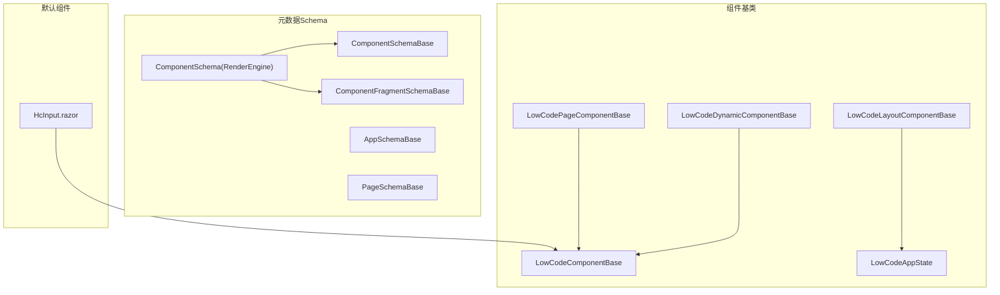
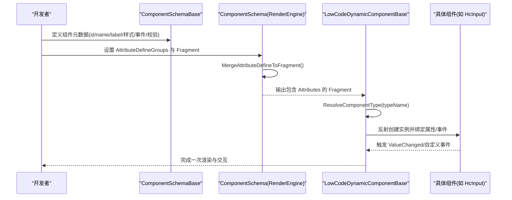
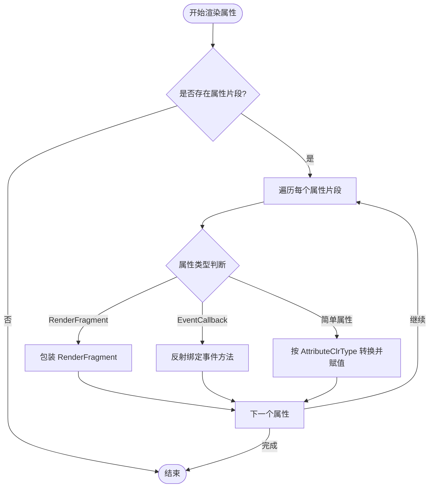
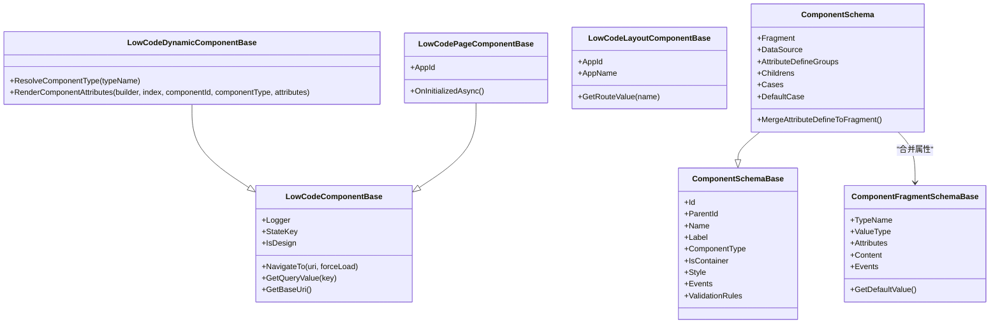

# 自定义组件开发

<cite>
**本文引用的文件**   
- [LowCodeComponentBase.cs](file://src/LowCode/Common/H.LowCode.ComponentBase/LowCodeComponentBase.cs)
- [LowCodeDynamicComponentBase.cs](file://src/LowCode/Common/H.LowCode.ComponentBase/LowCodeDynamicComponentBase.cs)
- [LowCodeLayoutComponentBase.cs](file://src/LowCode/Common/H.LowCode.ComponentBase/LowCodeLayoutComponentBase.cs)
- [LowCodePageComponentBase.cs](file://src/LowCode/Common/H.LowCode.ComponentBase/LowCodePageComponentBase.cs)
- [LowCodeAppState.cs](file://src/LowCode/Common/H.LowCode.ComponentBase/LowCodeAppState.cs)
- [ComponentSchemaBase.cs](file://src/LowCode/Common/H.LowCode.MetaSchema/ComponentSchemaBase.cs)
- [AppSchemaBase.cs](file://src/LowCode/Common/H.LowCode.MetaSchema/AppSchemaBase.cs)
- [PageSchemaBase.cs](file://src/LowCode/Common/H.LowCode.MetaSchema/PageSchemaBase.cs)
- [ComponentFragmentSchemaBase.cs](file://src/LowCode/Common/H.LowCode.MetaSchema/PropertySchemas/ComponentFragmentSchemaBase.cs)
- [ComponentSchema.cs](file://src/LowCode/Common/H.LowCode.MetaSchema.RenderEngine/ComponentSchema.cs)
- [HcInput.razor](file://src/LowCode/Common/H.LowCode.Components.Defaults/Components/HcInput.razor)
</cite>

## 目录
1. [引言](#引言)
2. [项目结构](#项目结构)
3. [核心组件](#核心组件)
4. [架构总览](#架构总览)
5. [详细组件分析](#详细组件分析)
6. [依赖关系分析](#依赖关系分析)
7. [性能考量](#性能考量)
8. [故障排查指南](#故障排查指南)
9. [结论](#结论)
10. [附录](#附录)

## 引言
本文件面向在 AppLab 平台进行自定义组件开发的工程师与低代码设计师，系统讲解如何基于 LowCodeComponentBase 基类构建可配置、可事件驱动、支持状态管理的 Blazor 组件。文档涵盖：
- 基类使用方式：属性注入、导航、JS 交互、日志、设计态判断等
- 组件元数据 Schema 定义：属性类型、默认值、验证规则、事件与数据源
- 动态组件渲染与注册机制：类型解析、旧版兼容映射、属性与事件绑定
- 从简单输入到复杂业务组件的完整示例路径
- 测试与调试最佳实践

## 项目结构
AppLab 的低代码能力集中在 src/LowCode 目录下，其中与自定义组件开发最相关的模块包括：
- H.LowCode.ComponentBase：组件基类与运行时状态
- H.LowCode.MetaSchema：组件与页面元数据模型（Schema）
- H.LowCode.MetaSchema.RenderEngine：渲染期 Schema 扩展（Fragment、AttributeDefine 合并）
- H.LowCode.Components.Defaults：内置默认组件（如 HcInput），可作为参考实现

图表来源
- [LowCodeComponentBase.cs:1-73](file://src/LowCode/Common/H.LowCode.ComponentBase/LowCodeComponentBase.cs#L1-L73)
- [LowCodeDynamicComponentBase.cs:1-187](file://src/LowCode/Common/H.LowCode.ComponentBase/LowCodeDynamicComponentBase.cs#L1-L187)
- [LowCodeLayoutComponentBase.cs:1-66](file://src/LowCode/Common/H.LowCode.ComponentBase/LowCodeLayoutComponentBase.cs#L1-L66)
- [LowCodePageComponentBase.cs:1-22](file://src/LowCode/Common/H.LowCode.ComponentBase/LowCodePageComponentBase.cs#L1-L22)
- [LowCodeAppState.cs:1-21](file://src/LowCode/Common/H.LowCode.ComponentBase/LowCodeAppState.cs#L1-L21)
- [ComponentSchemaBase.cs:1-104](file://src/LowCode/Common/H.LowCode.MetaSchema/ComponentSchemaBase.cs#L1-L104)
- [AppSchemaBase.cs:1-32](file://src/LowCode/Common/H.LowCode.MetaSchema/AppSchemaBase.cs#L1-L32)
- [PageSchemaBase.cs:1-40](file://src/LowCode/Common/H.LowCode.MetaSchema/PageSchemaBase.cs#L1-L40)
- [ComponentFragmentSchemaBase.cs:1-51](file://src/LowCode/Common/H.LowCode.MetaSchema/PropertySchemas/ComponentFragmentSchemaBase.cs#L1-L51)
- [ComponentSchema.cs:1-83](file://src/LowCode/Common/H.LowCode.MetaSchema.RenderEngine/ComponentSchema.cs#L1-L83)
- [HcInput.razor:1-54](file://src/LowCode/Common/H.LowCode.Components.Defaults/Components/HcInput.razor#L1-L54)

章节来源
- [LowCodeComponentBase.cs:1-73](file://src/LowCode/Common/H.LowCode.ComponentBase/LowCodeComponentBase.cs#L1-L73)
- [ComponentSchemaBase.cs:1-104](file://src/LowCode/Common/H.LowCode.MetaSchema/ComponentSchemaBase.cs#L1-L104)
- [ComponentFragmentSchemaBase.cs:1-51](file://src/LowCode/Common/H.LowCode.MetaSchema/PropertySchemas/ComponentFragmentSchemaBase.cs#L1-L51)
- [ComponentSchema.cs:1-83](file://src/LowCode/Common/H.LowCode.MetaSchema.RenderEngine/ComponentSchema.cs#L1-L83)
- [HcInput.razor:1-54](file://src/LowCode/Common/H.LowCode.Components.Defaults/Components/HcInput.razor#L1-L54)

## 核心组件
本节聚焦于自定义组件开发的核心基类与状态管理：
- LowCodeComponentBase：提供日志、导航、JS 调用、查询参数读取、设计态判断、消息提示等通用能力
- LowCodeDynamicComponentBase：负责根据元数据动态解析并渲染组件类型，处理属性、事件回调与 RenderFragment
- LowCodeLayoutComponentBase：布局组件基类，提供路由参数获取与应用信息
- LowCodePageComponentBase：页面级基类，提供 AppId 参数与生命周期钩子
- LowCodeAppState：全局设计态标识，用于区分设计器与运行环境

关键要点
- 通过依赖注入获取 NavigationManager、IJSRuntime、ILoggerFactory
- IsDesign 由 LowCodeAppState.IsDesign 决定，便于在设计器中差异化渲染
- NavigateTo、GetQueryValue、GetBaseUri 简化常见操作
- LowCodeMessageService 封装 JS alert 提示，统一错误/警告/成功反馈

章节来源
- [LowCodeComponentBase.cs:1-73](file://src/LowCode/Common/H.LowCode.ComponentBase/LowCodeComponentBase.cs#L1-L73)
- [LowCodeDynamicComponentBase.cs:1-187](file://src/LowCode/Common/H.LowCode.ComponentBase/LowCodeDynamicComponentBase.cs#L1-L187)
- [LowCodeLayoutComponentBase.cs:1-66](file://src/LowCode/Common/H.LowCode.ComponentBase/LowCodeLayoutComponentBase.cs#L1-L66)
- [LowCodePageComponentBase.cs:1-22](file://src/LowCode/Common/H.LowCode.ComponentBase/LowCodePageComponentBase.cs#L1-L22)
- [LowCodeAppState.cs:1-21](file://src/LowCode/Common/H.LowCode.ComponentBase/LowCodeAppState.cs#L1-L21)

## 架构总览
下图展示了自定义组件从“元数据 Schema”到“运行时渲染”的关键流程：
- 设计期：通过 ComponentSchemaBase 描述组件实例、样式、事件、校验规则等
- 渲染期：ComponentSchema 将 AttributeDefineGroups 合并为 Fragment.Attributes，供动态渲染
- 动态渲染：LowCodeDynamicComponentBase 解析类型名（含旧版 AntDesign 兼容映射），按属性类型分别处理（简单属性、EventCallback、RenderFragment）

图表来源
- [ComponentSchemaBase.cs:1-104](file://src/LowCode/Common/H.LowCode.MetaSchema/ComponentSchemaBase.cs#L1-L104)
- [ComponentSchema.cs:1-83](file://src/LowCode/Common/H.LowCode.MetaSchema.RenderEngine/ComponentSchema.cs#L1-L83)
- [LowCodeDynamicComponentBase.cs:1-187](file://src/LowCode/Common/H.LowCode.ComponentBase/LowCodeDynamicComponentBase.cs#L1-L187)
- [HcInput.razor:1-54](file://src/LowCode/Common/H.LowCode.Components.Defaults/Components/HcInput.razor#L1-L54)

## 详细组件分析

### LowCodeComponentBase 基类使用指南
- 依赖注入
  - NavigationManager：用于页面跳转与基础 URI 获取
  - IJSRuntime：用于调用前端 JS（如消息提示）
  - ILoggerFactory：按组件类型生成独立日志记录器
- 设计态判断
  - IsDesign 属性来源于 LowCodeAppState.IsDesign，可在组件内控制设计器专属逻辑
- 常用工具方法
  - NavigateTo(uri, forceLoad)：跳转指定路由
  - GetQueryValue(key)：解析当前 URL 查询参数
  - GetBaseUri()：获取应用基础 URI
- 消息提示
  - Message.SuccessAsync/ErrorAsync/WarningAsync/InfoAsync：统一通过 JS alert 展示

章节来源
- [LowCodeComponentBase.cs:1-73](file://src/LowCode/Common/H.LowCode.ComponentBase/LowCodeComponentBase.cs#L1-L73)
- [LowCodeAppState.cs:1-21](file://src/LowCode/Common/H.LowCode.ComponentBase/LowCodeAppState.cs#L1-L21)

### LowCodeDynamicComponentBase 动态渲染与属性绑定
- 类型解析与兼容映射
  - ResolveComponentType(typeName)：优先直接解析；若以 “AntDesign.” 开头则回退到 Hc 组件映射字典
  - 内置映射覆盖 Input、Select、RadioGroup、DatePicker、Tabs、Card、Button、Upload 等常用控件
- 属性渲染策略
  - RenderComponentAttributes：遍历属性片段，逐个渲染
  - RenderComponentAttribute：区分三类属性
    - RenderFragment：包装 ChildContent 内容
    - EventCallback：通过反射查找同名方法并创建委托
    - 简单属性：根据 AttributeClrType 转换 AttributeValue 后赋值
- 兼容性保障
  - 当属性值为空或类型无法解析时，记录警告并跳过，避免整页崩溃

图表来源
- [LowCodeDynamicComponentBase.cs:1-187](file://src/LowCode/Common/H.LowCode.ComponentBase/LowCodeDynamicComponentBase.cs#L1-L187)

章节来源
- [LowCodeDynamicComponentBase.cs:1-187](file://src/LowCode/Common/H.LowCode.ComponentBase/LowCodeDynamicComponentBase.cs#L1-L187)

### 组件元数据 Schema 定义规范
- ComponentSchemaBase：描述组件实例的基本信息与行为
  - Id、ParentId、Name、Label、ComponentType、IsHiddenLabel、IsContainer、IsInnerContainer
  - Style：样式配置
  - Events、EventConsumes：事件定义与消费
  - ValidationRules：校验规则列表
  - Description、Version：描述与版本
- PageSchemaBase：页面级元数据
  - AppId、Id、Name、Order、PageType、PublishStatus
  - PageProperty：页面属性
  - DataSource：页面数据源
  - Events：页面事件
- AppSchemaBase：应用级元数据
  - Id、Name、Icon、Picture、Description、Order、Version、PublishStatus、SupportPlatforms

章节来源
- [ComponentSchemaBase.cs:1-104](file://src/LowCode/Common/H.LowCode.MetaSchema/ComponentSchemaBase.cs#L1-L104)
- [PageSchemaBase.cs:1-40](file://src/LowCode/Common/H.LowCode.MetaSchema/PageSchemaBase.cs#L1-L40)
- [AppSchemaBase.cs:1-32](file://src/LowCode/Common/H.LowCode.MetaSchema/AppSchemaBase.cs#L1-L32)

### 属性定义与默认值（Fragment 与 AttributeDefine）
- ComponentFragmentSchemaBase：描述组件实例的属性片段
  - TypeName、ValueType、Attributes、Content、Events
  - GetDefaultValue()：根据 ValueType 返回默认值
- ComponentAttributeFragmentSchema：单个属性的片段
  - AttributeName、AttributeClrType、AttributeValue
- ComponentSchema（渲染期）：将 AttributeDefineGroups 合并为 Fragment.Attributes
  - MergeAttributeDefineToFragment()：把定义组的属性定义转换为片段属性，便于渲染

章节来源
- [ComponentFragmentSchemaBase.cs:1-51](file://src/LowCode/Common/H.LowCode.MetaSchema/PropertySchemas/ComponentFragmentSchemaBase.cs#L1-L51)
- [ComponentSchema.cs:1-83](file://src/LowCode/Common/H.LowCode.MetaSchema.RenderEngine/ComponentSchema.cs#L1-L83)

### 示例：从零到一开发一个输入组件
- 参考实现：HcInput.razor
  - 参数：Placeholder、Disabled、MaxLength、ReadOnly、AllowClear、Value、ValueChanged、Style
  - 内部状态：_value
  - 生命周期：OnParametersSet 同步外部 Value
  - 事件：OnInputHandler/OnChangeHandler/ClearValue 均触发 ValueChanged
- 开发步骤建议
  - 定义组件参数与事件回调
  - 维护内部状态并在参数变化时同步
  - 在用户交互中更新状态并触发 ValueChanged
  - 通过 ComponentSchemaBase 声明组件元数据（名称、标签、样式、事件、校验规则）
  - 通过 ComponentSchema.AttributeDefineGroups 声明属性定义组，并在渲染期合并到 Fragment.Attributes

章节来源
- [HcInput.razor:1-54](file://src/LowCode/Common/H.LowCode.Components.Defaults/Components/HcInput.razor#L1-L54)
- [ComponentSchemaBase.cs:1-104](file://src/LowCode/Common/H.LowCode.MetaSchema/ComponentSchemaBase.cs#L1-L104)
- [ComponentSchema.cs:1-83](file://src/LowCode/Common/H.LowCode.MetaSchema.RenderEngine/ComponentSchema.cs#L1-L83)

### 示例：复杂业务组件（条件渲染与容器）
- 条件渲染
  - ComponentSchema.Cases：键为条件值字符串，值为对应子组件配置
  - ComponentSchema.DefaultCase：未匹配时的默认分支
- 容器组件
  - ComponentSchemaBase.IsContainer：标记为容器组件
  - 子组件通过 Childrens 数组组织层级结构
- 数据源
  - ComponentSchema.DataSource：组件级数据源配置
  - PageSchemaBase.DataSource：页面级数据源配置

章节来源
- [ComponentSchema.cs:1-83](file://src/LowCode/Common/H.LowCode.MetaSchema.RenderEngine/ComponentSchema.cs#L1-L83)
- [ComponentSchemaBase.cs:1-104](file://src/LowCode/Common/H.LowCode.MetaSchema/ComponentSchemaBase.cs#L1-L104)
- [PageSchemaBase.cs:1-40](file://src/LowCode/Common/H.LowCode.MetaSchema/PageSchemaBase.cs#L1-L40)

## 依赖关系分析
- 基类继承关系
  - LowCodeDynamicComponentBase 与 LowCodePageComponentBase 均继承自 LowCodeComponentBase
  - LowCodeLayoutComponentBase 继承自 LayoutComponentBase，并依赖 LowCodeAppState
- 元数据依赖
  - ComponentSchema（渲染期）依赖 ComponentSchemaBase（基础元数据）与 ComponentFragmentSchemaBase（属性片段）
- 组件实现依赖
  - HcInput.razor 作为默认组件，体现标准参数与事件模式，供动态渲染框架绑定

图表来源
- [LowCodeComponentBase.cs:1-73](file://src/LowCode/Common/H.LowCode.ComponentBase/LowCodeComponentBase.cs#L1-L73)
- [LowCodeDynamicComponentBase.cs:1-187](file://src/LowCode/Common/H.LowCode.ComponentBase/LowCodeDynamicComponentBase.cs#L1-L187)
- [LowCodePageComponentBase.cs:1-22](file://src/LowCode/Common/H.LowCode.ComponentBase/LowCodePageComponentBase.cs#L1-L22)
- [LowCodeLayoutComponentBase.cs:1-66](file://src/LowCode/Common/H.LowCode.ComponentBase/LowCodeLayoutComponentBase.cs#L1-L66)
- [ComponentSchemaBase.cs:1-104](file://src/LowCode/Common/H.LowCode.MetaSchema/ComponentSchemaBase.cs#L1-L104)
- [ComponentSchema.cs:1-83](file://src/LowCode/Common/H.LowCode.MetaSchema.RenderEngine/ComponentSchema.cs#L1-L83)
- [ComponentFragmentSchemaBase.cs:1-51](file://src/LowCode/Common/H.LowCode.MetaSchema/PropertySchemas/ComponentFragmentSchemaBase.cs#L1-L51)

章节来源
- [LowCodeComponentBase.cs:1-73](file://src/LowCode/Common/H.LowCode.ComponentBase/LowCodeComponentBase.cs#L1-L73)
- [LowCodeDynamicComponentBase.cs:1-187](file://src/LowCode/Common/H.LowCode.ComponentBase/LowCodeDynamicComponentBase.cs#L1-L187)
- [ComponentSchemaBase.cs:1-104](file://src/LowCode/Common/H.LowCode.MetaSchema/ComponentSchemaBase.cs#L1-L104)
- [ComponentSchema.cs:1-83](file://src/LowCode/Common/H.LowCode.MetaSchema.RenderEngine/ComponentSchema.cs#L1-L83)

## 性能考量
- 动态类型解析
  - ResolveComponentType 使用 Type.GetType 并附带兼容映射，应避免频繁重复解析，可在上层缓存结果
- 属性渲染
  - RenderComponentAttribute 对每属性进行反射查找与类型转换，建议在批量渲染时减少不必要的反射开销
- 设计态判断
  - IsDesign 每次访问都会读取 LowCodeAppState.IsDesign，若频繁使用可考虑局部缓存
- 事件绑定
  - EventCallback 通过 Delegate.CreateDelegate 创建委托，注意避免在高频渲染路径中重复创建

[本节为通用指导，不直接分析具体文件]

## 故障排查指南
- 组件类型无法解析
  - 检查 typeName 是否为空或以 “AntDesign.” 开头且不在兼容映射表中
  - 确认程序集引用与命名空间正确
- 属性为空或类型不匹配
  - 查看 RenderComponentSimpleAttribute 中对 AttributeClrType 的解析与转换
  - 确保 AttributeValue 与 AttributeClrType 一致
- 事件回调未绑定
  - 确认组件中存在与 AttributeValue 同名的公共/私有方法
  - 检查方法签名是否匹配 EventCallback
- 设计态异常
  - 检查 LowCodeAppState.IsDesign 是否正确注入与初始化
- 日志定位
  - 使用 Logger.LogWarning 打印关键上下文（componentId、属性名、类型等）

章节来源
- [LowCodeDynamicComponentBase.cs:1-187](file://src/LowCode/Common/H.LowCode.ComponentBase/LowCodeDynamicComponentBase.cs#L1-L187)
- [LowCodeComponentBase.cs:1-73](file://src/LowCode/Common/H.LowCode.ComponentBase/LowCodeComponentBase.cs#L1-L73)

## 结论
通过 LowCodeComponentBase 及其派生类，AppLab 提供了统一的组件基座与动态渲染能力。结合 ComponentSchemaBase 与渲染期扩展，开发者可以以声明式的方式定义组件元数据，并通过 AttributeDefineGroups 与 Fragment 机制完成属性与事件的自动绑定。遵循本文档的规范与实践，可以快速构建从简单输入到复杂业务组件的全套自定义组件生态。

## 附录
- 快速上手清单
  - 新建组件 Razor 文件，定义参数与事件回调
  - 在 OnParametersSet 中同步外部值
  - 在用户交互中更新内部状态并触发事件
  - 使用 ComponentSchemaBase 声明组件元数据（名称、标签、样式、事件、校验）
  - 使用 ComponentSchema.AttributeDefineGroups 声明属性定义组，并在渲染期合并
  - 如需动态渲染，确保类型名正确并可被 ResolveComponentType 解析
- 推荐参考组件
  - HcInput.razor：标准输入组件的实现范式

[本节为补充说明，不直接分析具体文件]