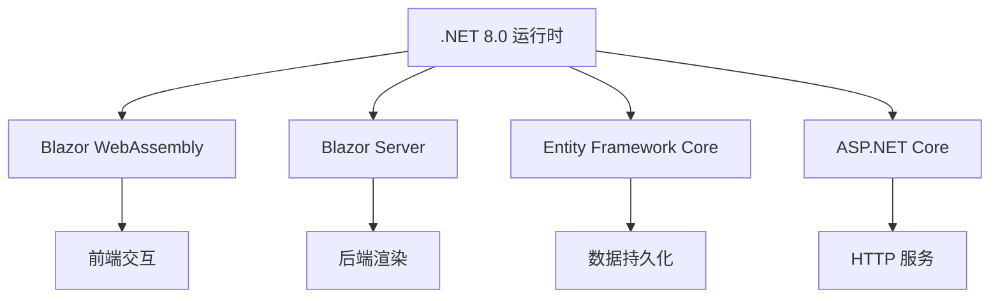
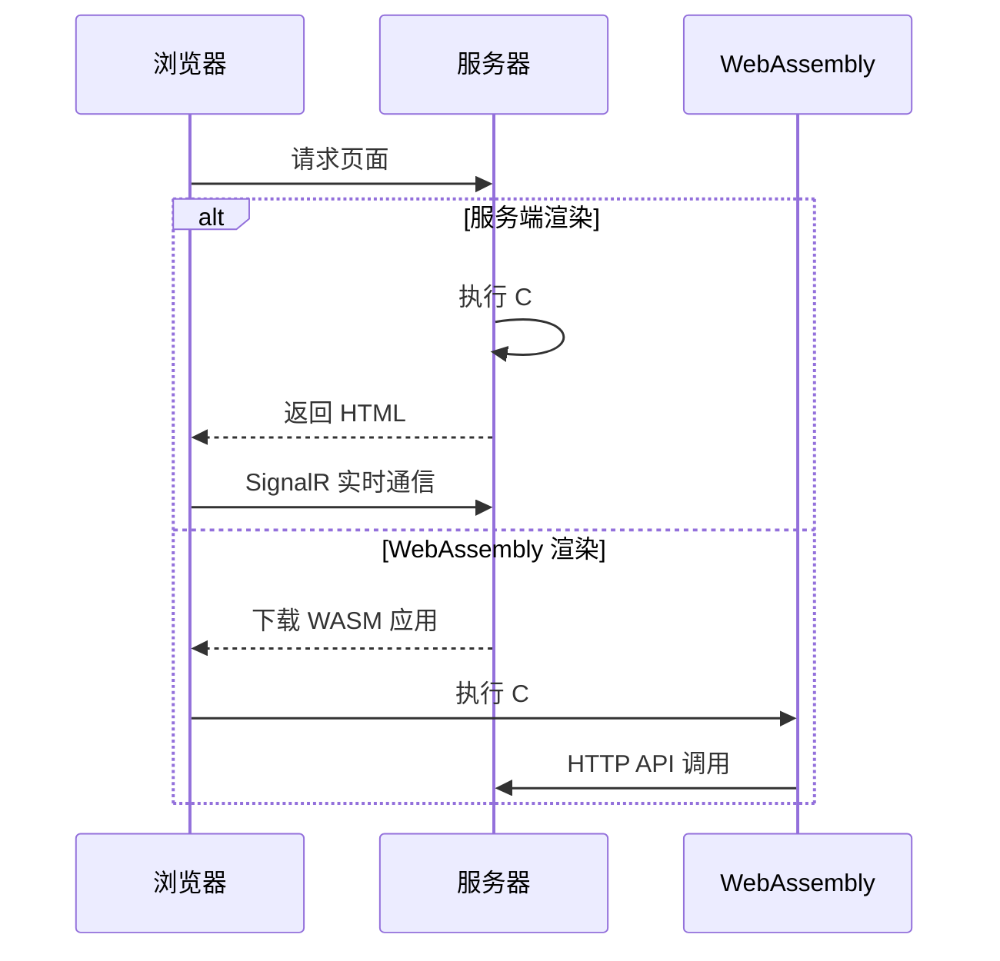
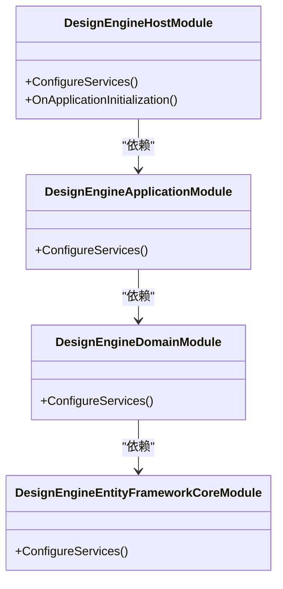
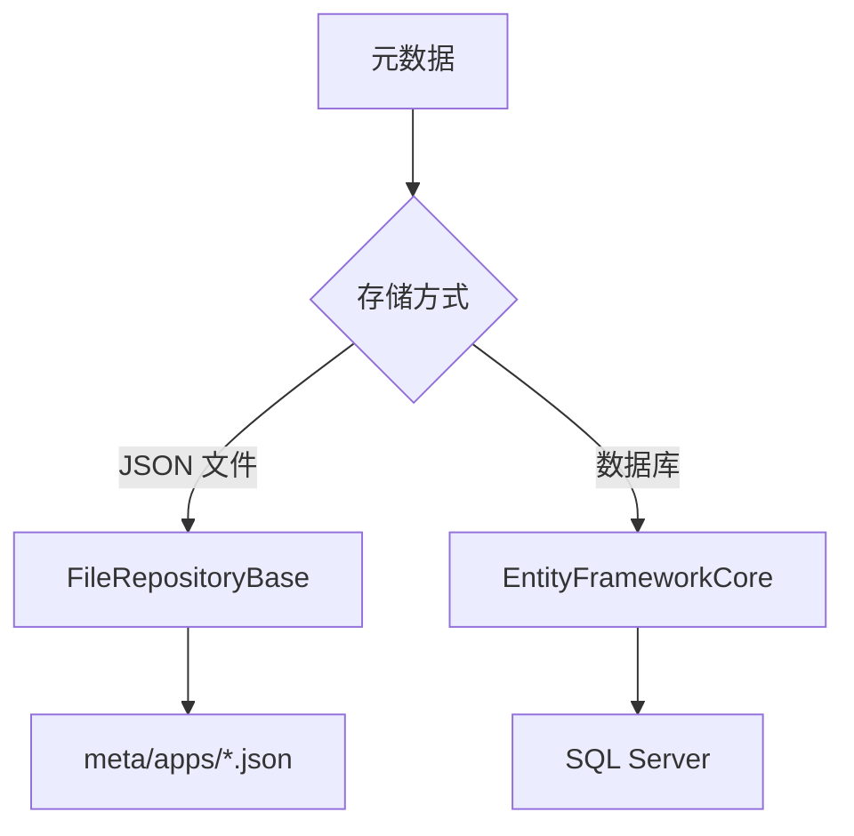

# 技术栈与依赖

<cite>
**本文档引用的文件**  
- [README.md](file://README.md)
- [global.json](file://global.json)
- [Program.cs](file://src/DesignEngine/H.LowCode.DesignEngine.Host/Program.cs)
- [DesignEngineDbContext.cs](file://src/DesignEngine/H.LowCode.DesignEngine.EntityFrameworkCore/EntityFrameworkCore/DesignEngineDbContext.cs)
- [RenderEngineDbContext.cs](file://src/RenderEngine/H.LowCode.RenderEngine.EntityFrameworkCore/EntityFrameworkCore/RenderEngineDbContext.cs)
- [MetaOption.cs](file://src/Common/H.LowCode.Configuration/Options/MetaOption.cs)
- [AppSchema.cs](file://src/Common/H.LowCode.MetaSchema/RenderEngine/AppSchema.cs)
- [PageSchemaBase.cs](file://src/Common/H.LowCode.MetaSchema/PageSchemaBase.cs)
- [elementUtils.js](file://src/DesignEngine/H.LowCode.DesignEngineBase/wwwroot/js/elementUtils.js)
- [appsettings.json](file://src/DesignEngine/H.LowCode.DesignEngine.Host/appsettings.json)
</cite>

## 目录
1. [技术栈概览](#技术栈概览)  
2. [核心框架与技术分析](#核心框架与技术分析)  
   2.1 [.NET 8.0 运行时环境](#net-80-运行时环境)  
   2.2 [Blazor 框架](#blazor-框架)  
   2.3 [Entity Framework Core 数据访问机制](#entity-framework-core-数据访问机制)  
   2.4 [Volo.Abp 模块化架构](#voloabp-模块化架构)  
3. [主要 NuGet 包与版本](#主要-nuget-包与版本)  
4. [元数据持久化方式的技术权衡](#元数据持久化方式的技术权衡)  
5. [前端样式与 JavaScript 互操作](#前端样式与-javascript-互操作)  
6. [构建工具链与环境兼容性](#构建工具链与环境兼容性)  

## 技术栈概览

本项目是一个基于 .NET 8.0 和 Blazor 的低代码实验性平台，采用模块化设计，支持元数据驱动的应用构建。项目结构清晰，分为设计引擎（DesignEngine）和渲染引擎（RenderEngine）两大核心模块，分别负责可视化设计和运行时渲染。系统通过 Volo.Abp 框架实现模块化、依赖注入和领域服务管理，结合 Entity Framework Core 实现动态数据模型的持久化，并支持 JSON 文件和数据库两种元数据存储方式。

**Section sources**  
- [README.md](file://README.md)
- [global.json](file://global.json)

## 核心框架与技术分析

### .NET 8.0 运行时环境

项目明确基于 .NET 8.0 构建，尽管 `global.json` 文件中指定的 SDK 版本为 9.0.100，但这通常表示开发环境的最新预览版，而项目实际目标框架仍为 .NET 8.0。.NET 8.0 作为长期支持（LTS）版本，提供了卓越的性能、现代化的 API 和对云原生应用的全面支持。

.NET 8.0 的优势包括：
- **性能提升**：JIT 编译器和 GC 的优化显著提升了应用吞吐量和响应速度。
- **统一平台**：支持跨平台（Windows、Linux、macOS）部署，便于 DevOps 和容器化。
- **现代化开发体验**：集成 Minimal APIs、源生成器（Source Generators）等特性，简化开发流程。
- **安全性与稳定性**：作为 LTS 版本，获得长期安全更新和技术支持。

项目通过 `WebApplication.CreateBuilder` 创建应用，利用了 .NET 8.0 对 ASP.NET Core 的现代化配置模型。



**Diagram sources**  
- [global.json](file://global.json)
- [Program.cs](file://src/DesignEngine/H.LowCode.DesignEngine.Host/Program.cs)

**Section sources**  
- [global.json](file://global.json)
- [Program.cs](file://src/DesignEngine/H.LowCode.DesignEngine.Host/Program.cs)

### Blazor 框架

Blazor 框架是本项目实现前后端统一开发的核心。项目采用了 Blazor 的混合渲染模式（Hybrid Rendering），在 `Program.cs` 中通过 `.AddInteractiveServerComponents()` 和 `.AddInteractiveWebAssemblyComponents()` 同时注册了服务端和 WebAssembly 渲染模式。

这种架构的优势在于：
- **灵活性**：关键页面可使用服务端渲染保证性能，复杂交互页面可使用 WebAssembly 实现富客户端体验。
- **代码复用**：C# 代码可在前后端共享，减少技术栈分裂。
- **无缝集成**：通过 `LowCodeGlobalVariables.AdditionalAssemblies` 动态加载额外程序集，实现了模块的热插拔。

项目中的 `.razor.css` 文件（如 `DragItem.razor.css`）表明使用了 CSS 隔离（CSS Isolation）技术，确保组件样式不会相互污染。



**Diagram sources**  
- [Program.cs](file://src/DesignEngine/H.LowCode.DesignEngine.Host/Program.cs)
- [DragItem.razor.css](file://src/DesignEngine/H.LowCode.DesignEngine/ComponentPanel/DragItem.razor.css)

**Section sources**  
- [Program.cs](file://src/DesignEngine/H.LowCode.DesignEngine.Host/Program.cs)

### Entity Framework Core 数据访问机制

Entity Framework Core (EF Core) 在本项目中扮演着动态数据访问的核心角色。通过 `DesignEngineDbContext` 和 `RenderEngineDbContext` 两个上下文，实现了对动态实体的 CRUD 操作。

核心实现机制如下：
1. **动态实体映射**：`EntityTypeManager` 负责加载动态实体定义，`OnModelCreating` 方法中通过反射动态创建 `EntityTypeBuilder`，将 `DynamicEntityInfo` 映射到数据库表。
2. **属性配置**：`ConfigureProperties` 方法根据字段元数据（如 `MaxLength`、`IsUnicode`、`Precision`）配置 EF Core 的属性映射。
3. **逻辑删除**：通过 `HasQueryFilter` 实现软删除，自动过滤 `IsDeleted=0` 的记录。
4. **拦截器**：使用 `QueryWithNoLockDbCommandInterceptor` 实现 `WITH(NOLOCK)` 查询提示，`ReadOnlySaveChangesInterceptor` 控制保存行为。

```csharp
// 简化后的核心代码示例
protected override void OnModelCreating(ModelBuilder modelBuilder)
{
    var dynamicEntities = _entityTypeManager.LoadDynamicEntities();
    foreach (var entity in dynamicEntities)
    {
        var entityBuilder = modelBuilder.Entity(entity.EntityType).ToTable(entity.EntityName);
        ConfigureProperties(entityBuilder, entity, entity.EntityType);
        entityBuilder.HasKey(entity.PrimaryKey);
        if (entity.EnableSoftDelete)
        {
            entityBuilder.HasQueryFilter(e => e.IsDeleted == false);
        }
    }
}
```

**Section sources**  
- [DesignEngineDbContext.cs](file://src/DesignEngine/H.LowCode.DesignEngine.EntityFrameworkCore/EntityFrameworkCore/DesignEngineDbContext.cs)
- [RenderEngineDbContext.cs](file://src/RenderEngine/H.LowCode.RenderEngine.EntityFrameworkCore/EntityFrameworkCore/RenderEngineDbContext.cs)

### Volo.Abp 模块化架构

虽然代码中未直接出现 Volo.Abp 的命名空间，但从模块命名（如 `*Module.cs`）、分层结构（Application、Domain、EntityFrameworkCore）和依赖注入模式来看，项目明显采用了 Volo.Abp 的模块化设计理念。

关键应用包括：
- **模块化**：每个功能（如 `H.LowCode.DesignEngine`）都是一个独立模块，通过 `*Module.cs` 定义生命周期。
- **依赖注入**：使用 Autofac 作为 DI 容器（`builder.Host.UseAutofac()`），通过 `AddApplicationAsync<T>()` 注册模块服务。
- **领域服务**：`Domain` 层包含 `*DomainService.cs` 和 `I*DomainService.cs` 接口，遵循领域驱动设计（DDD）。
- **仓储模式**：`Repositories` 层定义了 `I*Repository` 接口，实现了数据访问的抽象。



**Diagram sources**  
- [DesignEngineHostModule.cs](file://src/DesignEngine/H.LowCode.DesignEngine.Host/DesignEngineHostModule.cs)
- [DesignEngineApplicationModule.cs](file://src/DesignEngine/H.LowCode.DesignEngine.Application/DesignEngineApplicationModule.cs)

**Section sources**  
- [Program.cs](file://src/DesignEngine/H.LowCode.DesignEngine.Host/Program.cs)
- [DesignEngineHostModule.cs](file://src/DesignEngine/H.LowCode.DesignEngine.Host/DesignEngineHostModule.cs)

## 主要 NuGet 包与版本

尽管无法直接读取 `.csproj` 文件，但根据代码实现和项目结构，可以推断出以下主要 NuGet 包及其作用：

| 包名称 | 推断版本 | 作用 |
|--------|----------|------|
| Microsoft.AspNetCore.Components.Web | .NET 8.0 | Blazor 核心组件 |
| Microsoft.EntityFrameworkCore | 8.0.x | ORM 数据访问 |
| Microsoft.EntityFrameworkCore.SqlServer | 8.0.x | SQL Server 数据库提供程序 |
| Autofac | 7.0.x | 依赖注入容器 |
| System.Text.Json | 8.0.x | JSON 序列化 |
| Microsoft.AspNetCore.ResponseCompression | 8.0.x | 响应压缩（Brotli） |

架构考量：选择这些包是为了与 .NET 8.0 生态无缝集成，确保性能和稳定性。例如，使用 Autofac 是为了支持更复杂的 DI 场景，而 Brotli 压缩则优化了 WebAssembly 应用的加载速度。

**Section sources**  
- [Program.cs](file://src/DesignEngine/H.LowCode.DesignEngine.Host/Program.cs)
- [DesignEngineDbContext.cs](file://src/DesignEngine/H.LowCode.DesignEngine.EntityFrameworkCore/EntityFrameworkCore/DesignEngineDbContext.cs)

## 元数据持久化方式的技术权衡

项目支持两种元数据持久化方式：JSON 文件存储和数据库存储（通过 EF Core）。

### JSON 文件存储
- **优点**：
  - 简单轻量，无需数据库依赖。
  - 易于版本控制和备份（如 `meta/apps/caseapp/page/*.json`）。
  - 适合小型应用或开发环境。
- **缺点**：
  - 并发写入可能导致冲突。
  - 查询和索引能力弱。
  - 不适合大规模数据。

### 数据库存储
- **优点**：
  - 支持 ACID 事务，数据一致性高。
  - 强大的查询和索引能力。
  - 支持复杂关系和外键约束。
  - 适合生产环境和大型应用。
- **缺点**：
  - 部署复杂，需要数据库服务器。
  - 迁移和维护成本高。

项目通过 `Repository.JsonFile` 和 `Repository.RemoteService` 模块实现了两种方式的抽象，可在 `appsettings.json` 中配置切换。



**Diagram sources**  
- [FileRepositoryBase.cs](file://src/DesignEngine/H.LowCode.DesignEngine.Repository.JsonFile/Base/FileRepositoryBase.cs)
- [DesignEngineDbContext.cs](file://src/DesignEngine/H.LowCode.DesignEngine.EntityFrameworkCore/EntityFrameworkCore/DesignEngineDbContext.cs)

**Section sources**  
- [FileRepositoryBase.cs](file://src/DesignEngine/H.LowCode.DesignEngine.Repository.JsonFile/Base/FileRepositoryBase.cs)
- [DesignEngineDbContext.cs](file://src/DesignEngine/H.LowCode.DesignEngine.EntityFrameworkCore/EntityFrameworkCore/DesignEngineDbContext.cs)

## 前端样式与 JavaScript 互操作

### 前端样式处理
项目采用 CSS 隔离技术，每个 Razor 组件可拥有独立的 `.razor.css` 文件。例如，`DragItem.razor.css` 专门定义拖拽项的样式，避免全局污染。主题模块 `H.LowCode.Themes.AntBlazor` 表明使用了 Ant Design Blazor 组件库，通过 `ComponentRender.razor.css` 进行样式定制。

### JavaScript 互操作
项目包含 `elementUtils.js` 文件，用于实现 Blazor 与 JavaScript 的互操作。典型应用场景包括：
- DOM 操作：直接操作元素尺寸、位置。
- 浏览器 API 调用：访问本地存储、通知等。
- 性能敏感操作：如复杂动画。

在 C# 中通过 `IJSRuntime` 调用：
```csharp
await jsRuntime.InvokeVoidAsync("elementUtils.resize", element, width, height);
```

**Section sources**  
- [DragItem.razor.css](file://src/DesignEngine/H.LowCode.DesignEngine/ComponentPanel/DragItem.razor.css)
- [elementUtils.js](file://src/DesignEngine/H.LowCode.DesignEngineBase/wwwroot/js/elementUtils.js)
- [ComponentRender.razor.css](file://src/RenderEngine/H.LowCode.Themes.AntBlazor/ComponentRender/ComponentRender.razor.css)

## 构建工具链与环境兼容性

### 构建工具链
- **迁移管理**：使用 `H.LowCode.DbMigrator` 项目和 `dotnet ef` 命令管理数据库迁移。
- **配置**：`appsettings.json` 和 `appsettings.Development.json` 分别管理生产和开发配置。
- **启动配置**：`Program.cs` 使用现代化的主机配置，集成响应压缩、HTTPS 重定向等。

### 环境兼容性矩阵

| 类别 | 支持项 |
|------|--------|
| **操作系统** | Windows 10/11, Linux (Ubuntu 20.04+), macOS |
| **浏览器** | Chrome, Edge, Firefox, Safari (最新两个版本) |
| **开发工具** | Visual Studio 2022, Visual Studio Code, .NET SDK 8.0+ |

**Section sources**  
- [Program.cs](file://src/DesignEngine/H.LowCode.DesignEngine.Host/Program.cs)
- [appsettings.json](file://src/DesignEngine/H.LowCode.DesignEngine.Host/appsettings.json)
- [DbMigrator](file://src/Tools/H.LowCode.DbMigrator)