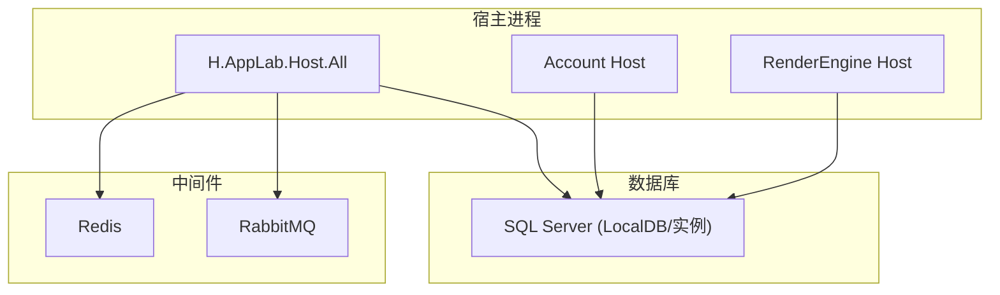
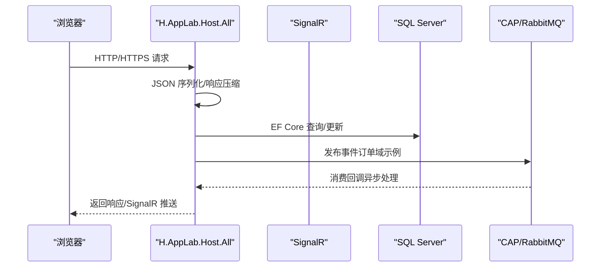
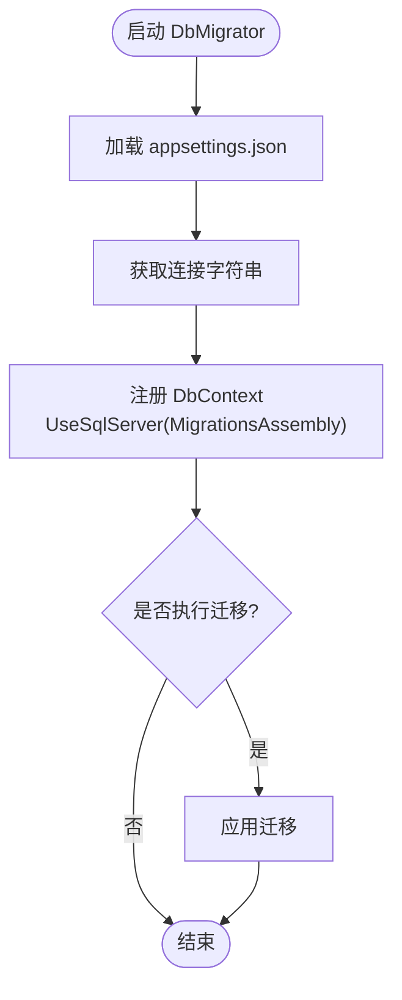
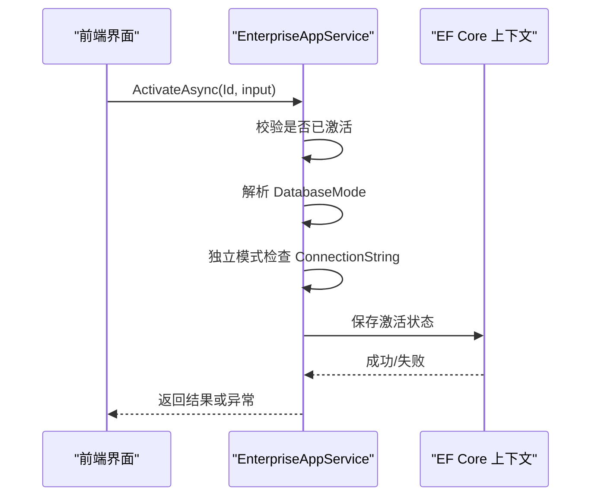
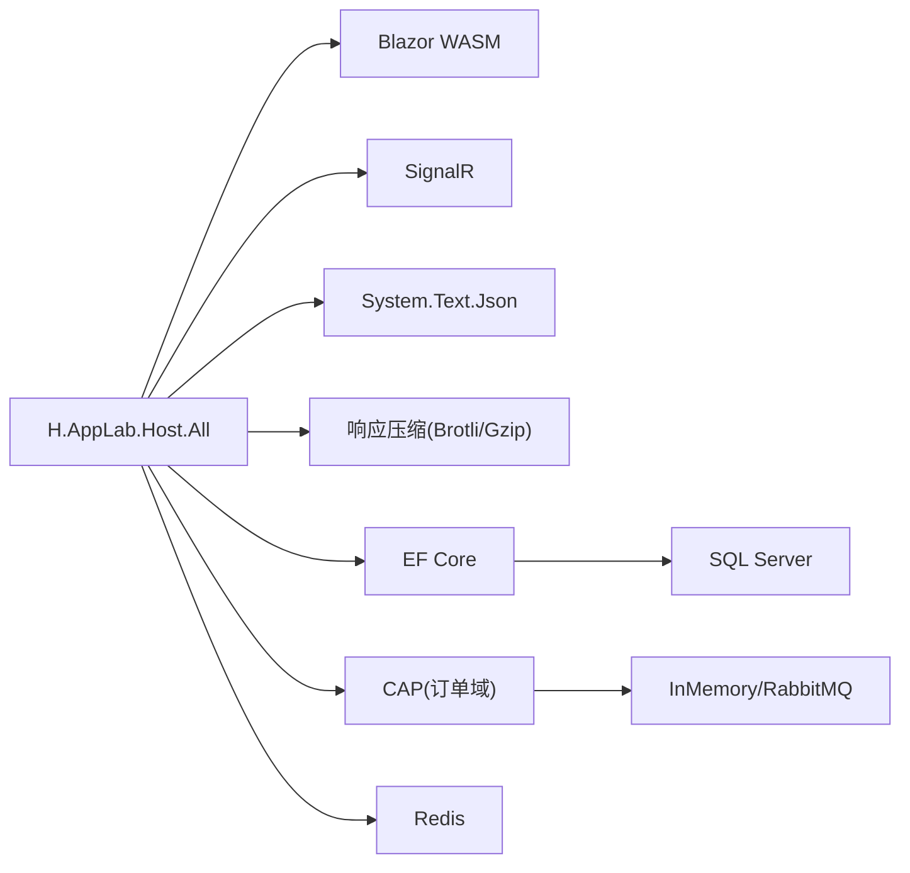

# 故障排除

<cite>
**本文引用的文件**   
- [docker-compose.yml](file://cd/docker-compose.yml)
- [Program.cs](file://src/Host/H.AppLab.Host.All/H.AppLab.Host.All/Program.cs)
- [appsettings.json](file://src/Host/H.AppLab.Host.All/H.AppLab.Host.All/appsettings.json)
- [launchSettings.json（HostAll）](file://src/Host/H.AppLab.Host.All/H.AppLab.Host.All/Properties/launchSettings.json)
- [Error.razor（HostAll）](file://src/Host/H.AppLab.Host.All/H.AppLab.Host.All/Components/Pages/Error.razor)
- [EnterpriseEntityFrameworkCoreModule.cs](file://src/System/Enterprise/H.Enterprise.EntityFrameworkCore/EnterpriseEntityFrameworkCoreModule.cs)
- [EnterpriseAppService.cs](file://src/System/Enterprise/H.Enterprise.Application/Services/EnterpriseAppService.cs)
- [OrderApplicationModule.cs](file://src/Services/Order/H.Order.Application/OrderApplicationModule.cs)
- [appsettings.serilog.json（LowCode DbMigrator）](file://src/Tools/H.LowCode.DbMigrator/appsettings.serilog.json)
- [Program.cs（LowCode DbMigrator）](file://src/Tools/H.LowCode.DbMigrator/Program.cs)
- [Program.cs（Enterprise DbMigrator）](file://src/Tools/H.Enterprise.DbMigrator/Program.cs)
- [Program.cs（Organization DbMigrator）](file://src/Tools/H.Organization.DbMigrator/Program.cs)
- [Program.cs（Approval DbMigrator）](file://src/Tools/H.Approval.DbMigrator/Program.cs)
- [README.md（Account DbMigrator）](file://src/Tools/H.Account.DbMigrator/README.md)
- [launchSettings.json（RenderEngine）](file://src/Host/RenderEngine/H.LowCode.RenderEngine.Host/Properties/launchSettings.json)
- [launchSettings.json（Account Host）](file://src/Host/Account/H.Account.Host/Properties/launchSettings.json)
</cite>

## 目录
1. [简介](#简介)
2. [项目结构](#项目结构)
3. [核心组件](#核心组件)
4. [架构总览](#架构总览)
5. [详细组件分析](#详细组件分析)
6. [依赖关系分析](#依赖关系分析)
7. [性能考虑](#性能考虑)
8. [故障排除指南](#故障排除指南)
9. [结论](#结论)
10. [附录](#附录)

## 简介
本故障排除文档面向 AppLab 平台的使用者与运维人员，聚焦于环境配置、启动失败、数据库连接错误、日志分析、性能诊断、内存与线程问题排查，以及网络通信、缓存失效、消息队列等基础设施问题的定位与解决。文档基于仓库中的实际代码与配置文件进行梳理，提供可操作的步骤与关键位置指引。

## 项目结构
AppLab 采用多宿主聚合模式：
- 统一宿主 H.AppLab.Host.All 聚合多个业务域（账号、组织、低代码设计/渲染引擎、审批、通知、订单、设置、供应链、测试、后台任务等）。
- 各域通过 EF Core 模块注册数据库上下文，并在应用初始化时自动创建或迁移数据库。
- 工具集包含各域的 DbMigrator 独立程序，用于执行数据库迁移与种子数据。
- 基础设施（Redis、RabbitMQ）通过 docker-compose 编排。

图表来源
- [Program.cs:1-41](file://src/Host/H.AppLab.Host.All/H.AppLab.Host.All/Program.cs#L1-L41)
- [appsettings.json:1-115](file://src/Host/H.AppLab.Host.All/H.AppLab.Host.All/appsettings.json#L1-L115)
- [docker-compose.yml:1-32](file://cd/docker-compose.yml#L1-L32)

章节来源
- [Program.cs:1-41](file://src/Host/H.AppLab.Host.All/H.AppLab.Host.All/Program.cs#L1-L41)
- [appsettings.json:1-115](file://src/Host/H.AppLab.Host.All/H.AppLab.Host.All/appsettings.json#L1-L115)
- [docker-compose.yml:1-32](file://cd/docker-compose.yml#L1-L32)

## 核心组件
- 宿主启动与中间件：Blazor Interactive WebAssembly、SignalR、JSON 序列化、响应压缩（Brotli/Gzip）、WASM/DLL MIME 类型支持。
- 数据库访问：各域 EF Core 模块在 OnApplicationInitialization 中调用 EnsureCreated 或迁移；DbMigrator 工具负责迁移执行。
- 消息队列：订单域使用 CAP + InMemory 队列（生产可替换为 RabbitMQ/Kafka）。
- 日志：Serilog 异步写入文件与控制台，按大小滚动与保留策略。
- 错误页面：统一 Error.razor 展示请求 ID 与开发模式提示。

章节来源
- [Program.cs:1-41](file://src/Host/H.AppLab.Host.All/H.AppLab.Host.All/Program.cs#L1-L41)
- [EnterpriseEntityFrameworkCoreModule.cs:1-29](file://src/System/Enterprise/H.Enterprise.EntityFrameworkCore/EnterpriseEntityFrameworkCoreModule.cs#L1-L29)
- [OrderApplicationModule.cs:34-50](file://src/Services/Order/H.Order.Application/OrderApplicationModule.cs#L34-L50)
- [appsettings.serilog.json（LowCode DbMigrator）:1-42](file://src/Tools/H.LowCode.DbMigrator/appsettings.serilog.json#L1-L42)
- [Error.razor（HostAll）:1-36](file://src/Host/H.AppLab.Host.All/H.AppLab.Host.All/Components/Pages/Error.razor#L1-L36)

## 架构总览
下图展示了典型请求从浏览器到后端服务、数据库与消息队列的交互路径，并标注了关键配置点。

图表来源
- [Program.cs:1-41](file://src/Host/H.AppLab.Host.All/H.AppLab.Host.All/Program.cs#L1-L41)
- [OrderApplicationModule.cs:34-50](file://src/Services/Order/H.Order.Application/OrderApplicationModule.cs#L34-L50)
- [appsettings.json:1-115](file://src/Host/H.AppLab.Host.All/H.AppLab.Host.All/appsettings.json#L1-L115)

## 详细组件分析

### 数据库连接与迁移
- 各域 EF Core 模块读取 appsettings.json 的连接字符串并注册 DbContext。
- Enterprise 域在应用初始化时调用 EnsureCreated 确保数据库存在。
- DbMigrator 工具通过 Program.cs 加载 appsettings.json，配置 UseSqlServer 并指定 MigrationsAssembly。

图表来源
- [EnterpriseEntityFrameworkCoreModule.cs:1-29](file://src/System/Enterprise/H.Enterprise.EntityFrameworkCore/EnterpriseEntityFrameworkCoreModule.cs#L1-L29)
- [Program.cs（Enterprise DbMigrator）:42-56](file://src/Tools/H.Enterprise.DbMigrator/Program.cs#L42-L56)
- [Program.cs（Organization DbMigrator）:42-57](file://src/Tools/H.Organization.DbMigrator/Program.cs#L42-L57)
- [Program.cs（Approval DbMigrator）:42-57](file://src/Tools/H.Approval.DbMigrator/Program.cs#L42-L57)
- [appsettings.json:1-115](file://src/Host/H.AppLab.Host.All/H.AppLab.Host.All/appsettings.json#L1-L115)

章节来源
- [EnterpriseEntityFrameworkCoreModule.cs:1-29](file://src/System/Enterprise/H.Enterprise.EntityFrameworkCore/EnterpriseEntityFrameworkCoreModule.cs#L1-L29)
- [Program.cs（Enterprise DbMigrator）:42-56](file://src/Tools/H.Enterprise.DbMigrator/Program.cs#L42-L56)
- [Program.cs（Organization DbMigrator）:42-57](file://src/Tools/H.Organization.DbMigrator/Program.cs#L42-L57)
- [Program.cs（Approval DbMigrator）:42-57](file://src/Tools/H.Approval.DbMigrator/Program.cs#L42-L57)
- [appsettings.json:1-115](file://src/Host/H.AppLab.Host.All/H.AppLab.Host.All/appsettings.json#L1-L115)

### 企业激活流程与异常
- 企业激活服务校验重复激活、数据库模式合法性、独立模式连接字符串必填，并记录激活时间与操作人。
- 异常信息直接抛出，便于上层捕获与展示。

图表来源
- [EnterpriseAppService.cs:206-245](file://src/System/Enterprise/H.Enterprise.Application/Services/EnterpriseAppService.cs#L206-L245)

章节来源
- [EnterpriseAppService.cs:206-245](file://src/System/Enterprise/H.Enterprise.Application/Services/EnterpriseAppService.cs#L206-L245)

### 消息队列（CAP）
- 订单域使用 CAP 集成 SQL Server 存储与内存队列，失败重试次数与间隔可配置。
- 消费者在服务容器中注册，便于后续扩展为 RabbitMQ/Kafka。

章节来源
- [OrderApplicationModule.cs:34-50](file://src/Services/Order/H.Order.Application/OrderApplicationModule.cs#L34-L50)

### 日志系统（Serilog）
- LowCode DbMigrator 使用 Serilog 异步写入文件与控制台，支持文件大小限制、保留数量与按日滚动。
- 输出模板包含时间戳、级别、来源上下文、事件 ID、消息与异常堆栈。

章节来源
- [appsettings.serilog.json（LowCode DbMigrator）:1-42](file://src/Tools/H.LowCode.DbMigrator/appsettings.serilog.json#L1-L42)
- [Program.cs（LowCode DbMigrator）:1-40](file://src/Tools/H.LowCode.DbMigrator/Program.cs#L1-L40)

### 错误页面与调试
- 统一 Error.razor 显示请求 ID，并提供开发模式切换提示（ASPNETCORE_ENVIRONMENT=Development）。
- 各宿主 launchSettings.json 默认设置 Development 环境变量。

章节来源
- [Error.razor（HostAll）:1-36](file://src/Host/H.AppLab.Host.All/H.AppLab.Host.All/Components/Pages/Error.razor#L1-L36)
- [launchSettings.json（HostAll）:1-15](file://src/Host/H.AppLab.Host.All/H.AppLab.Host.All/Properties/launchSettings.json#L1-L15)
- [launchSettings.json（RenderEngine）:1-15](file://src/Host/RenderEngine/H.LowCode.RenderEngine.Host/Properties/launchSettings.json#L1-L15)
- [launchSettings.json（Account Host）:1-15](file://src/Host/Account/H.Account.Host/Properties/launchSettings.json#L1-L15)

## 依赖关系分析
- 宿主进程依赖 Blazor、SignalR、JSON 序列化、响应压缩等 ASP.NET Core 能力。
- 各域通过 Abp 模块化体系注册 DbContext 与仓储。
- 中间件依赖 Redis（缓存/会话）与 RabbitMQ（消息队列），由 docker-compose 管理。

图表来源
- [Program.cs:1-41](file://src/Host/H.AppLab.Host.All/H.AppLab.Host.All/Program.cs#L1-L41)
- [OrderApplicationModule.cs:34-50](file://src/Services/Order/H.Order.Application/OrderApplicationModule.cs#L34-L50)
- [docker-compose.yml:1-32](file://cd/docker-compose.yml#L1-L32)

章节来源
- [Program.cs:1-41](file://src/Host/H.AppLab.Host.All/H.AppLab.Host.All/Program.cs#L1-L41)
- [OrderApplicationModule.cs:34-50](file://src/Services/Order/H.Order.Application/OrderApplicationModule.cs#L34-L50)
- [docker-compose.yml:1-32](file://cd/docker-compose.yml#L1-L32)

## 性能考虑
- 启用 Brotli/Gzip 压缩以减少 WASM 资源体积，提升首屏加载速度。
- SignalR 最大接收消息大小与详细错误仅在开发环境开启，避免生产泄露敏感信息。
- JSON 序列化使用驼峰命名策略，减少前后端字段映射成本。
- 数据库连接池与 EF Core 查询优化需结合具体场景调整（如分页、索引、N+1 问题）。
- 消息队列失败重试间隔与次数应平衡吞吐与延迟。

章节来源
- [Program.cs:1-41](file://src/Host/H.AppLab.Host.All/H.AppLab.Host.All/Program.cs#L1-L41)
- [OrderApplicationModule.cs:34-50](file://src/Services/Order/H.Order.Application/OrderApplicationModule.cs#L34-L50)

## 故障排除指南

### 环境配置问题
- 确认 ASPNETCORE_ENVIRONMENT 设置为 Development 以启用详细错误页。
- 检查 launchSettings.json 中 applicationUrl 与端口占用情况。
- 验证 docker-compose 中 Redis/RabbitMQ 端口映射与密码配置。

章节来源
- [launchSettings.json（HostAll）:1-15](file://src/Host/H.AppLab.Host.All/H.AppLab.Host.All/Properties/launchSettings.json#L1-L15)
- [launchSettings.json（RenderEngine）:1-15](file://src/Host/RenderEngine/H.LowCode.RenderEngine.Host/Properties/launchSettings.json#L1-L15)
- [launchSettings.json（Account Host）:1-15](file://src/Host/Account/H.Account.Host/Properties/launchSettings.json#L1-L15)
- [docker-compose.yml:1-32](file://cd/docker-compose.yml#L1-L32)

### 启动失败
- 查看 Error.razor 显示的请求 ID，结合控制台日志定位异常。
- 检查 Program.cs 中中间件注册顺序与依赖注入是否正确。
- 确认所有远程服务 BaseUrl 配置与实际运行地址一致。

章节来源
- [Error.razor（HostAll）:1-36](file://src/Host/H.AppLab.Host.All/H.AppLab.Host.All/Components/Pages/Error.razor#L1-L36)
- [Program.cs:1-41](file://src/Host/H.AppLab.Host.All/H.AppLab.Host.All/Program.cs#L1-L41)
- [appsettings.json:1-115](file://src/Host/H.AppLab.Host.All/H.AppLab.Host.All/appsettings.json#L1-L115)

### 数据库连接错误
- 核对 appsettings.json 中各域连接字符串（Server、Database、Trusted_Connection、TrustServerCertificate）。
- 若使用独立数据库模式，确保 EnterpriseAppService 激活时传入有效连接字符串。
- 使用对应 DbMigrator 工具执行迁移，确认 MigrationsAssembly 指向正确程序集。

章节来源
- [appsettings.json:1-115](file://src/Host/H.AppLab.Host.All/H.AppLab.Host.All/appsettings.json#L1-L115)
- [EnterpriseAppService.cs:206-245](file://src/System/Enterprise/H.Enterprise.Application/Services/EnterpriseAppService.cs#L206-L245)
- [Program.cs（Enterprise DbMigrator）:42-56](file://src/Tools/H.Enterprise.DbMigrator/Program.cs#L42-L56)
- [Program.cs（Organization DbMigrator）:42-57](file://src/Tools/H.Organization.DbMigrator/Program.cs#L42-L57)
- [Program.cs（Approval DbMigrator）:42-57](file://src/Tools/H.Approval.DbMigrator/Program.cs#L42-L57)
- [README.md（Account DbMigrator）:69-102](file://src/Tools/H.Account.DbMigrator/README.md#L69-L102)

### 日志分析方法与关键位置
- Serilog 文件输出路径与滚动策略位于 appsettings.serilog.json，注意日志轮转与保留数量。
- 控制台输出模板包含时间戳、级别、来源上下文、事件 ID、消息与异常。
- 建议在生产环境集中收集日志至外部系统（如 ELK/Splunk）。

章节来源
- [appsettings.serilog.json（LowCode DbMigrator）:1-42](file://src/Tools/H.LowCode.DbMigrator/appsettings.serilog.json#L1-L42)
- [Program.cs（LowCode DbMigrator）:1-40](file://src/Tools/H.LowCode.DbMigrator/Program.cs#L1-L40)

### 性能问题诊断与调优
- 使用浏览器开发者工具与 Network 面板分析 WASM 资源加载与压缩效果。
- 监控 SignalR 连接与消息大小，避免过大负载。
- 对数据库慢查询添加索引，优化 EF Core 查询（Include、Select、分页）。
- 调整 CAP 失败重试次数与间隔，平衡可靠性与延迟。

章节来源
- [Program.cs:1-41](file://src/Host/H.AppLab.Host.All/H.AppLab.Host.All/Program.cs#L1-L41)
- [OrderApplicationModule.cs:34-50](file://src/Services/Order/H.Order.Application/OrderApplicationModule.cs#L34-L50)

### 内存泄漏与线程阻塞排查
- 使用 .NET Profiler（Visual Studio / dotnet-trace / dotnet-counters）观察 GC 与线程池使用情况。
- 检查是否存在未释放的资源（如 HttpClient、DbContext、Stream）。
- 排查长时间运行的同步阻塞调用，改用异步 I/O 与超时控制。

[本节为通用指导，不直接分析具体文件]

### 网络通信问题
- 确认跨域与 HTTPS 证书配置，必要时启用 TrustServerCertificate（仅开发环境）。
- 检查防火墙与代理设置，确保容器间通信正常。
- 使用 curl/wget 或 Postman 验证 API 可达性与响应体。

章节来源
- [appsettings.json:1-115](file://src/Host/H.AppLab.Host.All/H.AppLab.Host.All/appsettings.json#L1-L115)
- [docker-compose.yml:1-32](file://cd/docker-compose.yml#L1-L32)

### 缓存失效问题
- 检查 Redis 连接与认证配置，确认客户端能正常连接。
- 针对热点键与过期策略进行监控，避免雪崩与穿透。
- 在业务层增加降级与回退逻辑（如直连数据库）。

章节来源
- [docker-compose.yml:1-32](file://cd/docker-compose.yml#L1-L32)

### 消息队列问题
- 确认 CAP 配置（SQL Server 存储、InMemory 队列）与消费者注册。
- 检查队列堆积与失败重试日志，定位卡住的消息。
- 生产环境切换到 RabbitMQ/Kafka 时，更新连接字符串与认证参数。

章节来源
- [OrderApplicationModule.cs:34-50](file://src/Services/Order/H.Order.Application/OrderApplicationModule.cs#L34-L50)
- [docker-compose.yml:1-32](file://cd/docker-compose.yml#L1-L32)

### 在线社区支持与帮助渠道
- 查阅各 DbMigrator 项目的 README 与注释，了解常见问题与解决方案。
- 关注 Volo.ABP 官方文档与 GitHub Issues，获取框架级支持。
- 参与开源社区讨论，提交最小复现代码与日志片段以便快速定位。

章节来源
- [README.md（Account DbMigrator）:69-102](file://src/Tools/H.Account.DbMigrator/README.md#L69-L102)

## 结论
通过系统化梳理 AppLab 的平台架构、关键组件与常见故障点，本文提供了从环境配置、启动失败、数据库连接、日志分析到性能调优与基础设施问题的完整排障路径。建议在实际运维中结合日志与监控工具，建立标准化的问题定位与恢复流程，以提升平台稳定性与可维护性。

## 附录
- 常用命令参考：dotnet run、dotnet build、dotnet ef migrations、docker compose up/down。
- 关键配置文件清单：appsettings.json、launchSettings.json、appsettings.serilog.json、docker-compose.yml。

[本节为补充信息，不直接分析具体文件]