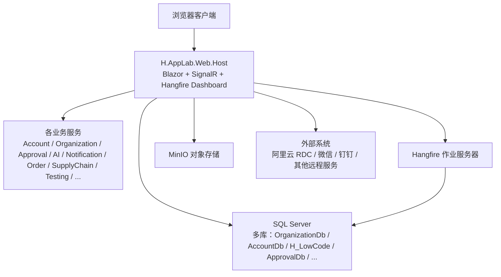
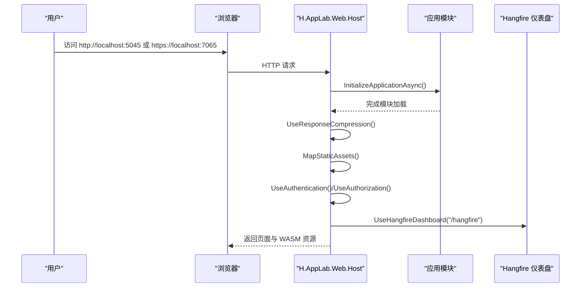
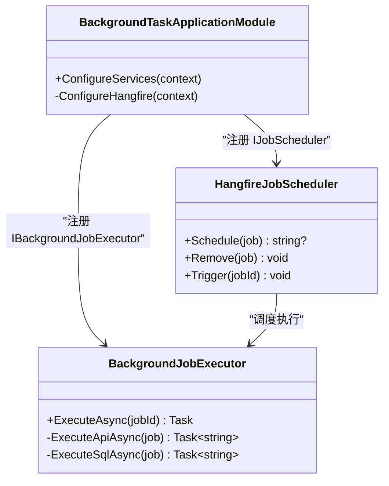
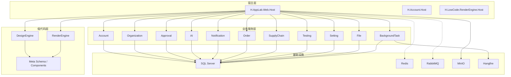
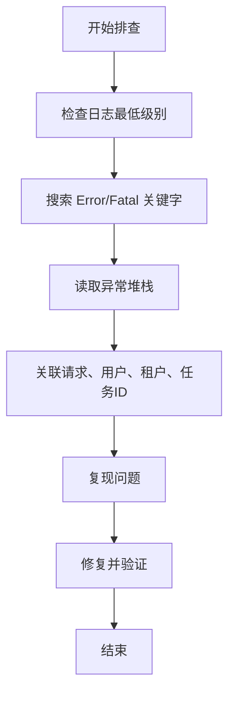

# 故障排除

<cite>
**本文引用的文件**   
- [README.md](file://README.md)
- [global.json](file://src/global.json)
- [Program.cs](file://src/Host/H.AppLab.Web.Host/H.AppLab.Web.Host/Program.cs)
- [appsettings.json（主宿主）](file://src/Host/H.AppLab.Web.Host/H.AppLab.Web.Host/appsettings.json)
- [appsettings.json（低代码迁移工具）](file://src/Tools/H.LowCode.DbMigrator/appsettings.json)
- [appsettings.serilog.json（低代码迁移工具日志）](file://src/Tools/H.LowCode.DbMigrator/appsettings.serilog.json)
- [BackgroundTaskApplicationModule.cs](file://src/Services/BackgroundTask/H.BackgroundTask.Application/BackgroundTaskApplicationModule.cs)
- [HangfireJobScheduler.cs](file://src/Services/BackgroundTask/H.BackgroundTask.Application/Services/HangfireJobScheduler.cs)
- [BackgroundJobExecutor.cs](file://src/Services/BackgroundTask/H.BackgroundTask.Application/Services/BackgroundJobExecutor.cs)
</cite>

## 目录
1. [引言](#引言)
2. [项目结构与排障范围](#项目结构与排障范围)
3. [核心组件与依赖关系](#核心组件与依赖关系)
4. [架构总览](#架构总览)
5. [常见问题分类与处理方案](#常见问题分类与处理方案)
6. [系统化调试技巧](#系统化调试技巧)
7. [监控指标与告警优化](#监控指标与告警优化)
8. [应急处理预案](#应急处理预案)
9. [结论](#结论)
10. [附录：关键配置速查](#附录关键配置速查)

## 引言
本故障排除文档面向 H.AppLab 平台的运维、开发与测试人员，目标是帮助快速定位并修复环境、配置、性能、数据库、后台任务、安全入侵等典型问题。平台基于 .NET + Blazor 模块化架构，支持单体部署和按服务独立部署；包含低代码设计引擎、渲染引擎、账户、组织、审批、通知、订单、供应链、测试等多个业务服务，以及 Hangfire 后台任务和 MinIO 对象存储等外部依赖。

## 项目结构与排障范围
H.AppLab 的排障范围主要覆盖以下层面：
- 运行环境与 SDK：.NET SDK 版本由 `global.json` 锁定为 10.0.0，并通过 `rollForward: latestFeature` 允许滚动到同主版本的最新特性版本。
- Web 宿主与中间件：Blazor Server + WebAssembly、SignalR、响应压缩、静态资源缓存、异常处理、HTTPS 重定向、Hangfire 仪表盘等。
- 配置中心：应用连接字符串、远程服务地址、MinIO、外部登录、站点列表、日志级别等。
- 数据库层：多个 EF Core DbContext 对应不同业务库，通过 DbMigrator 工具执行迁移。
- 后台任务：Hangfire + SQL Server 作业存储，提供定时、延迟、一次性任务调度与执行记录。
- 外部依赖：Redis、RabbitMQ、MinIO、第三方开放 API（如阿里云 RDC OpenAPI）。

```mermaid
graph TB
    Client["浏览器客户端"] --> Host["H.AppLab.Web.Host<br/>Blazor + SignalR + Hangfire Dashboard"]
    Host --> Services["各业务服务<br/>Account / Organization / Approval / AI / Notification / Order / SupplyChain / Testing / ..."]
    Host --> DB["SQL Server<br/>多库：OrganizationDb / AccountDb / H_LowCode / ApprovalDb / ..."]
    Host --> Hangfire["Hangfire 作业服务器"]
    Hangfire --> DB
    Host --> MinIO["MinIO 对象存储"]
    Host --> External["外部系统<br/>阿里云 RDC / 微信 / 钉钉 / 其他远程服务"]
```

**图表来源**
- [Program.cs:1-112](file://src/Host/H.AppLab.Web.Host/H.AppLab.Web.Host/Program.cs#L1-L112)
- [appsettings.json（主宿主）:1-128](file://src/Host/H.AppLab.Web.Host/H.AppLab.Web.Host/appsettings.json#L1-L128)

**章节来源**
- [README.md:1-73](file://README.md#L1-L73)
- [global.json:1-6](file://src/global.json#L1-L6)

## 核心组件与依赖关系
### 运行环境与启动链
- SDK 版本：由 `global.json` 指定 `sdk.version=10.0.0`，本地开发必须安装匹配或兼容的 .NET 10 SDK。
- 宿主入口：`Program.cs` 注册 Blazor、SignalR、JSON 序列化、响应压缩、Autofac、Hangfire 仪表盘、静态资源、路由、认证授权、控制器等。
- 启动流程中会初始化应用模块，并挂载 `/hangfire` 后台任务仪表盘。

```mermaid
sequenceDiagram
    participant User as "用户"
    participant Browser as "浏览器"
    participant Host as "H.AppLab.Web.Host"
    participant Modules as "应用模块"
    participant Hangfire as "Hangfire 仪表盘"

    User->>Browser: 访问 http://localhost:5045 或 https://localhost:7065
    Browser->>Host: HTTP 请求
    Host->>Modules: InitializeApplicationAsync()
    Modules-->>Host: 完成模块加载
    Host->>Host: UseResponseCompression()
    Host->>Host: MapStaticAssets()
    Host->>Host: UseAuthentication()/UseAuthorization()
    Host->>Hangfire: UseHangfireDashboard("/hangfire")
    Host-->>Browser: 返回页面与 WASM 资源
```

**图表来源**
- [Program.cs:1-112](file://src/Host/H.AppLab.Web.Host/H.AppLab.Web.Host/Program.cs#L1-L112)

**章节来源**
- [global.json:1-6](file://src/global.json#L1-L6)
- [Program.cs:1-112](file://src/Host/H.AppLab.Web.Host/H.AppLab.Web.Host/Program.cs#L1-L112)

### 后台任务子系统
- 作业存储：Hangfire 使用 SQL Server 作为作业存储，连接字符串来自 `BackgroundTaskDb`。
- 作业服务器：通过 `AddHangfireServer()` 随宿主进程启动。
- 调度器：`HangfireJobScheduler` 将一次性任务、延迟任务和周期任务映射到 Hangfire。
- 执行器：`BackgroundJobExecutor` 在 Hangfire 工作线程中执行 API 调用或 SQL 执行，并使用 ABP 工作单元持久化执行记录。

```mermaid
classDiagram
    class BackgroundTaskApplicationModule {
        +ConfigureServices(context)
        -ConfigureHangfire(context)
    }
    class HangfireJobScheduler {
        +Schedule(job) string?
        +Remove(job) void
        +Trigger(jobId) void
    }
    class BackgroundJobExecutor {
        +ExecuteAsync(jobId) Task
        -ExecuteApiAsync(job) Task~string~
        -ExecuteSqlAsync(job) Task~string~
    }

    BackgroundTaskApplicationModule --> HangfireJobScheduler : "注册 IJobScheduler"
    BackgroundTaskApplicationModule --> BackgroundJobExecutor : "注册 IBackgroundJobExecutor"
    HangfireJobScheduler --> BackgroundJobExecutor : "调度执行"
```

**图表来源**
- [BackgroundTaskApplicationModule.cs:1-55](file://src/Services/BackgroundTask/H.BackgroundTask.Application/BackgroundTaskApplicationModule.cs#L1-L55)
- [HangfireJobScheduler.cs:1-89](file://src/Services/BackgroundTask/H.BackgroundTask.Application/Services/HangfireJobScheduler.cs#L1-L89)
- [BackgroundJobExecutor.cs:1-173](file://src/Services/BackgroundTask/H.BackgroundTask.Application/Services/BackgroundJobExecutor.cs#L1-L173)

**章节来源**
- [BackgroundTaskApplicationModule.cs:1-55](file://src/Services/BackgroundTask/H.BackgroundTask.Application/BackgroundTaskApplicationModule.cs#L1-L55)
- [HangfireJobScheduler.cs:1-89](file://src/Services/BackgroundTask/H.BackgroundTask.Application/Services/HangfireJobScheduler.cs#L1-L89)
- [BackgroundJobExecutor.cs:1-173](file://src/Services/BackgroundTask/H.BackgroundTask.Application/Services/BackgroundJobExecutor.cs#L1-L173)

## 架构总览
H.AppLab 采用模块化 ABP 风格架构，Web 宿主负责 UI 渲染、跨服务代理、后台任务管理和基础设施集成；各业务服务以 Application.Contracts/Application/EntityFrameworkCore/Web 分层实现；低代码部分包含 DesignEngine 与 RenderEngine，并提供 JsonFile、EFCore、RemoteService 多种元数据存储实现。

```mermaid
graph TB
    subgraph "宿主层"
        WebHost["H.AppLab.Web.Host"]
        AccountHost["H.Account.Host"]
        RenderEngineHost["H.LowCode.RenderEngine.Host"]
    end

    subgraph "业务服务层"
        AccountSvc["Account"]
        OrgSvc["Organization"]
        ApprovalSvc["Approval"]
        AISvc["AI"]
        NotifySvc["Notification"]
        OrderSvc["Order"]
        SupplySvc["SupplyChain"]
        TestSvc["Testing"]
        SettingSvc["Setting"]
        FileSvc["File"]
        BgSvc["BackgroundTask"]
    end

    subgraph "低代码层"
        Design["DesignEngine"]
        Render["RenderEngine"]
        Meta["Meta Schema / Components"]
    end

    subgraph "基础设施"
        DB["SQL Server"]
        Redis["Redis"]
        Rabbit["RabbitMQ"]
        Minio["MinIO"]
        Hang["Hangfire"]
    end

    WebHost --> AccountSvc
    WebHost --> OrgSvc
    WebHost --> ApprovalSvc
    WebHost --> AISvc
    WebHost --> NotifySvc
    WebHost --> OrderSvc
    WebHost --> SupplySvc
    WebHost --> TestSvc
    WebHost --> SettingSvc
    WebHost --> FileSvc
    WebHost --> BgSvc

    WebHost --> Design
    WebHost --> Render
    Design --> Meta
    Render --> Meta

    AccountSvc --> DB
    OrgSvc --> DB
    ApprovalSvc --> DB
    AISvc --> DB
    NotifySvc --> DB
    OrderSvc --> DB
    SupplySvc --> DB
    TestSvc --> DB
    SettingSvc --> DB
    FileSvc --> DB
    BgSvc --> DB
    BgSvc --> Hang

    WebHost --> Minio
    WebHost -.-> Redis
    WebHost -.-> Rabbit
```

[本图为概念性架构图，不直接映射具体源码行，故不列出“图表来源”]

## 常见问题分类与处理方案

### 一、环境问题
#### 1.1 SDK 版本不兼容
- 现象
  - 无法编译或运行时提示 .NET SDK 版本不匹配。
  - 本地开发命令执行失败，或发布产物运行异常。
- 诊断
  - 检查 `global.json` 中的 SDK 版本是否与实际安装的 .NET SDK 一致。
  - 确认未启用错误兼容模式导致解析到非预期 SDK。
- 解决
  - 安装与 `global.json` 一致的 .NET 10 SDK。
  - 若需滚动到同主版本最新特性，保持 `rollForward: latestFeature` 即可。
  - 清理 `bin/obj` 后重新还原包与构建。

**章节来源**
- [global.json:1-6](file://src/global.json#L1-L6)

#### 1.2 依赖服务连接失败
- 现象
  - 启动时报数据库连接失败、Redis/RabbitMQ 不可用、MinIO 上传失败。
  - 控制台输出连接超时、认证失败、SSL/TLS 证书错误。
- 诊断
  - 根据报错信息判断缺失的外部依赖。
  - 检查 Docker Compose 是否启动成功，端口是否被占用。
  - 验证网络连通性与防火墙规则。
- 解决
  - 启动依赖服务：Redis、RabbitMQ、MinIO、SQL Server。
  - 修正连接地址、用户名、密码、虚拟主机、队列名、桶名等参数。
  - 如需 HTTPS，确保证书有效且受信任。

**章节来源**
- [README.md:1-73](file://README.md#L1-L73)

### 二、配置问题
#### 2.1 数据库连接字符串错误
- 现象
  - 应用启动失败、接口频繁报数据库连接异常、迁移失败。
- 诊断
  - 检查 `appsettings.json` 中 `ConnectionStrings` 下的各数据库连接串。
  - 确认 SQL Server 实例名称、数据库名、身份验证方式正确。
  - 确认迁移工具 `appsettings.json` 中的连接串与服务端一致。
- 解决
  - 修正连接字符串，确保 `(localdb)\mssqllocaldb` 或生产数据库地址可达。
  - 使用对应服务的 DbMigrator 执行数据库迁移。
  - 校验 TrustServerCertificate、Encrypt、Timeout 等参数是否符合环境要求。

**章节来源**
- [appsettings.json（主宿主）:1-128](file://src/Host/H.AppLab.Web.Host/H.AppLab.Web.Host/appsettings.json#L1-L128)
- [appsettings.json（低代码迁移工具）:1-8](file://src/Tools/H.LowCode.DbMigrator/appsettings.json#L1-L8)

#### 2.2 JWT 配置异常
- 现象
  - 登录后反复跳转、前端始终未拿到用户信息、后端鉴权失败。
- 诊断
  - 检查认证服务是否正常运行。
  - 检查 JWT 密钥、算法、过期时间、Issuer、Audience 是否与认证服务一致。
  - 检查前端代理是否指向正确的认证服务地址。
- 解决
  - 统一认证服务的 JWT 配置。
  - 更新远程服务 BaseUrl，确保前后端会话一致。
  - 在开发环境开启详细错误以便观察认证流程。

**章节来源**
- [Program.cs:1-112](file://src/Host/H.AppLab.Web.Host/H.AppLab.Web.Host/Program.cs#L1-L112)
- [appsettings.json（主宿主）:1-128](file://src/Host/H.AppLab.Web.Host/H.AppLab.Web.Host/appsettings.json#L1-L128)

#### 2.3 远程服务地址配置错误
- 现象
  - 前端调用后端 AppService 失败，出现跨域、404、502。
  - 单服务部署时某些模块无法访问。
- 诊断
  - 检查 `RemoteServices` 下各服务的 `BaseUrl`。
  - 确认服务实际监听地址与协议是否一致。
- 解决
  - 修正 `BaseUrl` 为真实可访问地址。
  - 如需反向代理，确保路径与端口透传正确。

**章节来源**
- [appsettings.json（主宿主）:1-128](file://src/Host/H.AppLab.Web.Host/H.AppLab.Web.Host/appsettings.json#L1-L128)

#### 2.4 MinIO 配置异常
- 现象
  - 文件上传失败、下载 403/404、对象桶不存在。
- 诊断
  - 检查 `Minio.Endpoint`、`AccessKey`、`SecretKey`、`UseSsl`、`ExternalEndpoint`。
  - 确认 MinIO 服务已启动且桶已创建。
- 解决
  - 修正 MinIO 连接信息与 SSL 配置。
  - 在生产环境使用可信域名与证书。

**章节来源**
- [appsettings.json（主宿主）:1-128](file://src/Host/H.AppLab.Web.Host/H.AppLab.Web.Host/appsettings.json#L1-L128)

### 三、性能问题
#### 3.1 内存泄漏
- 现象
  - 进程内存持续增长，长时间运行后 OOM。
- 诊断
  - 使用 .NET 内存分析工具抓取堆快照。
  - 排查长生命周期对象、事件订阅未释放、HttpClient 未复用、流未关闭。
  - 重点检查后台任务执行器、HTTP 客户端、文件流、数据库连接。
- 解决
  - 确保 `IHttpClientFactory` 创建的客户端被复用而非每次新建。
  - 避免在循环中持有大对象引用。
  - 及时释放流、取消令牌、信号量等资源。
  - 对后台任务增加执行耗时与结果长度限制。

**章节来源**
- [BackgroundJobExecutor.cs:1-173](file://src/Services/BackgroundTask/H.BackgroundTask.Application/Services/BackgroundJobExecutor.cs#L1-L173)

#### 3.2 CPU 占用过高
- 现象
  - 服务启动慢、页面卡顿、接口响应变慢。
- 诊断
  - 使用性能分析工具采集热点方法、GC 行为、线程状态。
  - 检查是否存在同步阻塞、死循环、正则回溯、大量 JSON 序列化。
  - 检查 Hangfire 任务堆积、重复调度、重试风暴。
- 解决
  - 异步化阻塞操作。
  - 调整 Hangfire 并发度与队列策略。
  - 优化查询语句、分页大小、批量操作。

**章节来源**
- [BackgroundTaskApplicationModule.cs:1-55](file://src/Services/BackgroundTask/H.BackgroundTask.Application/BackgroundTaskApplicationModule.cs#L1-L55)
- [HangfireJobScheduler.cs:1-89](file://src/Services/BackgroundTask/H.BackgroundTask.Application/Services/HangfireJobScheduler.cs#L1-L89)

#### 3.3 WASM 资源加载缓慢或卡住
- 现象
  - 页面一直显示加载中，WASM 程序集无法加载。
- 诊断
  - 检查浏览器开发者工具的 Network 面板是否有 404。
  - 检查静态资源缓存策略是否误配。
- 解决
  - 使用项目提供的 `MapStaticAssets()`，不要手动将整个 `/_framework` 标记为 immutable。
  - 确认 Brotli/Gzip 压缩已启用。
  - 清除浏览器缓存后重试。

**章节来源**
- [Program.cs:1-112](file://src/Host/H.AppLab.Web.Host/H.AppLab.Web.Host/Program.cs#L1-L112)

### 四、数据库问题
#### 4.1 连接池耗尽
- 现象
  - 高并发下数据库连接超时、事务等待、接口超时。
- 诊断
  - 查看数据库活跃连接数、等待锁、长事务。
  - 检查应用连接池大小、最大池大小、超时时间。
  - 排查未释放连接、长耗时 SQL、N+1 查询。
- 解决
  - 合理设置连接池参数。
  - 优化慢查询、添加索引、减少事务范围。
  - 使用分页、分批提交、异步 IO。

**章节来源**
- [appsettings.json（主宿主）:1-128](file://src/Host/H.AppLab.Web.Host/H.AppLab.Web.Host/appsettings.json#L1-L128)

#### 4.2 索引缺失导致查询缓慢
- 现象
  - 列表查询、筛选条件、排序字段性能差。
- 诊断
  - 查看数据库执行计划与慢查询日志。
  - 检查高频查询字段是否缺少索引。
- 解决
  - 为常用过滤、排序、关联字段添加索引。
  - 对组合查询建立复合索引。
  - 定期评估统计信息并重建索引。

**章节来源**
- [appsettings.json（主宿主）:1-128](file://src/Host/H.AppLab.Web.Host/H.AppLab.Web.Host/appsettings.json#L1-L128)

#### 4.3 迁移失败或结构不一致
- 现象
  - 应用启动报实体变更、表不存在、列类型不匹配。
- 诊断
  - 检查各服务 DbMigrator 是否已执行。
  - 对比迁移脚本与数据库实际结构。
- 解决
  - 依次执行各服务对应的 DbMigrator。
  - 回滚或补充缺失迁移。
  - 备份数据后谨慎执行破坏性变更。

**章节来源**
- [README.md:1-73](file://README.md#L1-L73)
- [appsettings.json（低代码迁移工具）:1-8](file://src/Tools/H.LowCode.DbMigrator/appsettings.json#L1-L8)

### 五、后台任务问题
#### 5.1 Hangfire 作业存储连接失败
- 现象
  - 任务入队失败、Hangfire 仪表盘无任务、作业执行异常。
- 诊断
  - 检查 `BackgroundTaskDb` 连接串是否正确。
  - 确认 SQL Server 可访问且权限足够。
- 解决
  - 修正连接串。
  - 重启宿主持有 HangfireServer。
  - 检查 Hangfire 架构与表是否已创建。

**章节来源**
- [BackgroundTaskApplicationModule.cs:1-55](file://src/Services/BackgroundTask/H.BackgroundTask.Application/BackgroundTaskApplicationModule.cs#L1-L55)
- [appsettings.json（主宿主）:1-128](file://src/Host/H.AppLab.Web.Host/H.AppLab.Web.Host/appsettings.json#L1-L128)

#### 5.2 周期任务重复或未按 Cron 执行
- 现象
  - 任务重复执行、Cron 表达式无效、任务停止后未恢复。
- 诊断
  - 检查 `HangfireJobScheduler.Schedule` 是否先移除旧调度。
  - 核对 Cron 表达式格式。
  - 查看 Hangfire 仪表盘中任务的调度状态。
- 解决
  - 修正 Cron 表达式。
  - 确保调度器在应用启动后正常注册。
  - 对周期任务使用约定 ID，避免重复注册。

**章节来源**
- [HangfireJobScheduler.cs:1-89](file://src/Services/BackgroundTask/H.BackgroundTask.Application/Services/HangfireJobScheduler.cs#L1-L89)

#### 5.3 后台任务执行失败
- 现象
  - 任务状态为失败，执行记录中有异常信息。
- 诊断
  - 查看执行记录表中的 `ErrorMessage`、`DurationMs`、`Status`。
  - 检查 API 任务的目标服务是否可达、认证头是否正确。
  - 检查 SQL 任务连接串与语句是否合法。
- 解决
  - 修正目标 API 地址、Headers、Body。
  - 修正 SQL 连接串与语句。
  - 增加重试机制与失败告警。

**章节来源**
- [BackgroundJobExecutor.cs:1-173](file://src/Services/BackgroundTask/H.BackgroundTask.Application/Services/BackgroundJobExecutor.cs#L1-L173)

### 六、安全相关问题
#### 6.1 外部登录配置异常
- 现象
  - 微信、钉钉第三方登录回调失败、OAuth 错误。
- 诊断
  - 检查 `ExternalLogin` 配置项是否启用、ClientId、ClientSecret、CallbackPath 是否正确。
  - 确认第三方平台已授权回调域名。
- 解决
  - 修正第三方应用配置。
  - 在测试环境禁用非必要外部登录以减少干扰。

**章节来源**
- [appsettings.json（主宿主）:1-128](file://src/Host/H.AppLab.Web.Host/H.AppLab.Web.Host/appsettings.json#L1-L128)

#### 6.2 敏感配置泄露
- 现象
  - 连接串、密钥出现在日志、错误页面或前端。
- 诊断
  - 检查日志模板是否打印完整异常与连接串。
  - 检查错误页面是否在开发环境暴露详细信息。
- 解决
  - 生产环境关闭详细错误。
  - 使用环境变量或密钥管理服务注入敏感值。
  - 脱敏日志中的连接串、Token、密码。

**章节来源**
- [Program.cs:1-112](file://src/Host/H.AppLab.Web.Host/H.AppLab.Web.Host/Program.cs#L1-L112)
- [appsettings.serilog.json（低代码迁移工具日志）:1-41](file://src/Tools/H.LowCode.DbMigrator/appsettings.serilog.json#L1-L41)

## 系统化调试技巧

### 日志分析方法
- 日志框架
  - 迁移工具使用 Serilog，输出到文件和控制台，支持异步写入、文件大小限制、保留天数、按天滚动。
- 日志位置
  - 文件路径由 Serilog 配置决定，默认相对路径为 `../Logs/log_.txt`。
- 日志级别
  - 默认最低级别为 Information，可对 System、Microsoft、EF Core 单独调低或调高。
- 排查步骤
  - 定位异常时间戳与 SourceContext。
  - 查看 Exception 堆栈。
  - 结合请求 ID、用户标识、租户标识进行关联分析。
  - 对高频错误做聚合统计。

```mermaid
flowchart TD
    Start["开始排查"] --> CheckLevel["检查日志最低级别"]
    CheckLevel --> FindError["搜索 Error/Fatal 关键字"]
    FindError --> ReadException["读取异常堆栈"]
    ReadException --> Correlate["关联请求、用户、租户、任务ID"]
    Correlate --> Reproduce["复现问题"]
    Reproduce --> Fix["修复并验证"]
    Fix --> End["结束"]
```

**图表来源**
- [appsettings.serilog.json（低代码迁移工具日志）:1-41](file://src/Tools/H.LowCode.DbMigrator/appsettings.serilog.json#L1-L41)

**章节来源**
- [appsettings.serilog.json（低代码迁移工具日志）:1-41](file://src/Tools/H.LowCode.DbMigrator/appsettings.serilog.json#L1-L41)

### 性能分析工具使用
- 推荐工具
  - .NET Profiler、dotnet-trace、dotnet-dump、PerfView、Application Insights、SkyWalking、OpenTelemetry。
- 关注点
  - CPU 热点、GC 暂停、托管堆增长、线程阻塞、IO 等待。
- 操作步骤
  - 在测试环境重现问题。
  - 采集 trace 与 dump。
  - 分析热点方法与分配热点。
  - 结合数据库慢查询与 Hangfire 任务执行情况定位根因。

[本节为通用指导，不直接分析具体源码，故不列出“章节来源”]

### 内存 Dump 分析
- 适用场景
  - 内存持续增长、OOM、GC 频繁。
- 步骤
  - 使用 dotnet-dump 收集进程 dump。
  - 分析托管堆、句柄、线程栈、弱引用、Finalizer 队列。
  - 定位大对象、未释放订阅、缓存未清理。
- 常见根因
  - HttpClient 未复用。
  - 事件总线订阅未取消。
  - 后台任务中持有全局引用。
  - 文件流、数据库连接未释放。

**章节来源**
- [BackgroundJobExecutor.cs:1-173](file://src/Services/BackgroundTask/H.BackgroundTask.Application/Services/BackgroundJobExecutor.cs#L1-L173)

### 网络抓包技术
- 适用场景
  - 远程服务调用失败、跨域、认证失败、TLS 握手失败。
- 工具
  - Wireshark、Fiddler、Charles、浏览器开发者工具 Network。
- 步骤
  - 捕获请求与响应。
  - 检查 URL、Header、Cookie、Token、CORS。
  - 检查服务端返回码与错误体。
  - 结合 Hangfire 任务执行记录定位失败链路。

[本节为通用指导，不直接分析具体源码，故不列出“章节来源”]

## 监控指标与告警优化

### 关键指标
- 服务可用性
  - 进程存活、启动耗时、健康检查状态。
- 请求质量
  - 请求量、成功率、延迟分位、错误率。
- 资源使用
  - CPU、内存、GC、线程数、句柄数。
- 数据库
  - 连接数、慢查询数、锁等待、事务超时。
- 后台任务
  - 任务入队数、执行成功数、失败数、积压数、平均耗时。
- 外部依赖
  - Redis、RabbitMQ、MinIO、第三方 API 的可用性与延迟。

### 告警规则建议
- 服务宕机或健康检查失败立即告警。
- 错误率超过阈值持续 N 分钟告警。
- 数据库连接数接近上限时告警。
- Hangfire 任务积压超过阈值或失败率升高时告警。
- 外部依赖连接失败或延迟突增时告警。
- 内存持续增长趋势触发预警。

[本节为通用指导，不直接分析具体源码，故不列出“章节来源”]

## 应急处理预案

### 服务宕机
- 处置流程
  - 确认进程是否存活。
  - 查看最近日志与异常堆栈。
  - 重启服务并观察恢复情况。
  - 如反复崩溃，隔离新版本并回滚。
- 预防措施
  - 启用健康检查与自动重启。
  - 配置优雅停机与限流降级。

[本节为通用指导，不直接分析具体源码，故不列出“章节来源”]

### 数据损坏
- 处置流程
  - 立即停止写入。
  - 评估损坏范围。
  - 从最近备份恢复。
  - 验证数据一致性。
  - 补录受影响数据。
- 预防措施
  - 定期备份与恢复演练。
  - 数据库变更走迁移评审。
  - 关键操作加审计与事务保护。

[本节为通用指导，不直接分析具体源码，故不列出“章节来源”]

### 安全入侵
- 处置流程
  - 隔离受影响服务。
  - 撤销可疑 Token、账号权限。
  - 修改敏感配置与密钥。
  - 留存取证日志与流量记录。
  - 溯源攻击路径并修复漏洞。
- 预防措施
  - 最小权限原则。
  - 输入校验与输出编码。
  - 审计日志与入侵检测。

[本节为通用指导，不直接分析具体源码，故不列出“章节来源”]

## 结论
H.AppLab 的故障排除应围绕环境、配置、性能、数据库、后台任务与安全六个维度展开。通过规范化的日志分析、性能分析、内存 dump、网络抓包和监控告警，可以快速定位根因并恢复服务。对于后台任务与数据库等关键路径，应重点关注 Hangfire 作业存储、执行记录、连接池与索引；对于 Web 宿主，应特别关注 WASM 资源缓存、SignalR、响应压缩与远程服务地址配置。

## 附录：关键配置速查
- .NET SDK 版本：见 `global.json`。
- Web 宿主端口与基础中间件：见 `Program.cs`。
- 数据库连接串、远程服务地址、MinIO、外部登录、Sites：见主宿主 `appsettings.json`。
- 低代码迁移工具连接串与元数据路径：见 `Tools/H.LowCode.DbMigrator/appsettings.json`。
- Serilog 文件日志输出与级别：见 `Tools/H.LowCode.DbMigrator/appsettings.serilog.json`。
- Hangfire 作业存储与服务器启动：见 `BackgroundTaskApplicationModule.cs`。
- 后台任务调度逻辑：见 `HangfireJobScheduler.cs`。
- 后台任务执行逻辑：见 `BackgroundJobExecutor.cs`。

**章节来源**
- [global.json:1-6](file://src/global.json#L1-L6)
- [Program.cs:1-112](file://src/Host/H.AppLab.Web.Host/H.AppLab.Web.Host/Program.cs#L1-L112)
- [appsettings.json（主宿主）:1-128](file://src/Host/H.AppLab.Web.Host/H.AppLab.Web.Host/appsettings.json#L1-L128)
- [appsettings.json（低代码迁移工具）:1-8](file://src/Tools/H.LowCode.DbMigrator/appsettings.json#L1-L8)
- [appsettings.serilog.json（低代码迁移工具日志）:1-41](file://src/Tools/H.LowCode.DbMigrator/appsettings.serilog.json#L1-L41)
- [BackgroundTaskApplicationModule.cs:1-55](file://src/Services/BackgroundTask/H.BackgroundTask.Application/BackgroundTaskApplicationModule.cs#L1-L55)
- [HangfireJobScheduler.cs:1-89](file://src/Services/BackgroundTask/H.BackgroundTask.Application/Services/HangfireJobScheduler.cs#L1-L89)
- [BackgroundJobExecutor.cs:1-173](file://src/Services/BackgroundTask/H.BackgroundTask.Application/Services/BackgroundJobExecutor.cs#L1-L173)