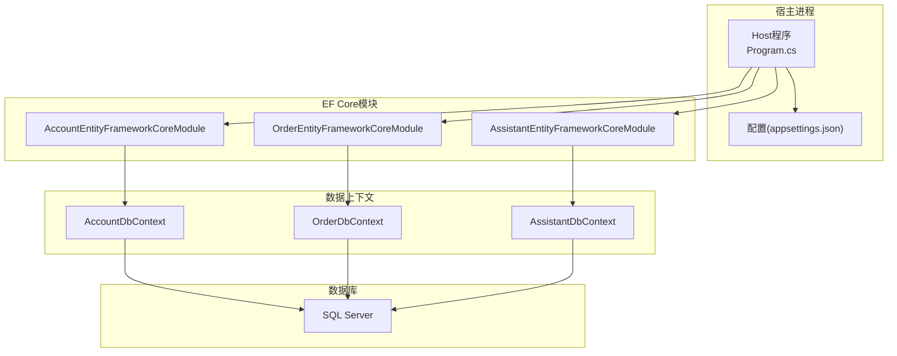
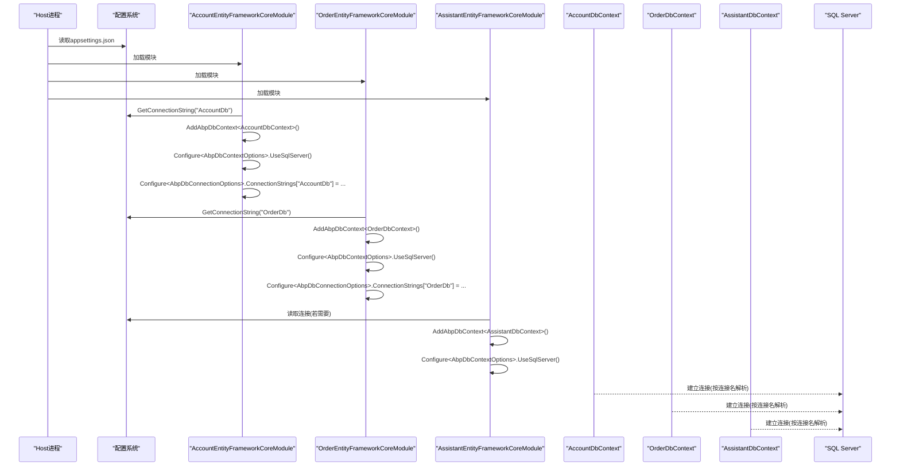
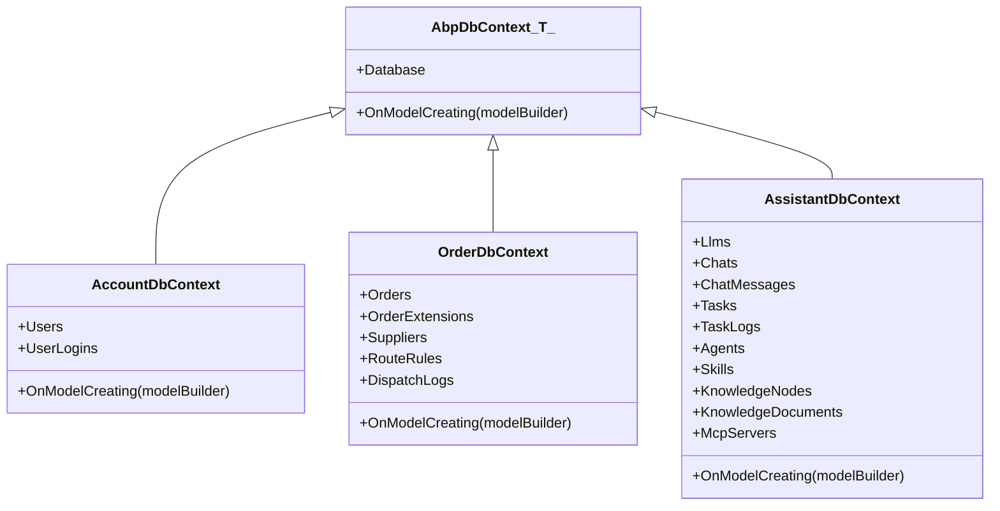
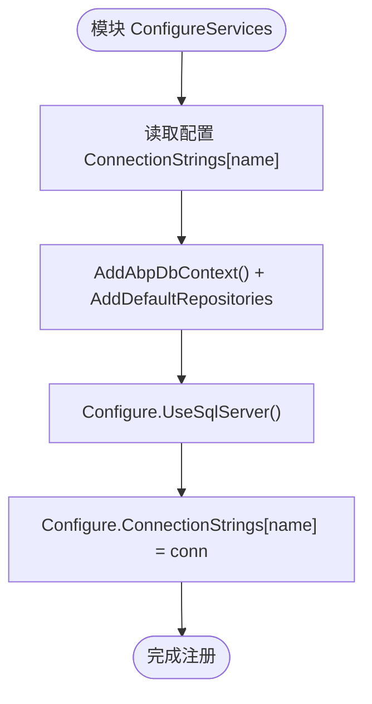
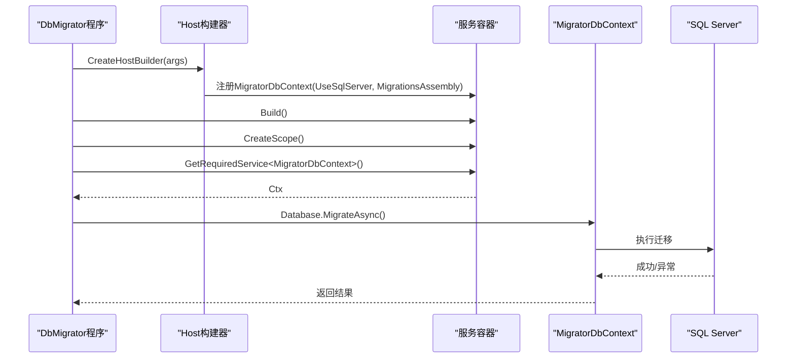
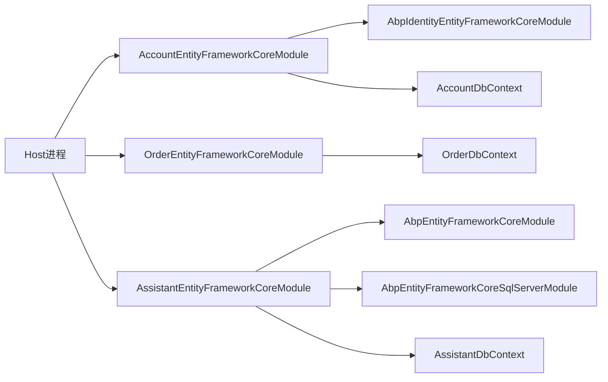

# EntityFrameworkCore配置

<cite>
**本文引用的文件**   
- [AccountDbContext.cs](file://src/Services/Account/H.Account.EntityFrameworkCore/AccountDbContext.cs)
- [AccountEntityFrameworkCoreModule.cs](file://src/Services/Account/H.Account.EntityFrameworkCore/AccountEntityFrameworkCoreModule.cs)
- [OrderDbContext.cs](file://src/Services/Order/H.Order.EntityFrameworkCore/OrderDbContext.cs)
- [OrderEntityFrameworkCoreModule.cs](file://src/Services/Order/H.Order.EntityFrameworkCore/OrderEntityFrameworkCoreModule.cs)
- [AssistantDbContext.cs](file://src/Agent/Assistant/H.Assistant.EntityFrameworkCore/AssistantDbContext.cs)
- [AssistantEntityFrameworkCoreModule.cs](file://src/Agent/Assistant/H.Assistant.EntityFrameworkCore/AssistantEntityFrameworkCoreModule.cs)
- [appsettings.json（Host）](file://src/Host/H.AppLab.Host.All/H.AppLab.Host.All/appsettings.json)
- [Program.cs（Host）](file://src/Host/H.AppLab.Host.All/H.AppLab.Host.All/Program.cs)
- [Program.cs（Account DbMigrator）](file://src/Tools/H.Account.DbMigrator/Program.cs)
- [appsettings.json（Account DbMigrator）](file://src/Tools/H.Account.DbMigrator/appsettings.json)
</cite>

## 目录
1. [简介](#简介)
2. [项目结构](#项目结构)
3. [核心组件](#核心组件)
4. [架构总览](#架构总览)
5. [详细组件分析](#详细组件分析)
6. [依赖关系分析](#依赖关系分析)
7. [性能考虑](#性能考虑)
8. [故障排查指南](#故障排查指南)
9. [结论](#结论)
10. [附录](#附录)

## 简介
本文件面向AppLab项目中基于ABP框架与Entity Framework Core的数据库访问层，系统性说明DbContext设计模式、模块注册与依赖注入配置、连接字符串管理、数据库提供者配置、实体映射方式，以及多数据库支持与性能优化实践。文档同时覆盖迁移工具链的使用要点与常见问题排查方法，帮助读者快速理解并正确扩展EF Core配置。

## 项目结构
AppLab采用按领域/服务划分的模块化结构，每个包含数据访问的模块通常具备以下文件：
- DbContext定义：继承自AbpDbContext，使用ConnectionStringName特性指定连接名
- EF Core模块：继承AbpModule，负责AddAbpDbContext、UseSqlServer、AbpDbConnectionOptions配置
- appsettings.json：集中存放各服务的连接字符串
- DbMigrator工具：独立控制台应用，用于执行迁移

图表来源
- [Program.cs（Host）:1-115](file://src/Host/H.AppLab.Host.All/H.AppLab.Host.All/Program.cs#L1-L115)
- [AccountEntityFrameworkCoreModule.cs:1-38](file://src/Services/Account/H.Account.EntityFrameworkCore/AccountEntityFrameworkCoreModule.cs#L1-L38)
- [OrderEntityFrameworkCoreModule.cs:1-31](file://src/Services/Order/H.Order.EntityFrameworkCore/OrderEntityFrameworkCoreModule.cs#L1-L31)
- [AssistantEntityFrameworkCoreModule.cs:1-27](file://src/Agent/Assistant/H.Assistant.EntityFrameworkCore/AssistantEntityFrameworkCoreModule.cs#L1-L27)

章节来源
- [Program.cs（Host）:1-115](file://src/Host/H.AppLab.Host.All/H.AppLab.Host.All/Program.cs#L1-L115)
- [appsettings.json（Host）:1-115](file://src/Host/H.AppLab.Host.All/H.AppLab.Host.All/appsettings.json#L1-L115)

## 核心组件
- DbContext基类与命名约定
  - 所有DbContext均继承自AbpDbContext<T>，并通过[ConnectionStringName("...")]特性绑定到配置中的连接字符串键名
  - 示例：AccountDbContext、OrderDbContext、AssistantDbContext
- EF Core模块（AbpModule）
  - 通过AddAbpDbContext<T>()注册DbContext与默认仓储
  - 通过Configure<AbpDbContextOptions>().UseSqlServer()设置数据库提供者
  - 通过Configure<AbpDbConnectionOptions>()将连接名映射到具体连接字符串
- 配置来源
  - 运行时由Host进程的appsettings.json提供ConnectionStrings节点
  - 迁移工具各自拥有独立的appsettings.json，仅包含所需连接的字符串

章节来源
- [AccountDbContext.cs:1-28](file://src/Services/Account/H.Account.EntityFrameworkCore/AccountDbContext.cs#L1-L28)
- [OrderDbContext.cs:1-110](file://src/Services/Order/H.Order.EntityFrameworkCore/OrderDbContext.cs#L1-L110)
- [AssistantDbContext.cs:1-170](file://src/Agent/Assistant/H.Assistant.EntityFrameworkCore/AssistantDbContext.cs#L1-L170)
- [AccountEntityFrameworkCoreModule.cs:1-38](file://src/Services/Account/H.Account.EntityFrameworkCore/AccountEntityFrameworkCoreModule.cs#L1-L38)
- [OrderEntityFrameworkCoreModule.cs:1-31](file://src/Services/Order/H.Order.EntityFrameworkCore/OrderEntityFrameworkCoreModule.cs#L1-L31)
- [AssistantEntityFrameworkCoreModule.cs:1-27](file://src/Agent/Assistant/H.Assistant.EntityFrameworkCore/AssistantEntityFrameworkCoreModule.cs#L1-L27)
- [appsettings.json（Host）:1-115](file://src/Host/H.AppLab.Host.All/H.AppLab.Host.All/appsettings.json#L1-L115)

## 架构总览
下图展示了从Host启动到各EF Core模块加载、DbContext注册、连接字符串解析与数据库提供者配置的完整流程。

图表来源
- [Program.cs（Host）:1-115](file://src/Host/H.AppLab.Host.All/H.AppLab.Host.All/Program.cs#L1-L115)
- [AccountEntityFrameworkCoreModule.cs:1-38](file://src/Services/Account/H.Account.EntityFrameworkCore/AccountEntityFrameworkCoreModule.cs#L1-L38)
- [OrderEntityFrameworkCoreModule.cs:1-31](file://src/Services/Order/H.Order.EntityFrameworkCore/OrderEntityFrameworkCoreModule.cs#L1-L31)
- [AssistantEntityFrameworkCoreModule.cs:1-27](file://src/Agent/Assistant/H.Assistant.EntityFrameworkCore/AssistantEntityFrameworkCoreModule.cs#L1-L27)
- [appsettings.json（Host）:1-115](file://src/Host/H.AppLab.Host.All/H.AppLab.Host.All/appsettings.json#L1-L115)

## 详细组件分析

### DbContext设计与实体映射
- 设计模式
  - 统一继承AbpDbContext<T>，配合[ConnectionStringName]特性实现“连接名”驱动的配置
  - OnModelCreating中完成表名、主键、属性长度、索引、关系等映射
- 示例要点
  - AccountDbContext：集成Identity实体，调用ConfigureIdentity()进行标准化映射
  - OrderDbContext：对订单、供应商、路由规则、下发日志等实体进行精细化映射与索引设计
  - AssistantDbContext：对LLM、聊天会话、任务、技能、知识库、MCP服务器等实体进行映射

图表来源
- [AccountDbContext.cs:1-28](file://src/Services/Account/H.Account.EntityFrameworkCore/AccountDbContext.cs#L1-L28)
- [OrderDbContext.cs:1-110](file://src/Services/Order/H.Order.EntityFrameworkCore/OrderDbContext.cs#L1-L110)
- [AssistantDbContext.cs:1-170](file://src/Agent/Assistant/H.Assistant.EntityFrameworkCore/AssistantDbContext.cs#L1-L170)

章节来源
- [AccountDbContext.cs:1-28](file://src/Services/Account/H.Account.EntityFrameworkCore/AccountDbContext.cs#L1-L28)
- [OrderDbContext.cs:1-110](file://src/Services/Order/H.Order.EntityFrameworkCore/OrderDbContext.cs#L1-L110)
- [AssistantDbContext.cs:1-170](file://src/Agent/Assistant/H.Assistant.EntityFrameworkCore/AssistantDbContext.cs#L1-L170)

### EF Core模块注册与依赖注入
- 通用模式
  - 在AbpModule的ConfigureServices中：
    - 读取配置中的连接字符串
    - AddAbpDbContext<T>(options => options.AddDefaultRepositories(includeAllEntities: true))
    - Configure<AbpDbContextOptions>().UseSqlServer()
    - Configure<AbpDbConnectionOptions>().ConnectionStrings[name] = connectionString
- 差异点
  - Account模块额外将AbpIdentity的连接名也指向同一连接字符串
  - Assistant模块显式依赖AbpEntityFrameworkCoreSqlServerModule以启用SQL Server支持

图表来源
- [AccountEntityFrameworkCoreModule.cs:1-38](file://src/Services/Account/H.Account.EntityFrameworkCore/AccountEntityFrameworkCoreModule.cs#L1-L38)
- [OrderEntityFrameworkCoreModule.cs:1-31](file://src/Services/Order/H.Order.EntityFrameworkCore/OrderEntityFrameworkCoreModule.cs#L1-L31)
- [AssistantEntityFrameworkCoreModule.cs:1-27](file://src/Agent/Assistant/H.Assistant.EntityFrameworkCore/AssistantEntityFrameworkCoreModule.cs#L1-L27)

章节来源
- [AccountEntityFrameworkCoreModule.cs:1-38](file://src/Services/Account/H.Account.EntityFrameworkCore/AccountEntityFrameworkCoreModule.cs#L1-L38)
- [OrderEntityFrameworkCoreModule.cs:1-31](file://src/Services/Order/H.Order.EntityFrameworkCore/OrderEntityFrameworkCoreModule.cs#L1-L31)
- [AssistantEntityFrameworkCoreModule.cs:1-27](file://src/Agent/Assistant/H.Assistant.EntityFrameworkCore/AssistantEntityFrameworkCoreModule.cs#L1-L27)

### 连接字符串管理与多数据库支持
- 连接字符串位置
  - Host进程：appsettings.json的ConnectionStrings节点集中管理所有服务连接
  - 迁移工具：各自appsettings.json仅包含自身需要的连接
- 多数据库支持
  - 当前所有模块均使用UseSqlServer()
  - 切换至SQLite或其他提供者时，仅需修改模块中的Use*调用，并确保连接字符串格式匹配
  - 如需按环境或租户动态选择提供者，可在模块中根据配置条件分支设置Use*

章节来源
- [appsettings.json（Host）:1-115](file://src/Host/H.AppLab.Host.All/H.AppLab.Host.All/appsettings.json#L1-L115)
- [appsettings.json（Account DbMigrator）:1-6](file://src/Tools/H.Account.DbMigrator/appsettings.json#L1-L6)
- [AccountEntityFrameworkCoreModule.cs:1-38](file://src/Services/Account/H.Account.EntityFrameworkCore/AccountEntityFrameworkCoreModule.cs#L1-L38)
- [OrderEntityFrameworkCoreModule.cs:1-31](file://src/Services/Order/H.Order.EntityFrameworkCore/OrderEntityFrameworkCoreModule.cs#L1-L31)
- [AssistantEntityFrameworkCoreModule.cs:1-27](file://src/Agent/Assistant/H.Assistant.EntityFrameworkCore/AssistantEntityFrameworkCoreModule.cs#L1-L27)

### 迁移工具链与DbContext工厂
- 迁移工具特点
  - 使用原生DbContext（非AbpDbContext），避免依赖ABP模块初始化顺序
  - 显式配置MigrationsAssembly，确保迁移文件可被找到
  - 通过services.GetRequiredService<MigratorDbContext>()获取上下文后调用Database.MigrateAsync()
- 典型流程

图表来源
- [Program.cs（Account DbMigrator）:1-62](file://src/Tools/H.Account.DbMigrator/Program.cs#L1-L62)

章节来源
- [Program.cs（Account DbMigrator）:1-62](file://src/Tools/H.Account.DbMigrator/Program.cs#L1-L62)
- [appsettings.json（Account DbMigrator）:1-6](file://src/Tools/H.Account.DbMigrator/appsettings.json#L1-L6)

## 依赖关系分析
- 模块间依赖
  - Account模块依赖AbpIdentityEntityFrameworkCoreModule，用于Identity实体映射
  - Assistant模块依赖AbpEntityFrameworkCoreModule与AbpEntityFrameworkCoreSqlServerModule
- 运行时依赖
  - Host进程通过AddApplicationAsync加载所有模块，从而完成所有DbContext与连接字符串的注册
- 外部依赖
  - Microsoft.EntityFrameworkCore及其SQL Server提供程序
  - Volo.Abp.EntityFrameworkCore与相关扩展

图表来源
- [Program.cs（Host）:1-115](file://src/Host/H.AppLab.Host.All/H.AppLab.Host.All/Program.cs#L1-L115)
- [AccountEntityFrameworkCoreModule.cs:1-38](file://src/Services/Account/H.Account.EntityFrameworkCore/AccountEntityFrameworkCoreModule.cs#L1-L38)
- [OrderEntityFrameworkCoreModule.cs:1-31](file://src/Services/Order/H.Order.EntityFrameworkCore/OrderEntityFrameworkCoreModule.cs#L1-L31)
- [AssistantEntityFrameworkCoreModule.cs:1-27](file://src/Agent/Assistant/H.Assistant.EntityFrameworkCore/AssistantEntityFrameworkCoreModule.cs#L1-L27)

章节来源
- [Program.cs（Host）:1-115](file://src/Host/H.AppLab.Host.All/H.AppLab.Host.All/Program.cs#L1-L115)
- [AccountEntityFrameworkCoreModule.cs:1-38](file://src/Services/Account/H.Account.EntityFrameworkCore/AccountEntityFrameworkCoreModule.cs#L1-L38)
- [OrderEntityFrameworkCoreModule.cs:1-31](file://src/Services/Order/H.Order.EntityFrameworkCore/OrderEntityFrameworkCoreModule.cs#L1-L31)
- [AssistantEntityFrameworkCoreModule.cs:1-27](file://src/Agent/Assistant/H.Assistant.EntityFrameworkCore/AssistantEntityFrameworkCoreModule.cs#L1-L27)

## 性能考虑
- 查询性能
  - 合理设计索引：如OrderDbContext中对唯一键与常用过滤字段建索引
  - 避免N+1查询：在服务层使用Include或Select投影减少往返
- 连接池与连接复用
  - EF Core默认启用连接池；可通过连接字符串参数调优（如Max Pool Size、Min Pool Size、Connect Timeout等）
- 模型缓存
  - ABP与EF Core会缓存模型元数据；确保OnModelCreating稳定，避免运行时动态变更
- 批量操作
  - 大量写入时使用批量插入（如EF Core批量扩展或分批次SaveChanges）
- 日志与诊断
  - 开发环境开启EF Core日志以便定位慢查询；生产环境按需降低日志级别

[本节为通用指导，不直接分析具体文件]

## 故障排查指南
- 连接失败
  - 检查Host或迁移工具的appsettings.json中对应连接字符串是否正确
  - 确认SQL Server实例可达、防火墙策略允许
- 迁移找不到程序集
  - 迁移工具需正确设置MigrationsAssembly，确保迁移文件所在程序集可被扫描
- 模块未加载导致DbContext未注册
  - 确认Host进程已调用AddApplicationAsync并包含目标模块
- Identity相关错误
  - Account模块需依赖AbpIdentityEntityFrameworkCoreModule并在OnModelCreating中调用ConfigureIdentity()
- 多数据库切换问题
  - 切换提供者时需同步调整连接字符串格式，并确保模块Use*调用一致

章节来源
- [Program.cs（Account DbMigrator）:1-62](file://src/Tools/H.Account.DbMigrator/Program.cs#L1-L62)
- [appsettings.json（Host）:1-115](file://src/Host/H.AppLab.Host.All/H.AppLab.Host.All/appsettings.json#L1-L115)
- [AccountEntityFrameworkCoreModule.cs:1-38](file://src/Services/Account/H.Account.EntityFrameworkCore/AccountEntityFrameworkCoreModule.cs#L1-L38)

## 结论
AppLab的EF Core配置遵循ABP模块化与约定优于配置的原则：通过AbpDbContext与ConnectionStringName特性简化连接管理，通过AbpModule集中注册DbContext与数据库提供者，通过Host的appsettings.json统一管理连接字符串。当前实现以SQL Server为主，切换其他数据库只需调整模块中的Use*调用与连接字符串。结合合理的索引设计与连接池调优，可获得稳定的数据访问性能。

## 附录
- 新增一个EF Core模块的标准步骤
  - 创建DbContext，继承AbpDbContext<T>，添加[ConnectionStringName("XxxDb")]
  - 在OnModelCreating中进行实体映射与索引配置
  - 创建AbpModule，注册AddAbpDbContext<T>()、UseSqlServer()、AbpDbConnectionOptions映射
  - 在Host的appsettings.json中添加ConnectionStrings["XxxDb"]
  - 如需迁移，新建DbMigrator项目，配置原生DbContext与MigrationsAssembly，运行迁移

[本节为通用指导，不直接分析具体文件]