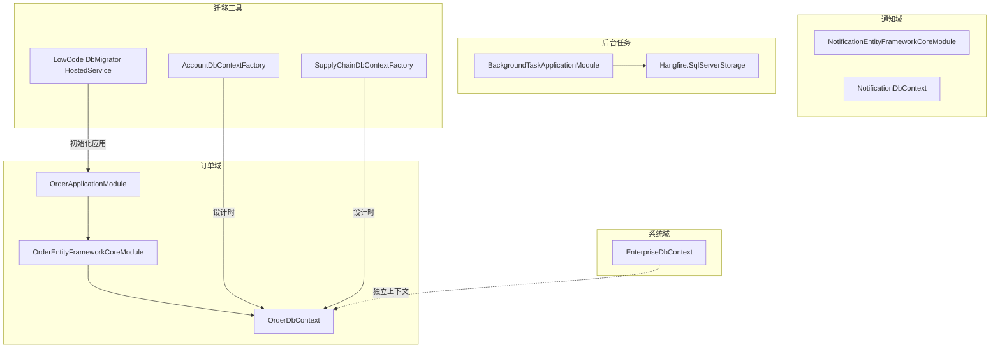
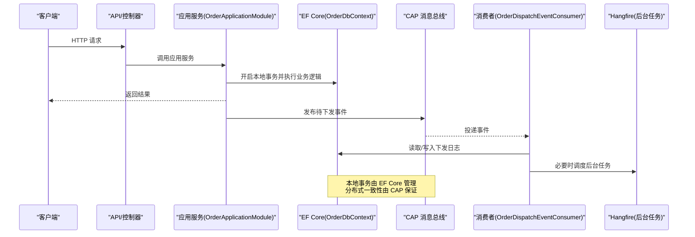
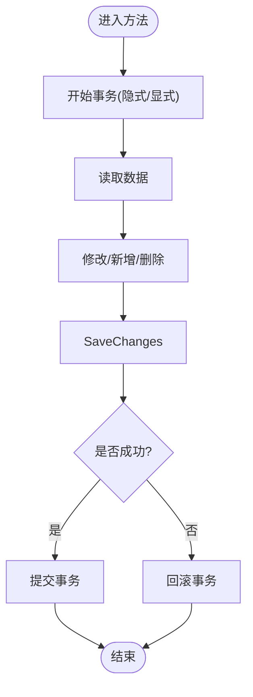
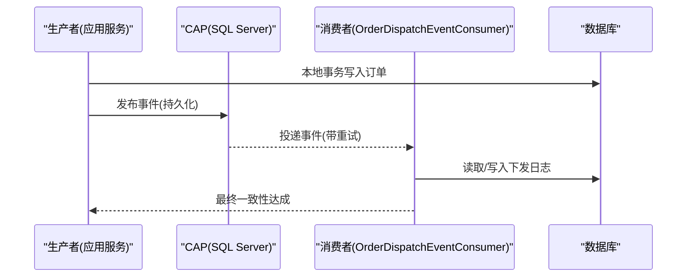
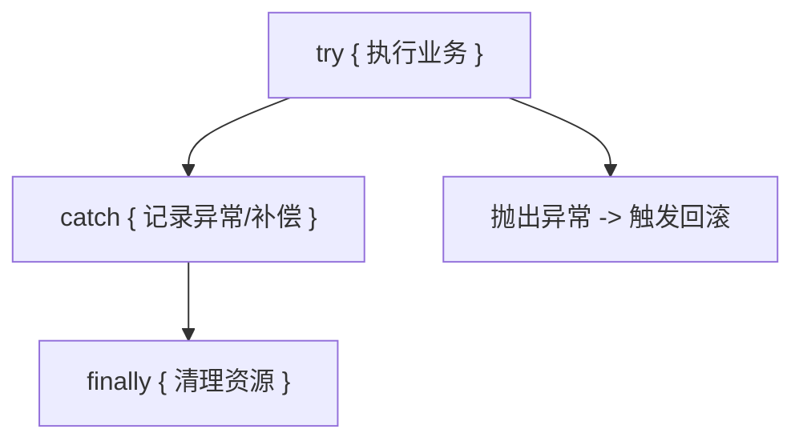
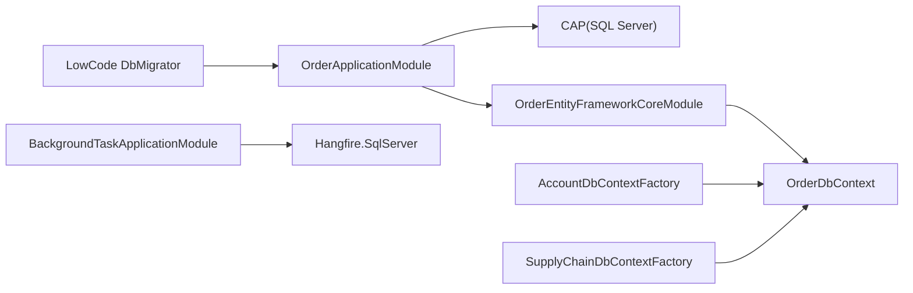

# 事务管理

<cite>
**本文引用的文件**   
- [OrderDbContext.cs](file://src/Services/Order/H.Order.EntityFrameworkCore/OrderDbContext.cs)
- [OrderEntityFrameworkCoreModule.cs](file://src/Services/Order/H.Order.EntityFrameworkCore/OrderEntityFrameworkCoreModule.cs)
- [BackgroundTaskApplicationModule.cs](file://src/services/BackgroundTask/H.BackgroundTask.Application/BackgroundTaskApplicationModule.cs)
- [OrderApplicationModule.cs](file://src/Services/Order/H.Order.Application/OrderApplicationModule.cs)
- [OrderDispatchEventConsumer.cs](file://src/Services/Order/H.Order.Application/Services/OrderDispatchEventConsumer.cs)
- [QueryWithNoLockDbCommandInterceptor.cs（设计引擎）](file://src/LowCode/DesignEngine/H.LowCode.DesignEngine.EntityFrameworkCore/Extensions/QueryWithNoLockDbCommandInterceptor.cs)
- [QueryWithNoLockDbCommandInterceptor.cs（渲染引擎）](file://src/LowCode/RenderEngine/H.LowCode.RenderEngine.EntityFrameworkCore/Extensions/QueryWithNoLockDbCommandInterceptor.cs)
- [ReadOnlySaveChangesInterceptor.cs（设计引擎）](file://src/LowCode/DesignEngine/H.LowCode.DesignEngine.EntityFrameworkCore/Extensions/ReadOnlySaveChangesInterceptor.cs)
- [ReadOnlySaveChangesInterceptor.cs（渲染引擎）](file://src/LowCode/RenderEngine/H.LowCode.RenderEngine.EntityFrameworkCore/Extensions/ReadOnlySaveChangesInterceptor.cs)
- [HostedService.cs（LowCode DbMigrator）](file://src/Tools/H.LowCode.DbMigrator/HostedService.cs)
- [AccountDbContextFactory.cs](file://src/Tools/H.Account.DbMigrator/AccountDbContextFactory.cs)
- [SupplyChainDbContextFactory.cs](file://src/Tools/H.SupplyChain.DbMigrator/SupplyChainDbContextFactory.cs)
- [EnterpriseDbContext.cs](file://src/System/Enterprise/H.Enterprise.EntityFrameworkCore/EnterpriseDbContext.cs)
- [Error.razor（宿主错误页）](file://src/Host/H.AppLab.Host.All/H.AppLab.Host.All/Components/Pages/Error.razor)
</cite>

## 目录
1. [简介](#简介)
2. [项目结构](#项目结构)
3. [核心组件](#核心组件)
4. [架构总览](#架构总览)
5. [详细组件分析](#详细组件分析)
6. [依赖关系分析](#依赖关系分析)
7. [性能考量](#性能考量)
8. [故障排查指南](#故障排查指南)
9. [结论](#结论)
10. [附录](#附录)

## 简介
本文件面向 AppLab 事务管理，围绕 EF Core 在 ABP 框架下的本地事务与分布式事务实践进行系统化说明。内容涵盖：
- 本地事务生命周期、隔离级别选择与配置
- 异常处理与回滚策略
- 跨服务调用的一致性保障（CAP 消息总线）
- 长事务与资源管理最佳实践
- 死锁预防与解决
- 事务监控与日志记录方案

## 项目结构
本项目采用多模块、多数据库的领域驱动架构，每个业务域通过独立的 DbContext 和 AbpModule 完成数据访问与连接配置；同时引入 CAP 实现跨服务事件一致性，Hangfire 作为后台任务存储。

**图示来源** 
- [OrderEntityFrameworkCoreModule.cs:1-31](file://src/Services/Order/H.Order.EntityFrameworkCore/OrderEntityFrameworkCoreModule.cs#L1-L31)
- [OrderDbContext.cs:1-110](file://src/Services/Order/H.Order.EntityFrameworkCore/OrderDbContext.cs#L1-L110)
- [BackgroundTaskApplicationModule.cs:1-57](file://src/services/BackgroundTask/H.BackgroundTask.Application/BackgroundTaskApplicationModule.cs#L1-L57)
- [HostedService.cs（LowCode DbMigrator）:1-49](file://src/Tools/H.LowCode.DbMigrator/HostedService.cs#L1-L49)
- [AccountDbContextFactory.cs:1-28](file://src/Tools/H.Account.DbMigrator/AccountDbContextFactory.cs#L1-L28)
- [SupplyChainDbContextFactory.cs:1-26](file://src/Tools/H.SupplyChain.DbMigrator/SupplyChainDbContextFactory.cs#L1-L26)
- [EnterpriseDbContext.cs:1-44](file://src/System/Enterprise/H.Enterprise.EntityFrameworkCore/EnterpriseDbContext.cs#L1-L44)

**章节来源**
- [OrderEntityFrameworkCoreModule.cs:1-31](file://src/Services/Order/H.Order.EntityFrameworkCore/OrderEntityFrameworkCoreModule.cs#L1-L31)
- [OrderDbContext.cs:1-110](file://src/Services/Order/H.Order.EntityFrameworkCore/OrderDbContext.cs#L1-L110)
- [BackgroundTaskApplicationModule.cs:1-57](file://src/services/BackgroundTask/H.BackgroundTask.Application/BackgroundTaskApplicationModule.cs#L1-L57)
- [HostedService.cs（LowCode DbMigrator）:1-49](file://src/Tools/H.LowCode.DbMigrator/HostedService.cs#L1-L49)
- [AccountDbContextFactory.cs:1-28](file://src/Tools/H.Account.DbMigrator/AccountDbContextFactory.cs#L1-L28)
- [SupplyChainDbContextFactory.cs:1-26](file://src/Tools/H.SupplyChain.DbMigrator/SupplyChainDbContextFactory.cs#L1-L26)
- [EnterpriseDbContext.cs:1-44](file://src/System/Enterprise/H.Enterprise.EntityFrameworkCore/EnterpriseDbContext.cs#L1-L44)

## 核心组件
- 数据库上下文与模块注册
  - 各域通过 AbpDbContext<T> 定义 DbContext，并在对应 AbpModule 中注册连接字符串与 EF 提供程序。
  - 示例：订单域的 OrderDbContext 与 OrderEntityFrameworkCoreModule 完成 SQL Server 连接与默认仓储启用。
- 后台任务与隔离级别
  - Hangfire 使用 SqlServerStorageOptions 的 UseRecommendedIsolationLevel=true 启用推荐隔离级别，避免手工配置偏差。
- 分布式事务与消息一致性
  - CAP 集成 SQL Server 持久化与内存队列（可替换为 MQ），失败重试次数与间隔可配置。
- 查询拦截器与写保护
  - 设计/渲染引擎通过 DbCommandInterceptor 注入 WITH (NOLOCK) 提升读性能；通过 SaveChangesInterceptor 对标记只读的实体执行写操作抛出异常，防止误改。

**章节来源**
- [OrderDbContext.cs:1-110](file://src/Services/Order/H.Order.EntityFrameworkCore/OrderDbContext.cs#L1-L110)
- [OrderEntityFrameworkCoreModule.cs:1-31](file://src/Services/Order/H.Order.EntityFrameworkCore/OrderEntityFrameworkCoreModule.cs#L1-L31)
- [BackgroundTaskApplicationModule.cs:1-57](file://src/services/BackgroundTask/H.BackgroundTask.Application/BackgroundTaskApplicationModule.cs#L1-L57)
- [OrderApplicationModule.cs:34-50](file://src/Services/Order/H.Order.Application/OrderApplicationModule.cs#L34-L50)
- [QueryWithNoLockDbCommandInterceptor.cs（设计引擎）:1-36](file://src/LowCode/DesignEngine/H.LowCode.DesignEngine.EntityFrameworkCore/Extensions/QueryWithNoLockDbCommandInterceptor.cs#L1-L36)
- [QueryWithNoLockDbCommandInterceptor.cs（渲染引擎）:1-36](file://src/LowCode/RenderEngine/H.LowCode.RenderEngine.EntityFrameworkCore/Extensions/QueryWithNoLockDbCommandInterceptor.cs#L1-L36)
- [ReadOnlySaveChangesInterceptor.cs（设计引擎）:1-41](file://src/LowCode/DesignEngine/H.LowCode.DesignEngine.EntityFrameworkCore/Extensions/ReadOnlySaveChangesInterceptor.cs#L1-L41)
- [ReadOnlySaveChangesInterceptor.cs（渲染引擎）:1-41](file://src/LowCode/RenderEngine/H.LowCode.RenderEngine.EntityFrameworkCore/Extensions/ReadOnlySaveChangesInterceptor.cs#L1-L41)

## 架构总览
下图展示从请求到数据访问、再到分布式消息一致性的整体流程，以及迁移工具的启动路径。

**图示来源** 
- [OrderApplicationModule.cs:34-50](file://src/Services/Order/H.Order.Application/OrderApplicationModule.cs#L34-L50)
- [OrderDbContext.cs:1-110](file://src/Services/Order/H.Order.EntityFrameworkCore/OrderDbContext.cs#L1-L110)
- [OrderDispatchEventConsumer.cs:1-33](file://src/Services/Order/H.Order.Application/Services/OrderDispatchEventConsumer.cs#L1-L33)
- [BackgroundTaskApplicationModule.cs:1-57](file://src/services/BackgroundTask/H.BackgroundTask.Application/BackgroundTaskApplicationModule.cs#L1-L57)

## 详细组件分析

### 本地事务与 EF Core 生命周期
- 生命周期要点
  - 在 ABP + EF Core 下，默认以“方法级”或“显式事务”为单位开启/提交/回滚。
  - 保存变更通过 SaveChanges/SaveChangesAsync 触发，异常将导致回滚。
- 隔离级别
  - 推荐使用数据库/驱动推荐的隔离级别（如 Hangfire 的 UseRecommendedIsolationLevel）。
  - 若需自定义，可在 DbContextOptionsBuilder 或数据库提供程序选项中设置。
- 最佳实践
  - 控制事务边界，避免在事务内执行耗时 I/O。
  - 合理拆分大事务，减少锁持有时间。
  - 对只读查询使用 NOLOCK 或快照隔离降低阻塞。

**图示来源** 
- [OrderDbContext.cs:1-110](file://src/Services/Order/H.Order.EntityFrameworkCore/OrderDbContext.cs#L1-L110)
- [OrderEntityFrameworkCoreModule.cs:1-31](file://src/Services/Order/H.Order.EntityFrameworkCore/OrderEntityFrameworkCoreModule.cs#L1-L31)

**章节来源**
- [OrderDbContext.cs:1-110](file://src/Services/Order/H.Order.EntityFrameworkCore/OrderDbContext.cs#L1-L110)
- [OrderEntityFrameworkCoreModule.cs:1-31](file://src/Services/Order/H.Order.EntityFrameworkCore/OrderEntityFrameworkCoreModule.cs#L1-L31)

### 分布式事务与 CAP 一致性
- 模式
  - 本地事务完成后发布事件，消费者异步处理，最终一致性。
  - CAP 将事件持久化至 SQL Server，失败自动重试。
- 关键配置
  - UseSqlServer(connectionString) 持久化事件表。
  - FailedRetryCount/FailedRetryInterval 控制重试策略。
- 消费者职责
  - 幂等处理、异常捕获、日志记录、必要时回退状态或补偿。

**图示来源** 
- [OrderApplicationModule.cs:34-50](file://src/Services/Order/H.Order.Application/OrderApplicationModule.cs#L34-L50)
- [OrderDispatchEventConsumer.cs:1-33](file://src/Services/Order/H.Order.Application/Services/OrderDispatchEventConsumer.cs#L1-L33)

**章节来源**
- [OrderApplicationModule.cs:34-50](file://src/Services/Order/H.Order.Application/OrderApplicationModule.cs#L34-L50)
- [OrderDispatchEventConsumer.cs:1-33](file://src/Services/Order/H.Order.Application/Services/OrderDispatchEventConsumer.cs#L1-L33)

### 长事务与资源管理
- 原则
  - 避免在事务中做网络调用、外部 API 请求、复杂计算。
  - 将耗时操作移至后台任务（Hangfire）或异步队列。
- 资源释放
  - 确保 DbContext 按作用域创建与释放（ABP 默认管理）。
  - 对非托管资源使用 using/Dispose 模式。
- 监控
  - 记录慢查询、事务时长、锁等待、重试次数。

[本节为通用指导，不直接分析具体文件]

### 异常处理与回滚策略
- 本地事务
  - 任何未捕获异常都会触发回滚。建议在应用层统一异常处理与日志记录。
- 分布式场景
  - CAP 消费者应捕获异常并记录，必要时进行补偿或人工干预。
- 只读保护
  - 通过 SaveChangesInterceptor 对标记只读的实体执行写操作抛出异常，防止误改。

**图示来源** 
- [ReadOnlySaveChangesInterceptor.cs（设计引擎）:1-41](file://src/LowCode/DesignEngine/H.LowCode.DesignEngine.EntityFrameworkCore/Extensions/ReadOnlySaveChangesInterceptor.cs#L1-L41)
- [ReadOnlySaveChangesInterceptor.cs（渲染引擎）:1-41](file://src/LowCode/RenderEngine/H.LowCode.RenderEngine.EntityFrameworkCore/Extensions/ReadOnlySaveChangesInterceptor.cs#L1-L41)

**章节来源**
- [ReadOnlySaveChangesInterceptor.cs（设计引擎）:1-41](file://src/LowCode/DesignEngine/H.LowCode.DesignEngine.EntityFrameworkCore/Extensions/ReadOnlySaveChangesInterceptor.cs#L1-L41)
- [ReadOnlySaveChangesInterceptor.cs（渲染引擎）:1-41](file://src/LowCode/RenderEngine/H.LowCode.RenderEngine.EntityFrameworkCore/Extensions/ReadOnlySaveChangesInterceptor.cs#L1-L41)

### 跨服务调用的一致性保证
- 事件溯源与幂等
  - 使用唯一事件键/业务键，消费者幂等处理重复投递。
- 补偿机制
  - 当下游失败时，记录失败原因与重试计划，支持手动重试。
- 审计与追踪
  - 记录请求 ID、事务 ID、事件 ID，便于链路追踪。

**章节来源**
- [OrderApplicationModule.cs:34-50](file://src/Services/Order/H.Order.Application/OrderApplicationModule.cs#L34-L50)
- [OrderDispatchEventConsumer.cs:1-33](file://src/Services/Order/H.Order.Application/Services/OrderDispatchEventConsumer.cs#L1-L33)

### 事务死锁的预防与解决
- 预防
  - 固定访问顺序，避免交叉锁。
  - 缩小事务范围，减少锁持有时间。
  - 合理使用索引，避免全表扫描导致的锁升级。
  - 读多写少场景考虑 NOLOCK 或快照隔离。
- 解决
  - 监控死锁报告，调整 SQL 与索引。
  - 增加重试与退避策略。
  - 拆分热点更新，使用队列削峰。

[本节为通用指导，不直接分析具体文件]

### 事务监控与日志记录
- 建议
  - 记录事务开始/结束、SQL 执行时间、影响行数、异常信息。
  - 对 CAP 事件记录投递、消费、重试、失败详情。
  - 对 Hangfire 作业记录执行状态与耗时。
- 实现
  - 使用 Serilog/内置日志框架集中输出。
  - 结合 APM 工具（如 Application Insights、SkyWalking）进行链路追踪。

**章节来源**
- [BackgroundTaskApplicationModule.cs:1-57](file://src/services/BackgroundTask/H.BackgroundTask.Application/BackgroundTaskApplicationModule.cs#L1-L57)
- [OrderApplicationModule.cs:34-50](file://src/Services/Order/H.Order.Application/OrderApplicationModule.cs#L34-L50)

## 依赖关系分析
- 模块依赖
  - OrderApplicationModule 依赖 OrderEntityFrameworkCoreModule 与 CAP。
  - BackgroundTaskApplicationModule 依赖 Hangfire.SqlServer。
- 上下文依赖
  - 各 DbContext 通过 AbpDbContext<T> 继承，模块中注册连接字符串与提供程序。
- 迁移依赖
  - DbMigrator 通过 IDesignTimeDbContextFactory 在设计时构建 DbContext。

**图示来源** 
- [OrderApplicationModule.cs:34-50](file://src/Services/Order/H.Order.Application/OrderApplicationModule.cs#L34-L50)
- [OrderEntityFrameworkCoreModule.cs:1-31](file://src/Services/Order/H.Order.EntityFrameworkCore/OrderEntityFrameworkCoreModule.cs#L1-L31)
- [OrderDbContext.cs:1-110](file://src/Services/Order/H.Order.EntityFrameworkCore/OrderDbContext.cs#L1-L110)
- [BackgroundTaskApplicationModule.cs:1-57](file://src/services/BackgroundTask/H.BackgroundTask.Application/BackgroundTaskApplicationModule.cs#L1-L57)
- [HostedService.cs（LowCode DbMigrator）:1-49](file://src/Tools/H.LowCode.DbMigrator/HostedService.cs#L1-L49)
- [AccountDbContextFactory.cs:1-28](file://src/Tools/H.Account.DbMigrator/AccountDbContextFactory.cs#L1-L28)
- [SupplyChainDbContextFactory.cs:1-26](file://src/Tools/H.SupplyChain.DbMigrator/SupplyChainDbContextFactory.cs#L1-L26)

**章节来源**
- [OrderApplicationModule.cs:34-50](file://src/Services/Order/H.Order.Application/OrderApplicationModule.cs#L34-L50)
- [OrderEntityFrameworkCoreModule.cs:1-31](file://src/Services/Order/H.Order.EntityFrameworkCore/OrderEntityFrameworkCoreModule.cs#L1-L31)
- [OrderDbContext.cs:1-110](file://src/Services/Order/H.Order.EntityFrameworkCore/OrderDbContext.cs#L1-L110)
- [BackgroundTaskApplicationModule.cs:1-57](file://src/services/BackgroundTask/H.BackgroundTask.Application/BackgroundTaskApplicationModule.cs#L1-L57)
- [HostedService.cs（LowCode DbMigrator）:1-49](file://src/Tools/H.LowCode.DbMigrator/HostedService.cs#L1-L49)
- [AccountDbContextFactory.cs:1-28](file://src/Tools/H.Account.DbMigrator/AccountDbContextFactory.cs#L1-L28)
- [SupplyChainDbContextFactory.cs:1-26](file://src/Tools/H.SupplyChain.DbMigrator/SupplyChainDbContextFactory.cs#L1-L26)

## 性能考量
- 读优化
  - 使用 WITH (NOLOCK) 或快照隔离降低读阻塞（注意脏读风险）。
  - 合理索引与分页，避免大结果集加载。
- 写优化
  - 批量插入/更新，减少往返。
  - 避免在事务中进行外部调用。
- 监控
  - 关注慢查询、锁等待、重试风暴。

**章节来源**
- [QueryWithNoLockDbCommandInterceptor.cs（设计引擎）:1-36](file://src/LowCode/DesignEngine/H.LowCode.DesignEngine.EntityFrameworkCore/Extensions/QueryWithNoLockDbCommandInterceptor.cs#L1-L36)
- [QueryWithNoLockDbCommandInterceptor.cs（渲染引擎）:1-36](file://src/LowCode/RenderEngine/H.LowCode.RenderEngine.EntityFrameworkCore/Extensions/QueryWithNoLockDbCommandInterceptor.cs#L1-L36)

## 故障排查指南
- 常见问题
  - 连接字符串错误：检查 appsettings.json 与模块中的连接名。
  - 迁移失败：确认设计时工厂与启动项目配置正确。
  - 事务超时：缩短事务范围，优化 SQL。
  - 死锁：查看 SQL Server 死锁报告，调整访问顺序与索引。
  - CAP 重试风暴：调优 FailedRetryCount/FailedRetryInterval。
- 定位手段
  - 启用详细日志与 APM 追踪。
  - 使用 Error.razor 页面收集请求 ID。
  - 检查 Hangfire 作业执行历史。

**章节来源**
- [AccountDbContextFactory.cs:1-28](file://src/Tools/H.Account.DbMigrator/AccountDbContextFactory.cs#L1-L28)
- [SupplyChainDbContextFactory.cs:1-26](file://src/Tools/H.SupplyChain.DbMigrator/SupplyChainDbContextFactory.cs#L1-L26)
- [OrderApplicationModule.cs:34-50](file://src/Services/Order/H.Order.Application/OrderApplicationModule.cs#L34-L50)
- [BackgroundTaskApplicationModule.cs:1-57](file://src/services/BackgroundTask/H.BackgroundTask.Application/BackgroundTaskApplicationModule.cs#L1-L57)
- [Error.razor（宿主错误页）:1-36](file://src/Host/H.AppLab.Host.All/H.AppLab.Host.All/Components/Pages/Error.razor#L1-L36)

## 结论
AppLab 的事务管理基于 ABP + EF Core 的本地事务与 CAP 的分布式一致性，配合 Hangfire 的后台任务能力，形成稳健的数据一致性体系。通过合理的隔离级别、事务边界控制、异常与重试策略、以及完善的监控与日志，可有效应对高并发与复杂业务场景。

[本节为总结性内容，不直接分析具体文件]

## 附录
- 术语
  - 本地事务：单个数据库连接内的 ACID 事务。
  - 分布式事务：跨多个服务/数据库的一致性保障（本仓库采用 CAP 最终一致性）。
  - 隔离级别：事务间可见性与锁行为规则。
- 参考
  - ABP 文档：DbContext 与事务
  - EF Core 文档：事务与隔离级别
  - CAP 文档：事件持久化与重试
  - Hangfire 文档：SQL Server 存储选项

[本节为补充信息，不直接分析具体文件]