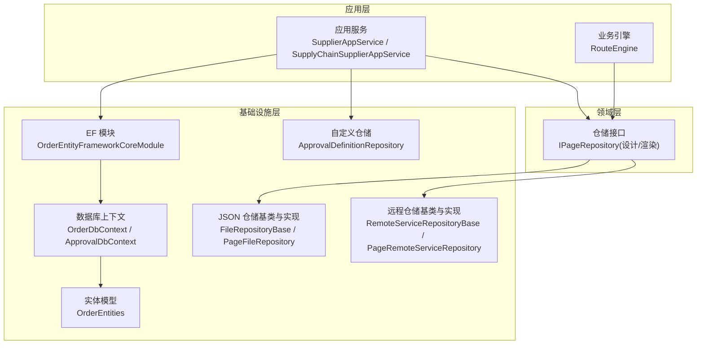
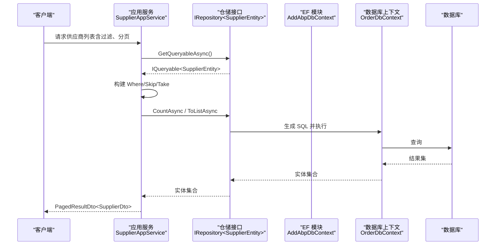
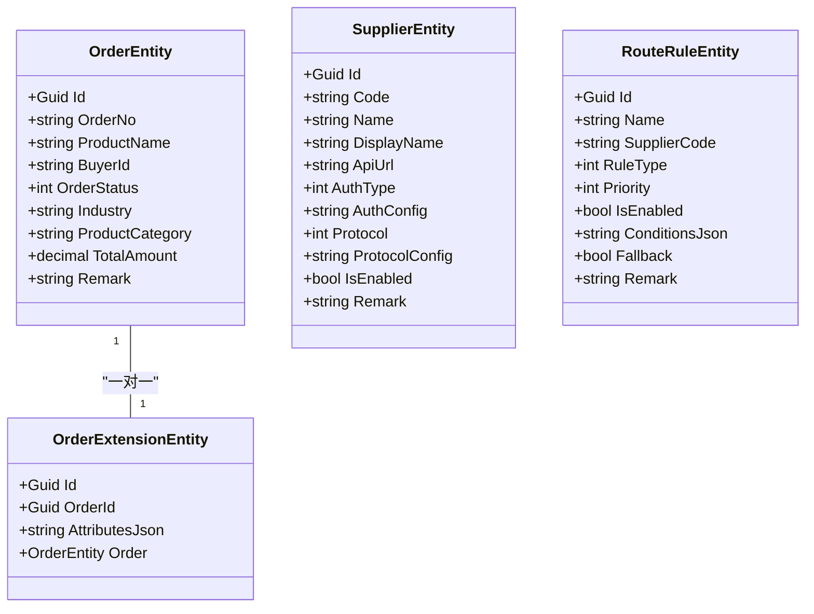
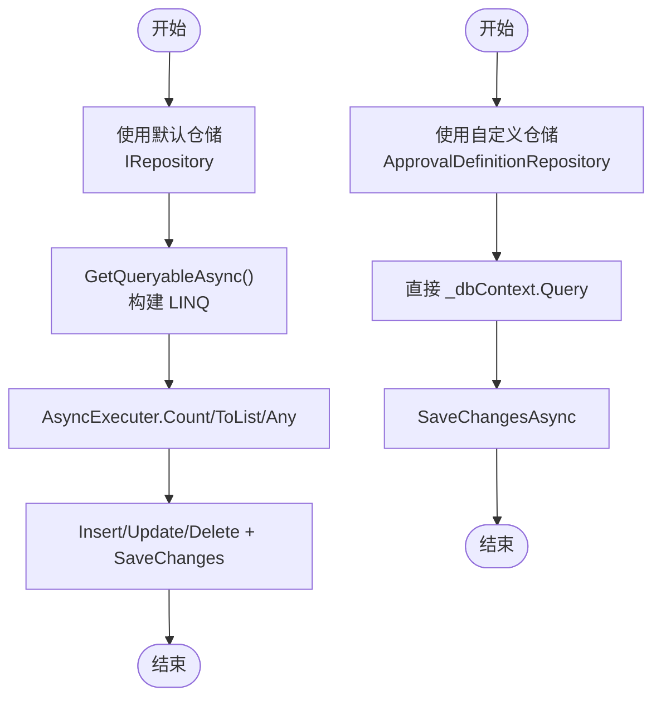
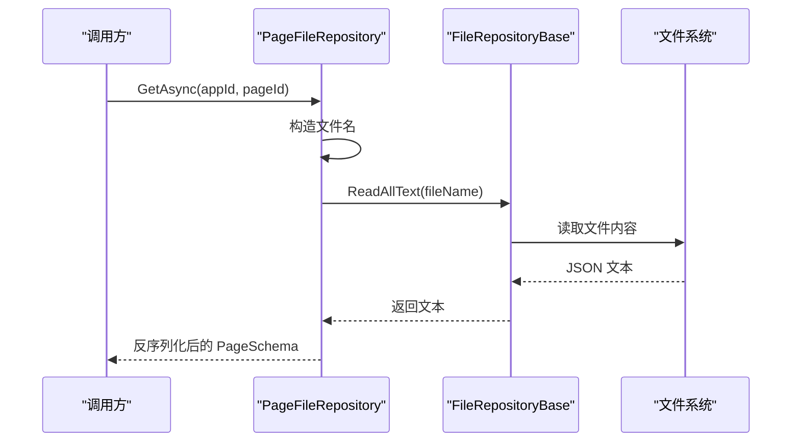
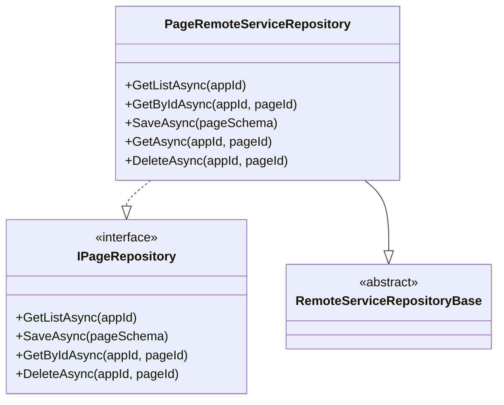
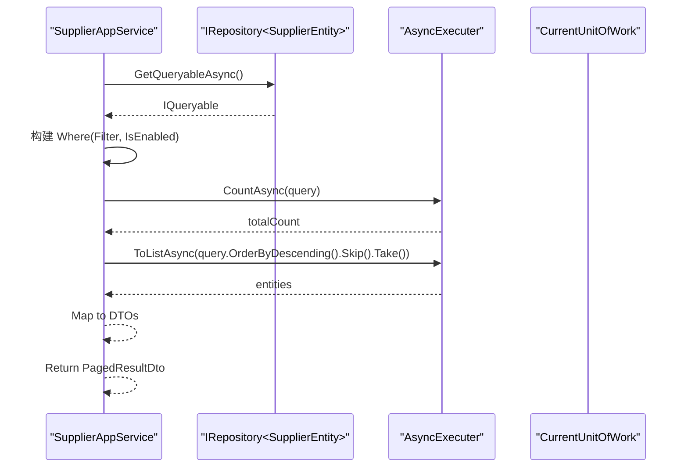
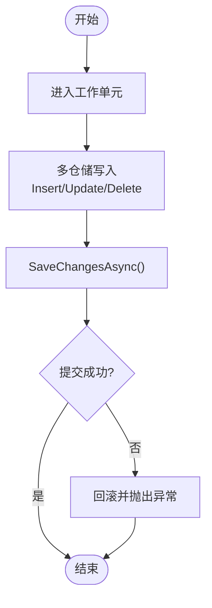
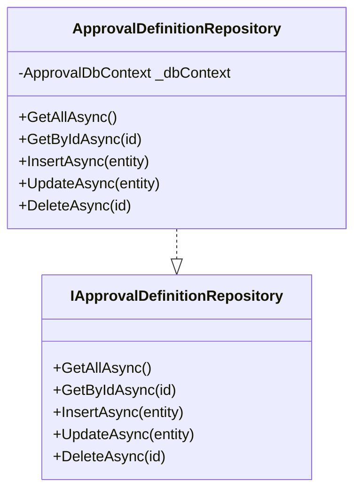
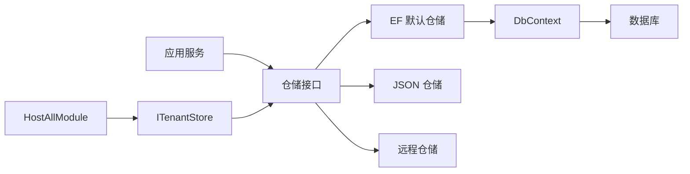

# 仓储模式实现

<cite>
**本文引用的文件**   
- [OrderDbContext.cs](file://src/Services/Order/H.Order.EntityFrameworkCore/OrderDbContext.cs)
- [OrderEntityFrameworkCoreModule.cs](file://src/Services/Order/H.Order.EntityFrameworkCore/OrderEntityFrameworkCoreModule.cs)
- [OrderEntities.cs](file://src/Services/Order/H.Order.EntityFrameworkCore/Entities/OrderEntities.cs)
- [SupplierAppService.cs](file://src/Services/Order/H.Order.Application/Services/SupplierAppService.cs)
- [SupplyChainAppServices.cs](file://src/Services/SupplyChain/H.SupplyChain.Application/Services/SupplyChainAppServices.cs)
- [RouteEngine.cs](file://src/Services/Order/H.Order.Application/Services/RouteEngine.cs)
- [ApprovalDefinitionRepository.cs](file://src/services/Approval/H.Approval.EntityFrameworkCore/Repositories/ApprovalRepository.cs)
- [IApprovalRepository.cs](file://src/services/Approval/H.Approval.EntityFrameworkCore/Repositories/IApprovalRepository.cs)
- [IPageRepository.cs（设计引擎）](file://src/LowCode/DesignEngine/H.LowCode.DesignEngine.Domain/MetaRepositories/IPageRepository.cs)
- [IPageRepository.cs（渲染引擎）](file://src/LowCode/RenderEngine/H.LowCode.RenderEngine.Domain/MetaRepositories/IPageRepository.cs)
- [PageRemoteServiceRepository.cs（设计引擎）](file://src/LowCode/DesignEngine/H.LowCode.DesignEngine.Repository.RemoteService/Repositories/PageRemoteServiceRepository.cs)
- [PageRemoteServiceRepository.cs（渲染引擎）](file://src/LowCode/RenderEngine/H.LowCode.RenderEngine.Repository.RemoteService/Repositories/PageRemoteServiceRepository.cs)
- [FileRepositoryBase.cs](file://src/LowCode/DesignEngine/H.LowCode.DesignEngine.Repository.JsonFile/Base/FileRepositoryBase.cs)
- [PageFileRepository.cs](file://src/LowCode/RenderEngine/H.LowCode.RenderEngine.Repository.JsonFile/Repositories/PageFileRepository.cs)
- [ApprovalDbContext.cs](file://src/Services/Approval/H.Approval.EntityFrameworkCore/ApprovalDbContext.cs)
- [HostAllModule.cs](file://src/Host/H.AppLab.Host.All/H.AppLab.Host.All/HostAllModule.cs)
</cite>

## 目录
1. [简介](#简介)
2. [项目结构](#项目结构)
3. [核心组件](#核心组件)
4. [架构总览](#架构总览)
5. [详细组件分析](#详细组件分析)
6. [依赖关系分析](#依赖关系分析)
7. [性能考虑](#性能考虑)
8. [故障排查指南](#故障排查指南)
9. [结论](#结论)
10. [附录](#附录)

## 简介
本文件围绕 AppLab 的仓储模式实现进行系统化说明，覆盖接口与实现、CRUD 与复杂查询、分页排序、领域驱动设计中仓储与实体的关系、异步操作与最佳实践、事务管理与并发控制、自定义仓储方法开发指南，以及性能优化与常见问题解决方案。文档以仓库中实际代码为依据，结合 ABP 框架与 Entity Framework Core 的使用方式，给出可操作的指导与图示。

## 项目结构
仓储模式在项目中呈现为“领域接口 + 应用服务 + EF 仓储基类/模块 + 多种存储实现”的分层组织：
- 领域层定义仓储接口（如 IPageRepository），与应用无关，仅描述数据访问契约。
- 应用层通过 IRepository<T, TKey> 或自定义仓储接口完成 CRUD、复杂查询与分页排序。
- EF Core 层通过 AbpDbContext 与 AddAbpDbContext 自动注册默认仓储；同时提供自定义仓储实现。
- 存储实现多样化：EF Core、远程服务代理、JSON 文件等，均实现同一领域接口，便于替换与扩展。

图表来源
- [OrderEntityFrameworkCoreModule.cs:11-30](file://src/Services/Order/H.Order.EntityFrameworkCore/OrderEntityFrameworkCoreModule.cs#L11-L30)
- [OrderDbContext.cs:10-31](file://src/Services/Order/H.Order.EntityFrameworkCore/OrderDbContext.cs#L10-L31)
- [OrderEntities.cs:9-37](file://src/Services/Order/H.Order.EntityFrameworkCore/Entities/OrderEntities.cs#L9-L37)
- [ApprovalDefinitionRepository.cs:12-48](file://src/services/Approval/H.Approval.EntityFrameworkCore/Repositories/ApprovalRepository.cs#L12-L48)
- [FileRepositoryBase.cs:11-30](file://src/LowCode/DesignEngine/H.LowCode.DesignEngine.Repository.JsonFile/Base/FileRepositoryBase.cs#L11-L30)
- [PageFileRepository.cs:9-27](file://src/LowCode/RenderEngine/H.LowCode.RenderEngine.Repository.JsonFile/Repositories/PageFileRepository.cs#L9-L27)
- [PageRemoteServiceRepository.cs（设计引擎）:12-43](file://src/LowCode/DesignEngine/H.LowCode.DesignEngine.Repository.RemoteService/Repositories/PageRemoteServiceRepository.cs#L12-L43)

章节来源
- [OrderEntityFrameworkCoreModule.cs:11-30](file://src/Services/Order/H.Order.EntityFrameworkCore/OrderEntityFrameworkCoreModule.cs#L11-L30)
- [OrderDbContext.cs:10-31](file://src/Services/Order/H.Order.EntityFrameworkCore/OrderDbContext.cs#L10-L31)
- [OrderEntities.cs:9-37](file://src/Services/Order/H.Order.EntityFrameworkCore/Entities/OrderEntities.cs#L9-L37)

## 核心组件
- 仓储接口（领域契约）
  - IPageRepository（设计引擎）：定义页面元数据的列表、保存、按 ID 获取、删除等操作。
  - IPageRepository（渲染引擎）：定义页面元数据的读取操作。
- 仓储实现
  - EF Core 默认仓储：通过 AddAbpDbContext(includeAllEntities: true) 自动生成，支持 GetQueryableAsync、InsertAsync、UpdateAsync、DeleteAsync、GetAsync 等。
  - 自定义仓储：ApprovalDefinitionRepository 直接基于 DbContext 实现复杂查询与事务边界。
  - JSON 文件仓储：FileRepositoryBase 提供统一文件读写能力，PageFileRepository 实现具体页面的读取。
  - 远程服务仓储：RemoteServiceRepositoryBase 作为抽象基类，PageRemoteServiceRepository 实现远程调用契约（当前为占位）。
- 应用服务中的仓储使用
  - SupplierAppService / SupplyChainSupplierAppService：展示标准 CRUD、条件过滤、分页排序、异步执行器 AsyncExecuter 的使用。
  - RouteEngine：展示基于规则的多仓储协作与复杂查询。

章节来源
- [IPageRepository.cs（设计引擎）:6-15](file://src/LowCode/DesignEngine/H.LowCode.DesignEngine.Domain/MetaRepositories/IPageRepository.cs#L6-L15)
- [IPageRepository.cs（渲染引擎）:5-8](file://src/LowCode/RenderEngine/H.LowCode.RenderEngine.Domain/MetaRepositories/IPageRepository.cs#L5-L8)
- [OrderEntityFrameworkCoreModule.cs:16-19](file://src/Services/Order/H.Order.EntityFrameworkCore/OrderEntityFrameworkCoreModule.cs#L16-L19)
- [ApprovalDefinitionRepository.cs:12-48](file://src/services/Approval/H.Approval.EntityFrameworkCore/Repositories/ApprovalRepository.cs#L12-L48)
- [FileRepositoryBase.cs:11-30](file://src/LowCode/DesignEngine/H.LowCode.DesignEngine.Repository.JsonFile/Base/FileRepositoryBase.cs#L11-L30)
- [PageFileRepository.cs:9-27](file://src/LowCode/RenderEngine/H.LowCode.RenderEngine.Repository.JsonFile/Repositories/PageFileRepository.cs#L9-L27)
- [PageRemoteServiceRepository.cs（设计引擎）:12-43](file://src/LowCode/DesignEngine/H.LowCode.DesignEngine.Repository.RemoteService/Repositories/PageRemoteServiceRepository.cs#L12-L43)
- [SupplierAppService.cs:22-69](file://src/Services/Order/H.Order.Application/Services/SupplierAppService.cs#L22-L69)
- [SupplyChainAppServices.cs:28-73](file://src/Services/SupplyChain/H.SupplyChain.Application/Services/SupplyChainAppServices.cs#L28-L73)
- [RouteEngine.cs:22-38](file://src/Services/Order/H.Order.Application/Services/RouteEngine.cs#L22-L38)

## 架构总览
仓储模式在本项目的分层如下：
- 应用服务通过依赖注入获取 IRepository<T, TKey> 或自定义仓储接口，屏蔽底层存储差异。
- EF Core 模块集中配置连接字符串、数据库提供者与默认仓储生成。
- 领域接口与多实现（EF、JSON、远程）解耦，便于在不同环境切换存储策略。
- 多租户通过 IMultiTenant 与 HostAllModule 的 ITenantStore 集成，仓储查询自动附加租户过滤。

图表来源
- [SupplierAppService.cs:28-43](file://src/Services/Order/H.Order.Application/Services/SupplierAppService.cs#L28-L43)
- [OrderEntityFrameworkCoreModule.cs:16-19](file://src/Services/Order/H.Order.EntityFrameworkCore/OrderEntityFrameworkCoreModule.cs#L16-L19)
- [OrderDbContext.cs:10-31](file://src/Services/Order/H.Order.EntityFrameworkCore/OrderDbContext.cs#L10-L31)

章节来源
- [HostAllModule.cs:171-180](file://src/Host/H.AppLab.Host.All/H.AppLab.Host.All/HostAllModule.cs#L171-L180)
- [OrderEntityFrameworkCoreModule.cs:16-19](file://src/Services/Order/H.Order.EntityFrameworkCore/OrderEntityFrameworkCoreModule.cs#L16-L19)

## 详细组件分析

### 仓储接口与领域实体关系
- 领域接口定义数据访问契约，不依赖具体存储技术。
- 实体模型继承 ABP 审计与多租户基类，仓储操作天然具备审计与租户隔离。
- 示例：订单与扩展实体一对一关系，仓储层通过 EF 导航属性或显式查询组合。

图表来源
- [OrderEntities.cs:9-37](file://src/Services/Order/H.Order.EntityFrameworkCore/Entities/OrderEntities.cs#L9-L37)
- [OrderEntities.cs:42-55](file://src/Services/Order/H.Order.EntityFrameworkCore/Entities/OrderEntities.cs#L42-L55)
- [OrderEntities.cs:60-94](file://src/Services/Order/H.Order.EntityFrameworkCore/Entities/OrderEntities.cs#L60-L94)
- [OrderEntities.cs:99-127](file://src/Services/Order/H.Order.EntityFrameworkCore/Entities/OrderEntities.cs#L99-L127)

章节来源
- [OrderEntities.cs:9-37](file://src/Services/Order/H.Order.EntityFrameworkCore/Entities/OrderEntities.cs#L9-L37)
- [OrderEntities.cs:42-55](file://src/Services/Order/H.Order.EntityFrameworkCore/Entities/OrderEntities.cs#L42-L55)

### 仓储实现：EF 默认仓储与自定义仓储
- 默认仓储：通过 AddAbpDbContext 自动生成，提供 GetQueryableAsync、InsertAsync、UpdateAsync、DeleteAsync、GetAsync 等通用方法。
- 自定义仓储：ApprovalDefinitionRepository 直接操作 DbContext，适合复杂查询与批量操作。

图表来源
- [OrderEntityFrameworkCoreModule.cs:16-19](file://src/Services/Order/H.Order.EntityFrameworkCore/OrderEntityFrameworkCoreModule.cs#L16-L19)
- [ApprovalDefinitionRepository.cs:12-48](file://src/services/Approval/H.Approval.EntityFrameworkCore/Repositories/ApprovalRepository.cs#L12-L48)

章节来源
- [OrderEntityFrameworkCoreModule.cs:16-19](file://src/Services/Order/H.Order.EntityFrameworkCore/OrderEntityFrameworkCoreModule.cs#L16-L19)
- [ApprovalDefinitionRepository.cs:12-48](file://src/services/Approval/H.Approval.EntityFrameworkCore/Repositories/ApprovalRepository.cs#L12-L48)

### 仓储实现：JSON 文件仓储
- FileRepositoryBase 提供统一的文件路径与读取能力，IsChangeTrackingEnabled 设为 false。
- PageFileRepository 根据 appId 与 pageId 构造文件名并读取 JSON 反序列化为 PageSchema。

图表来源
- [FileRepositoryBase.cs:11-30](file://src/LowCode/DesignEngine/H.LowCode.DesignEngine.Repository.JsonFile/Base/FileRepositoryBase.cs#L11-L30)
- [PageFileRepository.cs:9-27](file://src/LowCode/RenderEngine/H.LowCode.RenderEngine.Repository.JsonFile/Repositories/PageFileRepository.cs#L9-L27)

章节来源
- [FileRepositoryBase.cs:11-30](file://src/LowCode/DesignEngine/H.LowCode.DesignEngine.Repository.JsonFile/Base/FileRepositoryBase.cs#L11-L30)
- [PageFileRepository.cs:9-27](file://src/LowCode/RenderEngine/H.LowCode.RenderEngine.Repository.JsonFile/Repositories/PageFileRepository.cs#L9-L27)

### 仓储实现：远程服务仓储
- RemoteServiceRepositoryBase 作为抽象基类，PageRemoteServiceRepository 实现 IPageRepository 的远程调用契约（当前为占位未实现）。
- 适用于跨进程/跨服务的元数据访问场景。

图表来源
- [PageRemoteServiceRepository.cs（设计引擎）:12-43](file://src/LowCode/DesignEngine/H.LowCode.DesignEngine.Repository.RemoteService/Repositories/PageRemoteServiceRepository.cs#L12-L43)
- [IPageRepository.cs（设计引擎）:6-15](file://src/LowCode/DesignEngine/H.LowCode.DesignEngine.Domain/MetaRepositories/IPageRepository.cs#L6-L15)

章节来源
- [PageRemoteServiceRepository.cs（设计引擎）:12-43](file://src/LowCode/DesignEngine/H.LowCode.DesignEngine.Repository.RemoteService/Repositories/PageRemoteServiceRepository.cs#L12-L43)
- [IPageRepository.cs（设计引擎）:6-15](file://src/LowCode/DesignEngine/H.LowCode.DesignEngine.Domain/MetaRepositories/IPageRepository.cs#L6-L15)

### 应用服务中的仓储使用：CRUD、复杂查询、分页排序
- SupplierAppService：展示 GetAsync、GetListAsync（过滤、排序、分页）、CreateAsync、UpdateAsync、DeleteAsync 的标准用法。
- SupplyChainSupplierAppService：类似逻辑，体现跨服务复用仓储模式的一致性。
- RouteEngine：基于多个仓储的复杂匹配逻辑，按优先级评估规则并命中供应商。

图表来源
- [SupplierAppService.cs:28-43](file://src/Services/Order/H.Order.Application/Services/SupplierAppService.cs#L28-L43)
- [SupplyChainAppServices.cs:28-43](file://src/Services/SupplyChain/H.SupplyChain.Application/Services/SupplyChainAppServices.cs#L28-L43)

章节来源
- [SupplierAppService.cs:22-69](file://src/Services/Order/H.Order.Application/Services/SupplierAppService.cs#L22-L69)
- [SupplyChainAppServices.cs:28-73](file://src/Services/SupplyChain/H.SupplyChain.Application/Services/SupplyChainAppServices.cs#L28-L73)
- [RouteEngine.cs:22-38](file://src/Services/Order/H.Order.Application/Services/RouteEngine.cs#L22-L38)

### 事务管理与并发控制
- 事务管理：应用服务中使用 CurrentUnitOfWork.SaveChangesAsync() 确保多仓储写入原子性。
- 并发控制：实体基类包含 ConcurrencyStamp 字段，ABP/EF 可通过并发令牌检测冲突。
- 审批流程中的并发：会签/或签逻辑通过仓储查询任务状态，保证一致性。

图表来源
- [SupplierAppService.cs:45-69](file://src/Services/Order/H.Order.Application/Services/SupplierAppService.cs#L45-L69)
- [ApprovalTaskAppService.cs:172-194](file://src/Services/Approval/H.Approval.Application/Services/ApprovalTaskAppService.cs#L172-L194)
- [ApprovalDbContext.cs:43-71](file://src/Services/Approval/H.Approval.EntityFrameworkCore/ApprovalDbContext.cs#L43-L71)

章节来源
- [SupplierAppService.cs:45-69](file://src/Services/Order/H.Order.Application/Services/SupplierAppService.cs#L45-L69)
- [ApprovalTaskAppService.cs:172-194](file://src/Services/Approval/H.Approval.Application/Services/ApprovalTaskAppService.cs#L172-L194)
- [ApprovalDbContext.cs:43-71](file://src/Services/Approval/H.Approval.EntityFrameworkCore/ApprovalDbContext.cs#L43-L71)

### 自定义仓储方法的开发指南
- 何时使用自定义仓储：当需要复杂查询、批量操作、跨表关联或性能敏感场景。
- 步骤：
  1. 定义仓储接口（如 IApprovalDefinitionRepository）。
  2. 实现仓储类（如 ApprovalDefinitionRepository），注入 DbContext。
  3. 在模块中注册仓储（如需），或通过 DI 直接注入。
  4. 在应用服务中注入并使用。

图表来源
- [IApprovalRepository.cs:8-38](file://src/services/Approval/H.Approval.EntityFrameworkCore/Repositories/IApprovalRepository.cs#L8-L38)
- [ApprovalDefinitionRepository.cs:12-48](file://src/services/Approval/H.Approval.EntityFrameworkCore/Repositories/ApprovalRepository.cs#L12-L48)

章节来源
- [IApprovalRepository.cs:8-38](file://src/services/Approval/H.Approval.EntityFrameworkCore/Repositories/IApprovalRepository.cs#L8-L38)
- [ApprovalDefinitionRepository.cs:12-48](file://src/services/Approval/H.Approval.EntityFrameworkCore/Repositories/ApprovalRepository.cs#L12-L48)

## 依赖关系分析
- 应用服务依赖仓储接口，不感知具体存储实现。
- EF 模块负责 DbContext 与默认仓储的注册。
- 多租户通过 HostAllModule 的 ITenantStore 注入，仓储查询自动附加租户过滤。
- 领域接口与多实现（EF、JSON、远程）解耦，便于在不同环境切换存储策略。

图表来源
- [OrderEntityFrameworkCoreModule.cs:16-19](file://src/Services/Order/H.Order.EntityFrameworkCore/OrderEntityFrameworkCoreModule.cs#L16-L19)
- [HostAllModule.cs:171-180](file://src/Host/H.AppLab.Host.All/H.AppLab.Host.All/HostAllModule.cs#L171-L180)

章节来源
- [OrderEntityFrameworkCoreModule.cs:16-19](file://src/Services/Order/H.Order.EntityFrameworkCore/OrderEntityFrameworkCoreModule.cs#L16-L19)
- [HostAllModule.cs:171-180](file://src/Host/H.AppLab.Host.All/H.AppLab.Host.All/HostAllModule.cs#L171-L180)

## 性能考虑
- 使用 GetQueryableAsync 构建 LINQ 并在服务端执行，避免拉取全量数据到内存。
- 合理使用 Skip/Take 实现分页，减少网络与内存开销。
- 对高频查询字段建立索引（如 OrderNo、Industry、BuyerId、OrderStatus 等）。
- 复杂查询尽量下推到数据库层，避免在内存中进行大量筛选。
- 对于只读场景，关闭变更跟踪（如 JSON 仓储 IsChangeTrackingEnabled = false）。
- 使用 AsyncExecuter 进行异步计数与列表查询，提升吞吐。

[本节为通用性能建议，不直接分析具体文件]

## 故障排查指南
- 数据库迁移失败：检查 DbMigrator 程序是否正确初始化 DbContext 并调用 MigrateAsync。
- 仓储查询结果为空：确认 Where 条件与索引是否匹配，检查租户过滤是否影响结果。
- 并发冲突：检查 ConcurrencyStamp 是否被更新，必要时重试或提示用户刷新。
- 远程仓储未实现：检查 PageRemoteServiceRepository 的方法是否为 NotImplementedException。
- JSON 文件不存在：FileRepositoryBase 会抛出 FileNotFoundException，确认路径与文件名正确。

章节来源
- [ApprovalDefinitionRepository.cs:12-48](file://src/services/Approval/H.Approval.EntityFrameworkCore/Repositories/ApprovalRepository.cs#L12-L48)
- [PageRemoteServiceRepository.cs（设计引擎）:12-43](file://src/LowCode/DesignEngine/H.LowCode.DesignEngine.Repository.RemoteService/Repositories/PageRemoteServiceRepository.cs#L12-L43)
- [FileRepositoryBase.cs:23-30](file://src/LowCode/DesignEngine/H.LowCode.DesignEngine.Repository.JsonFile/Base/FileRepositoryBase.cs#L23-L30)

## 结论
本项目仓储模式清晰分层，领域接口与多实现解耦，应用服务通过 IRepository 或自定义仓储完成数据访问。EF Core 默认仓储满足大多数 CRUD 需求，复杂场景通过自定义仓储扩展。事务与并发控制由 ABP 与工作单元统一管理，多租户通过 ITenantStore 自动过滤。通过合理的查询设计与索引优化，可获得良好的性能表现。

[本节为总结，不直接分析具体文件]

## 附录
- 多租户配置：HostAllModule 启用多租户并注册 ITenantStore。
- 实体审计：FullAuditedEntity 提供创建、修改、删除审计信息。
- 仓储命名规范：仓储接口以 I 开头，实现类以 Repository 结尾。

[本节为补充信息，不直接分析具体文件]